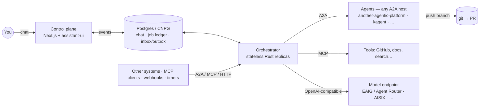

# another-agentic-system

A protocol-agnostic **orchestration layer** for multi-agent work. You start a
job from a chat — or another system starts one over A2A, MCP or a webhook.
Agents plan it, work it in parallel, verify it against real checks, review it,
and hand back a pull request. You read the chat surface.

> **Status: design only.** No code yet. Decisions are recorded as ADRs; what
> is not yet verified is listed in [open questions](docs/open-questions.md).

It hosts no agents. It drives anything that speaks A2A, uses tools over MCP,
reacts to webhooks, and can be driven the same way. Its processes are
stateless; the only durable state is the job ledger and event log (the chat)
in Postgres.

## In one picture

## Principles

1. **Protocols only** — no agent host, gateway product or SDK is a hard
   dependency. ([ADR 0007](docs/decisions/0007-protocol-only-dependencies.md))
2. **Stateless processes, one event log.**
   ([ADR 0001](docs/decisions/0001-rust-state-machine-on-postgres.md))
3. **Verification over consensus.**
   ([ADR 0002](docs/decisions/0002-verification-over-consensus.md))
4. **git is the artifact.**
   ([ADR 0003](docs/decisions/0003-git-as-durable-state-ephemeral-workers.md))
5. **The orchestrator never sees a protocol** — adapters around a pure core.
   ([orchestrator](docs/orchestrator.md))

## Documents

| Document | What it covers |
|---|---|
| [Architecture](docs/architecture.md) | Components, agent hosts, job flow and lifecycle, where it runs |
| [Orchestrator](docs/orchestrator.md) | Ports & adapters, event/command model, inbox/outbox, core types, data model, crate layout, testing |
| [MVP](docs/mvp.md) | Build order, smallest working loop first |
| [Open questions](docs/open-questions.md) | Open, closed, and moved to the platform |
| [Lessons from Agent Canvas](docs/lessons-from-agent-canvas.md) | What running OpenHands Agent Canvas taught us, as requirements |

### Decisions

| ADR | Decision |
|---|---|
| [0001](docs/decisions/0001-rust-state-machine-on-postgres.md) | Orchestrator is a Rust state machine on Postgres (not eve, not Restate) |
| [0002](docs/decisions/0002-verification-over-consensus.md) | Verification over consensus |
| [0003](docs/decisions/0003-git-as-durable-state-ephemeral-workers.md) | git is the durable artifact; workers are ephemeral |
| [0004](docs/decisions/0004-closed-enums-over-dyn-registry.md) | Protocols as closed enums, not a dynamic adapter registry |
| [0005](docs/decisions/0005-openai-compatible-model-endpoint.md) | Model access through any OpenAI-compatible endpoint |
| [0006](docs/decisions/0006-assistant-ui-external-store.md) | Chat surface: Next.js + assistant-ui with an external store |
| [0007](docs/decisions/0007-protocol-only-dependencies.md) | Protocol-only dependencies: an agnostic orchestration layer |
| [0008](docs/decisions/0008-platform-integration-via-a2a-extension.md) | Optional another-agentic-platform integration via an A2A extension |

## Related

- **another-agentic-platform** — the agent platform: versioned agent services,
  release channels, runtimes, harnesses. This system consumes it over A2A like
  any other host, with an optional release picker.
