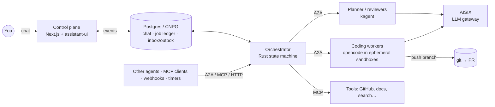

# another-agentic-system

A self-hosted multi-agent system. You start a job from a chat; agents plan it,
work it in parallel, verify it against real checks, review it, and hand back a
pull request. You read the chat surface.

> **Status: design only.** No code yet. Decisions are recorded as ADRs; what
> is not yet verified is listed in [open questions](docs/open-questions.md).

## In one picture

## Principles

1. **Verification over consensus** — quality comes from tests/CI, not from
   agents agreeing. ([ADR 0002](docs/decisions/0002-verification-over-consensus.md))
2. **State is explicit** — Postgres, git and caches; workers are ephemeral.
   ([ADR 0003](docs/decisions/0003-git-as-durable-state-ephemeral-workers.md))
3. **The orchestrator never sees a protocol** — anything in, anything out,
   through adapters around a pure core. ([orchestrator](docs/orchestrator.md))

## Documents

| Document | What it covers |
|---|---|
| [Architecture](docs/architecture.md) | Components and their roles, job flow, job lifecycle, where it runs |
| [Orchestrator](docs/orchestrator.md) | Ports & adapters, event/command model, inbox/outbox, core types, data model, crate layout, testing |
| [MVP](docs/mvp.md) | Build order, smallest working loop first |
| [Open questions](docs/open-questions.md) | What is unverified or undecided, and how to close each |
| [Lessons from Agent Canvas](docs/lessons-from-agent-canvas.md) | What running OpenHands Agent Canvas taught us, as requirements |

### Decisions

| ADR | Decision |
|---|---|
| [0001](docs/decisions/0001-rust-state-machine-on-postgres.md) | Orchestrator is a Rust state machine on Postgres (not eve, not Restate) |
| [0002](docs/decisions/0002-verification-over-consensus.md) | Verification over consensus |
| [0003](docs/decisions/0003-git-as-durable-state-ephemeral-workers.md) | git is the durable artifact; workers are ephemeral |
| [0004](docs/decisions/0004-closed-enums-over-dyn-registry.md) | Protocols as closed enums, not a dynamic adapter registry |
| [0005](docs/decisions/0005-aisix-gateway.md) | AISIX as the single LLM gateway |
| [0006](docs/decisions/0006-assistant-ui-external-store.md) | Chat surface: Next.js + assistant-ui with an external store |
