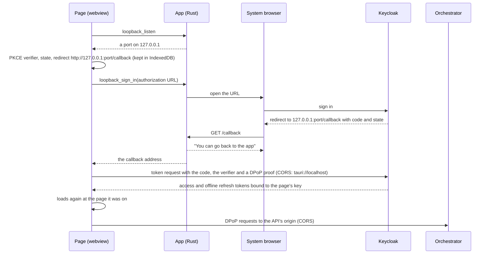

# Desktop app

The chat in a window of its own ([ADR 0047](../../docs/decisions/0047-one-ui-for-web-desktop-and-mobile-each-signs-in-as-a-public-oauth-client.md)):
the web's static export ([`web/README.md`, "Static export"](../../web/README.md#static-export)) packed into a [Tauri 2](https://v2.tauri.app/)
app. It is the same UI, the same API and the same tokens as the browser web in browser mode
([ADR 0054](../../docs/decisions/0054-the-web-holds-its-own-tokens-dpop-bound-in-indexeddb.md)); only the sign-in and the address
of the API differ. Linux is built in CI; macOS and Windows build from the same sources (*unverified*: not run).

| Path | What |
|---|---|
| `scripts/build-web.mjs` | builds the web's export into `web/out-tauri` and writes its `config.json`: `apiOrigin` (`AGENTIC_API_ORIGIN`, default `https://agentic.servers.segning.pro`), `clientId` (`another-agentic-desktop`), `signIn: loopback` |
| `src-tauri/tauri.conf.json` | the window, the bundle, and the content security policy: `connect-src` names the API and the issuer, change both with the deployment |
| `src-tauri/src/assets.rs` | `/threads/<id>` and `/s/<token>` answered with their shells, as the web image's Caddy does (Tauri would fall back to `index.html`) |
| `src-tauri/src/loopback.rs` | the sign-in's listener on `127.0.0.1` and the system browser (below) |
| `src-tauri/icons/` | made from `web/public/brand/icon-512.png` with `pnpm tauri icon` |

## Build

```sh
sudo apt-get install libwebkit2gtk-4.1-dev librsvg2-dev libxdo-dev libssl-dev   # Linux, once (Tauri's prerequisites)
cd apps/tauri
pnpm install
pnpm build:debug        # the web for the app, then a debug .deb: src-tauri/target/debug/bundle/deb/
pnpm build              # release .deb and AppImage (what CI keeps: .github/workflows/desktop.yml)
cd src-tauri && cargo test --locked
```

For another deployment: `AGENTIC_API_ORIGIN=https://chat.example.com pnpm build` and the same origin (and its issuer) in
`tauri.conf.json`'s `connect-src` (or `pnpm tauri build --config …`).

## What the deployment needs

1. The Keycloak client [`deploy/keycloak/client-another-agentic-desktop.json`](../../deploy/keycloak/client-another-agentic-desktop.json): public, PKCE S256,
   DPoP-bound tokens, the redirect `http://127.0.0.1/callback` (Keycloak matches it with any port: RFC 8252 section 7.3) and the web origins
   `tauri://localhost`, `http://tauri.localhost` and `https://tauri.localhost` (what lets the page call the token endpoint).
2. The chart in browser mode, with `orchestrator.cors.allowedOrigins: [tauri://localhost, http://tauri.localhost]`
   ([`deploy/chart/README.md`, "Calls from the desktop app"](../../deploy/chart/README.md#calls-from-the-desktop-app)), and an orchestrator image
   that has `server.cors`.

## Signing in

```mermaid
stateDiagram-v2
  [*] --> signed_out
  signed_out --> listening: Sign in (loopback_listen)
  listening --> in_browser: loopback_sign_in opens the browser
  in_browser --> signed_in: callback, state checked, code exchanged
  in_browser --> signed_out: refused, abandoned (5 minutes) or a state the page did not make
  signed_in --> signed_in: refresh (rotated), once, under a Web Lock
  signed_in --> signed_out: Sign out (revoked; the issuer's page opens in the browser)
```





Once signed in, the page loads itself again where it was, as a browser's page does after the callback (what asked for a session before there was
one waits for that load); a sign-in from the banner of a session that ended keeps the page, as the browser's popup does. The page keeps what it keeps in a browser: a non-extractable DPoP key and the tokens in IndexedDB, in the webview's own profile. The app's
process makes no request to the issuer and never sees a token; it only listens on the loopback address for one `GET /callback`, which it
refuses for any other path or method, and opens an https address (or http on this machine) in the browser. The `state` and PKCE stop a forged
callback from another local process. Signing out revokes the refresh token from the page and opens the issuer's end-session page in the browser,
never in the app. Why the webview's IndexedDB and not the OS keychain: [ADR 0047, Amendment (2026-10-09): the desktop app](../../docs/decisions/0047-one-ui-for-web-desktop-and-mobile-each-signs-in-as-a-public-oauth-client.md#amendment-2026-10-09-the-desktop-app).

## Tests

`cargo test --locked` in `src-tauri`: the shells' mapping (`assets.rs`: a thread, its data and its segment files to `/threads/_`, a share link to
`/s/_`, everything else itself), and the listener's (`loopback.rs`: only a `GET /callback` is the callback; only https, or http on this machine, is
opened). The page's side is `web/src/lib/auth/desktop.test.ts` (the loopback redirect, the code exchanged with a proof, the page loaded again or kept,
a refusal storing nothing, signing out in the browser).

**The app against the web's mock**, by hand (run 2026-10-09 on Linux under Xvfb, with `curl` as the browser): the mock is the issuer and the API
(`web/README.md`, the mock's browser mode) with the loopback redirect and the webview's CORS switched on, and the app is built for it:

```sh
cd web && MOCK_BROWSER_AUTH=1 MOCK_LOOPBACK=1 MOCK_PUBLIC_ORIGINS=tauri://localhost,http://127.0.0.1:4010 \
  MOCK_CORS_ORIGINS=tauri://localhost pnpm mock &
cd apps/tauri && AGENTIC_API_ORIGIN=http://127.0.0.1:4010 AGENTIC_CLIENT_ID=another-agentic-web pnpm tauri build --debug --no-bundle \
  --config "{\"app\":{\"security\":{\"csp\":{\"connect-src\":\"'self' ipc: http://ipc.localhost http://127.0.0.1:4010\"}}}}"
src-tauri/target/debug/another-agentic
```

The app shows the sign-in screen; **Sign in** opens the browser at the mock's authorization endpoint, which sends it back to the app's listener;
the app then shows the chat, and `GET /__mock/issuer?session=default` counts one code grant and the API's requests, none refused.

## Not yet

- **Signing and distribution**: the bundles are unsigned, and nothing is published (no updater, no store).
- **Mobile** (ADR 0047: an in-app browser tab, app links): not scaffolded. The next slice needs `tauri android init` and `tauri ios init`, the
  Android SDK and NDK in CI (iOS needs a macOS runner and an Apple team), a sign-in through `ASWebAuthenticationSession` and Custom Tabs
  with a claimed https link or the custom scheme `com.vymalo.agentic:/oauth2/callback`, the static server's `/.well-known/assetlinks.json` and
  `apple-app-site-association`, Keycloak clients `another-agentic-ios` and `another-agentic-android`, and the Android origin
  `http://tauri.localhost` in `server.cors.allowedOrigins`. Whether streaming `fetch` works in the mobile webviews is *unverified*.
- **Choosing the deployment** at the first start: the API's origin is fixed when the app is built.
