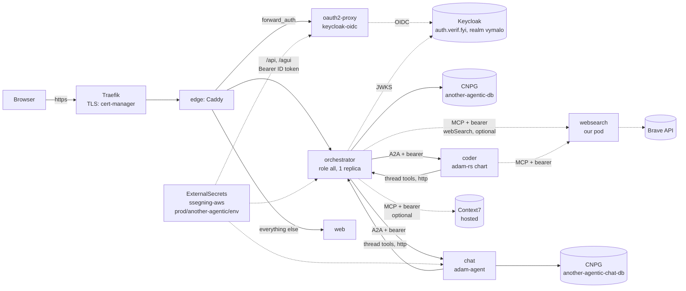
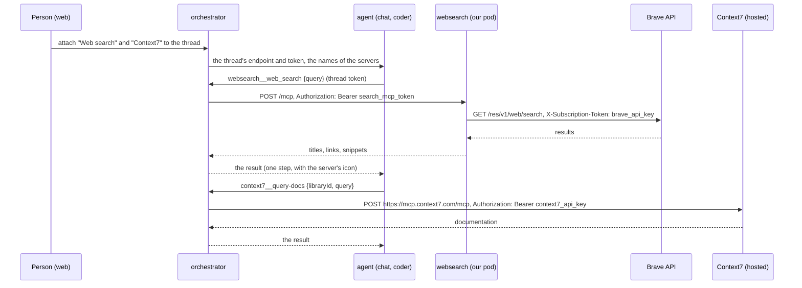
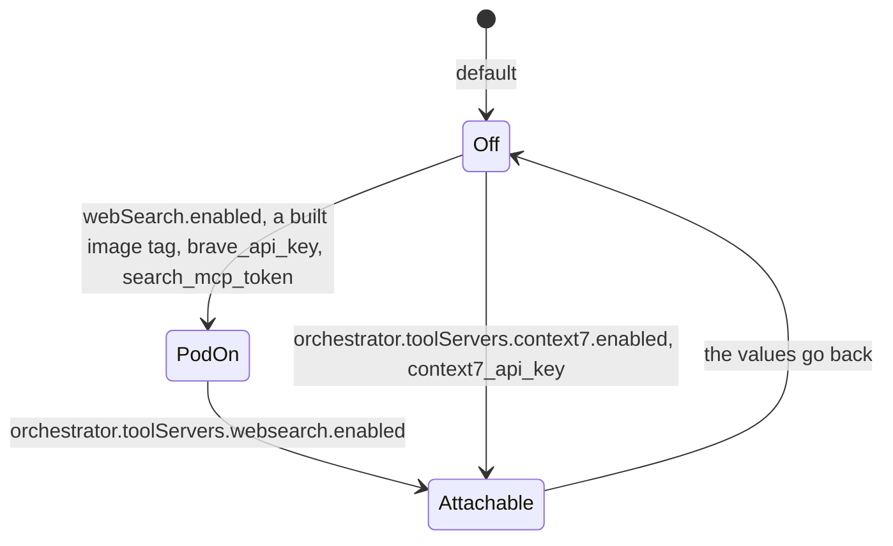

# another-agentic-system chart

The orchestration layer for a real deployment, on the `netcup-k8s` cluster: the orchestrator, the chat web,
oauth2-proxy, a Caddy edge behind a Traefik `Ingress`, a CloudNativePG database and the `chat` agent, with every secret
read from AWS Secrets Manager by External Secrets. The decision is
[ADR 0041](../../docs/decisions/0041-deployed-with-helm-on-kubernetes-secrets-by-externalsecret.md). Argo CD (home-os)
tracks this repository's `HEAD` at `deploy/chart`; the deployment's own values are the Application's `helm.valuesObject`
([`examples/netcup.values.yaml`](examples/netcup.values.yaml)). The coder is **not** here: it is deployed by adam-rs's chart
(`deploy/coder`, release `coder`, the same namespace) and named in `agents` by its card URL.



| Object | What |
|---|---|
| `Deployment` orchestrator | one process, `server.role: all`; **one replica, `Recreate`** (the artifact store is a directory on a ReadWriteOnce volume, [ADR 0032](../../docs/decisions/0032-files-from-agents-live-in-an-artifact-store.md)); uid 65532, read-only root; probes `/healthz`, `/readyz` (503 until the issuer's keys are fetched); restarts on a new ConfigMap |
| `ConfigMap` orchestrator | `config.yaml` and `agents.yaml`; no secret in it, only `{ file }`/`{ env }` references; `server.environment: production`, `auth.mode: jwt`, `defaultRole: null` are not values |
| `PersistentVolumeClaim` | `<fullname>-artifacts`, kept when the release goes (`helm.sh/resource-policy: keep`, Argo `Delete=false,Prune=false`) |
| `Deployment` web | the Next.js standalone image, built with `NEXT_PUBLIC_SIGN_IN_PATH=/oauth2/start` ([`web.yml`](../../.github/workflows/web.yml)) |
| `Deployment` oauth2-proxy | `v7.15.5`, provider `keycloak-oidc`, auth_request mode, secrets from the environment |
| `Deployment` edge + `ConfigMap` | Caddy 2.11.4, [`files/Caddyfile`](files/Caddyfile), `NET_BIND_SERVICE` added to the dropped capabilities |
| `Ingress` | Traefik, host `host`, TLS from the `cert-manager` issuer `ingress.clusterIssuer` |
| `Cluster` (CNPG) ×2 | the orchestrator's, and the chat agent's own; the connection string is the `uri` key of `<cluster>-app` |
| `ExternalSecret` ×3 | `ssegning-aws` / `prod/another-agentic/env`: [the properties](#the-aws-secret) |
| `Deployment` chat + `ConfigMap` | `adam-agent` (the adam image, entrypoint replaced) over [`files/chat/instructions.md`](files/chat/instructions.md), a copy of `dev/agents/chat/agent/instructions.md` that CI keeps equal |
| `Deployment` + `Service` websearch, `ExternalSecret`, `NetworkPolicy` | **off by default** (`webSearch.enabled`): [our search pod](#web-search-and-context7), `dev/searxng-mcp` on Brave; uid 1000, read-only root; probes `/healthz`; a fourth ExternalSecret and a sixth NetworkPolicy when on |
| `NetworkPolicy` ×5 | ingress to each pod only from the pods that need it; egress open (the search pod's is closed: DNS and the public internet) |

```sh
# Needs helm 3.19 (CI's version), nothing else. The chart refuses to render without a host and an issuer.
helm lint deploy/chart -f deploy/chart/examples/netcup.values.yaml
helm template another-agentic-system deploy/chart --namespace another-agentic-system -f deploy/chart/examples/netcup.values.yaml
sh deploy/chart/tests/render-check.sh                     # the guarantees, asserted on the render and on the refusals
sh deploy/chart/tests/bump-tag-test.sh                    # the tag bump
sh deploy/chart/tests/print-config.sh deploy/chart/examples/netcup.values.yaml bin ./orchestrator            # a local binary reads the rendered configuration
sh deploy/chart/tests/print-config.sh deploy/chart/examples/netcup.values.yaml docker ghcr.io/vymalo/another-agentic-system/orchestrator:sha-d44f285   # CI's form
```

## The AWS secret

One AWS Secrets Manager secret, **`prod/another-agentic/env`** (region `eu-central-1`, in the account behind
`ClusterSecretStore` `ssegning-aws`), a JSON object with these properties. The names are values
(`externalSecrets.properties`, `externalSecrets.agentTokens`), so a rename is a values change.

| Property | Value | Read by | How it is mounted |
|---|---|---|---|
| `thread_tools_secret` | at least 32 random bytes (`openssl rand -hex 32`) | orchestrator | Secret `another-agentic-orchestrator`, key `thread-tools-secret`, **file** `/run/secrets/orchestrator/thread-tools-secret` → `threadTools.secret: { file }` |
| `model_api_key` | the gateway's key | orchestrator (with `model.baseUrl`); chat; the coder's chart (`externalSecrets.properties.modelApiKey`) | orchestrator: file `/run/secrets/orchestrator/model-api-key` → `models.endpoints.default.apiKey: { file }`; chat: Secret `another-agentic-chat`, env `MODEL_API_KEY` |
| `oauth2_client_secret` | the Keycloak client's secret (Credentials tab) | oauth2-proxy | Secret `another-agentic-oauth2-proxy`, env `OAUTH2_PROXY_CLIENT_SECRET` |
| `oauth2_cookie_secret` | 32 random bytes, 16, 24 or 32 characters (`openssl rand -hex 16`) | oauth2-proxy | the same Secret, env `OAUTH2_PROXY_COOKIE_SECRET` |
| `coder_a2a_token` | one token of at least 32 bytes | orchestrator; **the coder's chart** (`externalSecrets.properties.a2aBearerTokens: coder_a2a_token`, its `A2A_BEARER_TOKENS`, a list of one) | orchestrator: Secret `another-agentic-orchestrator`, key and env `CODER_A2A_TOKEN` (the agents file names it in `tokenEnv`: it has no file form) |
| `chat_a2a_token` | one token of at least 32 bytes | orchestrator; chat | orchestrator: env `CHAT_A2A_TOKEN`; chat: Secret `another-agentic-chat`, env `A2A_BEARER_TOKENS` |
| `brave_api_key` | the Brave Search API's subscription token | **the search pod only**, with `webSearch.enabled` | Secret `another-agentic-websearch`, env `BRAVE_API_KEY` |
| `search_mcp_token` | at least 32 random bytes (`openssl rand -hex 32`): the bearer that guards the search pod | the search pod; the orchestrator (with `toolServers.websearch`); **the coder's chart** (its own property: added by [vymalo/another-adam-rs#84](https://github.com/vymalo/another-adam-rs/pull/84), not merged when this was written) | the pod: Secret `another-agentic-websearch`, env `SEARCH_MCP_TOKEN`; the orchestrator: key `search-mcp-token`, **file** `/run/secrets/orchestrator/search-mcp-token` → `toolServers[websearch].bearer: { file }` |
| `context7_api_key` | Context7's API key | orchestrator, with `toolServers.context7` | key `context7-api-key`, **file** `/run/secrets/orchestrator/context7-api-key` → `toolServers[context7].bearer: { file }` |
| `github_app_private_key` | the GitHub App's PEM | **the coder's chart** only (not this one) | a Secret `coder-github-app`, key `private-key.pem`, which adam-rs's chart mounts: [the coder](#the-coder) |

Not in AWS: the databases' URLs (CloudNativePG makes `<cluster>-app` Secrets), the images' pull credentials (the images
are public), Cloudflare's token (cert-manager's, `prod/meta/test-app`). Not secret, so values: the host, the issuer, the
Keycloak client **id** (`auth.clientId`), the GitHub App's id and the accounts it may act for (`owners`).

A value changes in AWS, ESO copies it within `externalSecrets.refreshInterval` (1 h), and **the pods read it once, at
startup**: after a rotation, `kubectl -n another-agentic-system rollout restart deploy/another-agentic-orchestrator
deploy/another-agentic-oauth2-proxy deploy/another-agentic-chat` (and `deploy/another-agentic-websearch` when it is on; after a change of
`search_mcp_token`, the coder's pod too, once its chart reads it). (The pod templates carry a checksum of the rendered
ExternalSecret, which changes when its shape does, not when a value does.) Later properties, with the PRs that bring them:
`sharing_secret` (sharing), `webhook_github_secret` (the CI webhook), `artifacts_s3_access_key_id` and
`artifacts_s3_secret_access_key` (S3 artifacts).

## Values

The deployment's own values have no default and are refused when empty. Every key is in [`values.yaml`](values.yaml),
commented; the ones that matter:

| Key | Default | What |
|---|---|---|
| `host` | **required** | the public hostname, no scheme: the Ingress, the redirect URL, `server.publicUrl` |
| `auth.issuer` | **required** | the OIDC issuer, https, no trailing slash |
| `auth.clientId` | `another-agentic` | the Keycloak client: oauth2-proxy's `--client-id`, the default audience, `--allowed-role=<clientId>:<allowedRole>` |
| `auth.audiences`, `userClaim`, `rolesClaim`, `allowedRole` | `[]` (= the client id), `email`, `agentic_roles`, `user` | `auth.jwt.*` of the orchestrator |
| `auth.roles` | `user`, `admin`, both `scope: own` and both holding `thread.delete` | `auth.roles` of the orchestrator; a scope of `any` is refused. **A role you write yourself does not get `thread.delete` by itself** ([ADR 0043](../../docs/decisions/0043-deleting-a-thread-erases-it.md)): without it a person cannot delete a thread (403), which is how a legal hold is made, and the operator then erases them |
| `model.baseUrl`, `model.timeoutSecs` | `""`, 20 | one OpenAI-compatible endpoint with `/v1`; empty: no titles, no chat agent |
| `orchestrator.image.tag` | a `sha-<7>` | **bumped by CI**; `web.image.tag` too |
| `orchestrator.surfaces` | `[agui, thread-tools]` | others are refused until the edge routes them |
| `orchestrator.tasks.title.model`, `description.model` | `""` | the model's name at `model.baseUrl`; empty: off |
| `orchestrator.artifacts.size`, `storageClass` | `5Gi`, `longhorn` | the files agents hand over |
| `agents` | the coder, then the chat | `agents.yaml`; a list is replaced as a whole by an override; `cardUrl` is a template |
| `chat.enabled`, `chat.model`, `chat.image` | `true`, `""` (**required** when enabled), the adam image by tag and digest | the chat agent |
| `oauth2Proxy.image`, `edge.image`, `chat.image` | tag **and** digest | third-party images; never `latest` |
| `oauth2Proxy.cookieRefresh`, `cookieExpire` | `10m`, `12h` | the refresh must be shorter than the access token's lifespan (15 minutes, [`deploy/keycloak`](../keycloak/README.md)) |
| `ingress.clusterIssuer`, `className` | `cert-cloudflare`, `traefik` | the certificate's issuer |
| `database.*`, `chat.database.*` | 1 instance, `longhorn`, 10Gi / 2Gi | the CNPG Clusters |
| `externalSecrets.*` | `ssegning-aws`, `prod/another-agentic/env`, 1 h | the store, the AWS secret, the property of each value |
| `webSearch.enabled`, `webSearch.image.tag`, `webSearch.allowFrom`, `webSearch.egressExcept`, `egressExceptV6`, `webSearch.replicas`, `webSearch.resources` | `false`, `sha-0000000` (**bumped by CI** with the first image), the coder's pods (`app.kubernetes.io/instance: coder`), the private ranges, the same for IPv6, 1, 25m/64Mi and 256Mi | the [search pod](#web-search-and-context7); the placeholder tag is refused with `enabled: true` |
| `orchestrator.toolServers.websearch.*`, `.context7.*` | `enabled: false` each; name, description, icon, `tools`, `agents` (empty: every agent), `timeoutSecs: 60`; Context7's `url` | `toolServers` of the orchestrator's configuration: absent unless one is enabled |
| `externalSecrets.properties.braveApiKey`, `searchMcpToken`, `context7ApiKey` | `brave_api_key`, `search_mcp_token`, `context7_api_key` | the [three new properties](#the-aws-secret); read only by what is turned on |
| `networkPolicy.*` | on | `ingressControllerNamespace` limits the edge to Traefik's namespace; `orchestratorFrom` lists the agents of other charts |

## Web search and Context7

Two tools a person can attach to a conversation ([ADR 0024](../../docs/decisions/0024-mcp-tools-attached-per-conversation.md);
`toolServers` of [the configuration](../../docs/api/config.md#toolservers)), **off by default**. The orchestrator relays the calls
and holds both keys; an agent is told the names of the attached servers and a per-thread endpoint, and never sees a key.





### What a deployment sets

```yaml
# 1. the search pod (after the first build of the image: see "The image")
webSearch:
  enabled: true
  image: { tag: sha-xxxxxxx }          # CI bumps this in the chart's values.yaml; a value here only pins another build
  # allowFrom: [{ podSelector: { matchLabels: { app.kubernetes.io/instance: coder } } }]   # the default
orchestrator:
  toolServers:
    # 2. offered to people: our search pod, over its Service, bearer search_mcp_token
    websearch: { enabled: true }       # agents: [chat, coder] to narrow it; tools: [web_search] to withhold `fetch`
    # 3. offered to people: Context7 directly, bearer context7_api_key
    context7: { enabled: true }
```

The pieces are independent except that `websearch` needs the pod (`webSearch.enabled`), which the chart enforces. The AWS secret
needs `brave_api_key` and `search_mcp_token` for the pod, `search_mcp_token` for `websearch`, `context7_api_key` for `context7`.
With none enabled the rendered configuration has **no `toolServers` key**, and the render is the one of a chart without this section.

**Order of operations.** (1) Put the property in the AWS secret first (`brave_api_key`, `search_mcp_token`, `context7_api_key`, as
needed). (2) Only then enable the server in the Application's values. (3) Watch the ExternalSecrets go to `SecretSynced`
(`kubectl -n another-agentic-system get externalsecret`). The orchestrator's own ExternalSecret reads the new key: a property that
does not exist in AWS makes that whole ExternalSecret fail, its Secret is not updated, and the orchestrator, one replica with
`Recreate`, cannot start the new pod that mounts the missing key and stays down until the property exists. Enabling first and
creating the property after is the outage; the other order is not.

The chart also refuses, at render time, what the orchestrator would refuse at startup (an `agents` id that is not in `agents`, a
`timeoutSecs` outside 1 to 600, a blank name, a tool name or icon the relay cannot use), so such a value is a failed sync of the
chart and not a crashed orchestrator. A plain-`http://` URL with a credential is not refused by the orchestrator, only noted: at
startup it logs a warning that names the server (`websearch`: the bearer travels over in-cluster plain http to our own pod, which
is the design here, and the warning is expected; Context7 is https and has none).

### The search pod

`dev/searxng-mcp` (the dev stack's search server; provider `brave`, the key in `BRAVE_API_KEY`). **Where the coder calls it:**
`http://another-agentic-websearch.<namespace>.svc:8080/mcp` (Service `another-agentic-websearch`, port 8080, path `/mcp`,
MCP over Streamable HTTP, plain request and JSON answer, no session), header `Authorization: Bearer <search_mcp_token>`. Its tools
are `web_search {query, limit?}` and `fetch {url}`. `/healthz` (the probes) needs no token; `/mcp` without it is 401, and the server
refuses to start without `SEARCH_MCP_TOKEN`. The coder's chart is to read the same property for its own bearer (added by [vymalo/another-adam-rs#84](https://github.com/vymalo/another-adam-rs/pull/84), not merged when this was written).

`fetch` is the dangerous tool (the server fetches a URL a model chose): it refuses loopback, private, link-local (the metadata
address) and reserved addresses, on the address it connects to, and reads at most 2 MiB of text. The chart's NetworkPolicy adds a
second wall:

| Direction | Allowed |
|---|---|
| In | the orchestrator's pods, and `webSearch.allowFrom` (default: pods with `app.kubernetes.io/instance: coder` in this namespace; any `NetworkPolicyPeer`, so a `namespaceSelector` works for another one), TCP 8080 |
| Out | DNS (53), and TCP 443 and 80 to the public internet **except** `webSearch.egressExcept` (default `10/8`, `100.64/10`, `127/8`, `169.254/16`, `172.16/12`, `192.168/16`) and `egressExceptV6` (`fc00::/7`, `fe80::/10`, and the IPv4-mapped `::ffff:0:0/96` and NAT64 `64:ff9b::/96` forms): not the cluster's pods and services when they sit in those ranges, not the metadata address |

A NetworkPolicy cannot name a host, so "only `api.search.brave.com`" cannot be written: `fetch` has to reach any public page.
**The node addresses are not excluded by default**, and netcup's nodes are reported to have public IPs (*unverified* here), so the pod could reach a node's public
address on 443 or 80: add the nodes' addresses (and any other public range of the cluster) to `webSearch.egressExcept`, repeating
the defaults (a list is replaced as a whole). Whether the cluster's CNI enforces egress policy, and whether DNS on port 53 is the
cluster's only resolver path, is *unverified* here.

`allowFrom` selects the coder by **instance** (`app.kubernetes.io/instance: coder`), while `networkPolicy.orchestratorFrom` selects it by
**name** (`app.kubernetes.io/name: coder`). In adam-rs's chart a single-pod coder has name `coder` and instance `coder`; in the split
topology the workers keep the name `coder` and the front pods are named `coder-front`, all with instance `coder`. The thread tools are
called by the pod named `coder` only, so that rule stays narrow; the search is offered to the release's every pod, so a front pod that
runs a tool is not locked out. (Labels read in `deploy/coder/templates/_helpers.tpl` of adam-rs, 2026-10-04.)

### The image

`ghcr.io/vymalo/another-agentic-system/searxng-mcp`, built from `dev/searxng-mcp` by
[`searxng-mcp.yml`](../../.github/workflows/searxng-mcp.yml): `node --test`, a build smoke-tested before it is pushed (uid 1000,
`/healthz`, `/mcp` refused with no bearer, both tools listed, no start without a token), then on `main` the tags `sha-<7>` and
`latest`, and the bump of `webSearch.image.tag` (`bump-tag.sh <values> webSearch <tag>`) as `orchestrator.yml` and `web.yml` do for
theirs. **The first tag exists when this change is merged to `main`** (the workflow runs on its own file); until then
`webSearch.image.tag` is `sha-0000000`, which the chart refuses to render with `enabled: true`, so Argo CD at `HEAD` stays valid with
the section off, and cannot be pointed at an image that does not exist. A new GHCR package is private until its visibility is set:
check an anonymous pull (the command of [`another-agentic-images`](https://github.com/vymalo/another-agentic-images)'s guide) before enabling.

### Context7

Reached directly, over https, from the orchestrator. *Verified 2026-10-04* (Context7's README, <https://github.com/upstash/context7>,
and its client guide, <https://context7.com/docs/resources/all-clients>): the remote MCP endpoint is `https://mcp.context7.com/mcp`,
the API key goes in the header `Authorization: Bearer <key>` (the same pages name an OAuth endpoint, `https://mcp.context7.com/mcp/oauth`,
which this chart does not use), and the server exposes two tools, `resolve-library-id` (a library name to a Context7 id) and
`query-docs` (documentation for a library id and a question): those are the `tools` allow-list. The orchestrator sends the
key from `toolServers[context7].bearer`, a `{ file }` reference; the chart refuses a non-https URL for it. *Unverified*: the
orchestrator's MCP client against the live hosted endpoint (the relay is tested against a local MCP server), and the quota of the
key.

### The pinned orchestrator image

The chart check renders the configuration and has the orchestrator image pinned in `values.yaml` read it
(`tests/print-config.sh`, [`deploy.yml`](../../.github/workflows/deploy.yml)). `toolServers` has been in the configuration since
slice 8 ([ADR 0024](../../docs/decisions/0024-mcp-tools-attached-per-conversation.md#status-note-2026-10-02-the-relay-is-built)), and
the tag pinned in `values.yaml` (`orchestrator.image.tag`) contains it (that commit is a descendant of the one that introduced the key,
*verified 2026-10-04* in the repository's history; a bump only moves forward); the image has the relay (`tool-relay` is a default feature of the binary and the Dockerfile builds the defaults). Still,
the default render carries no `toolServers`, and CI reads the key through the pinned image with both servers on, so a later chart
change cannot write a key an older image refuses unnoticed. The same check guards `thread.delete` in the roles: the pinned image has
read it since `sha-5a0c152` ([ADR 0043](../../docs/decisions/0043-deleting-a-thread-erases-it.md)), and an older one refuses it.

## What the owner does

1. **Create the AWS secret** `prod/another-agentic/env` with the [properties above](#the-aws-secret) (the GitHub App's PEM
   too, for the coder). The model's key is the gateway's.
2. **Keycloak** (admin console, realm `vymalo`): follow [`deploy/keycloak/README.md`](../keycloak/README.md): the client, its
   roles, the groups, the users (Email verified on); copy the client's secret into `oauth2_client_secret`.
3. **DNS**: a record for `host` (`agentic.servers.segning.pro`) to the netcup node IPs that serve Traefik's host port 443,
   DNS only (grey cloud) at first, so long streams are not subject to a proxy's timeouts (*unverified*). `cert-cloudflare`
   answers a DNS-01 challenge with its Cloudflare token: whether that token can edit the zone `segning.pro` is *unverified*;
   if not, give it the zone, or name another issuer in `ingress.clusterIssuer`.
4. **Verify that netcup serves a public port 443**: no public hostname has ever been served from it, and the nodes' IPs
   may be in NetBird's range. `kubectl --context admin@netcup get nodes -o wide` for the addresses, then from outside the
   cluster's network `curl -kI https://<node ip>/` (Traefik answers 404 for an unknown host), and look at the provider's
   firewall. If it fails: a `cloudflared` tunnel in the namespace (no inbound port), or the edge on another cluster.
5. **home-os** (a PR there, not here): an AppProject that lets this repository and adam-rs's deploy to `netcup-k8s`'s
   namespace `another-agentic-system`, and the Applications `another-agentic-coder` (adam-rs `deploy/coder`) and
   `another-agentic-system` (this chart, `HEAD`, `path: deploy/chart`, the values of
   [`examples/netcup.values.yaml`](examples/netcup.values.yaml) with the real model), `CreateNamespace=true`,
   `ServerSideApply=true`, the namespace labelled for Pod Security `restricted` (the coder may need `baseline`).

### The first sync

Expect, in this order: the ExternalSecrets `SecretSynced` (else the AWS secret or one property is missing: the event
names it); the CNPG Clusters healthy; the orchestrator `Ready` (its log says a refused configuration, exit 78, with the key; `/readyz` stays 503
until Keycloak's keys are fetched); the certificate issued; `https://<host>/` redirecting to Keycloak. Then
[the live checks of the plan](../../docs/decisions/0041-deployed-with-helm-on-kubernetes-secrets-by-externalsecret.md#verified-and-unverified)
(sign in, `GET /api/me`, a second person cannot open the first one's thread, a chat message, the coder).

## The coder

Deployed by adam-rs's chart as the Application `another-agentic-coder`, release `coder`, so its Service is
`coder.<namespace>.svc:8080`, which the default `agents` entry names. What its values set for this deployment:

```yaml
externalSecrets:
  key: prod/another-agentic/env
  properties: { modelApiKey: model_api_key, githubToken: null, a2aBearerTokens: coder_a2a_token }
github:
  auth: app
  app: { id: "<app id>", owners: ["<account>", "<account>"], privateKeySecret: coder-github-app }
config:
  modelBaseUrl: <the gateway, with /v1>
  model: <alias>
  opencodeModel: <alias>
  prDraft: true
  extraEnv: { MCP_ALLOW_INSECURE: "true" }   # the thread tools are plain http inside the cluster
```

`owners` are the accounts (users and organisations) the coder may act for: with it the App is **not pinned** to an installation
and the coder finds the installation of each repository's owner with the App's key (adam-rs
[ADR 0017](https://github.com/vymalo/another-adam-rs/blob/main/docs/decisions/0017-a-github-app-works-on-every-account-it-is-installed-on.md)),
so one deployment works on several accounts. Exactly one of `owners` and `installationId` (a pin: one installation serves every
repository) is set: both, or neither, and adam-rs's chart fails to render. There is no default list, because a public App can be installed
by anyone; for an account other than the App owner's, the App has to be **public** (a private App can be installed only on its owner's
account: GitHub's documented behaviour, *unverified* here). The coder reads GitHub through the GitHub MCP server as a **sidecar** of its pod, over http, with no credential
of its own (the coder sends the token of each call); the sidecar is a Kubernetes native sidecar (an init container with
`restartPolicy: Always`), so the cluster needs **Kubernetes 1.29 or later** (*unverified*, from adam-rs's chart README: native
sidecars are beta and on by default from 1.29). The Secret `coder-github-app` (key `private-key.pem` from the AWS property `github_app_private_key`) is not made by either
chart: an ExternalSecret in home-os next to the Application (the ARC pools' `rawResources` pattern), or a small optional
ExternalSecret added to adam-rs's chart. Its NetworkPolicy already allows the namespace `another-agentic-system`; this
chart's `networkPolicy.orchestratorFrom` lets the coder's pods (`app.kubernetes.io/name: coder`) call the thread tools.

## Not in v0

Backups of the databases (barman-cloud; recommended before inviting more than a handful of people); a NetworkPolicy for
the databases (CloudNativePG's operator and instances talk to each other, and the operator's namespace was not verified);
S3 for the artifacts and a split into a control plane and workers; the MCP surface and the CI webhooks (they need keys, a
route that skips sign-in and a decision on the edge); sharing (the edge will need routes that skip sign-in, the Caddyfile
says where); the researcher and its search; metrics (netcup has no Prometheus; the logs are JSON on stdout); a deletion of
a person's threads (open question 28 and 46); Redis for oauth2-proxy's sessions (the cookie store is used, which splits
large cookies; the size with three tokens is *unverified*).

## Unverified

Marked here because nothing in CI can show it: that `web` runs with a read-only root filesystem and `emptyDir`s at `/tmp` and
`/app/.next/cache`; that the adam image's `adam-agent` takes `LISTEN_ADDR` and `PUBLIC_URL` as the coder does (its README
and compose say so); the resource sizes (starting points, not measurements); that Traefik's `X-Forwarded-Proto` reaches
oauth2-proxy through Caddy as `trusted_proxies static private_ranges` intends; that oauth2-proxy's `--allowed-role` reads the
client role from the access token Keycloak's `roles` scope fills (the realm's scopes may differ); that `main` accepts the
bump's push from `github-actions`.
