# another-agentic-system chart

The orchestration layer for a real deployment, on the `netcup-k8s` cluster: the orchestrator, the chat web,
oauth2-proxy, a Caddy edge behind a Traefik `Ingress`, one CloudNativePG cluster and the `chat` agent, with every secret
read from AWS Secrets Manager by External Secrets. The decision is
[ADR 0041](../../docs/decisions/0041-deployed-with-helm-on-kubernetes-secrets-by-externalsecret.md). Argo CD (home-os)
tracks this repository's `HEAD` at `deploy/chart`; the deployment's own values are the Application's `helm.valuesObject`
([`examples/netcup.values.yaml`](examples/netcup.values.yaml)). The coder is **not** here: it is deployed by adam-rs's chart
(`deploy/coder`, release `coder`, the same namespace) and named in `agents` by its card URL.

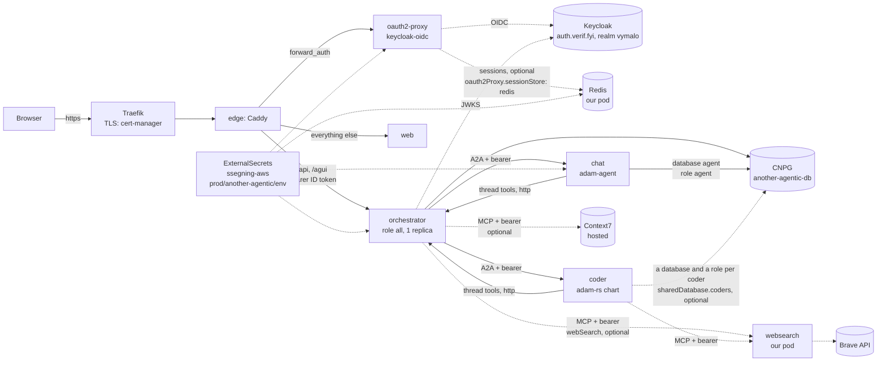

| Object | What |
|---|---|
| `Deployment` orchestrator | one process, `server.role: all`; **one replica, `Recreate`** (the artifact store is a directory on a ReadWriteOnce volume, [ADR 0032](../../docs/decisions/0032-files-from-agents-live-in-an-artifact-store.md)); uid 65532, read-only root; probes `/healthz`, `/readyz` (503 until the issuer's keys are fetched); restarts on a new ConfigMap |
| `ConfigMap` orchestrator | `config.yaml` and `agents.yaml`; no secret in it, only `{ file }`/`{ env }` references; `server.environment: production`, `auth.mode: jwt`, `defaultRole: null` are not values |
| `PersistentVolumeClaim` | `<fullname>-artifacts`, kept when the release goes (`helm.sh/resource-policy: keep`, Argo `Delete=false,Prune=false`); not rendered with [`orchestrator.artifacts.store: s3`](#artifacts-in-s3-and-rustfs) |
| `Deployment` web | the web's static export served by Caddy ([`web/Caddyfile`](../../web/Caddyfile): the shells of `/threads/*` and `/s/*`, the headers and the content security policy's header half), built with `NEXT_PUBLIC_SIGN_IN_PATH=/oauth2/start` ([`web.yml`](../../.github/workflows/web.yml)) |
| `Deployment` oauth2-proxy | `v7.15.5`, provider `keycloak-oidc`, auth_request mode, secrets from the environment |
| `Deployment` edge + `ConfigMap` | Caddy 2.11.4, [`files/Caddyfile`](files/Caddyfile), `NET_BIND_SERVICE` added to the dropped capabilities |
| `Ingress` | Traefik, host `host`, TLS from the `cert-manager` issuer `ingress.clusterIssuer` |
| `Cluster` (CNPG) | **one**, `another-agentic-db`: the orchestrator's database (its connection string is the `uri` key of `another-agentic-db-app`) and, beside it, [a role and a database per agent](#one-database-cluster) |
| `Database` (CNPG) ×1 | `agent`, owned by the role `agent` (the chat agent's runs); one more per coder in `sharedDatabase.coders` (or `coder`, with the older `sharedDatabase.coder.enabled`) |
| `ExternalSecret` ×4 | `ssegning-aws` / `prod/another-agentic/env`: [the properties](#the-aws-secret); the fourth makes the chat agent's database Secret, and one more each coder's (`sharedDatabase.coders`) |
| `Deployment` chat + `ConfigMap` | `adam-agent` (the adam image, entrypoint replaced) over [`files/chat/`](files/chat/) (`instructions.md` and the `subagents/`), copies of `dev/agents/chat/agent/` that CI keeps equal; see [the chat agent's helpers](#the-chat-agents-helpers) |
| `Deployment` + `Service` + `ConfigMap` oauth2-redis, `ExternalSecret`, `NetworkPolicy` | **off by default** (`oauth2Proxy.sessionStore: redis`): [a small Redis for oauth2-proxy's sessions](#sessions-in-redis); uid 999, read-only root, no persistence unless asked; reached by oauth2-proxy only |
| `Deployment` + `Service` websearch, `ExternalSecret`, `NetworkPolicy` | **off by default** (`webSearch.enabled`): [our search pod](#web-search-and-context7), `dev/searxng-mcp` on Brave; uid 1000, read-only root; probes `/healthz`; a fourth ExternalSecret and a sixth NetworkPolicy when on |
| `NetworkPolicy` ×5 | ingress to each pod only from the pods that need it; egress open (the search pod's is closed: DNS and the public internet) |

```sh
# Needs helm 3.19 (CI's version), nothing else. The chart refuses to render without a host and an issuer.
helm lint deploy/chart -f deploy/chart/examples/netcup.values.yaml
helm template another-agentic-system deploy/chart --namespace another-agentic-system -f deploy/chart/examples/netcup.values.yaml
sh deploy/chart/tests/render-check.sh                     # the guarantees, asserted on the render and on the refusals
sh deploy/chart/tests/bump-tag-test.sh                    # the tag bump
sh deploy/chart/tests/print-config.sh deploy/chart/examples/netcup.values.yaml bin ./orchestrator            # a local binary reads the rendered configuration
sh deploy/chart/tests/print-config.sh deploy/chart/examples/netcup.values.yaml docker ghcr.io/vymalo/another-agentic-system/orchestrator:sha-d44f285   # CI's form
```

## The AWS secret

One AWS Secrets Manager secret, **`prod/another-agentic/env`** (region `eu-central-1`, in the account behind
`ClusterSecretStore` `ssegning-aws`), a JSON object with these properties. The names are values
(`externalSecrets.properties`, `externalSecrets.agentTokens`), so a rename is a values change.

| Property | Value | Read by | How it is mounted |
|---|---|---|---|
| `thread_tools_secret` | at least 32 random bytes (`openssl rand -hex 32`) | orchestrator | Secret `another-agentic-orchestrator`, key `thread-tools-secret`, **file** `/run/secrets/orchestrator/thread-tools-secret` → `threadTools.secret: { file }` |
| `model_api_key` | the gateway's key | orchestrator (with `model.baseUrl`); chat; the browser agent; the coder's chart (`externalSecrets.properties.modelApiKey`) | orchestrator: file `/run/secrets/orchestrator/model-api-key` → `models.endpoints.default.apiKey: { file }`; chat: Secret `another-agentic-chat`, env `MODEL_API_KEY` |
| `model_base_url` | the gateway's address with its `/v1` (`https://…/v1`), **only with `model.baseUrlFromSecret: true`**: kept here next to the key and not in git ([owner decision of 2026-10-04](#the-gateways-address-from-the-aws-secret)). Not a credential, but private | orchestrator; chat | orchestrator: file `/run/secrets/orchestrator/model-base-url` → `models.endpoints.default.baseUrl: { file }`; chat: Secret `another-agentic-chat`, key and env `MODEL_BASE_URL` |
| `oauth2_client_secret` | the Keycloak client's secret (Credentials tab) | oauth2-proxy | Secret `another-agentic-oauth2-proxy`, env `OAUTH2_PROXY_CLIENT_SECRET` |
| `oauth2_cookie_secret` | 32 random bytes, 16, 24 or 32 characters (`openssl rand -hex 16`) | oauth2-proxy | the same Secret, env `OAUTH2_PROXY_COOKIE_SECRET` |
| `oauth2_redis_password` | random and URL-safe (`openssl rand -hex 32`): a quote or a backslash would break the file the Redis reads. **Only with `oauth2Proxy.sessionStore: redis`; add it before turning that on** ([deploy ordering](#sessions-in-redis)) | oauth2-proxy and its Redis (one property, so the sides cannot differ) | oauth2-proxy: Secret `another-agentic-oauth2-proxy`, env `OAUTH2_PROXY_REDIS_PASSWORD`; the Redis: Secret `another-agentic-oauth2-redis`, env `REDIS_PASSWORD` (written to a file in memory at startup: no password on a command line or in a ConfigMap) |
| `coder_a2a_token` | one token of at least 32 bytes | orchestrator; **the coder's chart** (`externalSecrets.properties.a2aBearerTokens: coder_a2a_token`, its `A2A_BEARER_TOKENS`, a list of one) | orchestrator: Secret `another-agentic-orchestrator`, key and env `CODER_A2A_TOKEN` (the agents file names it in `tokenEnv`: it has no file form) |
| `chat_a2a_token` | one token of at least 32 bytes | orchestrator; chat | orchestrator: env `CHAT_A2A_TOKEN`; chat: Secret `another-agentic-chat`, env `A2A_BEARER_TOKENS` |
| `browser_a2a_token` | one token of at least 32 bytes, **only with `browser.enabled`** | orchestrator; the browser agent; the chat (only with `browser.chatSubagent`, refused today) | orchestrator: env `BROWSER_A2A_TOKEN`; the browser: Secret `another-agentic-browser`, env `A2A_BEARER_TOKENS`; the chat: Secret `another-agentic-chat`, env `BROWSER_A2A_TOKEN` |
| `obscura_mcp_token` | at least 32 random bytes (`openssl rand -hex 32`: obscura refuses a shorter one), **only with `browser.enabled`**: the bearer of the browser's obscura sidecar | the browser pod only (the sidecar, and the agent beside it) | Secret `another-agentic-browser`, env `OBSCURA_MCP_TOKEN` of both containers |
| `artifacts_s3_access_key_id`, `artifacts_s3_secret_access_key` | the S3 credentials, **only with `orchestrator.artifacts.store: s3`**: the keys AWS or the server gave, or, with `rustfs.enabled`, two random values (`openssl rand -hex 20`, `openssl rand -hex 32`) that become RustFS's root credentials | orchestrator; RustFS (with `rustfs.enabled`) | orchestrator: keys `artifacts-s3-access-key-id` and `artifacts-s3-secret-access-key`, **files** → `artifacts.s3.accessKeyId` and `secretAccessKey: { file }`; RustFS: Secret `another-agentic-rustfs`, env `RUSTFS_ACCESS_KEY`, `RUSTFS_SECRET_KEY` |
| `brave_api_key` | the Brave Search API's subscription token | **the search pod only**, with `webSearch.enabled` | Secret `another-agentic-websearch`, env `BRAVE_API_KEY` |
| `search_mcp_token` | at least 32 random bytes (`openssl rand -hex 32`): the bearer that guards the search pod | the search pod; the orchestrator (with `toolServers.websearch`); **the chat agent** (with `webSearch.enabled`: its researcher sub-agent, [ADR 0050](../../docs/decisions/0050-the-chat-has-sub-agents.md)); **the coder's chart** (its own property: added by [vymalo/another-adam-rs#84](https://github.com/vymalo/another-adam-rs/pull/84), not merged when this was written) | the pod: Secret `another-agentic-websearch`, env `SEARCH_MCP_TOKEN`; the orchestrator: key `search-mcp-token`, **file** `/run/secrets/orchestrator/search-mcp-token` → `toolServers[websearch].bearer: { file }` |
| `context7_api_key` | Context7's API key | orchestrator, with `toolServers.context7` | key `context7-api-key`, **file** `/run/secrets/orchestrator/context7-api-key` → `toolServers[context7].bearer: { file }` |
| `agent_db_password` | the password of the database role `agent`, random and URL-safe (`openssl rand -hex 32`: it is written into a URI) | the chat agent's role and its ExternalSecret (the browser agent's runs are in the same database: [the browser agent](#the-browser-agent-adr-0057)) | Secret `another-agentic-db-agent` (`kubernetes.io/basic-auth`: `username`, `password`, `uri`): CNPG reads the role's password from it, the chat agent's `DATABASE_URL` is its key `uri` ([below](#one-database-cluster)) |
| `coder_db_password` | the same for the role `coder`, **only with `sharedDatabase.coder.enabled`** (or an entry named `coder` of `sharedDatabase.coders`) | the coder's role and its ExternalSecret | Secret `sharedDatabase.coder.secretName` (default `coder-db-uri`), the same three keys; **the coder's chart** reads its key `uri` |
| `<coder>_db_password`, `<coder>_a2a_token` (names are values) | **one pair per extra coder** ([several coders](#several-coders-one-per-github-owner)): the password of its database role (`sharedDatabase.coders[].passwordProperty`) and its A2A token (`externalSecrets.agentTokens`), each one random value of at least 32 bytes (`openssl rand -hex 32`) | the coder's role and ExternalSecret; the orchestrator and **that coder's chart** (`externalSecrets.properties.a2aBearerTokens`) | Secret `sharedDatabase.coders[].secretName` (default `<name>-db-uri`), the same three keys; orchestrator: Secret `another-agentic-orchestrator`, key and env the agent's `tokenEnv` |
| `sharing_secret` | at least 32 random bytes (`openssl rand -hex 32`), **never the same value as `thread_tools_secret`**, **only with `sharing.mode` other than `disabled`**: the HMAC key of the share links | orchestrator | key `sharing-secret`, **file** `/run/secrets/orchestrator/sharing-secret` → `sharing.secret: { file }` |
| `github_app_private_key` | the GitHub App's PEM | **the coder's chart** only (not this one) | a Secret `coder-github-app`, key `private-key.pem`, which adam-rs's chart mounts: [the coder](#the-coder) |

Not in AWS: the databases' URLs (CloudNativePG makes `<cluster>-app` Secrets), the images' pull credentials (the images
are public), Cloudflare's token (cert-manager's, `prod/meta/test-app`). Not secret, so values: the host, the issuer, the
Keycloak client **id** (`auth.clientId`), the GitHub App's id and the accounts it may act for (`owners`).

A value changes in AWS, ESO copies it within `externalSecrets.refreshInterval` (1 h), and **the pods read it once, at
startup**: after a rotation, `kubectl -n another-agentic-system rollout restart deploy/another-agentic-orchestrator
deploy/another-agentic-oauth2-proxy deploy/another-agentic-chat` (and `deploy/another-agentic-websearch` and `deploy/another-agentic-browser` when they are on, `deploy/another-agentic-oauth2-redis` and then oauth2-proxy again after a change of `oauth2_redis_password`, which signs everybody out; after a change of
`search_mcp_token`, the coder's pod too, once its chart reads it). (The pod templates carry a checksum of the rendered
ExternalSecret, which changes when its shape does, not when a value does.) Later properties, with the PRs that bring them:
`webhook_github_secret` (the CI webhook).

## Values

The deployment's own values have no default and are refused when empty. Every key is in [`values.yaml`](values.yaml),
commented; the ones that matter:

| Key | Default | What |
|---|---|---|
| `host` | **required** | the public hostname, no scheme: the Ingress, the redirect URL, `server.publicUrl` |
| `auth.issuer` | **required** | the OIDC issuer, https, no trailing slash |
| `auth.clientId` | `another-agentic` | the Keycloak client: oauth2-proxy's `--client-id`, the default audience, `--allowed-role=<clientId>:<allowedRole>` |
| `auth.audiences`, `userClaim`, `rolesClaim`, `allowedRole` | `[]` (= the client id), `email`, `agentic_roles`, `user` | `auth.jwt.*` of the orchestrator |
| `auth.roles` | `user`, `admin`, both `scope: own` and both holding `thread.delete` | `auth.roles` of the orchestrator; a scope of `any` is refused. **A role you write yourself does not get `thread.delete` by itself** ([ADR 0043](../../docs/decisions/0043-deleting-a-thread-erases-it.md)): without it a person cannot delete a thread (403), which is how a legal hold is made, and the operator then erases them |
| `model.baseUrl`, `model.timeoutSecs` | `""`, 20 | one OpenAI-compatible endpoint with `/v1`; empty (and `baseUrlFromSecret` off): no titles, no chat agent |
| `model.baseUrlFromSecret`, `externalSecrets.properties.modelBaseUrl` | `false`, `model_base_url` | `true`: the address is the AWS property instead of a value ([below](#the-gateways-address-from-the-aws-secret)). **OFF by default; turn it on only once `orchestrator.image.tag` is at or after this feature's merge commit.** Refused: with `model.baseUrl` also set, with no property name, or as a string |
| `orchestrator.image.tag` | a `sha-<7>` | **bumped by CI**; `web.image.tag` too |
| `orchestrator.surfaces` | `[agui, thread-tools]` | others are refused until the edge routes them |
| `orchestrator.tasks.title.model`, `description.model` | `""` | the model's name at `model.baseUrl`; empty: off |
| `orchestrator.artifacts.store`, `.size`, `.storageClass` | `fs`, `5Gi`, `longhorn` | the files agents hand over: a directory on a volume (`fs`), or an S3 bucket (`s3`, [below](#artifacts-in-s3-and-rustfs)) |
| `orchestrator.artifacts.s3.bucket`, `.region`, `.endpoint`, `.prefix`, `.timeoutSecs` | `""` (= `rustfs.bucket` with RustFS; **required** otherwise), `us-east-1`, `""` (AWS, or the RustFS Service), `""`, `60` | `artifacts.s3` of the configuration, read only with `store: s3`; with an endpoint the bucket is in the path, on AWS it is the host (no dot in it) |
| `rustfs.enabled`, `.image`, `.bucket`, `.storage`, `.resources` | `false`, `docker.io/rustfs/rustfs:1.0.1-preview.17` by tag **and** digest, `artifacts`, longhorn 10Gi, 50m/256Mi and 1Gi | [an S3 server of this release](#artifacts-in-s3-and-rustfs), only with `store: s3`; nothing is rendered when off |
| `externalSecrets.properties.artifactsS3AccessKeyId`, `artifactsS3SecretAccessKey` | `artifacts_s3_access_key_id`, `artifacts_s3_secret_access_key` | [the two properties](#the-aws-secret); read only with `store: s3` |
| `agents` | Adam (the coder: `name: Adam` under `id: coder`; `id: adam` with `aliases: [coder]` once `orchestrator.image.tag` reads `aliases`, ADR 0049), then the chat | `agents.yaml`; a list is replaced as a whole by an override; `cardUrl` is a template. `aliases` are other names of an agent ([ADR 0049](../../docs/decisions/0049-the-coder-is-shown-as-adam-agents-may-have-aliases.md)): a thread made before the rename says `coder`, and a link, a mention, a role or a tool server that says it is about Adam; the chart refuses an alias that is an id or another agent's alias, and a tool server's `agents` may name one. The release, the Service (`coder`), `tokenEnv` and `externalSecrets.agentTokens` keep the coder's name |
| `chat.contextWindow` | `null` | the chat model's context window in tokens, rendered as `MODEL_CONTEXT_WINDOW` (an integer from 1 to 2^53-1; anything else is refused at render): the web's token ring fills against it ([ADR 0056](../../docs/decisions/0056-token-usage-per-model-call.md)). `null` renders no variable: the ring shows totals, no fill |
| `chat.enabled`, `chat.model`, `chat.image` | `true`, `""` (**required** when enabled), the adam image by tag and digest: `sha-09291a6` at `sha256:4c740462...` | the chat agent. `chat.image` is **the pin of `compose.yaml`** (`x-adam-image`, and `dev/coder/UPSTREAM`), moved **by hand** in the adam-rs bump (`.agents/skills/bump-adam/SKILL.md`): the bump workflows (`bump-tag.sh`) move `orchestrator`, `web` and `webSearch`, not this. `sha-8e1133d` is adam-rs with ADR 0020 (since `588e9b5`): the agent streams its model's reasoning ([ADR 0044](../../docs/decisions/0044-a-models-reasoning-is-shown-beside-the-answer-and-logged-once.md)), with adam-rs ADR 0031 (since `8e1133d`): Swagger UI at `/docs` and `/openapi.json`, public (the calls need the token), which the chat's NetworkPolicy leaves reachable from the orchestrator only (the chart sets no `A2A_DOCS`), and with adam-rs ADR 0032 (since `09291a6`): the card lists `usage/v1`, so each model call's tokens reach the log and the web's ring ([ADR 0056](../../docs/decisions/0056-token-usage-per-model-call.md)). The context window a report says is the chat's environment variable `MODEL_CONTEXT_WINDOW`, which `chat.contextWindow` sets (unset by default: the ring then shows the thread's totals but no fill); it needs `orchestrator.image.tag` at or after `sha-658b192` (#189), which the chart has. The chart sets no `MODEL_EXTRA_BODY`: a model that needs a flag to think shows no reasoning yet |
| `oauth2Proxy.image`, `edge.image`, `chat.image` | tag **and** digest | third-party images; never `latest` |
| `oauth2Proxy.cookieRefresh`, `cookieExpire` | `10m`, `12h` | the refresh must be shorter than the access token's lifespan (15 minutes, [`deploy/keycloak`](../keycloak/README.md)) |
| `oauth2Proxy.sessionStore` | `cookie` | `cookie` (the render is the one of a chart that has never heard of Redis) or `redis`: [the sessions in a small Redis](#sessions-in-redis). Refused: any other value, and `redis` without the AWS property of its password |
| `oauth2Proxy.redis.image`, `.maxMemory`, `.persistence.enabled`, `.persistence.size`, `.persistence.storageClass`, `.resources` | `redis:8.8.3-alpine` by tag **and** digest, `64mb`, `false`, `1Gi`, `longhorn`, 25m/64Mi and a 128Mi limit | the Redis, read only with `sessionStore: redis`; `persistence.enabled: true` keeps the sessions across a restart of its pod |
| `externalSecrets.properties.oauth2RedisPassword` | `oauth2_redis_password` | [the new property](#the-aws-secret); read only with `sessionStore: redis` |
| `ingress.clusterIssuer`, `className` | `cert-cloudflare`, `traefik` | the certificate's issuer |
| `database.*` | 1 instance, `longhorn`, 10Gi | the one CNPG Cluster ([one cluster, three databases](#one-database-cluster)); the chat agent has no `chat.database` any more |
| `sharedDatabase.coders` | `[]` | one entry `{ name, secretName, passwordProperty }` per coder: a role, a `Database` and the Secret that coder's chart reads (key `uri`), on the one cluster ([several coders](#several-coders-one-per-github-owner)). Refused: a name that is not lower-case letters and digits, `agent`, `postgres`, `template0`, `template1`, the orchestrator's database or owner, or a name, Secret or property used twice; a missing `passwordProperty` (except for the name `coder`) |
| `sharedDatabase.coder.enabled`, `.secretName` | `false`, `coder-db-uri` | **the older form, one coder**: the same as one entry named `coder` (the render is unchanged: [tests/golden](tests/golden)); off: no coder role, database or Secret, and no `coder_db_password` is read. Both this and `coders`: refused |
| `externalSecrets.properties.agentDbPassword`, `coderDbPassword`, `sharingSecret` | `agent_db_password`, `coder_db_password`, `sharing_secret` | [the new properties](#the-aws-secret); each is read only by what is turned on |
| `sharing.mode`, `sharing.roles`, `sharing.public.stepIo`, `.files` | `disabled`, `[user, admin]`, `false`, `false` | [sharing a thread by a link](#sharing-a-thread): `disabled` (the render has no trace of it), `internal` (signed-in readers) or `public` (the edge lets the page and the public API through without sign-in). `roles` are the roles that are given `thread.share` |
| `auth.browser.enabled`, `.clientId`, `.scope` | `false`, `another-agentic-web`, `openid email profile offline_access` | [tokens in the browser](#tokens-in-the-browser-adr-0054): the web signs in itself at the issuer as a public, DPoP-bound client, and the edge stops gating it. `false` (the render has no trace of it) until the Keycloak client is imported and the realm is set. Refused: as a string, with no client id, or a scope without `openid` |
| `externalSecrets.*` | `ssegning-aws`, `prod/another-agentic/env`, 1 h | the store, the AWS secret, the property of each value |
| `webSearch.enabled`, `webSearch.image.tag`, `webSearch.allowFrom`, `webSearch.egressExcept`, `egressExceptV6`, `webSearch.replicas`, `webSearch.resources` | `false`, `sha-0000000` (**bumped by CI** with the first image), the coder's pods (`app.kubernetes.io/instance: coder`), the private and special-purpose ranges, the same for IPv6, 1, 25m/64Mi and 256Mi | the [search pod](#web-search-and-context7); the placeholder tag is refused with `enabled: true` |
| `orchestrator.toolServers.websearch.*`, `.context7.*` | `enabled: false` each; name, description, icon, `tools`, `agents` (empty: every agent), `timeoutSecs: 60`; Context7's `url` | `toolServers` of the orchestrator's configuration: absent unless one is enabled |
| `externalSecrets.properties.braveApiKey`, `searchMcpToken`, `context7ApiKey` | `brave_api_key`, `search_mcp_token`, `context7_api_key` | the [three new properties](#the-aws-secret); read only by what is turned on |
| `browser.enabled`, `.model`, `.contextWindow`, `.replicas`, `.resources` | `false`, `""` (= `chat.model`), `null`, `1` (anything else is refused), 50m/192Mi and 1Gi | [the browser agent](#the-browser-agent-adr-0057): adam-agent over `files/browser/` with the chart's adam image (`chat.image`); listed in the orchestrator's agents as `browser`, "Browser", unless `agents` lists that id. Off: nothing rendered |
| `browser.obscura.image`, `.port`, `.resources` | `docker.io/h4ckf0r0day/obscura:0.2.4` by tag **and** digest, `9223`, 100m/256Mi and 1Gi | the sidecar; the port is the loopback port the folder's `mcp.json` names (change both or neither; 8080 is refused) |
| `browser.allowFrom`, `.egressExcept`, `.egressExceptV6`, `.extraEgress` | `[]` (the coder only after [open question 69](../../docs/open-questions.md#open)), the search pod's ranges, `[]` | who may call it besides the orchestrator; what its egress to the internet excludes; more egress rules (a model gateway on a private address) |
| `browser.chatSubagent` | `false` | the chat's remote sub-agent `browser`: `true` is **refused** until the pinned adam image allows a plain-http remote sub-agent inside the cluster (it would stop the chat, exit 78) |
| `externalSecrets.agentTokens.BROWSER_A2A_TOKEN`, `externalSecrets.properties.obscuraMcpToken` | `browser_a2a_token`, `obscura_mcp_token` | [the two new properties](#the-aws-secret); read only with `browser.enabled` |
| `networkPolicy.*` | on | `ingressControllerNamespace` limits the edge to Traefik's namespace; `orchestratorFrom` lists the agents of other charts |

## One database cluster

One CloudNativePG `Cluster`, `another-agentic-db`, holds the databases of the orchestrator, of the chat agent and of each coder, each owned by a role of its own, so a deployment runs one
Postgres and not one per agent:

| Database | Owner | Created by | Read by | Always |
|---|---|---|---|---|
| `orchestrator` | `orchestrator` | the cluster's `bootstrap.initdb` (CNPG makes the Secret `another-agentic-db-app`) | the orchestrator (`database.url: { file }`) | yes |
| `agent` | `agent` | a managed role (`spec.managed.roles`) and a `Database` | the chat agent (`DATABASE_URL`, key `uri` of the Secret `another-agentic-db-agent`) | with `chat.enabled` |
| `coder` (or the `name` of each entry) | the same | the same | adam-rs's chart, **from an existing Secret** (`sharedDatabase.coder.secretName`, or the entry's `secretName`; key `uri`) | with `sharedDatabase.coder.enabled`, and one per entry of `sharedDatabase.coders` ([several coders](#several-coders-one-per-github-owner)) |

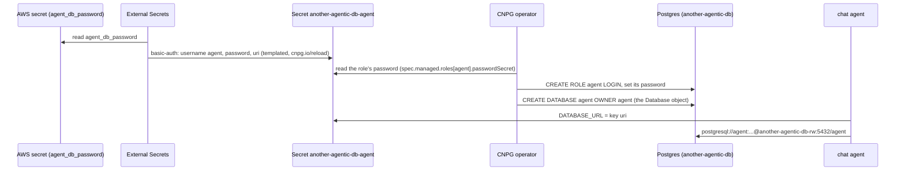

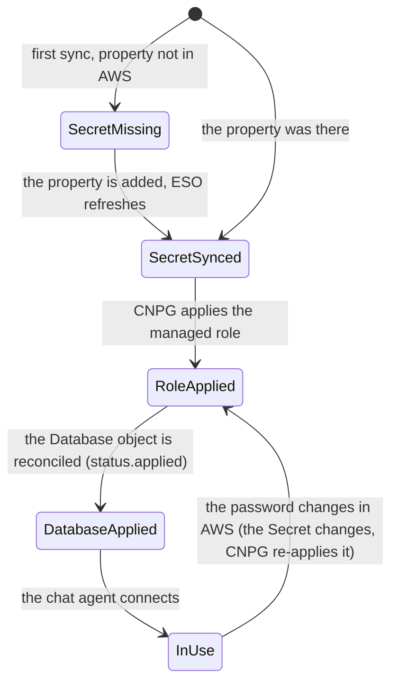

The password is a property of the AWS secret and goes **only** through the ExternalSecret's template: the `password` key is the value, the
`uri` key is `postgresql://<role>:{{ .password | urlquery }}@another-agentic-db-rw.<namespace>.svc:5432/<database>`. It is in no value of
this chart and in no render (`tests/render-check.sh` asserts that no connection URI carries a literal password). `urlquery` escapes it for
the URI; a hex password needs none. `cnpg.io/reload: "true"` is on the Secret, so the operator applies a changed password at once.

The Secret of a role is `kubernetes.io/basic-auth` because that is the type CNPG reads a managed role's password from
(*verified 2026-10-04*, cloudnative-pg `docs/src/declarative_role_management.md` at `main`: "The Secret must be of type
`kubernetes.io/basic-auth`", and the `cnpg.io/reload` label). The `Database` resource is `postgresql.cnpg.io/v1` `Database`, introduced
in CloudNativePG **1.25** (*verified 2026-10-04*, `docs/src/release_notes/old/v1.25.md`: "Declarative Database Management: Introduce the
`Database` Custom Resource Definition"; `docs/src/declarative_database_management.md`: `spec.cluster.name`, `spec.name` and `spec.owner`
are required, `databaseReclaimPolicy` defaults to `retain`). Netcup's operator is the `cloudnative-pg` chart at `targetRevision: 0.*` (home-os
`charts/cd-database/values.yaml`, Application `cnpg-netcup`); the chart's `main` is chart 0.29.1 with operator 1.30.1 (*verified
2026-10-04*, cloudnative-pg/charts `Chart.yaml`), so a float of `0.*` is far past 1.25, but **which version netcup's cluster runs now is
unverified**: `kubectl get crd databases.postgresql.cnpg.io` says (a missing CRD makes the sync fail on the `Database` objects). The CRD
schema CI validates against is [`tests/schemas/postgresql.cnpg.io/database_v1.json`](tests/schemas/README.md), from the same catalog
commit as the `Cluster`'s.

**What this does to a deployment that already runs the two older clusters.** The chat agent's Cluster `another-agentic-chat-db` is no
longer rendered, so Argo CD (`prune: true`) deletes it, **and its PersistentVolumeClaim goes with it**: the chat agent's runs and the
coder's own `coder-db` cluster (adam-rs's chart, when it is switched to the Secret `coder-db-uri`) are lost. Both were a few hours old when
the owner decided this on 2026-10-04 and **losing them is accepted**; nothing here migrates them. The orchestrator keeps its cluster and
its database, so its data (the chat, the only durable state) survives: the orchestrator's pod restarts once, because the checksum of
its secrets changed.

**Deploy ordering.** Add `agent_db_password` (and `coder_db_password` before turning `sharedDatabase.coder.enabled` on) to the AWS secret
**before the sync**: a missing property fails the ExternalSecret (`SecretSyncedError`), the role's Secret does not exist, CNPG cannot apply
the role, and the chat agent stays `CreateContainerConfigError` on its missing `DATABASE_URL` Secret until it does. Argo CD does not
sequence this, so a sync that came first heals once the property is there and ESO refreshes (`refreshInterval`, 1 h at most: `kubectl
annotate externalsecret <name> force-sync=$(date +%s) --overwrite` to hurry it). Then, in the same sync: the orchestrator's cluster gains the
managed roles (no restart of Postgres: *unverified*, CNPG applies roles on the primary), the `Database` objects are created, the old
chat cluster is pruned. The coder's chart is switched in a change of its own (it reads `coder-db-uri` instead of making its own
Cluster); until then `sharedDatabase.coder.enabled: true` only prepares the role, the database and the Secret.

Creating a role and a database from objects is idempotent: a `Database` that already exists in Postgres with the same name is adopted by
CNPG's reconcile (*unverified*; here the databases are new). Removing a `Database` object leaves the database (`retain`).

## Sharing a thread

A person can share a thread by a revocable link ([ADR 0040](../../docs/decisions/0040-thread-sharing-by-revocable-link.md); `sharing` of
[the configuration](../../docs/api/config.md#sharing); the web's dialog and the page `/s/<token>`). The chart enables it with one value,
`sharing.mode`, **`disabled` by default**: the render then has no `sharing` key in the configuration, no `thread.share` in any role, no extra
route in the edge and no extra file in the orchestrator's Secret, so a deployment that never turns it on sees no difference (asserted by
`tests/render-check.sh`).

| `sharing.mode` | Who reads a link | The chart writes |
|---|---|---|
| `disabled` | nobody (a link already made answers 404) | nothing |
| `internal` | a signed-in person with a role that holds `thread.read`, who has the link | `sharing: { mode: internal, secret: { file } }`; `thread.share` is added to the roles of `sharing.roles`; the ExternalSecret reads `sharing_secret`. **No edge change**: `/s/<token>` is behind sign-in like the rest, and a person with no session is sent to sign in and back to the link |
| `public` | anybody with the link, signed in or not | the same, with `public: { stepIo, files }` (both `false`: a public reader sees step labels, not their input and output, and cannot open the thread's files), **and the edge's public routes** |

**The edge's public routes (`public` only)** are exactly these, each GET and HEAD only, each before the route it would otherwise fall into,
none behind oauth2-proxy, each dropping the client's `Authorization` and `X-Auth-Request-Email` before the request goes on:

| Path | To | Why |
|---|---|---|
| `/api/public/shared/*` | orchestrator | the shared view and its files (`GET /api/public/shared/{token}`, `.../artifacts/{sha256}`) |
| `/agui/public/shared/*` | orchestrator | the replay and follow stream of the shared thread (`GET /agui/public/shared/{token}/connect`) |
| `/s/*`, `/_next/static/*`, `/favicon.ico`, `/icon.svg`, `/apple-icon.png`, `/manifest.webmanifest`, `/brand/*` | web | the page and what it is made of; the page holds no data, it asks the two routes above for it |

These are the paths the web uses (`web/src/features/sharing`: `sharedPath` is `/s/<token>`, the reader calls `GET /api/shared/{token}` and, on a
401, `GET /api/public/shared/{token}`, and streams `/agui/shared/{token}/connect` or `/agui/public/shared/{token}/connect`; its static files
are Next's `/_next/static` and the icons of `web/src/app` and `web/public/brand`), narrower than ADR 0040's `/api/public/*` and
`/agui/public/*`: the orchestrator mounts nothing else under `public`, and a route added there later stays behind sign-in until it is listed in
[`files/Caddyfile`](files/Caddyfile). Everything else is unchanged, fail closed: `/api/shared/*` and `/agui/shared/*` (the signed-in readers) answer
401 without a session, `/`, `/threads/*` and anything unlisted redirect to sign in, `/thread-tools/*` is 404, and a POST, PUT or DELETE to a
public path is routed as before (401). The orchestrator's own rate limit (per link and in all, ADR 0040 section 10) is what limits the public
routes: it is per process and the numbers are the ADR's, *unverified* under load.

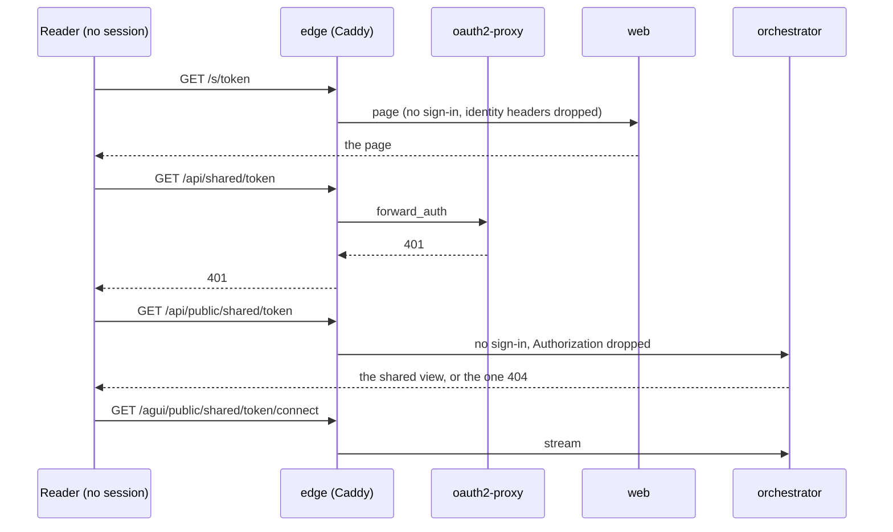

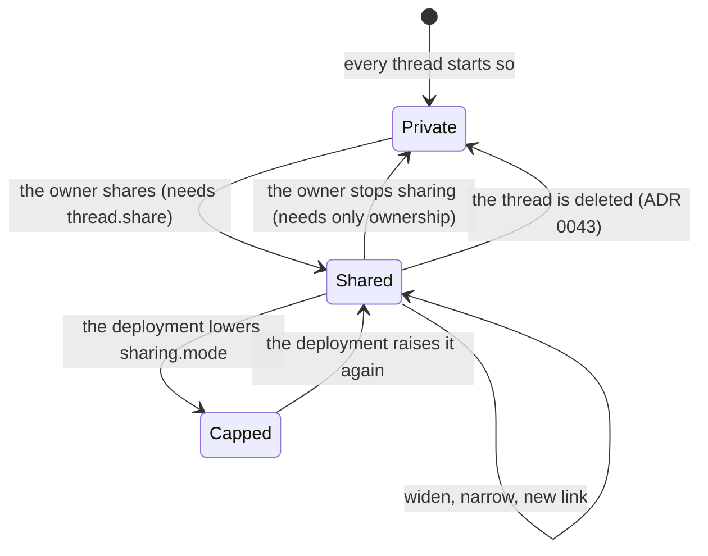

Roles: `thread.share` is a permission, so a role needs it to make a link (revoking one needs only ownership). The chart adds it to the roles
named in `sharing.roles` (default `user` and `admin`) when sharing is on, so the deployment's `auth.roles` need not repeat it; a role you
write yourself and leave out of `sharing.roles` cannot share. The key is `sharing_secret`, a `{ file }` reference like every other secret.
Turning it on is the value, the AWS property (add it **before** the sync, or the orchestrator's whole ExternalSecret fails and the pod does not
start) and an orchestrator image that has the `sharing` section: the pinned tag has it (*verified 2026-10-04*: `sha-50bc46c` is after `4d9abeb`,
the backend of ADR 0040, and the chart's CI reads the public render through the pinned image with `--print-config`). Start with `internal`; the
ADR's order is `public` only after the limiter, which the orchestrator always builds with `public`. **Before `public`, check whether the
Traefik ingress logs request paths** (a link is a capability in the path): *unverified*, ADR 0040 section 11 says to check it first.

## Tokens in the browser (ADR 0054)

[ADR 0054](../../docs/decisions/0054-the-web-holds-its-own-tokens-dpop-bound-in-indexeddb.md): the web is a public OAuth client
(`another-agentic-web`) that signs in at Keycloak itself and holds its tokens in IndexedDB, DPoP-bound to a key the browser cannot export,
with an offline refresh token that is used (and rotated) once by one tab. **`auth.browser.enabled` is `false` by default**, and then the
render is byte for byte the one of a chart that has never heard of it (`tests/render-check.sh` asserts it). With `true`:

| Where | What changes |
|---|---|
| orchestrator ConfigMap | `auth.dpop: { publicOrigins: [https://<host>], maxAgeSeconds: 60, futureSkewSeconds: 5 }` (the orchestrator verifies the proof itself) and `auth.browser: { clientId, scope }`, which `GET /api/public/auth` answers with `{issuer, clientId, scope}` |
| edge ([`files/Caddyfile`](files/Caddyfile)) | `GET /api/public/auth` is routed with no sign-in (`Authorization` and `X-Auth-Request-Email` removed); a request to `/api/*` or `/agui/*` whose `Authorization` starts with `DPoP ` goes **straight to the orchestrator** with its `Authorization` and `DPoP` and **without** `X-Auth-Request-Email` (oauth2-proxy has no DPoP and would take a DPoP-bound token sent as `Bearer` for a plain one); **every other request to `/api` and `/agui` still goes through `forward_auth`**, so a cookie session of before keeps working until it ends; the web's pages, `/auth/callback` and `/_next/*` are served with no `forward_auth` |
| web Deployment | `WEB_CSP_CONNECT_SRC` is the issuer's origin (`https://auth.verif.fyi`, derived from `auth.issuer`), which the web's content security policy lets the page connect to (read at request time) |
| NetworkPolicies | **nothing**: edge to web and edge to orchestrator are already allowed, and the browser's calls to the issuer are the browser's own |

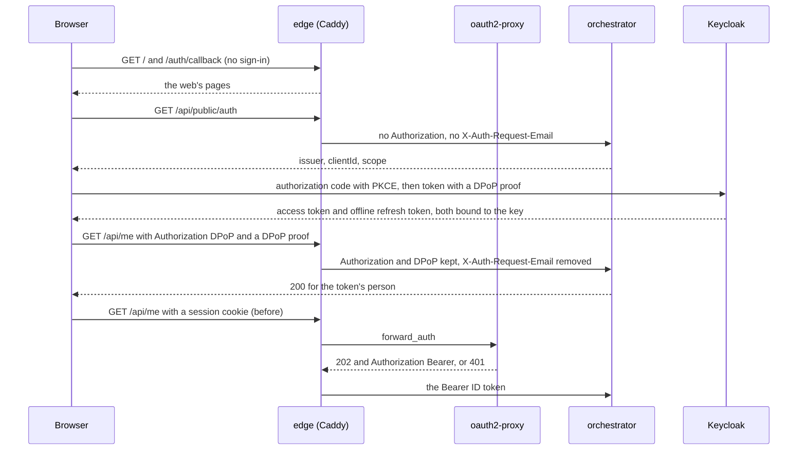

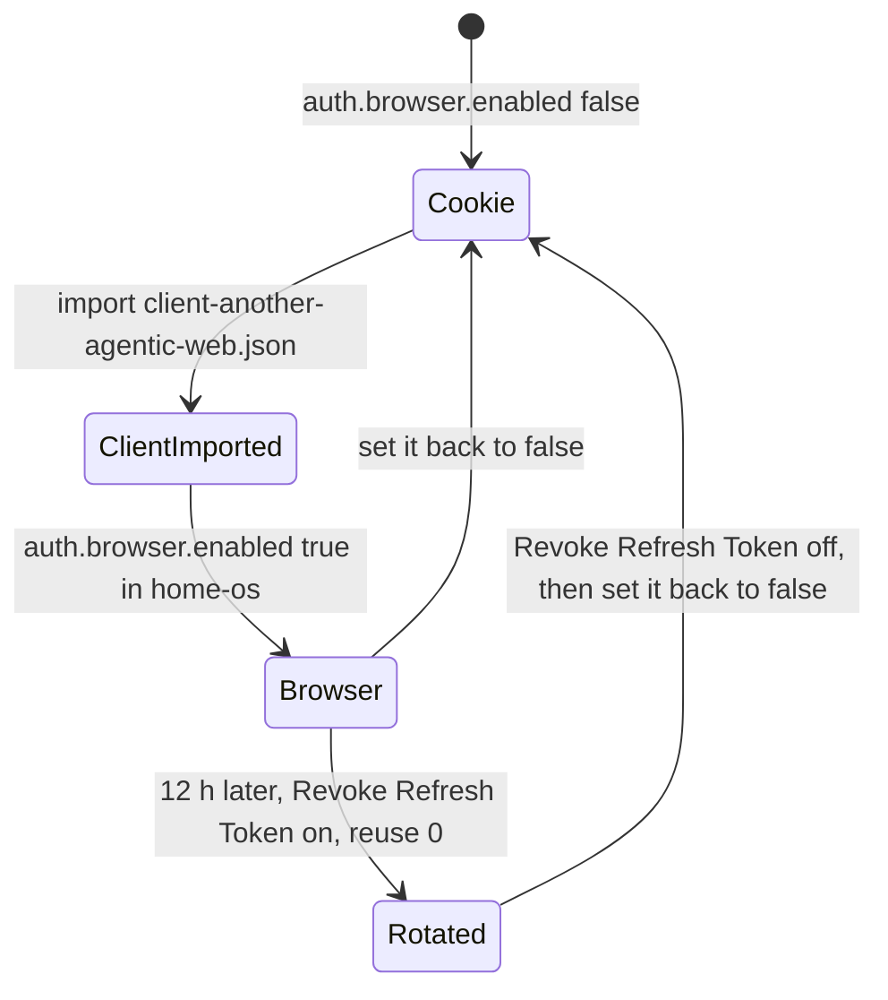

**Rollout order** (each step is the owner's; nothing changes in production until the last):

1. **Import the client** `another-agentic-web` ([`deploy/keycloak/client-another-agentic-web.json`](../keycloak/client-another-agentic-web.json),
   [`deploy/keycloak/README.md`](../keycloak/README.md)).
2. **Set `auth.browser.enabled: true`** in home-os (`helm.valuesObject`, under `auth.browser`), with an orchestrator image and a web image that have
   ADR 0054 (`orchestrator.image.tag` and `web.image.tag` at or after the commits that landed it: with the older orchestrator the configuration is refused at
   startup, exit 78, because `auth.dpop` and `auth.browser` are unknown keys).
3. **Only then, and after `oauth2Proxy.cookieExpire` (12 h) has passed, set the realm**: *Realm settings → Tokens → Revoke Refresh Token* on, *Refresh Token Max
   Reuse* `0` (same README). Never before step 2: with `oauth2Proxy.sessionStore: cookie` oauth2-proxy redeems the **same** refresh token on every request after
   `cookieRefresh` (see `values.yaml`), so with rotation on the second redemption counts as a reuse and Keycloak ends that person's session. A cookie of before
   step 2 lives at most `cookieExpire`; after it, nobody refreshes through oauth2-proxy any more.

To go back, turn *Revoke Refresh Token* off first, then set `auth.browser.enabled: false`: the web is gated by oauth2-proxy again.

**What home-os sets** (Application `another-agentic-system`, `helm.valuesObject`), once the client is imported; `clientId` and `scope` keep their defaults
(`another-agentic-web`, `openid email profile offline_access`):

```yaml
auth:
  issuer: https://auth.verif.fyi/realms/vymalo   # already there
  browser:
    enabled: true
```

Rendered on 2026-10-09 with Helm 3.19 from home-os's values plus these lines: the render differs from today's only in the edge's three routes and its
catch-all, the orchestrator's `auth.dpop` (`publicOrigins: ["https://agentic.servers.segning.pro"]`) and `auth.browser`, the web's `WEB_CSP_CONNECT_SRC`
(`https://auth.verif.fyi`) and the two config checksums. The pinned images have ADR 0054.

### Calls from the desktop app

`orchestrator.cors.allowedOrigins` (empty by default) lists the origins whose pages call the API from elsewhere: the desktop app is
`tauri://localhost` (macOS, Linux) and `http://tauri.localhost` (Windows) (`apps/tauri/README.md`). With an entry, and only in browser mode
(the app sends DPoP-bound tokens), the orchestrator answers CORS for exactly those origins, never with credentials (`server.cors`,
[`docs/api/config.md`](../../docs/api/config.md)), and the edge passes a **preflight** (`OPTIONS` of `/api/*` or `/agui/*` with `Origin` and
`Access-Control-Request-Method`) to the orchestrator without oauth2-proxy, which would answer it 401; the app's calls themselves are DPoP
requests, routed as above. Routing checked on 2026-10-09 against the rendered Caddyfile in Caddy 2.11.4: a preflight reaches the orchestrator,
an `OPTIONS` without those headers still meets `forward_auth`. Needs an orchestrator image that has `server.cors` (this repository after
ADR 0047's slice 2): with an older one the configuration is refused at startup (exit 78).

### Signing out

The web's account menu (and its no-access screen) signs out in both modes. In browser mode the web revokes its refresh token and ends Keycloak's session
itself. With the edge it goes to oauth2-proxy's `/oauth2/sign_out?rd=/`, and oauth2-proxy has `--backend-logout-url=<issuer>/protocol/openid-connect/logout?id_token_hint={id_token}`:
it calls Keycloak's end-session endpoint with the session's ID token, which ends that session with no page to confirm. Without it the cookie is cleared but
Keycloak's session is not, and the start page signs the person straight back in (*verified 2026-10-09* with oauth2-proxy v7.15.5 and Keycloak 26.6.1, both
ways; the flag is in `pkg/apis/options/legacy_options.go` of v7.15.5, and Keycloak's `LogoutEndpoint` checks the hint's signature, not its expiry).

`tests/render-check.sh` covers both modes (the DPoP matcher only when on; the web's catch-all with no `forward_auth` only when on;
`X-Auth-Request-Email` removed on every route that skips oauth2-proxy; `auth.dpop` and the CSP variable rendered). The Caddyfile's behaviour was
run on Caddy 2.11.4 against stub backends (2026-10-07): a `DPoP ` request to `/api` and `/agui` reaches the orchestrator with `Authorization` and `DPoP` and no
`X-Auth-Request-Email`; `Bearer` with no cookie is 401, with a cookie it is the proxy's token; `/api/public/auth` with a `Bearer` token arrives with no `Authorization`;
the pages need no sign-in. *Unverified:* the whole against a real Keycloak 26.6.1, a real orchestrator and a real browser (the orchestrator's `auth.dpop` and the web's
sign-in are built in parallel branches; `deploy.yml` reads the default render with the pinned orchestrator image and does not read this one).

## Web search and Context7

Two tools a person can attach to a conversation ([ADR 0024](../../docs/decisions/0024-mcp-tools-attached-per-conversation.md);
`toolServers` of [the configuration](../../docs/api/config.md#toolservers)), **off by default**. The orchestrator relays the calls
and holds both keys; an agent is told the names of the attached servers and a per-thread endpoint, and never sees a key.

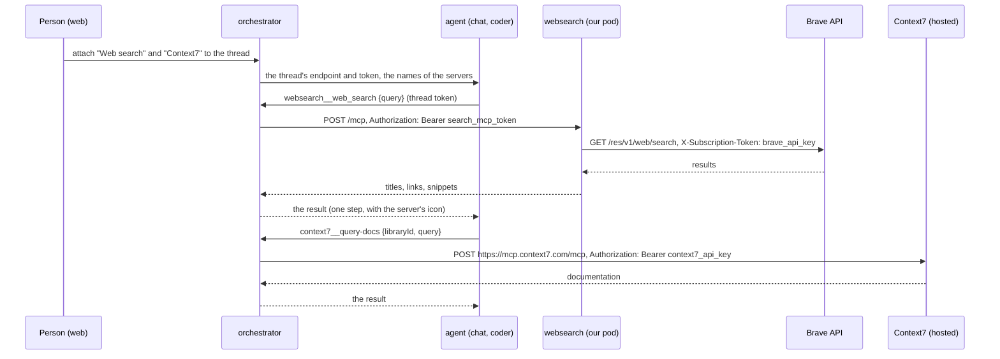

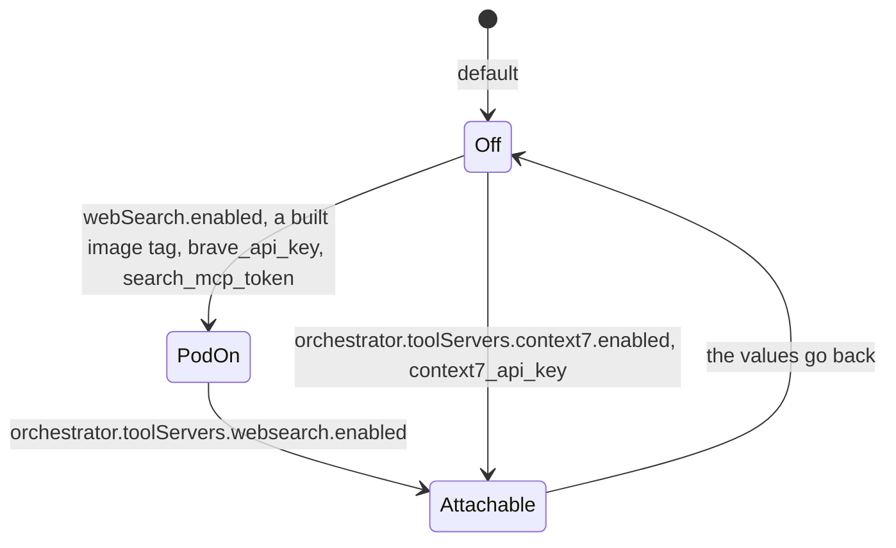

### What a deployment sets

```yaml
# 1. the search pod (after the first build of the image: see "The image")
webSearch:
  enabled: true
  image: { tag: sha-xxxxxxx }          # CI bumps this in the chart's values.yaml; a value here only pins another build
  # allowFrom: [{ podSelector: { matchLabels: { app.kubernetes.io/instance: coder } } }]   # the default
orchestrator:
  toolServers:
    # 2. offered to people: our search pod, over its Service, bearer search_mcp_token
    websearch: { enabled: true }       # agents: [chat, coder] to narrow it; tools: [web_search] to withhold `fetch`
    # 3. offered to people: Context7 directly, bearer context7_api_key
    context7: { enabled: true }
```

The pieces are independent except that `websearch` needs the pod (`webSearch.enabled`), which the chart enforces. The AWS secret
needs `brave_api_key` and `search_mcp_token` for the pod, `search_mcp_token` for `websearch`, `context7_api_key` for `context7`.
With none enabled the rendered configuration has **no `toolServers` key**, and the render is the one of a chart without this section.

**Order of operations.** (1) Put the property in the AWS secret first (`brave_api_key`, `search_mcp_token`, `context7_api_key`, as
needed). (2) Only then enable the server in the Application's values. (3) Watch the ExternalSecrets go to `SecretSynced`
(`kubectl -n another-agentic-system get externalsecret`). The orchestrator's own ExternalSecret reads the new key: a property that
does not exist in AWS makes that whole ExternalSecret fail, its Secret is not updated, and the orchestrator, one replica with
`Recreate`, cannot start the new pod that mounts the missing key and stays down until the property exists. Enabling first and
creating the property after is the outage; the other order is not.

The chart also refuses, at render time, what the orchestrator would refuse at startup (an `agents` id that is not in `agents`, a
`timeoutSecs` outside 1 to 600, a blank name, a tool name or icon the relay cannot use), so such a value is a failed sync of the
chart and not a crashed orchestrator. A plain-`http://` URL with a credential is not refused by the orchestrator, only noted: at
startup it logs a warning that names the server (`websearch`: the bearer travels over in-cluster plain http to our own pod, which
is the design here, and the warning is expected; Context7 is https and has none).

### The search pod

`dev/searxng-mcp` (the dev stack's search server; provider `brave`, the key in `BRAVE_API_KEY`). **Where the coder calls it:**
`http://another-agentic-websearch.<namespace>.svc:8080/mcp` (Service `another-agentic-websearch`, port 8080, path `/mcp`,
MCP over Streamable HTTP, plain request and JSON answer, no session), header `Authorization: Bearer <search_mcp_token>`. Its tools
are `web_search {query, limit?}` and `fetch {url}`. `/healthz` (the probes) needs no token; `/mcp` without it is 401, and the server
refuses to start without `SEARCH_MCP_TOKEN`. The coder's chart is to read the same property for its own bearer (added by [vymalo/another-adam-rs#84](https://github.com/vymalo/another-adam-rs/pull/84), not merged when this was written).

`fetch` is the dangerous tool (the server fetches a URL a model chose): it refuses loopback, private, link-local (the metadata
address) and reserved addresses, on the address it connects to, and reads at most 2 MiB of text. The chart's NetworkPolicy adds a
second wall:

| Direction | Allowed |
|---|---|
| In | the orchestrator's pods, the chat agent's (its researcher sub-agent, with `chat.enabled`), and `webSearch.allowFrom` (default: pods with `app.kubernetes.io/instance: coder` in this namespace; any `NetworkPolicyPeer`, so a `namespaceSelector` works for another one), TCP 8080 |
| Out | DNS (53), and TCP 443 and 80 to the public internet **except** `webSearch.egressExcept` (default `10/8`, `100.64/10`, `127/8`, `169.254/16`, `172.16/12`, `192.0.0/24`, `192.168/16`, `198.18/15`) and `egressExceptV6` (`fc00::/7`, `fe80::/10`, the NAT64 prefixes `64:ff9b::/96` and `64:ff9b:1::/48`, and 6to4 `2002::/16`; not the IPv4-mapped `::ffff:0:0/96`, which the API server refuses in an `ipBlock` and which leaves the pod as IPv4 anyway): not the cluster's pods and services when they sit in those ranges, not the metadata address |

A NetworkPolicy cannot name a host, so "only `api.search.brave.com`" cannot be written: `fetch` has to reach any public page.
**The node addresses are not excluded by default**, and netcup's nodes are reported to have public IPs (*unverified* here), so the pod could reach a node's public
address on 443 or 80: add the nodes' addresses (and any other public range of the cluster) to `webSearch.egressExcept`, repeating
the defaults (a list is replaced as a whole). Whether the cluster's CNI enforces egress policy, and whether DNS on port 53 is the
cluster's only resolver path, is *unverified* here.

`allowFrom` selects the coder by **instance** (`app.kubernetes.io/instance: coder`), while `networkPolicy.orchestratorFrom` selects it by
**name** (`app.kubernetes.io/name: coder`). In adam-rs's chart a single-pod coder has name `coder` and instance `coder`; in the split
topology the workers keep the name `coder` and the front pods are named `coder-front`, all with instance `coder`. The thread tools are
called by the pod named `coder` only, so that rule stays narrow; the search is offered to the release's every pod, so a front pod that
runs a tool is not locked out. (Labels read in `deploy/coder/templates/_helpers.tpl` of adam-rs, 2026-10-04.)

### The image

`ghcr.io/vymalo/another-agentic-system/searxng-mcp`, built from `dev/searxng-mcp` by
[`searxng-mcp.yml`](../../.github/workflows/searxng-mcp.yml): `node --test`, a build smoke-tested before it is pushed (uid 1000,
`/healthz`, `/mcp` refused with no bearer, both tools listed, no start without a token), then on `main` the tags `sha-<7>` and
`latest`, and the bump of `webSearch.image.tag` (`bump-tag.sh <values> webSearch <tag>`) as `orchestrator.yml` and `web.yml` do for
theirs. **The first tag exists when this change is merged to `main`** (the workflow runs on its own file); until then
`webSearch.image.tag` is `sha-0000000`, which the chart refuses to render with `enabled: true`, so Argo CD at `HEAD` stays valid with
the section off, and cannot be pointed at an image that does not exist. A new GHCR package is private until its visibility is set:
check an anonymous pull (the command of [`another-agentic-images`](https://github.com/vymalo/another-agentic-images)'s guide) before enabling.

### Context7

Reached directly, over https, from the orchestrator. *Verified 2026-10-04* (Context7's README, <https://github.com/upstash/context7>,
and its client guide, <https://context7.com/docs/resources/all-clients>): the remote MCP endpoint is `https://mcp.context7.com/mcp`,
the API key goes in the header `Authorization: Bearer <key>` (the same pages name an OAuth endpoint, `https://mcp.context7.com/mcp/oauth`,
which this chart does not use), and the server exposes two tools, `resolve-library-id` (a library name to a Context7 id) and
`query-docs` (documentation for a library id and a question): those are the `tools` allow-list. The orchestrator sends the
key from `toolServers[context7].bearer`, a `{ file }` reference; the chart refuses a non-https URL for it. *Unverified*: the
orchestrator's MCP client against the live hosted endpoint (the relay is tested against a local MCP server), and the quota of the
key.

### The pinned orchestrator image

The chart check renders the configuration and has the orchestrator image pinned in `values.yaml` read it
(`tests/print-config.sh`, [`deploy.yml`](../../.github/workflows/deploy.yml)). `toolServers` has been in the configuration since
slice 8 ([ADR 0024](../../docs/decisions/0024-mcp-tools-attached-per-conversation.md#status-note-2026-10-02-the-relay-is-built)), and
the tag pinned in `values.yaml` (`orchestrator.image.tag`) contains it (that commit is a descendant of the one that introduced the key,
*verified 2026-10-04* in the repository's history; a bump only moves forward); the image has the relay (`tool-relay` is a default feature of the binary and the Dockerfile builds the defaults). Still,
the default render carries no `toolServers`, and CI reads the key through the pinned image with both servers on, so a later chart
change cannot write a key an older image refuses unnoticed. The same check guards `thread.delete` in the roles: the pinned image has
read it since `sha-5a0c152` ([ADR 0043](../../docs/decisions/0043-deleting-a-thread-erases-it.md)), and an older one refuses it.

The one thing the pinned image **cannot** read is `model.baseUrlFromSecret: true`, which writes `baseUrl: { file }`: the key accepts
only text in an image built before that change. So the option is off by default, `deploy.yml` lints, templates and kubeconforms it
(and `render-check.sh` asserts it), and it is turned on only once the tag is at or after the change's merge commit
([how](#the-gateways-address-from-the-aws-secret)). `deploy.yml` reads the option's render (`tests/model-secret.values.yaml`) through the
pinned image **by itself**, as soon as the tag is at or after the commit that introduced `UrlRef`; until then it prints a notice
saying so. **The first `sha-<7>` that reads `baseUrl: { file }` is not known yet: it is recorded here once the bump after this
change's merge lands** (*unverified* until then).

### The gateway's address from the AWS secret

Owner decision (2026-10-04): the production gateway's address is kept in AWS Secrets Manager, next to its key, and not written in git.
`model.baseUrlFromSecret: true` (with `model.baseUrl` left empty) does that:

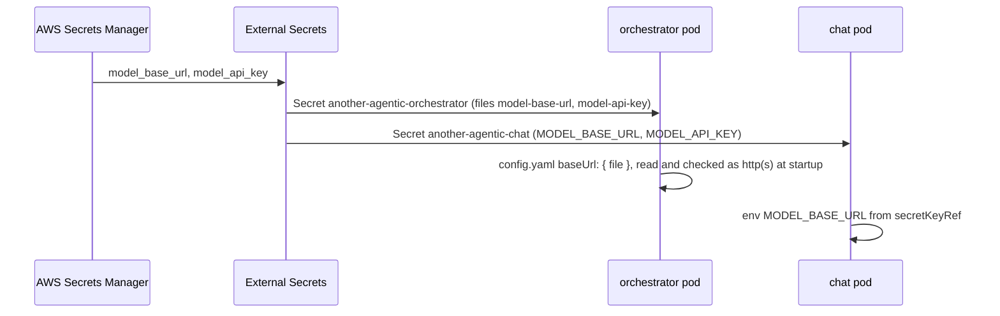

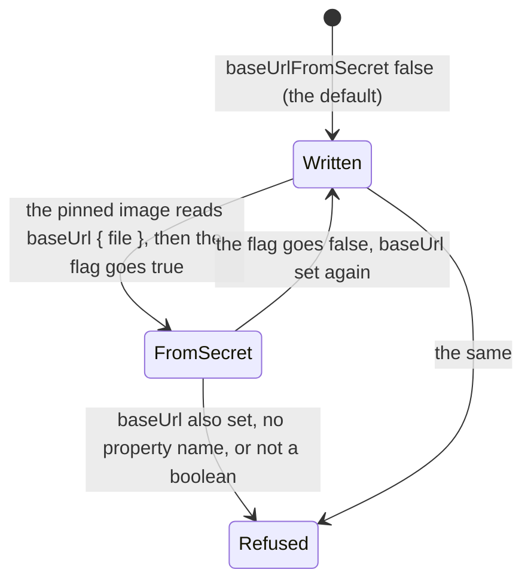

The orchestrator's configuration then reads `baseUrl: { file: /run/secrets/orchestrator/model-base-url }`
([`config.md`](../../docs/api/config.md), [ADR 0035](../../docs/decisions/0035-utility-model-tasks.md)): the value read is checked as
`http(s)` at startup (exit 78 naming `models.endpoints.default.baseUrl` otherwise, never the value), and a log line and `--print-config`
show the reference, not the address. The chat agent gets `MODEL_BASE_URL` by `secretKeyRef` from its own Secret, which the chat
ExternalSecret fills from the same property, so the two sides cannot differ. Add the property to the AWS secret **before** the flag:
an ExternalSecret whose property is missing does not sync, and the pods wait for the Secret. `hasModel` (titles, descriptions, the chat
agent) is true when either `model.baseUrl` or the flag is set. With `externalSecrets.enabled: false` the Secrets must carry the keys
`model-base-url` (orchestrator) and `MODEL_BASE_URL` (chat).

**Deploy ordering.** Argo CD deploys this chart at `HEAD` and the orchestrator image is pinned by `orchestrator.image.tag`. An image
older than the commit that made `baseUrl` accept `{ file }` reads it as a string, refuses the configuration at startup (exit 78) and,
with `Recreate`, takes the orchestrator down. So: **turn the option on only once `orchestrator.image.tag` is at or after the merge commit
of the change that added it** (the image workflow bumps the tag after it pushes that commit's image; check `git merge-base --is-ancestor
<that commit> <the commit the tag names>`). The option is off by default. CI does the same check by itself: its `--print-config` step reads
the option's render through the pinned image only when the tag is at or after the commit that introduced `UrlRef` (found with
`git log -S`), and prints a notice until then, so nothing needs editing at the bump. See also [the pinned orchestrator image](#the-pinned-orchestrator-image).

## Sessions in Redis

oauth2-proxy keeps a person's session (the ID, access and refresh tokens) in the browser's cookie by default
(`oauth2Proxy.sessionStore: cookie`). With `sessionStore: redis` the cookie is only a ticket and the session is in a small Redis of this release.
**Turn it on when people are signed out after a while for no reason you can see**: that is the failure below.

**Why the cookie store loses a refresh here.** The edge asks oauth2-proxy about every request (`forward_auth` to `/oauth2/auth`).
Once the session is older than `oauth2Proxy.cookieRefresh` (10 minutes), oauth2-proxy refreshes the tokens during that subrequest and saves the
renewed session by writing it as a `Set-Cookie` on the subrequest's response. Caddy's `forward_auth` does not pass that response on when it is
a 2xx: it copies only the headers named by `copy_headers` (here `Authorization`) onto the request that goes on, so the browser never receives the
new cookie and keeps the old one. Every request after the refresh period redeems the **same** refresh token again, with no lock (the cookie
store has none), and when Keycloak rotates refresh tokens, or when the first one expires, the second redemption fails and the person is
signed out. With the Redis store a refresh is saved in Redis, under a lock, whether or not the browser's cookie changes, and the ticket in
the cookie stays valid.

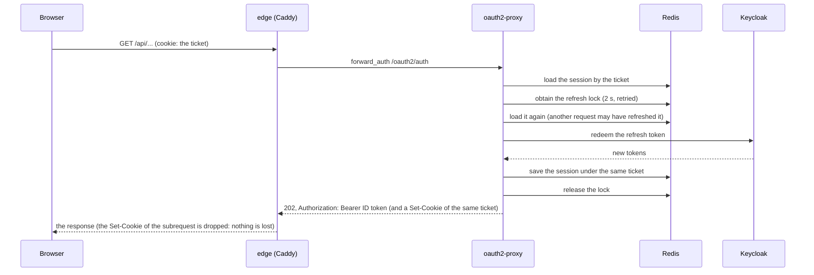

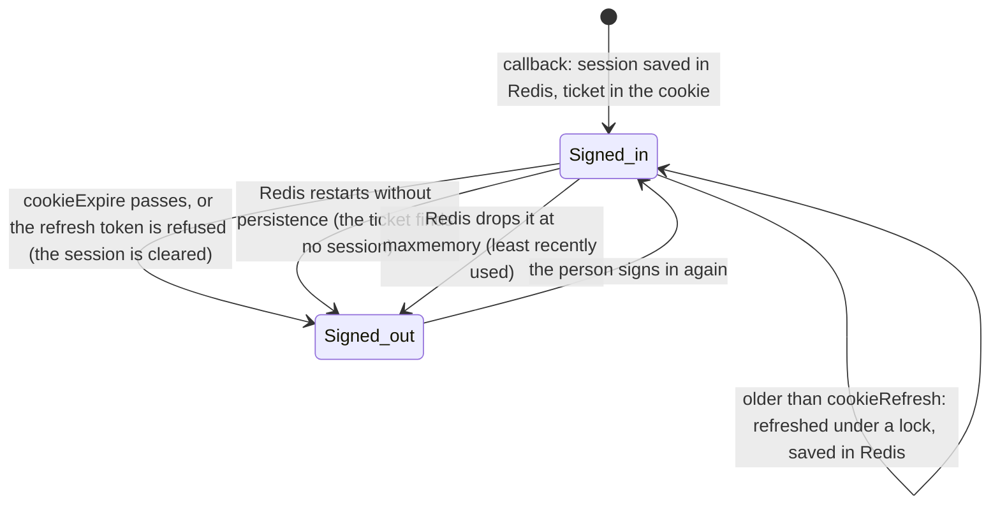

What it renders (all of it only with `sessionStore: redis`): oauth2-proxy gets `--session-store-type=redis`,
`--redis-connection-url=redis://another-agentic-oauth2-redis.<namespace>.svc:6379` (no credential in the URL) and the password as the
environment variable `OAUTH2_PROXY_REDIS_PASSWORD` from its own Secret, never a flag. The Redis is one pod
([`templates/oauth2-redis.yaml`](templates/oauth2-redis.yaml)): `redis:8.8.3-alpine` by tag and digest, uid 999, read-only root, all capabilities
dropped, probes, resources, one replica, `Recreate`; `requirepass` is written at startup to a file in memory that its configuration reads
with `include`, so the password is on no command line and in no ConfigMap; a NetworkPolicy lets **only oauth2-proxy's pods** reach it, on 6379.
The data directory is an `emptyDir`, and Redis keeps no snapshot and no append-only file: **a restart of the Redis pod loses every session and
everybody signs in again** (set `oauth2Proxy.redis.persistence.enabled: true` for a volume and an append-only file; it is not kept when the release
goes). Memory is bounded by `oauth2Proxy.redis.maxMemory` with `volatile-lru`: at the limit the least recently used session is dropped (its person
signs in again). While Redis is down no session can be loaded, so nobody is let through (*unverified*: the exact answer, a 401 or a 5xx, was not observed),
and oauth2-proxy **exits at startup** when it cannot reach Redis with the right password (verified, below: it writes and deletes a key),
so on a first sync it restarts until Redis is up.

**What a deployment sets** (home-os `helm.valuesObject`): `oauth2Proxy.sessionStore: redis`, and nothing else is required (the Redis' image,
size and persistence have defaults).

**Deploy ordering.** Add the property **`oauth2_redis_password`** to the AWS secret `prod/another-agentic/env` (`openssl rand -hex 32`)
**before** the sync that sets `sessionStore: redis`: a missing property fails the two ExternalSecrets (`SecretSyncedError`), and then neither the
Redis nor oauth2-proxy can start (`CreateContainerConfigError` on the missing Secret), which is **no sign-in at all** until ESO syncs
(`kubectl annotate externalsecret <name> force-sync=$(date +%s) --overwrite` to hurry it). The chart refuses to render `redis` without the
property's **name** (a value), not without its presence in AWS. Turning it on is expected to sign everybody out once (a cookie of the cookie store is not a
ticket, so no session is found for it; *unverified*); turning it off the same. A change of `oauth2_redis_password` needs a restart of the Redis and of oauth2-proxy
(`kubectl rollout restart deploy/another-agentic-oauth2-redis deploy/another-agentic-oauth2-proxy`) and signs everybody out. With
`externalSecrets.enabled: false` the deployment's own Secrets are `another-agentic-oauth2-proxy` (key `OAUTH2_PROXY_REDIS_PASSWORD`) and
`another-agentic-oauth2-redis` (key `REDIS_PASSWORD`), the same value.

*Verified 2026-10-04*, against the sources and the binary of oauth2-proxy **v7.15.5** (the pinned image's version; the binary of the release
tarball): `--session-store-type`, `--redis-connection-url` and `--redis-password` exist in `--help`, and `OAUTH2_PROXY_REDIS_PASSWORD` is read
(run against a local Redis with a password: with the right one it starts, with a wrong one or none it exits with `WRONGPASS` or `NOAUTH`; the
`OAUTH2_PROXY_` prefix and the flag's name in upper case is `pkg/apis/options/load.go`); the refresh runs under `ObtainLock` and the Redis
store returns a real lock (`pkg/middleware/stored_session.go`, `pkg/sessions/redis/lock.go`) while the cookie store sets none, so
`SessionState.ObtainLock` falls back to `NoOpLock` (`pkg/apis/sessions/session_state.go`, `pkg/sessions/cookie/session_store.go`); the save
reuses the ticket of the request's cookie (`pkg/sessions/persistence/manager.go`); Caddy's `forward_auth` on a 2xx copies only the
`copy_headers` headers onto the request, and no response header to the client (`modules/caddyhttp/reverseproxy/forwardauth/caddyfile.go` at
**v2.11.4**, the pinned one); the image has a `redis` user of uid 999 and gid 1000 and runs as root by default, its entrypoint dropping to that user, which this
chart replaces by setting the uid itself (`redis/docker-library-redis`, `release/8.8`, `alpine/Dockerfile`; `docker-library/redis` `docker-entrypoint.sh`), and the
digest is the image index of `8.8.3-alpine` (Docker Hub registry API); the configuration (`include` of a file written with `printf`, `bind * -::*`,
`maxmemory 64mb`, `volatile-lru`, `appendonly yes`) loads and a password in `REDISCLI_AUTH` makes `redis-cli ping` answer `PONG`, which exits 0
**also when it is refused** (hence the probes read `PONG`): all run on a local **Redis 7.0.15**, not the pinned 8.8.3 image.
*Unverified:* that the pod runs as written on netcup (no cluster and no container runtime were available: a read-only root with `emptyDir`s at
`/data` and in memory at `/run/redis-auth`, `fsGroup` 1000, the probes through `sh -c` and `grep`, Pod Security `restricted`); the sizes (starting points); that **Keycloak rotates refresh tokens** in the realm `vymalo`
(this is the symptom's likely cause, not a verified one: `deploy/keycloak` does not set "Revoke Refresh Token"); that a session with the
three tokens fits in the default `maxmemory` for the number of people invited (a few kilobytes each, *unverified*).

## What the owner does

1. **Create the AWS secret** `prod/another-agentic/env` with the [properties above](#the-aws-secret) (the GitHub App's PEM
   too, for the coder). The model's key is the gateway's; its address (`model_base_url`) goes there too when
   [`model.baseUrlFromSecret`](#the-gateways-address-from-the-aws-secret) is on.
2. **Keycloak** (admin console, realm `vymalo`): follow [`deploy/keycloak/README.md`](../keycloak/README.md): the client, its
   roles, the groups, the users (Email verified on); copy the client's secret into `oauth2_client_secret`.
3. **DNS**: a record for `host` (`agentic.servers.segning.pro`) to the netcup node IPs that serve Traefik's host port 443,
   DNS only (grey cloud) at first, so long streams are not subject to a proxy's timeouts (*unverified*). `cert-cloudflare`
   answers a DNS-01 challenge with its Cloudflare token: whether that token can edit the zone `segning.pro` is *unverified*;
   if not, give it the zone, or name another issuer in `ingress.clusterIssuer`.
4. **Verify that netcup serves a public port 443**: no public hostname has ever been served from it, and the nodes' IPs
   may be in NetBird's range. `kubectl --context admin@netcup get nodes -o wide` for the addresses, then from outside the
   cluster's network `curl -kI https://<node ip>/` (Traefik answers 404 for an unknown host), and look at the provider's
   firewall. If it fails: a `cloudflared` tunnel in the namespace (no inbound port), or the edge on another cluster.
5. **home-os** (a PR there, not here): an AppProject that lets this repository and adam-rs's deploy to `netcup-k8s`'s
   namespace `another-agentic-system`, and the Applications `another-agentic-coder` (adam-rs `deploy/coder`) and
   `another-agentic-system` (this chart, `HEAD`, `path: deploy/chart`, the values of
   [`examples/netcup.values.yaml`](examples/netcup.values.yaml) with the real model), `CreateNamespace=true`,
   `ServerSideApply=true`, the namespace labelled for Pod Security `restricted` (the coder may need `baseline`).

### The first sync

Expect, in this order: the ExternalSecrets `SecretSynced` (else the AWS secret or one property is missing: the event
names it); the CNPG Clusters healthy; the orchestrator `Ready` (its log says a refused configuration, exit 78, with the key; `/readyz` stays 503
until Keycloak's keys are fetched); the certificate issued; `https://<host>/` redirecting to Keycloak. Then
[the live checks of the plan](../../docs/decisions/0041-deployed-with-helm-on-kubernetes-secrets-by-externalsecret.md#verified-and-unverified)
(sign in, `GET /api/me`, a second person cannot open the first one's thread, a chat message, the coder).

## The chat agent's helpers

The chat agent's folder has three sub-agents ([ADR 0050](../../docs/decisions/0050-the-chat-has-sub-agents.md)): `planner` and `writer` (files of the ConfigMap, no tools) and `researcher`. A sub-agent inherits nothing, not even the conversation's tools, so the researcher's web search is its **own**: with `webSearch.enabled` its `mcp.json` is rendered to name the search pod's Service on `/mcp` with `Authorization: Bearer ${SEARCH_MCP_TOKEN}` (the chat pod has that variable from its Secret, the AWS property `search_mcp_token`, and the search pod's NetworkPolicy lets the chat pod in). Without the search pod the researcher is rendered without `tools:` and without an `mcp.json`, and says it cannot search. The files are `files/chat/` (equal to `dev/agents/chat/agent/` by a CI check; the ConfigMap keys are `instructions.md` and `subagent-*`, mapped to `subagents/…` by the volume's `items`).

## Artifacts in S3 and RustFS

The files agents hand over ([ADR 0032](../../docs/decisions/0032-files-from-agents-live-in-an-artifact-store.md), amended
2026-10-09) are a directory on one volume by default, which ties the orchestrator to one pod. `orchestrator.artifacts.store: s3` keeps
them in an S3 bucket instead: AWS S3, any S3-compatible server at `orchestrator.artifacts.s3.endpoint`, or the RustFS of this release
(`rustfs.enabled`). With an endpoint (and with RustFS) the store uses path-style addressing (`<endpoint>/<bucket>/<key>`); without one,
on AWS, the bucket is the host name, so a bucket name with a dot is refused there (AWS's certificate does not cover it). It sends no
request checksum header; its credentials are the two AWS properties above, as files.

```yaml
orchestrator:
  artifacts:
    store: s3
    # s3: { bucket: my-bucket, endpoint: https://s3.example.org, prefix: agentic }   # another server; omit with RustFS
rustfs:
  enabled: true          # a RustFS of this release, bucket `artifacts`, a longhorn claim of 10Gi
```

RustFS (1.0.1-preview.17, a preview release) is a StatefulSet of one on a single drive: no erasure coding, no redundancy beyond the
volume's, no backup. Its console is off, its root credentials are the orchestrator's S3 credentials, a hook Job creates the bucket the
orchestrator writes to (`orchestrator.artifacts.s3.bucket`, else `rustfs.bucket`) after each sync, and its NetworkPolicy lets in the orchestrator and that Job only, and out DNS only (its version check at startup, which no
setting of this release turns off, is also sent to a proxy port nobody listens on).

**Switching an existing deployment from `fs` to `s3`**: the volume of the directory store is no longer rendered but is kept (never
pruned), and its files are not copied to the bucket, so the files of earlier threads read as gone (404). Copy them first, or accept it.
Add the two AWS properties before the sync.

## The browser agent (ADR 0057)

[ADR 0057](../../docs/decisions/0057-a-browser-agent-an-adam-folder-with-obscura-as-its-sidecar.md) has the diagrams. One pod: the
agent (`adam-agent` over `files/browser/`, equal to `dev/agents/browser/agent/` by a CI check) and obscura, a headless browser, as a native
sidecar (Kubernetes 1.29 or later) whose MCP server listens on the pod's loopback (`127.0.0.1:9223`) and requires the bearer
`obscura_mcp_token`; nothing outside the pod reaches it. obscura refuses private, loopback, link-local, CGNAT and metadata addresses by
itself, stealth is off, and the pod's NetworkPolicy lets it out to DNS, the public internet on 80 and 443 except the private ranges, its
database and the orchestrator's thread tools. obscura shares the pod's network, so for the database and the orchestrator its own refusal
is the only wall (the ADR says what it checks). One replica, one worker, `Recreate`: one browser per task (the ADR says what that does not
cover). Its runs are in the database `agent`, beside the chat's, so the database and its role exist when either agent is on.

What a deployment sets (home-os), after adding `browser_a2a_token` and `obscura_mcp_token` to the AWS secret:

```yaml
browser:
  enabled: true
  # model: a model's name at model.baseUrl; empty: chat.model
  # extraEgress: a rule for the model gateway, when it is on a private address (the default egress reaches the public internet only)
```

The orchestrator then lists it (`browser`, "Browser"), and a person mentions `@browser` to the chat, whose model asks it. A screenshot
reaches the browser's model as a described image and the person not at all, until adam-rs shares MCP images as files (a TODO in
ADR 0057). Nobody else may call it by default (`browser.allowFrom`); who else may ask it, and what is not built yet: the ADR.

## The coder

Deployed by adam-rs's chart as the Application `another-agentic-coder`, release `coder`, so its Service is
`coder.<namespace>.svc:8080`, which the default `agents` entry names. What its values set for this deployment:

```yaml
externalSecrets:
  key: prod/another-agentic/env
  properties: { modelApiKey: model_api_key, githubToken: null, a2aBearerTokens: coder_a2a_token }
github:
  auth: app
  app: { id: "<app id>", owners: ["<account>", "<account>"], privateKeySecret: coder-github-app }
config:
  modelBaseUrl: <the gateway, with /v1>
  model: <alias>
  opencodeModel: <alias>
  prDraft: true
  extraEnv: { MCP_ALLOW_INSECURE: "true" }   # the thread tools are plain http inside the cluster
```

`owners` are the accounts (users and organisations) the coder may act for: with it the App is **not pinned** to an installation
and the coder finds the installation of each repository's owner with the App's key (adam-rs
[ADR 0017](https://github.com/vymalo/another-adam-rs/blob/main/docs/decisions/0017-a-github-app-works-on-every-account-it-is-installed-on.md)),
so one deployment works on several accounts. Exactly one of `owners` and `installationId` (a pin: one installation serves every
repository) is set: both, or neither, and adam-rs's chart fails to render. There is no default list, because a public App can be installed
by anyone; for an account other than the App owner's, the App has to be **public** (a private App can be installed only on its owner's
account: GitHub's documented behaviour, *unverified* here). The coder reads GitHub through the GitHub MCP server as a **sidecar** of its pod, over http, with no credential
of its own (the coder sends the token of each call); the sidecar is a Kubernetes native sidecar (an init container with
`restartPolicy: Always`), so the cluster needs **Kubernetes 1.29 or later** (*unverified*, from adam-rs's chart README: native
sidecars are beta and on by default from 1.29). The Secret `coder-github-app` (key `private-key.pem` from the AWS property `github_app_private_key`) is not made by either
chart: an ExternalSecret in home-os next to the Application (the ARC pools' `rawResources` pattern), or a small optional
ExternalSecret added to adam-rs's chart. Its NetworkPolicy already allows the namespace `another-agentic-system`; this
chart's `networkPolicy.orchestratorFrom` lets the coder's pods (`app.kubernetes.io/name: coder`) call the thread tools.

One coder per GitHub owner, each with its own token, database and the roles that reach it: [several coders](#several-coders-one-per-github-owner).

## Several coders, one per GitHub owner

One coder per GitHub owner (for example `vymalo` and `stephane`), each reached only by the people whose roles name it. A coder is a release of
adam-rs's chart, so this chart needs three things for each: its **agent** (`agents`), its **token** (`externalSecrets.agentTokens`) and,
if it keeps its runs in the shared Postgres, its **database** (`sharedDatabase.coders`). Who may reach it is the orchestrator's own `auth.roles[].agents`
([`docs/api/config.md`](../../docs/api/config.md#roles-and-permissions)): roles are unioned, and a role's `agents` limit only the agent permissions that role holds.
Nothing in the chart is specific to two: `agents` and `externalSecrets.agentTokens` were already lists (each agent has its own `tokenEnv`, and each
`tokenEnv` its own AWS property), and the databases are now a list too, so a third coder is three more entries and no template change.
The values below are [`tests/coders.values.yaml`](tests/coders.values.yaml), which CI renders.

```yaml
# This chart's values (home-os, Application another-agentic-system).
sharedDatabase:
  coders:                                   # each: a role, a Database and the Secret the coder's chart reads (key uri)
    - name: codervymalo                     # the database and its role: lower-case letters and digits (no hyphen, no underscore)
      secretName: coder-vymalo-db-uri       # default <name>-db-uri
      passwordProperty: coder_vymalo_db_password
    - name: coderstephane
      secretName: coder-stephane-db-uri
      passwordProperty: coder_stephane_db_password

agents:                                     # replaced as a whole: list every agent. The first is the default one: chat, which everybody reaches
  - id: chat
    name: Chat
    cardUrl: "http://{{ include \"agentic.fullname\" . }}-chat.{{ .Release.Namespace }}.svc:8080/.well-known/agent-card.json"
    tokenEnv: CHAT_A2A_TOKEN
  - id: coder-vymalo
    name: Coder (vymalo)
    cardUrl: "http://coder-vymalo.{{ .Release.Namespace }}.svc:8080/.well-known/agent-card.json"   # <release>.<namespace>.svc
    tokenEnv: CODER_VYMALO_A2A_TOKEN
    gate: { require: [agent-checks] }
  - id: coder-stephane
    name: Coder (stephane)
    cardUrl: "http://coder-stephane.{{ .Release.Namespace }}.svc:8080/.well-known/agent-card.json"
    tokenEnv: CODER_STEPHANE_A2A_TOKEN
    gate: { require: [agent-checks] }

externalSecrets:
  agentTokens:                              # tokenEnv -> the AWS property of that agent's token
    CHAT_A2A_TOKEN: chat_a2a_token
    CODER_VYMALO_A2A_TOKEN: coder_vymalo_a2a_token
    CODER_STEPHANE_A2A_TOKEN: coder_stephane_a2a_token

auth:
  roles:                                    # maps merge by key: these add to the defaults (admin is unchanged)
    user:                                   # every signed-in person: chat and researcher only, no coder
      permissions: [agent.read, agent.invoke, thread.read, thread.write, thread.delete, artifact.read]
      scope: own
      agents: [chat, researcher]            # an id no agent has matches nothing
    coder-vymalo:                           # added to `user`: the permissions are unioned, the agents of each role limit that role's
      permissions: [agent.read, agent.invoke]
      agents: [coder-vymalo]
    coder-stephane:
      permissions: [agent.read, agent.invoke]
      agents: [coder-stephane]
```

| A person with the roles | Reaches |
|---|---|
| `user` | `chat` (and `researcher` where there is one) |
| `user`, `coder-vymalo` | the above and `coder-vymalo` |
| `user`, `coder-stephane` | the above and `coder-stephane` |
| `user`, `coder-vymalo`, `coder-stephane` | both coders |
| `admin` (the default `admin`, `agents: ["*"]`) | **every** agent, both coders: give `admin` an explicit list too if administrators must not |

The roles come from the token's `agentic_roles` claim, so they are **client roles of the Keycloak client `another-agentic`** with exactly these names
(`coder-vymalo`, `coder-stephane`), held next to `user` (which oauth2-proxy's `--allowed-role` needs to give a session at all): see
[`deploy/keycloak`](../keycloak/README.md), whose export has the roles and a group for each. A role the realm gives and `auth.roles` does not name grants nothing,
and the other way round: a name in `auth.roles` that no person holds is a coder nobody reaches. The orchestrator **refuses a request** for an agent the
person's roles do not name (`403 forbidden`, and it is left out of `GET /api/agents`); that is the whole of the access control, because the A2A token only
authenticates the orchestrator to the coder.

**The AWS secret** (`prod/another-agentic/env`) needs, for each coder added, two properties of random values (`openssl rand -hex 32`; the password goes into a
URI, so hex or URL-safe), **added before the sync** ([the deploy ordering](#one-database-cluster)):

| Property (the names are values) | For |
|---|---|
| `coder_vymalo_a2a_token`, `coder_stephane_a2a_token` | the A2A bearer: the orchestrator sends it, and that coder's chart accepts it (`externalSecrets.properties.a2aBearerTokens`) |
| `coder_vymalo_db_password`, `coder_stephane_db_password` | the password of that coder's database role (`passwordProperty`) |

A coder's token must differ from the other coders': that is what makes a token that leaks reach one coder only.

**Each coder is its own release of adam-rs's chart**, [`deploy/coder`](https://github.com/vymalo/another-adam-rs/tree/main/deploy/coder) (`deploy/coder` of
`vymalo/another-adam-rs`; not changed by this), installed once per coder in this chart's namespace, with its own Application in home-os. The release name is
the host of its card URL (`coder-vymalo` is `coder-vymalo.<namespace>.svc:8080`), and each release sets, for its owner:

```yaml
# Application another-agentic-coder-vymalo (adam-rs deploy/coder, release coder-vymalo); the other: coder-stephane, owners [stephane]
externalSecrets:
  key: prod/another-agentic/env
  properties: { modelApiKey: model_api_key, githubToken: null, a2aBearerTokens: coder_vymalo_a2a_token }   # its own token
github:
  auth: app
  app: { id: "<app id>", owners: [vymalo], privateKeySecret: coder-github-app }    # its own owner(s); the App's key can be shared
database:
  enabled: false                             # no Cluster of its own: this chart's
  existingSecret: { name: coder-vymalo-db-uri }   # sharedDatabase.coders[].secretName, key uri
```

(`github.app.owners` and `database.existingSecret.name`: adam-rs's `deploy/coder/values.yaml`, read at the revision the Application pins; the rest of its values are
[the coder's](#the-coder).) Two things in this chart that name a coder by label need a line each when there is more than one release:
`networkPolicy.orchestratorFrom` selects the pods named `coder` (`app.kubernetes.io/name`, the chart's name, which every release has, so the default
already lets every coder reach the thread tools), and `webSearch.allowFrom`, with `webSearch.enabled`, selects by **instance**, so it lists each release
(`app.kubernetes.io/instance: coder-vymalo`, `coder-stephane`). The coder's own NetworkPolicy lets the namespace in, so the orchestrator reaches each.
*Unverified:* a live run with two coders (the checks render the chart and the orchestrator image reads the configuration; no cluster or second coder was used).

Moving from one coder: the entry named `coder` is what `sharedDatabase.coder.enabled: true` makes, with the same Secret and the same property, so
`sharedDatabase.coders: [{ name: coder }]` renders the same thing (`tests/render-check.sh` compares the two renders) and a deployment moves by changing the key,
with no change to its database. The two keys at once are refused.

## Not in v0

Backups of the databases (barman-cloud; recommended before inviting more than a handful of people); a NetworkPolicy for
the databases (CloudNativePG's operator and instances talk to each other, and the operator's namespace was not verified);
a split into a control plane and workers (S3 for the artifacts is [an option now](#artifacts-in-s3-and-rustfs)); the MCP surface and the CI webhooks (they need keys, a
route that skips sign-in and a decision on the edge); the researcher and its search; metrics (netcup has no Prometheus; the logs are JSON on stdout); a deletion of
a person's threads (open question 28 and 46); Redis for oauth2-proxy's sessions is an option now
([`oauth2Proxy.sessionStore: redis`](#sessions-in-redis)), **off by default**: the cookie store is used (which splits large cookies; the size
with three tokens is *unverified*) and loses a refresh behind the edge; a Redis that is highly available (Sentinel or a cluster) is not here.

## Unverified

Marked here because nothing in CI can show it on the cluster: that `web` runs with a read-only root filesystem and one `emptyDir` at `/tmp`
(run so on 2026-10-09 with Docker, `--read-only --tmpfs /tmp --user 1000:1000`, against the Caddy 2.11.4 the image pins); that the adam image's `adam-agent` takes `LISTEN_ADDR` and `PUBLIC_URL` as the coder does (its README
and compose say so); the resource sizes (starting points, not measurements); that Traefik's `X-Forwarded-Proto` reaches
oauth2-proxy through Caddy as `trusted_proxies static private_ranges` intends; that oauth2-proxy's `--allowed-role` reads the
client role from the access token Keycloak's `roles` scope fills (the realm's scopes may differ); that `main` accepts the
bump's push from `github-actions`; that the pinned CNPG operator is 1.25 or later on netcup (the `Database` CRD); that ESO's template engine
renders `{{ .password | urlquery }}` (a Go builtin, but not run against ESO here; the template is the documented `{{ .key }}` form); that the public
sharing routes, with a real browser, load the page with no sign-in (the Caddyfile was run against stub backends with Caddy 2.11.4 and the
routes behave as the table says, but no real web, orchestrator or Traefik was behind it); whether Traefik logs paths. With `rustfs.enabled`: RustFS on netcup (the claim, the hook Job under Argo CD's PostSync, the NetworkPolicy under Cilium) and an upgrade
across preview releases with data on the volume. With `browser.enabled`: that the native sidecar starts before the agent on netcup's Kubernetes, that obscura runs there with a read-only root
(it did under Docker), the browser's egress rules under Cilium (an `ipBlock` there matches traffic that leaves the cluster) and the sizes.
With `oauth2Proxy.sessionStore: redis`: that the Redis pod runs as written on netcup, that Keycloak rotates refresh tokens in the realm, and what oauth2-proxy answers while Redis is down ([the list](#sessions-in-redis)).
