# AG-UI binding

How the orchestrator speaks [AG-UI 1.0](https://docs.ag-ui.com/spec/1.0/index.md) to people
([ADR 0012](../decisions/0012-ag-ui-user-facing-protocol.md)), and how generative UI travels
([ADR 0013](../decisions/0013-a2ui-generative-ui.md)). The event log is the only source of truth:
every frame below is a function of the log. The resource API (agents, threads, cancel, health)
stays in [`chat-api.yaml`](chat-api.yaml).

> Status: **built** (2026-09-29); the legacy chat API was removed on 2026-09-30. Built: the wire types
> (`orch-agui-proto`), both directions of the mapping below as pure code (`orch-agui-projection`), tested against the vendored schema
> and the reference client, and the three routes of `orch-surface-agui`: the **run route**
> (`POST /agui/agents/{agentId}`, see [Run binding](#run-binding)), the **connect stream**
> (`GET /agui/threads/{threadId}/connect`, see [Connect binding](#connect-binding)) and the
> **capabilities document** (`GET /agui/agents/{agentId}/capabilities`, see
> [Capabilities document](#capabilities-document)), all tested end to end, the connect stream also
> with a replica killed under it. The three routes are operations of [`chat-api.yaml`](chat-api.yaml)
> ([The contract](#the-contract)); the four legacy operations it used to deprecate are gone. The **web runs on it** (2026-09-29): `@assistant-ui/react-ag-ui` over a `ThreadAgent`
> that follows the connect stream and sends runs to the run route, see
> [`web/README.md`](../../web/README.md#the-chat-layer). **A2UI is relayed by the orchestrator**
> (2026-09-29): surfaces from agents, actions from users, capability detection, see
> [A2UI](#a2ui-generative-ui). **The web renders it** (2026-09-29): a validator, a shadcn vocabulary and
> actions on a user gesture only, see [`web/README.md`](../../web/README.md#a2ui-surfaces). How it is served, as
> diagrams: [architecture](../architecture.md#ag-ui-how-it-is-served) and
> [orchestrator: live updates](../orchestrator.md#live-updates).
> **The verification gate is projected** (2026-09-30, [ADR 0018](../decisions/0018-verification-gate-and-rework-loop.md),
> MVP slice 3): a run stays open while the work is verified, `vymalo.check` and `vymalo.rework` activities,
> `job` in the `STATE_SNAPSHOT`, `RUN_ERROR` `checks_failed`, and the gate a run asks for in
> `forwardedProps["vymalo.gate"]`; see [Verification](#verification-the-gate). **A verifier agent appears as a
> subagent of its own** (2026-09-30, MVP slice 10): see [The verifier as a subagent](#the-verifier-as-a-subagent).
> The web renders it since MVP slice 4 (2026-09-30).
> **CI reports are projected** (2026-09-30, [ADR 0017](../decisions/0017-ci-results-by-webhook.md), MVP slice 7): each
> report is a `vymalo.ci` activity, see [CI results](#ci-results-vymalo-ci). The web renders it since MVP slice 8 (2026-09-30).
> **The UI's component catalog is accepted** (2026-10-01, [ADR 0023](../decisions/0023-ui-component-catalog-as-an-a2a-extension.md), MVP
> slice 3): `forwardedProps["vymalo.uiCatalog"]` on a run, the `ui_catalog` event, and `thread.uiCatalog` in the state
> snapshot; see [The UI catalog](#the-ui-catalog).
> **Live text** (2026-10-01, [ADR 0027](../decisions/0027-live-text-relayed-not-stored.md), MVP slice 6): the words of a reply
> that is still being written are frames that are not in the log and are never resume points, merged by message id with
> the final message; the run response and the connect stream carry them (the overlay is `orch-agui-projection`'s, the
> pieces come from the dispatcher that holds the agent's stream, over the wakeup port), see [Live text](#live-text).
> **A fork opens with its copied history and a marker** (2026-10-01, [ADR 0029](../decisions/0029-forking-a-thread-copies-its-log.md)):
> the `thread_forked` event is a run of its own with a `vymalo.fork` activity, and every `STATE_SNAPSHOT` from it on says
> `thread.forkedFrom`; see [Forks](#forks).
> **Working text and the answer** (2026-10-02, [ADR 0031](../decisions/0031-working-text-and-the-turns-answer.md)): an
> agent's words may be marked by what they are for, `metadata["vymalo.purpose"]` `"working"` or `"answer"` on the
> `TEXT_MESSAGE_START`, and a live message that turns out to be working text says so on its `END`; see
> [The agent's words](#the-agents-words).
> **When a message or a turn happened** (2026-10-07): the person's `TEXT_MESSAGE_START` and an invocation's `SUBAGENT_STARTED` say
> when the log event happened, `metadata["vymalo.at"]` (RFC 3339, the event's `at`). The runtime stamps a message with the time its
> frame reached the browser, which for a log read again (a reload, a shared link) is the moment of opening and the same for every
> message; a client that shows a time shows this one, and falls back to its own for an older orchestrator. The same key, the same
> time, in a shared thread's reader projection (the event's `at` is kept there, and an event a reader may not see is replaced by an
> inert one with the same `at`). No other event carries it: an activity says its own `at` in its content.
> **MCP servers attached to a thread** (2026-10-02, [ADR 0024](../decisions/0024-mcp-tools-attached-per-conversation.md), MVP
> slice 8): `forwardedProps["vymalo.tools"]` on the run that creates a thread, the `tools_attached` and `tools_detached`
> events, a `vymalo.tools` activity and `thread.tools` in the state snapshot; see [Attaching MCP servers](#attaching-mcp-servers).
>
> **A fork can be made by the run that sends its first message** (2026-10-03, [ADR 0042](../decisions/0042-the-thread-list-is-the-owners.md),
> decisions 8 and 9, backend): `forwardedProps["vymalo.fork"]` on the run that creates the thread; see
> [A fork made with its first message](#a-fork-made-with-its-first-message).
> **Mentions** (2026-10-02, [ADR 0026](../decisions/0026-agent-mentions-as-structured-references.md), MVP slice 10, contract
> [`mentions-v1.md`](mentions-v1.md)): `forwardedProps["vymalo.mentions"]` on the run that carries a message, checked before
> anything is written (400, 422, 503), recorded as `user_message.mentions`, and shown as `metadata["vymalo.mentions"]` on the
> `TEXT_MESSAGE_START` of the message; see [Mentions](#mentions).
> **Asked agents are subagents** (2026-10-03, [ADR 0026](../decisions/0026-agent-mentions-as-structured-references.md), MVP slice 10,
> contract [`thread-tools-v1.md`](thread-tools-v1.md#ask_agent)): an agent the thread's agent asked with `ask_agent` is a
> `SUBAGENT_STARTED` named after it, `sub-ask-<n>`, nested by `parentSubagentRunId` under the one that asked, with a
> `vymalo.ask` activity; see [Asked agents as subagents](#asked-agents-as-subagents).
> Spec facts were *verified 2026-09-29* against the pages linked.

## Endpoints

| Operation | Route | Standard? | Status |
|---|---|---|---|
| Run (create a thread, send a message, answer an interrupt, send an A2UI action) | `POST /agui/agents/{agentId}` | Yes: HTTP + SSE binding | Built |
| Attach, replay, follow across runs, resume | `GET /agui/threads/{threadId}/connect` | No: our extension ([Connect binding](#connect-binding)) | Built |
| Capabilities | `GET /agui/agents/{agentId}/capabilities` | Shape standard (`AgentCapabilities`), retrieval ours | Built |
| Follow a **shared** thread, read-only, signed in | `GET /agui/shared/{token}/connect` | No: our extension ([Reading a shared thread](#reading-a-shared-thread), [ADR 0040](../decisions/0040-thread-sharing-by-revocable-link.md)) | Built |
| Follow a **public** shared thread, anybody | `GET /agui/public/shared/{token}/connect` | No: our extension, outside the identity layer | Built |
| Agent list, thread list and details, export, cancel, health | `/api/agents`, `/api/threads`, `/api/threads/{id}`, `/api/threads/{id}/export`, `/api/threads/{id}/cancel`, `/healthz`, `/readyz` | REST resource API |
| Legacy interaction (`createThread`, `postMessage`, `listEvents`, `streamEvents`) | `/api/threads…` | Removed on 2026-09-30 | Gone |

The default, and the only surface, is `ORCH_SURFACES=agui`: the AG-UI routes and the resource API. The four
legacy routes (`POST /api/threads`, `POST /api/threads/{id}/messages`, `GET /api/threads/{id}/events`
and `…/stream`) were deprecated on 2026-09-29 and removed on 2026-09-30: they answer 404 (`POST
/api/threads` answers 405, because its path also serves the thread list), and an `ORCH_SURFACES` that
still names `chat-api` stops the process at startup with an error that points here
([`bin/orchestrator`](../../orchestrator/bin/orchestrator/README.md#surfaces)). To start a thread and
send a message, `POST /agui/agents/{agentId}` with a thread id you mint; to read the log,
`GET /agui/threads/{threadId}/connect`. `{agentId}` may be an alias of an agent (`aliases` of `GET /api/agents`, [ADR 0049](../decisions/0049-the-coder-is-shown-as-adam-agents-may-have-aliases.md)): the run is about that agent, a new thread is created under its `id`, and a thread made under the old name before the rename is continued (the URL names the same agent as its `agentId`, so no 409).

All `/agui/*` routes sit behind the edge identity (`X-Auth-Request-Email`, fail closed), except
`/agui/public/shared/…` ([Reading a shared thread](#reading-a-shared-thread)). Every
pre-stream rejection is an RFC 9457 `application/problem+json` response; nothing is streamed
before the checks pass.

## The contract

[`chat-api.yaml`](chat-api.yaml) (OpenAPI 3.1.0) describes these routes as `runAgent`, `connectThread`
and `getAgentCapabilities`, beside the resource API.

- **Schemas by reference.** `AgUiRunAgentInput`, `AgUiEvent` and `AgUiAgentCapabilities` are
  `$ref`s to `$defs/RunAgentInput`, `$defs/Event` and `$defs/AgentCapabilities` of the vendored
  schema, `orchestrator/crates/agui-proto/schema/ag-ui-1.0.schema.json`, by relative file path. The
  schema is not copied. *Verified 2026-09-29* against the
  [OpenAPI 3.1.0 specification](https://spec.openapis.org/oas/v3.1.0.html) (section 4.4: the Schema
  Object is a superset of JSON Schema 2020-12; section 4.7: relative references resolve against the
  document's URI), and by generating the web types from it with openapi-typescript 7.13.0.
- **Streams.** OpenAPI 3.1 cannot say what one server-sent message holds: `itemSchema` arrived in
  [3.2](https://spec.openapis.org/oas/v3.2.0.html) (*verified 2026-09-29*). The `text/event-stream`
  media type is `type: string`, and the item is `x-itemSchema` (`AgUiSseFrame`: `data` is one
  `AgUiEvent` as JSON text, `id` the resume `seq`), which a move to 3.2 renames.
- **Problems.** Every status in the table of each route above is documented with the `Problem`
  response, and only those: `orch-surface-agui`'s `tests/contract.rs` drives each operation over
  HTTP and fails when the statuses documented and the statuses answered differ, and validates every
  body and every frame against the contract's schemas (through the reference to the vendored one).
  One status is documented and not driven: a store that fails to read a thread, the 503 of
  `connectThread` (the in-memory store fails commits and creates only).
- **Removed operations.** `createThread`, `postMessage`, `listEvents` and `streamEvents` were
  `deprecated: true`, and answered with `Deprecation: @1790640000` (RFC 9745, an sf-date; *verified
  2026-09-29* against [RFC 9745](https://www.rfc-editor.org/rfc/rfc9745) section 2.1), from
  2026-09-29 until they were removed on 2026-09-30 (no `Sunset` and no `Link` were ever sent). The
  contract has none of them now, nor the `Deprecation` header component or the `NewThread` and
  `NewMessage` schemas. Its `Event` schemas remain: no operation returns an `Event`, but they describe
  the log this document projects, and `orch-api`'s `tests/contract.rs` validates real events and the
  goldens against them.
- **The web.** `pnpm gen:api` types the operations, and `src/lib/api/contract.typecheck.ts` holds
  deliberate mismatches for them.

## Ids

Every id is derived from the log, so every replica and every replay agrees.

| Id | Rule |
|---|---|
| `threadId` | The thread UUID. Minted by the consumer on its first run (a UUID; 400 otherwise). The resource API lists threads by id, newest first, so a consumer should mint a time-ordered **UUIDv7**, as the web does: a random v4 would shuffle the list. A new thread with a **version 8** UUID is refused (400): that version is reserved for the job ids `start_job` derives from a `client_request_id` ([ADR 0019](../decisions/0019-mcp-server-over-streamable-http.md)), so a chat client cannot take the id a later MCP job would get. A thread that already exists is not affected. |
| `runId` | `user_message.data.runId` when the run came from AG-UI; otherwise `run-<seq>` of the event that opened the run. |
| user `messageId` | `user_message.data.messageId` (the AG-UI message id), else `evt-<seq>`. |
| agent `messageId` | `agent_message.data.messageId` (the A2A message id, or the id of the stream that wrote it, which is also the `messageId` of its [live text](#live-text)); `st-<seq>` for the words of an `agent_status` (`completed`, `input_required`, `auth_required`). |
| reasoning `messageId` | `agent_reasoning.data.messageId`: the id of the reasoning stream (its own, never an `agent_message`'s), which is also the `messageId` of its [live reasoning](#reasoning). It is a message id of the thread: a client that sends its history back may send the reasoning (`role: "reasoning"`) under it and is reconciled by id like any message the log holds. |
| activity `messageId` | `evt-<seq>`; for A2UI, `a2ui-<seq>` of the event that created the surface (the same id for every snapshot of that surface); for the gate, `check-<attempt>-<verification>-<source>` (one card per source in one verification of one attempt, replaced by its later snapshots; `verification` counts the agent's `completed` events under the gate, from 1) and `rework-<attempt>` (the attempt that starts; from job 2, `rework-j<job>-<attempt>`, so two jobs never mint the same id; job 1's ids are unchanged); `job-<job>` for the `vymalo.job` activity; `fork-<seq>` of the `thread_forked` event for the `vymalo.fork` activity. |
| step activity `messageId` | `step-<seq>` of the first event of the step (the same id for every snapshot of the step; a step that starts again after its end is another run of it, with another seq). |
| `subagentRunId` of a step | `sub-step-<seq>` of the same event, for a sub-agent step. |
| `subagentRunId` | `sub-<seq>` of the first agent event of the invocation; reused when a suspended invocation continues on the same A2A task. A rework opens the next attempt's invocation itself, as `sub-<seq of the rework>`. |
| interrupt `id` | `int-<seq>` of the `agent_status` that asked for input. |
| SSE `id:` | `<seq>` on the last frame produced for that log event, only when no text message **of the log** is open. A live message is not in the log and does not hold it back; a live frame never has one. |

## Outbound: log event → AG-UI

"Open a run" means `RUN_STARTED{threadId, runId, protocolVersion:"1.0"}` then
`STATE_SNAPSHOT{snapshot:{thread}}`. Audiences: the **requester** (the POST that sent the input)
skips the text triad of a user message whose id came in its own `RunAgentInput`, because
re-streaming a message the consumer holds would append to it; a **viewer** (a connect stream)
gets everything.

| Log event (`kind`, data) | Context | AG-UI frames |
|---|---|---|
| `user_message{text, mentions?}` | No run open | Open a run. Viewer: `TEXT_MESSAGE_START{messageId, role:"user", metadata:{"vymalo.actor", "vymalo.at", "vymalo.mentions"?}}` → `TEXT_MESSAGE_CONTENT{delta:text}` → `TEXT_MESSAGE_END` |
| `user_message` | Run open (a person sent while the agent works, [ADR 0036](../decisions/0036-sending-while-an-agent-works.md)) | The open run ends and the message opens its own: any open text message ends (a live draft as abandoned), `SUBAGENT_FINISHED{outcome:{type:"suspended"}}` (no `interruptIds`: nobody is asked) for the open invocation, `STATE_SNAPSHOT` (the thread's state, unchanged), `RUN_FINISHED{outcome:{type:"success"}}`; then `RUN_STARTED{runId: the message's, else "run-<seq>"}` → `STATE_SNAPSHOT` → the user triad, with `vymalo.delivery` (when the log says how it was delivered) and `vymalo.mentions` (when the message mentions agents) in the `START`'s metadata. The agent's next event re-opens the same invocation (`SUBAGENT_STARTED` under the same id), as after an answered question. See [Sending while an agent works](#sending-while-an-agent-works) |
| `agent_message{messageId, text, final:true, purpose?, via?}` | — | `SUBAGENT_STARTED{subagentRunId, name:agentId, metadata:{"vymalo.actor", "vymalo.at"}}` if no invocation is open; then `TEXT_MESSAGE_START{messageId, role:"assistant", name:agentId, subagentRunId, metadata:{"vymalo.actor", "vymalo.purpose"?, "vymalo.via"?}}` → `CONTENT` → `END`. `purpose` and `via` are [what the words are for](#the-agents-words): a member of the metadata each when the event says, none when it does not |
| `agent_message{messageId, text, final:true}` of a stream whose [live text](#live-text) is open | — | No `START`: the live message is already open. `TEXT_MESSAGE_CONTENT{delta: what was not said yet, metadata:{"vymalo.live":{offset, final:true}}}` → `TEXT_MESSAGE_END{metadata:{"vymalo.live":{final:true}}}`, which keeps the resume point |
| `agent_message{final:false}` (cumulative partial) — **legacy** | — | First partial: `START` + `CONTENT(text)`. A later partial or final that extends the text: `CONTENT(suffix)`, plus `END` on final. A partial that does not extend it: a new message, id `<id>~<seq>` (question 14, closed). The orchestrator no longer logs partials: what an agent says while it writes is [live text](#live-text), and the log holds the final message. A log written before still reads this way. |
| `agent_reasoning{messageId, text, truncated?}` ([ADR 0044](../decisions/0044-a-models-reasoning-is-shown-beside-the-answer-and-logged-once.md)) | — | `SUBAGENT_STARTED` if the invocation is not open, any open text message ends, then the five [reasoning](#reasoning) events of `messageId` (`REASONING_START` → `REASONING_MESSAGE_START{role:"reasoning"}` → `REASONING_MESSAGE_CONTENT{delta:text}` → `REASONING_MESSAGE_END` → `REASONING_END`), each with `subagentRunId`, before the turn's words. A `truncated` text ends with the line `[the rest of the reasoning was not kept]`. The same `messageId` twice is said once |
| `agent_status{working, detail?}` | — | `ACTIVITY_SNAPSHOT{messageId:"evt-n", activityType:"vymalo.status", content:{status, detail?}, subagentRunId}`, then a `STATE_SNAPSHOT` if the thread moved to `working` (a run that this event opens already says `working`) |
| `agent_status{input_required \| auth_required, detail}` | Followed by `thread_state{blocked}` | The [status words](#the-agents-words), then the status activity **without** `detail`, then `SUBAGENT_FINISHED{outcome:{type:"suspended", interruptIds:["int-n"]}}` |
| `thread_state{blocked}` | After input or auth required | `STATE_SNAPSHOT` → `RUN_FINISHED{outcome:{type:"interrupt", interrupts:[{id:"int-n", reason:"input_required" \| "auth_required", message:detail, subagentRunId, responseSchema}]}}` |
| `agent_status{completed, detail?}` + `thread_state{done}` | — | The [status words](#the-agents-words), if any → status activity without `detail` → `SUBAGENT_FINISHED{}` → `STATE_SNAPSHOT` → `RUN_FINISHED{outcome:{type:"success"}}` |
| `agent_status{failed, detail}` + `thread_state{failed}` | — | Status activity (with `detail`: a failure stays an error, not a message) → `SUBAGENT_ERROR{message:detail, code:"agent_failed"}` → `STATE_SNAPSHOT` → `RUN_ERROR{message, code:"agent_failed"}` |
| `agent_status{canceled}` + `thread_state{cancelled}` | — | Status activity → `SUBAGENT_FINISHED{result:{status:"canceled"}}` (1.0 has no cancelled subagent outcome; open question 16) → `STATE_SNAPSHOT` → `RUN_FINISHED{outcome:{type:"cancelled"}}` |
| `thread_state{cancelled}` alone | Cancelled before the agent started | `RUN_FINISHED{outcome:{type:"cancelled"}}` |
| `error{retryable:true}` + `thread_state{blocked}` | Retryable delivery failure | `ACTIVITY_SNAPSHOT{activityType:"vymalo.error"}` → `SUBAGENT_ERROR{code:"delivery_failed"}` if open → `STATE_SNAPSHOT` → `RUN_ERROR{code:"delivery_failed"}`. The thread stays open; the next input is a new run, not a resume. |
| `error{retryable:false}` + `thread_state{failed}` | Permanent delivery failure | Error activity → `SUBAGENT_ERROR` if open → `RUN_ERROR{code:"delivery_failed"}` |
| `error{…}` | Mid-run, no state change | Error activity only; the run continues. An A2UI part the orchestrator refused ([envelope rules](#the-envelope-check)) is such an error, `retryable:false`, attributed to the agent |
| `artifact{name, mimeType?, uri?, text?, file?}` | — | `ACTIVITY_SNAPSHOT{messageId:"evt-n", activityType:"vymalo.artifact", content:{kind, name, mimeType?, uri?, text?, …the fields of its kind}, subagentRunId}`. A kept file (`file`, ADR 0032) is `kind:"file"` with `href`, `sha256`, `size`, `filename?` and `preview`; the bytes are never in a frame. See [Typed artifacts](#typed-artifacts) |
| `ui_surface{operations}` (ADR 0013) | — | Per surface the payload touches, in order of first appearance: `ACTIVITY_SNAPSHOT{messageId:"a2ui-<seq of the event that created the surface>", activityType:"a2ui-surface", replace:true, content:{a2ui_operations:[every operation of that surface so far, as sent]}, subagentRunId}`: the **whole surface** each time, so the last snapshot renders it on the live stream, on replay and in history. A `deleteSurface` ends its surface (its snapshot ends in the delete); a later operation for that id is a new surface under a new message id. See [A2UI](#a2ui-generative-ui) |
| `ui_action{surfaceId, name, sourceComponentId, context, version, runId?}` (ADR 0013) | — | Open a run if none is open (its id is the `runId` of the event, else `run-<seq>`, and its `STATE_SNAPSHOT` says `queued`); `ACTIVITY_SNAPSHOT{messageId:"evt-n", activityType:"vymalo.action", content:{surfaceId, name, sourceComponentId, context}, metadata:{"vymalo.actor"}}`. It says nothing in the transcript: no text triad |
| `ui_catalog{catalogId, version, digest, catalog}` (ADR 0023) | — | **No frame**, and no resume point: the catalog is not part of the transcript. The projector keeps which catalog is the thread's current one (the highest version it has recorded), and every later `STATE_SNAPSHOT` says so in `thread.uiCatalog`; an `error` before it still explains the `thread_state` after it. See [The UI catalog](#the-ui-catalog) |
| `thread_titled{title, source}` | A person renamed the thread (`patchThread`), or a model titled it (`source: model`, after the agent's first reply); in any state | The title is part of every `STATE_SNAPSHOT`, so the event is said as one. **Inside a run**: `STATE_SNAPSHOT` with the new `thread.title`. **Outside any run**, with the thread finished or waiting: a producer-initiated run of its own, `RUN_STARTED{runId:"run-<seq>"}` → `STATE_SNAPSHOT` (new title) → the run's close by the state the thread is in (`RUN_FINISHED{success}` for `done`, `{cancelled}` for `cancelled`, the thread's interrupt again for a `blocked` one that waits for the user, the thread's `RUN_ERROR` again for `failed`), which a client with nothing else to show for it drops (the web does). **Outside a run with the thread active**: the run opens, as for any event of an active thread. No message, activity or subagent frame: the transcript does not change. See [Titles](#titles) |
| `thread_described{description, source}` (ADR 0035) | A model described the thread when a job ended or paused (`source: model`), or a person wrote or cleared it (`patchThread`, `source: user`; an empty description is a person clearing it); in any state | Said exactly as `thread_titled` is: the description is part of every `STATE_SNAPSHOT` (`thread.description`, absent when the thread has none), so the event is a `STATE_SNAPSHOT` inside a run, or a producer-initiated run of its own that holds that snapshot when nothing is going on. No message, activity or subagent frame. See [Descriptions](#descriptions) |
| `thread_shared{visibility, nonce_sha256}`, `thread_unshared{}` (ADR 0040) | The owner shared the thread, widened or narrowed the share, made a new link, or took the link down; in any state | **No frame**, and no resume point: who may read a thread is not part of the transcript. The log moves, an `error` before it still explains the `thread_state` that follows, and a viewer's screen is told nothing (a reader's stream is ended by the application when the link goes, see [Reading a shared thread](#reading-a-shared-thread)) |
| `agent_status{completed}` | The job is under a gate ([Verification](#verification-the-gate)) and the agent pushed, or tried to push, or is being reworked | The status words, if any → status activity → `SUBAGENT_FINISHED{}` → `STATE_SNAPSHOT{thread.state:"verifying", job}`. **Not** `RUN_FINISHED`: the run stays open and no `thread_state` follows |
| `agent_status{completed}` | The job is under a gate and the agent pushed nothing (and no earlier attempt of the job pushed a commit): **an answer**, not work to verify, whatever `checks` it reported ([ADR 0018](../decisions/0018-verification-gate-and-rework-loop.md#status-note-2026-10-07-pushed-work-is-verified-in-every-attempt-and-a-failure-on-the-base-is-a-note), 2026-10-04 and 2026-10-07) | The status words, if any → status activity → `SUBAGENT_FINISHED{}`; **no** `verifying` snapshot and no `vymalo.check`: the `thread_state{done}` that follows is `STATE_SNAPSHOT{done, job}` → `RUN_FINISHED` success |
| `tools_attached{servers}`, `tools_detached{servers}` (ADR 0024) | A person attached MCP servers to the thread, or detached some (`putThreadTools`, or the run that created the thread); a fork that cannot keep a server its agent may not use detaches it; in any state | The set of attached servers is part of every `STATE_SNAPSHOT` (`thread.tools`, the ids, sorted, absent when there are none), so the event is said as one **and as a card**. **Inside a run**: `STATE_SNAPSHOT` with the new set, then `ACTIVITY_SNAPSHOT{messageId:"evt-<seq>", activityType:"vymalo.tools", content:{attached?, detached?, at}}` (the ids that came or went; the creation commit's event comes right after the first message, inside the run it opened). **Outside any run**, with the thread finished or waiting: a producer-initiated run of its own, `RUN_STARTED{runId:"run-<seq>"}` → the card → `STATE_SNAPSHOT` → the run's close by the state the thread is in (as for a title), which a client with nothing else to show for it drops (the web does). **Outside a run with the thread active**: the run opens, as for any event of an active thread. Only ids: no name, URL or credential. See [Attaching MCP servers](#attaching-mcp-servers) |
| `job_started{job}` (ADR 0020) | Right after the `user_message` that starts job *n+1* on a finished thread (or alone, for a redelivered message: then it opens a producer-initiated run, `run-<seq>`) | The projection forgets the finished job: the attempt goes back to 1, the pushed commit is dropped, the thread's A2UI surfaces are dropped (an action on an old card is a 422), the verifier and checks flags are reset. `ACTIVITY_SNAPSHOT{messageId:"job-<job>", activityType:"vymalo.job", content:{job, at}, metadata:{"vymalo.actor"}}` → `STATE_SNAPSHOT{thread.state:"queued", thread.jobNumber, job.number, job.attempt:1}` |
| `thread_forked{from:{threadId, seq}, kind, title, description?, target}` (ADR 0029) | Where the copy of the parent's events ends: the events before it are the parent's and say what they said. In any state of the projection | A run the copy left open (a cut before a message sent mid-run) is closed as `thread_state{cancelled}` closes one: `SUBAGENT_FINISHED{result:{status:"canceled"}}` → `STATE_SNAPSHOT` → `RUN_FINISHED{outcome:{type:"cancelled"}}`. The projection forgets the finished job as `job_started` does (the interrupt, the A2UI surfaces, the steps, the attempt, the pushed commit) **and the UI catalog**, which the fork's agent was never sent. Then a producer-initiated run: `RUN_STARTED{runId:"run-<seq>"}` → `ACTIVITY_SNAPSHOT{messageId:"fork-<seq>", activityType:"vymalo.fork", content:{from, kind, title, target, at}, metadata:{"vymalo.actor"}}` → `STATE_SNAPSHOT{thread.state:"done", thread.title:<the parent's, as it was>, thread.description:<the parent's, when it had one>, thread.forkedFrom}` → `RUN_FINISHED{outcome:{type:"success"}}`. See [Forks](#forks) |
| `check_result{source, attempt, status, commit?, summary?, findings?, stale?}` (ADR 0018) | — | `ACTIVITY_SNAPSHOT{messageId:"check-<attempt>-<verification>-<source>", activityType:"vymalo.check", replace:true, content:{the event's data}}`, no `subagentRunId` (the orchestrator's, not the agent's). A `stale` answer (for a verification that is no longer the current one) is its own card, `evt-<seq>`, and changes nothing else |
| `check_result{source:"verifier", status:"pending"}` (ADR 0018) | The verifier is asked: right after the `completed` that started the verification | `SUBAGENT_STARTED{subagentRunId:"sub-verify-<verification>", name:<the verifier's agent id>}` (attributed to the verifier, `metadata["vymalo.actor"]` an agent actor) → the `vymalo.check` snapshot above (pending) |
| `check_result{source:"verifier", status:"passed"\|"failed"}` | The verdict | The `vymalo.check` snapshot (same id, `replace:true`) → `SUBAGENT_FINISHED{subagentRunId:"sub-verify-<verification>", result:{passed}}` |
| A verification that ends without a verdict: `rework` (another source failed the round), a `user_message` or `ui_action` (abandoned), `thread_state{cancelled}`, `done`/`failed`, or `thread_state{blocked}` after `error{retryable:true}` when CI is also required (a timeout or a failure whose source the log does not name) | The verifier's subagent is still open | `SUBAGENT_FINISHED{subagentRunId:"sub-verify-<verification>", result:{status:"canceled"}}`, before the frames of the event that ended it |
| `thread_state{blocked}` after `error{retryable:true}` (a timeout, or a verifier that could not be used) | The verifier's subagent is still open, and the gate does not require CI, so the hold can only be the verifier's | `SUBAGENT_ERROR{subagentRunId:"sub-verify-<verification>", message:<the error's>, code:"verifier_failed"}`, before the interrupt that closes the run |
| `ci_result{provider, repository, sha, branch?, name, conclusion, url?, summary?}` (ADR 0017) | Any time: a report comes from a CI system, not the agent. Counted by the gate or not, every report has a card | `ACTIVITY_SNAPSHOT{messageId:"ci-<provider>-<sha>-<name>-<seq>", activityType:"vymalo.ci", replace:false, content:{name, conclusion, passed, sha, shortSha, provider, repository, branch?, url?, summary?}}`, no `subagentRunId`. No state change: the `check_result` that follows, when the report counts, does that. A report after the job ended opens a run of its own and closes it, like any late event. See [CI results](#ci-results-vymalo-ci) |
| `rework{attempt, maxAttempts, findings}` (ADR 0018) | After a failed `check_result` | `ACTIVITY_SNAPSHOT{messageId:"rework-<attempt>", activityType:"vymalo.rework", replace:true, content:{the event's data}}` → `SUBAGENT_STARTED{subagentRunId:"sub-<seq>", name:agentId}` for the next attempt → `STATE_SNAPSHOT{thread.state:"queued", job.attempt}`. The agent's own events then continue that invocation |
| `agent_step{id, path, kind, label, state, phase, icon?, detail?, input?, output?, ioDropped?}` (ADR 0025, ADR 0030) | A step of the agent's work, a report that passed the core's door and its coalescing | See [Nested steps](#nested-steps): `ACTIVITY_SNAPSHOT{messageId:"step-<seq>", activityType:"vymalo.step", replace:true, content:{…, startedAt, at}, subagentRunId:<the subagent that encloses it>}`, and for a sub-agent step `SUBAGENT_STARTED{subagentRunId:"sub-step-<seq>", parentSubagentRunId}` before its first snapshot and the end of that subagent after its last. A step opens the run and the agent's invocation as `agent_status` does, and moves a `queued` thread to `working` with a `STATE_SNAPSHOT` |
| `ask_started{ask, agent, by, depth, text, stepId, parentStepId?}` (ADR 0026) | The agent asked a mentioned agent (the thread tool `ask_agent`); the run and the thread's agent's invocation are open (a log that says an ask first opens the invocation under the agent's name) | See [Asked agents as subagents](#asked-agents-as-subagents): `SUBAGENT_STARTED{subagentRunId:"sub-ask-<ask>", name:<the asked agent's id>, parentSubagentRunId:<the asker's run>, metadata:{"vymalo.actor": the asked agent}}` → `ACTIVITY_SNAPSHOT{messageId:"ask-<ask>", activityType:"vymalo.ask", replace:true, content:{ask, agent, by, depth, text, stepId, parentStepId?, state:"running", startedAt, at}, subagentRunId:<the asker's run>}`. The thread's state does not move |
| `ask_finished{ask, state, text?, question?, artifacts?, error?}` (ADR 0026) | The ask ended, once: the asked agent answered, asked back, failed, was refused or cancelled, or the deadline passed | Whatever still runs under the ask ends first (the asks it asked, deepest first: `SUBAGENT_FINISHED{result:{status:"canceled"}}`); then the `vymalo.ask` snapshot again (`replace:true`, `state`, `answer?`, `question?`, `artifacts?`, `error?`); then `SUBAGENT_FINISHED{result:{state}}` for `completed`, `input_required`, `auth_required` and `canceled`, or `SUBAGENT_ERROR{code:"ask_failed"}` for `failed` and `rejected` and `{code:"ask_timed_out"}` for `timed_out` |
| `error{retryable:false}` + `thread_state{failed}` | Right after a failed `check_result`: the last attempt failed | Error activity → `STATE_SNAPSHOT{failed}` → `RUN_ERROR{code:"checks_failed", message}` with `metadata["vymalo.problem"].title` "Checks failed". The agent's invocation had ended at its `completed`, so there is no `SUBAGENT_ERROR` |
| `thread_state{done}` | After the `check_result` events that passed | `STATE_SNAPSHOT{done, job}` → `RUN_FINISHED{outcome:{type:"success"}}` |
| Any other event | No run open, not user input (a webhook, a timer, a late delivery failure) | A producer-initiated run: `RUN_STARTED{runId:"run-<seq>"}` with no input echo, the event's frames, then closed by the same rules (open question 17) |

- **When a run closes.** The core appends `thread_state` when the thread *enters* `blocked`,
  `done`, `failed` or `cancelled`, right after its cause, so a run closes at that `thread_state`
  event: the cause (`agent_status`, `error`) only prepares it. A delivery `error` and a refused
  cancel look alike in the log; the projection lets the `thread_state` that follows an `error`
  (or not) decide, and a refused cancel leaves the run open. An event that arrives when **no run
  is open** (the thread is blocked or finished) opens a producer-initiated run and closes it in
  the same step, by the state the thread stands in: blocked on a question, `RUN_FINISHED`
  interrupt (the pending interrupt is raised again under its own id); blocked or finished by an
  error, `RUN_ERROR`; `done`, success; `cancelled`, cancelled. A wait repeated while blocked
  (`input_required` with a new detail) is such a run, and mints a new interrupt. The invariant
  between transactions: a run is open exactly when the thread is `queued`, `working` or `verifying`.
- **Invocations.** A run closes its open invocation first: `SUBAGENT_FINISHED{}` on success,
  `{result:{status:"canceled"}}` on cancel, `suspended` on an interrupt, `SUBAGENT_ERROR` on an
  error. A suspended invocation reappears under its own `subagentRunId` when the thread
  continues; after an error the next one is new. What the invocation has open ends before it
  does: see [Nested steps](#nested-steps).
- **Partial agent messages** (question 14, closed 2026-09-29; **legacy**: the orchestrator no longer logs
  partials, see [Live text](#live-text), but it still reads a log that has them). A text that does not extend what was said
  closes the open message and starts a new one, `messageId` `<id>~<seq>`. The same final message
  twice is said once.
- **Why activities, not `CUSTOM`.** Activity messages are part of the message sequence and of
  `MESSAGES_SNAPSHOT`, so they survive history restore; the spec forbids standard semantics in
  `CUSTOM`. `STEP_*` events are not used.
- **Thread state** travels as `STATE_SNAPSHOT` under `thread`. It is producer-owned; an echoed
  `RunAgentInput.state` is ignored.
- **Errors in stream.** `RUN_ERROR.code` is one of `agent_failed`, `agent_rejected`,
  `delivery_failed`, `checks_failed`, `unavailable`, `internal`; `metadata["vymalo.problem"]` carries
  `{type, title, detail?}`.

### The agent's words

What the agent says when it finishes or asks is its **answer**, so a chat shows it as an assistant
message and not as a detail of a status line (ADR 0012, status note of 2026-09-30). For an
`agent_status` `completed`, `input_required` or `auth_required` whose `detail` is not blank, the
projection emits, **before** the status activity and inside the open invocation:

`TEXT_MESSAGE_START{messageId:"st-<seq>", role:"assistant", name:agentId, subagentRunId, metadata:{"vymalo.actor"}}` →
`TEXT_MESSAGE_CONTENT{delta:detail}` → `TEXT_MESSAGE_END`

- The `vymalo.status` activity of those three statuses never carries `detail`.
- A `detail` equal (whitespace around it aside) to the **last final `agent_message` of the same
  invocation** is not said again: the agent already said it. The invocation is the one open when
  the status arrives; a new or reappearing invocation starts with nothing said.
- A text message still open (a partial) is closed first.
- `failed` is not an answer: its status activity keeps `detail`, and the run ends in `RUN_ERROR`
  as before. `working` keeps its `detail` too: it is a step, not an answer.
- The interrupt of an `input_required`/`auth_required` still carries the words as its `message`.

**What the words are for** ([ADR 0031](../decisions/0031-working-text-and-the-turns-answer.md)). An agent's text in a
turn is of two kinds: what it says while it works (the sentence before a tool call) and what the turn ends with. A2A
already tells them apart, by the status the text is stated on, and the adapter writes it down on the
`agent_message`: `purpose: "working"` for a `working` status, `purpose: "answer"` for `completed`, `input_required`
and `auth_required`. A plain A2A `Message` and the words of any other status say nothing (no member), and neither
does any log written before the field existed. The projection puts it on the message's `START`:

| `agent_message` | `TEXT_MESSAGE_START.metadata` |
|---|---|
| `purpose: "working"` | `{"vymalo.actor", "vymalo.purpose": "working"}` |
| `purpose: "answer"` | `{"vymalo.actor", "vymalo.purpose": "answer"}`, and `"vymalo.via": "turn_output"` when `via` is `turn_output` (the agent announced it with the [`turn_output` tool](thread-tools-v1.md#turn_output), below) |
| no `purpose` | `{"vymalo.actor"}`, as before |

- **A generic AG-UI client reads today's transcript**: the working sentences and the answer are all assistant
  messages, in order. A screen that knows the key can keep the answer in the conversation and put the working text with
  the steps. The web does: one answer per turn in the chat, the rest as notes among the steps in
  its Activity tab ([`web/README.md`](../../web/README.md#the-answer-and-the-working-text)). The words stated on a status with no stream marker are the [status words](#the-agents-words) above, `st-<seq>`,
  and carry no purpose: an agent that does not state its reply as a stream gets the screen's fallback (in an ended turn
  the last text is the answer).
- **Reasoning is `REASONING_*`, not text** ([ADR 0044](../decisions/0044-a-models-reasoning-is-shown-beside-the-answer-and-logged-once.md), 2026-10-05;
  amends the first draft, which rejected it: *a live text message cannot become a reasoning message after the fact, so a generic client
  would show both*). That objection was about text that turns out to be thinking; a model's reasoning is reasoning from its first
  piece, so it has its own events from the first frame and never appears as an assistant message. See [Reasoning](#reasoning).
- A message that is still open when a connection opens is told again with the same metadata.

**The announced answer** ([ADR 0031](../decisions/0031-working-text-and-the-turns-answer.md), amendment of 2026-10-02).
An agent that lists `thread-tools/v1` can say "this is my answer" before it is done, with the
[`turn_output`](thread-tools-v1.md#turn_output) tool. The log gets an `agent_message` with `purpose: "answer"` and
`via: "turn_output"`, and the message's `START` says both (`vymalo.purpose: "answer"`, `vymalo.via: "turn_output"`). The
rules a screen applies where it draws the turn:

1. **The answer of a turn is the last message marked `answer` in it** (a run, from the person's message to the agent's
   end or its question). A later `turn_output` **replaces** the answer: the log is append-only, so the earlier
   announcement stays in the stream, still marked `answer, turn_output`, and **is working text** by this rule. Nothing
   in the stream says that it was replaced; a client that ignores the rule shows both announcements, in order.
2. **A turn that has an announced answer has no other.** The core writes everything else the agent says in that turn as
   `purpose: "working"` (a stated stream on a status that ends the turn, an unmarked `Message`), so the screen's fallback
   of ADR 0031 (the last unmarked text of an ended turn is the answer) is not needed for it. An announced answer wins
   over the fallback.
3. **The status words are not said as an answer.** The words of a `completed`, `input_required` or `auth_required`
   status that no message said are written by the core as an `agent_message` `purpose: "working"` (id
   `out-<jti>-words-<n>`) ahead of the status, so this projection finds them said and emits no `st-<seq>` message for
   them: the closing line is a `working` message, kept and reachable, and the `st-<seq>` rule above applies only to a turn
   that announced nothing. The status keeps the words as its `detail` for the interrupt (`int-<seq>`, whose `message` is
   still the question). Words that repeat the last words said are not said again.
4. **An announcement is not streamed.** It arrives whole, in one message (`START`, `CONTENT`, `END`), never as a live
   draft. The agent's streamed text of the same turn is working text.

The goldens [`turn-output.agui.json`](examples/agui/turn-output.agui.json) (a sentence before a tool call, a step, the
announced answer, the closing line as working text and the status that keeps it) and its log
[`turn-output.events.json`](examples/turn-output.events.json) show it.

### Live text

The words of a reply that is still being written ([ADR 0027](../decisions/0027-live-text-relayed-not-stored.md),
fed by the A2A extension `text-stream/v1`) are shown **while they are written**, and are in the log only once, final.
They travel as frames that are **not a fold of the log**: they are made per connection, beside the projection, by a
pure overlay (`LiveOverlay` of `orch-agui-projection`), and they never change what the projection says. A client that
ignores them still reads every reply, whole, when the log says it.

| What happened | Frames |
|---|---|
| A piece of reply `S` that starts at offset 0, with the invocation open | `TEXT_MESSAGE_START{messageId:S, role:"assistant", name:agentId, subagentRunId, metadata:{"vymalo.actor", "vymalo.live":{}}}` → `TEXT_MESSAGE_CONTENT{delta, subagentRunId, metadata:{"vymalo.live":{offset}}}` |
| A later piece of `S` | `TEXT_MESSAGE_CONTENT{delta: the part beyond what was said, metadata:{"vymalo.live":{offset}}}`. An overlap is trimmed, a piece that repeats what was said says nothing, and a gap is ignored until the text is sent again from offset 0 |
| The log's final `agent_message` with the id `S` (`S` open) | `TEXT_MESSAGE_CONTENT{delta: the rest, metadata:{"vymalo.live":{offset, final:true}}}` → `TEXT_MESSAGE_END{metadata:{"vymalo.live":{final:true}}}` with the event's `id:`. A final that does not start with what was said replaces it: `offset: 0`, the whole text |
| The same, when the log marked `S` **working text** (`purpose: "working"`) | The same frames, and the `END` says it: `TEXT_MESSAGE_END{metadata:{"vymalo.live":{final:true, purpose:"working"}}}`. The live message opened before anyone knew what its words were for; this is where a screen learns they were not the answer. An answer's `END` says nothing more than `final: true` |
| The stream gives up, another stream opens, or the invocation or the run closes first | `TEXT_MESSAGE_END{metadata:{"vymalo.live":{abandoned:true}}}`, before the frame that closes the invocation or the run. A reply the log says later under that id is said under `<id>~final` (an id is never reused on a stream) |

- **`offset`** is the number of UTF-16 code units already said before the delta (the unit of a browser's strings), so
  a client keeps `text.slice(0, offset) + delta` and an offset that is not the length of what it holds (a final that
  replaces it) is the only way text goes backwards. The pieces themselves are placed by **UTF-8 byte** offset on the
  way in, the unit the agent counts in.
- **Never a resume point.** A live frame has no `id:`, and one that is open does not hold back the `id:` of a log
  event: it is not in the log. A client that reconnects with its last `id:` is told the text so far again by the
  sender's refresh (within a second), or the final message, and the new connection starts from nothing: **a cut
  connection forgets its live messages**.
- **A message opens at its beginning.** Only a piece that starts at offset 0 and says something opens one, so a
  client that joins mid-stream sees nothing until the text comes round again (at most a second), and the final
  message is its fallback. A piece that arrives before the agent's invocation is open is held (at most 32, dropped
  when the run closes) and said after the event that opens it; one for a reply the log already said, or one that
  closed a moment ago, is late and is dropped. A reply stops growing on the screen at 256 KiB and the final message
  says the rest.
- **One stream at a time.** A second reply starting while one is open ends the first as given up: the agent's words
  before a tool call are persisted with their own id, so the first is normally in the log by then.
- **What a surface does.** It gives the overlay live text only once the log has been folded up to what it held when the
  connection opened (`App::thread_feed` yields no piece before that; `Connect::caught_up`), and, on a run response,
  only once the run is being written: a piece during the replay would be attributed to an old invocation. Both the run
  response and the connect stream carry live text; the pieces of other threads are never yielded.
  The golden is [`examples/stream.feed.json`](examples/stream.feed.json) (a log and live pieces in the order a
  connection heard them, which no real run can pin down, so it is written by hand) and its stream
  [`agui/stream.agui.json`](examples/agui/stream.agui.json): `START(msg-3, vymalo.live)`, three `CONTENT`
  (`offset` 0, 3, 10), then for the log's message `CONTENT ""` `{offset:18, final:true}` and `END{final:true}` with
  `id: 3`; the status that repeats the words says no more. The reference client reads it as one message, `msg-3`,
  with the whole text.
- **The web.** It reads a live frame the moment it arrives and keeps these words as drafts, out of its runtime (an
  unknown assistant message in `RunAgentInput.messages` is a 422); the log's message, in its group, becomes the one
  plain message the runtime reads, and a group it cannot tell whole (a final for a message this connection never saw
  start) is dropped and read again from the last `id:`. See [`web/README.md`](../../web/README.md#live-text).

### Reasoning

What the agent's model *thought* before it answered ([ADR 0044](../decisions/0044-a-models-reasoning-is-shown-beside-the-answer-and-logged-once.md),
fed by the `kind: "reasoning"` chunks of [`text-stream/v1`](text-stream-v1.md#6-reasoning)). The log holds it **once**, as an
`agent_reasoning` event (at most 32 KiB, `truncated` when cut), and AG-UI says it with the protocol's own reasoning events, which
the reference client reads as a message of `role: "reasoning"` (verified 2026-10-05: <https://docs.ag-ui.com/concepts/reasoning> and
`@ag-ui/client` 1.0.0, `tools/agui-conformance`). It is **not** an assistant message, not the answer, not working text and not what a fork
continues; it settles nothing.

**From the log** (the projection), in this order, inside the open invocation and **before** the text message of the turn (the agent
ends its reasoning stream before its words begin):

`REASONING_START{messageId, subagentRunId, metadata:{"vymalo.actor"}}` → `REASONING_MESSAGE_START{messageId, role:"reasoning"}` →
`REASONING_MESSAGE_CONTENT{messageId, delta: text}` → `REASONING_MESSAGE_END{messageId}` → `REASONING_END{messageId}`

An open text message is closed first (a reasoning span never opens inside one). A cut reasoning ends with the line
`[the rest of the reasoning was not kept]`, so a generic client shows that it was cut. The event's `id:` is on the last of the five.

**While it is written** (the overlay, a lane of its own beside [live text](#live-text), same rules, never a resume point):

| What happened | Frames |
|---|---|
| A piece of reasoning `R` at offset 0, the invocation open | `REASONING_START{messageId:R, subagentRunId, metadata:{"vymalo.actor", "vymalo.live":{}}}` → `REASONING_MESSAGE_START{role:"reasoning", metadata:{"vymalo.live":{}}}` → `REASONING_MESSAGE_CONTENT{delta, metadata:{"vymalo.live":{offset}}}` |
| A later piece of `R` | `REASONING_MESSAGE_CONTENT{delta: the part beyond what was said, metadata:{"vymalo.live":{offset}}}` (an overlap is trimmed, a gap is ignored until the text is sent again from offset 0) |
| The log's `agent_reasoning` with the id `R` (`R` open) | **Continues it**: its two `START`s are dropped, `REASONING_MESSAGE_CONTENT{delta: the rest, metadata:{"vymalo.live":{offset, final:true}}}` (a text that does not start with what was said replaces it: `offset: 0`, the whole text) → `REASONING_MESSAGE_END{metadata:{"vymalo.live":{final:true}}}` → `REASONING_END{metadata:{"vymalo.live":{final:true}}}` with the event's `id:` |
| The stream gives up, another reasoning opens, or the invocation or the run closes first | `REASONING_MESSAGE_END` and `REASONING_END`, both `{"vymalo.live":{abandoned:true}}`, before the frame that closes the invocation or the run. The log's reasoning for that id is said later under `<id>~final` |

- **`offset`** is in UTF-16 code units, as live text's. Pieces older than the log's reasoning, or for an id the log already said, are late and dropped. At most
  32 pieces wait for the invocation to open, as live text's do; a reasoning stops growing on the screen at the same cap, and the log says the rest (up to its bound).
- **The two lanes are independent.** A reasoning whose log event has not arrived can be open while the words of the turn have begun: both are open on the wire
  at once (the agent ended the reasoning stream, but its whole text is not yet in the log). A client must not assume the span is closed when a text message
  opens; the web closes its block by itself when the log's text comes.
- **Replay.** A reconnect, a run attach and an export say the reasoning from the log, once, whole, as the five events; no live piece is replayed. A reasoning that
  was only ever live (the agent gave up, no log event) is not in a replay.
- **A shared thread.** A reader is given `agent_reasoning` only where it is given step inputs and outputs (`sharing.public.stepIo` for a public reader, [Reading a shared thread](#reading-a-shared-thread)); otherwise the event is inert for it.
- **The input side.** A client that sends its history back sends the reasoning it was shown too (AG-UI: reasoning messages are meant to be sent back, <https://docs.ag-ui.com/concepts/reasoning>, read 2026-10-05), under the id the thread said it with. That id is one the thread holds, so it is
  reconciled by id and ignored, as every message of the log is; a reasoning message the thread never said is a new non-user message, **422**. The orchestrator never sends the log's reasoning to an agent.
- **Goldens:** [`reasoning.events.json`](examples/reasoning.events.json) → [`agui/reasoning.agui.json`](examples/agui/reasoning.agui.json) (the log's reasoning, five events before the reply) and
  [`reasoning-live.feed.json`](examples/reasoning-live.feed.json) → [`agui/reasoning-live.agui.json`](examples/agui/reasoning-live.agui.json) (three live pieces, continued by the log's reasoning, then the reply's live pieces);
  the reference client reads both (`tools/agui-conformance`) as a message of `role: "reasoning"`. The cut note, a duplicate, a given-up reasoning (`~final`) and the order against text are held by the tests of `orch-agui-projection` (`tests/live.rs`, `tests/golden.rs`).
- **The web** ([`web/README.md`](../../web/README.md#thinking)) reads the live frames as drafts and the log's as the runtime's reasoning part, and draws one closed "Thinking" block above the turn's words.

### When: `at`

Every `vymalo.*` activity (`status`, `artifact`, `error`, `action`, `check`, `ci`, `rework`, `job`, `step`)
carries `at`, the time of its log event (RFC 3339, as `Event.at`), so a client can show when a step
happened without the log. `a2ui-surface` is not ours and has none.

### Typed artifacts

The projection reads each artifact the way the core's gate does (`orch_core::recognise_artifact`)
and says what it is, so a client renders a card without parsing agent output:

| `kind` | When | Fields added |
|---|---|---|
| `branch` | `branch {repository, branch, commit}` that the gate accepts | `repository` (`host/owner/name`, lower case), `branch`, `sha` (full), `shortSha` (7) |
| `checks` | `checks {passed, commit, summary?, findings?, base_commit?}` that the gate accepts (a finding is a string or an object `{check?, message?, preexisting?, base_commit?}`, see [The agent's `checks` artifact](#the-agents-checks-artifact)) | `passed`, `sha`, `shortSha`. The findings stay in `text` and in the `vymalo.check` card |
| `pull_request` | `pull_request` (a data part with `url`, `number?`, `repository?`, `branch?`) or "Pull request" (a url part), with an `https` URL of at most 2 KiB on one line, without a backslash, whose authority is a host without user information (no `@`) | `url`, `number?` and `repository?` **read from the URL** (the digits after `/pull/`, `/pulls/` or `/merge_requests/`, and the `host/owner/name` before it; both absent when the URL is not of that shape), never from the payload: a payload `repository` or `number` that disagrees with the URL is ignored, so a card cannot put a trusted label on a link that goes elsewhere. `branch?` is the payload's |
| `file` | A file an agent handed over that the artifact store **kept** ([ADR 0032](../decisions/0032-files-from-agents-live-in-an-artifact-store.md): the event's `file`) | `href` (`/api/threads/<thread>/artifacts/<sha256>`, relative to the API's origin: [`getArtifact`](chat-api.yaml)), `sha256` (64 lower-case hex digits), `size` (bytes), `filename?` (the agent's name, cleaned; untrusted text), `preview`: `"image"` (png, jpeg, gif, webp, svg: the API serves it inline, an SVG sanitized), `"text"` (`text/plain`, `application/json`) or `null` (an attachment only). `mimeType` is the type the worker **sniffed** |
| `file` | Anything else, including a `branch` or `checks` artifact the gate cannot use, a pull request without a usable URL and a file that was **not** kept (no `href`: it is followed by an `error` that says why, [ADR 0032](../decisions/0032-files-from-agents-live-in-an-artifact-store.md)) | nothing |

A client tells a kept file from the other `file`s by `href`. It fetches the file only from `href` (never from `uri`), draws
a `preview: "image"` as an `` and a `preview: "text"` as text, and offers every file as a download
(`?download=1`); it draws nothing for `preview: null`. The golden is [`file.events.json`](examples/file.events.json)
(its frames: [`agui/file.agui.json`](examples/agui/file.agui.json)).

`name`, `mimeType`, `uri` and `text` are kept as sent. The fields are derived from agent output:
a client shows `url` as a link only because the projection already checked it (`https`, no user
information, no backslash), and a card that names the repository and number of a pull request
shows the ones its own `url` says, with the host when it is not a well-known one (the web: off
github.com and gitlab.com), or the bare host when the URL names neither.

## Inbound: AG-UI → core input

| `RunAgentInput` / request | Core effect |
|---|---|
| Unknown `agentId` in the URL | 404 before the stream |
| Unknown `threadId` (a UUID), one new user message | Create the thread, owned by the edge identity, targeting the URL's `agentId` and the release in `forwardedProps["https://agents.vymalo.com/a2a/extensions/release-channels/v1"].release` (validated against the live card, fail closed, ADR 0008); then `Input::UserMessage{text}` with `messageId` and `runId` recorded |
| `threadId` owned by someone else, or colliding with another owner's thread | 404 before the stream, whatever the caller's roles: nobody reads another person's thread, an administrator included ([ADR 0039](../decisions/0039-nobody-reads-another-persons-thread.md), which reverses what [ADR 0033](../decisions/0033-the-orchestrator-is-an-oauth2-resource-server.md) said of administrators) |
| Known `threadId`, URL `agentId` is not the thread's target | 409 before the stream |
| Known `threadId`, exactly one user message id not in the log, text content | `Input::UserMessage` |
| Several new messages, or a new non-user message | 422 before the stream (the orchestrator owns the history) |
| Messages whose ids are already in the log | Ignored: reconciliation by id, so a client that re-sends the whole transcript works (the web sends only the one new message, or only the `resume`) |
| `resume:[{interruptId:"int-n", status:"resolved", payload:{text}}]` on a blocked thread | `Input::UserMessage{text}` (the A2A task continues) |
| `resume` `cancelled` plus a new user message | `Input::UserMessage` with the new text |
| `resume` `cancelled`, nothing new | `Input::Cancel` |
| A new user message on a blocked thread without `resume` | Accepted as the answer (question 13, closed 2026-09-29) |
| `forwardedProps["vymalo.gate"]` (ADR 0018) on a run | The gate the thread's job runs under, on top of the deployment's and the agent's (`AGENTS_FILE`): `{require?: ["agent-checks"], maxAttempts?}` (a source is `agent-checks` or `agent_checks`). It may **add** sources and change the attempts within `1..=ORCH_MAX_ATTEMPTS_CAP`; a `require` that leaves out a source the layers above require, an attempt outside that range, a source or setting this build cannot honour (`ci`: see [Verification](#verification-the-gate)), `verifier` or `ci` per thread, an unknown member or a malformed value is **400** with the reason in the problem's `detail`, before the stream, and nothing is created. The gate is copied into the thread's job and fixed there. On a run that continues a thread (a follow-up, an answer, the loser of a race to create it) the member is checked the same way and then compared with the thread's gate: one that would change it is **409**, one that says what the thread has (in either spelling of the sources), or none, is served |
| `forwardedProps["vymalo.tools"]` (ADR 0024) on a run | The MCP servers to attach to the thread the run **creates**, an array of ids (`["websearch"]`; `[]`, `null` or no member attach none). Read on every run, so one that is not an array of strings is **400** before the stream; applied only when the run creates the thread, in the same commit as the first message, after it. An id that is not a server the deployment offers for the target agent, or more than 16 distinct ones, is **422**, and nothing is created. On a run that continues a thread the member is ignored with a warning (use `PUT /api/threads/{threadId}/tools`). See [Attaching MCP servers](#attaching-mcp-servers) |
| `forwardedProps["vymalo.fork"]` (ADR 0042) on a run | `{from, after}`: the run **creates** its thread as a fork of the thread `from` (a UUID), cut at the end of the turn that holds the event `after`, and its message is the fork's first. Read on every run, so one that is not exactly those two members (a UUID and an integer) is **400** before the stream, and so is one that comes with `vymalo.gate` or `vymalo.tools` (a fork has the deployment's gate and its parent's tools, ADR 0029). `vymalo.mentions` and `vymalo.uiCatalog` apply to the message. A thread that exists already is the **replay** when it is the fork this request made, else **409**. See [A fork made with its first message](#a-fork-made-with-its-first-message) |
| `forwardedProps["vymalo.mentions"]` (ADR 0026) on a run | The agents the message mentions, `[{agentId, label, start, end, cardUrl?}]` (at most 16; `null` or no member: none): `label` is `@` and 1 to 63 more characters and equals the message text at `start`..`end`, **counted in UTF-16 code units** (what a JavaScript string indexes), never beginning or ending inside a surrogate pair; the references are sorted by `start` and do not overlap. Read on every run, so one that is not an array of at most 16 objects with exactly those members of the right types is **400** before the stream. They go with the run's **message** (the one new message of the run, a stop included: they are the message's own) and are checked before it is written: a label that is not the text at its offsets, an offset past the end or inside a surrogate pair, references out of order or overlapping, an `agentId` the live registry does not list (`unknown agent '<id>' in mentions`), a `cardUrl` that is not the registry's (`the card of '<id>' moved; refresh the agent list`), an agent the caller's roles may not invoke (`you may not use '<id>'`) and the thread's own agent (`an agent cannot be mentioned in its own thread`) are **422**; a registry that cannot answer is **503** (`Retry-After`); nothing is written in any of them. Recorded in the `user_message` as sent, shown on the message (`vymalo.mentions`, [Mentions](#mentions)) and told to the addressed agent when its card lists `mentions/v1`. On a run with no message to carry them (an action, a cancel, an attach) the member is checked for its shape and ignored with a warning |
| `forwardedProps["vymalo.uiCatalog"]` (ADR 0023) on a run | The screen's component catalog, `{catalogId, version, digest, catalog}`: read on every run, refused (400, 413) when it breaks a rule, and applied only when the run applies an input (a message, an answer or an action). It is recorded as a `ui_catalog` event first in that input's commit when its digest is new to the thread. See [The UI catalog](#the-ui-catalog) |
| `forwardedProps.a2uiAction.userAction` (ADR 0013) | `Input::UiAction{surfaceId, name, sourceComponentId, context, version, runId}`; on a blocked thread it answers the interrupt, as a message does. `name`, `surfaceId` and `sourceComponentId` are required strings and `context` an object (default `{}`); `timestamp`, `userMessage` and `type` are dropped. The surface must be one the thread has now, and its version is the surface's. See [Actions](#actions) |
| `a2uiAction` together with a new message, a `resume` or a cancel | 422 before the stream (one thing at a time) |
| `a2uiAction` that is not an action, or names a surface the thread does not have (never had, or deleted), or is sent for a new thread | 422 before the stream; nothing is written or sent |
| `a2uiAction` with a `name`, `surfaceId` or `sourceComponentId` over 256 bytes, or a `context` over 16 KiB | 413 before the stream |
| `resume` on a thread that is not blocked, or naming an unknown id | Entries ignored with a warning |
| Nothing new, no resume, `runId` already recorded | Attach: stream that run from its start (an idempotent retry) |
| Nothing new, no resume, unknown `runId` | 422 (nothing to run) |
| A new message or answer under a `runId` the thread already used | 422: a run id is never reused |
| A run already open on the thread | 409 before the stream, **unless** the run carries one new user message and `forwardedProps["vymalo.send"]` (next row) |
| `forwardedProps["vymalo.send"]` (ADR 0036) on a run | How a message sent **while a run is open** is delivered: `"steer"` (Send) is `Input::UserMessage`, which the core logs `delivery: steer`; `"interrupt"` (Stop & send) is `Input::StopAndSend`. Served only for one new user message: an A2UI action, nothing new, a second new message or a reused `runId` are refused as always. Read on every run, so any other value (`"stop"`, a boolean, an object) is **400** whatever the thread is doing; `null` is no member. With no run open the member changes nothing, except that `"interrupt"` is `Input::StopAndSend` for a thread that exists (the core treats it as a plain message when nothing runs, ADR 0036 row 4). The response is a run of its own, [see below](#sending-while-an-agent-works) |
| Thread terminal (`done`, `failed`, `cancelled`), one new user message | Served: `Input::UserMessage` starts the thread's next job ([ADR 0020](../decisions/0020-a-thread-is-a-conversation.md)): `user_message`, `job_started`, a delegation. The run is an ordinary run from `RUN_STARTED` on |
| Thread terminal, an A2UI action | 409, "this card belongs to a finished request" |
| `protocolVersion` of another major | 400 before the stream; a newer 1.x is served with a warning |
| `tools`, `context` | Ignored with a warning (open question 18) |
| `state` | Ignored (producer-owned) |
| `parentRunId` | Recorded in metadata, no effect |
| Non-text content parts | Skipped with a warning; the run does not fail |
| Idempotency | The event the input writes carries the key `agui:<threadId>:msg:<messageId>` (`agui:<threadId>:run:<runId>` for an answer with no message id of its own); a retried POST, even a concurrent one, attaches instead of duplicating. There is no inbox table yet: the key is the log's per-thread `idempotency_key` |
| Cancel | `POST /api/threads/{id}/cancel`; the outcome arrives as `RUN_FINISHED{outcome:{type:"cancelled"}}` |

## Sending while an agent works

*Built 2026-10-02 (plan 11, PR-12, [ADR 0036](../decisions/0036-sending-while-an-agent-works.md)).* A person can write
while the agent works. The consumer posts the message as a run like any other and says how it is delivered in
`forwardedProps["vymalo.send"]`: `"steer"` (Send) or `"interrupt"` (Stop & send). The core logs the message at once with
`delivery: steer` or `delivery: interrupt` (it decides; the consumer only asks), and the projection treats **every**
`user_message` that arrives inside an open run alike (the MCP surface's too): the open run ends and the message opens its own.

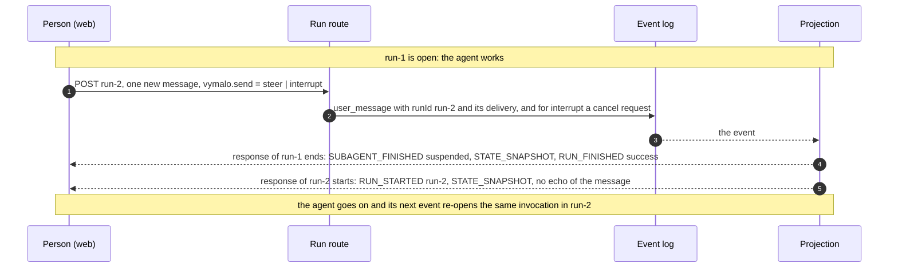

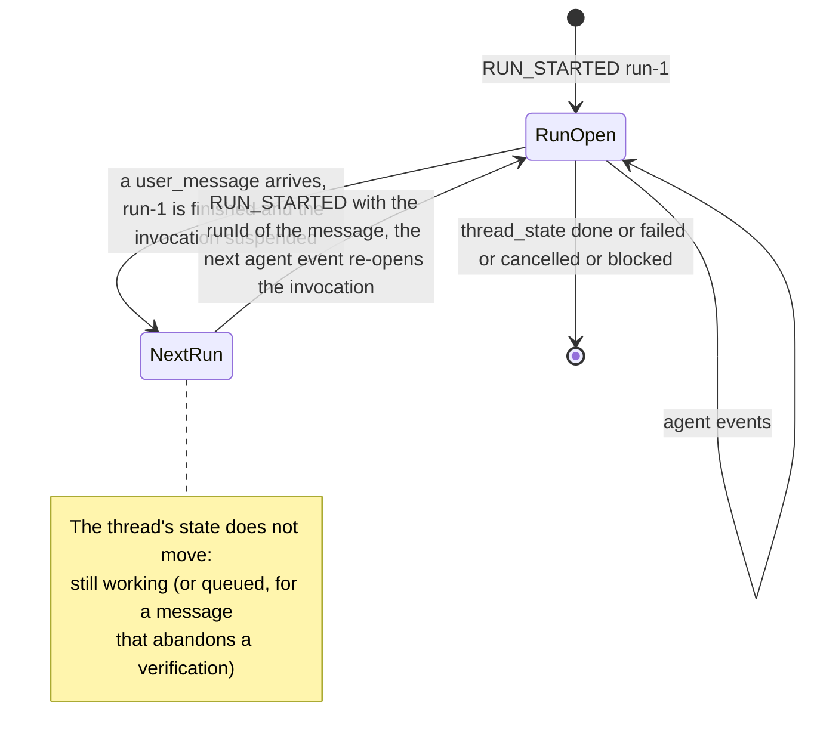

What each side reads:

- **The response to the POST that carried the message** is the run the message opened: it starts at `RUN_STARTED` under the
  request's `runId` (it never contains the run that ended, which would end it at once), does not repeat the message the
  consumer holds, and ends with the job that run was opened in. **The response of the run that was open** ends at the message:
  `SUBAGENT_FINISHED` (suspended, no ids) → `STATE_SNAPSHOT` → `RUN_FINISHED{outcome:{type:"success"}}`. `success` says the
  *run* is over, not the thread: the snapshot before it says `working` (or `queued`). A client that reads `thread.state`, as the
  web does, is not misled.
- **`steer`**: what the message does depends on the agent ([ADR 0036](../decisions/0036-sending-while-an-agent-works.md), [`steer-v1.md`](steer-v1.md)).
  An agent whose card lists `steer/v1` (`custom` of the capabilities document says so) has the message **read by its running task**:
  the job is one job, the task says what it read as an agent message of the same invocation, and the second run ends with that job
  (`thread_state{done}`), once. Golden: `steer`. Any other agent gets it **after the turn**: the second run ends with the first job,
  and the message starts job 2 in a producer-initiated run (`run-<seq>` of its `job_started`, as for any redelivered message, ADR 0020);
  so does a message the agent refused (a task that ended as it was sent). The log's order is the truth, and the projection is the same
  either way: it shows what the log holds.
- **`interrupt`**: the running task is cancelled and the message starts job 2 once it has ended, **in the run of the message**:
  the cancelled task's invocation re-opens, says `canceled` (`SUBAGENT_FINISHED{result:{status:"canceled"}}`), the `vymalo.job`
  activity and a `STATE_SNAPSHOT{queued, jobNumber: 2}` mark the boundary, and the next job's invocation follows. The abandoned
  job is never judged: no `thread_state`, no verification (the projection does not start one at its `completed`), so a viewer
  never reads `done` or `cancelled` for it. A task that asks while it is being stopped is logged and nobody waits for the
  answer: no interrupt, and its invocation is closed by the task's end or by the job boundary. A stop the agent refused for good
  goes back to being judged (the core logs an `error` of the orchestrator's, which ends the projection's "stopping"). Golden:
  `stop-and-send`.
- **A message while the work is verified** (`verifying`) is not a steer (nothing runs; the core logs no `delivery`): it still ends
  the run and opens its own, and abandons the verification as before.
- **Message metadata.** `TEXT_MESSAGE_START.metadata["vymalo.delivery"]` is `"steer"` or `"interrupt"` on a user message the core
  logged with that `delivery`; absent otherwise and in every log written before the field. A message that also mentions agents
  ([ADR 0026](../decisions/0026-agent-mentions-as-structured-references.md): `vymalo.mentions` and `vymalo.send` ride the same run)
  has both members beside `vymalo.actor`, each only when the log has it.
- **Reconnecting.** Nothing is new for a connect stream: it is a fold of the log. A cursor at the message gets a preamble for the
  run the message opened (no suspended invocation to name, so `RUN_STARTED` and `STATE_SNAPSHOT`), a cursor before it the old run's
  preamble, then the old run's end and the new run, exactly the frames an uninterrupted stream wrote. A retried POST of the message
  (same message id) attaches to the run it opened.
- **Server support.** There is no capability to read: the member is part of this surface from the build that has this section on,
  and an older orchestrator answers the 409 it always did.

Goldens: [`steer`, `stop-and-send`](examples/README.md) (the viewer's stream) and `run-steer`, `run-stop-and-send` (the two
responses, in order).

## Verification (the gate)

*Built 2026-09-30 (MVP slice 3, [ADR 0018](../decisions/0018-verification-gate-and-rework-loop.md)).* A thread whose gate
requires a source is not `done` when the agent says `completed`: the orchestrator checks the work, sends the agent back
with the findings while attempts are left, and only then finishes. A viewer sees one run across all the attempts.

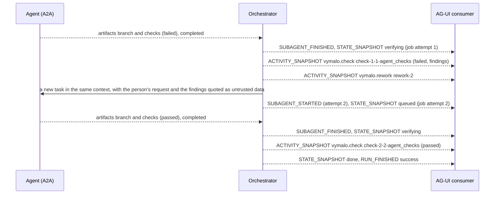

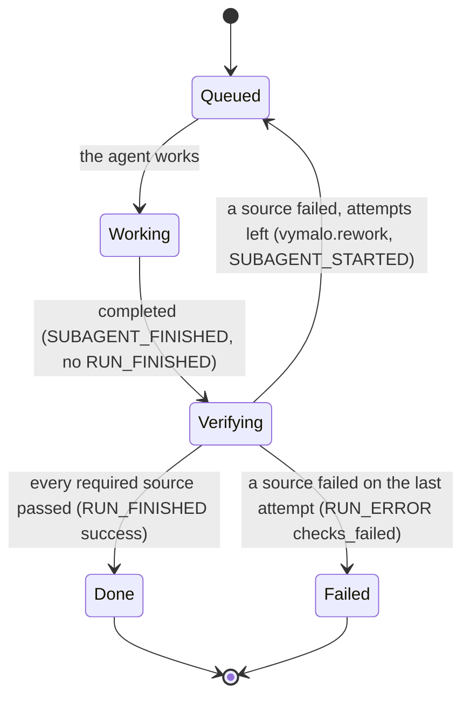

- **The run stays open** while the thread is `queued`, `working` or `verifying`, so a client that reads until the
  terminal event sees the whole job. A consumer that treats `SUBAGENT_FINISHED` as the end of the work is wrong under a
  gate; the reference client does not (it ends on `RUN_FINISHED`).
- **`STATE_SNAPSHOT`** carries `job` (see [Metadata and state](#metadata-and-state)) whenever the gate requires
  something; a thread without a gate has no `job` and its stream is exactly what it was before the gate existed.
  `verifying` is projected from the agent's `completed` on such a thread: the log has no `thread_state` for it. The one
  exception is an agent that pushed nothing (no `branch` artifact, none refused, no commit pushed by an earlier attempt of the job): the gate does not
  apply to an answer, the thread is `done` at once, and the projection says no `verifying` and no card
  ([ADR 0018](../decisions/0018-verification-gate-and-rework-loop.md#status-note-2026-10-04-only-pushed-work-is-verified)).
- **`vymalo.check`** is one card per source in one verification of one attempt. Its id is derived from the log
  (`check-<attempt>-<verification>-<source>`), and every snapshot of it says `replace: true`, so a `pending` card is
  replaced by its answer; a second verification of the same attempt (the user wrote, or a held answer was given) is a
  card of its own, at its own place in the transcript. `findings` and `summary` are
  text from a tool or a reviewer: a renderer shows them as text, never as markup or instructions.
- **`vymalo.rework`** is the orchestrator telling the agent to try again; the orchestrator's `SUBAGENT_STARTED` for the
  next attempt follows at once, because the delegation is already on its way. That delegation is a **new A2A task in the
  same context** (the first one is completed and cannot be continued); the prompt is written by the core
  (`orch-core`, `verify.rs`), so it is the same on every replica.
- **A hold** (CI or the verifier did not answer in time, or the verifier could not be reached: `error{retryable:true}` then
  `thread_state{blocked}` in a thread that was being verified) projects as any blocked thread does: the
  `vymalo.error` activity, then `RUN_FINISHED` with an `interrupt` outcome (id `int-<seq of the thread_state>`, reason
  `input_required`, the error's text as its message) that the user answers with a message or a `resume`. It is not
  `delivery_failed`.
- **The verifier** is a subagent of its own while its verdict is awaited: [below](#the-verifier-as-a-subagent).
- **`job.sha`** is the commit the agent pushed (its last `branch` artifact of the attempt), the same as `Thread.job.sha`.
  A check's own `commit` (in `vymalo.check`) is the commit the check ran on, and is not used for it.
- **Rendering rules** (what the web does, and what another consumer should): a `vymalo.check` card is replaced in place
  by its message id; a `stale` one is muted and marked as stale, because it decided nothing; the status is words first
  (passed, failed, pending), colour second. `findings`, `summary`, `name` and `commit` are drawn as plain text, never
  as markdown or HTML, and a long finding is cut with a control to read the rest. An unknown field is ignored, and a
  payload without a `source`, an `attempt` and a known `status` (or, for `vymalo.rework`, an `attempt` and
  `maxAttempts`) draws nothing. The counter "attempt/maxAttempts" is shown only while `job` is present.
- **Running out of attempts** is `RUN_ERROR` with `code: "checks_failed"`; the message names the source and the last
  findings. It is not `agent_failed`: the agent did its work, and the work did not pass.

### CI results (`vymalo.ci`)

When a CI system reports on a commit ([`webhooks.md`](webhooks.md)), the orchestrator logs a `ci_result` event and the
projection shows it as a `vymalo.ci` card, **for every report**: a report the gate counts (the pushed commit, a required
name) and one it does not (another commit, a check nobody asked for, a repeat) are both cards. What the gate made of a report is the `vymalo.check` card of the source `ci` next to it.

- **The id is `ci-<provider>-<sha>-<name>-<seq>`, unique per report**: the provider (`generic` or `github`), the full
  40-digit commit hash, the check's name and the report's `seq` in the thread's log (the inbox stores a delivery once, so
  each report is one event). It depends on the log alone, so the same log projects to the same ids for every viewer and
  every replay. **A report never replaces another card**: the snapshot says `replace: false`, so a later report about
  the same commit and check, a rerun, a repeat or a forged one leaves the earlier card, red evidence included. (An
  earlier version keyed the id by commit and name and replaced; a second report could hide a red one.) The verdict of the
  gate is not this card but the `vymalo.check` card of source `ci`, which is replaced in place as the gate decides. The
  card is the orchestrator's (no `subagentRunId`) and carries the actor `system`.
- **The content** is `{name, conclusion, passed, sha, shortSha, provider, repository, branch?, url?, summary?, at}`.
  `conclusion` is one of the closed set of [`webhooks.md`](webhooks.md#conclusions) (plus `startup_failure`, which only
  GitHub reports), `passed` says whether it counts as a pass (`success`, `neutral` and `skipped`), so a renderer never
  needs its own table and an unknown future conclusion still has a `passed`. `sha` is the full hash and `shortSha` its
  first seven characters; `repository` is the normalised key (`host/owner/name`); `provider` is `generic` or `github`.
- **Untrusted text.** `name`, `branch` and `summary` are written by whoever runs the CI: a renderer shows them as plain
  text, never as markup, never as a link, never as instructions. `url` is passed on only when it is an absolute
  `http` or `https` URL (the webhook keeps only those; the projection checks again, because the log is data), and a
  renderer shows it as a link to the run.
- **Order.** The card comes before what the report decided: `vymalo.check` (pending) → `vymalo.ci` → `vymalo.check`
  (failed or passed) → `vymalo.rework`, or the end of the run. The golden [`ci.agui.json`](examples/agui/ci.agui.json)
  is a job that waits for CI, is sent back by a red `ci/build` for commit `…01`, and finishes on a green one for `…02`
  (one run, two subagents, two `vymalo.ci` cards).
- **Rendering rules** (what the web does, and what another consumer should): the conclusion is shown in words first
  (with an icon; colour last), and a conclusion a renderer does not know is shown by its own name with `passed` deciding
  the colour; `name`, `branch` and `summary` are plain text, and a long summary is cut with a control to read the rest;
  the link to the run is drawn only when `url` is an absolute `http` or `https` URL, checked again by the renderer
  (`target="_blank"`, `rel="noopener noreferrer"`); a card is kept under the message id on the wire (one per report, and
  replaced only when the wire says so), never under its own idea of the id; an unknown field is ignored, and a payload without a required member draws nothing.

### What a build honours, and what a request may ask

The gate is configured in three layers, from the widest to the narrowest ([ADR 0018](../decisions/0018-verification-gate-and-rework-loop.md#configuration)): the deployment (`ORCH_GATE`,
`ORCH_MAX_ATTEMPTS`, `ORCH_MAX_ATTEMPTS_CAP`, `ORCH_VERIFIER`), an agent's entry in `AGENTS_FILE`
(`gate: {require, maxAttempts, verifier, ci}`) and the run that creates the thread
(`forwardedProps["vymalo.gate"]: {require?, maxAttempts?}`). A layer may **add sources, never remove one** (its `require` is the whole list and must contain the one above's;
`ci.required` names add up; a resolved policy that requires `ci` must name at least one, or the layer is refused), and may set the attempts **anywhere within `1..=ORCH_MAX_ATTEMPTS_CAP`**, lower or
higher than the layer above's (`ORCH_MAX_ATTEMPTS_CAP` is at most 100). The one removal allowed is the verifier's own
entry leaving the `verifier` source out for itself. A run may not choose the verifier or the CI settings. Sources are
spelled `agent-checks` in configuration and `agent_checks` in the API; a request accepts both, so the `gate` of
`Thread.job` can be sent back as it is. The gate is fixed when the thread is created: a run that continues a thread and
asks for a gate different from the thread's is a **409** (an identical one, or none, is served), and one the rules
refuse is a 400 whatever the thread.

| Source | In `require` as | This build |
|---|---|---|
| The agent's own checks (its `checks` artifact) | `agent-checks` | **Honoured** |
| CI on the pushed commit | `ci` | **Honoured** since MVP slice 6: a signed report about the pushed commit ([`webhooks.md`](webhooks.md)) is the verdict. The `ci` settings (`ci.required`, `ci.timeoutSecs`) are for a deployment or an `AGENTS_FILE` entry, never per thread (a request that sets them is a 400). **A gate that requires `ci` names the checks that count** (`ci.required`, `ORCH_CI_REQUIRED` for the deployment): a request that adds `ci` on a policy with no names is a 400 ("no check is named"), and a process that mounts no CI webhook refuses `ci` altogether ("no CI webhook surface is mounted (ORCH_SURFACES)"). Without a report the job is blocked with `ci_timeout` after `ORCH_CI_TIMEOUT_SECS` |
| A verifier agent | `verifier` | **Honoured** since MVP slice 10: the dispatcher asks the verifier agent and its `verdict` artifact decides. The deployment or the agent's entry names it (`ORCH_VERIFIER`, `gate.verifier`); a thread may require the source but not choose the agent |

The refusal of a source this build cannot honour is deliberate and fail-closed: a gate that required one nothing can answer would
wait for a verdict that can never come, and refusing it is the only way not to end a job "done" without the check the operator
asked for. `pending_reason` in `orch-app`'s `gate_config.rs` says which sources those are and why (none is left: `ci` was refused
until the CI webhook of slice 6, `verifier` until slice 10). A slice that makes one real
changes its arm, and also owns what that source needs beyond it: its own settings, its checks in
`GateRules::check_verifier`, and its cards in the projection. (The verifier was refused the same way until slice 10.)

### The agent's `checks` artifact

The contract the gate reads (`orch_core::recognise_artifact`, ADR 0018). An artifact named `checks` whose data part is a
JSON object:

| Field | |
|---|---|
| `passed` | boolean, required |
| `commit` | the full 40-hex commit the checks ran on, required; they count only when it is the pushed commit (a `branch` artifact) |
| `summary` | one line, optional |
| `findings` | the failing checks, optional. Each is a string, or an object (the coder writes `{check, message}`) |
| `base_commit` | optional full commit hash: the base the failing checks were re-run on, for the note |
| `preexisting` | optional boolean: `true` marks **every** finding of the report as pre-existing (the coder's shape: one command, re-run on the base, fails there too) |

A finding object may carry **`preexisting: true`** (a boolean, exactly) and `base_commit`: the check was re-run on the base
commit of the pushed work (the commit the branch was cut from) and fails there too, so this work did not cause it
([ADR 0018, 2026-10-07](../decisions/0018-verification-gate-and-rework-loop.md#status-note-2026-10-07-pushed-work-is-verified-in-every-attempt-and-a-failure-on-the-base-is-a-note)).
What the gate does with it:

| The report | The `agent_checks` result |
|---|---|
| `passed: true` | passed, as before |
| `passed: false`, every finding marked `preexisting: true`, or the report itself marked `preexisting: true` | **passed**, with a `summary` that says which: `<the agent's summary> - failing on the base commit <12 hex> too, so not caused by this work: `yarn check`, ...`; no findings, no rework |
| `passed: false`, some findings marked and some not | failed; the findings are the unmarked ones, then one that names the marked ones as failing on the base too (`leave those`) |
| `passed: false`, nothing marked, or a finding with `preexisting` of another type (`"true"`, `1`) | failed, as before: an agent that says nothing about the base is held to its checks |

A report from an agent that does not know the field (no `preexisting` anywhere) is read exactly as before. More than 20
marked findings are counted ("and N more"), not listed. The mark is the agent's word: like the rest of the agent's checks it is
the agent vouching for itself (the verifier and CI, when required, look at the commit independently). The checks of an
agent that pushed nothing are not read at all: a job with no pushed commit is an answer.

*Unverified (2026-10-07):* that adam-rs's coder writes `preexisting` and `base_commit` this way; the contract above is this
repository's side, written against the description of the change to the coder's `checks` artifact that is in progress.
*Verified 2026-10-08* (adam-rs `bin/adam-coder/src/tools/checks.rs` at `8e1133d`, `ChecksReport`): the coder marks the **report**,
not a finding: `preexisting: true` and `base_commit` beside `passed: false`, its findings strings. The gate reads that mark too
since 2026-10-08 ([ADR 0018](../decisions/0018-verification-gate-and-rework-loop.md#status-note-2026-10-08-the-owner-lets-the-gate-pass-pre-existing-failures)); a report
marked with anything but the boolean `true` is not marked.

### The verifier as a subagent

*Built 2026-09-30 (MVP slice 10).* When the gate requires the verifier, the orchestrator asks another configured agent
to review the commit the worker pushed. The consumer sees that agent as a subagent of its own, named after it, for exactly
as long as its verdict is awaited:

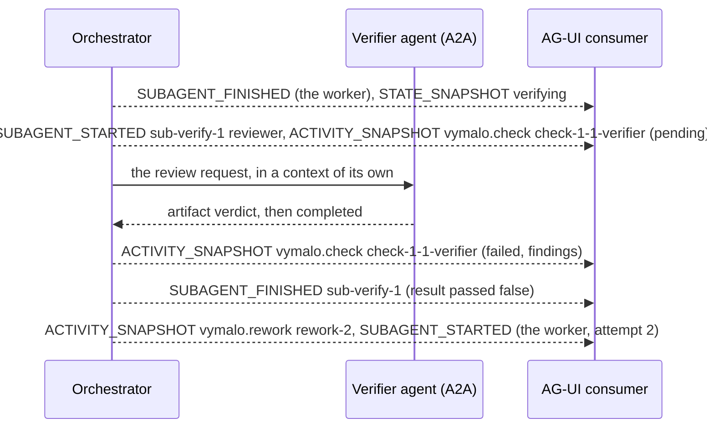

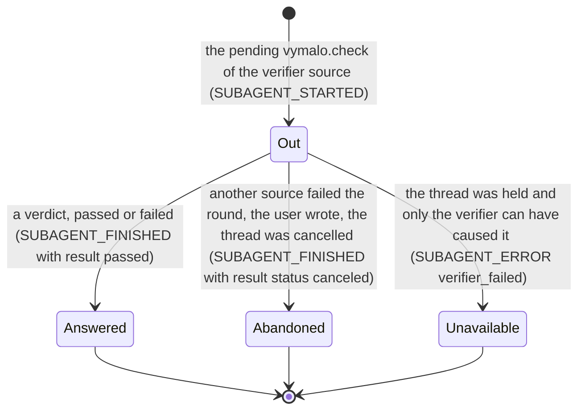

- **Id and name.** The id is `sub-verify-<verification>` (the job's verification counter, which is unique per job), so
  every replica and every replay says the same, and two verifications of one attempt have two subagents. The name is the
  verifier's agent id (the gate's `verifier`), and `metadata["vymalo.actor"]` is an agent actor of that name.
- **Not the worker.** The verifier's own words never appear as the worker's text, status or artifacts: the orchestrator
  reads its stream and keeps only the verdict. Its `SUBAGENT_FINISHED` carries `result: {passed: true|false}`; a finding
  is a finding, not a failure of the subagent, so a verdict is never a `SUBAGENT_ERROR`; a verifier that could not be used
  or was too slow is (see *Unavailable*).
- **Abandoned** covers everything that ends a verification before its verdict: the subagent ends with
  `result: {status: "canceled"}` (the same spelling as a cancelled worker), in the same response as the event that ended
  it. When CI is a required source too, a hold (a timeout, a failure) ends it this way as well, and the interrupt that
  closes the run says why: the log cannot tell which of the two sources the hold was about.
- **Unavailable.** With no CI required, a thread that is held while the verifier is out was held for the verifier: it
  failed, refused the request, asked for input nobody can give, or did not answer in time. The subagent ends with
  `SUBAGENT_ERROR` (`code: "verifier_failed"`, the hold's message), before the interrupt that asks the user what to do.
- **A client that joins** while the verifier is out gets its `SUBAGENT_STARTED` in the preamble (after the worker's, if it
  is open), so the `SUBAGENT_FINISHED` that follows closes something the client knows.
- **The verdict** is the `vymalo.check` card with `source: "verifier"`; `findings` are the verifier's words, untrusted,
  capped at 20 items and 16 KiB, and rendered as text.

The goldens [`verify-verifier-green`](examples/agui/verify-verifier-green.agui.json) (findings once, then green: attempt
2 of 3, four subagents) and [`verify-verifier-red`](examples/agui/verify-verifier-red.agui.json) (three attempts, then
`checks_failed`), with their `run-` and `connect-` variants, are this section as streams; the reference client reads all of
them in CI.

Example run input, three attempts lowered to two:

```json
{"threadId": "…", "runId": "…", "messages": [{"id": "…", "role": "user", "content": "fix the login"}],
 "forwardedProps": {"vymalo.gate": {"require": ["agent-checks"], "maxAttempts": 2}}}
```

The goldens [`examples/agui/verify-green.agui.json`](examples/agui/verify-green.agui.json) (red once, sent back, green:
attempt 2 of 3) and [`verify-red.agui.json`](examples/agui/verify-red.agui.json) (three attempts, then `checks_failed`)
are this section as streams, with the `run-` and `connect-` variants of the other goldens; the reference client reads
all of them in CI.

## Nested steps

*Built 2026-10-01 (MVP slice 5).* An agent's work has a shape (the agent, a sub-agent it delegated to, their
commands), and the log keeps it as `agent_step` events that carry their **path**, the chain of step ids a step runs
under ([ADR 0025](../decisions/0025-nested-steps-events-carry-their-source-path.md); how an agent reports them is
[`steps-v1.md`](steps-v1.md)). The projection shows the tree with what AG-UI 1.0 already has: a **sub-agent step is a
subagent** of the run, nested under the one it runs in (`SUBAGENT_STARTED.parentSubagentRunId`), and **every step is an
activity**, `vymalo.step`, attributed to the subagent that encloses it. A client that knows nothing of steps still gets
subagents the protocol defines; one that does draws the tree from the activities' `path`.

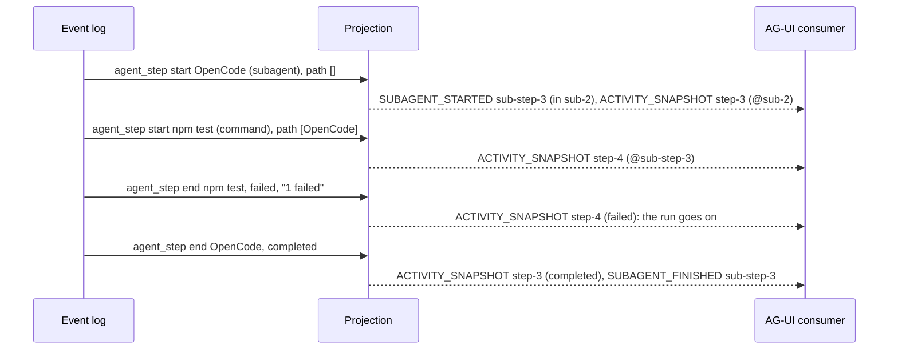

```mermaid
stateDiagram-v2
  [*] --> Open: start of a sub-agent step (SUBAGENT_STARTED, the activity)
  Open --> Open: update (the activity again)
  Open --> Ended: end completed (SUBAGENT_FINISHED), failed (SUBAGENT_ERROR step_failed), canceled (SUBAGENT_FINISHED canceled)
  Open --> Canceled: the invocation closes first (the activity says canceled, SUBAGENT_FINISHED canceled)
  Open --> Suspended: the invocation suspends (SUBAGENT_FINISHED suspended); its later events only say its activity again
  Suspended --> Ended: the end arrives in a later run (the activity only)
  Suspended --> Canceled: the invocation closes for good (the activity says canceled)
  Ended --> [*]
  Canceled --> [*]
```

| Log event | Frames |
|---|---|
| `agent_step{phase:start, kind:subagent}` | `SUBAGENT_STARTED{subagentRunId:"sub-step-<seq>", name:label, parentSubagentRunId:<enclosing>, metadata:{"vymalo.actor"}}` → the step's `vymalo.step` snapshot (attributed to the **enclosing** subagent: it is the step of the one that runs it) |
| `agent_step{start}` of another kind; any `update` | The `vymalo.step` snapshot, `replace:true`, the same `messageId` for every event of the step. Its children carry the step's own `subagentRunId` |
| `agent_step{end, completed}` of a sub-agent step | The snapshot → every open step subagent that runs under it, **deepest first**, `SUBAGENT_FINISHED{result:{status:"canceled"}}` → `SUBAGENT_FINISHED{subagentRunId}` |
| `agent_step{end, failed}` of a sub-agent step | The snapshot → the descendants as above → `SUBAGENT_ERROR{message: detail ?? "<label> failed", code:"step_failed"}`. The run goes on |
| `agent_step{end, canceled}` of a sub-agent step | The snapshot → the descendants → `SUBAGENT_FINISHED{result:{status:"canceled"}}` |
| A failed `tool` or `command` step | The snapshot only (state `failed`): the run goes on |
| The agent's invocation closes while steps have not ended (`completed`, `failed`, `canceled`, a delivery failure) | Deepest first, each step the snapshot with `state:"canceled"` (no spinner stays) and, for a sub-agent step, `SUBAGENT_FINISHED{result:{status:"canceled"}}`, then the invocation's own closing frames. The core forgot them when the task ended |
| The invocation suspends (`input_required`, `auth_required`) | Each open step subagent, deepest first, `SUBAGENT_FINISHED{outcome:{type:"suspended"}}` (**no** `interruptIds`: the interrupt is the invocation's), then the invocation's. Steps that are not subagents have nothing to suspend. When the run resumes, the step subagents are **not** started again: what the steps say next only says their activities again, attributed to the invocation |
| `job_started`, or a user message that starts the next job | The projection forgets every step |

- **The enclosing subagent** of a step is the nearest ancestor in its `path` whose subagent is open, else the agent's
  invocation. A sub-agent step's `parentSubagentRunId` is its enclosing subagent when it starts (and is said again to a
  client that joins while it is open).
- **Ids.** A step's activity is `step-<seq of its first event>` and its subagent `sub-step-<seq>`; a retry (a step that
  starts again after its end) is a new run of the step with its own seq. Subagent ids are never reused within a run.
- **A client that joins** (a connect stream with a cursor inside an open run) gets, after the invocation's
  `SUBAGENT_STARTED`, a `SUBAGENT_STARTED` for every open step subagent, parents first, so what follows closes only things
  it knows. Step subagents that were suspended are not in the preamble.
- **Nesting stays whole**: a subagent never ends while one that runs in it is open, and nothing is open when a run ends
  (the property tests check it over random logs, including suspension and resume).
- **Attribution.** `metadata["vymalo.actor"]` on a step's frames is the actor that reported it: the agent, or, for a step
  the orchestrator reports itself (a relayed tool call, an agent it asked), the actor it names.
- **Untrusted text.** `label` and `detail` come from an agent. The core cuts them (200 and 1000 characters) and drops
  control characters; a client draws them as text.
- **Input and output** ([ADR 0030](../decisions/0030-a-step-carries-its-input-and-output-bounded-and-redacted.md),
  [`steps-v1.md`](steps-v1.md#input-and-output)). The `vymalo.step` content gains `input` (an object, with the start),
  `output` (`{text, truncated?, bytes?, error?}`, with the end) and `ioDropped`, **as logged**: the snapshot of an event says
  the step as it stands, so the snapshot of the end carries the input that came with the start as well as the output. They
  are additive: a client that ignores them draws the step as before. A step's `input` and `output` are untrusted text,
  already cut and redacted by the core; a client draws them as text and does not parse `output.text`.
- **The goldens** [`steps`](examples/agui/steps.agui.json) (a sub-agent step with a command that fails, and the sub-agent
  completing) and [`steps-ask`](examples/agui/steps-ask.agui.json) (a step waiting when the agent asks: the step subagent
  suspends with the invocation, and its end is said in the next run) are this section as streams; the reference client reads
  them in CI.

## Asked agents as subagents

**Built** (2026-10-03, [ADR 0026](../decisions/0026-agent-mentions-as-structured-references.md), MVP slice 10, PR-21). The agent a
thread is addressed to may ask an agent the person mentioned to do part of the work, with the thread tool
[`ask_agent`](thread-tools-v1.md#ask_agent). The consumer sees the asked agent as a **subagent** of the one that asked, named
after it, for as long as the ask runs, and a `vymalo.ask` activity that says what was asked and how it ended.

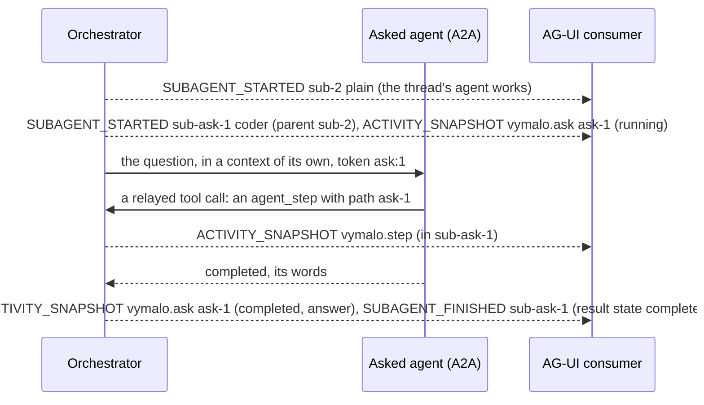

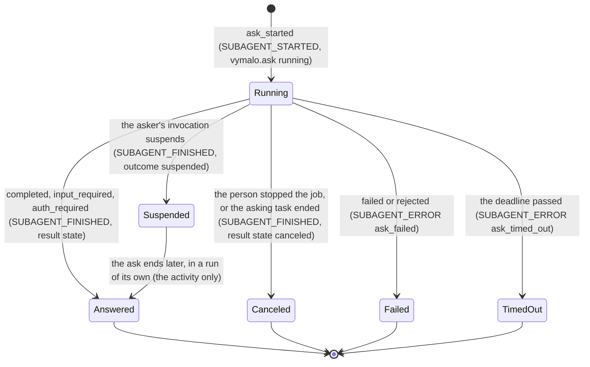

- **Id and name.** The subagent is `sub-ask-<n>` (the ask's number in the job, from 1, so every replica and every replay says
  the same) and its name is the asked agent's id; `metadata["vymalo.actor"]` of its start is an agent actor of that name. The
  activity is `ask-<n>`, the ask's step (`ask_started.stepId`), said again with `replace: true` when the ask ends.
- **Nesting.** `parentSubagentRunId` is the subagent that asked: the thread's agent's invocation; **the sub-agent step the
  call named** (`parentStepId`) while that step's subagent is open; for an ask an asked agent made, **its own `sub-ask-<m>`**.
  The activity is attributed to that subagent (it is a step of the one that asks), so a screen draws it where the call was.
  An asked agent's steps (what it does through the thread's tools, an `agent_step` with path `["ask-<n>"]`) carry
  `sub-ask-<n>` as their subagent.
- **What the activity says.** `{ask, agent, by, depth, text, stepId, parentStepId?, state, startedAt, at}`, and once the ask
  ended `answer?` (the asked agent's last words), `question?` (what it asks back), `artifacts?` and `error?`. `text` is what
  was **asked**; `state` is `running`, then the outcome (`completed`, `input_required`, `auth_required`, `failed`,
  `rejected`, `canceled`, `timed_out`). Every one of those texts is an agent's words and **untrusted**: the screen renders
  them as text.
- **Nesting stays whole.** The core ends an ask and then the asks it asked, so the projection ends what runs under an ask
  (`SUBAGENT_FINISHED` with `result: {status: "canceled"}`, deepest first) **before** the ask's own end, which the reference
  client requires; the child's own `ask_finished`, when the log gets to it, is its activity again with what the core said.
- **An ask the log does not end** when its asker's invocation ends (a copy cut mid-ask, a log the core did not close) is
  canceled with it: the activity says `canceled` ("the asking task ended") and the subagent ends, deepest first, before the
  invocation does, so no spinner stays. **An ask that outlives a suspended invocation** (the agent waits for the person
  while its ask runs) suspends with it (`SUBAGENT_FINISHED`, `suspended`) and says its end later, in a run of its own, as the
  activity alone.
- **A client that joins** while asks run gets their `SUBAGENT_STARTED` in the preamble, parents first, after the
  invocation's and the sub-agent steps', so what follows closes something it knows.
- **Not the worker.** The asked agent's own words, steps and artifacts never appear as the thread's: only its end does, in
  `ask_finished`. Its `branch` and `checks` never reach the gate. The activity is a card, not a message; the agent that
  asked says what it made of the answer in its own words.

The golden [`ask-agent`](examples/agui/ask-agent.agui.json) is this section as a stream: `sub-ask-1` (`coder`) under the
agent's invocation `sub-2`, `sub-ask-2` (`researcher`, the ask `coder` made) under `sub-ask-1`, which **ends first**, both
`completed`, and `sub-ask-3` (`researcher` again) that ends in `SUBAGENT_ERROR ask_failed`. The reference client reads it in
CI and its `expected/ask-agent.json` records the subagent each one runs in.

## Titles

A thread is created with the first words of its first message as its title, and a person can rename it at any
time, in any state of the thread, finished ones included (`PATCH /api/threads/{threadId}`, `patchThread` in the
[contract](chat-api.yaml)). The rename is one commit: the `thread_titled{title, source: "user"}` event and the
thread's new title, so a listing that says the title has the event in the log. AG-UI says it as a
`STATE_SNAPSHOT`, because the title is a member of `snapshot.thread`, and has no frame of its own:

- **A live viewer** reads the snapshot where the rename happened in the log: the screen's title changes, nothing
  else does. A run that holds only that snapshot (a rename of a thread that is not running) has no message, no
  activity and no subagent: a client with nothing to show for a run drops it after it has read its snapshot.
- **A viewer that connects later** reads the *current* title in every snapshot of the replay that comes before a
  rename and the title of each rename where it happened, so the replay may change the title more than once
  (`connect-title.agui.json`: the thread's title is `Fix the build` from the first snapshot, because that is what the
  thread has when the viewer connects) and always ends on the title the thread has. A client that keeps the last
  title it was told is right at the end of the replay.
- **A requester's response** carries the snapshot of a rename that happens during its run.

`source` is `user` for a rename and `model` for a title the orchestrator had a model write after the agent's first reply
([ADR 0005](../decisions/0005-openai-compatible-model-endpoint.md): at most twice per thread, never once a person has
renamed it, and never at all when no title model is configured); the log has no event for the first words of the first
message. The event is attributed to the person who renamed, or to the orchestrator for a model's title. A model's title
comes after the agent's reply, so a live viewer reads it as a `STATE_SNAPSHOT` in the run that is still open, or as a run of
its own that holds only that snapshot (the thread has finished by then), which the web drops. The sidebar's list (`GET /api/threads`) reads the thread's stored title, which
the rename has already changed when `patchThread` answers.

Goldens: `title.events.json` (a rename while the thread works, another after it was cancelled),
`agui/title.agui.json` (what a live viewer reads for it) and `agui/connect-title.agui.json` (what a viewer that
connects after a rename of a finished thread reads).

## Descriptions

*Built 2026-10-02 ([ADR 0035](../decisions/0035-utility-model-tasks.md)).* A thread has no description until the orchestrator's own
model writes one when a job ends or pauses for the person, or a person writes one (`PATCH /api/threads/{threadId}` with
`description`, `patchThread` in the [contract](chat-api.yaml)); a person can also clear it with an empty one. Every change is one
commit: the `thread_described{description, source}` event and the thread's stored description, so a listing that says the
description has the event in the log. AG-UI says it exactly as it says a [title](#titles), because the description is a member of
`snapshot.thread` and has no frame of its own:

- **A live viewer** reads a `STATE_SNAPSHOT` with the new `thread.description` where the event is in the log, inside the run that is
  open, or in a producer-initiated run of its own that holds only that snapshot (the model's description comes after the job's end,
  so the thread has finished by then) and that a client with nothing else to show for it drops. A cleared description is a snapshot
  with **no** `thread.description`.
- **A viewer that connects later** reads the *current* description in every snapshot of the replay before the event that wrote it,
  and the event's own where it happened, as for the title: always ending on the description the thread has.
- **The transcript does not change.** No message, activity or subagent frame, and no resume point of its own beyond the snapshot's.
- **A fork** has its parent's description from the marker on (`thread_forked.description`, absent when the parent had none).

`source` is `model` for a description the orchestrator had a model write (attributed to the orchestrator; at most once per job,
and only when the conversation has grown by `recompute.minNewMessages` messages since the last one) and `user` for a person's
(attributed to the person), which is final: the model never writes it again. The web shows it (built 2026-10-02, PR S19: [`web/README.md`](../../web/README.md#a-threads-description)); `ui.showDescriptions`
(`GET /api/config`) can hide it there. Goldens: `description.events.json` (a model's description after the job's end, then a
person clearing it), `agui/description.agui.json` (what a live viewer reads for it) and `agui/connect-description.agui.json` (what a
viewer that connects after a person wrote one reads).

## Attaching MCP servers

*Built 2026-10-02 ([ADR 0024](../decisions/0024-mcp-tools-attached-per-conversation.md), slice 8; the relay of the attached
servers' tools is built too, [`thread-tools-v1.md`](thread-tools-v1.md#attached-servers-and-the-relay-slice-8), and its calls are
[tool steps](#a-relayed-call-is-a-step) below).* A person attaches servers from the
deployment's list (`toolServers` of [`config.md`](config.md#toolservers), read with `GET /api/tool-servers`) to a conversation and
detaches them again. Two doors, one event each way:

- **When the thread is created**: `forwardedProps["vymalo.tools"]: ["websearch"]` on the run that creates it. The creation commit
  holds the `user_message`, then the `tools_attached` event, so the first message sent to the agent already has the set.
- **Afterwards**, in any state of the thread: `PUT /api/threads/{threadId}/tools` with `{"servers": [ids]}` (`putThreadTools`,
  the whole set wanted; the same set again writes nothing). What differs from what the thread has is one `tools_attached` and
  one `tools_detached`.

AG-UI says it as it says a [title](#titles), because the set is a member of `snapshot.thread` (`thread.tools`, the ids, sorted;
**no member when there are none**), and as a card, because attaching a search to a conversation is a thing that happened in it:

```
RUN_STARTED run-1
STATE_SNAPSHOT {thread: {state: "queued", title: "…", target: {…}}}
TEXT_MESSAGE_START … TEXT_MESSAGE_END                                  # the user_message
STATE_SNAPSHOT {thread: {…, tools: ["websearch"]}}                     # the tools_attached event (seq 2)
ACTIVITY_SNAPSHOT {messageId: "evt-2", activityType: "vymalo.tools", content: {attached: ["websearch"], at}}
SUBAGENT_STARTED …
```

- **A live viewer** reads the snapshot and the card where the event is in the log (inside the open run), or in a producer-initiated
  run of its own, `run-<seq>`, that holds both and closes as the thread's state closes a run (the web drops a run that holds
  nothing else).
- **A viewer that connects later** reads the *whole replay* with the set as it was at each event: a snapshot before the first
  attach says no `tools`. The preamble that re-opens an open run at a cursor says the set at the cursor.
- **The set belongs to the conversation**: a new job keeps it (`job_started` does not clear it), and a fork has the servers its
  copied log left attached, minus those its agent may not use, which the fork's own log detaches (its first events).
- **Ids only.** The card, the snapshot and the events hold no name, no URL and no credential: the screen knows each server's name
  and icon from `GET /api/tool-servers`. What the agent is told is [`attached`](thread-tools-v1.md#the-attached-member) of its
  message.
- **An agent whose card does not list `thread-tools/v1`** is told nothing; the set is still the thread's, and the screen says
  before the person sends that this agent cannot use it (the capabilities document, `custom`).

`activityType: "vymalo.tools"` has `content: {attached?: [id], detached?: [id], at}`: one of the two members, the ids that came or
went (the schema is in [Activity contents](#activity-contents)). Goldens: `tools-attach.events.json` (a thread created with one
server, then a `PUT` that adds another and drops the first), `agui/tools-attach.agui.json` (what a live viewer reads for it).

### A relayed call is a step

A call of a relayed tool (`<server>__<tool>` on the thread's endpoint) is reported by the orchestrator as **one step**
([`steps-v1.md`](steps-v1.md#6-steps-the-orchestrator-reports-itself)), so it is the same two `agent_step` events and the same
`vymalo.step` activities as any tool step ([Nested steps](#nested-steps)), with what makes it recognisable:

| Member | Value |
|---|---|
| `icon` | `mcp-server:<id>`: the id of the server, which the screen resolves with the `icon` of `GET /api/tool-servers` (a `data:` URI the deployment configured, or a generic icon). Only the orchestrator may name it |
| `kind`, `label` | `tool`, `<server name> · <tool>` |
| `input` | the call's arguments, at most 4096 bytes serialized, credentials redacted ([ADR 0030](../decisions/0030-a-step-carries-its-input-and-output-bounded-and-redacted.md)) |
| `output` | the result's text, at most 8 KiB (`truncated` and `bytes` say when it was cut), or the error the server gave (`error: true`) |
| `state` | `running` on the start, then `completed`, `failed` (`detail` the public error, no credential) or `canceled` |
| `id`, `path` | `tool-<the agent's call id>` (one id for the retries of one call), nested under the agent's own step when the agent named it (`parentStepId`), else at the top; attributed to the subagent of the agent whose call it is |

```
SUBAGENT_STARTED …                                                      # the agent that made the call
ACTIVITY_SNAPSHOT {messageId: "evt-4", activityType: "vymalo.step", content: {id: "tool-<call id>", kind: "tool", label: "Web search · echo", state: "running", icon: "mcp-server:websearch", input: {…}, path: [], at, startedAt}}
ACTIVITY_SNAPSHOT {messageId: "evt-5", activityType: "vymalo.step", content: {…, state: "completed", output: {text: "…"}}}
```

An agent does not report a step of its own for such a call (the tool says `reportsStep: true`), so the screen draws it once.
Goldens: `tools-relay.events.json` (a thread created with a server attached, the agent's call of its tool, one step
`running` → `completed`), `agui/tools-relay.agui.json` (what a live viewer reads for it).

## Forks

*Built 2026-10-01 ([ADR 0029](../decisions/0029-forking-a-thread-copies-its-log.md)).* A fork is a new thread whose log is a
copy of its parent's events up to a cut, then a `thread_forked` event, then its own life
(`POST /api/threads/{threadId}/fork`, `forkThread` in the [contract](chat-api.yaml)). Nothing new is needed to read the
copy: it is a log, and the projection folds it like any other. What a viewer of a fork reads is therefore **the
parent's frames up to the cut, with the parent's ids and resume points, then the marker**:

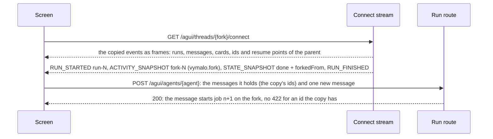

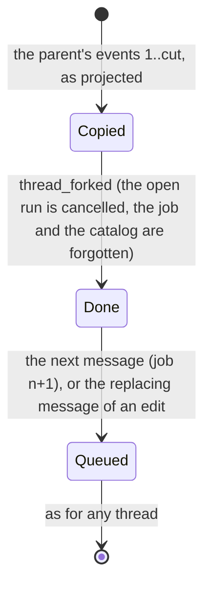

- **The marker** is a run of its own, `run-<seq of the thread_forked event>`, holding one `vymalo.fork` activity
  (`fork-<seq>`, not attributed to a subagent; [its content](#activity-contents)), the `STATE_SNAPSHOT` and the run's end.
  A screen draws it as a divider ("forked from …") and drops the run as it drops any run with nothing else in it.
- **`thread.forkedFrom`** (`{threadId, seq, kind}`, the shape of `Thread.forkedFrom`) is in every `STATE_SNAPSHOT` from the
  marker on, and not in the ones before it, which are the parent's. The parent is a thread of the same owner. The id stays
  in the snapshot when the parent is deleted later (the fork is whole); the resource API's `Thread.forkedFrom` then drops
  it, so a screen links to the parent only when the thread it holds still says it.
- **The title** is the parent's as it was when the fork was made, from the marker on (`thread_forked.title`); the snapshots
  of the copy before it say the thread's current title, as in any replay ([Titles](#titles)), and a rename of the fork
  after the marker is an event like any other.
- **A fork is a finished job.** Its state is `done` and its job number the newest the copy started, so the next message
  starts the one after it (`jobNumber` in its first snapshot, `vymalo.job` after the message, as in
  [`followup.agui.json`](examples/agui/followup.agui.json)). A question the parent was waiting on when it was cut is not an
  interrupt of the fork: a `resume` for it is ignored with a warning, as on any thread that is not blocked, and the
  message that comes with it starts the next job. A card of the copy has no surface to act on: an action on it is a 422.
- **The ids of the copy are known.** Every message, activity and run id the copy holds is one the fork holds, so a screen
  that goes on with the messages it was shown sends them back and the run is accepted (reconciliation by id; one more
  user message is the new one). The marker's own id, `fork-<seq>`, is among them.
- **The UI catalog starts empty.** The projection forgets the catalogs the copy recorded, so `thread.uiCatalog` is absent
  from the marker on and the first message that carries one sends it in full (ADR 0023): the fork's agent has been sent none.
- **An edit** (`kind: "edit"`) is the same copy up to just before a person's message, then `thread_forked`, then the
  replacing message in the same commit: the frames above, then the new run (`user_message`, `job_started`, the agent's
  events) with `jobNumber` and `forkedFrom` in every snapshot.

### A fork made with its first message

*Built 2026-10-03, backend ([ADR 0042](../decisions/0042-the-thread-list-is-the-owners.md), decisions 8 and 9); the web draft is a
later pull request.* "Fork from here" and "Continue with another agent" open a draft that writes nothing. The fork exists from
the first message, which is sent as a run that creates its thread: the consumer mints `threadId` as for any new thread and adds
`forwardedProps["vymalo.fork"] = {from, after}`. `messages` holds the one new message, and `agentId` is the agent that
answers, the parent's or another.

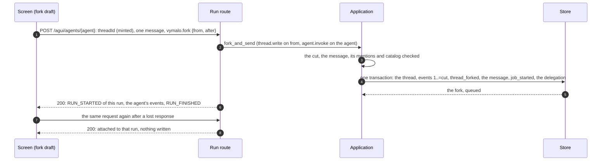

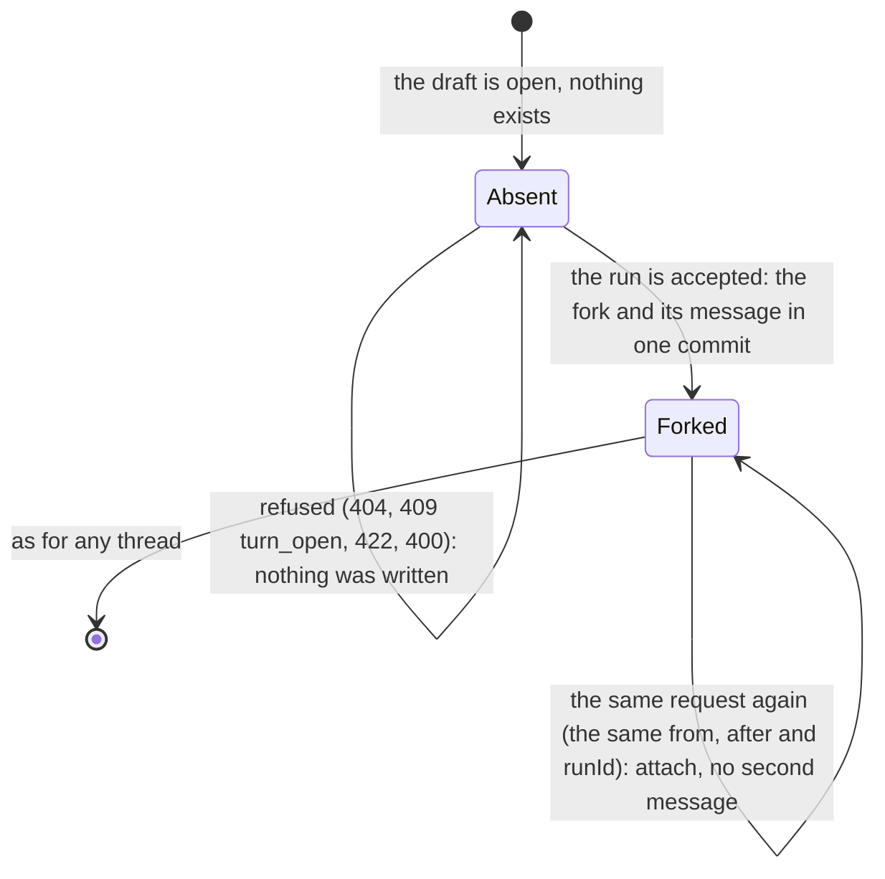

- **One transaction.** The copy of the parent's events up to the cut (the parent's files copied to the fork's keys first,
  [ADR 0032](../decisions/0032-files-from-agents-live-in-an-artifact-store.md)), `thread_forked`, the message (a `ui_catalog`
  before it when the run carries one) and `job_started`, with the delegation, are written together or not at all, so a refused
  or failed run leaves no thread. The fork is `queued`, and its agent is told the conversation it continues with the message in
  front ([ADR 0029](../decisions/0029-forking-a-thread-copies-its-log.md), decision 5).
- **Who may.** `thread.write` on `from`, which must be the caller's own thread (else 404, as everywhere), and `agent.invoke` for
  the run's `agentId`. `vymalo.mentions` are checked against that agent as for any first message; `vymalo.uiCatalog` is checked as
  for a first message, and sent to the agent in full (a fork's catalog ledger starts empty).
- **The cut.** `after` is any event of the turn to copy, as for `forkThread`: an event outside the log is **422**; a turn that
  is still going on is **409** with `code: turn_open`.
- **Where the response starts.** At the `RUN_STARTED` of this run, never in the copied turns: they are folded and not written,
  so the response is the same as a run that creates an ordinary thread. A client that was shown the parent opens the fork with
  `connectThread` when it wants the copy's frames.
- **A resend.** The member is read on the run that creates the thread. A thread that has `threadId` already answers it only
  when it is a fork of the same `from`, cut where `after` cuts, whose first message has this run's `runId`: that is the fork the
  first attempt made, and the run attaches to it (as an attach does, [Run binding](#run-binding)) and writes no second message.
  Any other existing thread is a **409**, and one that is somebody else's a **404**. The consumer keeps the id it minted so a
  resend reuses it.

Goldens: `fork.events.json` (the second message of a finished thread edited; the fork's log), `agui/fork.agui.json`
(what a viewer of that log reads), `agui/connect-fork.agui.json` (a viewer that connects to the fork over HTTP),
`fork-blocked.events.json` and `agui/fork-blocked.agui.json` (a thread waiting for an answer, forked as it is, and the
next message), `agui/connect-fork-blocked.agui.json` (a screen goes on in the fork with the messages it holds: the run is
accepted) and `agui/run-fork.agui.json` (the response of such a run). [`examples/README.md`](examples/README.md) says what
each holds.

## Mentions

**Built** (2026-10-02, [ADR 0026](../decisions/0026-agent-mentions-as-structured-references.md), MVP slice 10, orchestrator
side; the composer is a later pull request). The contract, with the offsets, the checks and what the addressed agent is
sent, is [`mentions-v1.md`](mentions-v1.md); this section says what the AG-UI binding does with it.

- **In:** `forwardedProps["vymalo.mentions"]` on the run that carries the message (the [inbound table](#inbound-ag-ui--core-input)).
  The references are the person's, read as sent: the label is the text at its offsets, **UTF-16 code units**, and the
  orchestrator never rewrites the text.
- **Log:** `user_message.mentions`, the references exactly as sent, written only after the checks. A message sent while a job
  runs adds its mentions to that job's set of mentioned agents (the agents the addressed agent may ask); a Stop & send carries
  them to the next job, with their offsets moved by what stands in front of the message in the joined text.
- **Out:** `TEXT_MESSAGE_START.metadata["vymalo.mentions"]` of the user message, the same array, so a screen draws the chips
  from the offsets and the labels it already has. The label is the person's text and the agent's name is not in it: a screen
  that wants the name looks the agent up by `agentId` in the agent list.
- **To the agent:** only when its live card lists `mentions/v1` (the capabilities document says so under `custom`, so the
  composer can warn before sending); any other agent is sent the text as it is.

```
POST /agui/agents/plain   forwardedProps: {"vymalo.mentions": [{"agentId": "coder", "label": "@coder", "start": 3, "end": 9}]}
                          messages: [{role: "user", content: "😄 @coder look at the build"}]      # the emoji is 2 UTF-16 code units
TEXT_MESSAGE_START {messageId, role: "user", metadata: {"vymalo.actor": {...},
                    "vymalo.mentions": [{"agentId": "coder", "label": "@coder", "start": 3, "end": 9}]}}
```

## The UI catalog

*Built 2026-10-01 (MVP slice 3, [ADR 0023](../decisions/0023-ui-component-catalog-as-an-a2a-extension.md)).*
Agents are meant to answer and ask through the components the person's screen can show. The web defines
them as an A2UI **inline catalog**, `{catalogId, components: {<Name>: <JSON Schema>}}`, and sends it with a
run; the orchestrator records it in the log and tells the agent (which is the business of the A2A adapter:
the `ui-catalog/v1` extension, detected from the live card, ADR 0008). It relays the catalog and does not
interpret it.

```json
{"forwardedProps": {"vymalo.uiCatalog": {
  "catalogId": "https://agents.vymalo.com/a2ui/catalogs/chat", "version": 2,
  "digest": "sha256:…",
  "catalog": {"catalogId": "https://agents.vymalo.com/a2ui/catalogs/chat", "components": {"Text": {…}, "Column": {…}}}}}}
```

**When a screen sends it.** On the run that creates a thread, and on any later run when the thread's
`STATE_SNAPSHOT` has no `thread.uiCatalog`, or the screen's `version` is higher, or it is the same `version` with
another `digest`. A screen older than the thread sends nothing (or may send its own: an older version is recorded
and never becomes current).

**What the orchestrator checks**, before anything is written (a refusal is a problem before the stream, and nothing
was created or sent):

| Rule | Refusal |
|---|---|
| the value is an object with exactly `catalogId`, `version`, `digest` and `catalog` | 400 |
| `catalogId` is an absolute `https` URL of printable ASCII, at most 256 bytes; `catalog.catalogId` is the same | 400 |
| `version` is an integer from 1 to 1 000 000 | 400 |
| `digest` is `sha256:` and 64 lowercase hex digits **and is the digest of `catalog`**: SHA-256 over its canonical JSON (keys sorted, no whitespace, strings escaped as `JSON.stringify` does, integers in decimal) | 400 |
| `catalog` is at most 64 KiB serialised | **413** |
| `catalog` has exactly `catalogId` and `components` (no `functions`, no `theme`), one to 64 components named `[A-Z][A-Za-z0-9]{0,63}`, each a JSON object | 400 |
| no `$ref`, `$dynamicRef`, `$id`, `$anchor` or `$schema` anywhere (each schema stands alone; nothing is ever fetched), keys are ASCII, numbers are integers within ±(2^53 − 1), nesting is at most 32 deep | 400 |
| each component schema is valid JSON Schema (draft 2020-12) and says `properties.component.const` is the component's name | 400 |

The known-answer vector of the digest, pinned in the orchestrator's, the web's and adam's tests: the catalog
`{"catalogId":"https://agents.vymalo.com/a2ui/catalogs/test","components":{"Note":{"type":"object","properties":{"component":{"const":"Note"},"text":{"type":"string","maxLength":10}},"required":["component","text"]}}}`
has the digest `sha256:a237e931c3a02fc72b214561e3a52d33eaf0e29c9306bbe0ef7b3da238507293` (*verified 2026-10-01* with Python: `json.dumps(catalog, sort_keys=True, separators=(",", ":"), ensure_ascii=False)` hashed with `hashlib.sha256`).

**What it does.** The value is read on **every** run, like `vymalo.gate`, so a malformed one is refused every time. It
is applied only when the run applies an input: a run that attaches to one the log holds (an idempotent retry) ignores
it, and so does one that only stops. When it is applied the core appends `ui_catalog` **first** in the commit of the
message or action it came with, once per digest (a digest the thread has recorded is not written again), actor `user`,
`data` as sent. The thread's current catalog is the highest version recorded (the same version with another digest:
the later wins), and every digest recorded stays in the log. The projection gives the event **no frame**; the state
snapshot says which catalog is current (`thread.uiCatalog`, see [Metadata and state](#metadata-and-state)). The
delegation to the agent carries the catalog inline when this input made it current, and a reference to the current
one in every other message (the delivery is in the outbox row, never a secret).

## Run binding

`POST /agui/agents/{agentId}` with `Content-Type: application/json`, `Accept: text/event-stream`
and a `RunAgentInput`. The response is `200 text/event-stream`, one JSON event per `data:` line,
from `RUN_STARTED` of the requested run to its terminal event, then EOF, as the
[HTTP + SSE binding](https://docs.ag-ui.com/spec/1.0/basic/transports/http-sse.md) says. It is the
requester-audience projection starting at the run's first log event. Frames also carry `id: <seq>`,
which standard consumers ignore. Closing the response never cancels the run.

**Where the response starts.** At the first log event the request's input caused (a `resume`
that cancels writes none: the response then starts at the next event, the cancellation); if a run
is open by then (an event opened one between the read and the write), the run's opening frames
come first (`RUN_STARTED`, the open `SUBAGENT_STARTED`, a `STATE_SNAPSHOT`), so the response always
starts with `RUN_STARTED`. **A run that creates its thread as a fork** (`vymalo.fork`) starts at its own `RUN_STARTED` too, after the
copied events, which are folded and not written. **An attach** (nothing new, the `runId` is recorded) starts at that
run's `RUN_STARTED`, wherever it is in the log, and follows it to its terminal event, live if it
is still open; a run that is finished is replayed and the response ends. The response ends after
the first terminal event (`RUN_FINISHED` or `RUN_ERROR`), or early, without one, when the process
is shutting down: a truncated run, which the client attaches to again with the same `runId`.

**The request** is `Content-Type: application/json` (a body that needs no CORS preflight is
refused), read up to 8 MiB; `Accept` must admit `text/event-stream` or say nothing. `runId` and the
message ids are recorded in the log and must be at most 256 bytes. Members the schema does not
declare are dropped with a warning; a member of the wrong type is a 400.

**Refusals before the stream.** Each is an RFC 9457 `application/problem+json` response; nothing
was streamed and nothing was written.

| Status | When |
|---|---|
| 400 | The body is not JSON or not a `RunAgentInput`; a `vymalo.mentions` that is not an array of at most 16 references of the shape above (ADR 0026); `threadId` is not a UUID, or is a version 8 UUID for a thread that does not exist yet; `protocolVersion` names another major; an id is longer than 256 bytes; an unknown release, or an agent without releases asked for one (ADR 0008); a `vymalo.gate` that is malformed, removes a required source, asks for attempts outside `1..=cap`, or needs what this build does not honour yet (ADR 0018); a `vymalo.uiCatalog` that breaks a rule of [The UI catalog](#the-ui-catalog) (the reason is in `detail`); a `vymalo.tools` that is not an array of server ids, or holds an id that is not one (ADR 0024); a `vymalo.send` that is not `"steer"` or `"interrupt"` (ADR 0036); a `vymalo.fork` that is not exactly `{from: <thread UUID>, after: <integer>}`, or that comes with `vymalo.gate` or `vymalo.tools` (ADR 0042) |
| 401 | No edge identity |
| 403 | The caller's roles lack `thread.write`, or do not name the agent for `agent.invoke` (`code: forbidden`); their roles grant nothing (`code: no_access`) |
| 404 | The `agentId` is not listed (not in the deployment's own list, and the agent registry answered without it); the thread belongs to someone else and the caller may not read it (indistinguishable from one that does not exist, including a `threadId` the caller minted that collides with another owner's); with `vymalo.fork`, the thread to fork (`from`) is not the caller's or does not exist |
| 406 | `Accept` does not admit `text/event-stream` (the protobuf framing is not offered) |
| 409 | With `vymalo.fork`: the turn to copy is still going on (`code: turn_open`), or the thread exists and is not the fork this request made. The thread targets another agent; a run is open on it and the run is not a message that says `vymalo.send` (the `detail` says what would be served); the run carries an A2UI action and the thread is finished (`done`, `failed`, `cancelled`; a **message** on a finished thread is served, it starts the next job; a stop has nothing to stop there: 422); the run continues a thread and asks for a `vymalo.gate` different from the thread's (a thread's gate is fixed when it is created; this includes the loser of a race to create it) |
| 413 | The body is larger than 8 MiB; an A2UI action is larger than the limits allow (`name`, `surfaceId`, `sourceComponentId` at most 256 bytes, `context` at most 16 KiB); a `vymalo.uiCatalog` whose `catalog` is larger than 64 KiB |
| 415 | `Content-Type` is not `application/json` |
| 422 | A `vymalo.fork` whose `after` is not an event of the parent; a `vymalo.mentions` reference that does not hold against the text, the registry or the caller's roles (see its row above); nothing to run; more than one new message; a new message that is not from the user; a message without text; a `resume` payload with no `text`; a `resume` answer together with a new message; a reused `runId`; an A2UI action that is malformed, names a surface the thread does not have, or comes with a message, an answer or a cancel; a `vymalo.tools` that names a server the deployment does not offer for the agent, or more than 16 (ADR 0024) |
| 502 / 503 | The agent's card cannot be read to validate a release; the store is unavailable or the thread is contended (`Retry-After`); the agent registry cannot say whether the `agentId` exists, or whether a mentioned agent does (503, "the agent registry is unreachable", `Retry-After`: never a 404 or a 422 while the registry is down, ADR 0022) |

## Connect binding

Our extension, a custom transport in the sense of the
[transports page](https://docs.ag-ui.com/spec/1.0/basic/transports/index.md): it keeps the event
model, the patterns and the processing rules, and frames JSON exactly as the SSE binding does. The
sequence and state diagrams are in [ADR 0012](../decisions/0012-ag-ui-user-facing-protocol.md#the-connect-stream-our-extension).

**Request.** `GET /agui/threads/{threadId}/connect`, `Accept: text/event-stream` (or none, `*/*`,
`text/*`).

| Input | Meaning |
|---|---|
| `Last-Event-ID` header | Resume after this seq: the `id:` of the last frame the client holds. Absent or empty: replay the whole thread. |
| `?mode=run` | Close after the active run's terminal event, or right after the replay when no run is open. Default: stay open. Any other value of `mode` is a 400. |

**Errors before the stream.** Each is an RFC 9457 problem and nothing was streamed.

| Status | When |
|---|---|
| 400 | `Last-Event-ID` is not a non-negative integer; `mode` is not `run` |
| 401 | No edge identity |
| 403 | The caller's roles lack `thread.read` (`code: forbidden`), or grant nothing (`code: no_access`) |
| 404 | The thread does not exist for the caller: it is missing, its id is not a UUID, or it is someone else's (whatever the caller's roles, [ADR 0039](../decisions/0039-nobody-reads-another-persons-thread.md)). One answer for all three; nothing in it names the thread or its owner. |
| 406 | `Accept` excludes `text/event-stream` |
| 503 | The store is unavailable (`Retry-After`) |

A cursor beyond the thread's last seq (stale or forged) counts as the last seq: the client waits
for new events.

**Response.** `200 text/event-stream`:

1. **Replay.** The viewer-audience projection of every event after the cursor, as a sequence of
   runs. With a cursor inside an open run, it starts with a **preamble**: that run's
   `RUN_STARTED` (same `runId`), `SUBAGENT_STARTED` for the open invocation (and for the open
   sub-agent steps, parents first: [Nested steps](#nested-steps)) and a `STATE_SNAPSHOT`, and, for a cursor that is not a resume point, the text message that was open,
   opened again with what it had said. None of the preamble frames has an `id:`. When the thread is
   idle at the cursor there is no preamble, and the stream begins with the `RUN_STARTED` of the
   next run. Every stream thus begins with `RUN_STARTED`, as the spec requires.
2. **Tail.** New log events, projected the same way, across runs, until the client closes (or the
   active run closes, with `mode=run`). Between runs the stream is idle, not closed. It also
   carries runs nobody asked for (an event the orchestrator wrote itself).
3. **Keepalive.** A comment line (`: keepalive`) at least every 15 s.

`?mode=run` ends the stream at the first point at which the thread's log, as it stood when the
client connected, has been replayed and no run is open: right after the replay of an idle thread
(a thread with no events after the cursor gets an empty stream), and at the terminal event of the
open run otherwise.

**Resume points.** `id: <seq>` is written only on the last frame of a log event and only when no
text message of the log is open, so resuming never splits a message ([live text](#live-text) is not in the log
and never has an `id:`, nor holds one back). Reconnecting with that id yields exactly
the remaining frames (property tests in `orch-agui-projection`; the replica-kill test in `orch-e2e`).
A client that lost frames after its last `id:` gets them again in the replay: it dedupes by seq, or
discards what it read after its last `id:`.

**How a request is served.** Nothing about a connection lives in the process. The replica reads the
thread's events from the first (`App::event_stream`: a log read, then wakeups, with a poll under
them) and folds all of them into the projector; the events up to the cursor are folded and not
written, which is what makes the preamble the same on every replica. So a client whose replica
dies reconnects to any other with its last `id:`, and a hundred viewers of one thread are a hundred
independent folds of the same log. Cost: a connect reads the thread's log from the start, even for
a cursor at its end. When the process shuts down and the stream has caught up, it ends without a
terminal event: a truncated stream, which the client resumes with its cursor. **Closing a connect
stream never cancels a run.**

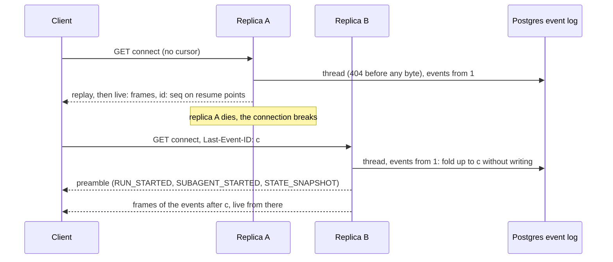

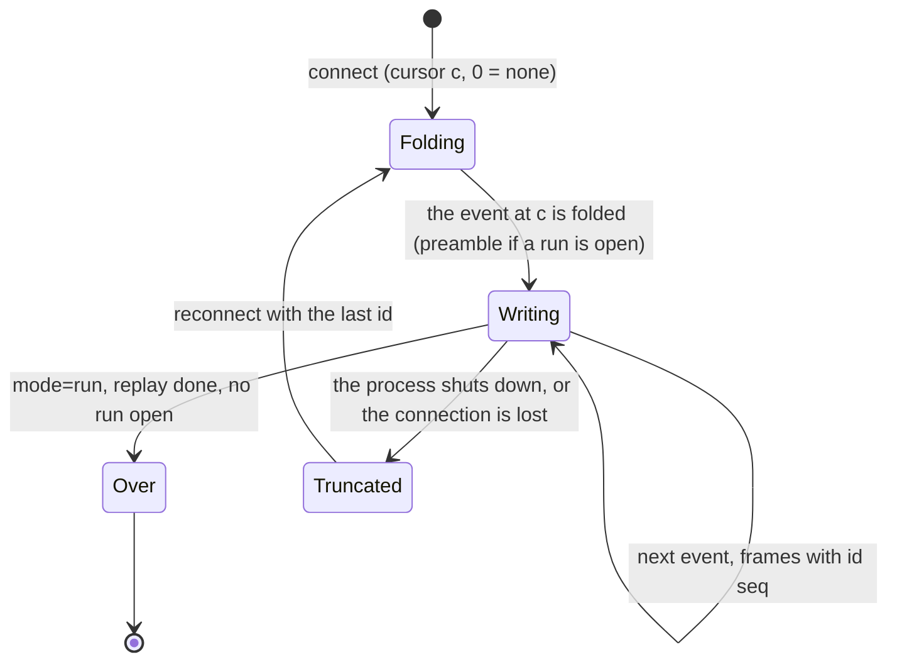

## Reading a shared thread

A thread its owner shared ([ADR 0040](../decisions/0040-thread-sharing-by-revocable-link.md)) is read through its link by two routes
that are the connect stream over the **reader projection** instead of the log: `GET /agui/shared/{token}/connect` for a signed-in
person (any role that holds `thread.read`; the identity layer applies) and `GET /agui/public/shared/{token}/connect` for **anybody**
(outside the identity layer: no identity is asked for, an `Authorization` header is ignored, and the edge strips it). `{token}` is the
link's capability, not the thread's id; a thread's own `/agui/threads/{id}/connect` is still the owner's.

**What is the same as the connect binding:** the request (`Last-Event-ID`, `?mode=run`, `Accept`), the frames (the same
projection, `id:` on resume points), the replay from the start or a cursor, the follow across runs, keepalive comments. What the
owner writes after sharing is shown too (a link is live, not a snapshot).

**What is different:**

- **The log goes through the reader projection** (`orch_app::reader`): a person's messages are by **"the owner"**, never an e-mail;
  the thread's `thread_forked`, `ui_catalog`, `thread_shared` and `thread_unshared` events are replaced by an inert event with the same
  `seq` (so numbering and a client's cursor hold, and the AG-UI projection says nothing for it); a step has its label and state and,
  for a **public** reader, no input, output or detail unless `sharing.public.stepIo`; a file is not named to a public reader unless
  `sharing.public.files`. Free text is shown as the owner wrote it.
- **Read-only.** The stream starts no run and takes no input; a run `POST` with the thread's id by anybody but the owner is the 404 it
  always was.
- **The stream ends** when the link is taken down, replaced by a new one (`POST …/share/rotate`), or narrowed below what the stream was
  opened for (`public` for the public route, `internal` for the signed-in one), and when the one-hour cap passes (a signed-in stream
  also at its token's expiry). The share is read again when a `thread_shared` or `thread_unshared` event passes, so a revocation ends a
  stream as soon as it is committed, and at least every 30 s whatever else happens (*unverified* under load; the number is the
  planner's); a store that cannot answer ends it too. The client's reconnect then gets the 404.
- **One 404** for every way a link can fail: an unknown or malformed token, a bad MAC, a private or revoked thread, a cap that was
  lowered, an `internal` link on the public route. The same body for each, before any stream byte.
- **The public route is rate limited** per link and in all, and holds one of the link's **stream permits** while open (5 per link and
  50 in all by default, `sharing.rateLimit`): 429 with `Retry-After` and `code: too_many_streams` when they are taken.
- **Headers:** `Cache-Control: no-store, no-transform`, `X-Accel-Buffering: no`, `X-Robots-Tag: noindex, nofollow`.
- **A reader joining late** sees a reply that is still being written once it is committed to the log, not the text in flight (live
  text is relayed, not stored: [ADR 0027](../decisions/0027-live-text-relayed-not-stored.md)).

| Status | When |
|---|---|
| 400 | `Last-Event-ID` is not a non-negative integer, or `mode` is not `run` |
| 401 | Signed-in route: no identity |
| 403 | Signed-in route: no role of the caller holds `thread.read`, or their roles grant nothing |
| 404 | **Every** link that does not work (one body) |
| 406 | `Accept` excludes `text/event-stream` |
| 429 | Public route: too many open streams for this link or in all |

## Capabilities document

`GET /agui/agents/{agentId}/capabilities` → `200 application/json`, an `AgentCapabilities`
(validated against the vendored schema in tests), `Cache-Control: no-store`. The spec fixes the
shape and leaves retrieval open. Errors: 401 without an identity, 404 for an `agentId` that is not
listed, 503 when the agent registry cannot say whether it is (ADR 0022).

- `identity`: `name` is the display name from the configuration or the registry; `description` and `version` come from the live
  A2A card, and are absent when the card has none or cannot be read;
- `transport{streaming:true, resumable:true}`: `resumable` speaks of the connect stream above, a
  transport of our own (the spec: "a consumer MUST NOT expect either of the standard bindings to
  honour" it);
- `humanInTheLoop{supported:true, interrupts:true}`;
- `multiAgent{supported:true, delegation:true, subagents:[{name:<agentId>, description}]}`: the agent
  runs as a subagent of the run, and `name` is the `name` of its `SUBAGENT_STARTED` (`subagents` is
  a list in the 1.0 schema, not a flag);
- `custom["https://agents.vymalo.com/a2a/extensions/release-channels/v1"] = {defaultChannel,
  channels, revisions}` only when the card advertises the extension (ADR 0008);
- `custom[<uri>] = {}` for each extension of the orchestrator's own the card lists, by exact URI: `https://agents.vymalo.com/a2a/extensions/ui-catalog/v1`, `…/thread-tools/v1`, `…/steps/v1`, `…/mentions/v1`, `…/text-stream/v1` and `…/steer/v1` (ADR 0008, ADR 0036; the key is the signal, so a client can flag an agent before it sends anything: an agent that does not list `ui-catalog/v1` is sent no catalog);
- `custom["https://a2ui.org/a2a-extension/a2ui/v0.9.1"] = {supportedCatalogIds}`, and the same under
  `…/a2ui/v1.0`, only for each A2UI extension the live card lists (ADR 0013; both URIs are detected,
  open question 22). `supportedCatalogIds` are the catalogs the web renders, not the agent's.

The card is read on every request and never cached (ADR 0008). A card that cannot be read in time
(3 s) gives the smaller document (fail closed): identity with the name only, and no `custom`. The
document is [the golden](examples/README.md#connect-streams) `capabilities-<agent>.json`.

## A2UI (generative UI)

An agent's result is sometimes an interface: a form that answers its question, a card, a button that
opens the pull request. [ADR 0013](../decisions/0013-a2ui-generative-ui.md) chose
[A2UI](https://a2ui.org/) for it, end to end over standards: **agent → A2A (A2UI extension) →
orchestrator → AG-UI `a2ui-surface` activity → web**, and the user's action the other way. This section
is what the orchestrator does with it. The renderer, and the rules that only a renderer can enforce
(vocabulary, expansion, links), are the web's ([ADR 0013](../decisions/0013-a2ui-generative-ui.md#the-web-renderer)).

### Facts this rests on

*Verified 2026-09-29* unless it says otherwise. Sources: the A2A extension pages
[v0.9.1](https://a2ui.org/specification/v0.9.1-a2ui-extension-specification/) and
[v1.0](https://a2ui.org/specification/v1.0-a2ui-extension-specification/), the protocol pages
[v0.9.1](https://a2ui.org/specification/v0.9.1-a2ui/) and
[v1.0](https://a2ui.org/specification/v1.0-a2ui/), the
[assistant-ui A2UI page](https://www.assistant-ui.com/docs/tools/a2ui.md) and the npm package
`@ag-ui/a2ui-middleware` 0.0.10 (its `dist/index.d.ts` and `dist/index.js`, read from the registry tarball).

| Claim | v0.9.1 (current) | v1.0 (candidate) |
|---|---|---|
| Media type of a part that carries A2UI | `application/a2ui+json`, in `DataPart.metadata["mimeType"]` | the same |
| The part's `data` | "MUST be an array of messages", processed in order, a failing message not stopping the rest | the same |
| A2A extension URI | `https://a2ui.org/a2a-extension/a2ui/v0.9.1` | `https://a2ui.org/a2a-extension/a2ui/v1.0` |
| Advertising it in the card, activating it | both optional ("encouraged" for the card); activation is by the `X-A2A-Extensions` header | the same |
| What the client sends with a message | `message.metadata["a2uiClientCapabilities"] = {"v0.9.1": {"supportedCatalogIds": [...]}}` | `message.metadata["a2uiRendererCapabilities"] = {"v1.0": {"supportedCatalogIds": [...]}}` (renamed) |
| Card extension `params` | `supportedCatalogIds?`, `acceptsInlineCatalogs?` | the same |
| `version` member of every message | `"v0.9.1"` | `"v1.0"` |
| Operations, one per message | `createSurface`, `updateComponents`, `updateDataModel`, `deleteSurface` | those, and `callRendererFunction`, `agentFunctionResponse` |
| Component shape | `{"id", "component": "Text", …}` in the protocol page (the extension page's example still uses the nested `{"Text": {…}}` form) | `{"id", "component", …}` |
| An action, back to the agent | `{"version", "action": {"name", "surfaceId", "sourceComponentId", "timestamp", "context"}}`, all five required, in a data part of the same media type | the same |
| Basic catalog id | `https://a2ui.org/specification/v0_9_1/catalogs/basic/catalog.json` (protocol page); the extension page writes `…/v0_9/…` | `https://a2ui.org/specification/v1_0/catalogs/basic/catalog.json` |
| Orchestrators and attribution | "the orchestrator is responsible for setting or validating" the `iconUrl` and `agentDisplayName` of a `createSurface` theme, so a sub-agent cannot pose as another (v0.9.1 protocol page) | not re-checked |

The AG-UI side (*verified 2026-09-29*): the ecosystem carries A2UI as `ACTIVITY_SNAPSHOT` with
`activityType: "a2ui-surface"`, `content.a2ui_operations` and `replace: true` (`@ag-ui/a2ui-middleware`);
a surface is keyed by the `surfaceId` inside the operations, not by `messageId`; an action returns as
`forwardedProps.a2uiAction.userAction`, whose members are all optional in the middleware's type
(`name`, `surfaceId`, `sourceComponentId`, `context`, `timestamp`); the middleware itself emits `version: "v0.9"`.

*Unverified:* whether an A2A 1.0 agent puts the media type in `Part.mediaType` or in
`metadata.mimeType`. The A2UI pages predate A2A 1.0 and show `metadata`; so both are read and both
are written. Whether every agent that activates by header also needs `message.extensions` is unknown; both
are sent. The v1.0 pages are a candidate and will move.

### Capability detection

ADR 0008: read live, never cached, fail closed. The A2A adapter reads the live card for every call
that sends a message and for every capabilities request.

- The card **lists** A2UI when `capabilities.extensions` has an entry whose `uri` is exactly one of
  the two URIs above. Any other URI, a different scheme, a trailing slash or another case is not A2UI.
  Both may be listed; then `v0.9.1` is spoken (open question 22).
- **Listed:** the message carries `a2uiClientCapabilities` (or `a2uiRendererCapabilities` for v1.0) with
  the basic catalog the web renders, the URI is added to `A2A-Extensions` and to `message.extensions`
  (with the release-channels URI when a release is selected), and the capabilities document declares
  `custom[<uri>] = {supportedCatalogIds}`.
- **Not listed** (or the card unreadable): nothing A2UI-specific is sent or declared. The next message
  after a card changes follows the new card.
- **The UI catalog** (ADR 0023) rides on A2UI and is its own extension, `ui-catalog/v1`: it is sent only when the card **also** lists
  `https://agents.vymalo.com/a2a/extensions/ui-catalog/v1` (read for that very message). Then the message carries
  `metadata["https://agents.vymalo.com/a2a/extensions/ui-catalog/v1"] = {catalogId, version, digest, inline}`, the A2UI
  `supportedCatalogIds` start with our `catalogId` in **every** such message (so a strict A2UI agent never thinks the screen lost the
  catalog), and the catalog is in `inlineCatalogs` only in the message that made it current, when the agent's A2UI entry says
  `acceptsInlineCatalogs: true` (`inline: true`); in every other message, `inline: false`: the agent has the catalog or asks for it
  again. A card without the URI gets exactly the message it got before.
- A surface is **relayed whether or not the card lists the extension**: activation is optional in
  A2UI and a part is recognised by its media type. An **action** goes to the agent that sent the surface
  whatever the card says now, in the version its surface spoke.

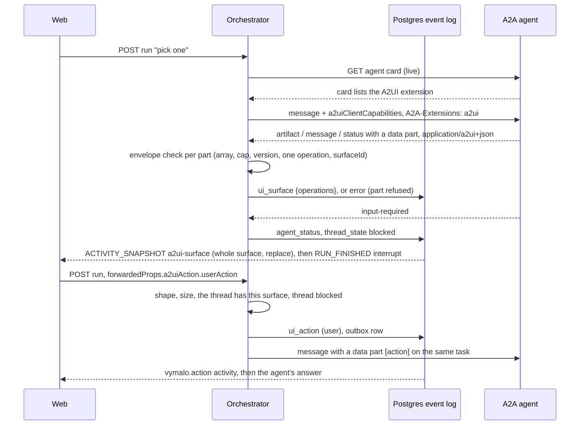

### The envelope check

Every A2UI part passes it before anything is stored or shown; there is no path around it
(`orch_core::check_operations`, run by the A2A adapter on each part and again by `transition` on every
`AgentUpdate::Ui`, so an adapter that forgot cannot put an unchecked payload in the log). A part that fails becomes an `error` event (`retryable:false`, the rule
that broke, attributed to the agent) and **nothing of it is passed on**; the rest of the message, and
the turn, go on.

| Rule | Limit |
|---|---|
| The part is a data part whose `data` is a JSON array | not text, raw or a URL, even with the media type |
| Not empty; at most | 256 messages |
| Serialised size at most | 64 KiB (the renderer's per-surface limit, so a payload it would refuse is never stored) |
| Every message is an object with a string `version` | `v0.9`, `v0.9.1` or `v1.0`; anything else is refused |
| Every message has exactly one operation | `createSurface`, `updateComponents`, `updateDataModel` or `deleteSurface`; the `v1.0` function messages are not relayed |
| The operation body is an object with a `surfaceId` | 1 to 256 bytes |

Components are **not** validated against a catalog here: that is the renderer's job and it refuses what
it does not know. The error text names the rule and repeats at most a 32-character excerpt of what the
agent sent. Replays are safe: a part's idempotency key is its place in the message, artifact or
status (`a2a:<task>:artifact:<id>:ui:<part>`, `a2a:msg:<id>:ui:<part>`,
`a2a:<task>:status-msg:<id>:ui:<part>`), so a poll after a crash and the stream it replaces collapse
into one event. A surface that accompanies `input-required` is recorded **before** the status, so it is
inside the run that the question ends.

### Surfaces in the projection

The projector keeps, per surface, the operations received so far. A snapshot carries all of them, so a
client that holds only the last snapshot of a surface renders it completely, and a viewer that connects
late or resumes with a cursor gets the same story. A surface's replayed operations are capped at
256 KiB; past that the viewer gets one `vymalo.error` line, the surface keeps its last good snapshot and
its later updates are not shown. The projector also knows which surfaces the thread has and the version
each speaks; the inbound side uses that.

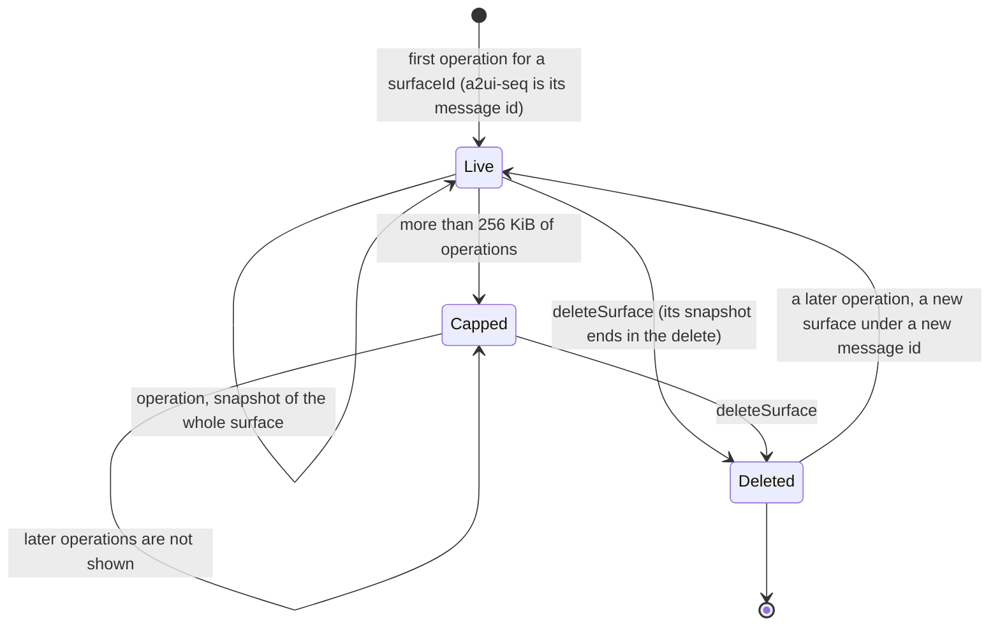

### Actions

A click on an A2UI `Button` with an `event` action reaches `POST /agui/agents/{agentId}` as a run whose
`forwardedProps.a2uiAction.userAction` holds the action and whose `messages` hold nothing new. The
orchestrator:

1. reads the action (`name`, `surfaceId`, `sourceComponentId` strings, `context` an object): otherwise
   **422**;
2. checks the sizes (256 bytes for the three strings, 16 KiB for `context`): otherwise **413**;
3. checks that the thread **has the surface now**, with the version it speaks: otherwise **422**. An
   action for a surface that was never sent, that was deleted, or on a thread that does not exist yet,
   reaches nothing;
4. applies the usual rules of an input: not someone else's thread (404), the URL's agent is the
   thread's (409), no run is open (409), the thread is not finished (409; a message is served, see above), the `runId` is new (422),
   and no message, `resume` or cancel comes with it (422). Since a run is open exactly while the thread
   is `queued` or `working`, an action can only be sent while the thread **waits** (`blocked`);
5. writes `ui_action` (attributed to the user; the log's own time is the action's time) and one outbox
   row, under the idempotency key `agui:<threadId>:run:<runId>`;
6. delivers it as a message with one data part (`application/a2ui+json`, the media type on the part and
   in `metadata.mimeType`) holding `[{"version": <the surface's>, "action": {"name", "surfaceId",
   "sourceComponentId", "timestamp": <RFC 3339>, "context"}}]`. On a thread blocked by the agent it
   continues the **same A2A task**, as a message does. `userMessage` (text the agent wrote for the
   click) is dropped; `a2uiClientDataModel` is not sent (ADR 0013).

**A Choices answer.** The `Choices` component of the web's UI catalog ([`ui-catalog-v1.md`](ui-catalog-v1.md#choices-answers))
asks several questions at once and sends **one** action for all of them: `name` is the component's `action.event.name` (default
`answer`), `sourceComponentId` is its id, and `context` is `{"answers": [{"id": "db", "values": ["pg"]}, {"id": "auth",
"values": [], "other": "Keycloak"}]}`, one entry per question in question order (`other` only for a question that allows it, at
most 500 characters; the whole stays inside the 16 KiB of `context`). The orchestrator does nothing special: it is an action like
the others, and the `vymalo.action` activity carries the same `context`. A client may show an action whose `context.answers` has
this shape as **the person's answer** and not as a step: the web draws a right-aligned "Your answers" bubble above the agent's turn,
with the question and the labels of the options chosen, resolved from the surface the action names (the question ids and the
option values themselves when that surface is not in the transcript).

### Threat model

The surface is **untrusted input from an agent**, and the click is untrusted input from a browser.
The orchestrator's part:

| Threat | Defence |
|---|---|
| A malformed or huge payload fills the log, or crashes a viewer | Envelope check and the 64 KiB and 256-message caps before anything is stored; a replay cap per surface |
| Unvalidated agent JSON reaches a viewer | It cannot: the projection relays only what `ui_surface` holds, and an operation in the log that fails the check is skipped, not relayed |
| An agent poses as another agent, or as the system | The activity is attributed by the event's actor (`vymalo.actor`), set by the orchestrator from the configured agent, never from the payload. The `iconUrl` and `agentDisplayName` an agent may put in a `createSurface` theme are relayed as sent, like everything else in the payload (the A2UI spec makes an orchestrator responsible for them). The requirement is on the renderer: label a surface by `vymalo.actor`, never by the payload's own name or icon. A renderer that draws them would let one agent pose as another |
| A user, or a forged request, acts on a surface the thread never had | The action is accepted only for a surface the log shows the thread has (and not deleted), from the thread's owner |
| A forged action carries a huge or hostile `context` | 16 KiB and the string caps, refused before storage; the context is data for the agent, never executed here |
| The orchestrator is made to fetch a URL | It never does: URLs in a surface are the renderer's to show or refuse (http(s) only, ADR 0013). The only URLs the orchestrator reads are the configured agent cards |
| A card that stops advertising A2UI keeps receiving capabilities | Nothing is cached; the card is read for every message, and A2UI-specific parts go out only if it lists the extension |
| An agent floods the log with surfaces | Each part is at most 64 KiB and a surface is replayed at most 256 KiB, but the log itself is as unbounded as an agent's text messages are: a per-turn budget is not built (open) |
| A surface arrives late, after the run | It opens a run of its own and closes it, like any late event (open question 17); it is never dropped silently |

What only the renderer can do (vocabulary, template expansion, depth, actions that never auto-send) is in
ADR 0013 and is the web's, built (2026-09-29: [`web/README.md`](../../web/README.md#a2ui-surfaces));
nothing here relies on it for storage safety, and a viewer must not trust the log to be catalog-valid.

## `vymalo.*` schemas

Activity types, metadata keys and custom capability keys carry the `vymalo.` prefix or a URI we
own, as the spec asks of vendor keys. A client that knows none of them still sees conforming runs.

### Activity contents

```json
{
  "$schema": "https://json-schema.org/draft/2020-12/schema",
  "$defs": {
    "vymalo.status": {
      "type": "object",
      "required": ["status", "at"],
      "additionalProperties": false,
      "properties": {
        "status": { "enum": ["submitted", "working", "input_required", "auth_required", "completed", "failed", "canceled"] },
        "detail": { "type": "string", "description": "Never for completed, input_required and auth_required: their words are an assistant message st-<seq>" },
        "at": { "$ref": "#/$defs/at" }
      }
    },
    "vymalo.artifact": {
      "type": "object",
      "required": ["kind", "name", "at"],
      "additionalProperties": false,
      "properties": {
        "kind": { "enum": ["branch", "checks", "pull_request", "file"] },
        "name": { "type": "string" },
        "mimeType": { "type": "string" },
        "uri": { "type": "string", "description": "Rendered as a link only when absolute http(s)" },
        "text": { "type": "string" },
        "repository": { "type": "string", "description": "branch, pull_request: host/owner/name, lower case" },
        "branch": { "type": "string", "description": "branch, pull_request" },
        "sha": { "type": "string", "description": "branch, checks: the full commit hash" },
        "shortSha": { "type": "string", "description": "branch, checks: the first 7 characters of sha" },
        "passed": { "type": "boolean", "description": "checks" },
        "url": { "type": "string", "description": "pull_request: https only, at most 2 KiB" },
        "number": { "type": "integer", "minimum": 0, "description": "pull_request" },
        "at": { "$ref": "#/$defs/at" }
      }
    },
    "vymalo.error": {
      "type": "object",
      "required": ["message", "retryable", "at"],
      "additionalProperties": false,
      "properties": {
        "message": { "type": "string" },
        "retryable": { "type": "boolean" },
        "at": { "$ref": "#/$defs/at" }
      }
    },
    "vymalo.action": {
      "type": "object",
      "required": ["surfaceId", "name", "sourceComponentId", "context", "at"],
      "additionalProperties": false,
      "properties": {
        "surfaceId": { "type": "string" },
        "name": { "type": "string" },
        "sourceComponentId": { "type": "string" },
        "context": { "type": "object" },
        "at": { "$ref": "#/$defs/at" }
      }
    },
    "vymalo.check": {
      "type": "object",
      "description": "One source of the verification gate answered for one attempt (ADR 0018). Findings are untrusted text.",
      "required": ["source", "attempt", "status", "at"],
      "additionalProperties": false,
      "properties": {
        "source": { "enum": ["ci", "agent_checks", "verifier"] },
        "attempt": { "type": "integer", "minimum": 1 },
        "status": { "enum": ["pending", "passed", "failed"] },
        "name": { "type": "string", "description": "The CI check this is, when the source is CI" },
        "commit": { "type": "string", "description": "The commit the answer is about" },
        "summary": { "type": "string" },
        "stale": { "const": true, "description": "The answer belongs to a verification that is no longer the current one; it decided nothing" },
        "findings": { "type": "array", "maxItems": 20, "items": { "type": "string" }, "description": "What is wrong; at most 20 items and 16 KiB in all" },
        "at": { "$ref": "#/$defs/at" }
      }
    },
    "vymalo.ci": {
      "type": "object",
      "description": "A CI system reported a check on a commit (ADR 0017). name, branch and summary are untrusted text; url is http(s) only.",
      "required": ["name", "conclusion", "passed", "sha", "shortSha", "provider", "repository", "at"],
      "additionalProperties": false,
      "properties": {
        "name": { "type": "string", "description": "The check's name (ci/build)" },
        "conclusion": { "enum": ["success", "neutral", "skipped", "failure", "cancelled", "timed_out", "action_required", "stale", "startup_failure"] },
        "passed": { "type": "boolean", "description": "true for success, neutral and skipped" },
        "sha": { "type": "string", "description": "The commit the check ran on, 40 hex digits" },
        "shortSha": { "type": "string", "description": "The first 7 characters of sha" },
        "provider": { "enum": ["generic", "github"] },
        "repository": { "type": "string", "description": "host/owner/name, lower case" },
        "branch": { "type": "string" },
        "url": { "type": "string", "description": "A link to the run; absolute http(s) only" },
        "summary": { "type": "string", "description": "A short text from the provider, at most 16 KiB" },
        "at": { "$ref": "#/$defs/at" }
      }
    },
    "vymalo.rework": {
      "type": "object",
      "description": "The gate failed and the agent is sent back to work (ADR 0018).",
      "required": ["attempt", "maxAttempts", "findings", "at"],
      "additionalProperties": false,
      "properties": {
        "attempt": { "type": "integer", "minimum": 2, "description": "The attempt that starts now" },
        "maxAttempts": { "type": "integer", "minimum": 1 },
        "findings": {
          "type": "array",
          "items": {
            "type": "object",
            "required": ["source", "findings"],
            "additionalProperties": false,
            "properties": {
              "source": { "enum": ["ci", "agent_checks", "verifier"] },
              "findings": { "type": "array", "items": { "type": "string" } }
            }
          }
        },
        "at": { "$ref": "#/$defs/at" }
      }
    },
    "vymalo.step": {
      "type": "object",
      "description": "A step of the agent's work (ADR 0025, steps/v1), as it stands: every event of the step says it again under the same message id. label and detail are untrusted text.",
      "required": ["id", "path", "kind", "label", "state", "startedAt", "at"],
      "additionalProperties": false,
      "properties": {
        "id": { "type": "string", "maxLength": 200, "description": "Unique within the thread" },
        "path": { "type": "array", "maxItems": 8, "items": { "type": "string" }, "description": "The ids of the steps it runs under, outermost first; empty at the top" },
        "kind": { "enum": ["subagent", "tool", "command", "message"] },
        "label": { "type": "string", "description": "One line, at most 200 characters" },
        "state": { "enum": ["running", "waiting", "completed", "failed", "canceled"] },
        "icon": { "type": "string", "description": "agent, read, edit, delete, move, search, execute, think, fetch, web, git, test, file or tool; for a step the orchestrator reports itself also mcp-server:<id>" },
        "detail": { "type": "string", "description": "At most 1000 characters" },
        "input": { "type": "object", "description": "What the tool was called with (ADR 0030): a JSON object of at most 4096 bytes serialized, credentials redacted; or {\"_cut\": true, \"bytes\": n} when it was bigger. Logged with the start; every later snapshot of the step says it again" },
        "output": {
          "type": "object",
          "description": "What the tool returned, or the error it returned (ADR 0030): on the snapshot of the step's end. Untrusted text",
          "required": ["text"],
          "additionalProperties": false,
          "properties": {
            "text": { "type": "string", "description": "At most 8192 bytes: the head and the tail of a longer text, with a line between that says how much is not kept. Credentials redacted" },
            "truncated": { "const": true, "description": "text is not all of what the tool returned" },
            "bytes": { "type": "integer", "minimum": 0, "description": "The size of all of it, when truncated" },
            "error": { "const": true, "description": "text is the error the tool returned" }
          }
        },
        "ioDropped": { "const": true, "description": "The step had an input or an output that the job's budget (2 MiB) had no room for" },
        "startedAt": { "type": "string", "format": "date-time", "description": "When the step started (the time of its first event)" },
        "at": { "$ref": "#/$defs/at" }
      }
    },
    "vymalo.job": {
      "type": "object",
      "description": "The thread's next job started (ADR 0020).",
      "required": ["job", "at"],
      "additionalProperties": false,
      "properties": {
        "job": { "type": "integer", "minimum": 2 },
        "at": { "$ref": "#/$defs/at" }
      }
    },
    "vymalo.fork": {
      "type": "object",
      "description": "The thread began as a copy of another (ADR 0029): where the copy ends.",
      "required": ["from", "kind", "title", "target", "at"],
      "additionalProperties": false,
      "properties": {
        "from": {
          "type": "object",
          "required": ["threadId", "seq"],
          "additionalProperties": false,
          "properties": {
            "threadId": { "type": "string", "format": "uuid", "description": "The thread that was forked" },
            "seq": { "type": "integer", "minimum": 0, "description": "The last event copied; the marker's event is seq + 1" }
          }
        },
        "kind": { "enum": ["fork", "edit"], "description": "fork: a copy to the end of a turn; edit: a copy to just before a person's message, followed by the edited message" },
        "title": { "type": "string", "description": "The parent's title when the fork was made, which is the fork's" },
        "target": { "type": "object", "required": ["agentId"], "properties": { "agentId": { "type": "string" }, "release": { "type": "string" } }, "description": "The agent the fork talks to: the parent's, unless the person chose another" },
        "at": { "$ref": "#/$defs/at" }
      }
    },
    "vymalo.ask": {
      "type": "object",
      "required": ["ask", "agent", "by", "depth", "text", "stepId", "state", "startedAt", "at"],
      "additionalProperties": false,
      "description": "An agent the thread's agent asked (ADR 0026): the activity's id is ask-<ask>, said again with replace when the ask ends. text, answer, question and error are agents' words, untrusted",
      "properties": {
        "ask": { "type": "integer", "minimum": 1, "description": "The ask's number in the job" },
        "agent": { "type": "string", "description": "The agent asked: its id" },
        "by": { "type": "string", "pattern": "^(main|ask:[1-9][0-9]*)$", "description": "Who asked: the thread's agent, or the n-th ask of the job" },
        "depth": { "type": "integer", "minimum": 1, "description": "1 for the thread's agent's ask, one more for an ask of an asked agent" },
        "text": { "type": "string", "description": "What was asked, at most 16 KiB" },
        "stepId": { "type": "string", "pattern": "^ask-[1-9][0-9]*$", "description": "The ask's step: ask-<ask>" },
        "parentStepId": { "type": "string", "description": "The step of the asking agent the ask runs under, when the call named one" },
        "state": { "enum": ["running", "completed", "input_required", "auth_required", "failed", "rejected", "canceled", "timed_out"] },
        "answer": { "type": "string", "description": "The asked agent's last words, at most 64 KiB; with the end" },
        "question": { "type": "string", "description": "What the asked agent asks back, at most 4 KiB; with input_required or auth_required" },
        "artifacts": { "type": "array", "maxItems": 20, "items": { "type": "object", "required": ["name"], "properties": { "name": { "type": "string" }, "uri": { "type": "string" }, "mimeType": { "type": "string" } } }, "description": "What the asked agent handed back, by name; never its bytes" },
        "error": { "type": "string", "description": "Why it did not complete, at most 4 KiB" },
        "startedAt": { "$ref": "#/$defs/at", "description": "When the ask started" },
        "at": { "$ref": "#/$defs/at" }
      }
    },
    "vymalo.tools": {
      "type": "object",
      "required": ["at"],
      "minProperties": 2,
      "additionalProperties": false,
      "description": "MCP servers were attached to the thread, or detached from it (ADR 0024): the activity's id is evt-<seq> of the tools_attached or tools_detached event. One of attached and detached; ids only",
      "properties": {
        "attached": { "type": "array", "minItems": 1, "items": { "type": "string", "pattern": "^[a-z0-9][a-z0-9-]{0,30}$" }, "description": "The ids that were attached by this event, sorted" },
        "detached": { "type": "array", "minItems": 1, "items": { "type": "string", "pattern": "^[a-z0-9][a-z0-9-]{0,30}$" }, "description": "The ids that were detached by this event, sorted" },
        "at": { "$ref": "#/$defs/at" }
      }
    },
    "at": { "type": "string", "format": "date-time", "description": "When the activity's log event happened (Event.at)" }
  }
}
```

`a2ui-surface` is the ecosystem's type, not ours: `content` is `{a2ui_operations: [A2UI message]}`
as sent by the agent, all the operations of one surface so far, and the snapshot says `replace: true`
(ADR 0013, [A2UI](#a2ui-generative-ui)).

### Metadata and state

| Where | Key | Shape |
|---|---|---|
| Any attributed event (`TEXT_MESSAGE_START`, `ACTIVITY_SNAPSHOT`, `SUBAGENT_STARTED`) | `metadata["vymalo.actor"]` | `{type: "user" \| "agent" \| "system", name, revision?}`; `revision` is the ADR 0008 echo |
| `RUN_ERROR` | `metadata["vymalo.problem"]` | `{type, title, detail?}` |
| A user message's `TEXT_MESSAGE_START` | `metadata["vymalo.mentions"]` | The agents the person mentioned (ADR 0026): the references of the `user_message`, as stored, `[{agentId, label, start, end, cardUrl?}]`, offsets in UTF-16 code units into the message text. No member when the message mentions nobody, and in every log written before the field existed. A run does not hear its own message back (the client already has it), so the chips are on the connect stream and on a later load of the thread. [Mentions](#mentions) |
| An agent message's `TEXT_MESSAGE_START` | `metadata["vymalo.purpose"]` | `"working"` or `"answer"` (ADR 0031): what the words are for, when the log says. No member when it does not |
| The same `START`, beside `"answer"` | `metadata["vymalo.via"]` | `"turn_output"`: how the answer was announced when it was not by the status that ends the turn. Reserved: nothing writes it yet |
| Live text: `TEXT_MESSAGE_START`, `TEXT_MESSAGE_CONTENT`, `TEXT_MESSAGE_END` | `metadata["vymalo.live"]` | `START`: `{}`. `CONTENT`: `{offset}` (UTF-16 code units said before the delta), and on the log's final message `{offset, final: true}`. `END`: `{final: true}` on the log's final message, with `purpose: "working"` when the log marked that message working text (ADR 0031); `{abandoned: true}` for a live message that was given up. Absent on every frame the projection of the log makes by itself |
| `STATE_SNAPSHOT.snapshot` | `thread` | `{state: "queued" \| "working" \| "verifying" \| "blocked" \| "done" \| "failed" \| "cancelled", title, description?, target: {agentId, release?}, tools?, jobNumber?, forkedFrom?, uiCatalog?}`. `jobNumber` is present from job 2 on (ADR 0020); a thread on its first job has none, as before |
| `STATE_SNAPSHOT.snapshot` | `thread.tools` | Only when MCP servers are attached to the thread (ADR 0024): the ids, sorted (at most 16); the same array is `Thread.tools` of the resource API. A thread with none has no member, as before. [Attaching MCP servers](#attaching-mcp-servers) |
| `STATE_SNAPSHOT.snapshot` | `thread.forkedFrom` | Only on a thread made by a fork, from its `thread_forked` on (ADR 0029): `{threadId, seq, kind}`, the thread it was cut from, the last event copied and `fork` or `edit`; the same object is `Thread.forkedFrom` of the resource API. A thread that was not forked has no member, as before. [Forks](#forks) |
| `STATE_SNAPSHOT.snapshot` | `thread.uiCatalog` | Only when the thread has recorded a UI catalog (ADR 0023): `{catalogId, version, digest}` of the current one, the highest version recorded. A screen compares it with its own to decide whether to send its catalog with the next run; a thread without one has no member, as before |
| `STATE_SNAPSHOT.snapshot` | `job` | Only when the thread's gate requires something: `{number?, attempt, maxAttempts, gate: ["agent_checks", …], sha?}`. `number` is the job of the thread (present from job 2); `attempt` is the one the agent is on in **this job**, from 1; `gate` the sources that must pass; `sha` the commit the agent pushed in this attempt. The same object is `Thread.job` of the resource API |
| Interrupt `responseSchema` | — | `{type:"object", required:["text"], properties:{text:{type:"string"}}}` |

## Worked example

`ask.events.json` for a viewer. The golden
[`examples/agui/ask.agui.json`](examples/agui/ask.agui.json) is generated from it by
`orch-agui-projection`, and a test pins this listing to that projection (frame types, ids, resume
points and the members shown; the rest, such as the `vymalo.actor` metadata and each activity's
`at`, is in the file):

```text
RUN_STARTED          {threadId, runId:"run-1", protocolVersion:"1.0"}
STATE_SNAPSHOT       {snapshot:{thread:{state:"queued", title, target:{agentId:"plain"}}}}
TEXT_MESSAGE_START   {messageId:"evt-1", role:"user", metadata:{"vymalo.actor":{type:"user", name:"alice@example.com"}}}
TEXT_MESSAGE_CONTENT {messageId:"evt-1", delta:"ask about branches"}
TEXT_MESSAGE_END     {messageId:"evt-1"}                                                      id: 1
SUBAGENT_STARTED     {subagentRunId:"sub-2", name:"plain"}
ACTIVITY_SNAPSHOT    {messageId:"evt-2", activityType:"vymalo.status", content:{status:"working"}, subagentRunId:"sub-2"}
STATE_SNAPSHOT       {snapshot:{thread:{state:"working", …}}}                                 id: 2
TEXT_MESSAGE_START/CONTENT/END {messageId:"st-3", role:"assistant", name:"plain", delta:"Which branch?", subagentRunId:"sub-2"}
ACTIVITY_SNAPSHOT    {messageId:"evt-3", activityType:"vymalo.status", content:{status:"input_required"}, subagentRunId:"sub-2"}
SUBAGENT_FINISHED    {subagentRunId:"sub-2", outcome:{type:"suspended", interruptIds:["int-3"]}}  id: 3
STATE_SNAPSHOT       {snapshot:{thread:{state:"blocked", …}}}
RUN_FINISHED         {runId:"run-1", outcome:{type:"interrupt", interrupts:[{id:"int-3", reason:"input_required", message:"Which branch?", subagentRunId:"sub-2", responseSchema:{…}}]}}   id: 4
RUN_STARTED          {threadId, runId:"run-5", protocolVersion:"1.0"}
STATE_SNAPSHOT       {snapshot:{thread:{state:"queued", …}}}
TEXT_MESSAGE_START/CONTENT/END {messageId:"evt-5", role:"user", delta:"main"}              id: 5
SUBAGENT_STARTED     {subagentRunId:"sub-2", name:"plain"}          (the same A2A task continues)
ACTIVITY_SNAPSHOT    {messageId:"evt-6", activityType:"vymalo.status", content:{status:"working"}, subagentRunId:"sub-2"}
STATE_SNAPSHOT       {snapshot:{thread:{state:"working", …}}}                                 id: 6
ACTIVITY_SNAPSHOT    {messageId:"evt-7", activityType:"vymalo.artifact", content:{kind:"file", name:"result", text:"answered: main", uri:"https://github.com/acme/demo/pull/1"}, subagentRunId:"sub-2"}   id: 7
ACTIVITY_SNAPSHOT    {messageId:"evt-8", activityType:"vymalo.status", content:{status:"completed"}, subagentRunId:"sub-2"}
SUBAGENT_FINISHED    {subagentRunId:"sub-2"}                                                   id: 8
STATE_SNAPSHOT       {snapshot:{thread:{state:"done", …}}}
RUN_FINISHED         {runId:"run-5", outcome:{type:"success"}}                                 id: 9
```
