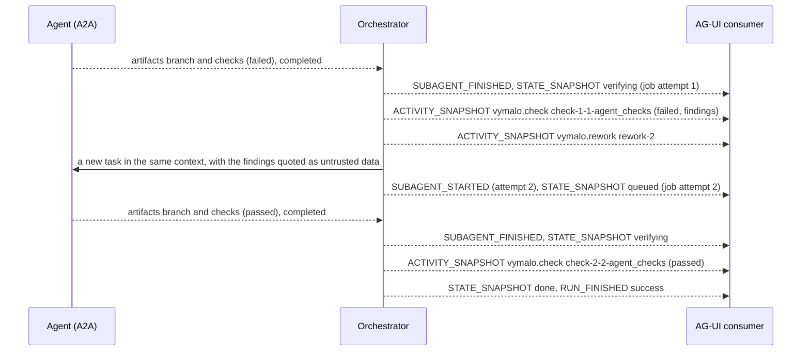
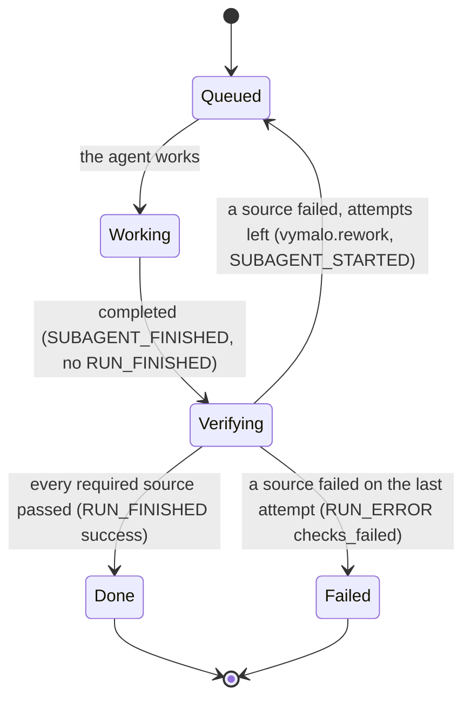
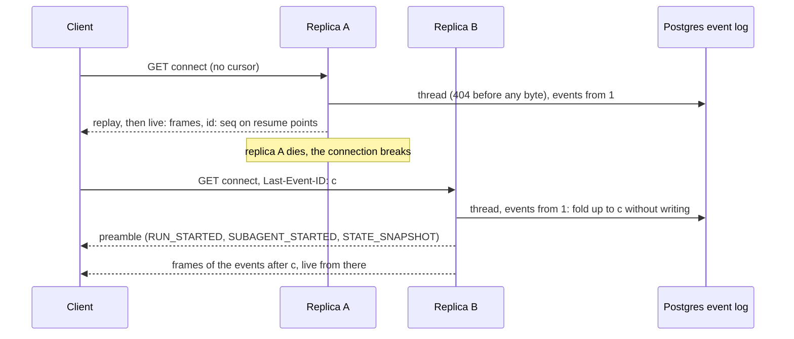
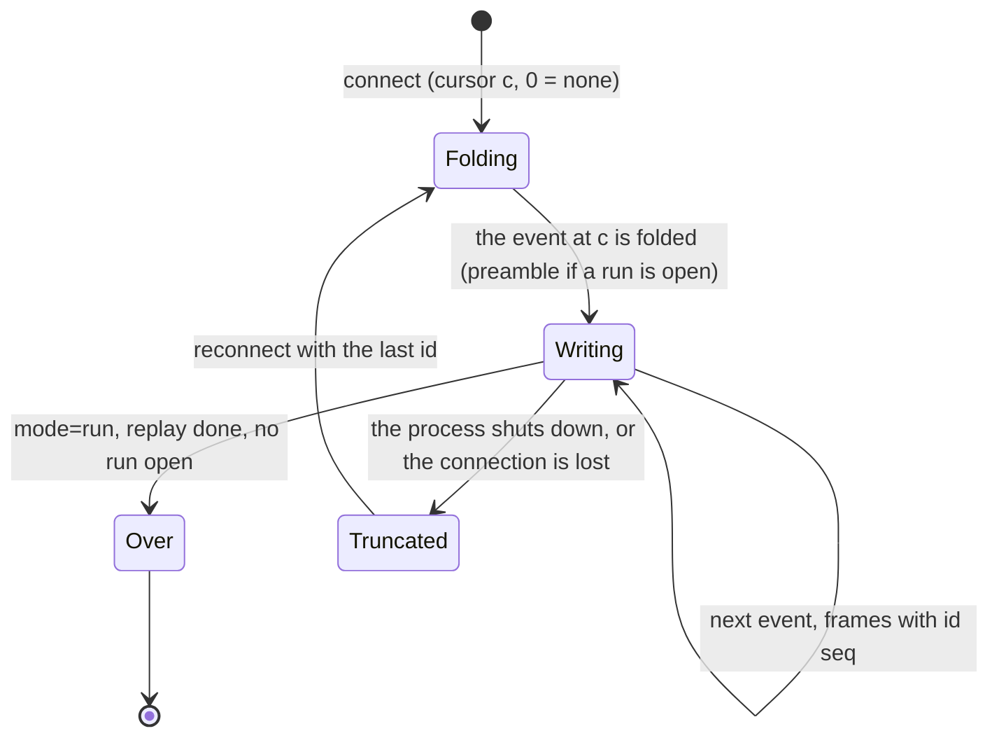
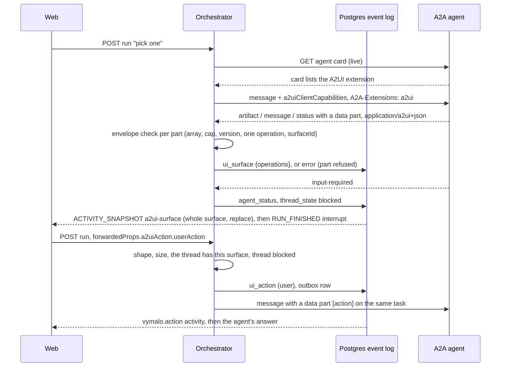
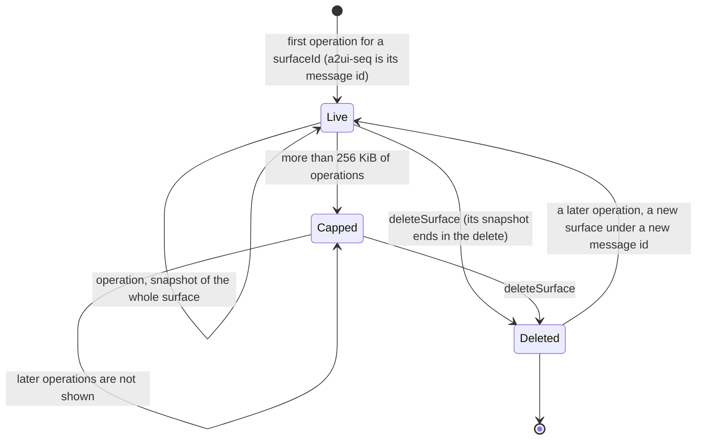

# AG-UI binding

How the orchestrator speaks [AG-UI 1.0](https://docs.ag-ui.com/spec/1.0/index.md) to people
([ADR 0012](../decisions/0012-ag-ui-user-facing-protocol.md)), and how generative UI travels
([ADR 0013](../decisions/0013-a2ui-generative-ui.md)). The event log is the only source of truth:
every frame below is a function of the log. The resource API (agents, threads, cancel, health)
stays in [`chat-api.yaml`](chat-api.yaml).

> Status: **built** (2026-09-29); the legacy chat API was removed on 2026-09-30. Built: the wire types
> (`orch-agui-proto`), both directions of the mapping below as pure code (`orch-agui-projection`), tested against the vendored schema
> and the reference client, and the three routes of `orch-surface-agui`: the **run route**
> (`POST /agui/agents/{agentId}`, see [Run binding](#run-binding)), the **connect stream**
> (`GET /agui/threads/{threadId}/connect`, see [Connect binding](#connect-binding)) and the
> **capabilities document** (`GET /agui/agents/{agentId}/capabilities`, see
> [Capabilities document](#capabilities-document)), all tested end to end, the connect stream also
> with a replica killed under it. The three routes are operations of [`chat-api.yaml`](chat-api.yaml)
> ([The contract](#the-contract)); the four legacy operations it used to deprecate are gone. The **web runs on it** (2026-09-29): `@assistant-ui/react-ag-ui` over a `ThreadAgent`
> that follows the connect stream and sends runs to the run route, see
> [`web/README.md`](../../web/README.md#the-chat-layer). **A2UI is relayed by the orchestrator**
> (2026-09-29): surfaces from agents, actions from users, capability detection, see
> [A2UI](#a2ui-generative-ui). **The web renders it** (2026-09-29): a validator, a shadcn vocabulary and
> actions on a user gesture only, see [`web/README.md`](../../web/README.md#a2ui-surfaces). How it is served, as
> diagrams: [architecture](../architecture.md#ag-ui-how-it-is-served) and
> [orchestrator: live updates](../orchestrator.md#live-updates).
> **The verification gate is projected** (2026-09-30, [ADR 0018](../decisions/0018-verification-gate-and-rework-loop.md),
> MVP slice 3): a run stays open while the work is verified, `vymalo.check` and `vymalo.rework` activities,
> `job` in the `STATE_SNAPSHOT`, `RUN_ERROR` `checks_failed`, and the gate a run asks for in
> `forwardedProps["vymalo.gate"]`; see [Verification](#verification-the-gate). The web renders it in slice 4.
> Spec facts were *verified 2026-09-29* against the pages linked.

## Endpoints

| Operation | Route | Standard? | Status |
|---|---|---|---|
| Run (create a thread, send a message, answer an interrupt, send an A2UI action) | `POST /agui/agents/{agentId}` | Yes: HTTP + SSE binding | Built |
| Attach, replay, follow across runs, resume | `GET /agui/threads/{threadId}/connect` | No: our extension ([Connect binding](#connect-binding)) | Built |
| Capabilities | `GET /agui/agents/{agentId}/capabilities` | Shape standard (`AgentCapabilities`), retrieval ours | Built |
| Agent list, thread list and details, cancel, health | `/api/agents`, `/api/threads`, `/api/threads/{id}`, `/api/threads/{id}/cancel`, `/healthz`, `/readyz` | REST resource API |
| Legacy interaction (`createThread`, `postMessage`, `listEvents`, `streamEvents`) | `/api/threads…` | Removed on 2026-09-30 | Gone |

The default, and the only surface, is `ORCH_SURFACES=agui`: the AG-UI routes and the resource API. The four
legacy routes (`POST /api/threads`, `POST /api/threads/{id}/messages`, `GET /api/threads/{id}/events`
and `…/stream`) were deprecated on 2026-09-29 and removed on 2026-09-30: they answer 404 (`POST
/api/threads` answers 405, because its path also serves the thread list), and an `ORCH_SURFACES` that
still names `chat-api` stops the process at startup with an error that points here
([`bin/orchestrator`](../../orchestrator/bin/orchestrator/README.md#surfaces)). To start a thread and
send a message, `POST /agui/agents/{agentId}` with a thread id you mint; to read the log,
`GET /agui/threads/{threadId}/connect`.

All `/agui/*` routes sit behind the edge identity (`X-Auth-Request-Email`, fail closed). Every
pre-stream rejection is an RFC 9457 `application/problem+json` response; nothing is streamed
before the checks pass.

## The contract

[`chat-api.yaml`](chat-api.yaml) (OpenAPI 3.1.0) describes these routes as `runAgent`, `connectThread`
and `getAgentCapabilities`, beside the resource API.

- **Schemas by reference.** `AgUiRunAgentInput`, `AgUiEvent` and `AgUiAgentCapabilities` are
  `$ref`s to `$defs/RunAgentInput`, `$defs/Event` and `$defs/AgentCapabilities` of the vendored
  schema, `orchestrator/crates/agui-proto/schema/ag-ui-1.0.schema.json`, by relative file path. The
  schema is not copied. *Verified 2026-09-29* against the
  [OpenAPI 3.1.0 specification](https://spec.openapis.org/oas/v3.1.0.html) (section 4.4: the Schema
  Object is a superset of JSON Schema 2020-12; section 4.7: relative references resolve against the
  document's URI), and by generating the web types from it with openapi-typescript 7.13.0.
- **Streams.** OpenAPI 3.1 cannot say what one server-sent message holds: `itemSchema` arrived in
  [3.2](https://spec.openapis.org/oas/v3.2.0.html) (*verified 2026-09-29*). The `text/event-stream`
  media type is `type: string`, and the item is `x-itemSchema` (`AgUiSseFrame`: `data` is one
  `AgUiEvent` as JSON text, `id` the resume `seq`), which a move to 3.2 renames.
- **Problems.** Every status in the table of each route above is documented with the `Problem`
  response, and only those: `orch-surface-agui`'s `tests/contract.rs` drives each operation over
  HTTP and fails when the statuses documented and the statuses answered differ, and validates every
  body and every frame against the contract's schemas (through the reference to the vendored one).
  One status is documented and not driven: a store that fails to read a thread, the 503 of
  `connectThread` (the in-memory store fails commits and creates only).
- **Removed operations.** `createThread`, `postMessage`, `listEvents` and `streamEvents` were
  `deprecated: true`, and answered with `Deprecation: @1790640000` (RFC 9745, an sf-date; *verified
  2026-09-29* against [RFC 9745](https://www.rfc-editor.org/rfc/rfc9745) section 2.1), from
  2026-09-29 until they were removed on 2026-09-30 (no `Sunset` and no `Link` were ever sent). The
  contract has none of them now, nor the `Deprecation` header component or the `NewThread` and
  `NewMessage` schemas. Its `Event` schemas remain: no operation returns an `Event`, but they describe
  the log this document projects, and `orch-api`'s `tests/contract.rs` validates real events and the
  goldens against them.
- **The web.** `pnpm gen:api` types the operations, and `src/lib/api/contract.typecheck.ts` holds
  deliberate mismatches for them.

## Ids

Every id is derived from the log, so every replica and every replay agrees.

| Id | Rule |
|---|---|
| `threadId` | The thread UUID. Minted by the consumer on its first run (a UUID; 400 otherwise). The resource API lists threads by id, newest first, so a consumer should mint a time-ordered **UUIDv7**, as the web does: a random v4 would shuffle the list. |
| `runId` | `user_message.data.runId` when the run came from AG-UI; otherwise `run-<seq>` of the event that opened the run. |
| user `messageId` | `user_message.data.messageId` (the AG-UI message id), else `evt-<seq>`. |
| agent `messageId` | `agent_message.data.messageId` (the A2A message id). |
| activity `messageId` | `evt-<seq>`; for A2UI, `a2ui-<seq>` of the event that created the surface (the same id for every snapshot of that surface); for the gate, `check-<attempt>-<verification>-<source>` (one card per source in one verification of one attempt, replaced by its later snapshots; `verification` counts the agent's `completed` events under the gate, from 1) and `rework-<attempt>` (the attempt that starts). |
| `subagentRunId` | `sub-<seq>` of the first agent event of the invocation; reused when a suspended invocation continues on the same A2A task. A rework opens the next attempt's invocation itself, as `sub-<seq of the rework>`. |
| interrupt `id` | `int-<seq>` of the `agent_status` that asked for input. |
| SSE `id:` | `<seq>` on the last frame produced for that log event, only when no text message is open. |

## Outbound: log event → AG-UI

"Open a run" means `RUN_STARTED{threadId, runId, protocolVersion:"1.0"}` then
`STATE_SNAPSHOT{snapshot:{thread}}`. Audiences: the **requester** (the POST that sent the input)
skips the text triad of a user message whose id came in its own `RunAgentInput`, because
re-streaming a message the consumer holds would append to it; a **viewer** (a connect stream)
gets everything.

| Log event (`kind`, data) | Context | AG-UI frames |
|---|---|---|
| `user_message{text}` | No run open | Open a run. Viewer: `TEXT_MESSAGE_START{messageId, role:"user", metadata:{"vymalo.actor"}}` → `TEXT_MESSAGE_CONTENT{delta:text}` → `TEXT_MESSAGE_END` |
| `user_message` | Run open (a follow-up mid-run) | The user triad inside the current run |
| `agent_message{messageId, text, final:true}` | — | `SUBAGENT_STARTED{subagentRunId, name:agentId}` if no invocation is open; then `TEXT_MESSAGE_START{messageId, role:"assistant", name:agentId, subagentRunId}` → `CONTENT` → `END` |
| `agent_message{final:false}` (cumulative partial) | — | First partial: `START` + `CONTENT(text)`. A later partial or final that extends the text: `CONTENT(suffix)`, plus `END` on final. A partial that does not extend it: a new message, id `<id>~<seq>` (question 14, closed). |
| `agent_status{working, detail?}` | — | `ACTIVITY_SNAPSHOT{messageId:"evt-n", activityType:"vymalo.status", content:{status, detail?}, subagentRunId}`, then a `STATE_SNAPSHOT` if the thread moved to `working` (a run that this event opens already says `working`) |
| `agent_status{input_required \| auth_required, detail}` | Followed by `thread_state{blocked}` | The status activity, then `SUBAGENT_FINISHED{outcome:{type:"suspended", interruptIds:["int-n"]}}` |
| `thread_state{blocked}` | After input or auth required | `STATE_SNAPSHOT` → `RUN_FINISHED{outcome:{type:"interrupt", interrupts:[{id:"int-n", reason:"input_required" \| "auth_required", message:detail, subagentRunId, responseSchema}]}}` |
| `agent_status{completed}` + `thread_state{done}` | — | Status activity → `SUBAGENT_FINISHED{}` → `STATE_SNAPSHOT` → `RUN_FINISHED{outcome:{type:"success"}}` |
| `agent_status{failed, detail}` + `thread_state{failed}` | — | Status activity → `SUBAGENT_ERROR{message:detail, code:"agent_failed"}` → `STATE_SNAPSHOT` → `RUN_ERROR{message, code:"agent_failed"}` |
| `agent_status{canceled}` + `thread_state{cancelled}` | — | Status activity → `SUBAGENT_FINISHED{result:{status:"canceled"}}` (1.0 has no cancelled subagent outcome; open question 16) → `STATE_SNAPSHOT` → `RUN_FINISHED{outcome:{type:"cancelled"}}` |
| `thread_state{cancelled}` alone | Cancelled before the agent started | `RUN_FINISHED{outcome:{type:"cancelled"}}` |
| `error{retryable:true}` + `thread_state{blocked}` | Retryable delivery failure | `ACTIVITY_SNAPSHOT{activityType:"vymalo.error"}` → `SUBAGENT_ERROR{code:"delivery_failed"}` if open → `STATE_SNAPSHOT` → `RUN_ERROR{code:"delivery_failed"}`. The thread stays open; the next input is a new run, not a resume. |
| `error{retryable:false}` + `thread_state{failed}` | Permanent delivery failure | Error activity → `SUBAGENT_ERROR` if open → `RUN_ERROR{code:"delivery_failed"}` |
| `error{…}` | Mid-run, no state change | Error activity only; the run continues. An A2UI part the orchestrator refused ([envelope rules](#the-envelope-check)) is such an error, `retryable:false`, attributed to the agent |
| `artifact{name, mimeType?, uri?, text?}` | — | `ACTIVITY_SNAPSHOT{messageId:"evt-n", activityType:"vymalo.artifact", content:{name, mimeType?, uri?, text?}, subagentRunId}` |
| `ui_surface{operations}` (ADR 0013) | — | Per surface the payload touches, in order of first appearance: `ACTIVITY_SNAPSHOT{messageId:"a2ui-<seq of the event that created the surface>", activityType:"a2ui-surface", replace:true, content:{a2ui_operations:[every operation of that surface so far, as sent]}, subagentRunId}`: the **whole surface** each time, so the last snapshot renders it on the live stream, on replay and in history. A `deleteSurface` ends its surface (its snapshot ends in the delete); a later operation for that id is a new surface under a new message id. See [A2UI](#a2ui-generative-ui) |
| `ui_action{surfaceId, name, sourceComponentId, context, version, runId?}` (ADR 0013) | — | Open a run if none is open (its id is the `runId` of the event, else `run-<seq>`, and its `STATE_SNAPSHOT` says `queued`); `ACTIVITY_SNAPSHOT{messageId:"evt-n", activityType:"vymalo.action", content:{surfaceId, name, sourceComponentId, context}, metadata:{"vymalo.actor"}}`. It says nothing in the transcript: no text triad |
| `agent_status{completed}` | The job is under a gate ([Verification](#verification-the-gate)) | Status activity → `SUBAGENT_FINISHED{}` → `STATE_SNAPSHOT{thread.state:"verifying", job}`. **Not** `RUN_FINISHED`: the run stays open and no `thread_state` follows |
| `check_result{source, attempt, status, commit?, summary?, findings?, stale?}` (ADR 0018) | — | `ACTIVITY_SNAPSHOT{messageId:"check-<attempt>-<verification>-<source>", activityType:"vymalo.check", replace:true, content:{the event's data}}`, no `subagentRunId` (the orchestrator's, not the agent's). A `stale` answer (for a verification that is no longer the current one) is its own card, `evt-<seq>`, and changes nothing else |
| `rework{attempt, maxAttempts, findings}` (ADR 0018) | After a failed `check_result` | `ACTIVITY_SNAPSHOT{messageId:"rework-<attempt>", activityType:"vymalo.rework", replace:true, content:{the event's data}}` → `SUBAGENT_STARTED{subagentRunId:"sub-<seq>", name:agentId}` for the next attempt → `STATE_SNAPSHOT{thread.state:"queued", job.attempt}`. The agent's own events then continue that invocation |
| `error{retryable:false}` + `thread_state{failed}` | Right after a failed `check_result`: the last attempt failed | Error activity → `STATE_SNAPSHOT{failed}` → `RUN_ERROR{code:"checks_failed", message}` with `metadata["vymalo.problem"].title` "Checks failed". The agent's invocation had ended at its `completed`, so there is no `SUBAGENT_ERROR` |
| `thread_state{done}` | After the `check_result` events that passed | `STATE_SNAPSHOT{done, job}` → `RUN_FINISHED{outcome:{type:"success"}}` |
| Any other event | No run open, not user input (a webhook, a timer, a late delivery failure) | A producer-initiated run: `RUN_STARTED{runId:"run-<seq>"}` with no input echo, the event's frames, then closed by the same rules (open question 17) |

- **When a run closes.** The core appends `thread_state` when the thread *enters* `blocked`,
  `done`, `failed` or `cancelled`, right after its cause, so a run closes at that `thread_state`
  event: the cause (`agent_status`, `error`) only prepares it. A delivery `error` and a refused
  cancel look alike in the log; the projection lets the `thread_state` that follows an `error`
  (or not) decide, and a refused cancel leaves the run open. An event that arrives when **no run
  is open** (the thread is blocked or finished) opens a producer-initiated run and closes it in
  the same step, by the state the thread stands in: blocked on a question, `RUN_FINISHED`
  interrupt (the pending interrupt is raised again under its own id); blocked or finished by an
  error, `RUN_ERROR`; `done`, success; `cancelled`, cancelled. A wait repeated while blocked
  (`input_required` with a new detail) is such a run, and mints a new interrupt. The invariant
  between transactions: a run is open exactly when the thread is `queued`, `working` or `verifying`.
- **Invocations.** A run closes its open invocation first: `SUBAGENT_FINISHED{}` on success,
  `{result:{status:"canceled"}}` on cancel, `suspended` on an interrupt, `SUBAGENT_ERROR` on an
  error. A suspended invocation reappears under its own `subagentRunId` when the thread
  continues; after an error the next one is new.
- **Partial agent messages** (question 14, closed 2026-09-29). A text that does not extend what was said
  closes the open message and starts a new one, `messageId` `<id>~<seq>`. The same final message
  twice is said once.
- **Why activities, not `CUSTOM`.** Activity messages are part of the message sequence and of
  `MESSAGES_SNAPSHOT`, so they survive history restore; the spec forbids standard semantics in
  `CUSTOM`. `STEP_*` events are not used.
- **Thread state** travels as `STATE_SNAPSHOT` under `thread`. It is producer-owned; an echoed
  `RunAgentInput.state` is ignored.
- **Errors in stream.** `RUN_ERROR.code` is one of `agent_failed`, `agent_rejected`,
  `delivery_failed`, `checks_failed`, `unavailable`, `internal`; `metadata["vymalo.problem"]` carries
  `{type, title, detail?}`.

## Inbound: AG-UI → core input

| `RunAgentInput` / request | Core effect |
|---|---|
| Unknown `agentId` in the URL | 404 before the stream |
| Unknown `threadId` (a UUID), one new user message | Create the thread, owned by the edge identity, targeting the URL's `agentId` and the release in `forwardedProps["https://agents.vymalo.com/a2a/extensions/release-channels/v1"].release` (validated against the live card, fail closed, ADR 0008); then `Input::UserMessage{text}` with `messageId` and `runId` recorded |
| `threadId` owned by someone else, or colliding with another owner's thread | 404 before the stream |
| Known `threadId`, URL `agentId` is not the thread's target | 409 before the stream |
| Known `threadId`, exactly one user message id not in the log, text content | `Input::UserMessage` |
| Several new messages, or a new non-user message | 422 before the stream (the orchestrator owns the history) |
| Messages whose ids are already in the log | Ignored: reconciliation by id, so a client that re-sends the whole transcript works (the web sends only the one new message, or only the `resume`) |
| `resume:[{interruptId:"int-n", status:"resolved", payload:{text}}]` on a blocked thread | `Input::UserMessage{text}` (the A2A task continues) |
| `resume` `cancelled` plus a new user message | `Input::UserMessage` with the new text |
| `resume` `cancelled`, nothing new | `Input::Cancel` |
| A new user message on a blocked thread without `resume` | Accepted as the answer (question 13, closed 2026-09-29) |
| `forwardedProps["vymalo.gate"]` (ADR 0018) on a run | The gate the thread's job runs under, on top of the deployment's and the agent's (`AGENTS_FILE`): `{require?: ["agent-checks"], maxAttempts?}` (a source is `agent-checks` or `agent_checks`). It may **add** sources and change the attempts within `1..=ORCH_MAX_ATTEMPTS_CAP`; a `require` that leaves out a source the layers above require, an attempt outside that range, a source or setting this build cannot honour (`ci`, `verifier`: see [Verification](#verification-the-gate)), `verifier` or `ci` per thread, an unknown member or a malformed value is **400** with the reason in the problem's `detail`, before the stream, and nothing is created. The gate is copied into the thread's job and fixed there. On a run that continues a thread (a follow-up, an answer, the loser of a race to create it) the member is checked the same way and then compared with the thread's gate: one that would change it is **409**, one that says what the thread has (in either spelling of the sources), or none, is served |
| `forwardedProps.a2uiAction.userAction` (ADR 0013) | `Input::UiAction{surfaceId, name, sourceComponentId, context, version, runId}`; on a blocked thread it answers the interrupt, as a message does. `name`, `surfaceId` and `sourceComponentId` are required strings and `context` an object (default `{}`); `timestamp`, `userMessage` and `type` are dropped. The surface must be one the thread has now, and its version is the surface's. See [Actions](#actions) |
| `a2uiAction` together with a new message, a `resume` or a cancel | 422 before the stream (one thing at a time) |
| `a2uiAction` that is not an action, or names a surface the thread does not have (never had, or deleted), or is sent for a new thread | 422 before the stream; nothing is written or sent |
| `a2uiAction` with a `name`, `surfaceId` or `sourceComponentId` over 256 bytes, or a `context` over 16 KiB | 413 before the stream |
| `resume` on a thread that is not blocked, or naming an unknown id | Entries ignored with a warning |
| Nothing new, no resume, `runId` already recorded | Attach: stream that run from its start (an idempotent retry) |
| Nothing new, no resume, unknown `runId` | 422 (nothing to run) |
| A new message or answer under a `runId` the thread already used | 422: a run id is never reused |
| A run already open on the thread | 409 before the stream |
| Thread terminal (`done`, `failed`, `cancelled`) | 409, "start a new thread" |
| `protocolVersion` of another major | 400 before the stream; a newer 1.x is served with a warning |
| `tools`, `context` | Ignored with a warning (open question 18) |
| `state` | Ignored (producer-owned) |
| `parentRunId` | Recorded in metadata, no effect |
| Non-text content parts | Skipped with a warning; the run does not fail |
| Idempotency | The event the input writes carries the key `agui:<threadId>:msg:<messageId>` (`agui:<threadId>:run:<runId>` for an answer with no message id of its own); a retried POST, even a concurrent one, attaches instead of duplicating. There is no inbox table yet: the key is the log's per-thread `idempotency_key` |
| Cancel | `POST /api/threads/{id}/cancel`; the outcome arrives as `RUN_FINISHED{outcome:{type:"cancelled"}}` |

## Verification (the gate)

*Built 2026-09-30 (MVP slice 3, [ADR 0018](../decisions/0018-verification-gate-and-rework-loop.md)).* A thread whose gate
requires a source is not `done` when the agent says `completed`: the orchestrator checks the work, sends the agent back
with the findings while attempts are left, and only then finishes. A viewer sees one run across all the attempts.





- **The run stays open** while the thread is `queued`, `working` or `verifying`, so a client that reads until the
  terminal event sees the whole job. A consumer that treats `SUBAGENT_FINISHED` as the end of the work is wrong under a
  gate; the reference client does not (it ends on `RUN_FINISHED`).
- **`STATE_SNAPSHOT`** carries `job` (see [Metadata and state](#metadata-and-state)) whenever the gate requires
  something; a thread without a gate has no `job` and its stream is exactly what it was before the gate existed.
  `verifying` is projected from the agent's `completed` on such a thread: the log has no `thread_state` for it.
- **`vymalo.check`** is one card per source in one verification of one attempt. Its id is derived from the log
  (`check-<attempt>-<verification>-<source>`), and every snapshot of it says `replace: true`, so a `pending` card is
  replaced by its answer; a second verification of the same attempt (the user wrote, or a held answer was given) is a
  card of its own, at its own place in the transcript. `findings` and `summary` are
  text from a tool or a reviewer: a renderer shows them as text, never as markup or instructions.
- **`vymalo.rework`** is the orchestrator telling the agent to try again; the orchestrator's `SUBAGENT_STARTED` for the
  next attempt follows at once, because the delegation is already on its way. That delegation is a **new A2A task in the
  same context** (the first one is completed and cannot be continued); the prompt is written by the core
  (`orch-core`, `verify.rs`), so it is the same on every replica.
- **A hold** (CI or the verifier did not answer in time, or the verifier could not be reached: `error{retryable:true}` then
  `thread_state{blocked}` in a thread that was being verified) projects as any blocked thread does: the
  `vymalo.error` activity, then `RUN_FINISHED` with an `interrupt` outcome (id `int-<seq of the thread_state>`, reason
  `input_required`, the error's text as its message) that the user answers with a message or a `resume`. It is not
  `delivery_failed`.
- **`job.sha`** is the commit the agent pushed (its last `branch` artifact of the attempt), the same as `Thread.job.sha`.
  A check's own `commit` (in `vymalo.check`) is the commit the check ran on, and is not used for it.
- **Running out of attempts** is `RUN_ERROR` with `code: "checks_failed"`; the message names the source and the last
  findings. It is not `agent_failed`: the agent did its work, and the work did not pass.

### What a build honours, and what a request may ask

The gate is configured in three layers, from the widest to the narrowest ([ADR 0018](../decisions/0018-verification-gate-and-rework-loop.md#configuration)): the deployment (`ORCH_GATE`,
`ORCH_MAX_ATTEMPTS`, `ORCH_MAX_ATTEMPTS_CAP`, `ORCH_VERIFIER`), an agent's entry in `AGENTS_FILE`
(`gate: {require, maxAttempts, verifier, ci}`) and the run that creates the thread
(`forwardedProps["vymalo.gate"]: {require?, maxAttempts?}`). A layer may **add sources, never remove one** (its `require` is the whole list and must contain the one above's;
`ci.required` names add up), and may set the attempts **anywhere within `1..=ORCH_MAX_ATTEMPTS_CAP`**, lower or
higher than the layer above's (`ORCH_MAX_ATTEMPTS_CAP` is at most 100). The one removal allowed is the verifier's own
entry leaving the `verifier` source out for itself. A run may not choose the verifier or the CI settings. Sources are
spelled `agent-checks` in configuration and `agent_checks` in the API; a request accepts both, so the `gate` of
`Thread.job` can be sent back as it is. The gate is fixed when the thread is created: a run that continues a thread and
asks for a gate different from the thread's is a **409** (an identical one, or none, is served), and one the rules
refuse is a 400 whatever the thread.

| Source | In `require` as | This build |
|---|---|---|
| The agent's own checks (its `checks` artifact) | `agent-checks` | **Honoured** |
| CI on the pushed commit | `ci` | Refused: it needs the inbox and timers (MVP slice 5) and the CI webhook (slice 6). Startup exits 78; a request is a 400 whose `detail` says so |
| A verifier agent | `verifier` | Refused: it needs the verifier dispatch (MVP slice 10). The `verifier` and `ci` settings are refused with their sources |

The refusal is deliberate and fail-closed. Until those slices exist the application drops the commands a `ci` or
`verifier` source needs, so a gate that required either would wait for a verdict that can never come; refusing it is
the only way not to end a job "done" without the check the operator asked for. `pending_reason` in `orch-app`'s `gate_config.rs` says which sources those are and why. A slice that makes one real
changes its arm, and also owns what that source needs beyond it: its own settings, its checks in
`GateRules::check_verifier`, and its cards in the projection.

Example run input, three attempts lowered to two:

```json
{"threadId": "…", "runId": "…", "messages": [{"id": "…", "role": "user", "content": "fix the login"}],
 "forwardedProps": {"vymalo.gate": {"require": ["agent-checks"], "maxAttempts": 2}}}
```

The goldens [`examples/agui/verify-green.agui.json`](examples/agui/verify-green.agui.json) (red once, sent back, green:
attempt 2 of 3) and [`verify-red.agui.json`](examples/agui/verify-red.agui.json) (three attempts, then `checks_failed`)
are this section as streams, with the `run-` and `connect-` variants of the other goldens; the reference client reads
all of them in CI.

## Run binding

`POST /agui/agents/{agentId}` with `Content-Type: application/json`, `Accept: text/event-stream`
and a `RunAgentInput`. The response is `200 text/event-stream`, one JSON event per `data:` line,
from `RUN_STARTED` of the requested run to its terminal event, then EOF, as the
[HTTP + SSE binding](https://docs.ag-ui.com/spec/1.0/basic/transports/http-sse.md) says. It is the
requester-audience projection starting at the run's first log event. Frames also carry `id: <seq>`,
which standard consumers ignore. Closing the response never cancels the run.

**Where the response starts.** At the first log event the request's input caused (a `resume`
that cancels writes none: the response then starts at the next event, the cancellation); if a run
is open by then (an event opened one between the read and the write), the run's opening frames
come first (`RUN_STARTED`, the open `SUBAGENT_STARTED`, a `STATE_SNAPSHOT`), so the response always
starts with `RUN_STARTED`. **An attach** (nothing new, the `runId` is recorded) starts at that
run's `RUN_STARTED`, wherever it is in the log, and follows it to its terminal event, live if it
is still open; a run that is finished is replayed and the response ends. The response ends after
the first terminal event (`RUN_FINISHED` or `RUN_ERROR`), or early, without one, when the process
is shutting down: a truncated run, which the client attaches to again with the same `runId`.

**The request** is `Content-Type: application/json` (a body that needs no CORS preflight is
refused), read up to 8 MiB; `Accept` must admit `text/event-stream` or say nothing. `runId` and the
message ids are recorded in the log and must be at most 256 bytes. Members the schema does not
declare are dropped with a warning; a member of the wrong type is a 400.

**Refusals before the stream.** Each is an RFC 9457 `application/problem+json` response; nothing
was streamed and nothing was written.

| Status | When |
|---|---|
| 400 | The body is not JSON or not a `RunAgentInput`; `threadId` is not a UUID; `protocolVersion` names another major; an id is longer than 256 bytes; an unknown release, or an agent without releases asked for one (ADR 0008); a `vymalo.gate` that is malformed, removes a required source, asks for attempts outside `1..=cap`, or needs what this build does not honour yet (ADR 0018) |
| 401 | No edge identity |
| 404 | The `agentId` is not configured; the thread belongs to someone else (indistinguishable from one that does not exist, including a `threadId` the caller minted that collides with another owner's) |
| 406 | `Accept` does not admit `text/event-stream` (the protobuf framing is not offered) |
| 409 | The thread targets another agent; a run is open on it; it is finished (`done`, `failed`, `cancelled`); the run continues a thread and asks for a `vymalo.gate` different from the thread's (a thread's gate is fixed when it is created; this includes the loser of a race to create it) |
| 413 | The body is larger than 8 MiB; an A2UI action is larger than the limits allow (`name`, `surfaceId`, `sourceComponentId` at most 256 bytes, `context` at most 16 KiB) |
| 415 | `Content-Type` is not `application/json` |
| 422 | Nothing to run; more than one new message; a new message that is not from the user; a message without text; a `resume` payload with no `text`; a `resume` answer together with a new message; a reused `runId`; an A2UI action that is malformed, names a surface the thread does not have, or comes with a message, an answer or a cancel |
| 502 / 503 | The agent's card cannot be read to validate a release; the store is unavailable or the thread is contended (`Retry-After`) |

## Connect binding

Our extension, a custom transport in the sense of the
[transports page](https://docs.ag-ui.com/spec/1.0/basic/transports/index.md): it keeps the event
model, the patterns and the processing rules, and frames JSON exactly as the SSE binding does. The
sequence and state diagrams are in [ADR 0012](../decisions/0012-ag-ui-user-facing-protocol.md#the-connect-stream-our-extension).

**Request.** `GET /agui/threads/{threadId}/connect`, `Accept: text/event-stream` (or none, `*/*`,
`text/*`).

| Input | Meaning |
|---|---|
| `Last-Event-ID` header | Resume after this seq: the `id:` of the last frame the client holds. Absent or empty: replay the whole thread. |
| `?mode=run` | Close after the active run's terminal event, or right after the replay when no run is open. Default: stay open. Any other value of `mode` is a 400. |

**Errors before the stream.** Each is an RFC 9457 problem and nothing was streamed.

| Status | When |
|---|---|
| 400 | `Last-Event-ID` is not a non-negative integer; `mode` is not `run` |
| 401 | No edge identity |
| 404 | The thread does not exist for the caller: it is missing, its id is not a UUID, or it belongs to someone else. One answer for all three; nothing in it names the thread or its owner. |
| 406 | `Accept` excludes `text/event-stream` |
| 503 | The store is unavailable (`Retry-After`) |

A cursor beyond the thread's last seq (stale or forged) counts as the last seq: the client waits
for new events.

**Response.** `200 text/event-stream`:

1. **Replay.** The viewer-audience projection of every event after the cursor, as a sequence of
   runs. With a cursor inside an open run, it starts with a **preamble**: that run's
   `RUN_STARTED` (same `runId`), `SUBAGENT_STARTED` for the open invocation and a
   `STATE_SNAPSHOT`, and, for a cursor that is not a resume point, the text message that was open,
   opened again with what it had said. None of the preamble frames has an `id:`. When the thread is
   idle at the cursor there is no preamble, and the stream begins with the `RUN_STARTED` of the
   next run. Every stream thus begins with `RUN_STARTED`, as the spec requires.
2. **Tail.** New log events, projected the same way, across runs, until the client closes (or the
   active run closes, with `mode=run`). Between runs the stream is idle, not closed. It also
   carries runs nobody asked for (an event the orchestrator wrote itself).
3. **Keepalive.** A comment line (`: keepalive`) at least every 15 s.

`?mode=run` ends the stream at the first point at which the thread's log, as it stood when the
client connected, has been replayed and no run is open: right after the replay of an idle thread
(a thread with no events after the cursor gets an empty stream), and at the terminal event of the
open run otherwise.

**Resume points.** `id: <seq>` is written only on the last frame of a log event and only when no
text message is open, so resuming never splits a message. Reconnecting with that id yields exactly
the remaining frames (property tests in `orch-agui-projection`; the replica-kill test in `orch-e2e`).
A client that lost frames after its last `id:` gets them again in the replay: it dedupes by seq, or
discards what it read after its last `id:`.

**How a request is served.** Nothing about a connection lives in the process. The replica reads the
thread's events from the first (`App::event_stream`: a log read, then wakeups, with a poll under
them) and folds all of them into the projector; the events up to the cursor are folded and not
written, which is what makes the preamble the same on every replica. So a client whose replica
dies reconnects to any other with its last `id:`, and a hundred viewers of one thread are a hundred
independent folds of the same log. Cost: a connect reads the thread's log from the start, even for
a cursor at its end. When the process shuts down and the stream has caught up, it ends without a
terminal event: a truncated stream, which the client resumes with its cursor. **Closing a connect
stream never cancels a run.**





## Capabilities document

`GET /agui/agents/{agentId}/capabilities` → `200 application/json`, an `AgentCapabilities`
(validated against the vendored schema in tests), `Cache-Control: no-store`. The spec fixes the
shape and leaves retrieval open. Errors: 401 without an identity, 404 for an `agentId` that is not
configured.

- `identity`: `name` is the configured display name; `description` and `version` come from the live
  A2A card, and are absent when the card has none or cannot be read;
- `transport{streaming:true, resumable:true}`: `resumable` speaks of the connect stream above, a
  transport of our own (the spec: "a consumer MUST NOT expect either of the standard bindings to
  honour" it);
- `humanInTheLoop{supported:true, interrupts:true}`;
- `multiAgent{supported:true, delegation:true, subagents:[{name:<agentId>, description}]}`: the agent
  runs as a subagent of the run, and `name` is the `name` of its `SUBAGENT_STARTED` (`subagents` is
  a list in the 1.0 schema, not a flag);
- `custom["https://agents.vymalo.com/a2a/extensions/release-channels/v1"] = {defaultChannel,
  channels, revisions}` only when the card advertises the extension (ADR 0008);
- `custom["https://a2ui.org/a2a-extension/a2ui/v0.9.1"] = {supportedCatalogIds}`, and the same under
  `…/a2ui/v1.0`, only for each A2UI extension the live card lists (ADR 0013; both URIs are detected,
  open question 22). `supportedCatalogIds` are the catalogs the web renders, not the agent's.

The card is read on every request and never cached (ADR 0008). A card that cannot be read in time
(3 s) gives the smaller document (fail closed): identity with the name only, and no `custom`. The
document is [the golden](examples/README.md#connect-streams) `capabilities-<agent>.json`.

## A2UI (generative UI)

An agent's result is sometimes an interface: a form that answers its question, a card, a button that
opens the pull request. [ADR 0013](../decisions/0013-a2ui-generative-ui.md) chose
[A2UI](https://a2ui.org/) for it, end to end over standards: **agent → A2A (A2UI extension) →
orchestrator → AG-UI `a2ui-surface` activity → web**, and the user's action the other way. This section
is what the orchestrator does with it. The renderer, and the rules that only a renderer can enforce
(vocabulary, expansion, links), are the web's ([ADR 0013](../decisions/0013-a2ui-generative-ui.md#the-web-renderer)).

### Facts this rests on

*Verified 2026-09-29* unless it says otherwise. Sources: the A2A extension pages
[v0.9.1](https://a2ui.org/specification/v0.9.1-a2ui-extension-specification/) and
[v1.0](https://a2ui.org/specification/v1.0-a2ui-extension-specification/), the protocol pages
[v0.9.1](https://a2ui.org/specification/v0.9.1-a2ui/) and
[v1.0](https://a2ui.org/specification/v1.0-a2ui/), the
[assistant-ui A2UI page](https://www.assistant-ui.com/docs/tools/a2ui.md) and the npm package
`@ag-ui/a2ui-middleware` 0.0.10 (its `dist/index.d.ts` and `dist/index.js`, read from the registry tarball).

| Claim | v0.9.1 (current) | v1.0 (candidate) |
|---|---|---|
| Media type of a part that carries A2UI | `application/a2ui+json`, in `DataPart.metadata["mimeType"]` | the same |
| The part's `data` | "MUST be an array of messages", processed in order, a failing message not stopping the rest | the same |
| A2A extension URI | `https://a2ui.org/a2a-extension/a2ui/v0.9.1` | `https://a2ui.org/a2a-extension/a2ui/v1.0` |
| Advertising it in the card, activating it | both optional ("encouraged" for the card); activation is by the `X-A2A-Extensions` header | the same |
| What the client sends with a message | `message.metadata["a2uiClientCapabilities"] = {"v0.9.1": {"supportedCatalogIds": [...]}}` | `message.metadata["a2uiRendererCapabilities"] = {"v1.0": {"supportedCatalogIds": [...]}}` (renamed) |
| Card extension `params` | `supportedCatalogIds?`, `acceptsInlineCatalogs?` | the same |
| `version` member of every message | `"v0.9.1"` | `"v1.0"` |
| Operations, one per message | `createSurface`, `updateComponents`, `updateDataModel`, `deleteSurface` | those, and `callRendererFunction`, `agentFunctionResponse` |
| Component shape | `{"id", "component": "Text", …}` in the protocol page (the extension page's example still uses the nested `{"Text": {…}}` form) | `{"id", "component", …}` |
| An action, back to the agent | `{"version", "action": {"name", "surfaceId", "sourceComponentId", "timestamp", "context"}}`, all five required, in a data part of the same media type | the same |
| Basic catalog id | `https://a2ui.org/specification/v0_9_1/catalogs/basic/catalog.json` (protocol page); the extension page writes `…/v0_9/…` | `https://a2ui.org/specification/v1_0/catalogs/basic/catalog.json` |
| Orchestrators and attribution | "the orchestrator is responsible for setting or validating" the `iconUrl` and `agentDisplayName` of a `createSurface` theme, so a sub-agent cannot pose as another (v0.9.1 protocol page) | not re-checked |

The AG-UI side (*verified 2026-09-29*): the ecosystem carries A2UI as `ACTIVITY_SNAPSHOT` with
`activityType: "a2ui-surface"`, `content.a2ui_operations` and `replace: true` (`@ag-ui/a2ui-middleware`);
a surface is keyed by the `surfaceId` inside the operations, not by `messageId`; an action returns as
`forwardedProps.a2uiAction.userAction`, whose members are all optional in the middleware's type
(`name`, `surfaceId`, `sourceComponentId`, `context`, `timestamp`); the middleware itself emits `version: "v0.9"`.

*Unverified:* whether an A2A 1.0 agent puts the media type in `Part.mediaType` or in
`metadata.mimeType`. The A2UI pages predate A2A 1.0 and show `metadata`; so both are read and both
are written. Whether every agent that activates by header also needs `message.extensions` is unknown; both
are sent. The v1.0 pages are a candidate and will move.

### Capability detection

ADR 0008: read live, never cached, fail closed. The A2A adapter reads the live card for every call
that sends a message and for every capabilities request.

- The card **lists** A2UI when `capabilities.extensions` has an entry whose `uri` is exactly one of
  the two URIs above. Any other URI, a different scheme, a trailing slash or another case is not A2UI.
  Both may be listed; then `v0.9.1` is spoken (open question 22).
- **Listed:** the message carries `a2uiClientCapabilities` (or `a2uiRendererCapabilities` for v1.0) with
  the basic catalog the web renders, the URI is added to `A2A-Extensions` and to `message.extensions`
  (with the release-channels URI when a release is selected), and the capabilities document declares
  `custom[<uri>] = {supportedCatalogIds}`.
- **Not listed** (or the card unreadable): nothing A2UI-specific is sent or declared. The next message
  after a card changes follows the new card.
- A surface is **relayed whether or not the card lists the extension**: activation is optional in
  A2UI and a part is recognised by its media type. An **action** goes to the agent that sent the surface
  whatever the card says now, in the version its surface spoke.



### The envelope check

Every A2UI part passes it before anything is stored or shown; there is no path around it
(`orch_core::check_operations`, run by the A2A adapter on each part and again by `transition` on every
`AgentUpdate::Ui`, so an adapter that forgot cannot put an unchecked payload in the log). A part that fails becomes an `error` event (`retryable:false`, the rule
that broke, attributed to the agent) and **nothing of it is passed on**; the rest of the message, and
the turn, go on.

| Rule | Limit |
|---|---|
| The part is a data part whose `data` is a JSON array | not text, raw or a URL, even with the media type |
| Not empty; at most | 256 messages |
| Serialised size at most | 64 KiB (the renderer's per-surface limit, so a payload it would refuse is never stored) |
| Every message is an object with a string `version` | `v0.9`, `v0.9.1` or `v1.0`; anything else is refused |
| Every message has exactly one operation | `createSurface`, `updateComponents`, `updateDataModel` or `deleteSurface`; the `v1.0` function messages are not relayed |
| The operation body is an object with a `surfaceId` | 1 to 256 bytes |

Components are **not** validated against a catalog here: that is the renderer's job and it refuses what
it does not know. The error text names the rule and repeats at most a 32-character excerpt of what the
agent sent. Replays are safe: a part's idempotency key is its place in the message, artifact or
status (`a2a:<task>:artifact:<id>:ui:<part>`, `a2a:msg:<id>:ui:<part>`,
`a2a:<task>:status-msg:<id>:ui:<part>`), so a poll after a crash and the stream it replaces collapse
into one event. A surface that accompanies `input-required` is recorded **before** the status, so it is
inside the run that the question ends.

### Surfaces in the projection

The projector keeps, per surface, the operations received so far. A snapshot carries all of them, so a
client that holds only the last snapshot of a surface renders it completely, and a viewer that connects
late or resumes with a cursor gets the same story. A surface's replayed operations are capped at
256 KiB; past that the viewer gets one `vymalo.error` line, the surface keeps its last good snapshot and
its later updates are not shown. The projector also knows which surfaces the thread has and the version
each speaks; the inbound side uses that.



### Actions

A click on an A2UI `Button` with an `event` action reaches `POST /agui/agents/{agentId}` as a run whose
`forwardedProps.a2uiAction.userAction` holds the action and whose `messages` hold nothing new. The
orchestrator:

1. reads the action (`name`, `surfaceId`, `sourceComponentId` strings, `context` an object): otherwise
   **422**;
2. checks the sizes (256 bytes for the three strings, 16 KiB for `context`): otherwise **413**;
3. checks that the thread **has the surface now**, with the version it speaks: otherwise **422**. An
   action for a surface that was never sent, that was deleted, or on a thread that does not exist yet,
   reaches nothing;
4. applies the usual rules of an input: not someone else's thread (404), the URL's agent is the
   thread's (409), no run is open (409), the thread is not finished (409), the `runId` is new (422),
   and no message, `resume` or cancel comes with it (422). Since a run is open exactly while the thread
   is `queued` or `working`, an action can only be sent while the thread **waits** (`blocked`);
5. writes `ui_action` (attributed to the user; the log's own time is the action's time) and one outbox
   row, under the idempotency key `agui:<threadId>:run:<runId>`;
6. delivers it as a message with one data part (`application/a2ui+json`, the media type on the part and
   in `metadata.mimeType`) holding `[{"version": <the surface's>, "action": {"name", "surfaceId",
   "sourceComponentId", "timestamp": <RFC 3339>, "context"}}]`. On a thread blocked by the agent it
   continues the **same A2A task**, as a message does. `userMessage` (text the agent wrote for the
   click) is dropped; `a2uiClientDataModel` is not sent (ADR 0013).

### Threat model

The surface is **untrusted input from an agent**, and the click is untrusted input from a browser.
The orchestrator's part:

| Threat | Defence |
|---|---|
| A malformed or huge payload fills the log, or crashes a viewer | Envelope check and the 64 KiB and 256-message caps before anything is stored; a replay cap per surface |
| Unvalidated agent JSON reaches a viewer | It cannot: the projection relays only what `ui_surface` holds, and an operation in the log that fails the check is skipped, not relayed |
| An agent poses as another agent, or as the system | The activity is attributed by the event's actor (`vymalo.actor`), set by the orchestrator from the configured agent, never from the payload. The `iconUrl` and `agentDisplayName` an agent may put in a `createSurface` theme are relayed as sent, like everything else in the payload (the A2UI spec makes an orchestrator responsible for them). The requirement is on the renderer: label a surface by `vymalo.actor`, never by the payload's own name or icon. A renderer that draws them would let one agent pose as another |
| A user, or a forged request, acts on a surface the thread never had | The action is accepted only for a surface the log shows the thread has (and not deleted), from the thread's owner |
| A forged action carries a huge or hostile `context` | 16 KiB and the string caps, refused before storage; the context is data for the agent, never executed here |
| The orchestrator is made to fetch a URL | It never does: URLs in a surface are the renderer's to show or refuse (http(s) only, ADR 0013). The only URLs the orchestrator reads are the configured agent cards |
| A card that stops advertising A2UI keeps receiving capabilities | Nothing is cached; the card is read for every message, and A2UI-specific parts go out only if it lists the extension |
| An agent floods the log with surfaces | Each part is at most 64 KiB and a surface is replayed at most 256 KiB, but the log itself is as unbounded as an agent's text messages are: a per-turn budget is not built (open) |
| A surface arrives late, after the run | It opens a run of its own and closes it, like any late event (open question 17); it is never dropped silently |

What only the renderer can do (vocabulary, template expansion, depth, actions that never auto-send) is in
ADR 0013 and is the web's, built (2026-09-29: [`web/README.md`](../../web/README.md#a2ui-surfaces));
nothing here relies on it for storage safety, and a viewer must not trust the log to be catalog-valid.

## `vymalo.*` schemas

Activity types, metadata keys and custom capability keys carry the `vymalo.` prefix or a URI we
own, as the spec asks of vendor keys. A client that knows none of them still sees conforming runs.

### Activity contents

```json
{
  "$schema": "https://json-schema.org/draft/2020-12/schema",
  "$defs": {
    "vymalo.status": {
      "type": "object",
      "required": ["status"],
      "additionalProperties": false,
      "properties": {
        "status": { "enum": ["submitted", "working", "input_required", "auth_required", "completed", "failed", "canceled"] },
        "detail": { "type": "string" }
      }
    },
    "vymalo.artifact": {
      "type": "object",
      "required": ["name"],
      "additionalProperties": false,
      "properties": {
        "name": { "type": "string" },
        "mimeType": { "type": "string" },
        "uri": { "type": "string", "description": "Rendered as a link only when absolute http(s)" },
        "text": { "type": "string" }
      }
    },
    "vymalo.error": {
      "type": "object",
      "required": ["message", "retryable"],
      "additionalProperties": false,
      "properties": {
        "message": { "type": "string" },
        "retryable": { "type": "boolean" }
      }
    },
    "vymalo.action": {
      "type": "object",
      "required": ["surfaceId", "name", "sourceComponentId", "context"],
      "additionalProperties": false,
      "properties": {
        "surfaceId": { "type": "string" },
        "name": { "type": "string" },
        "sourceComponentId": { "type": "string" },
        "context": { "type": "object" }
      }
    },
    "vymalo.check": {
      "type": "object",
      "description": "One source of the verification gate answered for one attempt (ADR 0018). Findings are untrusted text.",
      "required": ["source", "attempt", "status"],
      "additionalProperties": false,
      "properties": {
        "source": { "enum": ["ci", "agent_checks", "verifier"] },
        "attempt": { "type": "integer", "minimum": 1 },
        "status": { "enum": ["pending", "passed", "failed"] },
        "name": { "type": "string", "description": "The CI check this is, when the source is CI" },
        "commit": { "type": "string", "description": "The commit the answer is about" },
        "summary": { "type": "string" },
        "stale": { "const": true, "description": "The answer belongs to a verification that is no longer the current one; it decided nothing" },
        "findings": { "type": "array", "maxItems": 20, "items": { "type": "string" }, "description": "What is wrong; at most 20 items and 16 KiB in all" }
      }
    },
    "vymalo.rework": {
      "type": "object",
      "description": "The gate failed and the agent is sent back to work (ADR 0018).",
      "required": ["attempt", "maxAttempts", "findings"],
      "additionalProperties": false,
      "properties": {
        "attempt": { "type": "integer", "minimum": 2, "description": "The attempt that starts now" },
        "maxAttempts": { "type": "integer", "minimum": 1 },
        "findings": {
          "type": "array",
          "items": {
            "type": "object",
            "required": ["source", "findings"],
            "additionalProperties": false,
            "properties": {
              "source": { "enum": ["ci", "agent_checks", "verifier"] },
              "findings": { "type": "array", "items": { "type": "string" } }
            }
          }
        }
      }
    }
  }
}
```

`a2ui-surface` is the ecosystem's type, not ours: `content` is `{a2ui_operations: [A2UI message]}`
as sent by the agent, all the operations of one surface so far, and the snapshot says `replace: true`
(ADR 0013, [A2UI](#a2ui-generative-ui)).

### Metadata and state

| Where | Key | Shape |
|---|---|---|
| Any attributed event (`TEXT_MESSAGE_START`, `ACTIVITY_SNAPSHOT`, `SUBAGENT_STARTED`) | `metadata["vymalo.actor"]` | `{type: "user" \| "agent" \| "system", name, revision?}`; `revision` is the ADR 0008 echo |
| `RUN_ERROR` | `metadata["vymalo.problem"]` | `{type, title, detail?}` |
| `STATE_SNAPSHOT.snapshot` | `thread` | `{state: "queued" \| "working" \| "verifying" \| "blocked" \| "done" \| "failed" \| "cancelled", title, target: {agentId, release?}}` |
| `STATE_SNAPSHOT.snapshot` | `job` | Only when the thread's gate requires something: `{attempt, maxAttempts, gate: ["agent_checks", …], sha?}`. `attempt` is the one the agent is on, from 1; `gate` the sources that must pass; `sha` the commit the agent pushed in this attempt. The same object is `Thread.job` of the resource API |
| Interrupt `responseSchema` | — | `{type:"object", required:["text"], properties:{text:{type:"string"}}}` |

## Worked example

`ask.events.json` for a viewer. The golden
[`examples/agui/ask.agui.json`](examples/agui/ask.agui.json) is generated from it by
`orch-agui-projection`, and a test pins this listing to that projection (frame types, ids, resume
points and the members shown; the rest, such as the `vymalo.actor` metadata, is in the file):

```text
RUN_STARTED          {threadId, runId:"run-1", protocolVersion:"1.0"}
STATE_SNAPSHOT       {snapshot:{thread:{state:"queued", title, target:{agentId:"plain"}}}}
TEXT_MESSAGE_START   {messageId:"evt-1", role:"user", metadata:{"vymalo.actor":{type:"user", name:"alice@example.com"}}}
TEXT_MESSAGE_CONTENT {messageId:"evt-1", delta:"ask about branches"}
TEXT_MESSAGE_END     {messageId:"evt-1"}                                                      id: 1
SUBAGENT_STARTED     {subagentRunId:"sub-2", name:"plain"}
ACTIVITY_SNAPSHOT    {messageId:"evt-2", activityType:"vymalo.status", content:{status:"working"}, subagentRunId:"sub-2"}
STATE_SNAPSHOT       {snapshot:{thread:{state:"working", …}}}                                 id: 2
ACTIVITY_SNAPSHOT    {messageId:"evt-3", activityType:"vymalo.status", content:{status:"input_required", detail:"Which branch?"}, subagentRunId:"sub-2"}
SUBAGENT_FINISHED    {subagentRunId:"sub-2", outcome:{type:"suspended", interruptIds:["int-3"]}}  id: 3
STATE_SNAPSHOT       {snapshot:{thread:{state:"blocked", …}}}
RUN_FINISHED         {runId:"run-1", outcome:{type:"interrupt", interrupts:[{id:"int-3", reason:"input_required", message:"Which branch?", subagentRunId:"sub-2", responseSchema:{…}}]}}   id: 4
RUN_STARTED          {threadId, runId:"run-5", protocolVersion:"1.0"}
STATE_SNAPSHOT       {snapshot:{thread:{state:"queued", …}}}
TEXT_MESSAGE_START/CONTENT/END {messageId:"evt-5", role:"user", delta:"main"}              id: 5
SUBAGENT_STARTED     {subagentRunId:"sub-2", name:"plain"}          (the same A2A task continues)
ACTIVITY_SNAPSHOT    {messageId:"evt-6", activityType:"vymalo.status", content:{status:"working"}, subagentRunId:"sub-2"}
STATE_SNAPSHOT       {snapshot:{thread:{state:"working", …}}}                                 id: 6
ACTIVITY_SNAPSHOT    {messageId:"evt-7", activityType:"vymalo.artifact", content:{name:"result", text:"answered: main", uri:"https://github.com/acme/demo/pull/1"}, subagentRunId:"sub-2"}   id: 7
ACTIVITY_SNAPSHOT    {messageId:"evt-8", activityType:"vymalo.status", content:{status:"completed"}, subagentRunId:"sub-2"}
SUBAGENT_FINISHED    {subagentRunId:"sub-2"}                                                   id: 8
STATE_SNAPSHOT       {snapshot:{thread:{state:"done", …}}}
RUN_FINISHED         {runId:"run-5", outcome:{type:"success"}}                                 id: 9
```
