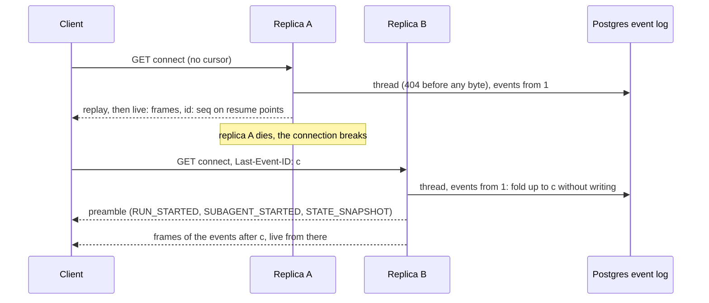
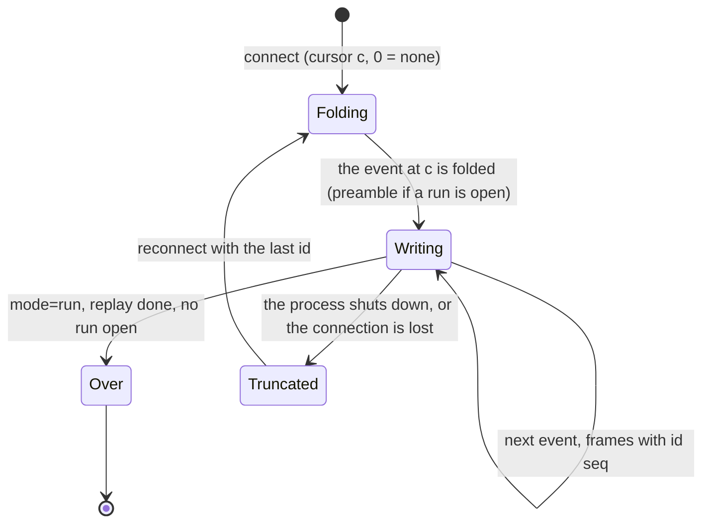

# AG-UI binding

How the orchestrator speaks [AG-UI 1.0](https://docs.ag-ui.com/spec/1.0/index.md) to people
([ADR 0012](../decisions/0012-ag-ui-user-facing-protocol.md)), and how generative UI travels
([ADR 0013](../decisions/0013-a2ui-generative-ui.md)). The event log is the only source of truth:
every frame below is a function of the log. The resource API (agents, threads, cancel, health)
stays in [`chat-api.yaml`](chat-api.yaml).

> Status: **partly built** (2026-09-29). Built: the wire types (`orch-agui-proto`), both directions
> of the mapping below as pure code (`orch-agui-projection`), tested against the vendored schema
> and the reference client, and the three routes of `orch-surface-agui`: the **run route**
> (`POST /agui/agents/{agentId}`, see [Run binding](#run-binding)), the **connect stream**
> (`GET /agui/threads/{threadId}/connect`, see [Connect binding](#connect-binding)) and the
> **capabilities document** (`GET /agui/agents/{agentId}/capabilities`, see
> [Capabilities document](#capabilities-document)), all tested end to end, the connect stream also
> with a replica killed under it. The three routes are operations of [`chat-api.yaml`](chat-api.yaml)
> ([The contract](#the-contract)), and the four legacy operations it deprecates answer with
> `Deprecation`. The **web runs on it** (2026-09-29): `@assistant-ui/react-ag-ui` over a `ThreadAgent`
> that follows the connect stream and sends runs to the run route, see
> [`web/README.md`](../../web/README.md#the-chat-layer). Not built: A2UI: for it this page is the
> contract the next slices implement. What is built and what is planned, as a diagram:
> [architecture](../architecture.md#ag-ui-planned-against-built). Spec facts were *verified
> 2026-09-29* against the pages linked.

## Endpoints

| Operation | Route | Standard? | Status |
|---|---|---|---|
| Run (create a thread, send a message, answer an interrupt, send an A2UI action) | `POST /agui/agents/{agentId}` | Yes: HTTP + SSE binding | Built (an A2UI action is not yet) |
| Attach, replay, follow across runs, resume | `GET /agui/threads/{threadId}/connect` | No: our extension ([Connect binding](#connect-binding)) | Built |
| Capabilities | `GET /agui/agents/{agentId}/capabilities` | Shape standard (`AgentCapabilities`), retrieval ours | Built (the A2UI key is not yet declared) |
| Agent list, thread list and details, cancel, health | `/api/agents`, `/api/threads`, `/api/threads/{id}`, `/api/threads/{id}/cancel`, `/healthz`, `/readyz` | REST resource API |
| Legacy interaction (`createThread`, `postMessage`, `listEvents`, `streamEvents`) | `/api/threads…` | Deprecated (`deprecated: true`, `Deprecation` header); mounted only with `ORCH_SURFACES` including `chat-api` |

All `/agui/*` routes sit behind the edge identity (`X-Auth-Request-Email`, fail closed). Every
pre-stream rejection is an RFC 9457 `application/problem+json` response; nothing is streamed
before the checks pass.

## The contract

[`chat-api.yaml`](chat-api.yaml) (OpenAPI 3.1.0) describes these routes as `runAgent`, `connectThread`
and `getAgentCapabilities`, beside the resource API.

- **Schemas by reference.** `AgUiRunAgentInput`, `AgUiEvent` and `AgUiAgentCapabilities` are
  `$ref`s to `$defs/RunAgentInput`, `$defs/Event` and `$defs/AgentCapabilities` of the vendored
  schema, `orchestrator/crates/agui-proto/schema/ag-ui-1.0.schema.json`, by relative file path. The
  schema is not copied. *Verified 2026-09-29* against the
  [OpenAPI 3.1.0 specification](https://spec.openapis.org/oas/v3.1.0.html) (section 4.4: the Schema
  Object is a superset of JSON Schema 2020-12; section 4.7: relative references resolve against the
  document's URI), and by generating the web types from it with openapi-typescript 7.13.0.
- **Streams.** OpenAPI 3.1 cannot say what one server-sent message holds: `itemSchema` arrived in
  [3.2](https://spec.openapis.org/oas/v3.2.0.html) (*verified 2026-09-29*). The `text/event-stream`
  media type is `type: string`, and the item is `x-itemSchema` (`AgUiSseFrame`: `data` is one
  `AgUiEvent` as JSON text, `id` the resume `seq`), which a move to 3.2 renames.
- **Problems.** Every status in the table of each route above is documented with the `Problem`
  response, and only those: `orch-surface-agui`'s `tests/contract.rs` drives each operation over
  HTTP and fails when the statuses documented and the statuses answered differ, and validates every
  body and every frame against the contract's schemas (through the reference to the vendored one).
  One status is documented and not driven: a store that fails to read a thread, the 503 of
  `connectThread` (the in-memory store fails commits and creates only).
- **Deprecation.** `createThread`, `postMessage`, `listEvents` and `streamEvents` are
  `deprecated: true`. Every response those operations produce, errors included, carries
  `Deprecation: @1790640000`, and no other response does (a 401 comes from the identity layer that
  every route shares and does not carry it). The value is an sf-date: `@` and the unix time in seconds
  of 2026-09-29T00:00:00Z. *Verified 2026-09-29* against
  [RFC 9745](https://www.rfc-editor.org/rfc/rfc9745) section 2.1 (an Item Structured Field whose value
  MUST be a Date per RFC 9651; the date may be in the past, meaning "deprecated at that date"). There
  is no `Sunset` (removal follows the web's migration, not a date) and no `Link`: RFC 9745 makes it
  optional, and the successor of `createThread` is `POST /agui/agents/{agentId}`, a URI template that
  `Link` cannot carry. The replacements are named in each operation's description.
  `orch-surface-chat-api`'s `tests/conformance.rs` and `tests/deprecation.rs` check the header against
  the contract's `deprecated` flags, and `orch-e2e`'s `tests/deprecation.rs` does so on the composed
  router.
- **The web.** `pnpm gen:api` types the operations, and `src/lib/api/contract.typecheck.ts` holds
  deliberate mismatches for them.

## Ids

Every id is derived from the log, so every replica and every replay agrees.

| Id | Rule |
|---|---|
| `threadId` | The thread UUID. Minted by the consumer on its first run (a UUID; 400 otherwise); the legacy `createThread` mints it server-side. The resource API lists threads by id, newest first, so a consumer should mint a time-ordered **UUIDv7**, as the web does: a random v4 would shuffle the list. |
| `runId` | `user_message.data.runId` when the run came from AG-UI; otherwise `run-<seq>` of the event that opened the run. |
| user `messageId` | `user_message.data.messageId` (the AG-UI message id), else `evt-<seq>`. |
| agent `messageId` | `agent_message.data.messageId` (the A2A message id). |
| activity `messageId` | `evt-<seq>`; for A2UI, `a2ui-<seq>` of the event that created the surface. |
| `subagentRunId` | `sub-<seq>` of the first agent event of the invocation; reused when a suspended invocation continues on the same A2A task. |
| interrupt `id` | `int-<seq>` of the `agent_status` that asked for input. |
| SSE `id:` | `<seq>` on the last frame produced for that log event, only when no text message is open. |

## Outbound: log event → AG-UI

"Open a run" means `RUN_STARTED{threadId, runId, protocolVersion:"1.0"}` then
`STATE_SNAPSHOT{snapshot:{thread}}`. Audiences: the **requester** (the POST that sent the input)
skips the text triad of a user message whose id came in its own `RunAgentInput`, because
re-streaming a message the consumer holds would append to it; a **viewer** (a connect stream)
gets everything.

| Log event (`kind`, data) | Context | AG-UI frames |
|---|---|---|
| `user_message{text}` | No run open | Open a run. Viewer: `TEXT_MESSAGE_START{messageId, role:"user", metadata:{"vymalo.actor"}}` → `TEXT_MESSAGE_CONTENT{delta:text}` → `TEXT_MESSAGE_END` |
| `user_message` | Run open (a follow-up mid-run) | The user triad inside the current run |
| `agent_message{messageId, text, final:true}` | — | `SUBAGENT_STARTED{subagentRunId, name:agentId}` if no invocation is open; then `TEXT_MESSAGE_START{messageId, role:"assistant", name:agentId, subagentRunId}` → `CONTENT` → `END` |
| `agent_message{final:false}` (cumulative partial) | — | First partial: `START` + `CONTENT(text)`. A later partial or final that extends the text: `CONTENT(suffix)`, plus `END` on final. A partial that does not extend it: open question 14. |
| `agent_status{working, detail?}` | — | `ACTIVITY_SNAPSHOT{messageId:"evt-n", activityType:"vymalo.status", content:{status, detail?}, subagentRunId}`, then a `STATE_SNAPSHOT` if the thread moved to `working` (a run that this event opens already says `working`) |
| `agent_status{input_required \| auth_required, detail}` | Followed by `thread_state{blocked}` | The status activity, then `SUBAGENT_FINISHED{outcome:{type:"suspended", interruptIds:["int-n"]}}` |
| `thread_state{blocked}` | After input or auth required | `STATE_SNAPSHOT` → `RUN_FINISHED{outcome:{type:"interrupt", interrupts:[{id:"int-n", reason:"input_required" \| "auth_required", message:detail, subagentRunId, responseSchema}]}}` |
| `agent_status{completed}` + `thread_state{done}` | — | Status activity → `SUBAGENT_FINISHED{}` → `STATE_SNAPSHOT` → `RUN_FINISHED{outcome:{type:"success"}}` |
| `agent_status{failed, detail}` + `thread_state{failed}` | — | Status activity → `SUBAGENT_ERROR{message:detail, code:"agent_failed"}` → `STATE_SNAPSHOT` → `RUN_ERROR{message, code:"agent_failed"}` |
| `agent_status{canceled}` + `thread_state{cancelled}` | — | Status activity → `SUBAGENT_FINISHED{result:{status:"canceled"}}` (1.0 has no cancelled subagent outcome; open question 16) → `STATE_SNAPSHOT` → `RUN_FINISHED{outcome:{type:"cancelled"}}` |
| `thread_state{cancelled}` alone | Cancelled before the agent started | `RUN_FINISHED{outcome:{type:"cancelled"}}` |
| `error{retryable:true}` + `thread_state{blocked}` | Retryable delivery failure | `ACTIVITY_SNAPSHOT{activityType:"vymalo.error"}` → `SUBAGENT_ERROR{code:"delivery_failed"}` if open → `STATE_SNAPSHOT` → `RUN_ERROR{code:"delivery_failed"}`. The thread stays open; the next input is a new run, not a resume. |
| `error{retryable:false}` + `thread_state{failed}` | Permanent delivery failure | Error activity → `SUBAGENT_ERROR` if open → `RUN_ERROR{code:"delivery_failed"}` |
| `error{…}` | Mid-run, no state change | Error activity only; the run continues |
| `artifact{name, mimeType?, uri?, text?}` | — | `ACTIVITY_SNAPSHOT{messageId:"evt-n", activityType:"vymalo.artifact", content:{name, mimeType?, uri?, text?}, subagentRunId}` |
| `ui_surface{operations}` (ADR 0013) | — | `ACTIVITY_SNAPSHOT{messageId:"a2ui-<seq of createSurface>", activityType:"a2ui-surface", replace:true, content:{a2ui_operations:[every operation of that surface so far]}, subagentRunId}` |
| `ui_action{surfaceId, name, context}` (ADR 0013) | — | Open a run if none is open; `ACTIVITY_SNAPSHOT{messageId:"evt-n", activityType:"vymalo.action", content:{surfaceId, name, context}, metadata:{"vymalo.actor"}}` |
| Any other event | No run open, not user input (a webhook, a timer, a late delivery failure) | A producer-initiated run: `RUN_STARTED{runId:"run-<seq>"}` with no input echo, the event's frames, then closed by the same rules (open question 17) |

- **When a run closes.** The core appends `thread_state` when the thread *enters* `blocked`,
  `done`, `failed` or `cancelled`, right after its cause, so a run closes at that `thread_state`
  event: the cause (`agent_status`, `error`) only prepares it. A delivery `error` and a refused
  cancel look alike in the log; the projection lets the `thread_state` that follows an `error`
  (or not) decide, and a refused cancel leaves the run open. An event that arrives when **no run
  is open** (the thread is blocked or finished) opens a producer-initiated run and closes it in
  the same step, by the state the thread stands in: blocked on a question, `RUN_FINISHED`
  interrupt (the pending interrupt is raised again under its own id); blocked or finished by an
  error, `RUN_ERROR`; `done`, success; `cancelled`, cancelled. A wait repeated while blocked
  (`input_required` with a new detail) is such a run, and mints a new interrupt. The invariant
  between transactions: a run is open exactly when the thread is `queued` or `working`.
- **Invocations.** A run closes its open invocation first: `SUBAGENT_FINISHED{}` on success,
  `{result:{status:"canceled"}}` on cancel, `suspended` on an interrupt, `SUBAGENT_ERROR` on an
  error. A suspended invocation reappears under its own `subagentRunId` when the thread
  continues; after an error the next one is new.
- **Partial agent messages** (open question 14). A text that does not extend what was said
  closes the open message and starts a new one, `messageId` `<id>~<seq>`. The same final message
  twice is said once.
- **Why activities, not `CUSTOM`.** Activity messages are part of the message sequence and of
  `MESSAGES_SNAPSHOT`, so they survive history restore; the spec forbids standard semantics in
  `CUSTOM`. `STEP_*` events are not used.
- **Thread state** travels as `STATE_SNAPSHOT` under `thread`. It is producer-owned; an echoed
  `RunAgentInput.state` is ignored.
- **Errors in stream.** `RUN_ERROR.code` is one of `agent_failed`, `agent_rejected`,
  `delivery_failed`, `unavailable`, `internal`; `metadata["vymalo.problem"]` carries
  `{type, title, detail?}`.

## Inbound: AG-UI → core input

| `RunAgentInput` / request | Core effect |
|---|---|
| Unknown `agentId` in the URL | 404 before the stream |
| Unknown `threadId` (a UUID), one new user message | Create the thread, owned by the edge identity, targeting the URL's `agentId` and the release in `forwardedProps["https://agents.vymalo.com/a2a/extensions/release-channels/v1"].release` (validated against the live card, fail closed, ADR 0008); then `Input::UserMessage{text}` with `messageId` and `runId` recorded |
| `threadId` owned by someone else, or colliding with another owner's thread | 404 before the stream |
| Known `threadId`, URL `agentId` is not the thread's target | 409 before the stream |
| Known `threadId`, exactly one user message id not in the log, text content | `Input::UserMessage` |
| Several new messages, or a new non-user message | 422 before the stream (the orchestrator owns the history) |
| Messages whose ids are already in the log | Ignored: reconciliation by id, so a client that re-sends the whole transcript works (the web sends only the one new message, or only the `resume`) |
| `resume:[{interruptId:"int-n", status:"resolved", payload:{text}}]` on a blocked thread | `Input::UserMessage{text}` (the A2A task continues) |
| `resume` `cancelled` plus a new user message | `Input::UserMessage` with the new text |
| `resume` `cancelled`, nothing new | `Input::Cancel` |
| A new user message on a blocked thread without `resume` | Accepted as the answer (open question 13) |
| `forwardedProps.a2uiAction.userAction` (ADR 0013) | `Input::UiAction{surfaceId, name, sourceComponentId?, context}`; on a blocked thread it answers the interrupt |
| `resume` on a thread that is not blocked, or naming an unknown id | Entries ignored with a warning |
| Nothing new, no resume, `runId` already recorded | Attach: stream that run from its start (an idempotent retry) |
| Nothing new, no resume, unknown `runId` | 422 (nothing to run) |
| A new message or answer under a `runId` the thread already used | 422: a run id is never reused |
| A run already open on the thread | 409 before the stream |
| Thread terminal (`done`, `failed`, `cancelled`) | 409, "start a new thread" |
| `protocolVersion` of another major | 400 before the stream; a newer 1.x is served with a warning |
| `tools`, `context` | Ignored with a warning (open question 18) |
| `state` | Ignored (producer-owned) |
| `parentRunId` | Recorded in metadata, no effect |
| Non-text content parts | Skipped with a warning; the run does not fail |
| Idempotency | The event the input writes carries the key `agui:<threadId>:msg:<messageId>` (`agui:<threadId>:run:<runId>` for an answer with no message id of its own); a retried POST, even a concurrent one, attaches instead of duplicating. There is no inbox table yet: the key is the log's per-thread `idempotency_key` |
| Cancel | `POST /api/threads/{id}/cancel`; the outcome arrives as `RUN_FINISHED{outcome:{type:"cancelled"}}` |

## Run binding

`POST /agui/agents/{agentId}` with `Content-Type: application/json`, `Accept: text/event-stream`
and a `RunAgentInput`. The response is `200 text/event-stream`, one JSON event per `data:` line,
from `RUN_STARTED` of the requested run to its terminal event, then EOF, as the
[HTTP + SSE binding](https://docs.ag-ui.com/spec/1.0/basic/transports/http-sse.md) says. It is the
requester-audience projection starting at the run's first log event. Frames also carry `id: <seq>`,
which standard consumers ignore. Closing the response never cancels the run.

**Where the response starts.** At the first log event the request's input caused (a `resume`
that cancels writes none: the response then starts at the next event, the cancellation); if a run
is open by then (an event opened one between the read and the write), the run's opening frames
come first (`RUN_STARTED`, the open `SUBAGENT_STARTED`, a `STATE_SNAPSHOT`), so the response always
starts with `RUN_STARTED`. **An attach** (nothing new, the `runId` is recorded) starts at that
run's `RUN_STARTED`, wherever it is in the log, and follows it to its terminal event, live if it
is still open; a run that is finished is replayed and the response ends. The response ends after
the first terminal event (`RUN_FINISHED` or `RUN_ERROR`), or early, without one, when the process
is shutting down: a truncated run, which the client attaches to again with the same `runId`.

**The request** is `Content-Type: application/json` (a body that needs no CORS preflight is
refused), read up to 8 MiB; `Accept` must admit `text/event-stream` or say nothing. `runId` and the
message ids are recorded in the log and must be at most 256 bytes. Members the schema does not
declare are dropped with a warning; a member of the wrong type is a 400.

**Refusals before the stream.** Each is an RFC 9457 `application/problem+json` response; nothing
was streamed and nothing was written.

| Status | When |
|---|---|
| 400 | The body is not JSON or not a `RunAgentInput`; `threadId` is not a UUID; `protocolVersion` names another major; an id is longer than 256 bytes; an unknown release, or an agent without releases asked for one (ADR 0008) |
| 401 | No edge identity |
| 404 | The `agentId` is not configured; the thread belongs to someone else (indistinguishable from one that does not exist, including a `threadId` the caller minted that collides with another owner's) |
| 406 | `Accept` does not admit `text/event-stream` (the protobuf framing is not offered) |
| 409 | The thread targets another agent; a run is open on it; it is finished (`done`, `failed`, `cancelled`) |
| 413 | The body is larger than 8 MiB |
| 415 | `Content-Type` is not `application/json` |
| 422 | Nothing to run; more than one new message; a new message that is not from the user; a message without text; a `resume` payload with no `text`; a `resume` answer together with a new message; a reused `runId` |
| 502 / 503 | The agent's card cannot be read to validate a release; the store is unavailable or the thread is contended (`Retry-After`) |

## Connect binding

Our extension, a custom transport in the sense of the
[transports page](https://docs.ag-ui.com/spec/1.0/basic/transports/index.md): it keeps the event
model, the patterns and the processing rules, and frames JSON exactly as the SSE binding does. The
sequence and state diagrams are in [ADR 0012](../decisions/0012-ag-ui-user-facing-protocol.md#the-connect-stream-our-extension).

**Request.** `GET /agui/threads/{threadId}/connect`, `Accept: text/event-stream` (or none, `*/*`,
`text/*`).

| Input | Meaning |
|---|---|
| `Last-Event-ID` header | Resume after this seq: the `id:` of the last frame the client holds. Absent or empty: replay the whole thread. |
| `?mode=run` | Close after the active run's terminal event, or right after the replay when no run is open. Default: stay open. Any other value of `mode` is a 400. |

**Errors before the stream.** Each is an RFC 9457 problem and nothing was streamed.

| Status | When |
|---|---|
| 400 | `Last-Event-ID` is not a non-negative integer; `mode` is not `run` |
| 401 | No edge identity |
| 404 | The thread does not exist for the caller: it is missing, its id is not a UUID, or it belongs to someone else. One answer for all three; nothing in it names the thread or its owner. |
| 406 | `Accept` excludes `text/event-stream` |
| 503 | The store is unavailable (`Retry-After`) |

A cursor beyond the thread's last seq (stale or forged) counts as the last seq: the client waits
for new events.

**Response.** `200 text/event-stream`:

1. **Replay.** The viewer-audience projection of every event after the cursor, as a sequence of
   runs. With a cursor inside an open run, it starts with a **preamble**: that run's
   `RUN_STARTED` (same `runId`), `SUBAGENT_STARTED` for the open invocation and a
   `STATE_SNAPSHOT`, and, for a cursor that is not a resume point, the text message that was open,
   opened again with what it had said. None of the preamble frames has an `id:`. When the thread is
   idle at the cursor there is no preamble, and the stream begins with the `RUN_STARTED` of the
   next run. Every stream thus begins with `RUN_STARTED`, as the spec requires.
2. **Tail.** New log events, projected the same way, across runs, until the client closes (or the
   active run closes, with `mode=run`). Between runs the stream is idle, not closed. It also
   carries runs nobody asked for (an event the orchestrator wrote itself).
3. **Keepalive.** A comment line (`: keepalive`) at least every 15 s.

`?mode=run` ends the stream at the first point at which the thread's log, as it stood when the
client connected, has been replayed and no run is open: right after the replay of an idle thread
(a thread with no events after the cursor gets an empty stream), and at the terminal event of the
open run otherwise.

**Resume points.** `id: <seq>` is written only on the last frame of a log event and only when no
text message is open, so resuming never splits a message. Reconnecting with that id yields exactly
the remaining frames (property tests in `orch-agui-projection`; the replica-kill test in `orch-e2e`).
A client that lost frames after its last `id:` gets them again in the replay: it dedupes by seq, or
discards what it read after its last `id:`.

**How a request is served.** Nothing about a connection lives in the process. The replica reads the
thread's events from the first (`App::event_stream`: a log read, then wakeups, with a poll under
them) and folds all of them into the projector; the events up to the cursor are folded and not
written, which is what makes the preamble the same on every replica. So a client whose replica
dies reconnects to any other with its last `id:`, and a hundred viewers of one thread are a hundred
independent folds of the same log. Cost: a connect reads the thread's log from the start, even for
a cursor at its end. When the process shuts down and the stream has caught up, it ends without a
terminal event: a truncated stream, which the client resumes with its cursor. **Closing a connect
stream never cancels a run.**





## Capabilities document

`GET /agui/agents/{agentId}/capabilities` → `200 application/json`, an `AgentCapabilities`
(validated against the vendored schema in tests), `Cache-Control: no-store`. The spec fixes the
shape and leaves retrieval open. Errors: 401 without an identity, 404 for an `agentId` that is not
configured.

- `identity`: `name` is the configured display name; `description` and `version` come from the live
  A2A card, and are absent when the card has none or cannot be read;
- `transport{streaming:true, resumable:true}`: `resumable` speaks of the connect stream above, a
  transport of our own (the spec: "a consumer MUST NOT expect either of the standard bindings to
  honour" it);
- `humanInTheLoop{supported:true, interrupts:true}`;
- `multiAgent{supported:true, delegation:true, subagents:[{name:<agentId>, description}]}`: the agent
  runs as a subagent of the run, and `name` is the `name` of its `SUBAGENT_STARTED` (`subagents` is
  a list in the 1.0 schema, not a flag);
- `custom["https://agents.vymalo.com/a2a/extensions/release-channels/v1"] = {defaultChannel,
  channels, revisions}` only when the card advertises the extension (ADR 0008);
- `custom["https://a2ui.org/a2a-extension/a2ui/v0.9.1"] = {supportedCatalogIds}` only when the card
  advertises A2UI (ADR 0013): **not built yet**, the key is never declared today.

The card is read on every request and never cached (ADR 0008). A card that cannot be read in time
(3 s) gives the smaller document (fail closed): identity with the name only, and no `custom`. The
document is [the golden](examples/README.md#connect-streams) `capabilities-<agent>.json`.

## `vymalo.*` schemas

Activity types, metadata keys and custom capability keys carry the `vymalo.` prefix or a URI we
own, as the spec asks of vendor keys. A client that knows none of them still sees conforming runs.

### Activity contents

```json
{
  "$schema": "https://json-schema.org/draft/2020-12/schema",
  "$defs": {
    "vymalo.status": {
      "type": "object",
      "required": ["status"],
      "additionalProperties": false,
      "properties": {
        "status": { "enum": ["submitted", "working", "input_required", "auth_required", "completed", "failed", "canceled"] },
        "detail": { "type": "string" }
      }
    },
    "vymalo.artifact": {
      "type": "object",
      "required": ["name"],
      "additionalProperties": false,
      "properties": {
        "name": { "type": "string" },
        "mimeType": { "type": "string" },
        "uri": { "type": "string", "description": "Rendered as a link only when absolute http(s)" },
        "text": { "type": "string" }
      }
    },
    "vymalo.error": {
      "type": "object",
      "required": ["message", "retryable"],
      "additionalProperties": false,
      "properties": {
        "message": { "type": "string" },
        "retryable": { "type": "boolean" }
      }
    },
    "vymalo.action": {
      "type": "object",
      "required": ["surfaceId", "name"],
      "additionalProperties": false,
      "properties": {
        "surfaceId": { "type": "string" },
        "name": { "type": "string" },
        "sourceComponentId": { "type": "string" },
        "context": { "type": "object" }
      }
    }
  }
}
```

`a2ui-surface` is the ecosystem's type, not ours: `content` is `{a2ui_operations: [A2UI message]}`
as sent by the agent (ADR 0013).

### Metadata and state

| Where | Key | Shape |
|---|---|---|
| Any attributed event (`TEXT_MESSAGE_START`, `ACTIVITY_SNAPSHOT`, `SUBAGENT_STARTED`) | `metadata["vymalo.actor"]` | `{type: "user" \| "agent" \| "system", name, revision?}`; `revision` is the ADR 0008 echo |
| `RUN_ERROR` | `metadata["vymalo.problem"]` | `{type, title, detail?}` |
| `STATE_SNAPSHOT.snapshot` | `thread` | `{state: "queued" \| "working" \| "blocked" \| "done" \| "failed" \| "cancelled", title, target: {agentId, release?}}` |
| Interrupt `responseSchema` | — | `{type:"object", required:["text"], properties:{text:{type:"string"}}}` |

## Worked example

`ask.events.json` for a viewer. The golden
[`examples/agui/ask.agui.json`](examples/agui/ask.agui.json) is generated from it by
`orch-agui-projection`, and a test pins this listing to that projection (frame types, ids, resume
points and the members shown; the rest, such as the `vymalo.actor` metadata, is in the file):

```text
RUN_STARTED          {threadId, runId:"run-1", protocolVersion:"1.0"}
STATE_SNAPSHOT       {snapshot:{thread:{state:"queued", title, target:{agentId:"plain"}}}}
TEXT_MESSAGE_START   {messageId:"evt-1", role:"user", metadata:{"vymalo.actor":{type:"user", name:"alice@example.com"}}}
TEXT_MESSAGE_CONTENT {messageId:"evt-1", delta:"ask about branches"}
TEXT_MESSAGE_END     {messageId:"evt-1"}                                                      id: 1
SUBAGENT_STARTED     {subagentRunId:"sub-2", name:"plain"}
ACTIVITY_SNAPSHOT    {messageId:"evt-2", activityType:"vymalo.status", content:{status:"working"}, subagentRunId:"sub-2"}
STATE_SNAPSHOT       {snapshot:{thread:{state:"working", …}}}                                 id: 2
ACTIVITY_SNAPSHOT    {messageId:"evt-3", activityType:"vymalo.status", content:{status:"input_required", detail:"Which branch?"}, subagentRunId:"sub-2"}
SUBAGENT_FINISHED    {subagentRunId:"sub-2", outcome:{type:"suspended", interruptIds:["int-3"]}}  id: 3
STATE_SNAPSHOT       {snapshot:{thread:{state:"blocked", …}}}
RUN_FINISHED         {runId:"run-1", outcome:{type:"interrupt", interrupts:[{id:"int-3", reason:"input_required", message:"Which branch?", subagentRunId:"sub-2", responseSchema:{…}}]}}   id: 4
RUN_STARTED          {threadId, runId:"run-5", protocolVersion:"1.0"}
STATE_SNAPSHOT       {snapshot:{thread:{state:"queued", …}}}
TEXT_MESSAGE_START/CONTENT/END {messageId:"evt-5", role:"user", delta:"main"}              id: 5
SUBAGENT_STARTED     {subagentRunId:"sub-2", name:"plain"}          (the same A2A task continues)
ACTIVITY_SNAPSHOT    {messageId:"evt-6", activityType:"vymalo.status", content:{status:"working"}, subagentRunId:"sub-2"}
STATE_SNAPSHOT       {snapshot:{thread:{state:"working", …}}}                                 id: 6
ACTIVITY_SNAPSHOT    {messageId:"evt-7", activityType:"vymalo.artifact", content:{name:"result", text:"answered: main", uri:"https://github.com/acme/demo/pull/1"}, subagentRunId:"sub-2"}   id: 7
ACTIVITY_SNAPSHOT    {messageId:"evt-8", activityType:"vymalo.status", content:{status:"completed"}, subagentRunId:"sub-2"}
SUBAGENT_FINISHED    {subagentRunId:"sub-2"}                                                   id: 8
STATE_SNAPSHOT       {snapshot:{thread:{state:"done", …}}}
RUN_FINISHED         {runId:"run-5", outcome:{type:"success"}}                                 id: 9
```
