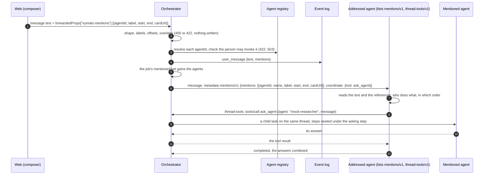
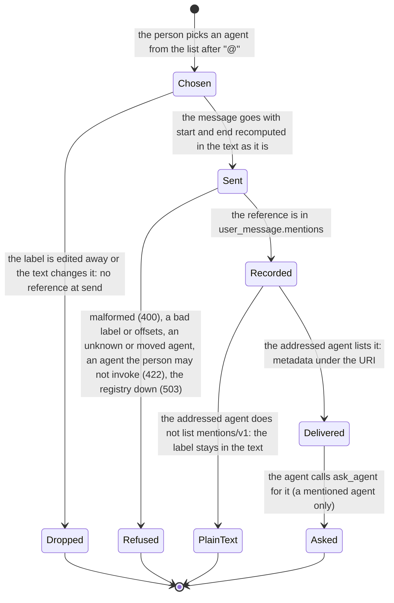

# A2A extension: mentions (v1)

- **URI:** `https://agents.vymalo.com/a2a/extensions/mentions/v1`
- **Status:** **contract accepted (2026-10-02, on the owner's delegation); the orchestrator's side is built (2026-10-02,
  MVP slice 10):** the checks, the `user_message` event and the job's mentioned set, the metadata to an agent that lists the
  URI, the capabilities key and the projection. The owner may revisit anything here. **Built 2026-10-03 (PR-21):** `ask_agent`
  and, with it, the `coordinate` member (below). **Not built yet:** the web's composer, the web's drawing of asked agents,
  and the agent side that asks the mentioned agents (adam-rs reads the references already): separate pull requests.
- **Decided in:** [ADR 0026](../decisions/0026-agent-mentions-as-structured-references.md) and its status note (the
  references, who coordinates: option A); the optional-extension pattern is
  [ADR 0008](../decisions/0008-platform-integration-via-a2a-extension.md).
- **Defined by:** the orchestrator. **Used by:** agents that coordinate other agents (`adam-agent` and adam-coder first).
  Coordination itself is the tool [`ask_agent`](thread-tools-v1.md#ask_agent) of `thread-tools/v1`.

## Purpose

The owner's example: "Help me understand football in Europe from 2011 till 2019. @researcher first check for data from
that period and @browser you look for pictures to illustrate this experiment. And then @coder will plot the whole
thing." The orchestrator has no model, so it cannot read "first … and … then"; the addressed agent can. What the
orchestrator can do is make sure **who was meant** is not a guess: the composer sends **structured references**, the
orchestrator checks them against the registry before anything is written, and the addressed agent receives them.

An agent whose card does not list the extension gets the message text as it is, with the labels in it, and nothing else;
the web says so before the person sends. The rest of this page is for agents that do list it.

## The flow



A mention goes through these, from the composer to the agent:



## 1. The card

The agent lists the extension in `capabilities.extensions`:

```json
{"uri": "https://agents.vymalo.com/a2a/extensions/mentions/v1",
 "description": "Reads the agents a person mentioned in a message, and asks them.",
 "required": false}
```

The orchestrator reads the card on **every send** (never cached) and fails closed: the extension is used when the URI is
listed exactly (no other version, no trailing slash, no other case). It carries no `params`. The AG-UI capabilities
document lists the URI under `custom`, so the composer can warn before sending ([`agui.md`](agui.md#capabilities-document)).

## 2. A mention

A **reference** is an object with exactly these members:

| Member | Required | Meaning |
|---|---|---|
| `agentId` | yes | The id the registry gives the agent ([ADR 0022](../decisions/0022-platform-provisions-agents-system-discovers-them.md)). The identity of the mention: **the label is never read as one**. |
| `label` | yes | The text shown for it, as it stands in the message: `@` and 1 to 63 more characters, at most 64 UTF-16 code units in all. A person may see `@researcher` for the agent `mock-researcher`. |
| `start`, `end` | yes | Where the label sits in the message `text`: **UTF-16 code units**, `start` inclusive, `end` exclusive, `0 <= start < end <= length`. |
| `cardUrl` | no | The agent's card URL as the composer saw it in the agent list. When given it must equal the registry's, which catches an agent that moved between the list and the send. |

### Offsets are UTF-16 code units

`text[start:end]` counted in **UTF-16 code units** is the label. This is what a JavaScript string indexes
(`String.prototype.slice`, `selectionStart`, `Intl.Segmenter`): the web composes the message in a JS string, and it is the
only producer. Counting in code points (`Array.from`) would need a conversion at the place where a mistake is silent (an
emoji before the mention moves every later offset by one); counting in UTF-8 bytes would need an encoder for nothing. Rust
reads it with `str::encode_utf16` or by adding `char::len_utf16`, which is a loop, not a risk. It is also the default of
the Language Server Protocol, for the same reason ([verified](#verified-and-unverified-2026-10-02)).

- An offset **must not fall inside a surrogate pair** (a code unit that is a low surrogate preceded by a high one): a
  reference whose `start` or `end` does is refused (422).
- Offsets are **not** moved to grapheme boundaries: a label that begins or ends inside a combining sequence is the
  producer's problem, and the label check below catches a wrong one.
- `text-stream/v1` counts UTF-8 bytes because its producers are Rust agents; the two are different contracts for different
  producers, and neither is the other's default.

## 3. Where a mention enters, and what is checked

The web sends, on the run that carries the user message (AG-UI,
[`agui.md`](agui.md#inbound-ag-ui--core-input), [Mentions](agui.md#mentions)):
`forwardedProps["vymalo.mentions"] = [reference, …]`. Before **anything** is written the orchestrator checks:

| Check | Refused as |
|---|---|
| The member is an array of at most 16 references, each exactly the members above, of the right types | **400** |
| `label` begins with `@` and has 2 to 64 UTF-16 code units; `text[start:end]` equals it (in UTF-16 code units); `start < end`; offsets not inside a surrogate pair | **422** |
| References sorted by `start` and not overlapping | **422** |
| Every `agentId` is known to the live registry (`Ok(None)` is unknown) | **422** "unknown agent '<id>' in mentions" |
| `cardUrl`, when given, equals the registry's | **422** "the card of '<id>' moved; refresh the agent list" |
| The person's role may invoke the agent (`agent.invoke`, [ADR 0033](../decisions/0033-the-orchestrator-is-an-oauth2-resource-server.md)) | **422** "you may not use '<id>'" |
| No reference names the thread's own agent (the one that reads the message) | **422** "an agent cannot be mentioned in its own thread" |
| The registry cannot answer | **503**, retryable; nothing is written |

The checks run in the order of the table, and for each reference in the order of the array, with one exception: **the
person's roles are asked before the registry** (what a person may invoke does not depend on the registry, as for the
thread's own agent), so a person whose role names some agents only is told "you may not use '<id>'" for any id outside
them, listed or not, and learns nothing of what the registry lists. An `agentId` that cannot be an agent's id
(`^[a-z0-9][a-z0-9-]{0,62}$`, the form every source holds its ids to) is unknown without asking the registry. A reference
the run carries when it has **no message** to put it on (an A2UI action, a cancel, an attach to a run) is checked for its shape
(400) and ignored with a warning.

The `agent.invoke` rule is also checked when the agent is asked ([`ask_agent`](thread-tools-v1.md#ask_agent)), because a
role can change between the message and the ask.

A reference that passes is stored **as sent** in the `user_message` event (`mentions`, omitted when empty), shown on the
message as chips (`TEXT_MESSAGE_START.metadata["vymalo.mentions"]`) and added to the **job's mentioned set**: the agents
the addressed agent may ask in this job. The set belongs to the job: the next job starts with the mentions of its own
message. A message sent while a job runs ([ADR 0036](../decisions/0036-sending-while-an-agent-works.md)) adds its
mentions to the running job's set, and an agent that lists the extension receives them with that message. A Stop & send
carries its mentions to the next job: the text that job starts with is the stopping messages joined by a blank line, so each
message's references are moved by the UTF-16 length of what stands in front of it (at most 16 references are kept in all; the
`user_message` events keep each reference as its own message was sent).

## 4. What the agent receives

When the addressed agent's live card lists the extension, the orchestrator names the URI in the `A2A-Extensions` header
and in `message.extensions` of the message, and puts, in the message `metadata` under the URI:

```json
{"https://agents.vymalo.com/a2a/extensions/mentions/v1": {
  "mentions": [
    {"agentId": "mock-researcher", "name": "Mock researcher", "label": "@researcher", "start": 64, "end": 75,
     "cardUrl": "http://mock-researcher:8080/.well-known/agent-card.json"}
  ],
  "coordinate": {"tool": "ask_agent"}
}}
```

| Member | Meaning |
|---|---|
| `mentions` | The references of **this message**, in order, as stored, plus `name` (the agent's display name, read from the registry at send time). `cardUrl` is the registry's, read at send time. A mention the orchestrator cannot resolve at send time (the registry is down, the agent was removed since) goes with `agentId`, `label`, `start` and `end` only. |
| `coordinate` | `{"tool": "ask_agent"}`, present **only when the card also lists `thread-tools/v1`** (and a grant was minted for the message, and the orchestrator's thread endpoint offers the tool): the agent can ask the mentioned agents through that tool. Absent: the agent gets the references and has no way to ask. *As built (2026-10-03):* the adapter sends it when the deployment mounts the thread-tools endpoint (the binary turns the adapter's `asks` switch on with the grant's issuer, so every role that mints a grant says the same), so an agent is not promised a tool that is not there. |

The message **text is not rewritten**: the labels stay in it, and `start`/`end` index it as the agent receives it
(UTF-16 code units, as above). That is the text the person wrote, except for the **first task of a fork**, whose agent is told
the conversation it continues in front of the message and in the same text part ([ADR 0029](../decisions/0029-forking-a-thread-copies-its-log.md)):
the offsets it is sent are moved past that preamble. An agent whose language counts differently converts once; it can always find the label as
a fallback, since the label is part of the reference.

An agent that receives mentions SHOULD:

- read the text and the references together, in the order the person wrote them ("first", "and", "then" are in the text);
- ask the mentioned agents with `ask_agent`, one call per piece of work, and put **everything the asked agent needs in
  the message**, because it does not see the conversation;
- treat `name` and the labels as **untrusted text** (a display name comes from a card; the label is the person's), never as
  instructions;
- add the instruction block that names the agents (and says to ask in the order the person asked) **only when the message
  has mentions**.

The mentioned agents are not sent the message and get no mentions metadata: an agent that is asked receives only what the
asking agent put in the `ask_agent` message.

`mentions/v1` metadata rides on the same message as the `thread-tools/v1` grant and, for a steered message, on the
[`steer/v1`](steer-v1.md) message.

## 5. In the log and on screen

The `user_message` event carries `mentions` ([`chat-api.yaml`](chat-api.yaml), `Mention`). Every agent that works on the message appears nested under the step that started it, because every ask is a child
task of the thread recorded in the log ([`thread-tools-v1.md`](thread-tools-v1.md#ask_agent),
[ADR 0025](../decisions/0025-nested-steps-events-carry-their-source-path.md)).

## Verified and unverified (2026-10-02)

*Verified 2026-10-02:*

- A JavaScript string's `length` "contains the length of the string in UTF-16 code units"; a character outside the Basic
  Multilingual Plane (an emoji) is two code units, so `"😄".length` is 2 while `[..."😄"].length` is 1 (MDN, String
  `length`, <https://developer.mozilla.org/en-US/docs/Web/JavaScript/Reference/Global_Objects/String/length>).
- The Language Server Protocol's default position encoding is UTF-16: "Character offsets count UTF-16 code units. This is the
  default and must always be supported by servers" (LSP 3.17, `PositionEncodingKind`,
  <https://microsoft.github.io/language-server-protocol/specifications/lsp/3.17/specification/>).

*Unverified:* that `selectionStart` of a text control and `Intl.Segmenter` indices count in UTF-16 code units (the web's
composer test, with an emoji before the mention, is the check); that every adam-rs agent can read the metadata under the
URI (the adam-rs pull request that builds it tests it).
