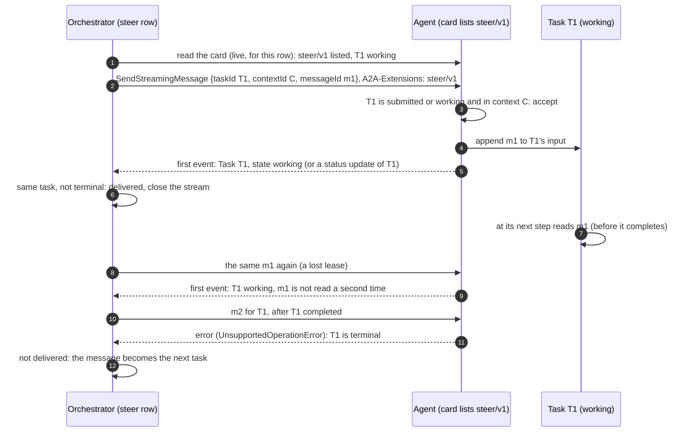
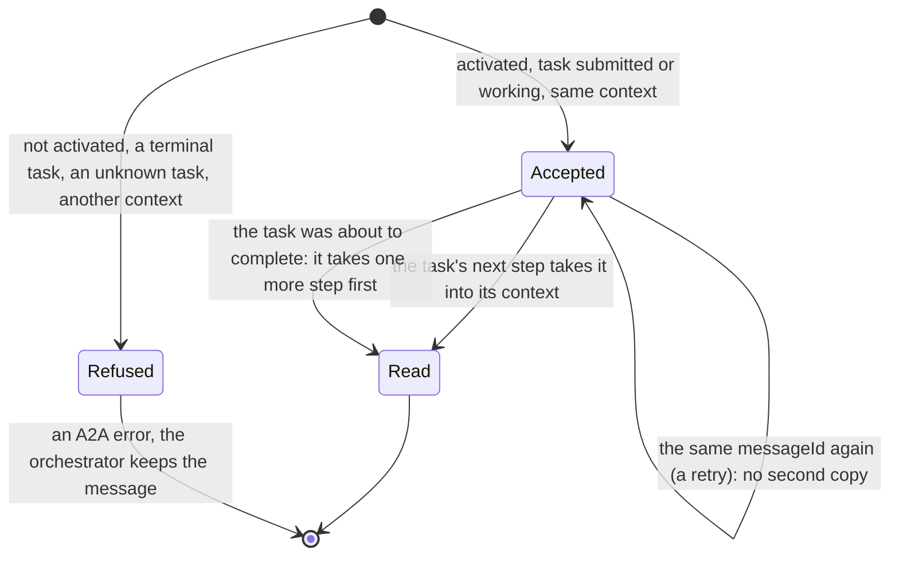

# A2A extension: steer (v1)

- **URI:** `https://agents.vymalo.com/a2a/extensions/steer/v1`
- **Status:** **contract accepted (2026-10-02, on the owner's delegation); not built.** The owner may revisit anything
  here. The orchestrator's side (the `steer` outbox row, the adapter that activates the extension, the fallback) and the
  adam-rs side (an agent that reads a message sent to its running task) are separate pull requests that follow this page;
  the order is in [ADR 0036](../decisions/0036-sending-while-an-agent-works.md).
- **Decided in:** [ADR 0036](../decisions/0036-sending-while-an-agent-works.md); the optional-extension pattern is
  [ADR 0008](../decisions/0008-platform-integration-via-a2a-extension.md).
- **Defined by:** the orchestrator. **Used by:** agents that can read a message while a task runs (adam-coder and
  `adam-agent` first).

## Purpose

A person sees an agent going the wrong way and writes "you were wrong since line 1". The A2A specification does not say
what an agent does with a message addressed to a task that is `working` (*verified 2026-10-02*, see
[Verified and unverified](#verified-and-unverified-2026-10-02)), and a terminal task refuses every message. This
extension makes it a promise: **a message that names a running task is added to that task's input, and the agent reads it
at its next step.** The orchestrator uses it for **Send** while a job runs; **Stop & send** is plain A2A (`CancelTask`, then
a new task that references the cancelled one) and does not use it.

An agent whose card does not list the extension is unchanged. The orchestrator never sends it a message for a running
task: it keeps the message and sends it after the turn, as before ([ADR 0036](../decisions/0036-sending-while-an-agent-works.md)).
The rest of this page is for agents that do list it.

## The flow



A steered message is in one of these, from the agent's point of view:



## 1. The card

The agent lists the extension in `capabilities.extensions`:

```json
{"uri": "https://agents.vymalo.com/a2a/extensions/steer/v1",
 "description": "Reads a message sent to its running task at its next step.",
 "required": false}
```

The orchestrator reads the card on **every send** (never cached) and fails closed: the extension is used when the URI is
listed exactly (no other version, no trailing slash, no other case). It carries no `params`. The extensions of a live card
are read into one closed set (`KnownExtension::Steer`), and the AG-UI capabilities document lists the URI under `custom`,
so the web can say "reads it at its next step" or "reads it after this turn" before the person sends
([`agui.md`](agui.md#capabilities-document), updated by the pull request that builds this).

## 2. Activation

The orchestrator names the URI in the `A2A-Extensions` header and in `message.extensions` of a `SendStreamingMessage`
**only when** all of these hold:

- the live card lists the URI;
- the message's `taskId` is the thread's current task, which the orchestrator last saw `submitted` or `working`;
- its `contextId` is that task's context (the thread's).

An agent MUST NOT take a `taskId` message to a working task as a steer unless the request activated the extension: without
it the message is refused ([section 4](#4-refusals)), as the specification leaves an unextended one undefined.

## 3. The message

An ordinary A2A user message, with the task it is for:

```json
{"message": {
  "role": "user",
  "messageId": "msg-01927a4e-9c10-7000-8000-00000000002f",
  "taskId": "task-1",
  "contextId": "01927a4e-3b00-7000-8000-000000000001",
  "parts": [{"text": "you were wrong since line 1"}],
  "extensions": ["https://agents.vymalo.com/a2a/extensions/steer/v1"]
}}
```

| Member | Meaning |
|---|---|
| `messageId` | The id of the person's message in the orchestrator's log. A row retried after a lost lease sends **the same id**, so it is the key of the agent's duplicate check. |
| `taskId`, `contextId` | The running task and its context. No `referenceTaskIds`: nothing is continued, the task is the same. |
| `parts` | The person's text, one text part, as in any message. Whatever the other extensions put on a message rides along: the [thread-tools](thread-tools-v1.md) grant (every message has a token of its own, and the agent keeps using the newest it was given) and, when the card lists it, the [mentions](mentions-v1.md) of this message. |

It carries **no metadata of its own**: the request, not the message, says it is a steer.

**What the agent does.**

1. It accepts the message only when the task is `submitted` or `working` and belongs to the message's `contextId`.
   Otherwise it refuses ([section 4](#4-refusals)).
2. It adds the message to the task's input **in the order received** and reads it at **its next step**: its next model turn,
   at the latest, never in the middle of a tool call it has started. It is the person's words to the agent, as a message
   would be at the start of a task; it is not an instruction to abort what is running (that is `CancelTask`).
3. **An accepted message is never lost.** A task that is about to complete while a steered message is unread takes
   another step first and answers it. An agent that cannot promise this for a task (it has already moved to its final
   state) refuses instead of accepting.
4. It **deduplicates by `messageId`**: a message it holds already is not added again. It answers as for a first
   delivery.
5. It answers with the task in its **current, non-terminal state**: the first event of the stream is the `Task`
   (`working`), or a status update of that task. The agent MAY end the stream after it, and the orchestrator closes it on
   reading the first event. Everything the task does next is reported on the stream that started it, as always: a steer
   opens no second stream of results.

**What the orchestrator does with the answer.** The first event names the same task in a non-terminal state: the row is
delivered. Anything else (an error, a terminal state, another task, no event) is a refusal and the message is kept and
sent after the turn ([ADR 0036](../decisions/0036-sending-while-an-agent-works.md#the-dispatcher)).

An `input-required` or `auth-required` task is not served by this extension: the message answers it as plain A2A does,
by `taskId`, and the orchestrator does not activate the extension for it.

## 4. Refusals

A refusal is an **A2A error response**. The agent chooses the error; the orchestrator does not depend on which: **every
error, and every first event that is not the same task in a non-terminal state, means "not delivered"**, and the message
is kept (it is in the log already) and sent after the turn as a new task referencing the task.

| Situation | What the agent answers | Orchestrator |
|---|---|---|
| The extension was not activated | an A2A error (`UnsupportedOperationError`) | not delivered |
| The task is terminal (`completed`, `failed`, `canceled`, `rejected`) | `UnsupportedOperationError` (the specification's error for a message to a terminal task, *verified 2026-10-02*) | not delivered; the message starts the next job or task (ADR 0020, ADR 0021) |
| The task is unknown to the agent, or its context is not the message's | `TaskNotFoundError` | not delivered |
| The task is final or about to finish and cannot take one more step | an A2A error | not delivered |
| The agent is down, or the stream ends with no event | no answer | not delivered; the row is retried by the dispatcher's backoff before it falls back |

Which JSON-RPC code each error carries is the binding's, and the orchestrator does not read it (the names above are the
specification's; *unverified*: the numeric codes, which the specification text read for this page does not tabulate).

An agent that lists the extension and then breaks the promise (accepts a message and never reads it) is a defect of that
agent: the orchestrator cannot see inside a task, and the log shows the message as sent.

## 5. What the person sees

The message is in the log at once as `user_message` with `delivery: "steer"` (the core decides it, never the caller). The
bubble says "read at its next step" when the agent lists this extension and "read after this turn" when it does not
([ADR 0036](../decisions/0036-sending-while-an-agent-works.md#the-web)); that is what normally happens, and the order of
the log is the truth when a steer falls back.

## 6. Security

A steered message is the person's own text, as trusted as the message that started the job: it enters the same agent
through the same door. It carries no capability: the thread-tools token it may carry is minted for this message, one
thread and one caller, like any other. An agent MUST NOT treat the activation as authority for anything the person's
messages could not do. The orchestrator sends a steer only for the thread's current task, only for a person with
`thread.write` on the thread ([ADR 0033](../decisions/0033-the-orchestrator-is-an-oauth2-resource-server.md)), and never
for a verifier's or an asked agent's task.

## Conformance

What a build of an agent that lists the extension is tested for (the orchestrator's `FakeAgent` word `steerable` plays the
agent side, and the adam-rs pull request tests the real one): activated, a message for a working task is delivered and
read at the next step; not activated, it is refused; a terminal task refuses with an error; the same `messageId` twice is
read once; an HTTP round trip with the first event the working task; and a message that arrives while the agent is
writing its final answer is answered, not dropped.

## Verified and unverified (2026-10-02)

*Verified 2026-10-02* against the A2A specification (<https://a2a-protocol.org/latest/specification/>):

- The task states are `submitted`, `working`, `input-required`, `auth-required` and the terminal `completed`, `failed`,
  `canceled`, `rejected`.
- "Messages sent to Tasks that are in a terminal state … cannot accept further messages" and the error is
  `UnsupportedOperationError`.
- Sending a message to a task that is `working` is **not explicitly defined**; the multi-turn text speaks of continuing or
  refining tasks, and names `input-required` and `auth-required` as the interrupted states.
- A `SendStreamingMessage` stream that returns a task "MUST begin with the Task object" (or is a Message-only stream), so
  the first event of a steer is the task.
- "Send Message operations MAY be idempotent. Agents may utilize the `messageId` to detect duplicate messages."
- Extensions are activated by the `A2A-Extensions` header and listed in `message.extensions` (as the other pages of this
  directory say, *verified 2026-10-01*).

*Unverified:* the numeric codes of the A2A errors; that adam-rs can keep the promise of "never lost" for a message that
arrives during its final model call (the adam-rs pull request tests it; the orchestrator's fallback covers a refusal).
