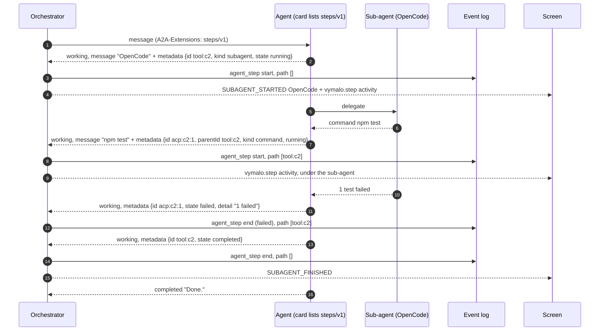
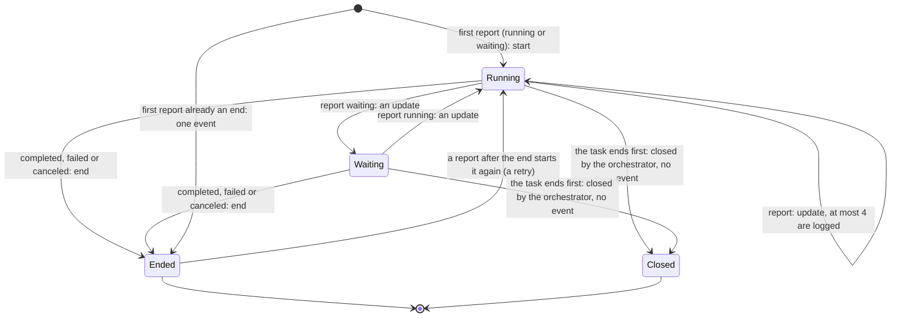

# A2A extension: steps (v1)

- **URI:** `https://agents.vymalo.com/a2a/extensions/steps/v1`
- **Status:** **contract accepted (2026-10-01, on the owner's delegation); the orchestrator's side is built (MVP
  slice 5: the `agent_step` event and its coalescing, the AG-UI projection as nested subagents and `vymalo.step`
  activities, and the A2A adapter that reads the extension).** The web's step tree and the right-hand panel are the
  web's slice; the adam-rs side (an agent that reports its tool calls and its sub-agent's as steps) is that
  repository's slice; see [`mvp.md`](../mvp.md#the-new-build-order). The owner may revisit anything here.
- **Decided in:** [ADR 0025](../decisions/0025-nested-steps-events-carry-their-source-path.md) and its status note;
  the optional-extension pattern is [ADR 0008](../decisions/0008-platform-integration-via-a2a-extension.md).
- **Defined by:** the orchestrator. **Used by:** agents that delegate or call tools (adam-coder and its OpenCode
  bridge first), and by the orchestrator itself for the steps it reports without the agent's help.

## Purpose

An agent's work has a shape: the thread's agent, a sub-agent it handed a task to (OpenCode, over ACP), and the tools and
commands they ran. In one real thread, 7 messages produced 336 status events, 197 of them one sub-agent's; the chat
drew them as one flat list ([ADR 0025](../decisions/0025-nested-steps-events-carry-their-source-path.md)).
This extension lets an agent say **which step** each progress report is about and **under which step it runs**, so the
orchestrator can keep a tree, keep the log small, and let the screen show a line per level that opens on demand.

An agent that does not list the extension is one level, as before: its status text is shown under it. The rest of this
page is for agents that do, and for the orchestrator and the screens that serve them.

Facts about A2A are marked *verified* (with a date and a source) or *unverified*; see
[Verified and unverified](#verified-and-unverified-2026-10-01).

## Who does what

| Part | Does |
|---|---|
| **Agent** | Lists the extension in its card. Reports a step as a `working` status update whose message carries the step in its metadata (a plain text label too, for anyone who ignores the extension). Sends the start of a step, an update now and then, and its end. |
| **Orchestrator** | Reads the card on every send and activates the extension only for an agent that lists it. Turns each valid report into an `agent_step` event with the **path** of the step (the chain of step ids it runs under), keeps the log bounded ([coalescing](#4-what-the-orchestrator-logs)), and projects the tree to AG-UI. Reports steps of its own (a tool call it relays, an agent it asked) through the same event. |
| **Screen** | Draws the tree: one line per level, a spinner while it works, the failures always visible. |

## The flow



A step is one of these, and a report moves it between them:



## 1. The card

The agent lists the extension in `capabilities.extensions`:

```json
{"uri": "https://agents.vymalo.com/a2a/extensions/steps/v1",
 "description": "Reports its tool calls and its sub-agents' work as nested steps.",
 "required": false}
```

The orchestrator reads the card on **every send** (never cached) and fails closed: the extension is used when the URI
is listed exactly (no other version, no trailing slash, no other case). It carries no `params`.

## 2. Activation

The orchestrator names the URI in the `A2A-Extensions` header of the requests that make an agent report, and in
`message.extensions` of the message, **only when the live card lists it**. Those requests are `SendStreamingMessage`
and `SubscribeToTask` (a resubscribe after a dropped stream).

The response is read as **data** whether or not the request activated the extension, the way A2UI is
([ADR 0013](../decisions/0013-a2ui-generative-ui.md)): a status that carries a valid step is a step, so a stream, a
resubscribe and a poll map to the same events.

## 3. The report

A step is a `TaskStatusUpdateEvent` whose `status.state` is `working` and whose `status.message` has **one text part**
(a plain label: what a client that ignores the extension shows) and, in the **message's `metadata`**, under the URI:

```json
"metadata": { "https://agents.vymalo.com/a2a/extensions/steps/v1": {
  "id": "acp:call_2:toolu_01",
  "parentId": "tool:call_2",
  "kind": "command",
  "label": "npm test",
  "state": "running",
  "icon": "execute",
  "detail": "12 passed, 1 failed"
}}
```

| Member | Required | Meaning |
|---|---|---|
| `id` | yes | 1 to 128 bytes, printable, unique **within the task**. The orchestrator makes it unique within the thread by prefixing the task id. |
| `parentId` | no | The id of a step reported earlier in the same task. Absent: a step at the top, under the agent. |
| `kind` | no | `subagent` (an agent working for this one; its steps nest under it), `tool`, `command`, `message` (something said that deserves a line). Absent or unknown: `tool`. |
| `label` | yes | Plain text, one line. At most 200 characters (more is cut, ending in `…`). |
| `state` | yes | `running`, `waiting` (for a permission, a person, another step), `completed`, `failed`, `canceled`. The last three **end** the step. |
| `icon` | no | One of `agent`, `read`, `edit`, `delete`, `move`, `search`, `execute`, `think`, `fetch`, `web`, `git`, `test`, `file`, `tool`. Anything else is ignored: the step stays, without an icon. |
| `detail` | no | Plain text: a result, a failure. At most 1000 characters (more is cut, ending in `…`). Line breaks are kept. |

Semantics:

- The first report of an id **starts** the step, later ones **update** it, `completed`, `failed` or `canceled` **end**
  it. A report after the end starts it again (a retry).
- Agents SHOULD send at most one update per step per second; the start and the end always. The orchestrator keeps
  only a few updates anyway ([coalescing](#4-what-the-orchestrator-logs)).
- A step that is reported ended without having started is one event, an end.
- **Metadata that does not validate is ignored** and the status is read as plain A2A: no `id`, no `label`, no `state`,
  a `state` that is not one of the five, a member of the wrong type. A report is data from an agent and is checked as
  such, again in the core ([`StepReport::sanitize`](../../orchestrator/crates/core/src/step.rs)): ids with control
  characters, an id over 200 bytes once prefixed, or a label that is empty once its whitespace is gone drop the report.
- A step's text is **untrusted**: a screen draws it as text.
- An agent SHOULD NOT report a step for a call it makes on the [thread tools](thread-tools-v1.md): the orchestrator
  reports those itself, with the tool server's icon.

## 4. What the orchestrator logs

Each valid report becomes an `agent_step` event ([`chat-api.yaml`](chat-api.yaml)), attributed to the agent:

```json
{"seq": 5, "kind": "agent_step", "actor": {"type": "agent", "name": "coder", "revision": "rev-2"},
 "data": {"id": "task-1/acp:call_2:toolu_01", "path": ["task-1/tool:call_2"], "kind": "command",
          "label": "npm test", "state": "failed", "phase": "end", "icon": "execute", "detail": "1 failed"}}
```

`path` is the chain of step ids the step runs under, outermost first (the parent's own path and the parent; at most the
8 nearest). `phase` says which moment of the step the event is: `start`, `update` or `end`.

**The log is bounded.** The job's ledger (`threads.job`, so every replica decides the same) remembers which steps are
open and how many updates each logged:

| The step is | The report is | The log gets |
|---|---|---|
| not open | running or waiting | a `start` (the step becomes open) |
| not open | an end | one `end` event (a step of one moment) |
| open | running or waiting | an `update`, while fewer than **4** were logged for it; else nothing |
| open | an end | an `end`, with the path the step started with; the step is no longer open |

So a step costs at most 2 + 4 events however often the agent reports. A job logs at most 2000 steps and tracks at most
256 as open (a report that would exceed either is dropped). When the agent's task ends, whatever it left open is
forgotten with no event; the projection closes what it shows.

State: a report is taken while the thread is `queued` or `working` (the first one moves a `queued` thread to
`working`: a step is a sign of work). In `blocked` and `verifying` the work is not going on, and a late report is
dropped; for a finished thread it is a late update and is refused.

## 5. In AG-UI

A sub-agent step is a **subagent** of the run, nested under the one it runs in, and every step is a `vymalo.step`
activity attributed to the subagent it belongs to: see "Nested steps" in [`agui.md`](agui.md). A client that knows
nothing of steps still gets the subagent frames the protocol defines.

## 6. Steps the orchestrator reports itself

The orchestrator emits the same event for work that does not come from the agent's own stream: a tool call it relays
for the agent ([ADR 0024](../decisions/0024-mcp-tools-attached-per-conversation.md)) is a `tool` step whose icon may
name the MCP server (`mcp-server:<id>`; an agent cannot claim that icon), and an agent it asked
([ADR 0026](../decisions/0026-agent-mentions-as-structured-references.md)) is a `subagent` step the asked agent's own
steps nest under. They go through the same rules (`Input::Step`, `App::record_step`).

## Verified and unverified (2026-10-01)

*Verified 2026-10-01* against the A2A specification (<https://a2a-protocol.org/latest/specification/> and
<https://a2a-protocol.org/latest/topics/extensions/>):

- Extensions are declared in the card's `AgentCapabilities` as objects with `uri`, `description`, `required` and
  optional `params`.
- A client activates an extension with the `A2A-Extensions` request header, "a comma-separated list of extension
  URIs"; the agent should echo the ones it activated. `Message.extensions` lists "the URIs of extensions that are
  present or contributed to this Message".
- Extension data goes in the `metadata` map of the core structures; a `TaskStatus` has an optional `message` with
  `parts`.

*Verified 2026-10-01, by this repository's tests:* the adapter reads a step from the status message of a stream and of a
polled task under the same keys (`crates/a2a-mapping`, unit tests); it activates the extension on a send (the header and
`message.extensions`) and on a resubscribe, only for an agent whose live card lists the exact URI, and reads the card for
every call (`crates/agent-a2a/tests/steps.rs`); and the real stack (the dispatcher, both stores, the in-process fake agent
and the WireMock agent of `dev/`) logs the steps nested with their paths, keeps a chatty step to a start, four updates and
an end, and ends a step through another replica with the path it started with (`crates/e2e/tests/steps.rs`,
`wiremock_agent.rs`).

*Unverified:* how an A2A server holds the numbers of the metadata (none are used here), and whether every agent that
activates by header also needs `message.extensions` (both are sent, as for the other extensions).
