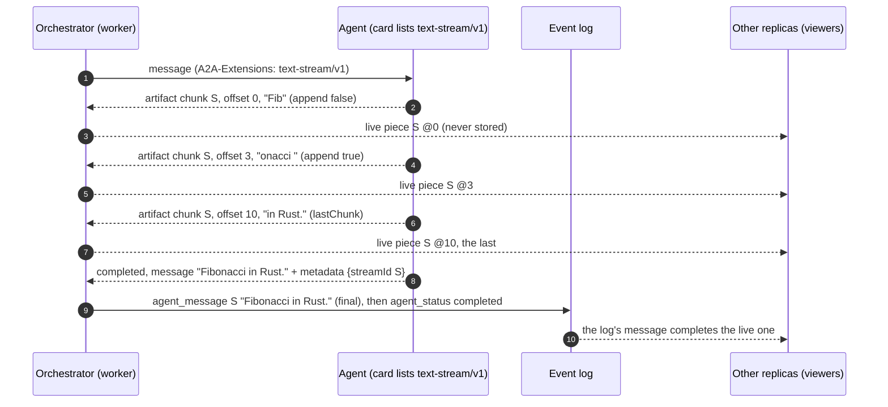
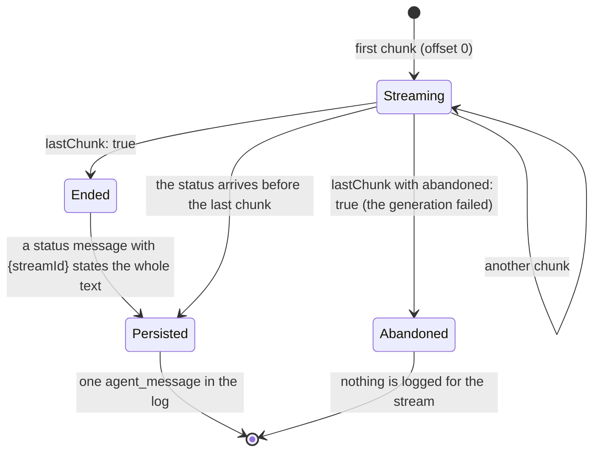

# A2A extension: text stream (v1)

- **URI:** `https://agents.vymalo.com/a2a/extensions/text-stream/v1`
- **Status:** **contract accepted (2026-10-01, on the owner's delegation); the orchestrator's side is built (MVP
  slice 6: the A2A adapter that reads it, the relay between processes, and the AG-UI live frames), and so is the
  web's (the words growing on screen, [`web/README.md`](../../web/README.md#live-text)).** The adam-rs side (an agent
  that streams the model's answer) is that repository's slice; see [`mvp.md`](../mvp.md#the-new-build-order). The owner may revisit anything here.
- **Decided in:** [ADR 0027](../decisions/0027-live-text-relayed-not-stored.md); the optional-extension pattern is
  [ADR 0008](../decisions/0008-platform-integration-via-a2a-extension.md). It is the fifth extension of the orchestrator's
  own, beside `ui-catalog`, `thread-tools`, `steps` and `mentions` (the owner's default of 2026-10-01).
- **Defined by:** the orchestrator. **Used by:** agents that call a model and can say what it writes as it writes it
  (adam-coder and `adam-agent` first).

## Purpose

An agent's reply used to appear all at once, when the model had finished writing it, which can be a minute of
"working". This extension lets an agent send the reply **as it is written** and say **once** what the whole reply is, so
the orchestrator can show the words growing while the log still holds only the final text
([ADR 0027](../decisions/0027-live-text-relayed-not-stored.md)).

An agent that does not list the extension is unchanged: its reply arrives whole, as before. The rest of this page is for
agents that do, and for the orchestrator and the screens that serve them.

Facts about A2A are marked *verified* (with a date and a source) or *unverified*; see
[Verified and unverified](#verified-and-unverified-2026-10-01).

## Who does what

| Part | Does |
|---|---|
| **Agent** | Lists the extension in its card. Sends the reply as **chunks** (artifact updates, transient) and states the **whole text once** in a status message (durable). |
| **Orchestrator** | Reads the card on every send and activates the extension only for an agent that lists it. **Relays** the chunks to every process that serves a viewer, never stores them, and logs the whole text once, as an `agent_message` under the stream's id. |
| **Screen** | Shows the words as they come and replaces them by the final message when the log has it ([`agui.md`](agui.md#live-text)). |

## The flow



A stream is in one of these, and the whole text is what ends it:



## 1. The card

The agent lists the extension in `capabilities.extensions`:

```json
{"uri": "https://agents.vymalo.com/a2a/extensions/text-stream/v1",
 "description": "Streams its replies as they are written.",
 "required": false}
```

The orchestrator reads the card on **every send** and every resubscribe (never cached) and fails closed: the extension is
used when the URI is listed exactly (no other version, no trailing slash, no other case). It carries no `params`.

## 2. Activation

The orchestrator names the URI in the `A2A-Extensions` header of the requests that make an agent report, and in
`message.extensions` of the message, **only when the live card lists it**: `SendStreamingMessage` and `SubscribeToTask`
(a resubscribe after a dropped stream). An agent that streams only when activated sends no chunks to a plain client.

Chunks are read as **data** whether or not the request activated the extension, as steps are
([`steps-v1.md`](steps-v1.md#2-activation)): a chunk that validates is a chunk. The words that state a stream
([section 4](#4-the-whole-text)) are read the same way, so a stream, a resubscribe and a poll agree.

## 3. Chunks

A chunk is a `TaskArtifactUpdateEvent` whose **artifact** says it belongs to a stream:

```json
{"taskId": "task-1", "contextId": "ctx-1",
 "artifact": {
   "artifactId": "run-9-m2-a1b2c3d4",
   "name": "reply",
   "parts": [{"text": "onacci "}],
   "extensions": ["https://agents.vymalo.com/a2a/extensions/text-stream/v1"],
   "metadata": {"https://agents.vymalo.com/a2a/extensions/text-stream/v1": {"offset": 3}}
 },
 "append": true,
 "lastChunk": false}
```

| Member | Required | Meaning |
|---|---|---|
| `artifact.artifactId` | yes | The **stream id** `S`: 1 to 128 bytes, printable (no control characters), unique within the task. It is also the id of the message the log will hold. |
| `artifact.name` | no | `"reply"`. Not read. |
| `artifact.parts` | yes | **Exactly one** text part: the piece. It may be empty on the last chunk. |
| `artifact.extensions` | no | The URI, as A2A has artifacts say which extensions contribute to them. Not required for reading. |
| `artifact.metadata[URI].offset` | yes | The **UTF-8 byte offset** of the piece in the whole text of the stream: 0 for the first, then the sum of the lengths of the pieces before it. A non-negative whole number, written as an integer (an A2A SDK may hand it on as `10.0`: a whole number is read either way). |
| `artifact.metadata[URI].abandoned` | no | `true` on the last chunk when the generation failed: the stream ends and **no whole text follows**. |
| `append` | A2A's own | `false` on the first chunk, `true` after. |
| `lastChunk` | A2A's own | `true` on the last chunk. |

- A chunk whose entry does not validate (no `offset` or one that is not a non-negative whole number, a stream id that is empty,
  too long or has control characters, not exactly one text part) is **not a chunk**: it is read as a plain A2A artifact
  chunk, as before the extension existed (fail closed).
- Chunks of one stream are sent in order and are contiguous. A receiver that sees a piece whose offset is not the end of
  what it holds treats it as an overlap (the repeated part is dropped) or a gap (something was lost).
- Agents SHOULD send a chunk at most every 100 ms or every 200 bytes, whichever comes first, and not one character at a
  time: the orchestrator merges what it gets, but the wire is the agent's.
- **Chunks are transient.** They are never in the `artifacts` of a `GetTask`, and an agent does not replay them to a
  client that resubscribes. A client that wants the reply after the fact reads the whole text ([section 4](#4-the-whole-text)).

## 4. The whole text

The agent states the whole text of a stream **once**, as a status message that carries, in the **message's `metadata`**,
under the URI:

```json
{"https://agents.vymalo.com/a2a/extensions/text-stream/v1": {"streamId": "run-9-m2-a1b2c3d4"}}
```

and **one text part**: the whole text, the concatenation of the stream's chunks. It goes on:

- a `working` status, for words written before a tool call (best effort: an agent that cannot say them there loses them
  from the log, and the screen shows them until the turn ends);
- the status that **ends the turn** (`completed`, `input_required` or `auth_required`) when the answer was streamed.
  This one is **durable**: it is what the log holds if every chunk was lost.

How the orchestrator reads a status whose message carries a valid marker (`streamId` of 1 to 128 printable bytes) and a
text that is not blank:

1. one `agent_message` `{messageId: S, text, final: true, purpose}`, under the key `a2a:msg:S` (so a replay, a
   resubscribe and a poll collapse into one), **then**
2. the status itself, as before: a `working` status has **no `detail`** (its words are the message), and a turn-ending
   status **keeps its `detail`** (an interrupt and the verifier's summary read it; the projection says words that equal the
   invocation's last final message only once).

A status that carries a step ([`steps-v1.md`](steps-v1.md#3-the-report)) is a step and its text is its label: the marker is
ignored. A marker that does not validate is ignored and the status is read as plain A2A.

**What the words are for** ([ADR 0031](../decisions/0031-working-text-and-the-turns-answer.md)). The status the text is
stated on is what says it, so the agent sends nothing more: the orchestrator marks the `agent_message` `purpose:
"working"` when the status is `working`, and `purpose: "answer"` when it is `completed`, `input_required` or
`auth_required`. The words of any other status (a `failed` one) are not marked, and neither is a plain A2A `Message`.
An agent therefore chooses the status each stream is stated on with some care: the words before a tool call on a
`working` status, the reply that ends the turn on the status that ends it. A screen shows the answer in the
conversation and the working text with the steps ([`agui.md`](agui.md#the-agents-words)).

## 5. What the orchestrator does with a chunk

It never stores one. The worker that holds the agent's stream publishes each piece on the wakeup port to every process
([ADR 0027](../decisions/0027-live-text-relayed-not-stored.md)):

- at most every **100 ms** per stream (what arrived in between is merged), at once on the last chunk;
- every **second**, the whole text so far from offset 0 (up to 64 KiB), in pieces of at most 6 KiB, so a viewer that
  connects mid-stream, or lost a piece, has the text within a second;
- never for a stream whose text the log already has (the whole text was stated), and not for the verifier's.

A stream whose first chunk the orchestrator saw was not at offset 0 (a resubscribe after a drop) is relayed but not
refreshed: the orchestrator does not hold its beginning. The whole text, when the agent states it, is in the log either way.
A stream the agent abandons (`abandoned: true`) ends visibly on the screen and logs nothing.

In AG-UI the pieces are `TEXT_MESSAGE_*` frames with `metadata["vymalo.live"]` that are never resume points, merged by
message id with the log's final message: see [Live text](agui.md#live-text).

## Verified and unverified (2026-10-01)

*Verified 2026-10-01* against the A2A specification (<https://a2a-protocol.org/latest/specification/>, sections 3.5.2, 4.1.7
and 4.2.2):

- A `TaskArtifactUpdateEvent` has `taskId`, `contextId`, `artifact`, `append` ("if true, the content of this artifact should be
  appended to a previously sent artifact with the same ID"), `lastChunk` ("if true, this is the final chunk of the artifact")
  and `metadata`. An `Artifact` has `artifactId` ("must be unique within a task"), `name`, `description`, `parts` ("must
  contain at least one part"), `metadata` and `extensions` ("the URIs of extensions that are present or contributed to this
  Artifact").
- "All implementations MUST deliver events in the order they were generated. Events MUST NOT be reordered during
  transmission", and each stream of a task receives the same events in the same order: so a client may rely on chunks of a
  stream arriving in order on one connection, and a receiver that joins later simply has a gap.
- Extensions are declared in the card and activated by the `A2A-Extensions` header (see [`steps-v1.md`](steps-v1.md#verified-and-unverified-2026-10-01)).

*Verified 2026-10-01, by this repository's tests:* the adapter maps a valid chunk to a live piece that is never assembled,
applied or turned into an artifact, and an invalid one to the plain artifact it was; a marked status to one message under
the stream's id and then the status, and a poll and a stream to the same keys (`crates/a2a-mapping`, unit tests); it activates
the extension on a send and a resubscribe only for an agent whose live card lists the exact URI (`crates/agent-a2a/tests/text_stream.rs`);
and the real stack relays the pieces to a second replica sharing the database and logs one message (`crates/e2e/tests/live_text.rs`).

*Verified 2026-10-01, by this repository's tests (the A2A SDK of `a2a-lf` 0.3.1 over real HTTP):* a number in `metadata` comes
out of the SDK as a float (`10` is read as `10.0`), because A2A's metadata is a protobuf `Struct`; the orchestrator therefore
accepts a whole number written either way, and rejects a fraction, a negative number or one above 2^53. The SDK's server
keeps each chunk as its own artifact in the stored task and sends them on as they come (`crates/agent-a2a/tests/text_stream.rs`).

*Unverified:* how an A2A server other than that SDK counts the bytes of `offset` for text it normalises (the contract says
UTF-8 bytes of the text as sent), and how much text per second a real model produces (the relay is bounded either way).
