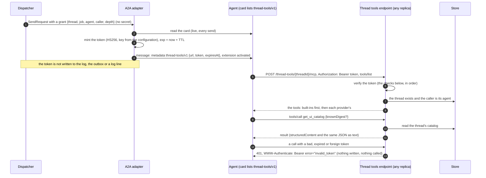
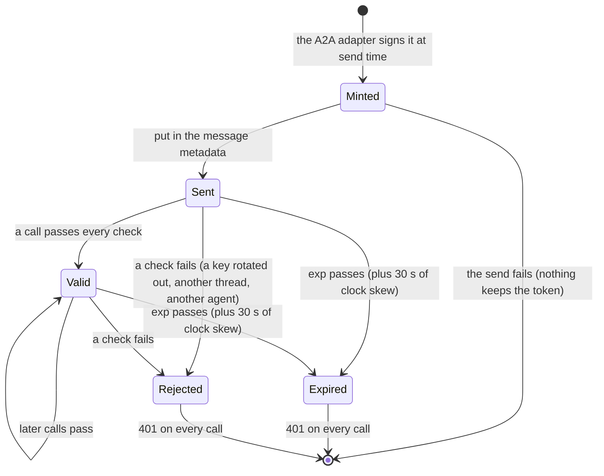

# A2A extension: thread tools (v1)

- **URI:** `https://agents.vymalo.com/a2a/extensions/thread-tools/v1`
- **Status:** **contract accepted (2026-10-01, on the owner's delegation); not built yet.** MVP slice 3 builds the
  endpoint, the token and `get_ui_catalog`; slice 8 adds the relayed tools of attached MCP servers; slice 10 adds
  `ask_agent` ([`mvp.md`](../mvp.md#the-new-build-order)). The owner may revisit anything here.
- **Decided in:** the status notes of [ADR 0023](../decisions/0023-ui-component-catalog-as-an-a2a-extension.md) (the
  endpoint, the token, the refetch), [ADR 0024](../decisions/0024-mcp-tools-attached-per-conversation.md) (the relay)
  and [ADR 0026](../decisions/0026-agent-mentions-as-structured-references.md) (`ask_agent`); a second MCP endpoint
  beside the one of [ADR 0019](../decisions/0019-mcp-server-over-streamable-http.md); the optional-extension pattern
  is [ADR 0008](../decisions/0008-platform-integration-via-a2a-extension.md).
- **Served by:** the orchestrator. **Used by:** agents whose card lists the extension.
- **Closes:** [open questions](../open-questions.md) 34 (where `ask_agent` lives), 35 (the relay) and 36 (the
  refetch's transport).

## Purpose

Give an agent, for the thread it is working on, **one MCP endpoint** through which it reaches what the orchestrator
holds for that thread: the UI catalog (slice 3), the tools the person attached (slice 8), and the other agents it may
ask (slice 10). The agent needs no other credential, and no credential of a tool server ever travels in an A2A message
or reaches the event log or the outbox ([ADR 0024](../decisions/0024-mcp-tools-attached-per-conversation.md)). The
orchestrator sees each call, so it can report it as a step ([ADR 0025](../decisions/0025-nested-steps-events-carry-their-source-path.md)).

An agent whose card does not list the extension gets nothing and works as it does today.

Facts about the RFCs and MCP are marked *verified* (with a date and a source) or *unverified*; see
[Verified and unverified](#verified-and-unverified-2026-10-01).

## The flow





A 401 is decided per request; a token that fails a check keeps failing it, so "expired" and "rejected" end the
token's useful life. A new message carries a new token.

## The card

```json
{"capabilities": {"extensions": [
  {"uri": "https://agents.vymalo.com/a2a/extensions/thread-tools/v1", "required": false}
]}}
```

The orchestrator reads the card on **every send**, never caches it, and fails closed: an unreadable card or a card
without the URI gives the agent no grant. The extensions a live card lists are read into one closed set (thread
tools, UI catalog, steps, mentions), and the AG-UI capabilities document lists each under `custom`, so the web can
flag an agent before the person sends ([`agui.md`](agui.md#capabilities-document)).

## The message

Only when **all three** hold: the card lists the extension, the request belongs to a thread (a request to the
verifier agent does not), and the orchestrator has a key and a base URL configured. The message metadata then has:

```json
{"metadata": {"https://agents.vymalo.com/a2a/extensions/thread-tools/v1": {
  "url": "https://orchestrator.example/thread-tools/1b4e28ba-2fa1-11d2-883f-0016d3cca427/mcp",
  "token": "<the JWT of the next section>",
  "expiresAt": "2026-10-01T14:00:00Z"
}}}
```

`url` is `THREAD_TOOLS_URL` plus `/thread-tools/<threadId>/mcp`. `expiresAt` is the token's `exp` as RFC 3339. The URI
is also added to the `A2A-Extensions` header and to `message.extensions`. **Every message gets its own token**, a
follow-up included; an agent keeps using the newest one it was given, and a task that outlives its token is why the
lifetime is long (below). Slice 8 adds a member that names the attached servers (their ids and display names; never a
URL or a credential); its shape is written with that slice.

The orchestrator never writes the token to the event log, to the outbox payload or to any log or trace field. What
travels inside the orchestrator is a non-secret grant (the thread, the job, the agent, the caller and the depth) on the
send request; only the A2A adapter mints the token, at the moment it sends, and the types that hold it print
`[redacted]`. The agent must treat it as a secret: not in the model's context, not in its own logs.

## The token

A JWS in compact form, HS256 (HMAC-SHA-256), three base64url segments without padding.

**Header** (exactly this; any other `alg` or `typ` is refused, `none` included):

```json
{"alg": "HS256", "typ": "JWT", "kid": "<first 16 hex characters of SHA-256(the key)>"}
```

**Claims:**

| Claim | Value | Meaning |
|---|---|---|
| `iss` | `"orch"` | Issuer; checked. |
| `aud` | `"thread-tools"` | Audience; checked. |
| `sub` | the thread id (UUID) | The one thread the token opens; must equal `{threadId}` in the path. |
| `job` | integer, from 1 | The number of the job the message belongs to ([ADR 0020](../decisions/0020-a-thread-is-a-conversation.md)). Tools that attribute work to a job read it; `get_ui_catalog` does not. |
| `agt` | string | The id of the agent the token was minted for. |
| `caller` | `"main"` or `"ask:<n>"` | Who is calling: the thread's addressed agent, or the n-th asked agent of the job, n from 1 ([ADR 0026](../decisions/0026-agent-mentions-as-structured-references.md)). A closed set. |
| `depth` | integer, 0 to 255 | 0 for `main`; for an asked agent, its depth in the chain of asks. |
| `jti` | string | The A2A message id the token was minted for. One token per message. |
| `iat` | integer, seconds since the epoch | When it was minted (the orchestrator's wall clock). |
| `exp` | integer, seconds since the epoch | `iat` plus the lifetime. |

**Lifetime.** `THREAD_TOOLS_TOKEN_TTL_SECS`, default **7200** (two hours), allowed 60 to 86,400. Two hours because a
task can run long, and an ask can last half an hour inside it; a call that fails with 401 in the middle of a task is
hard for an agent to recover from. The token's protection is its **scope** (one thread, one caller) more than its
brevity.

**Minting.** By the A2A adapter, when it sends the message, from a non-secret grant on the send request. The key comes
from the configuration, so **any replica can verify** a token any replica minted (the processes stay stateless,
[ADR 0001](../decisions/0001-rust-state-machine-on-postgres.md)). The key is at least 32 bytes.

**Rotation.** `THREAD_TOOLS_SECRET_PREVIOUS` is verified, never used to sign. The header's `kid` says which key to try
(the current or the previous one). Rotate by moving the current key to `…_PREVIOUS` and setting a new one; remove the
previous key once the longest lifetime in use has passed.

### Verification

All of these, in this order. Any failure is the same answer: `401`, `WWW-Authenticate: Bearer error="invalid_token"`,
no detail in the body, nothing written, nothing called.

1. The token is at most 2 KiB and has three segments.
2. The header is exactly HS256 and JWT, and `kid` names the current or the previous key.
3. The signature matches, compared in constant time.
4. The claims parse: every one present and well formed, `caller` is `main` or `ask:<n>`, a `main` has depth 0.
5. `iss` and `aud` are the expected ones.
6. `exp` is later than now minus 30 seconds, and `iat` is not later than now plus 30 seconds.
7. `sub` equals the thread id in the path.
8. The thread exists, and the caller is its agent: for `main`, the thread's agent is `agt`. For `ask:<n>` (slice 10),
   ask n of the job is on the thread's ledger and is the agent `agt`.

A request without an `Authorization` header gets a `401` with `WWW-Authenticate: Bearer` and no error code, as RFC
6750 says to answer a request that carries no credentials. The Host header is checked against
`THREAD_TOOLS_ALLOWED_HOSTS` (403 when it is not listed).

### Known-answer vectors

*Filled in when the crate is built.* A fixed key, fixed claims and a fixed time, and the exact token they produce, are
generated by the change that builds the token crate (`orch-thread-token`, MVP slice 3), pinned in that crate's tests
and written here. Until then there is no vector, and none is invented here.

## The endpoint

- **Route:** `/thread-tools/{threadId}/mcp`. It is **not** under `/mcp`: that mount belongs to the MCP server of
  [ADR 0019](../decisions/0019-mcp-server-over-streamable-http.md) and would swallow it.
- **A machine route**, outside the edge identity (no cookie; `X-Auth-Request-Email` is never read), like the webhooks
  ([`webhooks.md`](webhooks.md#routes)). Agents call the orchestrator directly, and the edge does not expose it to
  browsers.
- **MCP streamable HTTP, stateless.** No session id (the specification lets a server assign one, it does not require
  it, see [Verified](#verified-and-unverified-2026-10-01)), so any replica serves any request. A call is answered with
  one JSON response unless the tool streams progress (`ask_agent`, slice 10, as `wait_for_job` does in ADR 0019).
- **The surface** is named `thread-tools` in `ORCH_SURFACES` and is behind the Cargo feature `surface-thread-tools`
  (on by default).

### Configuration

| Variable | Meaning |
|---|---|
| `THREAD_TOOLS_SECRET` | The HMAC key, at least 32 bytes (`openssl rand -hex 32`). Never logged. |
| `THREAD_TOOLS_SECRET_PREVIOUS` | The previous key, for verifying only (rotation). |
| `THREAD_TOOLS_URL` | The base URL under which agents reach the orchestrator, http or https. |
| `THREAD_TOOLS_TOKEN_TTL_SECS` | The token lifetime, default 7200, 60 to 86,400. |
| `THREAD_TOOLS_ALLOWED_HOSTS` | The Host values accepted; default the host and port of `THREAD_TOOLS_URL`. |

The process exits with 78 (as for other configuration errors) when the surface is mounted without a key; when the URL
is set without a key or the key without a URL; and for a bad URL, lifetime or host. The A2A adapter mints whenever the
key and the URL are set, so every role gets the same variables: **workers mint, the control plane serves**.

## The tools

`tools/list` answers the **built-in** tools first and then those of each **provider**, in a fixed order, computed per
request (the endpoint holds no state, so a server attached a moment ago is listed on the next request).
`tools/call` offers the name to the built-ins and then to the providers in that order; the first that owns it answers,
and a name nobody owns is the JSON-RPC error `-32602` (unknown tool). The built-in set is a closed enum
([ADR 0004](../decisions/0004-closed-enums-over-dyn-registry.md)); providers are chosen when the binary is built and by
configuration ([ADR 0009](../decisions/0009-swappable-implementations-at-build-time.md)), never loaded at run time.

| Slice | Tools | Provider | Contract |
|---|---|---|---|
| 3 | `get_ui_catalog` | built in | below |
| 8 | `<server>__<tool>`: the tools of each MCP server attached to the thread, relayed. The orchestrator holds the servers' credentials (from its configuration and environment), sees each call and reports it as a tool step with the server's icon. | relay | written with slice 8 ([ADR 0024](../decisions/0024-mcp-tools-attached-per-conversation.md), status note) |
| 10 | `ask_agent`: the addressed agent asks a mentioned agent. The orchestrator runs it as a nested child task on the same thread, its steps under the step of the agent that asked, and returns its result to the call, with progress notifications. The asked agent's own token has `caller = ask:<n>` and a `depth`. | asks | written with slice 10 ([ADR 0026](../decisions/0026-agent-mentions-as-structured-references.md), status note) |

An agent should expose to its model **every tool the endpoint lists, under the listed name**, and re-read the list at
each model turn: it is not hard-wired to `get_ui_catalog`.

### `get_ui_catalog`

Returns the thread's current UI catalog ([`ui-catalog-v1.md`](ui-catalog-v1.md)): the newest version the thread
recorded. The agent calls it when its copy may be stale (a message whose digest it does not hold, a restart) and when
it was told `inline: false`.

Input:

```json
{"type": "object",
 "properties": {"knownDigest": {"type": "string", "pattern": "^sha256:[0-9a-f]{64}$"}},
 "additionalProperties": false}
```

Output, as `structuredContent` and as the same JSON in one text content:

```json
{"type": "object",
 "properties": {
   "catalogId": {"type": "string"},
   "version": {"type": "integer", "minimum": 1},
   "digest": {"type": "string", "pattern": "^sha256:[0-9a-f]{64}$"},
   "unchanged": {"type": "boolean"},
   "catalog": {"type": "object"}},
 "required": ["catalogId", "version", "digest", "unchanged"],
 "additionalProperties": false}
```

`catalog` is left out when `unchanged` is true, that is, when `knownDigest` is the current digest. A thread with no
catalog (the web that opened it sent none) answers `isError: true` with the text "this thread has no UI catalog;
answer in text". The call times out after 30 seconds. It reads the thread's catalog ledger and the matching
`ui_catalog` event; the token has already authorised the thread, so there is no further check of a user.

## Security notes

- A token is a **capability for one thread** until it expires: whoever holds it can call that thread's tools. With the
  relay and `ask_agent` that is more than reading a catalog (a relayed call uses the server's credentials; an ask runs
  another agent), which is why the token is scoped to one thread and one caller, and why it never leaves the A2A
  message, the agent and the calls it makes.
- The key is deployment configuration, like the webhook secrets: anyone with it can mint a token for any thread. Keep
  it out of images, logs and `Debug` output; rotate it as above.
- What a tool returns goes back into an agent's model: a relayed result or an asked agent's answer is untrusted text
  there, as any tool result is (prompt injection). The orchestrator does not interpret it.
- The endpoint has no browser use, so it needs no cookie and no CORS; it must not be routed from the public edge.

## Verified and unverified (2026-10-01)

*Verified 2026-10-01:*

- HS256 needs a key "of the same size as the hash output (for instance, 256 bits for HS256) or larger", hence 32 bytes
  (RFC 7518 section 3.2, <https://www.rfc-editor.org/rfc/rfc7518.html#section-3.2>).
- A bearer token that is "expired, revoked, malformed, or invalid for other reasons" is answered with 401 and the
  error `invalid_token`, and a request that "lacks any authentication information" gets no error code (RFC 6750
  section 3.1, <https://www.rfc-editor.org/rfc/rfc6750.html#section-3.1>).
- `jti` "provides a unique identifier for the JWT" (RFC 7519 section 4.1.7); a message id, one token per message, serves.
- MCP streamable HTTP: a server "MAY assign a session ID", so a stateless server is allowed; servers "MUST validate
  the Origin header" on all incoming connections (MCP specification 2025-11-25, transports,
  <https://modelcontextprotocol.io/specification/2025-11-25/basic/transports>). The Host check named in
  `THREAD_TOOLS_ALLOWED_HOSTS` is the orchestrator's reading of that rule for agent-to-server calls; whether the
  library's check also covers `Origin` is *unverified*.
- MCP tools: `structuredContent` should be accompanied by the same JSON as text; an unknown tool is a protocol error
  (`-32602`); a tool's own failure is a result with `isError: true` (MCP specification 2025-11-25, tools,
  <https://modelcontextprotocol.io/specification/2025-11-25/server/tools>).

*Unverified (settled by the slice-3 tests):* that the MCP server library serves a stateless service on the exact path
`/thread-tools/{threadId}/mcp` (otherwise it is nested with the path parameter); the library's Host check as
configured above; the exact `401` framing through the library's middleware.
