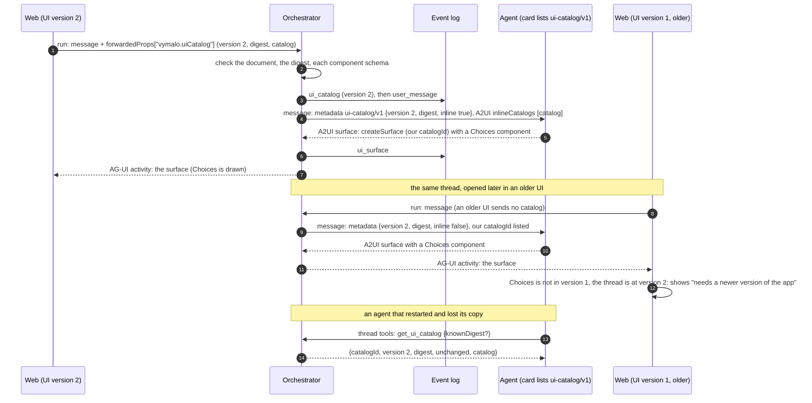
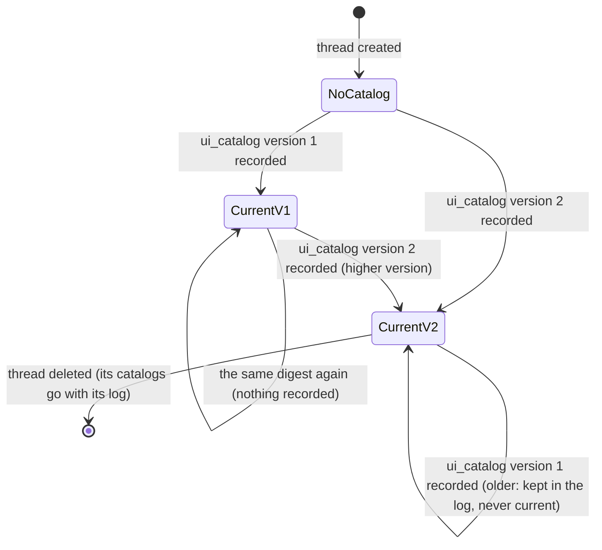

# A2A extension: UI catalog (v1)

- **URI:** `https://agents.vymalo.com/a2a/extensions/ui-catalog/v1`
- **Status:** **contract accepted (2026-10-01, on the owner's delegation); the orchestrator's side is built (MVP
  slice 3: the run member, the `ui_catalog` event and its ledger, `thread.uiCatalog`, the A2A adapter, and the refetch,
  the [thread tools](thread-tools-v1.md) with `get_ui_catalog`, section 6).** The web's catalog, Choices, Cards and
  Mermaid, and Image (versions 1 to 4) are built (the web's side of MVP slices 3 and 4); the adam-rs side (an agent that turns the
  catalog into model tools and refetches) is that repository's slice; see
  [`mvp.md`](../mvp.md#the-new-build-order). The owner may revisit anything here.
- **Decided in:** [ADR 0023](../decisions/0023-ui-component-catalog-as-an-a2a-extension.md) and its status note;
  the A2UI transport is [ADR 0013](../decisions/0013-a2ui-generative-ui.md); the optional-extension pattern is
  [ADR 0008](../decisions/0008-platform-integration-via-a2a-extension.md).
- **Defined by:** the web (the catalog). **Carried by:** the orchestrator. **Used by:** agents that speak A2UI.
- **Closes:** [open question 36](../open-questions.md).

## Purpose

Let an agent learn which components the person's screen can draw, answer and ask through them, and keep working when
the chat is opened from a newer or an older version of the UI, **using only the A2A card, A2A message metadata, A2UI's
own capabilities and one MCP tool**. The components are the web's; their parameters are all that change from one
message to the next, so the catalog goes to the agent once and is refetched when it may be stale
([ADR 0023](../decisions/0023-ui-component-catalog-as-an-a2a-extension.md)).

An agent that does not list the extension gets exactly the message it gets today: A2UI capabilities for the basic
catalog and nothing else. The rest of this page is for agents that do, and for the web and orchestrator that serve
them.

Facts about A2UI and MCP are marked *verified* (with a date and a source) or *unverified*; see
[Verified and unverified](#verified-and-unverified-2026-10-01).

## Who does what

| Part | Does |
|---|---|
| **Web** | Owns the catalog (`catalog.json`, its `version` and digest), sends it to the orchestrator at conversation start and when a newer one exists, validates every surface against it and refuses visibly what it cannot draw ([the web's rules](#8-what-the-web-does-with-a-surface)). |
| **Orchestrator** | Checks the catalog as a document (it does not interpret it), records it once per digest as a `ui_catalog` event, tells the agent about the thread's current catalog on each message, and serves the refetch (`get_ui_catalog` on [the thread tools](thread-tools-v1.md)). |
| **Agent** | Lists the extension in its card, reads the catalog, turns it into something its model can call (one tool per component, or one `show` tool whose schema is the catalog), emits A2UI surfaces that name our `catalogId`, and refetches when its copy may be stale. |

## The handshake



A thread's catalog moves only forward. Older catalogs stay in the log, and never become current:



## 1. The catalog

`catalogId` is `https://agents.vymalo.com/a2ui/catalogs/chat`. It is stable: versions are told apart by `version`
and `digest`. The canonical document is exactly an A2UI inline catalog, `{"catalogId": …, "components": {…}}`
([A2UI's `Catalog`](#verified-and-unverified-2026-10-01)), and nothing else: `functions` and `theme` are refused in
v1. Rules for the document:

- Every component schema is self-contained JSON Schema 2020-12: no `$ref`, `$dynamicRef`, `$id` or `$anchor`, and no
  `$schema`. Keys are ASCII. Numbers in the catalog document are integers (`maxLength: 120`, never `1.5`).
- Each schema validates the whole instance `{id, component, …}`: `properties.component.const` equals the component's
  key, and `additionalProperties` is `false`.
- Values are **literals**. Our components have no data bindings and no function calls.
- Every schema writes out the common members: `id` (a string of 1 to 256 characters), `component` (the constant) and
  `weight` (a number, A2UI's layout hint).

### Version 1: Text and Column

```json
{
  "Text": {
    "type": "object",
    "description": "Plain text, drawn as text (no HTML, no links).",
    "properties": {
      "id": {"type": "string", "minLength": 1, "maxLength": 256},
      "component": {"const": "Text"},
      "weight": {"type": "number"},
      "text": {"type": "string", "minLength": 1, "maxLength": 4000},
      "variant": {"enum": ["h1", "h2", "h3", "h4", "h5", "caption", "body"]}
    },
    "required": ["id", "component", "text"],
    "additionalProperties": false
  },
  "Column": {
    "type": "object",
    "description": "Stacks its children vertically.",
    "properties": {
      "id": {"type": "string", "minLength": 1, "maxLength": 256},
      "component": {"const": "Column"},
      "weight": {"type": "number"},
      "children": {"type": "array", "minItems": 1, "maxItems": 50, "items": {"type": "string", "minLength": 1, "maxLength": 256}},
      "align": {"enum": ["start", "center", "end", "stretch"]}
    },
    "required": ["id", "component", "children"],
    "additionalProperties": false
  }
}
```

### Version 2 (slice 3): version 1 plus Choices

Choices asks the person up to 8 questions at once, each with 2 to 8 options (radio buttons, or checkboxes when
`multiple`). One submit sends **one** action; its answer shape is in [Choices answers](#choices-answers).

```json
{
  "Choices": {
    "type": "object",
    "description": "ask_user only: use it in the question you ask the person, never in a surface you show with show (nothing waits for its answer, so its form is dead). Ask the person up to 8 questions at once, each with 2 to 8 options (radio buttons, checkboxes when multiple). One submit sends one action: name = action.event.name (default \"answer\"), context = {answers:[{id, values:[option value…], other?}]} in question order.",
    "properties": {
      "id": {"type": "string", "minLength": 1, "maxLength": 256},
      "component": {"const": "Choices"},
      "weight": {"type": "number"},
      "title": {"type": "string", "maxLength": 120},
      "questions": {
        "type": "array", "minItems": 1, "maxItems": 8,
        "items": {
          "type": "object",
          "properties": {
            "id": {"type": "string", "pattern": "^[A-Za-z0-9_.:-]{1,64}$"},
            "question": {"type": "string", "minLength": 1, "maxLength": 300},
            "options": {
              "type": "array", "minItems": 2, "maxItems": 8,
              "items": {
                "type": "object",
                "properties": {
                  "value": {"type": "string", "pattern": "^[A-Za-z0-9_.:-]{1,64}$"},
                  "label": {"type": "string", "minLength": 1, "maxLength": 120},
                  "description": {"type": "string", "maxLength": 300}
                },
                "required": ["value", "label"],
                "additionalProperties": false
              }
            },
            "multiple": {"type": "boolean"},
            "allowOther": {"type": "boolean"},
            "required": {"type": "boolean"}
          },
          "required": ["id", "question", "options"],
          "additionalProperties": false
        }
      },
      "submitLabel": {"type": "string", "minLength": 1, "maxLength": 40},
      "action": {
        "type": "object",
        "properties": {
          "event": {
            "type": "object",
            "properties": {"name": {"type": "string", "minLength": 1, "maxLength": 256}},
            "required": ["name"],
            "additionalProperties": false
          }
        },
        "required": ["event"],
        "additionalProperties": false
      }
    },
    "required": ["id", "component", "questions"],
    "additionalProperties": false
  }
}
```

Two rules JSON Schema cannot say are checked by the web's validator and by the agent: question ids are unique in a
Choices, and option values are unique within a question.

### Version 3 (slice 4): version 2 plus Cards and Mermaid

Two output components: nothing is sent back from either. A **card's link** is drawn as a link to a new tab and a
card never loads anything (no image, no favicon: ADR 0013 rule 5). A **Mermaid** graph is drawn by the web as an
**image** (mermaid in the browser, strict security level, no HTML labels, the SVG shown through an ``), with the
source one click away as its text alternative; a graph that does not parse says so and shows its source, and does not
refuse the surface. Both are in the [web's README](../../web/README.md#cards-and-mermaid).

```json
{
  "Cards": {
    "type": "object",
    "description": "A list (or grid) of up to 24 cards: title, optional subtitle, body text, an http(s) link and tags.",
    "properties": {
      "id": {"type": "string", "minLength": 1, "maxLength": 256},
      "component": {"const": "Cards"},
      "weight": {"type": "number"},
      "title": {"type": "string", "maxLength": 120},
      "layout": {"enum": ["list", "grid"]},
      "cards": {
        "type": "array", "minItems": 1, "maxItems": 24,
        "items": {
          "type": "object",
          "properties": {
            "title": {"type": "string", "minLength": 1, "maxLength": 200},
            "subtitle": {"type": "string", "maxLength": 200},
            "body": {"type": "string", "maxLength": 2000},
            "url": {"type": "string", "maxLength": 2048, "pattern": "^https?://"},
            "tags": {"type": "array", "maxItems": 8, "items": {"type": "string", "minLength": 1, "maxLength": 40}}
          },
          "required": ["title"],
          "additionalProperties": false
        }
      }
    },
    "required": ["id", "component", "cards"],
    "additionalProperties": false
  },
  "Mermaid": {
    "type": "object",
    "description": "A mermaid diagram, drawn as an image (no links, no scripts).",
    "properties": {
      "id": {"type": "string", "minLength": 1, "maxLength": 256},
      "component": {"const": "Mermaid"},
      "weight": {"type": "number"},
      "title": {"type": "string", "maxLength": 120},
      "code": {"type": "string", "minLength": 1, "maxLength": 20000},
      "caption": {"type": "string", "maxLength": 500}
    },
    "required": ["id", "component", "code"],
    "additionalProperties": false
  }
}
```

A card's `url` is also checked by the web as an http(s) URL before it is drawn as a link (ADR 0013's link rules): the
schema's pattern only says how a URL starts (`https://` or `http://`, in lower case), so a URL with user information, a
control character or a backslash passes the schema and is refused by the web (rule `url`). A graph's own `%%{init}%%`
directive or front matter cannot change how it is drawn: the web fixes mermaid's security level, its labels, its theme and
its look, and a directive that names one is ignored.

### Version 4 (ADR 0032): version 3 plus Image

`Image` draws **a picture from a file of this thread**, named by the file's `sha256` (the `sha256` of the
[`vymalo.artifact`](agui.md#typed-artifacts) of a file an agent shared, which the artifact store kept:
[ADR 0032](../decisions/0032-files-from-agents-live-in-an-artifact-store.md), decision 11). It is **never a URL**: the
schema has no property that could carry one, and the web fetches nothing but its own route for the thread's files
(`GET /api/threads/{threadId}/artifacts/{sha256}`, [`getArtifact`](chat-api.yaml)). `alt` is required, because the
person who cannot see the picture hears it. This replaces, for this catalog, the rule of
[ADR 0013](../decisions/0013-a2ui-generative-ui.md) that an image is a placeholder that is never fetched (the basic
catalog's `Image`, which names a URL, stays a placeholder).

```json
{
  "Image": {
    "type": "object",
    "description": "A picture from a file of this thread, by its sha256 (the artifact of a file an agent shared); never a URL. alt is required.",
    "properties": {
      "id": {"type": "string", "minLength": 1, "maxLength": 256},
      "component": {"const": "Image"},
      "weight": {"type": "number"},
      "artifact": {"type": "string", "pattern": "^[0-9a-f]{64}$"},
      "alt": {"type": "string", "minLength": 1, "maxLength": 300},
      "caption": {"type": "string", "maxLength": 500}
    },
    "required": ["id", "component", "artifact", "alt"],
    "additionalProperties": false
  }
}
```

Two rules JSON Schema cannot say, both the web's: the surface's `artifact` must be the `sha256` of a **kept file of this
thread** that has `preview: "image"`, else the whole surface is refused (rule `artifact`, never half drawn: a hash of
another thread's file, or of a file that was not kept, is the agent's mistake and is said out loud); and the picture is
drawn as an `` of the file's own `href` (never inline markup, so an SVG runs nothing and loads nothing), with
its `alt`, and its `caption` under it as text. The file's own `artifact` event comes before the surface in the log, so a thread that replays
has it by then; a surface that names a file the thread does not hold (yet) is refused until it does. The later components (List, Stepper, Agent suggestion, Skill request, then
Web view, Notification opt-in) are added by raising the version; each is its own change to this page.

When the web builds the catalog (`catalog.json`), the file and this page change together; until then this page is the
contract.

## 2. Digest, version and the lock

- `digest = "sha256:" + lowercase hex(SHA-256(UTF-8(canonical(catalog))))`. The canonical form is JSON with object
  keys sorted, no whitespace, strings escaped as `JSON.stringify` and `serde_json` do, and integers in decimal: RFC
  8785 restricted to our inputs. A catalog with a non-ASCII key or a fractional number is refused rather than
  canonicalised, so that the sort order of code points and of UTF-16 units agree. Implementations sort explicitly
  (they do not rely on the order of a map type).
- **Known-answer vector** (computed 2026-10-01 with Python `json.dumps(sort_keys=True, separators=(',', ':'),
  ensure_ascii=False)` and SHA-256):
  input
  `{"catalogId":"https://agents.vymalo.com/a2ui/catalogs/test","components":{"Note":{"type":"object","properties":{"component":{"const":"Note"},"text":{"type":"string","maxLength":10}},"required":["component","text"]}}}`,
  canonical form
  `{"catalogId":"https://agents.vymalo.com/a2ui/catalogs/test","components":{"Note":{"properties":{"component":{"const":"Note"},"text":{"maxLength":10,"type":"string"}},"required":["component","text"],"type":"object"}}}`,
  digest `sha256:a237e931c3a02fc72b214561e3a52d33eaf0e29c9306bbe0ef7b3da238507293`. Every implementation (the
  orchestrator's core, the web, adam-rs) pins it in a test.
- `version` is an integer from 1, **bumped by hand on every change** of the catalog. It orders catalogs: the newest is
  the one with the highest `version`.
- The web keeps `catalog.lock.json`, `{"version": n, "digest": "sha256:…"}`, beside `catalog.json`. A test recomputes
  the digest and fails when the catalog changed without a new lock, and when a lock has a new digest under the same
  version, so a version never names two catalogs.

## 3. From the web to the orchestrator

A run (`POST /agui/agents/{agentId}`, see [`agui.md`](agui.md#run-binding)) may carry the catalog in
`forwardedProps["vymalo.uiCatalog"]`:

```json
{"vymalo.uiCatalog": {
  "catalogId": "https://agents.vymalo.com/a2ui/catalogs/chat",
  "version": 1,
  "digest": "sha256:<64 hex>",
  "catalog": {"catalogId": "https://agents.vymalo.com/a2ui/catalogs/chat", "components": {"Text": {}, "Column": {}}}
}}
```

(`components` is shortened here; it holds the schemas of section 1.)

**When the web sends it.** On a run that creates a thread; and on any later run when the thread's
`STATE_SNAPSHOT` has no `uiCatalog`, or the web's own `version` is higher than the thread's, or the versions are equal
and the digests differ. An older UI sends nothing. The member is merged with whatever else the run carries (an
`a2uiAction`, a release, a gate).

**What the orchestrator checks, before anything is written:**

| Rule | Refusal |
|---|---|
| The member is an object of the shape above; `catalog.catalogId` equals `catalogId`; `catalogId` is an absolute https URL of at most 256 bytes; `version` is 1 to 1,000,000; `digest` matches `^sha256:[0-9a-f]{64}$` **and** equals the recomputed digest | 400, naming the rule |
| The serialised `catalog` is at most 64 KiB | 413 |
| At most 64 components; keys match `^[A-Z][A-Za-z0-9]{0,63}$`; nesting at most 32 deep; section 1's rules hold (no `$ref`, ASCII keys, integers only, no `functions` or `theme`) | 400, naming the rule |
| Each component schema compiles as JSON Schema 2020-12 (no remote resolution) and has `properties.component.const` equal to its key | 400, naming the component |

The member is read on every run, like `vymalo.gate`, and applies only when the run applies an input: a run that only
attaches to a thread ignores it.

## 4. In the log

- **The event.** `ui_catalog` (a closed-enum variant, [ADR 0004](../decisions/0004-closed-enums-over-dyn-registry.md)),
  its data exactly the object of section 3 (`catalogId`, `version`, `digest`, `catalog`, camelCase). Its actor is the
  user. It is appended **first** in its commit, before the `user_message` or `ui_action` of the run, and only when the
  digest is new to the thread.
- **The ledger.** The thread keeps, in the job ledger it already has, the current catalog (`catalogId`, `version`,
  `digest`) and the digests it has seen (the newest 32; the log keeps every event). Observing a catalog **records** it
  when its digest is not among those seen, and makes it **current** when the thread has none, or its `version` is
  higher than the current one, or the version is the same and the digest differs (the later wins; the lock makes it
  not happen). An older version never becomes current. The ledger goes with the thread's later jobs, as the gate does.
  The same rule is applied by the core and by the projection, so a replay agrees with the live run.
- **Delivery.** When an input delegates to an agent, the orchestrator decides what the agent is told: **inline** when
  the input carried a catalog that became current; a **reference** to the current catalog otherwise; **none** when the
  thread has no catalog. A redelivery of a message, and the rework prompt the verification gate sends back to the
  agent, are references. A request to the verifier agent carries none.
  Because "inline" means "this input made it current", it covers the first message of a thread and the first message
  after a digest change with no bookkeeping of what each agent has seen; a lost delivery is healed by the
  [refetch](#6-the-refetch).

## 5. To the agent: the extension

**The card** lists both the extension and the A2UI extension, the latter with `acceptsInlineCatalogs`:

```json
{"capabilities": {"extensions": [
  {"uri": "https://agents.vymalo.com/a2a/extensions/ui-catalog/v1", "required": false},
  {"uri": "https://a2ui.org/a2a-extension/a2ui/v0.9.1", "required": false,
   "params": {"supportedCatalogIds": ["<the basic catalog id>"], "acceptsInlineCatalogs": true}}
]}}
```

**Detection.** The orchestrator reads the card on **every send** (never cached; it fails closed). The extension is
spoken when its URI is listed exactly. Whether the catalog may travel inline is read from `acceptsInlineCatalogs` in
the A2UI entry the orchestrator speaks (`false` when absent, as A2UI says).

**The message**, only when the extension is listed and the thread has a catalog to deliver:

- metadata `"https://agents.vymalo.com/a2a/extensions/ui-catalog/v1": {"catalogId", "version", "digest", "inline"}`,
  on every such message, where `inline` says whether this message carries the catalog;
- the A2UI client capabilities list our `catalogId` **first** in `supportedCatalogIds`, then the basic ids, on every
  such message (not only the one that carries the catalog, so that an agent that holds to A2UI never thinks the screen
  lost it);
- `inlineCatalogs: [<the catalog>]` only when the delivery is inline **and** the agent accepts inline catalogs; if it
  does not, `inline` is `false` and the agent refetches;
- the URI is added to the `A2A-Extensions` header and to `message.extensions`, as ADR 0013 does for A2UI.

A card without the URI gets exactly today's message: basic capabilities only.

**Numbers in the metadata.** An A2A server holds the numbers of a message's metadata as doubles (they are a protobuf
`Struct`), so a catalog that arrives in `inlineCatalogs` reads `maxLength: 256.0`, and `version` reads `2.0`. An agent
that recomputes the digest of a catalog it received must write every whole number as an integer (RFC 8785 writes `256.0`
as `256`) before hashing; the digest it computes is then the one the orchestrator sent. *Verified 2026-10-01* against
the orchestrator's adapter and its fake agent in `orchestrator/crates/e2e/tests/ui_catalog.rs`.

**What the agent does with it.** Turns the catalog into model calls, emits A2UI surfaces whose `createSurface` names
our `catalogId`, and treats the thread's digest as the version of its copy: a message whose `digest` differs from its
copy means its copy is stale. The agent never invents a component the catalog lacks; the web refuses it
([section 8](#8-what-the-web-does-with-a-surface)).

### Choices answers

The person's answer comes back as an A2UI action (ADR 0013): `userAction = {name, surfaceId, sourceComponentId,
timestamp, context}` where `name` is the Choices' `action.event.name` (default `"answer"`), `sourceComponentId` is the
Choices' id, and

```json
{"context": {"answers": [
  {"id": "db", "values": ["pg"]},
  {"id": "auth", "values": [], "other": "Keycloak"}
]}}
```

in question order. `other` is at most 500 characters and only present when the question has `allowOther`. The worst
case is about 16 KiB, inside the 16 KiB of context an action may carry ([`agui.md`](agui.md#actions)). The
orchestrator's path is the existing one (`ui_action`, the same task). The chat shows an action of this shape as the
person's answer, not as a step.

## 6. The refetch

The agent can ask for the thread's current catalog at any time with the tool `get_ui_catalog` of the orchestrator's
per-thread MCP endpoint, the **thread tools**: the contract, the token that opens it and the tool's input and output
are in [`thread-tools-v1.md`](thread-tools-v1.md#get_ui_catalog). The agent is meant to expose it to its model. The
answer is the catalog of the newest version the thread recorded, so a chat that crossed UI versions gives the agent
the newest components.

## 7. In AG-UI

`ui_catalog` produces **no frame**. The projection folds it with the same ledger rule as the core. The
`STATE_SNAPSHOT` carries `snapshot.thread.uiCatalog = {catalogId, version, digest}` of the current catalog, present
only when the thread has one, so the goldens of threads without one do not change. This is how the web decides
whether to send its catalog ([section 3](#3-from-the-web-to-the-orchestrator)) and what it does with a surface from a
newer one. The capabilities document lists the extension under `custom` when the live card lists it
([`agui.md`](agui.md#capabilities-document)). The wire changes are in `agui.md` (the run member, the snapshot field,
the capabilities) and `chat-api.yaml` (the `ui_catalog` event kind and its fields).

## 8. What the web does with a surface

`prepareSurface` (the validator of ADR 0013) is given the web's own catalog and, when known, the thread's version and the
files the thread holds:

1. The surface's catalog is the first `createSurface.catalogId` (absent: the basic catalog, as today).
2. **Ours.** Every component must be a key of the web's catalog; each instance is validated against its schema, the
   uniqueness rules and the URL rule; an `Image` must name an image file of this thread, else the surface is refused with
   the rule `artifact` ([version 4](#version-4-adr-0032-version-3-plus-image)). Custom components are lowered to
   `vymalo.Choices`, `vymalo.Cards`, `vymalo.Mermaid` and `vymalo.Image` so the converter keeps them.
3. **Ours, but the component is not known here.** When the thread's version is higher than the web's, the part is
   shown as a visible placeholder, "This part of the answer needs a newer version of the app", with a reload button.
   It is refused visibly, rule 4 of ADR 0013, not dropped. Otherwise the surface is refused with the rule `catalog`.
4. **A basic catalog id.** Today's vocabulary rules hold, and our custom components are refused there.
5. **Any other `catalogId`.** Refused, rule `catalog`: "names a catalog this app does not have".
6. **A schema violation** is refused, rule `schema`; the reason names the component's id and the first error path.

The refusal shows the reason and the raw operations, as ADR 0013 already does.

## Verified and unverified (2026-10-01)

*Verified 2026-10-01*, from the raw files of `github.com/google/A2UI` (`main`,
`specification/v0_9_1/json/{client_capabilities,server_capabilities,server_to_client,client_to_server}.json`) read that
day, and from <https://a2ui.org/specification/v0.9.1-a2ui-extension-specification/>:

- Client capabilities have `supportedCatalogIds` (required, an array of strings) and `inlineCatalogs`, "should only be
  provided if the agent declares `acceptsInlineCatalogs: true`". A catalog is `{catalogId (required), components: {name:
  JSON Schema}, functions?, theme?}` with `additionalProperties: false`.
- The agent's side (server capabilities, and the card extension's `params`) is `{supportedCatalogIds?,
  acceptsInlineCatalogs?}`; `acceptsInlineCatalogs` defaults to `false`.
- `createSurface` requires `surfaceId` and `catalogId`. A client action is `{version, action: {name, surfaceId,
  sourceComponentId, timestamp, context}}`, all five fields of the action required.
- Component instances are `{"id", "component": "<Name>", …props}`, and the basic catalog's schemas fix the name with
  `properties.component.const`.
- **A discrepancy in A2UI's own files:** the JSON schema keys the capabilities by `"v0.9"` and the extension page's
  example by `"v0.9.1"`. The orchestrator sends `"v0.9.1"` (ADR 0013); adam-rs reads both keys.
- MCP: a tool may return `structuredContent` and should also return the same JSON as text, a protocol error such as an
  unknown tool is a JSON-RPC error (`-32602`), and a tool's own failure is a result with `isError: true` (MCP
  specification 2025-11-25, <https://modelcontextprotocol.io/specification/2025-11-25/server/tools>).

*Verified 2026-10-01*, for the web's Mermaid (`mermaid` 12.0.0 from the npm registry, MIT, read in the installed package and run;
see the [web's README](../../web/README.md#dependencies-and-patches)): `securityLevel` and `maxTextSize` are in mermaid's default
`secure` list, so a graph's directive or front matter cannot change them; `htmlLabels` and `theme` are not, so the web adds them
(and the CSS, the font, the look, the layout) to the list; and ten kinds of graph (flowchart, sequence, class, state, entity
relationship, Gantt, pie, mind map, timeline, git graph) are drawn in Chromium as an image.

*Unverified:* that every adam-rs agent can read an inline catalog under both capability keys (built and tested with
slice 3); the web's behaviour of the lowered custom components in the installed `@assistant-ui` packages (a test in
slice 3 settles it); the 64 KiB catalog limit against the real catalog's size (the lock test will report it).

*Not decided here:* the components after version 3, the Web view and image placement (open question 38), and the
Notification opt-in (open question 37).
