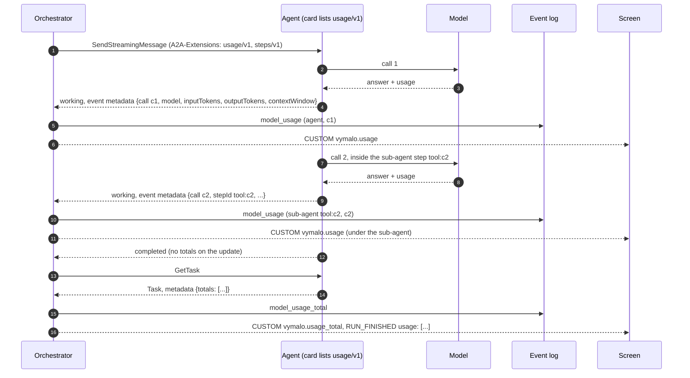

# A2A extension: usage (v1)

- **URI:** `https://agents.vymalo.com/a2a/extensions/usage/v1`
- **Status:** **built on the orchestrator's and the web's side (2026-10-09)**, proven on a fake A2A agent, the goldens, the
  web's mock server and a WireMock agent; the contract was proposed on 2026-10-08 at the owner's request ("token gauge: usage
  per model call from adam-rs to the orchestrator's log to the web, sub-agents counted apart"). That side is
  [ADR 0056](../decisions/0056-token-usage-per-model-call.md); the agent's side is adam-rs ADR 0032 (merged as adam-rs `09291a6`,
  not pinned here yet).
- **Defined by:** the orchestrator. **Used by:** adam agents (the coder, the folder agents).
- The optional-extension pattern is [ADR 0008](../decisions/0008-platform-integration-via-a2a-extension.md); the step
  ids it refers to are [steps/v1](steps-v1.md)'s.

## Purpose

An agent tells its client how many tokens each model call cost, while it works, and how many the whole task cost
when it ends, so a screen can show how full the model's context is and what a thread has spent, with what each
sub-agent spent counted apart. The counts follow AG-UI 1.0's `TokenUsage` accounting exactly, so the orchestrator
passes them on without converting them (*verified 2026-10-08* in the vendored
`orchestrator/crates/agui-proto/schema/ag-ui-1.0.schema.json`, `$defs.TokenUsage` and `RunFinishedEvent.usage`).

An agent that does not list the extension reports nothing, and the screen shows no gauge for it.

## Who does what

| Part | Does |
|---|---|
| **Agent** | Lists the extension. When a request activated it: after every completed model call, one **call report**; when the task ends, its **totals** in the task's metadata. Nothing when not activated. |
| **Orchestrator** | Activates it only when the live card lists it. Logs each valid call report once (`model_usage`), attributes it to the agent or to the sub-agent step it names, logs the task's totals when it ends (`model_usage_total`), and projects both to AG-UI. Drops an invalid report and counts it; never fails a task over one. |
| **Screen** | A ring: how full the context of the agent's **latest** call is (`inputTokens / contextWindow`), and on demand the thread's totals per model, the agent and each sub-agent apart. |

## The flow



## 1. The card

```json
{"uri": "https://agents.vymalo.com/a2a/extensions/usage/v1",
 "description": "Reports the tokens of each model call and the task's totals.",
 "required": false}
```

Listed exactly (no other version, no trailing slash, no other case). No `params`.

## 2. Activation

The orchestrator names the URI in the `A2A-Extensions` header of `SendStreamingMessage` and `SubscribeToTask`, and in
`message.extensions`, only when the live card lists it. The agent sends call reports **only** on a request that
activated it. The totals are written to the task whether or not a request activated it (they are data on the task,
read by a poll too).

## 3. The call report

After a model call completes (the provider answered, with or without usage), the agent sends a
`TaskStatusUpdateEvent` with `status.state` `working`, **no `status.message`**, and the report in the **event's**
`metadata` under the URI:

```json
"metadata": { "https://agents.vymalo.com/a2a/extensions/usage/v1": {
  "call": "c7",
  "stepId": "tool:call_2",
  "provider": "openai",
  "model": "glm-5.3",
  "inputTokens": 41250,
  "outputTokens": 812,
  "totalTokens": 42062,
  "reasoningTokens": 300,
  "cachedInputTokens": 38000,
  "contextWindow": 131072
}}
```

| Member | Required | Meaning |
|---|---|---|
| `call` | yes | An id unique within the task, at most 128 bytes. A report with a `call` already seen for the task is a repeat (a resubscribe replays recent events) and is ignored. |
| `stepId` | no | The [steps/v1](steps-v1.md) step the call ran under: a sub-agent's step. Absent: the agent's own call. A `stepId` the orchestrator does not know is the agent's own call. |
| `provider`, `model` | `model` yes | Labels, at most 128 bytes each: the provider as the agent knows it (lower case, e.g. `openai`), the model as configured. |
| `inputTokens`, `outputTokens`, `totalTokens` | yes | AG-UI `TokenUsage` accounting: totals; `totalTokens` is the sum of the other two. |
| `reasoningTokens`, `cachedInputTokens`, `cacheWriteInputTokens` | no | Parts of `outputTokens` / `inputTokens`, never additions. Absent when the provider does not say. |
| `contextWindow` | no | The model's context window in tokens, as the deployment configured it. Absent when not configured: the screen then shows totals, not how full. |

Every count is an integer from 0 to 9007199254740991: a JSON number with no fractional part, `41250.0` included (A2A
metadata is a protobuf `Struct`, so an SDK hands every number back as a double). A report with a missing required member,
a count out of range, a negative or a fractional number (`41250.5`), or `totalTokens` other than the sum is **invalid**:
dropped and counted.
Unknown members are ignored. A call the provider answered without usage is reported with zeros, so the screen knows
a call happened.

## 4. The totals

When the task reaches a terminal state (`completed`, `failed`, `canceled`, `rejected`) or an interrupted one
(`input-required`, `auth-required`), the agent sets the **task's** `metadata` under the URI. The totals are **only on the
task**: the status update that ends or pauses it carries none, and a client does not read them from the last event of a
stream. A streaming client fetches the task (`GetTask`) when it sees that status, or reads them from a `Task` snapshot (a
poll, the first frame of `SubscribeToTask`):

```json
"metadata": { "https://agents.vymalo.com/a2a/extensions/usage/v1": {
  "totals": [
    {"provider": "openai", "model": "glm-5.3", "inputTokens": 512000, "outputTokens": 9100, "totalTokens": 521100,
     "reasoningTokens": 2400, "cachedInputTokens": 470000}
  ]
}}
```

One entry per provider and model, the AG-UI `TokenUsage` shape, covering every model call the task made, its
sub-agents' included (AG-UI's rule for `RUN_FINISHED.usage`). At most 32 entries. A task resumed after
`input-required` reports the totals of all its calls so far: the orchestrator keeps the latest totals of a task, not a
sum of them.

The totals are the record; the call reports are for the live screen and for counting sub-agents apart. When a dropped
stream lost call reports, the totals still hold. The totals may also be **lower** than the sum of the call reports: an
agent leaves out what it could not keep (adam: a retried attempt, a turn a cancel ended, a child canceled before it
answered, remote sub-agents, OpenCode; adam-rs ADR 0032).

## 5. What the orchestrator does

| Input | Event logged | AG-UI |
|---|---|---|
| a valid call report | `model_usage` {job, agent, task, call, path (the step path of `stepId`, empty for the agent), the counts, `contextWindow`} | `CUSTOM` `vymalo.usage` with the same members plus `by` (who spent it: `{kind: agent, subagent or ask, name}`) and `at`, under the run (or the sub-agent's run when `path` names an open one) |
| a valid `totals` on a task that ended or paused | `model_usage_total` {job, agent, task, path (only for an ask), totals} | `CUSTOM` `vymalo.usage_total`, and `RUN_FINISHED.usage` / `RUN_ERROR.usage` of that run: the latest totals of its task; a run that resumes a task (after a question, or after a message sent while it worked ended the earlier run) says only what the task added since an earlier run said it, as AG-UI requires |
| an asked agent's (ADR 0026) reports and totals | the same, on the ask's task, with the path `["ask-<n>"]` | under the ask's sub-run (`sub-ask-<n>`), and left out of the asking run's `RUN_FINISHED.usage`: AG-UI's own rule, an agent invoked as a separate run reports its own usage |

The orchestrator's own model calls (thread titles, descriptions) are not reported here.

## Verified and unverified (2026-10-08)

- *Verified* (the vendored AG-UI 1.0 schema): `TokenUsage`'s members and accounting; `RUN_FINISHED.usage` and
  `RUN_ERROR.usage` are arrays of it, one entry per provider and model, sub-agents' calls included.
- *Verified* (`a2a-lf` 0.3.1, `event.rs`): `TaskStatusUpdateEvent` has an optional `metadata` map beside `status`, so a
  report needs no message.
- *Reported* by the adam-rs side's builder (2026-10-09, merged as `09291a6`, *unverified* here): the SDK hands metadata numbers
  back as whole doubles on JSON-RPC and REST, and adam keeps the totals on the task only, written on `completed`, `failed`,
  `canceled`, `input-required` and `auth-required`.
- *Unverified*: which OpenAI-compatible gateways send `prompt_tokens_details.cached_tokens` and
  `completion_tokens_details.reasoning_tokens`; an agent that does not get them leaves the parts out.
