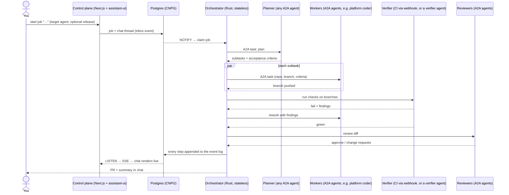
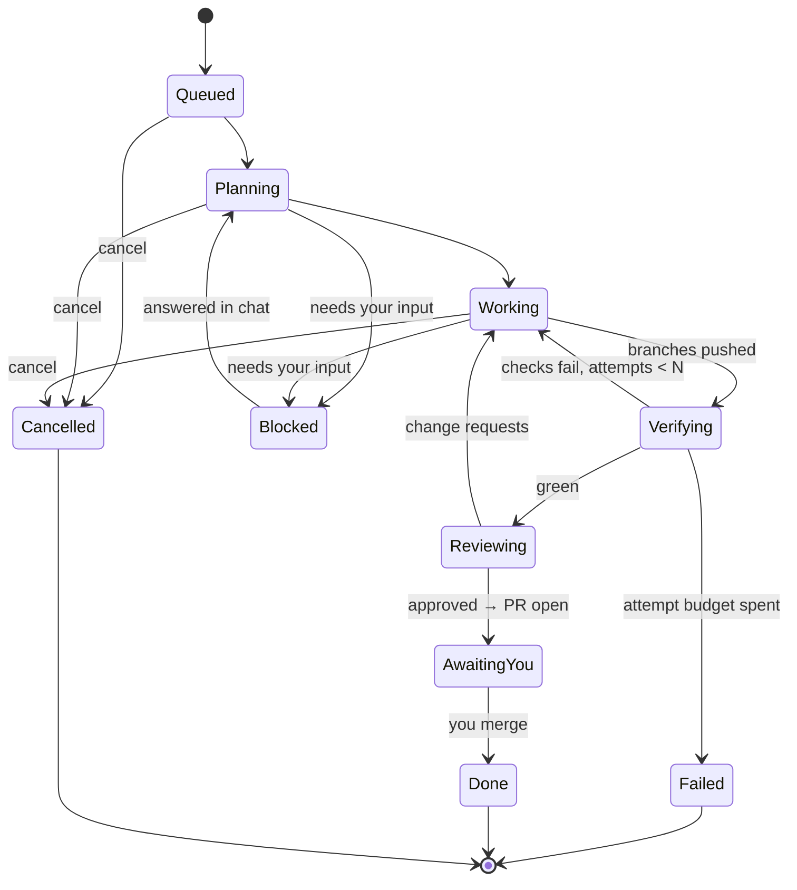

# Architecture

> Status: **design only**. Facts about third-party components are marked
> **verified** (checked against source, docs or a live system on 2026-09-28)
> or **unverified**.

## Goal

You start a job from a chat — or another system starts one over A2A, MCP or a
webhook. Agents plan it, split it, work in parallel, verify against real
checks, review, and hand back a pull request plus a summary. You read the chat
surface.

This system is the **orchestration layer**. It does not host agents: it drives
any agent that speaks A2A, uses tools over MCP, reacts to webhooks, and can
itself be driven the same way. Its processes are stateless; the only durable
state is the job ledger and event log (the chat) in Postgres.

## Principles

1. **Protocols only.** Everything this system depends on is a protocol: A2A,
   MCP, webhooks, an OpenAI-compatible model endpoint. No agent host, gateway
   product or SDK is a hard dependency.
   ([ADR 0007](decisions/0007-protocol-only-dependencies.md))
2. **Stateless processes, one event log.** Jobs outlive processes, so the job
   ledger and event log live in Postgres; nothing else does.
   ([ADR 0001](decisions/0001-rust-state-machine-on-postgres.md))
3. **Verification over consensus.** Quality comes from tests/CI, with bounded
   rework loops — not from agents agreeing.
   ([ADR 0002](decisions/0002-verification-over-consensus.md))
4. **git is the artifact.** Every step that changes code ends as a pushed
   branch; the result is a PR.
   ([ADR 0003](decisions/0003-git-as-durable-state-ephemeral-workers.md))
5. **The orchestrator never sees a protocol.** Adapters translate to one
   canonical event/command model around a pure core.
   ([orchestrator](orchestrator.md))

## Components

| Component | Role | Notes |
|---|---|---|
| **Orchestrator** (Rust, this repo) | Durable job state machine; decides what happens next | Stateless replicas over Postgres. ([ADR 0001](decisions/0001-rust-state-machine-on-postgres.md)) |
| **Postgres (CNPG)** | Job ledger, inbox/outbox, event log (= the chat), timers | Also the work queue (`SKIP LOCKED`) and live-update bus (`LISTEN/NOTIFY`). |
| **Control plane** (Next.js + assistant-ui, this repo) | Chat surface and job list | `useExternalStoreRuntime`: messages come from the event log. ([ADR 0006](decisions/0006-assistant-ui-external-store.md)) |
| **Agents** (external) | Planner, coding workers, reviewers, specialists | Anything reachable by an A2A agent-card URL. |
| **Tools** (external) | GitHub, docs, search, … | MCP servers. |
| **Model endpoint** (external) | The orchestrator's own model calls | Any OpenAI-compatible endpoint — EAIG / Agent Router, AISIX, … ([ADR 0005](decisions/0005-openai-compatible-model-endpoint.md)) |

### Agent hosts

This system does not care where an agent runs. Known hosts:

| Host | What it adds |
|---|---|
| **another-agentic-platform** (first-class) | Versioned agent services, release channels, scale-to-zero runtimes, per-run worktrees, credential broker. Its coding harness is ADK-Rust driving `opencode acp`. When a target comes from the platform, this system offers **release selection** through the platform's A2A extension. ([ADR 0008](decisions/0008-platform-integration-via-a2a-extension.md)) |
| **kagent** | Declarative agents on Kubernetes, reached over A2A. |
| **Anything else** | Any A2A server. |

Considered and **not** chosen for this layer: **eve** (TypeScript durable
agents — an agent host, not an orchestration layer), **Restate** (BSL server,
extra stateful system — see ADR 0001), **OpenHands Agent Canvas** (what we ran
first — see [lessons](lessons-from-agent-canvas.md)).

## How a job flows

## Job lifecycle

The two backward edges (checks fail → rework, change requests → rework) carry
concrete findings and are bounded by budgets (attempts, wall clock, tokens).
Exhausting a budget ends in `Failed` with the findings in the chat — never a
silent "done".

## Where it runs

- **netcup** (`kubectl --context admin@netcup`) is the natural home: CNPG runs
  there and `*.sls.servers.segning.pro` resolves to its Traefik.
- Deployed via ArgoCD from `WhyThatFunction/home-os` like everything else.
- The system's own footprint is small: stateless orchestrator replicas, the
  Next.js control plane, and a Postgres database. Agents run on their hosts.
