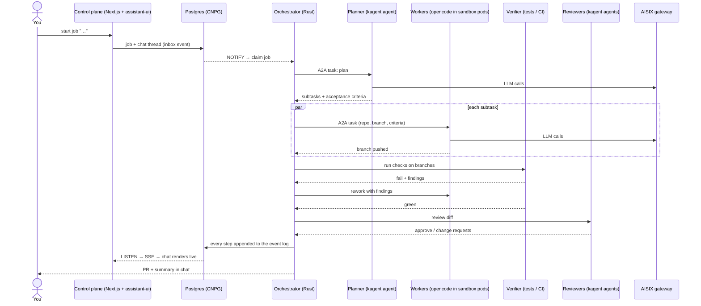
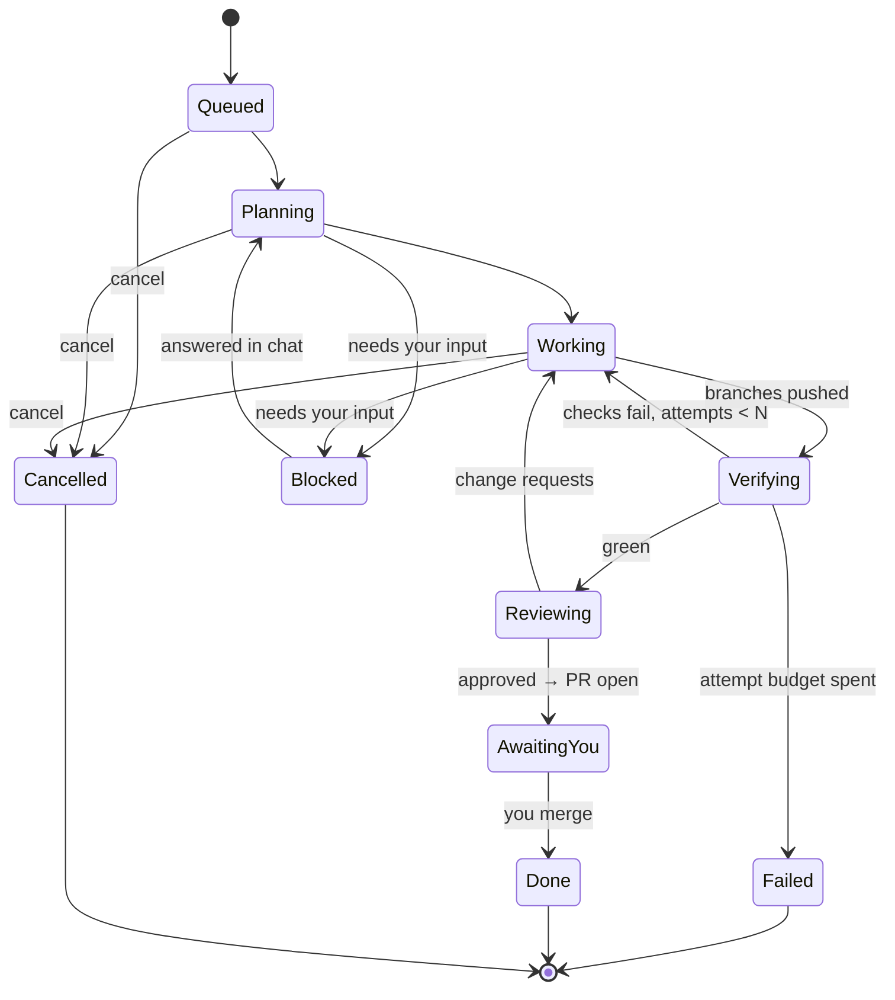

# Architecture

> Status: **design only**. Nothing here is built yet. Facts about third-party
> components are marked **verified** (checked against source, docs or a live
> system on 2026-09-28) or **unverified** (claimed by docs/search, not yet
> exercised).

## Goal

You start a job from a chat. Agents plan it, split it, work in parallel, verify
their work against real checks, review each other, and hand back a pull
request plus a summary. You read the chat surface. Agents are stateless; the
only durable state is the chat/job ledger (Postgres) and git.

## Three principles

1. **Verification over consensus.** Agents agreeing with each other converges
   on *plausible*, not *correct*, and every extra round multiplies token cost.
   Quality comes from an external judge — tests, typecheck, lints, CI — with
   bounded rework loops. Reviewers critique a diff that is already green.
2. **State is explicit, not wished away.** Coding work has state: the
   workspace. It lives in exactly three places:
   - **Postgres (CNPG)** — chats, the job ledger, the event log.
   - **git** — the artifact. Every worker pushes a branch; the result is a PR.
   - **Persistent caches** — sccache / in-cluster CI cache, npm, cargo, uv.
   Workers are ephemeral sandbox pods that clone, work, push and die. That is
   what makes "stateless agents" true rather than aspirational.
3. **The orchestrator never sees a protocol.** Everything in becomes a
   canonical event; everything out is a canonical command; a pure function sits
   in between ([orchestrator.md](orchestrator.md)).

## Components

| Component | Role | Why this one |
|---|---|---|
| **Orchestrator** (Rust, custom) | Durable job state machine; the only component that decides what happens next | Correctness (exhaustive `match` over states), crash-safety, small footprint, same stack as the rest of our Rust. See [ADR 0001](decisions/0001-rust-state-machine-on-postgres.md). |
| **Postgres (CNPG)** | Job ledger, inbox/outbox, event log (= the chat), timers | Already operated; doubles as the work queue (`SKIP LOCKED`) and the live-update bus (`LISTEN/NOTIFY`). |
| **AISIX** | LLM gateway in front of every provider | One OpenAI-compatible endpoint, provider keys in one place, routing/failover, rate and token limits, observability — which is also how agent chatter becomes a visible cost. Rust, single binary. ([api7/aisix](https://github.com/api7/aisix)) |
| **kagent** | Hosts declarative specialist agents (planner, reviewers, k8s/ops, research) | Agents as Kubernetes resources, so GitOps-managed like everything else; agents can use other agents as tools. ([kagent-dev/kagent](https://github.com/kagent-dev/kagent)) |
| **opencode** (+ AI SDK) | The coding worker — "the hands" | `opencode serve` is a headless HTTP server. Runs in an ephemeral sandbox pod built from our toolchain image. Needs an A2A wrapper (custom). |
| **A2A** | Orchestrator ↔ agents | Async tasks with streaming and push notifications — fits long jobs. Official Rust SDK exists. |
| **MCP** | Integrations (GitHub, docs, search, …) — in both directions | The orchestrator is an MCP *client* (tools) and an MCP *server* (other clients start/inspect jobs). |
| **Next.js + assistant-ui** | Chat control plane | `useExternalStoreRuntime`: the app owns messages (from the event log), assistant-ui renders them; agent events render as custom React cards. See [ADR 0006](decisions/0006-assistant-ui-external-store.md). |

Considered and **not** chosen: **eve** (TS durable agents — overlaps kagent as
an agent host; orchestrator goes Rust instead), **Restate** (Rust durable
execution — BSL-licensed server and a second stateful system to run),
**OpenHands Agent Canvas** (what we ran first — see
[lessons-from-agent-canvas.md](lessons-from-agent-canvas.md)).

## How a job flows

## Job lifecycle

The two backward edges (checks fail → rework, change requests → rework) are
what separates this from "agents sit together and agree": each carries
concrete findings, and each is bounded by a budget (attempts, tokens, wall
clock). Exhausting a budget ends in `Failed` with the findings in the chat —
never a silent "done".

## Where it runs

- **netcup** (`kubectl --context admin@netcup`) is the natural home: it already
  runs the CI runners, the in-cluster CI cache (sccache backend) and CNPG, and
  `*.sls.servers.segning.pro` resolves to its Traefik.
- Deployed via ArgoCD from `WhyThatFunction/home-os` like everything else.
- Worker sandboxes reuse the toolchain recipe from
  [vymalo/openhand-images](https://github.com/vymalo/openhand-images) (Rust,
  Flutter/Dart, Node, claude/codex CLIs under `/opt`), refactored into a
  plain workspace image without Agent Canvas.
