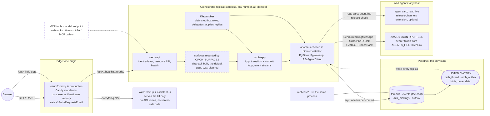
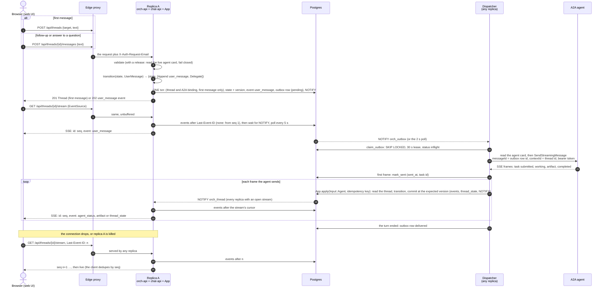
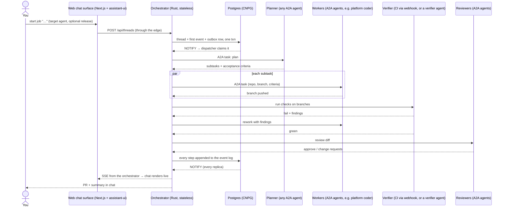
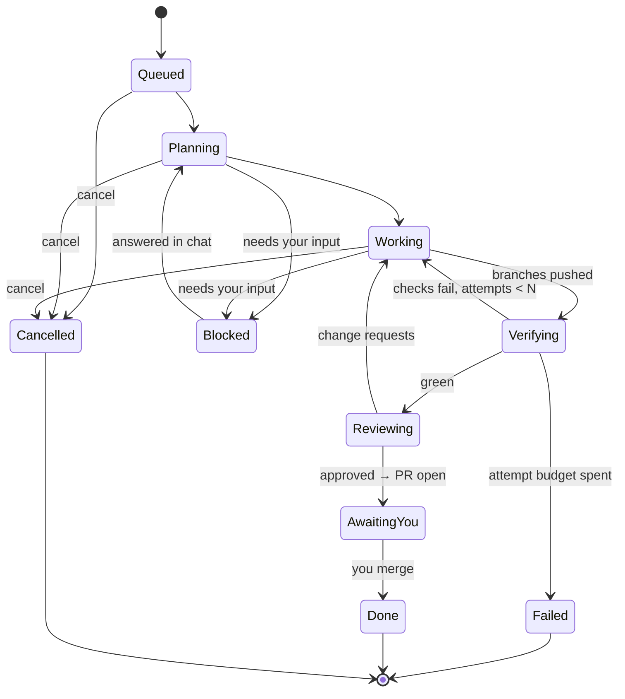

# Architecture

> Status: **MVP steps 1–2 built** (one thread, one A2A agent, durable delegation); the rest is
> design. [As built](#as-built) is what the code does today, with diagrams; the sections after
> it, [How a job flows](#how-a-job-flows) and [Job lifecycle](#job-lifecycle), are the target
> design. Facts about third-party components are marked **verified** (checked against source,
> docs or a live system on 2026-09-28) or **unverified**; statements about this repository's
> code were checked against it on 2026-09-29.

## Goal

You start a job from a chat — or another system starts one over A2A, MCP or a
webhook. Agents plan it, split it, work in parallel, verify against real
checks, review, and hand back a pull request plus a summary. You read the chat
surface.

This system is the **orchestration layer**. It does not host agents: it drives
any agent that speaks A2A, uses tools over MCP, reacts to webhooks, and can
itself be driven the same way. Its processes are stateless; the only durable
state is the job ledger and event log (the chat) in Postgres.

## Principles

1. **Protocols only.** Everything this system depends on is a protocol: A2A,
   MCP, webhooks, an OpenAI-compatible model endpoint. No agent host, gateway
   product or SDK is a hard dependency.
   ([ADR 0007](decisions/0007-protocol-only-dependencies.md))
2. **Stateless processes, one event log.** Jobs outlive processes, so the job
   ledger and event log live in Postgres; nothing else does.
   ([ADR 0001](decisions/0001-rust-state-machine-on-postgres.md))
3. **Verification over consensus.** Quality comes from tests/CI, with bounded
   rework loops — not from agents agreeing.
   ([ADR 0002](decisions/0002-verification-over-consensus.md))
4. **git is the artifact.** Every step that changes code ends as a pushed
   branch; the result is a PR.
   ([ADR 0003](decisions/0003-git-as-durable-state-ephemeral-workers.md))
5. **The orchestrator never sees a protocol.** Adapters translate to one
   canonical event/command model around a pure core.
   ([orchestrator](orchestrator.md))

## Components

| Component | Role | Notes |
|---|---|---|
| **Orchestrator** (Rust, this repo) | Durable thread state machine; decides what happens next | Stateless replicas over Postgres. ([ADR 0001](decisions/0001-rust-state-machine-on-postgres.md)) |
| **Postgres (CNPG)** | Threads, the event log (= the chat), the A2A binding, the outbox | Also the work queue (`SKIP LOCKED`) and the wake-up bus (`LISTEN/NOTIFY`). The inbox and timers are planned. |
| **Control plane** (Next.js + assistant-ui, this repo) | Chat surface and thread list | Renders the event log the orchestrator serves. Built: it follows the chat API's SSE stream ([ADR 0006](decisions/0006-assistant-ui-external-store.md)). Planned: AG-UI 1.0 ([ADR 0012](decisions/0012-ag-ui-user-facing-protocol.md), binding in [`api/agui.md`](api/agui.md)); generative UI is A2UI ([ADR 0013](decisions/0013-a2ui-generative-ui.md)). It has no server-side code: the browser talks to the orchestrator through the edge. |
| **Agents** (external) | Planner, coding workers, reviewers, specialists | Anything reachable by an A2A agent-card URL. |
| **Tools** (external) | GitHub, docs, search, … | MCP servers. Planned. |
| **Model endpoint** (external) | The orchestrator's own model calls | Any OpenAI-compatible endpoint — EAIG / Agent Router, AISIX, … ([ADR 0005](decisions/0005-openai-compatible-model-endpoint.md)). Planned: nothing calls a model yet. |

### Agent hosts

This system does not care where an agent runs. Known hosts:

| Host | What it adds |
|---|---|
| **another-agentic-platform** (first-class) | Versioned agent services, release channels, scale-to-zero runtimes, per-run worktrees, credential broker. Its coding harness is ADK-Rust driving `opencode acp`. When a target comes from the platform, this system offers **release selection** through the platform's A2A extension. ([ADR 0008](decisions/0008-platform-integration-via-a2a-extension.md)) |
| **kagent** | Declarative agents on Kubernetes, reached over A2A. |
| **Anything else** | Any A2A server. |

Considered and **not** chosen for this layer: **eve** (TypeScript durable
agents — an agent host, not an orchestration layer), **Restate** (BSL server,
extra stateful system — see ADR 0001), **OpenHands Agent Canvas** (what we ran
first — see [lessons](lessons-from-agent-canvas.md)).

## As built

What runs today (MVP steps 1–2, plus the AG-UI wire types and projection), read from the code on
2026-09-29. Solid boxes exist; dashed boxes are planned. The design that goes beyond it is
[further down](#how-a-job-flows); the crate map is in [Orchestrator: crate layout](orchestrator.md#crate-layout).

### Components

- **The web never talks to the orchestrator server to server.** It serves the UI; the browser calls
  `/api/*` on its own origin, and the edge routes that path to the orchestrator and everything else
  to the web. There are no Next.js API routes, no server-side fetches and no secrets in the web
  (`web/README.md`). SSE goes browser → edge → orchestrator, unbuffered.
- **The edge owns identity.** The orchestrator trusts `X-Auth-Request-Email` and answers 401
  without it (fail closed), so it must only run behind a proxy that strips client-supplied copies.
  Locally, `edge` is Caddy and replaces the header with `dev@example.com`
  ([`dev/README.md`](../dev/README.md)).
- **Every replica runs both halves**: the HTTP server (`orch-api` plus the mounted surfaces) and the
  dispatcher. A replica that dies loses nothing: its outbox leases lapse and another replica
  resumes the agent's task. Any replica can serve any thread's stream, because streams read the log.
- **Agents are A2A agent-card URLs from a static `AGENTS_FILE`**, read once at boot; the cards
  themselves are read live and never cached. A release selection is offered only when the live card
  advertises the release-channels extension (ADR 0008).

### A chat turn

One user message, from the browser to the agent and back, over the chat API (the only interaction
surface built). The dispatcher may run on a different replica than the one that took the request.

Prose for what the diagram compresses:

- **One transaction is the whole decision** (the `ONE txn` message). `App::apply` reads the thread, runs the pure
  `transition`, and asks the store to commit the new state, the events and the outbox rows at the
  version it read. A lost race is a `VersionConflict`; `apply` re-reads and retries up to 8 times,
  then answers 503. A replayed input carries an idempotency key and is a no-op (`Duplicate`).
- **A crash cannot lose or repeat the delegation.** The outbox row exists exactly when the message
  is in the log. If the dispatcher's replica dies, the lease (30 s by default) expires and another
  replica re-claims the row; because `sent_at` is set it resumes the agent's task
  (`SubscribeToTask`, else polling `GetTask`) instead of sending again, and the agent's own ids
  make each stored update idempotent.
- **An `input-required` turn ends the delegation, not the thread.** The thread becomes `blocked`;
  the user's answer is a new `user_message`, which re-queues it and sends a new outbox row that
  continues the *same* A2A task. A2A method names are those of A2A 1.0 (`SendStreamingMessage`;
  the 0.3 spelling is `message/stream`); recorded in `orch-agent-a2a`, *verified* against the SDK
  sources 2026-09-29 by that crate's author, not re-checked for this page.
- **The stream is the log.** `App::event_stream` replays every event with `seq >` the cursor, then
  follows; a clamped cursor, a poll under the `NOTIFY`, and a subscribe-before-read order mean no
  gap and no duplicate. When the process shuts down and the stream has caught up, it ends, so the
  client reconnects to another replica with `Last-Event-ID`. The web falls back to replaying from
  seq 1 and deduplicating when the browser gives up on its own retry.

### Thread state

The state of a thread is `orch-core`'s `ThreadState`; `transition(&state, &input)` is the only
place it changes. It is a subset of the [target job lifecycle](#job-lifecycle) below.

```mermaid
stateDiagram-v2
  [*] --> Queued: thread created with its first user message
  state Open {
    Queued --> Working: the agent reports working
    Queued --> Blocked: input or auth required; retryable delivery failure
    Working --> Blocked: input or auth required; retryable delivery failure
    Blocked --> Queued: a user message (the answer, or a follow-up)
    Blocked --> Working: the agent resumes the same task
  }
  Open --> Done: the agent completed
  Open --> Failed: the agent failed or rejected; permanent delivery failure
  Open --> Cancelled: the agent cancelled; cancelled before the agent started
  Done --> [*]
  Failed --> [*]
  Cancelled --> [*]
```

`Open` is `queued`, `working` and `blocked`; `done`, `failed` and `cancelled` absorb. Inside
`Open`, a user message in `queued` or `working` keeps the state and sends another delegation, a
cancel keeps the state and asks the agent to cancel (the outcome arrives as the agent's `canceled`),
and artifacts and agent messages keep the state. On a finished thread a user message is refused
(409, start a new thread) and a late agent update is dropped. A `thread_state` event is appended
only when a thread *enters* `blocked`, `done`, `failed` or `cancelled`. The full table, row by row,
is in [Orchestrator: thread state and transitions](orchestrator.md#thread-state-and-transitions).

### AG-UI: planned against built

The user-facing protocol is decided to be **AG-UI 1.0**, with the event log as the only source of
truth ([ADR 0012](decisions/0012-ag-ui-user-facing-protocol.md); the mapping tables, endpoints and
`vymalo.*` schemas are [`api/agui.md`](api/agui.md)). The chat turn above is what runs. The
projection is built as pure code; the HTTP surface that serves it is not.

```mermaid
flowchart LR
  subgraph INB["Inbound: RunAgentInput to a core input"]
    post["POST /agui/agents/{agentId}<br/>RunAgentInput"]:::planned
    parse["orch-agui-proto<br/>RunAgentInput::parse<br/>drops unknown members, rejects malformed"]
    tr["orch-agui-projection<br/>translate(input, ThreadView)"]
    apply["orch-app<br/>App::apply(Input)"]
    post --> parse --> tr --> apply
  end
  subgraph OUTB["Outbound: log event to AG-UI frames"]
    log[("events<br/>Postgres")]
    es["orch-app<br/>App::event_stream(user, thread, after)<br/>replay, then live"]
    pj["orch-agui-projection<br/>Projector::apply(event, Audience)<br/>resume_preamble()"]
    fr["Frame: AG-UI event + resume_id"]
    sse["orch-surface-agui<br/>SSE: data: frame, id: seq<br/>run and connect endpoints"]:::planned
    cli["AG-UI client"]
    log --> es --> pj --> fr --> sse --> cli
  end
  apply --> log
  classDef planned stroke-dasharray: 5 5,fill:none
```

| | Built | Planned |
|---|---|---|
| Wire types | `orch-agui-proto`: all 31 AG-UI 1.0 events and `RunAgentInput` as closed enums, checked against the vendored official schema | |
| Log → frames | `orch-agui-projection`: `Projector` (audiences, runs, subagents, interrupts, `resume_preamble`); a function of the log, with no async and no I/O | |
| `RunAgentInput` → input | `orch-agui-projection::translate` (new message, `resume`, cancel, attach, refusals with their HTTP status) | |
| Conformance | Schema validation of every frame; well-formedness properties; resume-from-any-point property; goldens read through `@ag-ui/client` 1.0.0 by `tools/agui-conformance` in CI | |
| HTTP routes | | `orch-surface-agui`: `POST /agui/agents/{agentId}`, `GET /agui/threads/{id}/connect`, capabilities; `agui` as an `ORCH_SURFACES` value and a `surface-agui` feature |
| Idempotent runs | | The inbox key `(agui, <threadId>:<messageId>)` of `agui.md` (there is no inbox yet) |
| The web | Follows the chat API's SSE stream | `@assistant-ui/react-ag-ui` with the connect stream ([ADR 0012](decisions/0012-ag-ui-user-facing-protocol.md#the-web)) |
| Generative UI | | A2UI ([ADR 0013](decisions/0013-a2ui-generative-ui.md)): `ui_surface` and `ui_action` events; `forwardedProps.a2uiAction` is ignored with a warning today |
| Deprecating the chat API's interaction routes | The crate is separate and mounted by flag | The `deprecated` markers in `chat-api.yaml` and the `Deprecation` header of ADR 0012 |

Until the surface exists, `ORCH_SURFACES` accepts only `chat-api`; naming `agui` is a startup error
(exit 78).

## How a job flows

**Target design** (MVP steps 3–7; steps 1–2 exist, see [As built](#as-built)). The built system
delegates a whole thread to one agent; this is the multi-agent flow it grows into.

## Job lifecycle

**Target design.** The built states are the subset `queued`, `working`, `blocked`, `done`, `failed`
and `cancelled` ([Thread state](#thread-state)); planning, verifying and reviewing arrive with MVP
steps 3–5.

The two backward edges (checks fail → rework, change requests → rework) carry
concrete findings and are bounded by budgets (attempts, wall clock, tokens).
Exhausting a budget ends in `Failed` with the findings in the chat — never a
silent "done".

## Where it runs

- **netcup** (`kubectl --context admin@netcup`) is the natural home: CNPG runs
  there and `*.sls.servers.segning.pro` resolves to its Traefik.
- Deployed via ArgoCD from `WhyThatFunction/home-os` like everything else.
- The system's own footprint is small: stateless orchestrator replicas, the
  Next.js web chat surface, and a Postgres database. Agents run on their hosts.
