# Architecture

> Status: **MVP steps 1–2 built** (one thread, one A2A agent, durable delegation, spoken to people
> over AG-UI and A2UI); the rest is design. [As built](#as-built) is what the code does today, with diagrams; the sections after
> it, [How a job flows](#how-a-job-flows) and [Job lifecycle](#job-lifecycle), are the target
> design. Facts about third-party components are marked **verified** (checked against source,
> docs or a live system on 2026-09-28) or **unverified**; statements about this repository's
> code were checked against it on 2026-09-29.

## Goal

You start a job from a chat — or another system starts one over A2A, MCP or a
webhook. Agents plan it, split it, work in parallel, verify against real
checks, review, and hand back a pull request plus a summary. You read the chat
surface.

This system is the **orchestration layer**. It does not host agents: it drives
any agent that speaks A2A, uses tools over MCP, reacts to webhooks, and can
itself be driven the same way. Its processes are stateless; the only durable
state is the job ledger and event log (the chat) in Postgres.

## Principles

1. **Protocols only.** Everything this system depends on is a protocol: A2A,
   MCP, webhooks, an OpenAI-compatible model endpoint. No agent host, gateway
   product or SDK is a hard dependency.
   ([ADR 0007](decisions/0007-protocol-only-dependencies.md))
2. **Stateless processes, one event log.** Jobs outlive processes, so the job
   ledger and event log live in Postgres; nothing else does.
   ([ADR 0001](decisions/0001-rust-state-machine-on-postgres.md))
3. **Verification over consensus.** Quality comes from tests/CI, with bounded
   rework loops — not from agents agreeing.
   ([ADR 0002](decisions/0002-verification-over-consensus.md))
4. **git is the artifact.** Every step that changes code ends as a pushed
   branch; the result is a PR.
   ([ADR 0003](decisions/0003-git-as-durable-state-ephemeral-workers.md))
5. **The orchestrator never sees a protocol.** Adapters translate to one
   canonical event/command model around a pure core.
   ([orchestrator](orchestrator.md))

## Components

| Component | Role | Notes |
|---|---|---|
| **Orchestrator** (Rust, this repo) | Durable thread state machine; decides what happens next | Stateless replicas over Postgres, run as a **control plane** (API, surfaces) and **workers** (dispatcher, inbox worker, in-process agents), or both in one process. ([ADR 0001](decisions/0001-rust-state-machine-on-postgres.md), [ADR 0015](decisions/0015-control-plane-and-workers-on-adam-rs.md)) |
| **Postgres (CNPG)** | Threads, the event log (= the chat), the A2A binding, the outbox | Also the work queue (`SKIP LOCKED`) and the wake-up bus (`LISTEN/NOTIFY`). The inbox (webhook reports and timers, an `inbox` table) and the `watches` that route a report to its thread are built ([ADR 0016](decisions/0016-inbox-timers-and-job-ledger-on-the-thread.md)); the generic webhook `POST /webhooks/ci` writes reports (MVP slice 6; the GitHub adapter is slice 9). |
| **Web chat surface** (Next.js + assistant-ui, this repo) | Chat surface and thread list | Renders the AG-UI 1.0 projection of the event log the orchestrator serves: it follows a thread's connect stream, starts runs with `POST /agui/agents/{agentId}` and answers interrupts by `resume` ([ADR 0012](decisions/0012-ag-ui-user-facing-protocol.md), binding in [`api/agui.md`](api/agui.md), `@assistant-ui/react-ag-ui` per [ADR 0006](decisions/0006-assistant-ui-external-store.md)). Generative UI is A2UI ([ADR 0013](decisions/0013-a2ui-generative-ui.md)), rendered behind the web's own validator. The agent and thread lists and Cancel use the resource API. It has no server-side code: the browser talks to the orchestrator through the edge. |
| **Agents** (external) | Planner, coding workers, reviewers, specialists | Anything reachable by an A2A agent-card URL. |
| **Tools** (external) | GitHub, docs, search, … | MCP servers. Planned. |
| **Model endpoint** (external) | The orchestrator's own model calls | Any OpenAI-compatible endpoint — EAIG / Agent Router, AISIX, … ([ADR 0005](decisions/0005-openai-compatible-model-endpoint.md)). Planned: nothing calls a model yet. |

### Agent hosts

This system does not care where an agent runs. Known hosts:

| Host | What it adds |
|---|---|
| **adam-coder** (default agent) | An A2A 1.0 agent that clones a repository, works on a branch, runs the checks, pushes and opens a pull request. It is the default because it is the first entry of `AGENTS_FILE`; the orchestrator has no code path of its own for it. Published as an image (about 2.9 GB, `linux/amd64`). ([ADR 0014](decisions/0014-adam-coder-default-agent-over-a2a.md), [The default agent](#the-default-agent)) |
| **another-agentic-platform** (first-class) | Versioned agent services, release channels, scale-to-zero runtimes, per-run worktrees, credential broker. Its coding harness is ADK-Rust driving `opencode acp`. When a target comes from the platform, this system offers **release selection** through the platform's A2A extension. ([ADR 0008](decisions/0008-platform-integration-via-a2a-extension.md)) |
| **kagent** | Declarative agents on Kubernetes, reached over A2A. |
| **Anything else** | Any A2A server. |

Considered and **not** chosen for this layer: **eve** (TypeScript durable
agents — an agent host, not an orchestration layer), **Restate** (BSL server,
extra stateful system — see ADR 0001), **OpenHands Agent Canvas** (what we ran
first — see [lessons](lessons-from-agent-canvas.md)).

## As built

What runs today (MVP steps 1–2, spoken to people over AG-UI: the run route, the connect stream, the
capabilities document and A2UI surfaces), read from the code on 2026-09-29. Solid boxes exist; dashed boxes are planned. The design that goes beyond it is
[further down](#how-a-job-flows); the crate map is in [Orchestrator: crate layout](orchestrator.md#crate-layout).

### Components

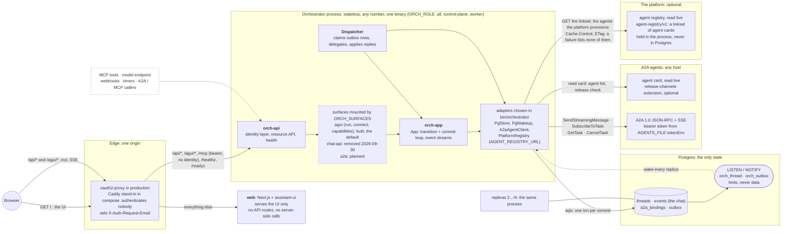

- **The web never talks to the orchestrator server to server.** It serves the UI; the browser calls
  `/api/*` and `/agui/*` on its own origin, and the edge routes those paths to the orchestrator and
  everything else to the web. There are no Next.js API routes, no server-side fetches and no secrets in the web
  (`web/README.md`). SSE goes browser → edge → orchestrator, unbuffered.
- **The edge owns identity.** The orchestrator trusts `X-Auth-Request-Email` and answers 401
  without it (fail closed), so it must only run behind a proxy that strips client-supplied copies.
  Locally, `edge` is Caddy and replaces the header with `dev@example.com`
  ([`dev/README.md`](../dev/README.md)).
- **A process runs the halves its role asks for** (`ORCH_ROLE`, ADR 0015): the HTTP server
  (`orch-api` plus the mounted surfaces) as the **control plane**, the dispatcher as a **worker**, or
  both (`all`, the default). A worker serves only `/healthz` and `/readyz`. The two halves meet only in
  Postgres, so control planes and workers scale apart. A process that dies loses nothing: its
  outbox leases lapse and another replica resumes the agent's task. Any replica can serve any thread's stream, because streams read the log.
- **Agents are A2A agent-card URLs**, from a static `AGENTS_FILE` read once at boot and, when
  `AGENT_REGISTRY_URL` is set, from the platform's agent registry
  ([ADR 0022](decisions/0022-platform-provisions-agents-system-discovers-them.md), the contract
  `agent-registry/v1` of another-agentic-platform) through the port `AgentRegistry`. The registry is
  read live: an agent the platform adds is in the picker without a restart, held in the process for as
  long as the registry's `Cache-Control` allows and never in Postgres. It fails closed: a registry
  that cannot be read lists none of its agents, the file's agents stay, and
  `GET /api/registry` says which source is down, so the UI can. A delegation to one of its agents is
  retried while the registry cannot answer and dead-lettered only when it answers without the agent.
  The cards themselves are read live and never cached, and a release selection is offered only when
  the live card advertises the release-channels extension (ADR 0008): the registry lists no
  releases. Gate layers and the verifier are for the file's agents.

### A chat turn

One user message, from the browser to the agent and back, over **AG-UI**, the default user-facing
protocol ([ADR 0012](decisions/0012-ag-ui-user-facing-protocol.md); every route, status and mapping
is in [`api/agui.md`](api/agui.md)). The browser holds one **connect stream** per open thread and
sends **runs** beside it. The dispatcher may run on a different replica than the one that took the
request, and the connect stream may be served by a third.

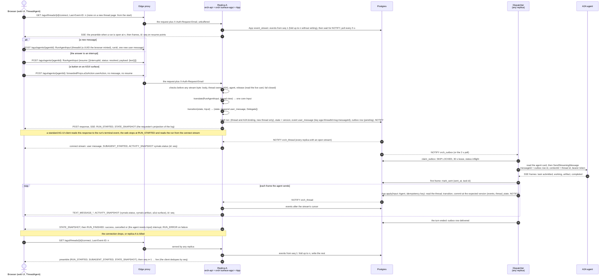

Prose for what the diagram compresses:

- **One transaction is the whole decision** (the `ONE txn` message). `App::apply` reads the thread, runs the pure
  `transition`, and asks the store to commit the new state, the events and the outbox rows at the
  version it read. A lost race is a `VersionConflict`; `apply` re-reads and retries up to 8 times,
  then answers 503. A replayed input carries an idempotency key and is a no-op (`Duplicate`); on
  the run route the key is `agui:<threadId>:msg:<messageId>` (`…:run:<runId>` for an answer with no
  message id of its own), so a retried POST attaches to the run instead of duplicating it.
- **A crash cannot lose or repeat the delegation.** The outbox row exists exactly when the message
  is in the log. If the dispatcher's replica dies, the lease (30 s by default) expires and another
  replica re-claims the row; because `sent_at` is set it resumes the agent's task
  (`SubscribeToTask`, else polling `GetTask`) instead of sending again, and the agent's own ids
  make each stored update idempotent.
- **An `input-required` turn ends the run and the delegation, not the thread.** The thread becomes
  `blocked` and the run ends `RUN_FINISHED{outcome: interrupt}`, carrying an interrupt id and the
  agent's question. The user's answer is the next run: `resume` (or, as accepted today, a plain user
  message) is a `user_message`, which re-queues the thread and sends a new outbox row that continues
  the *same* A2A task. A2A method names are those of A2A 1.0 (`SendStreamingMessage`; the 0.3
  spelling is `message/stream`); recorded in `orch-agent-a2a`, *verified* against the SDK sources
  2026-09-29 by that crate's author, not re-checked for this page.
- **A surface is an activity, an action is a run.** An agent's A2UI part becomes a `ui_surface`
  event and, on the wire, the whole surface as an `a2ui-surface` activity; a click on it comes back
  as `forwardedProps.a2uiAction`, becomes a `ui_action` event and is delivered to the same A2A task
  ([ADR 0013](decisions/0013-a2ui-generative-ui.md), [`api/agui.md`](api/agui.md#a2ui-generative-ui)).
- **The stream is the log.** `App::event_stream` replays every event with `seq >` the cursor, then
  follows; a clamped cursor, a poll under the `NOTIFY`, and a subscribe-before-read order mean no
  gap and no duplicate. The projection is a function of the log prefix, so frames are identical on
  every replica and on every replay. When the process shuts down and the stream has caught up, it
  ends without a terminal event, so the client reconnects to another replica with `Last-Event-ID`.
  The web hands frames to its runtime in whole groups (an `id:` closes one) and drops groups it has
  delivered, so a cut connection never leaves half a message.
- **Closing a stream never cancels a run.** Truncation is not cancellation (the AG-UI rule). Cancel is
  `POST /api/threads/{id}/cancel` of the resource API, and its outcome arrives as
  `RUN_FINISHED{outcome: cancelled}`.
- **There is one door.** The legacy chat API (`POST /api/threads`, `POST /api/threads/{id}/messages`,
  `GET /api/threads/{id}/events` and `…/stream`, our own `Event` JSON over SSE) drove `App` the same
  way from the orchestrator inward; it was removed on 2026-09-30. Those routes answer 404, but
  `POST /api/threads` answers 405, because its path is shared with the resource API's `GET /api/threads`.

The run as a state machine, as the projection shows it (a run is open exactly while the thread is
`queued` or `working`; the thread's own states are in the next section):

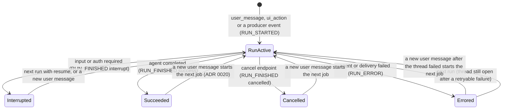

### Thread state

The state of a thread is `orch-core`'s `ThreadState`; `transition(&state, &input)` is the only
place it changes. It is a subset of the [target job lifecycle](#job-lifecycle) below.

```mermaid
stateDiagram-v2
  [*] --> Queued: thread created with its first user message
  state Open {
    Queued --> Working: the agent reports working
    Queued --> Blocked: input or auth required; retryable delivery failure
    Working --> Blocked: input or auth required; retryable delivery failure
    Blocked --> Queued: a user message (the answer, or a follow-up)
    Blocked --> Working: the agent resumes the same task
  }
  Open --> Done: the agent completed
  Open --> Failed: the agent failed or rejected; permanent delivery failure
  Open --> Cancelled: the agent cancelled; cancelled before the agent started
  Done --> Queued: a user message starts the next job
  Failed --> Queued: a user message starts the next job
  Cancelled --> Queued: a user message starts the next job
```

`Open` is `queued`, `working` and `blocked`; `done`, `failed` and `cancelled` end the **current job**, not the
thread ([ADR 0020](decisions/0020-a-thread-is-a-conversation.md)). Inside
`Open`, a user message in `queued` or `working` keeps the state and sends another delegation, a
cancel keeps the state and asks the agent to cancel (the outcome arrives as the agent's `canceled`),
and artifacts and agent messages keep the state. On a finished thread a user message starts job *n+1*
(`user_message`, `job_started`, a delegation; attempt 1 of the same gate, the agent's context kept), an A2UI action
is refused (409: its card belongs to a finished request) and a late agent update is dropped. A `thread_state`
event is appended only when a thread *enters* `blocked`, `done`, `failed` or `cancelled`. The full table, row by
row, is in [Orchestrator: thread state and transitions](orchestrator.md#thread-state-and-transitions).

#### A follow-up after the job ended

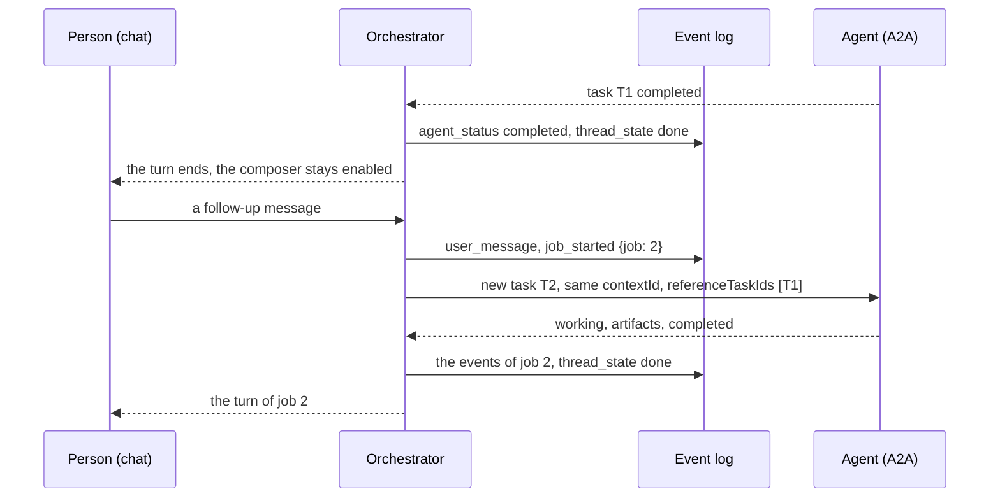

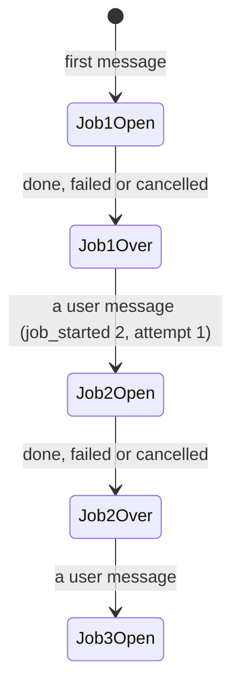

Only the current job is stored (`threads.job`, with its `number`); earlier jobs are in the log between
`job_started` events. The A2A side is a new task on the same context that names the previous one
([ADR 0021](decisions/0021-context-across-a2a-tasks.md)).

### The default agent

The default agent is the first entry of `AGENTS_FILE`, and in the dev stack that is
[adam-coder](https://github.com/vymalo/another-adam-rs) ([ADR 0014](decisions/0014-adam-coder-default-agent-over-a2a.md)).
`GET /api/agents` keeps the file's order, the chat UI preselects the first agent, and if its card
cannot be read it stays first, listed without live details, instead of giving way to the next agent.
The orchestrator reads the coder like any other agent (a card URL and a bearer token from `tokenEnv`)
and sends the chat text unchanged, so the first message has to name the repository and the base branch.

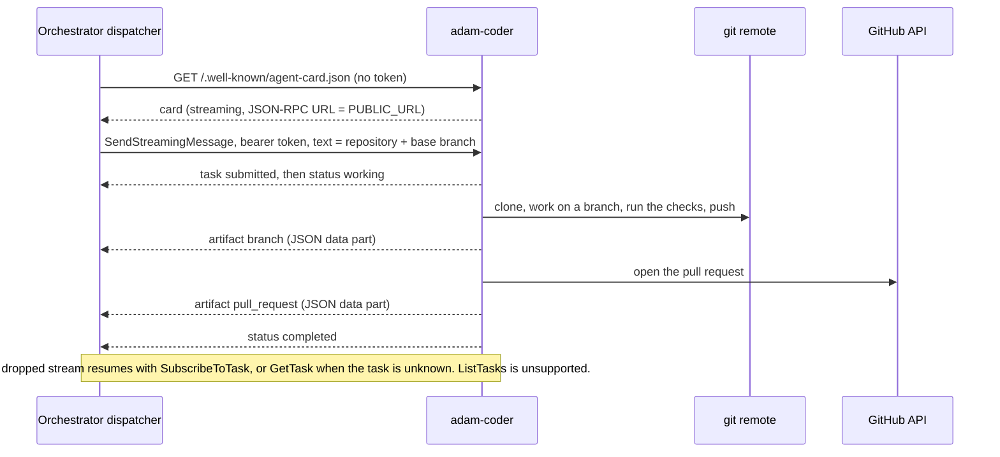

A2A task states become thread states through the pure transition function, exactly as for every
other agent; the coder adds no state of its own. `submitted` changes nothing, and `rejected` is a
failure whose detail starts with `rejected:`.

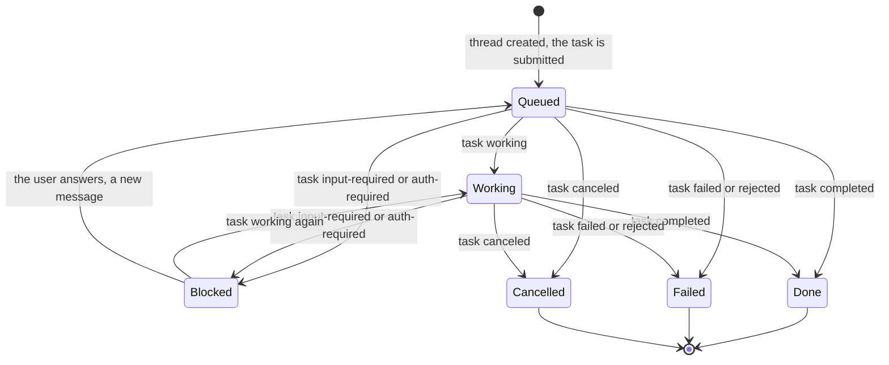

The `branch` and `pull_request` artifacts arrive as JSON data parts, so the chat shows their JSON
(`data.text` of the artifact event) and not a link until the coder also sends a URL part. The dev
stack runs the published image against scripted mocks, and [`dev/coder-e2e.sh`](../dev/coder-e2e.sh)
turns one chat message into a pull request (how: [`dev/README.md`](../dev/README.md#the-default-agent)).

**What the coder says is a folder, not code.** The coder reads its agent folder (its name, card and
instructions) once, at startup, from the directory its `ADAM_AGENT_DIR` names, and falls back to the copy
embedded in the image only when that is unset. The dev stack mounts
[`dev/coder/agent/`](../dev/coder/agent/instructions.md), vendored byte for byte from adam-rs
(`bin/adam-coder/agent/`, the commit in `dev/coder/UPSTREAM`, drift-checked like the mocks), at `/etc/adam/agent`: a change
to it, or `CODER_AGENT_DIR` pointed at a copy, needs a restart of the coder and no build
([`dev/README.md`](../dev/README.md#change-what-the-coder-says); `dev/agent-folder-e2e.sh` proves it). The orchestrator
changes nothing for this: it reads the card of the restarted coder when it delegates, like any agent's, and it sends
the chat text unchanged, so "hi" reaches the coder as "hi" and gets a greeting back, with the coder's name, what it does and
a question (the thread waits, `blocked`), instead of a request for a task
([adam-rs#55](https://github.com/vymalo/another-adam-rs/issues/55), `dev/greeting-e2e.sh`). How a live model follows
the instructions is *unverified*; the mocks prove that the folder reaches the model.

### Agents that are only a folder

The dev stack runs two more agents beside the coder, and neither has a build of its own: a **chat** and a **researcher**. Each is a folder
([`dev/agents/chat/agent/`](../dev/agents/chat/agent/instructions.md), [`dev/agents/researcher/agent/`](../dev/agents/researcher/agent/instructions.md)) served by
`adam-agent`, the second binary of the coder's image, so a service is that image with another entrypoint and the folder mounted at `/etc/adam/agent`
(read once, at startup, like the coder's). To the orchestrator they are two more entries of `AGENTS_FILE`, after the coder, which stays the default
agent: a card URL and a bearer token, no code path of their own ([ADR 0014](decisions/0014-adam-coder-default-agent-over-a2a.md)). The researcher's
`mcp.json` names an MCP server whose tool (`web_search`) it gets as `search__web_search`; in the dev stack that is the mock web search, and the
researcher's service allows plain http to it on purpose. An agent with no gate is `done` when it says so, so a chat's greeting ends the thread `done`
where the coder's (a question) leaves it `blocked`. How each is scripted, the diagrams and how to add a fourth by writing a folder:
[`dev/README.md`](../dev/README.md#several-agents). Their real behaviour with a live model is *unverified*; the mocks prove that the folder reaches the model and
that the tool call reaches the server.

### AG-UI: how it is served

The user-facing protocol is **AG-UI 1.0**, with the event log as the only source of truth
([ADR 0012](decisions/0012-ag-ui-user-facing-protocol.md); the mapping tables, endpoints and
`vymalo.*` schemas are [`api/agui.md`](api/agui.md)). Everything in
[A chat turn](#a-chat-turn) runs on it: the projection, the run route, the connect stream (replay,
cursor, following across runs) and the capabilities document are built, and the web runs on them
([`web/README.md`](../web/README.md#the-chat-layer)). The facts about the protocol itself were
*verified 2026-09-29* against the AG-UI 1.0 specification, <https://docs.ag-ui.com/spec/1.0/index.md>
(ADR 0012, section "Verified", lists each page). Two of them carry the design: the standard HTTP + SSE
binding has no stream resumption (`Last-Event-ID` is not used), so **the connect stream is our own
documented extension**, announced as `transport.resumable` and ignorable by a plain client; and a
consumer that abandons a stream has a *truncated* run, not a cancelled one, so cancel is a resource
call.

The two directions, both through the same pure crates:

```mermaid
flowchart LR
  subgraph INB["Inbound: RunAgentInput to a core input"]
    post["POST /agui/agents/{agentId}<br/>RunAgentInput"]
    parse["orch-agui-proto<br/>RunAgentInput::parse<br/>drops unknown members, rejects malformed"]
    tr["orch-agui-projection<br/>translate(input, ThreadView)"]
    apply["orch-app<br/>App::apply(Input)"]
    post --> parse --> tr --> apply
  end
  subgraph OUTB["Outbound: log event to AG-UI frames"]
    log[("events<br/>Postgres")]
    es["orch-app<br/>App::thread_feed(user, thread, after)<br/>the log (replay, then live) with live text mixed in"]
    pj["orch-agui-projection<br/>Projector::apply(event, Audience)<br/>resume_preamble()<br/>LiveOverlay (live text, ADR 0027)"]
    fr["Frame: AG-UI event + resume_id"]
    sse["orch-surface-agui<br/>SSE: data: frame, id: seq<br/>run route and connect stream"]
    cli["AG-UI client"]
    log --> es --> pj --> fr --> sse --> cli
  end
  apply --> log
  classDef planned stroke-dasharray: 5 5,fill:none
```

The log-to-frames direction, as a state machine: what one connect request does.

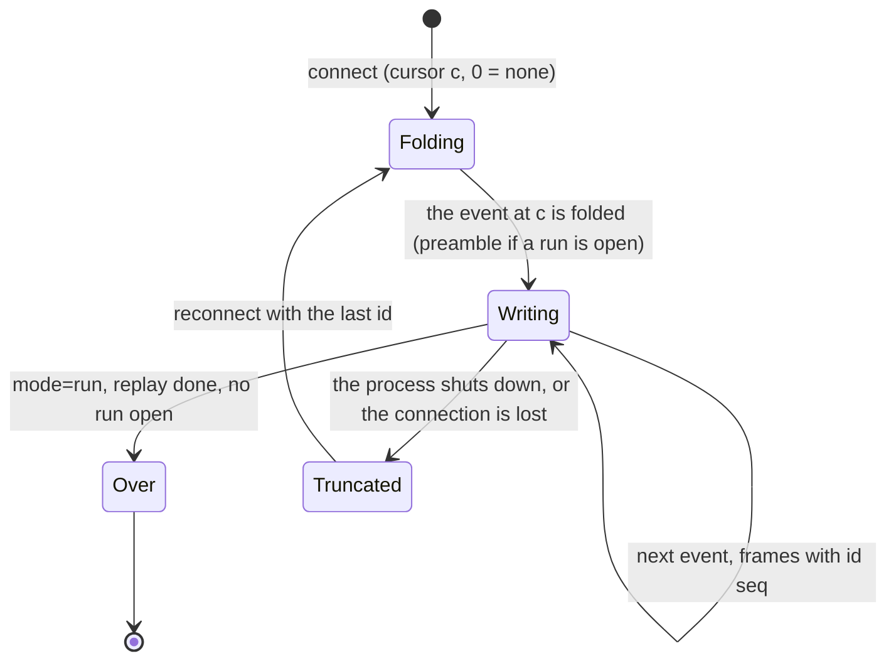

The run's own lifecycle is the state diagram under [A chat turn](#a-chat-turn); how the streams are
produced from the log, and why no replica remembers a connection, is
[Orchestrator: live updates](orchestrator.md#live-updates).

| Part | What is built |
|---|---|
| Wire types | `orch-agui-proto`: all 31 AG-UI 1.0 events and `RunAgentInput` as closed enums, checked against the vendored official schema |
| Log → frames | `orch-agui-projection`: `Projector` (audiences, runs, subagents, interrupts, `resume_preamble`); a function of the log, with no async and no I/O |
| `RunAgentInput` → input | `orch-agui-projection::translate` (new message, `resume`, cancel, attach, refusals with their HTTP status) |
| Live text | The words of a reply that is still being written ([ADR 0027](decisions/0027-live-text-relayed-not-stored.md), [`api/text-stream-v1.md`](api/text-stream-v1.md)): the dispatcher that holds the agent's stream relays each piece on the wakeup port (Postgres `NOTIFY orch_live`, every process listens, never stored), `App::thread_feed` mixes the pieces of a thread into its events, and `LiveOverlay` turns them into frames beside the projection (never resume points, merged by message id with the log's final message); the `split` profile works because every role listens ([`api/agui.md`](api/agui.md#live-text)) |
| Conformance | Schema validation of every frame; well-formedness properties; resume-from-any-point property; goldens read through `@ag-ui/client` 1.0.0 by `tools/agui-conformance` in CI |
| HTTP routes | `orch-surface-agui`: `POST /agui/agents/{agentId}` (a consumer-minted thread id, id reconciliation, `resume`, refusals as RFC 9457 problems before the stream); `GET /agui/threads/{id}/connect` (replay, `Last-Event-ID`, `?mode=run`, keepalive, follows across runs and replicas); `GET /agui/agents/{agentId}/capabilities`; `agui` as an `ORCH_SURFACES` value and a `surface-agui` feature |
| Idempotent runs | A retried POST attaches instead of duplicating: the idempotency key `agui:<threadId>:msg:<messageId>` on the event log (the inbox is for machine input only: webhook reports and timers) |
| The web | `@assistant-ui/react-ag-ui` (pinned, one patch) over a `ThreadAgent`: the connect stream with `Last-Event-ID`, runs by `POST /agui/agents/{agentId}`, interrupts by `resume`, Cancel by the resource API ([ADR 0012](decisions/0012-ag-ui-user-facing-protocol.md#the-web)) |
| Generative UI | A2UI ([ADR 0013](decisions/0013-a2ui-generative-ui.md)) on the orchestrator side: `ui_surface` and `ui_action` events, the A2A adapter's `application/a2ui+json` parts (envelope check, size caps), capability detection of both extension URIs, `a2ui-surface` snapshots of the whole surface, `forwardedProps.a2uiAction` validated and delivered to the same A2A task, the capabilities document ([`api/agui.md`](api/agui.md#a2ui-generative-ui)); in the web, the validator, the shadcn vocabulary and actions on a user gesture only ([`web/README.md`](../web/README.md#a2ui-surfaces)) |
| MCP server | `orch-surface-mcp` ([ADR 0019](decisions/0019-mcp-server-over-streamable-http.md)): `list_agents`, `start_job`, `get_job`, `answer` and `cancel_job` at `/mcp` over streamable HTTP, stateless (any replica serves any call), a machine route behind static bearer tokens that map to users; straight to `App`, not through the inbox; `mcp` as an `ORCH_SURFACES` value and a `surface-mcp` feature (default). `wait_for_job` follows a job through the event log with `notifications/progress` (one per event, a heartbeat every 60 s), returns when the job is finished or blocked or on a timeout with `resume_after_seq`, and continues on any replica with `after_seq` |
| Thread tools | `orch-surface-thread-tools` and `orch-thread-token` ([`api/thread-tools-v1.md`](api/thread-tools-v1.md), [ADR 0023](decisions/0023-ui-component-catalog-as-an-a2a-extension.md)): a second MCP endpoint, per thread, for the agents the orchestrator sends work to, at `/thread-tools/{threadId}/mcp` over streamable HTTP, stateless, a machine route behind a short-lived HS256 token scoped to one thread and one caller (minted by the A2A adapter at send time and put in the message metadata of an agent whose live card lists `thread-tools/v1`, verified by any replica, never in the log or the outbox); the built-in `get_ui_catalog` (the refetch seam) and a `ThreadToolProvider` seam for the tools of later slices; `thread-tools` as an `ORCH_SURFACES` value and a `surface-thread-tools` feature (default) |
| The legacy chat API | Removed (2026-09-30, [ADR 0012](decisions/0012-ag-ui-user-facing-protocol.md#the-legacy-interaction-endpoints-are-deprecated-by-the-flag), step 3): the crate `orch-surface-chat-api`, its feature `surface-chat-api`, the four interaction operations of `chat-api.yaml` and their goldens. The resource API stayed |

`ORCH_SURFACES` accepts `agui` and defaults to it. The removed `chat-api` fails closed: naming it is a
startup error (exit 78) that says it was removed and points to AG-UI. The resource API and health are
mounted whatever it says. A name whose Cargo feature is not compiled in is also a startup error
(exit 78).

## How a job flows

**Target design** (MVP steps 3–7; steps 1–2 exist, see [As built](#as-built); the verify and rework part
of it for one agent is [designed in more detail below](#verifying-the-rework-loop-and-attempts)). The built system
delegates a whole thread to one agent; this is the multi-agent flow it grows into.

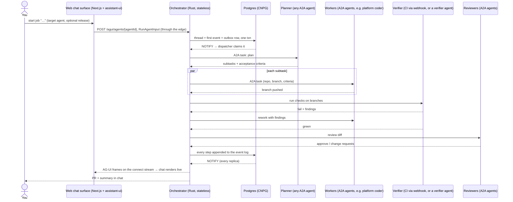

## Job lifecycle

**Target design.** The built states are the subset `queued`, `working`, `blocked`, `done`, `failed`
and `cancelled` ([Thread state](#thread-state)); planning, verifying and reviewing arrive with MVP
steps 3–5.

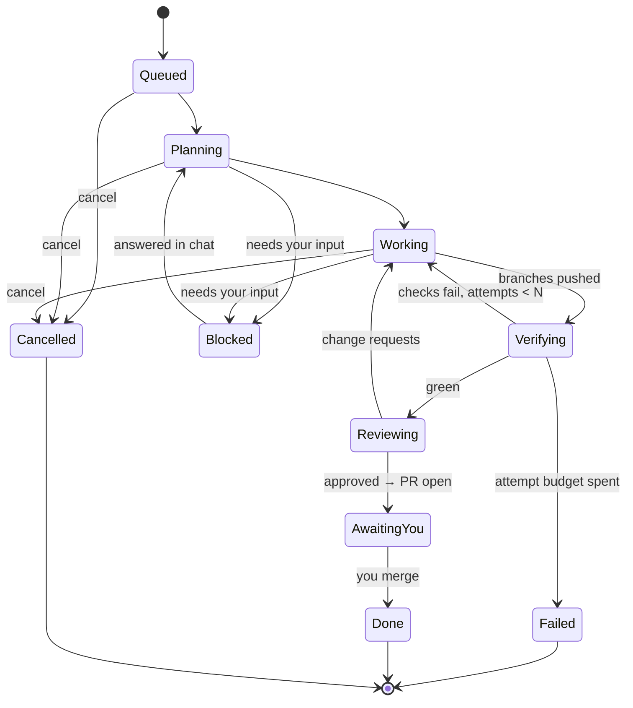

The two backward edges (checks fail → rework, change requests → rework) carry
concrete findings and are bounded by budgets (attempts, wall clock, tokens).
Exhausting a budget ends in `Failed` with the findings in the chat — never a
silent "done". A finished job is not the end of the thread: the next message starts the next job
([Thread state](#thread-state)).

### Verifying, the rework loop and attempts

**Partly built** (designed 2026-09-30; the core, the configuration and the AG-UI projection are built for
the agent's own checks, MVP slices 2 and 3, and the verifier agent is built, slice 10; CI is built, slices 6 and 9,
and the web draws the gate, slices 4 and 8).
[ADR 0018](decisions/0018-verification-gate-and-rework-loop.md) makes the `Verifying` edges above
concrete for the single-agent thread that exists today, and
[ADR 0016](decisions/0016-inbox-timers-and-job-ledger-on-the-thread.md) holds the job ledger they need
(`threads.job`). It differs from the target diagram in three ways: there is no `Reworking` state (a
rework is `Queued` or `Working` with `attempt > 1`); a timeout in `Verifying` goes to `Blocked`, not
`Failed`, and spends no attempt; and `Reviewing` is not part of it (step 5).

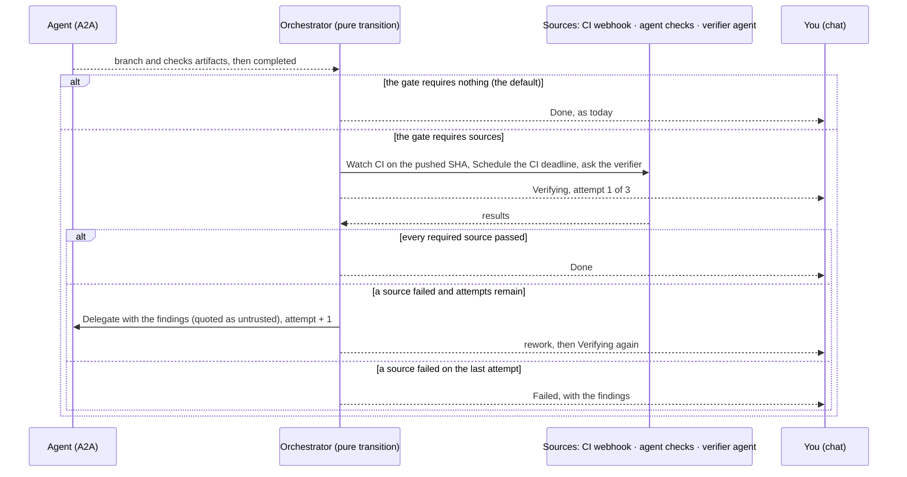

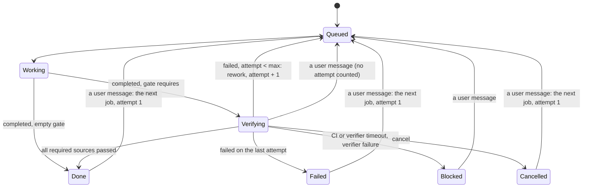

Three sources can be required, in any combination: CI on the pushed commit (a signed webhook,
[ADR 0017](decisions/0017-ci-results-by-webhook.md)), the agent's own reported checks, and a verifier
agent. The default gate is empty, which is today's behaviour. The attempts are 3 by default, raised no
higher than 10; a target or a thread may add sources, never remove one its target requires. The gate
applies to **each job** of a thread (attempts start again at 1 with a new job), while verifications are counted
per thread ([ADR 0020](decisions/0020-a-thread-is-a-conversation.md)). The chat
shows the pill **Checking the work…** while the gate runs; its checks (with the findings of a failed one), the CI reports and each rework
("Checks failed — trying again (2/3)") are steps in the **Activity** tab of the side panel, and the header has no attempt counter
([`api/agui.md`](api/agui.md) carries the `vymalo.check`, `vymalo.rework` and `vymalo.ci` activities).

## Where it runs

- **netcup** (`kubectl --context admin@netcup`) is the natural home: CNPG runs
  there and `*.sls.servers.segning.pro` resolves to its Traefik.
- Deployed via ArgoCD from `WhyThatFunction/home-os` like everything else.
- The orchestrator is one image with a role per Deployment: `control-plane` pods for users and
  `worker` pods for agent work, or `all` in one pod for development and small installs
  ([ADR 0015](decisions/0015-control-plane-and-workers-on-adam-rs.md)).
- The system's own footprint is small: stateless orchestrator replicas, the
  Next.js web chat surface, and a Postgres database. Agents run on their hosts.
