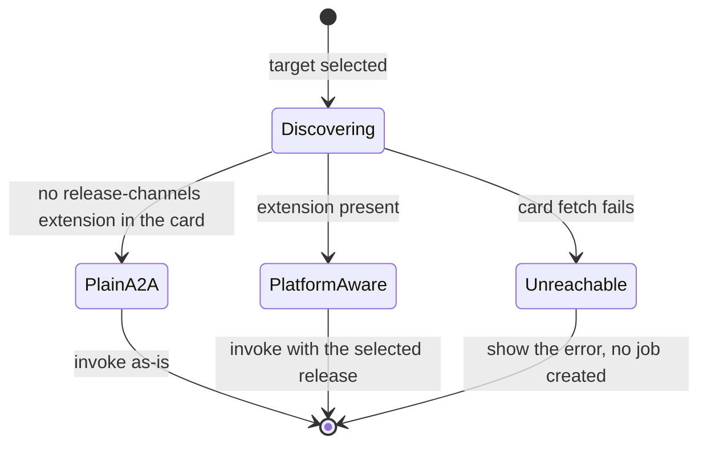

# ADR 0008 — Optional another-agentic-platform integration via an A2A extension

- **Status:** accepted (2026-09-28)

## Context

When the target agent is hosted by another-agentic-platform, users should be
able to pick a release — a channel (`production`, `staging`) or an exact
revision — for example from a dropdown, without breaking ADR 0007
(protocol-only, stateless).

## Decision

Use the platform's **release-channels A2A extension**
(`https://agents.vymalo.com/a2a/extensions/release-channels/v1`, specified in
the another-agentic-platform repository):

- **Detect:** read the target's agent card; if `capabilities.extensions`
  contains the URI, the UI offers the channel/revision picker from its
  `params`. Otherwise the agent is plain A2A and no picker is shown.
- **Invoke:** send the `A2A-Extensions` header and the selected release in the
  message metadata under the extension URI.
- **Record:** the task's echoed metadata (`requested`, `revision`) is appended
  to the job's event log, so the chat shows which revision actually ran.

## Rules

- **No platform state here.** The channel list is read live from the card each
  time a choice is presented (honouring HTTP cache headers); nothing is cached
  in this system's database.
- **Fail closed.** If the platform rejects the release (unknown or no longer
  retained), the job step fails with that error; the system never retries on
  the default channel on its own.
- **Removable.** Deleting the adapter code leaves plain A2A working unchanged.

## Consequences

The same pattern is the template for any future host-specific convenience:
capability-detected, optional, carried by a standard protocol's extension
mechanism.
