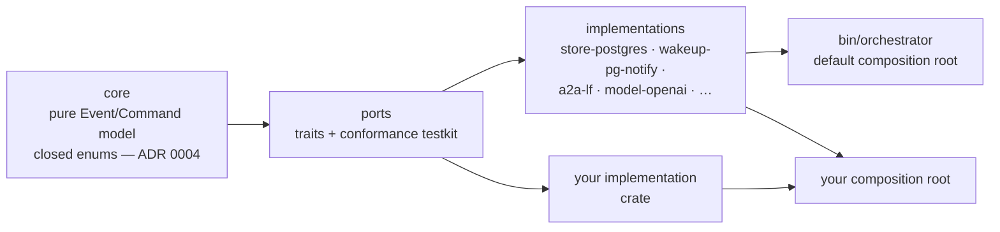

# ADR 0009 — Swappable implementations, selected at build time

- **Status:** accepted (2026-09-28). Amends ADR 0004. Status note (2026-09-29): the decision
  and its six rules hold in the code, but three details of the text are not what was built. The
  ports are named `ThreadStore` (not `JobStore`), `AgentClient` (not `A2aClient`), `Wakeup`,
  `Clock` and `IdGen`, bundled by the `Ports` trait; `McpClient`, `ModelClient`, `InboundAuth`
  and `OutboundCredentials` have no port yet. The only Cargo feature that selects an
  implementation is the interaction surface (`surface-chat-api`); the Postgres store and the A2A
  adapter are unconditional dependencies of `bin/orchestrator`, so "each is a Cargo feature
  (`store-postgres` on by default)" is not built: there is one implementation of each, and a
  second one adds the feature. The testkit covers `ThreadStore` and `Wakeup`, not yet
  `AgentClient`. See [orchestrator: crate layout](../orchestrator.md#crate-layout).
  Status note (2026-09-30): the interaction surface that selected an implementation by feature,
  `surface-chat-api`, was removed ([ADR 0012](0012-ag-ui-user-facing-protocol.md)); the only such
  feature is now `surface-agui`. The rest of the note stands.
  Amended (2026-10-02): "configuration picks one of the compiled-in implementations at startup" was environment
  variables only; [ADR 0034](0034-one-yaml-configuration-secrets-by-reference.md) makes it one YAML file read by the
  composition root, secrets by reference, with the variables over the file for one release. Configuration stays the
  composition root's input, not a port, and still selects only among compiled-in implementations (no runtime
  plugins). Built (plan 10, S9, 2026-10-02): `orch-config` and the loader of the binary.

## Context

The owner's requirement: every implementation must be good enough, and
isolated enough, that an end developer can swap it for the one they prefer —
the store, the queue, the model client, the A2A/MCP clients, the auth, the UI.

Two ways to do that in Rust:

1. **Build time** — ports are traits; implementations are crates/features;
   a composition root wires them.
2. **Runtime plugins** — implementations loaded into a running binary. Rust has
   no stable ABI for dynamic libraries, so this means out-of-process plugins
   (gRPC, WASM components): every port becomes a network or ABI contract.

The owner chose build time.

## Decision

**Every infrastructure boundary is a trait (a *port*); every implementation is
a separate crate behind it; binaries are only compositions.**

| Port | Default implementation | Examples of alternatives |
|---|---|---|
| `JobStore` (jobs, inbox, outbox, events, timers) | Postgres (`sqlx`) | SQLite for single-node/dev, in-memory for tests |
| `Wakeup` (claim notifications, live-update bus) | Postgres `LISTEN/NOTIFY` | polling, NATS |
| `A2aClient`, A2A server adapter | `a2a-lf` | another A2A SDK |
| `McpClient`, MCP server adapter | the chosen MCP SDK | another MCP SDK |
| `ModelClient` | OpenAI-compatible HTTP (ADR 0005) | a provider SDK |
| `InboundAuth` (verify callers), `OutboundCredentials` | OIDC / HMAC / bearer from external-secrets | mTLS, SPIFFE |
| `Clock`, `IdGen` | system clock, UUIDv7 | deterministic fakes for replay tests |

How swapping works:

- **Among built-in implementations:** each is a Cargo feature of the default
  binary (`store-postgres` on by default); configuration picks one of the
  compiled-in implementations at startup.
- **With your own implementation:** depend on the crates, implement the
  trait, and write your own composition root — a small `main.rs` that wires
  your implementation into the same `App`. No fork, no patching.
- **The UI too:** the chat surface talks to the orchestrator only through its
  documented HTTP + SSE API (OpenAPI), so assistant-ui is the default UI, not
  a requirement.

## Rules

1. **Ports live in their own crate** and depend on `core`, never the reverse:
   `core` stays pure (no async, no I/O).
2. **Static dispatch.** Application code is generic over one bundle trait
   (e.g. `trait Ports { type Store: JobStore; type Wakeup: Wakeup; … }`)
   instead of a generic parameter per port, so signatures stay readable.
3. **Every port ships a conformance testkit** (`ports::testkit`). Every
   implementation — built-in or third-party — runs it. Swapping is only real if
   "does my implementation behave correctly" is a test, not a reading exercise.
4. **Port errors are typed** (`thiserror` enums at the port's abstraction
   level), so the core can decide retry vs fail without knowing the
   implementation.
5. **No implementation detail leaks through a port** — no `sqlx` types, no
   HTTP client types, no SDK types in trait signatures.
6. **Capabilities are declared, not assumed.** If a port has optional
   behaviour (e.g. native push wake-ups vs polling), the implementation
   advertises it and the application degrades explicitly.

## Relationship to ADR 0004

ADR 0004 stands for the **semantic model**: the set of `Event` and `Command`
variants is closed and compiled in, so the core's `match` stays exhaustive.
What is now open is **who implements each port** behind those commands.

## Alternatives rejected

- **Runtime plugins (dylib, WASM components, out-of-process gRPC).** Needed
  only if third parties must ship implementations without compiling. Costs a
  versioned ABI or wire contract per port. Revisit if that need appears.
- **`dyn` everywhere.** Allowed at the composition root where heterogeneity is
  genuinely needed; not as the default dispatch.

## Consequences

- A little more structure up front: a `ports` crate and a testkit per port.
- MVP step 1 ships the default implementations only; the seams exist from the
  first commit, so a later alternative is additive.
