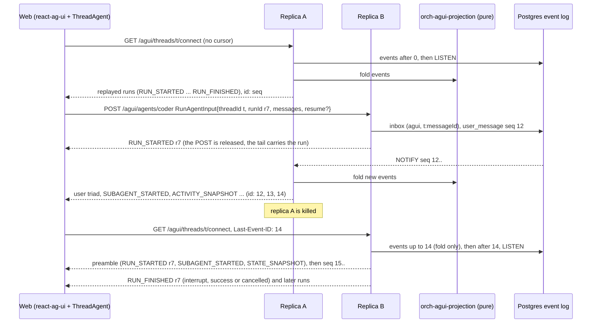
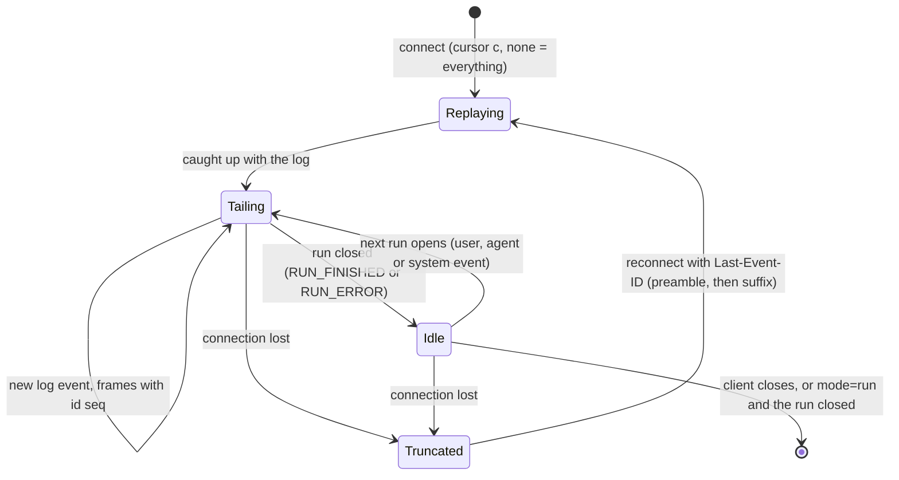
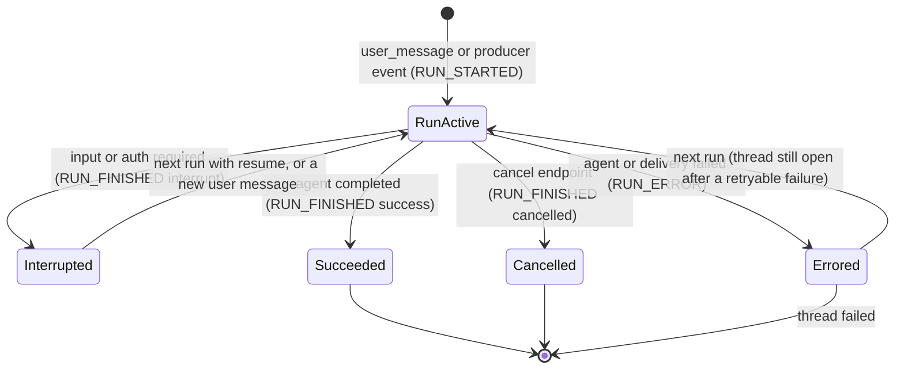

# ADR 0012 — AG-UI as the user-facing protocol

- **Status:** accepted (2026-09-29). Status note (2026-09-29): the run route is built. The "inbox
  key" `(agui, <threadId>:<messageId>)` of this ADR is realised, while there is no inbox table, as the
  event's per-thread idempotency key `agui:<threadId>:msg:<messageId>` (`…:run:<runId>` for an answer with
  no message id of its own); the decision stands. Details: [`api/agui.md`](../api/agui.md#run-binding).
  Status note (2026-09-29): the connect stream and the capabilities document are built. The stream is
  the viewer projection of the log folded from the first event on every connect, written from the
  cursor (no state in the process, so any replica serves any viewer); `?mode=run` closes at the first
  point where the replay is done and no run is open; a killed replica is covered by an end-to-end
  test that reconnects to another one with `Last-Event-ID`. The document declares `multiAgent.subagents`
  as a list, as the 1.0 schema types it (the flag of the plan was wrong). Details:
  [`api/agui.md`](../api/agui.md#connect-binding).
  Status note (2026-09-29): the contract carries the AG-UI operations and the deprecation. `chat-api.yaml`
  gains `runAgent`, `connectThread` and `getAgentCapabilities`, whose bodies reference the vendored
  schema by file, and marks the four legacy operations `deprecated: true`; the `chat-api` surface answers
  them with `Deprecation: @1790640000` (RFC 9745; the day of this note), on those operations only. No
  `Sunset` (removal follows the web, not a date) and no `Link` (optional in the RFC, and the successor is
  a URI template). The decision stands. Details: [`api/agui.md`](../api/agui.md#the-contract).
  Status note (2026-09-29): the web runs on AG-UI. `@assistant-ui/react-ag-ui` 0.0.62 and
  `@assistant-ui/react-generative-ui` 0.0.21 are pinned exactly, `@ag-ui/client` is overridden to
  1.0.0 (spike S5: the runtime works on it), and the REST interaction path is gone from the web. The
  decision stands; how the section "The web" was carried out differs in four places, each for a
  reason found while building it. (1) `abortRun()` is a truncation, not the cancel endpoint: the
  runtime calls it on unmount and on thread switches, so navigating away would have cancelled the
  run; Cancel is a separate call (`ThreadAgent.cancel()`), the outcome still arrives as
  `RUN_FINISHED{cancelled}`. (2) There is no history adapter: reload replays the connect stream
  through the runtime's own run path, and runs the client did not start are applied through the
  runtime's public API (`thread.startRun`, `steerAway`), so patches 1 (activities dropped on
  reload) and 2 (live subscription) are not needed, and only the `cancelled` outcome is patched;
  the three gaps are drafted as upstream issues anyway. (3) The connect stream is handed over in
  whole groups (an `id:` closes one), so a cut connection cannot leave half a message in the
  runtime. (4) The browser mints thread ids as UUIDv7, because the resource API lists threads by
  id. Details: [`web/README.md`](../../web/README.md#the-chat-layer),
  [`web/patches/UPSTREAM.md`](../../web/patches/UPSTREAM.md).
  Status note (2026-09-29): the legacy chat API surface is off by default. `ORCH_SURFACES` defaults to
  `agui`; the resource API and health are still mounted whatever it says, so the web's thread list
  and Cancel keep working. An operator who still has clients of `createThread`, `postMessage`,
  `listEvents` or `streamEvents` sets `ORCH_SURFACES=agui,chat-api`; without it those routes answer
  404 (`POST /api/threads` answers 405: its path is the thread list's). Compose sets nothing and runs
  on the default, and the dev scripts (`dev/coder-e2e.sh`, `dev/split-e2e.sh`, `dev/try-thread.sh`)
  drive the orchestrator over AG-UI. This is step 2 of "The legacy interaction endpoints are
  deprecated by the flag"; step 3 (removal) is not done. The decision stands. A breaking change for
  operators: `feat(orchestrator)!`.

## Context

The owner: "I prefer we use standards. Because the industry might use it in the future."

Today the chat surface talks to the orchestrator through our own contract
([`chat-api.yaml`](../api/chat-api.yaml)): REST for agents and threads, `POST …/messages` and
`POST …/cancel`, and an SSE stream of our `Event` JSON that replays from the Postgres event log
with `Last-Event-ID`. It works, but it is bespoke: no other client speaks it, and nothing built on
it is reusable elsewhere.

[AG-UI](https://docs.ag-ui.com/) is the agent-to-user leg of the MCP / A2A / AG-UI family. In its
own words, "MCP connects agents to tools and context; A2A connects agents to other agents; AG-UI
connects agents to users". That is our topology: A2A downstream to agents, MCP to tools, people
upstream. AG-UI 1.0 has a normative specification and an authoritative JSON Schema. Its model is
one `RunAgentInput` in, then an ordered stream of typed events out: runs with outcomes (success,
interrupt, cancelled), interrupts answered by `resume` entries, activity messages for structured
progress, subagent attribution, and `CUSTOM`/`RAW` escape hatches.

Three things do not fit one to one, and the decision has to handle them:

1. **Reconnect, attach and multi-viewer are not standardised.** The SSE binding says "The binding
   has no stream resumption: SSE's `Last-Event-ID` mechanism is not used". `transport.resumable`
   is a capability flag an agent may declare "for a transport of its own". Our design depends on
   one durable log per thread, replayable across restarts and replicas (ADR 0001).
2. **AG-UI has no resource operations.** It has no thread list, no agent list and no
   consumer-side cancel: a consumer that abandons a stream has a *truncated* run, not a cancelled
   one.
3. **AG-UI assumes the client holds the transcript.** Our threads are server-owned, multi-actor
   logs that also receive events nobody requested (CI, reviewers, timers).

[ADR 0011](0011-web-shadcn-tailwind-feature-layout.md) (web v2 layout: shadcn/ui, kebab-case
feature folders) is the web this migration starts from. Number 0010 is unused: the OpenUI
proposal it was reserved for was withdrawn in favour of A2UI ([ADR 0013](0013-a2ui-generative-ui.md)).

## Decision

**AG-UI 1.0 is the default user-facing protocol and covers all chat interaction. The event log
stays the only source of truth, and AG-UI is a pure projection of it. A small REST resource API
stays for what AG-UI does not define.**

### What AG-UI covers, and what stays REST

| Concern | Protocol |
|---|---|
| Start a thread, send a message, answer an interrupt, run, stream progress and outcomes | AG-UI run endpoint `POST /agui/agents/{agentId}` (standard HTTP + SSE binding) |
| Attach to a thread, replay it, follow it across runs, resume after a drop | AG-UI connect stream `GET /agui/threads/{threadId}/connect` (our documented extension) |
| Agent capabilities | `GET /agui/agents/{agentId}/capabilities` (standard `AgentCapabilities` shape; retrieval is implementation-defined) |
| Agent list, thread list and thread details, cancel, health | REST resource API (`/api/agents`, `/api/threads`, `/api/threads/{id}`, `/api/threads/{id}/cancel`, `/healthz`, `/readyz`) |

The binding, every mapping table and the `vymalo.*` content schemas are in
[`docs/api/agui.md`](../api/agui.md).

### The projection

- **Wire types are ours, as closed enums.** A new crate, `orch-agui-proto`, models the AG-UI 1.0
  events we emit and `RunAgentInput` as closed serde enums (ADR 0004). It has no SDK dependency:
  the Rust community SDKs model 0.x or are single-author alphas. It is checked against the
  **vendored official schema** (pinned by sha256) in tests, never on the receive path. Unknown
  inbound members are stripped with a warning, as the processing model requires.
- **The projection is pure.** A new crate, `orch-agui-projection`, folds the core `Event` log into
  AG-UI events and translates `RunAgentInput` into core inputs. It depends on `orch-core` and
  `orch-agui-proto` only: no async, no I/O.
  - `thread_state`, `agent_status`, `artifact` and `error` become run outcomes
    (`blocked` → interrupt, `done` → success, `cancelled` → cancelled, `failed` → `RUN_ERROR`),
    **activity messages** (`vymalo.status`, `vymalo.artifact`, `vymalo.error`, which survive
    history snapshots, unlike `CUSTOM`) and `STATE_SNAPSHOT.thread` for the header.
  - Each A2A delegation becomes a subagent invocation (`SUBAGENT_*`, `subagentRunId`).
  - The author and the revision that ran travel in `metadata["vymalo.actor"]`.
  - Generative UI (A2UI, [ADR 0013](0013-a2ui-generative-ui.md)) travels as the ecosystem's
    `a2ui-surface` activity.
- **Every AG-UI id is derived from the log** (run, message, activity, subagent, interrupt), so
  every replica and every replay emits identical frames. Nothing about AG-UI is persisted beyond
  two additive, optional fields on `user_message`: `messageId` and `runId`.

### The run endpoint (standard)

`POST /agui/agents/{agentId}` takes a `RunAgentInput` and streams the requested run as HTTP + SSE,
exactly as the binding says.

- **Consumer-minted thread ids are accepted.** The protocol has the application mint `threadId`.
  It must be a UUID (400 otherwise). An unknown id creates a thread owned by the edge identity. An
  id that belongs to another owner, including a collision, gets **404 before the stream**, so
  existence never leaks.
- Messages are reconciled by id against the log; only new user messages become inputs. `resume`
  answers the interrupt. The release (ADR 0008) travels in `forwardedProps` under the
  release-channels extension URI, validated live against the card, failing closed.
- Pre-stream rejections stay RFC 9457 problems; in-stream failures are `RUN_ERROR{message, code}`.
- **A run is never tied to its HTTP connection.** Closing the stream does not cancel; only the
  cancel endpoint does. That is the spec's own rule: truncation is not cancellation.

### The connect stream (our extension)

`GET /agui/threads/{threadId}/connect` is a custom transport, which the spec allows as long as it
keeps the event model, the patterns and the processing rules.

- It **replays the event log** as a sequence of runs, then **keeps streaming across runs**
  (keepalive comments every 15 s), including runs the orchestrator starts itself.
- Frames carry `id: <seq>` at resumable points. **`Last-Event-ID` resumes**: the server rebuilds
  the projector state up to that seq, re-opens the open run and invocations (a *preamble*, because
  every AG-UI stream must begin with `RUN_STARTED` or `RUN_ERROR`), then sends the suffix. It
  works across replicas and restarts, because it reads the log (`App::event_stream`), not memory.
- `?mode=run` closes after the active run, or right after the replay when idle, like the
  `connect` of CopilotKit's runtime.
- It is announced as `AgentCapabilities.transport.resumable: true`. A standard client that does
  not know it loses nothing but reconnect: the run endpoint alone is a conforming AG-UI server
  (the ADR 0008 pattern: optional, removable).

A run, as the projection shows it:

### Several surfaces, mounted by configuration

Each inbound surface is an **adapter crate behind a Cargo feature**, and which compiled-in
surfaces are mounted is **runtime configuration**. This is ADR 0009 exactly: build-time features
plus configuration, no plugins.

| Surface | Crate | Cargo feature of `bin/orchestrator` |
|---|---|---|
| AG-UI (run, connect, capabilities) | `orch-surface-agui` | `surface-agui` (default) |
| Legacy chat API interaction routes (`createThread`, `postMessage`, `listEvents`, `streamEvents`) | `orch-surface-chat-api` | `surface-chat-api` |
| A2A inbound (later) | `orch-surface-a2a` | `surface-a2a` |

- The binary's configuration moves to **clap with environment fallback**; every existing variable
  keeps its name. `--surfaces` / `ORCH_SURFACES` is a comma-separated list, for example
  `ORCH_SURFACES=agui,chat-api`. The **default is `agui`** once the web runs on AG-UI; until then
  it was `agui,chat-api`, so nothing broke mid-migration (it is `agui` since the status note of
  2026-09-29 above). The resource API and health are always
  mounted (they stay in `orch-api` with the auth layer and the problem mapping).
- **Fail closed:** an unknown name, an empty list, or a surface whose feature was not compiled in
  stops startup with an error naming the surface and the feature.
- Surfaces depend only on `App` and `orch-core`. No `Surface` trait is added: there is one caller
  and no infrastructure behind it.

### The legacy interaction endpoints are deprecated by the flag

The four REST interaction operations are deprecated **by configuration, not by a date**:

1. **Until the web migrates:** mounted by default (`agui,chat-api`), and the compose stack sets it
   explicitly. The operations are marked `deprecated: true` in the contract and answer with a
   `Deprecation` header (RFC 9745; built, see the status note above).
2. **When the web runs on AG-UI:** not mounted by default (done, see the status note above). An
   operator who still needs them sets `ORCH_SURFACES=agui,chat-api`.
3. **Later:** the crate, the feature and the operations are removed in their own PR.

### The web

The web uses **`@assistant-ui/react-ag-ui`**, pinned exactly and patched where needed, with every
fix proposed upstream.

- A `ThreadAgent` (an `AbstractAgent` subclass) owns one connect stream per open thread. `run()`
  POSTs and then yields that run's frames from the connect stream (deduplicated by seq) until its
  terminal event. `abortRun()` calls the cancel endpoint and keeps reading until
  `RUN_FINISHED{outcome:{type:"cancelled"}}`. *(Built differently: see the status note above.)*
- **Patches** live in `web/patches/` through pnpm `patchedDependencies`; a dependency change goes
  through pnpm `overrides`, never a patched `package.json`. Each patch names its upstream issue or
  pull request and is deleted when a pinned release contains the fix. The known gaps:
  1. **Activities are dropped on reload** when no assistant message precedes them (our first
     status line). The patch keeps an owner-less activity as its own message. *(Not needed: see the
     status note above.)*
  2. **No live subscription:** the runtime applies only events of a run it started. The patch lets
     it apply runs it did not start (another tab, a producer-initiated run, a run in flight at
     reload), fed by our connect stream. *(Done outside the package, see the status note above.)*
  3. **Pre-1.0 client:** it depends on `@ag-ui/client` `^0.0.59`. We override it to 1.0.0 when a
     spike shows the runtime works on 1.0 (patching the few renamed events and adding the
     `cancelled` outcome); otherwise the runtime keeps 0.0.59 while our goldens are checked with
     the 1.0 reference consumer. Upstream: a bump to `@ag-ui/client@^1`.
- ADR 0006 is amended: `useExternalStoreRuntime` gives way to the AG-UI runtime; Next.js,
  assistant-ui and the `data-*` renderers stay.

## Rules

- **The log is authoritative.** An AG-UI frame is a function of the log prefix and the audience
  (the requesting POST, or a connect viewer), nothing else.
- **Conformance is a test, not a claim.** Every emitted event validates against the vendored 1.0
  schema. Every golden passes the reference consumer's `enforceEvents` and `verifyEvents` with no
  warning. A property test proves that reconnecting from any resume point yields exactly the
  remaining suffix.
- **Extensions are namespaced and optional.** `vymalo.*` activity types and metadata keys, the
  connect route and `transport.resumable` are ignorable by a plain AG-UI client. We never put
  standard semantics into `CUSTOM`.
- **Authentication stays at the edge.** `X-Auth-Request-Email`, fail closed, with the ownership
  check before any stream byte (404). Identity never comes from `forwardedProps`, `state` or
  message fields.
- **Protocol version.** We declare `protocolVersion: "1.0"` on `RUN_STARTED`, serve any 1.x input
  with a warning, and reject another major before the stream (400).

## Alternatives rejected

- **Keep our own chat API only.** No migration risk, but no client, SDK or UI kit outside this
  repository speaks it, which contradicts the owner's stated preference.
- **AG-UI only for external clients, the web kept on our API.** Two interaction contracts and two
  sets of goldens that drift, and our own UI would not use the standard. It remains an
  intermediate milestone (server first, web second), not the end state.
- **Full replacement, including the resource API.** AG-UI defines no thread list, agent list or
  consumer cancel, so we would invent them anyway as non-standard AG-UI routes.
- **Waiting for upstream resumption.** Without the connect extension there is no reconnect, no
  multi-viewer and no server-initiated update over AG-UI.
- **The external store fed by `@ag-ui/client` 1.0** (the plan's first recommendation). It keeps
  ADR 0006 intact but has us own the AG-UI → message conversion, interrupt UI and A2UI wiring that
  react-ag-ui already has. The owner chose the standard runtime and upstream fixes instead.
- **A community Rust SDK** (`ag-ui-core` 0.1.0, `ag-ui` 0.5.0-alpha.3, others). They model the 0.x
  events, or are single-author alphas; a closed enum checked against the official schema is less
  code than adapting one.
- **A2A as the UI protocol.** A2A is agent-to-agent by design; AG-UI carries the UI semantics
  (text triads, activities, interrupts with response schemas, generative-UI conventions).
- **A fixed sunset date for the REST interaction endpoints.** Replaced by the surface flag, which
  ties removal to the web's migration rather than to the calendar.

## Consequences

- **Easier:** any AG-UI client (CopilotKit, react-ag-ui, the .NET and Python clients, CLIs) can
  drive a thread through the run endpoint; A2UI surfaces render with ecosystem components;
  subagent attribution is ready for MVP step 4 (planner and parallel workers); deployments choose
  their surfaces without a rebuild.
- **Harder:** we maintain a projection, a transport extension and patches on a 0.0.x runtime.
  Runs the orchestrator starts itself (webhooks, timers) and follow-ups during a run are at the
  edge of what the spec contemplates. AG-UI 1.0 is new, so the schema is vendored by hash and a
  bump is a reviewed PR.
- **Required elsewhere:**
  - core: `UserMessageData{messageId?, runId?}` and `AgentStatus::AuthRequired` (today folded into
    `input_required` with a text prefix), so the interrupt `reason` is truthful;
  - the binary: clap configuration and surface mounting (`ORCH_SURFACES`); the legacy routes move
    from `orch-api` to `orch-surface-chat-api`;
  - [ADR 0006](0006-assistant-ui-external-store.md) and
    [ADR 0007](0007-protocol-only-dependencies.md) amended (dated status notes);
  - `chat-api.yaml` gains the `/agui/*` operations and the deprecation markers (a later slice);
  - [`open-questions.md`](../open-questions.md) gains the questions this raises (12–21).

## Verified

Every fact below was *verified 2026-09-29* against the source named, or the copy of it downloaded
that day.

- **Spec and schema.** AG-UI 1.0 has a behavioural spec ("The schema is authoritative for
  structure; this document for behaviour") and a JSON Schema 2020-12 with `$id`
  `https://ag-ui.com/spec/1.0/schema.json`: 31 event types in 8 families. Sources:
  <https://docs.ag-ui.com/spec/1.0/index.md>, <https://docs.ag-ui.com/spec/1.0/schema-files.md>.
- **Packages.** `@ag-ui/core`, `@ag-ui/client`, `@ag-ui/encoder` and `@ag-ui/proto` 1.0.0 were
  published 2026-09-17, MIT, with `PROTOCOL_VERSION = "1.0"`. Source: the npm registry and the
  `@ag-ui/core@1.0.0` dist.
- **SSE binding.** Consumers ignore `id:`, `event:` and `retry:`; there is no resumption and
  `Last-Event-ID` is not used; pre-stream errors are HTTP statuses and in-stream failures are
  `RUN_ERROR`. Source: <https://docs.ag-ui.com/spec/1.0/basic/transports/http-sse.md>.
- **Several runs per stream; truncation.** "A single stream MAY carry several runs in sequence — a
  replayed thread is the common case". A consumer that abandons a stream has a truncated run and
  "MUST NOT synthesize a `RUN_FINISHED`". Source:
  <https://docs.ag-ui.com/spec/1.0/events/lifecycle.md>.
- **Custom transports.** "A custom transport MUST preserve the event model, the patterns and the
  processing rules" and SHOULD frame JSON as the SSE binding does. Source:
  <https://docs.ag-ui.com/spec/1.0/basic/transports/index.md>.
- **Outcomes and interrupts.** `RUN_FINISHED.outcome` is `success`, `interrupt` or `cancelled`;
  `ResumeEntry{interruptId, status: resolved|cancelled, payload?}` covers every interrupt, and a
  producer may be stateless across the gap. Source:
  <https://docs.ag-ui.com/spec/1.0/basic/patterns/interrupt-resume.md>.
- **Capabilities.** `transport.resumable` describes resuming by sequence number, which neither
  HTTP binding does; "An agent MAY declare them for a transport of its own". Retrieval is
  implementation-defined. Source: <https://docs.ag-ui.com/spec/1.0/basic/capabilities.md>.
- **Activity and `CUSTOM`.** Activity messages keep their place in the message sequence and are
  stripped from outgoing input; `CUSTOM` must not carry standard semantics and its names should be
  vendor-prefixed. Sources: <https://docs.ag-ui.com/spec/1.0/events/activity.md>,
  <https://docs.ag-ui.com/spec/1.0/events/passthrough.md>.
- **Subagents.** One `subagentRunId` per invocation, a `suspended` outcome, and an invocation may
  continue in a later run. Source: <https://docs.ag-ui.com/spec/1.0/events/subagents.md>.
- **The TS client.** `@ag-ui/client` 1.0.0 `HttpAgent` has no retry or reconnect; `abortRun()`
  aborts the fetch; `connect()` is a hook whose default throws; it exports `verifyEvents`,
  `enforceEvents`, `parseSSEStream`, `compactEvents` and `defaultApplyEvents`. Source: the
  package's published source map (`src/agent/http.ts`, `src/agent/agent.ts`).
- **CopilotKit's `connect`.** In `@copilotkit/runtime` 1.75.0, `AgentRunner.connect` replays
  compacted history, bridges the active run and completes when idle; routes `agent/run`,
  `agent/connect`, `agent/stop`. A runtime convention, not part of the spec. Sources: the package
  source map, <https://docs.copilotkit.ai/backend/agent-runner>.
- **react-ag-ui.** `@assistant-ui/react-ag-ui` 0.0.62 (2026-09-24, MIT) depends on
  `@ag-ui/client` `^0.0.59`. It drives runs through `agent.runAgent(input, subscriber)` and has no
  other event entry. Activities of other types become `agui-activity/<type>` data parts;
  `a2ui-surface` renders natively. Its thread list and interrupts are experimental. On reload an
  activity with no preceding assistant message is skipped (`if (ownerIndex === -1) continue;`).
  Sources: the npm registry, <https://www.assistant-ui.com/docs/runtimes/ag-ui/runtime-options.md>,
  package source (`src/runtime/adapter/conversions.ts`, `src/runtime/AgUiThreadRuntimeCore.ts`).
- **pnpm.** `pnpm patch` / `pnpm patch-commit` register a patch file under `patchedDependencies`;
  dependency changes belong in `overrides`, not in a patched `package.json`. Source:
  <https://pnpm.io/cli/patch>.
- **Deprecation header.** RFC 9745, "The Deprecation HTTP Response Header Field" (Standards Track,
  March 2025). Source: <https://www.rfc-editor.org/rfc/rfc9745>.
- **Rust.** The community SDK in `ag-ui-protocol/ag-ui` (`sdks/community/rust`, `ag-ui-core` and
  `ag-ui-client` 0.1.0, published 2025-08-12) models the 0.x event set; `ag-ui` 0.5.0-alpha.3 says
  it is "not affiliated" with the protocol organisation. Sources: the crates.io API, the repository
  at `024332c`.
- **Positioning.** AG-UI is complementary to MCP and A2A, and is not a generative-UI
  specification. Sources: <https://docs.ag-ui.com/agentic-protocols.md>,
  <https://docs.ag-ui.com/concepts/generative-ui-specs.md>.
- *Unverified:* AG-UI is governed by CopilotKit, a venture-backed company, rather than a
  foundation (secondary source: rywalker.com/research/ag-ui). The docs confirm only that CopilotKit
  offers commercial support (<https://docs.ag-ui.com/talk-to-us.md>).
