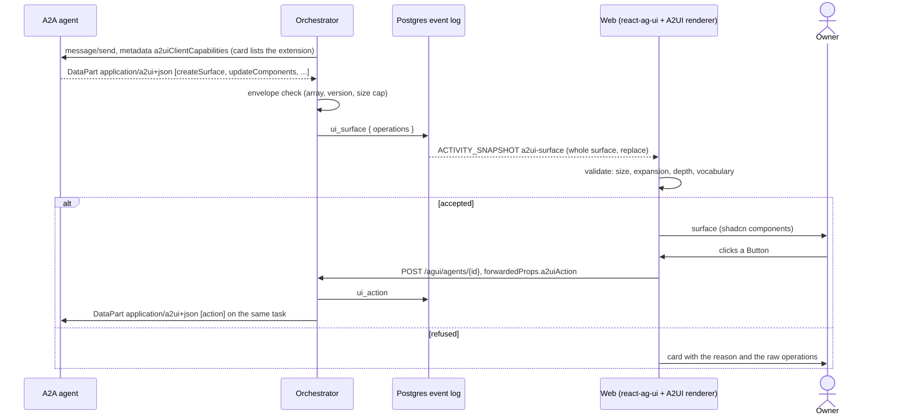
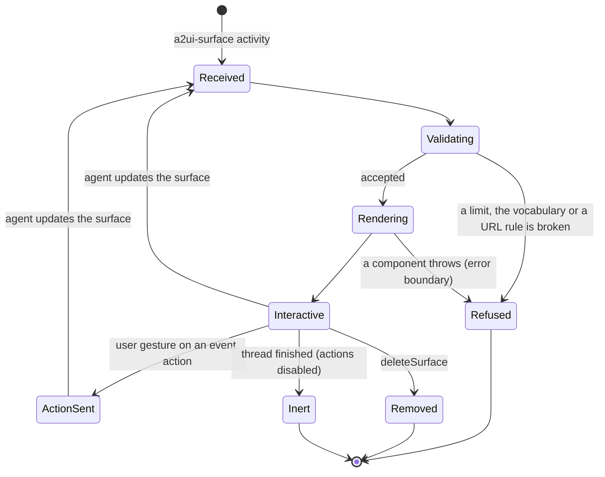

# ADR 0013 — A2UI for generative UI

- **Status:** accepted (2026-09-29). Status note (2026-09-29): the orchestrator side is built (surfaces
  from agents, actions from users, capability detection; the web renderer is not). The decision
  stands, with these refinements, all verified against the specification the same day (details in
  [`api/agui.md`](../api/agui.md#a2ui-generative-ui)):
  - `a2uiClientCapabilities` is keyed by the version, `{"v0.9.1": {"supportedCatalogIds": […]}}`, and the
    `v1.0` candidate renames it `a2uiRendererCapabilities` under `{"v1.0": …}`. **Both extension URIs are
    detected** (open question 22); when a card lists both, `v0.9.1` is spoken.
  - The extension is also *activated* (`A2A-Extensions` and `message.extensions`), because agents built on
    the A2UI SDK look there; it is still optional, and a surface is relayed without it.
  - `sourceComponentId` is **required** in a `ui_action` (A2UI's `action` message requires it), not
    optional as sketched below. The event also records the `version` of the surface acted on and the `runId`
    of the run the action started; the agent gets the action in the dialect its surface spoke.
  - An action is accepted only while the thread **waits** (a run is open exactly while it is `queued` or
    `working`), only for a surface the thread has now, and is refused with 422 (malformed, unknown surface,
    together with a message) or 413 (over 256 bytes per name, or 16 KiB of context) before anything is
    written.
  - The envelope check refuses a whole **part**, not the whole message: the rest of the message and the
    turn go on, and the refusal is an `error` event attributed to the agent. The `v1.0` messages that need a
    renderer's reply (`callRendererFunction`, `agentFunctionResponse`) are refused as unknown operations.
  - Limits on the orchestrator side: 256 messages and 64 KiB per payload, 256 KiB of replayed operations
    per surface.

## Context

An agent's result is sometimes better as an interface than as text: a summary card, a table of
findings, a form that answers its question, a button that opens the pull request. We need one way
for a remote A2A agent to send such an interface, for the orchestrator to carry it, and for the
web to render it safely.

- **Our agents are remote A2A agents, and the browser runs no model.** Generative-UI approaches
  that ride on the browser's tool loop (frontend tools, AG-UI's draft `generateUserInterface`)
  do not apply.
- **The interface is untrusted input from an agent.** The host decides what can render and what a
  click may do.
- **The user-facing protocol is AG-UI** ([ADR 0012](0012-ag-ui-user-facing-protocol.md)), which is
  "not a generative UI specification" but carries A2UI, MCP-UI and Open-JSON-UI.

[A2UI](https://a2ui.org/) is a declarative, streaming JSON protocol for agent-generated UI: the
agent sends surface operations (`createSurface`, `updateComponents`, `updateDataModel`,
`deleteSurface`) that the host renders from a pre-approved **catalog**, with no code over the
wire. It is Apache-2.0, created by Google with contributions from CopilotKit. It has an **A2A
extension** (a `DataPart` with `metadata.mimeType = "application/a2ui+json"`) and an **AG-UI
convention** (an `ACTIVITY_SNAPSHOT` with `activityType: "a2ui-surface"`), and assistant-ui renders
it natively in `@assistant-ui/react-ag-ui`.

OpenUI (a text DSL from one vendor, with no transport binding and no media type) was evaluated on
an unmerged branch and is **not adopted**. Its safety rules were sound, and they carry over below
as requirements for the A2UI renderer. The number 0010 is unused on `main`.

## Decision

**A2UI is the generative-UI format, end to end over standards: agent → A2A (A2UI extension) →
orchestrator → AG-UI `a2ui-surface` activity → web.** OpenUI is removed from the plan.

### Agent → orchestrator (A2A)

- **Capability-detected, ADR 0008 pattern.** When the target's card lists the A2UI extension
  (`https://a2ui.org/a2a-extension/a2ui/v0.9.1` today) in `capabilities.extensions`, the A2A
  adapter attaches `message.metadata["a2uiClientCapabilities"]` with the catalog ids the web
  renders (the A2UI basic catalog). Otherwise it sends nothing A2UI-specific. Removing this leaves
  plain A2A working.
- **Recognised by media type.** Any `DataPart` whose `metadata.mimeType` is
  `application/a2ui+json`, in a status message, a message or an artifact, is A2UI: its `data` is an
  array of A2UI messages. The extension makes activation optional, so a part is relayed even when
  the card did not advertise it.
- **Relayed, not interpreted.** The adapter checks only the envelope (a JSON array of objects,
  each with a `version` and one operation, within the size cap) and records the operations
  verbatim. It does not validate components against a catalog; the renderer does.
- **In the log** it is a new, additive event kind, `ui_surface { operations }`, attributed to the
  agent (ADR 0004: a new closed-enum variant). A part that fails the envelope check becomes an
  `error` event (`retryable: false`) and the rest of the message continues.

### Orchestrator → web (AG-UI)

- The projection keeps, per surface, the operations received so far, and emits
  `ACTIVITY_SNAPSHOT{activityType: "a2ui-surface", messageId, replace: true,
  content: {a2ui_operations: [...]}}` carrying the whole surface each time. The last snapshot of
  a surface therefore renders it completely, on the live stream, on replay and in history. The
  mapping is in [`docs/api/agui.md`](../api/agui.md).
- `deleteSurface` is relayed; the renderer removes the surface.

### User → agent (actions)

- A click on an A2UI `Button` with an `event` action reaches the orchestrator as a new AG-UI run
  whose `forwardedProps.a2uiAction.userAction` holds the action (the ecosystem convention that
  `useAgUiSendA2uiAction` sends). On a blocked thread it answers the interrupt, like a user message.
- The orchestrator records it as a new, additive event kind, `ui_action { surfaceId, name,
  sourceComponentId?, context }`, attributed to the user, and forwards it to the same A2A task as a
  `DataPart` (`application/a2ui+json`, one `action` message).
- `a2uiClientDataModel` (data-model sync) is not sent: the renderer does not implement it.

### The web renderer

`@assistant-ui/react-generative-ui` renders surfaces with **our shadcn-backed vocabulary**
(`JSONGenerativeUI({library})`), inside the `@assistant-ui/react-ag-ui` runtime (ADR 0012). **Our
validator runs before any conversion**; a violation refuses the whole surface, and the card shows
the reason and the raw operations.

**Safety requirements, carried over from the OpenUI evaluation:**

1. **Size:** at most 64 KiB of operations per surface (serialised JSON) and 400 components.
2. **Expansion:** at most 2000 rendered nodes **after expanding** template children over their
   bound lists and child references, counted before conversion, so a small surface cannot
   expand into millions of nodes. At most 100 items per template.
3. **Depth:** at most 24 levels.
4. **Components:** only those of our vocabulary. An unknown component or operation refuses the
   surface; it is not silently skipped.
5. **No HTML sink:** text is React text, markdown drops raw HTML, and remote images are not
   fetched (their alt text is shown) until a Content-Security-Policy decision allows them.
6. **Links:** only absolute `http:` or `https:` URLs become links or `openUrl` targets, opened in a
   new tab with `noopener,noreferrer`. Anything else does nothing and says so.
7. **Actions never auto-send.** An action is dispatched only by a direct user gesture on a rendered
   control: never on render, on a data-model update or on a timer. An action's `userMessage`
   (agent-authored text) is put in the message box, focused and unsent, for the owner to read and
   send; it is never posted as the owner's message. Actions are disabled on a finished thread.
   `functionCall` actions other than `openUrl` are ignored.

## Rules

- **Invariants hold.** ADR 0007: the agent side is plain A2A plus a standard A2A extension; A2UI is
  a protocol, not a host or SDK. ADR 0008: the extension is detected from the card, optional and
  removable. ADR 0001: surfaces and actions live in the event log.
- **Version.** The operations are relayed as sent. The renderer accepts the versions
  `@assistant-ui/react-generative-ui` accepts (v0.9, v0.9.1, v1.0 shapes); the extension URI we
  detect moves with A2UI releases in a reviewed PR.
- **adam-rs agents emit A2UI over A2A** (a `DataPart` helper in `adam-a2a`, advertised in the
  card). adam-rs serves no AG-UI.

## Alternatives rejected

- **OpenUI** (Thesys, MIT). A compact DSL with a good renderer, but no transport binding, no media
  type (our `text/vnd.openui-lang` would have been unregistered), one vendor, React only, and
  display-only in our allowlist. Its safety rules are kept; the format is not.
- **A2UI and OpenUI side by side, OpenUI frozen.** Two formats, two renderers and two sets of rules
  for one job.
- **AG-UI's declarative generative UI.** A draft, and it presumes the model runs in the browser's
  tool loop.
- **Rendering whatever converts.** assistant-ui's converter skips unknown components with a
  warning and bounds conversion at depth 32 and 5000 nodes; our limits are stricter and refuse
  instead of dropping content silently.
- **Artifacts with an A2UI media type instead of new event kinds.** A2UI also arrives in status
  messages (a form that answers `input-required`), and user actions have no artifact shape.

## Consequences

- Any A2A agent can produce interactive UI with no SDK; the same agent renders in any A2UI host
  (Angular, Flutter, Lit, React).
- Forms and actions are defined by a spec rather than by us, but A2UI is pre-1.0 (v0.9.1 current,
  v1.0 a candidate), so expect churn.
- Required elsewhere: core event kinds `ui_surface` and `ui_action`; the A2A adapter's DataPart
  handling and capability metadata; a shadcn vocabulary for `react-generative-ui`; the validator
  and its security tests (URL schemes, limits, expansion bombs, auto-send).
- A Content-Security-Policy for the web (images) and data-model sync are separate decisions.
  Tracking A2UI 1.0 is [open question](../open-questions.md) 22.

## Verified

- *Verified 2026-09-29* (<https://a2ui.org/>): "A2UI is Apache 2.0 licensed, created by Google with
  contributions from CopilotKit and the open source community"; v0.9.1 is current, v1.0 a
  candidate, v0.9 the previous stable, v0.8 legacy.
- *Verified 2026-09-29*
  (<https://a2ui.org/specification/v0.9.1-a2ui-extension-specification/>): the extension URI is
  `https://a2ui.org/a2a-extension/a2ui/v0.9.1`; advertising it in the card and activating it are
  optional; clients send `message.metadata["a2uiClientCapabilities"]` with `supportedCatalogIds`;
  A2UI data is a `DataPart` with `metadata.mimeType = "application/a2ui+json"` whose `data` "MUST
  be an array of messages", processed sequentially, a failing message not stopping the rest;
  client actions travel back as a `DataPart` of the same type. The page's HTTP example activates
  the extension with an `X-A2A-Extensions` header.
- *Verified 2026-09-29* (<https://www.assistant-ui.com/docs/tools/a2ui.md>): the AG-UI ecosystem
  carries A2UI as `ACTIVITY_SNAPSHOT` with `activityType: "a2ui-surface"` and
  `content.a2ui_operations` (the convention of `@ag-ui/a2ui-middleware`); surfaces are keyed by
  `surfaceId`; `useAgUiSendA2uiAction` sends an action as `forwardedProps.a2uiAction.userAction`;
  `openUrl` should be checked for `http:`/`https:`; `sendDataModel` is not implemented; conversion
  is bounded at depth 32, 100 template items and 5000 nodes; v0.9, v0.9.1 and v1.0 payloads are
  accepted.
- *Verified 2026-09-29* (npm registry): `@assistant-ui/react-generative-ui` 0.0.21 (MIT) is a
  dependency of `@assistant-ui/react-ag-ui` 0.0.62.
- *Verified 2026-09-29* (<https://docs.ag-ui.com/concepts/generative-ui-specs.md>,
  <https://docs.ag-ui.com/drafts/generative-ui.md>): AG-UI is not a generative-UI specification
  and supports A2UI, MCP-UI and Open-JSON-UI; its own declarative generative UI is a draft.
- *Unverified:* A2UI's JSON is more verbose (more tokens) than OpenUI's DSL; this is qualitative.
