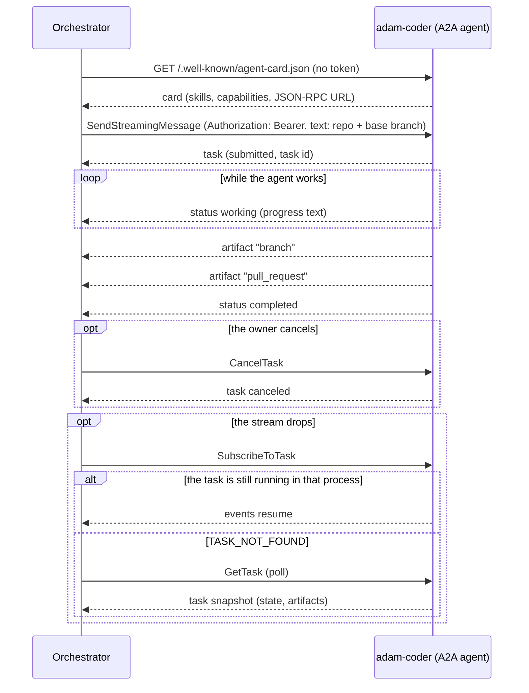
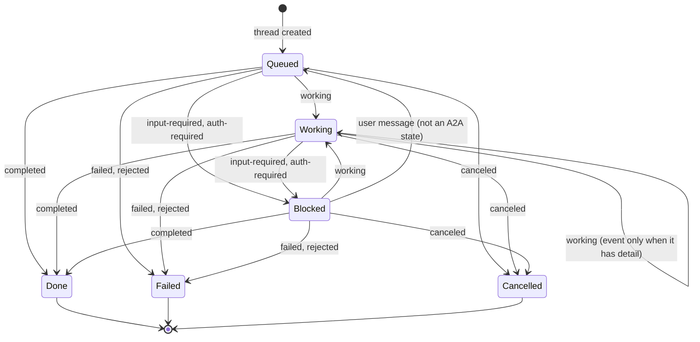

# ADR 0014 — adam-coder is the default agent, over plain A2A

- **Status:** accepted (2026-09-29)

## Context

The chat needs one agent that does real coding work before the rest of the agent fleet exists. The
owner decided on 2026-09-29: "Use the A2A route, coder as default agent."

`adam-coder` (in [`vymalo/another-adam-rs`](https://github.com/vymalo/another-adam-rs)) is an A2A 1.0
agent that clones a repository, works on a branch, runs checks, pushes and opens a pull request.

- **It is already an A2A agent.** It serves its card at `/.well-known/agent-card.json` (public),
  takes JSON-RPC at its public URL with a bearer token, and advertises no extensions. Nothing in the
  orchestrator needs to change to drive it.
- **The orchestrator has no notion of a default agent.** `AGENTS_FILE` is a YAML list of
  `{id, name, cardUrl, tokenEnv?}`; the agent directory and `App::list_agents` keep its order, and
  the chat UI preselects the first
  (`list[0]` in `web/src/features/agents/components/new-thread-panel.tsx`).
- **Invariants.** [ADR 0007](0007-protocol-only-dependencies.md): no dependency on an agent host or
  its SDK. [ADR 0008](0008-platform-integration-via-a2a-extension.md): host conveniences are optional
  and read live from the card. [ADR 0005](0005-openai-compatible-model-endpoint.md): models sit behind
  one OpenAI-compatible endpoint, on the agent's side.

## Decision

1. **The coder is an agent like any other:** an entry in `AGENTS_FILE` with its card URL and a
   `tokenEnv` naming the variable that holds its bearer token. The orchestrator takes **no crate
   dependency** on adam-rs and no code path is specific to it.
2. **The default agent is the first `AGENTS_FILE` entry.** `GET /api/agents` returns the agents in
   configuration order and clients preselect the first. There is no `default` field and no
   `DEFAULT_AGENT` variable.
3. **The default fails closed.** If the default agent's card cannot be read, it stays in first
   place, listed without its live details (no description, no release picker). It is never
   replaced by the next agent in the list; a thread that targets it fails or waits like any thread
   whose agent is down.
4. **The task input is the chat text.** The first message names the repository and the base
   branch; the orchestrator sends it as the A2A message text and adds nothing coder-specific.
5. **The dev stack and CI run the published coder image**, pinned by tag **and** digest, beside mocks
   (model endpoint, GitHub, git server) vendored from the same adam-rs commit as the image. This is
   the plan for a later PR, not part of this one.

The thread follows the task through the pure transition function
(`orchestrator/crates/core/src/transition.rs`, `status_input`). A2A `submitted` changes nothing;
`rejected` is `failed` with a `rejected:` prefix on the detail; a terminal thread accepts no
further agent input.

## Alternatives rejected

- **A `default: true` field in `AGENTS_FILE`, or a `DEFAULT_AGENT` variable.** A second way to say
  what list order already says, with new startup errors (none or two defaults, a default that names
  no agent). Kept as an [open question](../open-questions.md) (#23) in case order proves too implicit.
- **Routing the coder through another-agentic-platform.** It would add a hosting layer the coder
  does not need to be reached; the platform stays an optional agent host
  ([ADR 0008](0008-platform-integration-via-a2a-extension.md)).
- **Fetching the mocks at runtime** (from the adam-rs repository when the stack starts). The dev
  stack and CI would depend on a live network and a moving branch. They are vendored from the pinned
  commit, and a drift check compares them with upstream.
- **Building the coder from source in CI.** It compiles a large Rust workspace on every run to
  test an image that is already published; the pinned image is the artifact that gets deployed.

## Consequences

- **Any orchestrator deployment can make the coder its default** by listing it first; no code
  changes, no adam-rs types in this repository.
- **Heavy image:** about 2.9 GB, `linux/amd64` only. The `app` compose profile pulls it, so it is
  opt-in and not started by the default checks.
- **Host versus compose:** the coder's card advertises its `PUBLIC_URL`, which in compose must be
  `http://coder:8080/`. An orchestrator running on the host reads the card fine but cannot reach that
  URL, so it must run in the same compose network.
- **No `ListTasks`:** adam-coder does not support it, so `find_task_by_message` returns `None`
  (`AgentError::Unsupported`). If the orchestrator crashes after sending a message and before
  recording the task binding, the retry sends the message again and the coder starts a second run
  (a second branch). A rare window, but a real one, until adam-rs supports `ListTasks` or accepts an
  idempotency key.
- **The pull request URL** is in a JSON data part of the `pull_request` artifact, not a URL part, so
  the chat shows JSON rather than a link until adam-rs emits a URL part.
- **Required elsewhere (later PRs):** the dev stack and CI wiring of decision 5, and an end-to-end
  script against the chat API.

## Verified

- *Verified 2026-09-29* (this repository, at `15164aa`): the order of `AGENTS_FILE` is kept by the
  agent directory and by `App::list_agents`, the web preselects `list[0]`, and the thread mapping above is
  `orchestrator/crates/core/src/transition.rs` (`status_input`, `blocked`, `agent_input`).
- *Verified 2026-09-29* (`orchestrator/crates/agent-a2a/src/client.rs`): the adapter uses
  `SendStreamingMessage`, `SubscribeToTask`, `GetTask` and `CancelTask`, and treats an unsupported
  `ListTasks` as "no task found".
- *Verified 2026-09-29* (adam-rs at commit `172a117`, per the planning notes; `deploy/coder/` in
  adam-rs shows the same variables): card public, bearer via `A2A_BEARER_TOKENS`, no extensions,
  the card advertises `PUBLIC_URL`, `ListTasks` unsupported, `branch` and `pull_request` artifacts
  as JSON data parts.
- *Verified 2026-09-29* (anonymous pull from `ghcr.io`, per the planning notes):
  `ghcr.io/vymalo/another-adam-rs/coder:sha-172a117` is about 2.86 GB, `linux/amd64`, runs as uid
  10001; the image has no `latest` tag.
- *Unverified:* that a compose stack with this image passes end to end; that is what the later PR
  proves.
