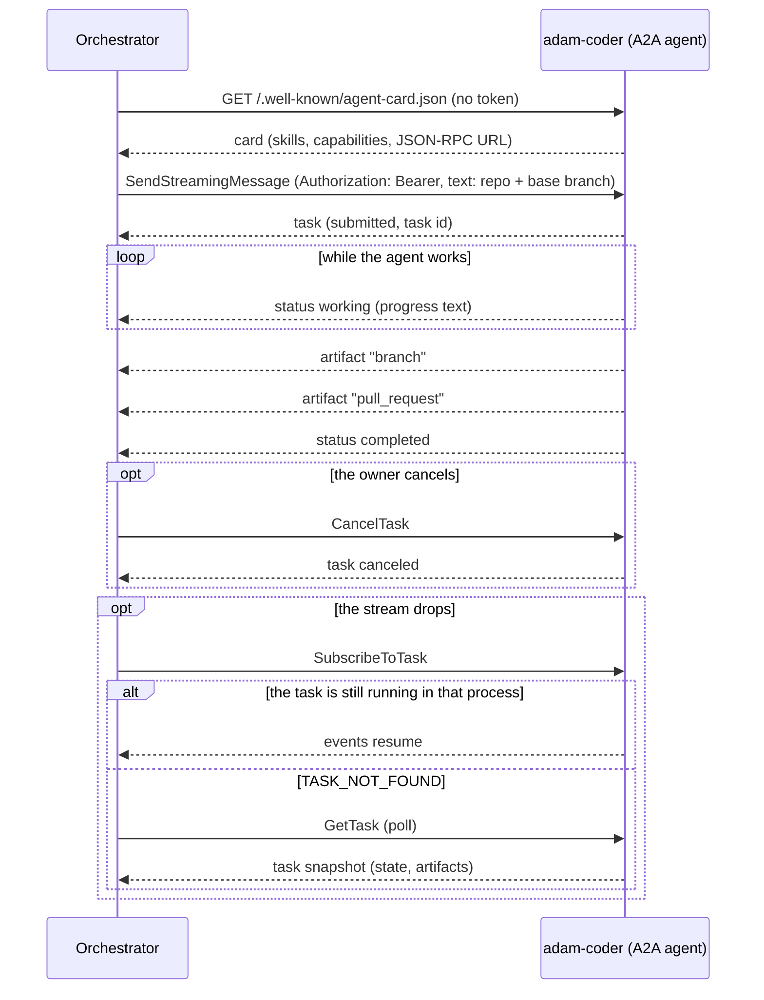
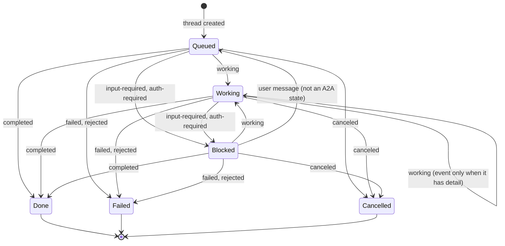

# ADR 0014 — adam-coder is the default agent, over plain A2A

- **Status:** accepted (2026-09-29). Amended (2026-10-01): decision 5 also covers the coder's agent folder, and the agents that are only a folder run from the same pinned image (status notes at the end).

## Context

The chat needs one agent that does real coding work before the rest of the agent fleet exists. The
owner decided on 2026-09-29: "Use the A2A route, coder as default agent."

`adam-coder` (in [`vymalo/another-adam-rs`](https://github.com/vymalo/another-adam-rs)) is an A2A 1.0
agent that clones a repository, works on a branch, runs checks, pushes and opens a pull request.

- **It is already an A2A agent.** It serves its card at `/.well-known/agent-card.json` (public),
  takes JSON-RPC at its public URL with a bearer token, and advertises no extensions. Nothing in the
  orchestrator needs to change to drive it.
- **The orchestrator has no notion of a default agent.** `AGENTS_FILE` is a YAML list of
  `{id, name, cardUrl, tokenEnv?}`; the agent directory and `App::list_agents` keep its order, and
  the chat UI preselects the first
  (`list[0]` in `web/src/features/agents/components/new-thread-panel.tsx`).
- **Invariants.** [ADR 0007](0007-protocol-only-dependencies.md): no dependency on an agent host or
  its SDK. [ADR 0008](0008-platform-integration-via-a2a-extension.md): host conveniences are optional
  and read live from the card. [ADR 0005](0005-openai-compatible-model-endpoint.md): models sit behind
  one OpenAI-compatible endpoint, on the agent's side.

## Decision

1. **The coder is an agent like any other:** an entry in `AGENTS_FILE` with its card URL and a
   `tokenEnv` naming the variable that holds its bearer token. The orchestrator takes **no crate
   dependency** on adam-rs and no code path is specific to it.
2. **The default agent is the first `AGENTS_FILE` entry.** `GET /api/agents` returns the agents in
   configuration order and clients preselect the first. There is no `default` field and no
   `DEFAULT_AGENT` variable.
3. **The default fails closed.** If the default agent's card cannot be read, it stays in first
   place, listed without its live details (no description, no release picker). It is never
   replaced by the next agent in the list; a thread that targets it fails or waits like any thread
   whose agent is down.
4. **The task input is the chat text.** The first message names the repository and the base
   branch; the orchestrator sends it as the A2A message text and adds nothing coder-specific.
5. **The dev stack and CI run the published coder image**, pinned by tag **and** digest, beside mocks
   (model endpoint, GitHub, git server) vendored from the same adam-rs commit as the image. This is
   the plan for a later PR, not part of this one.

The thread follows the task through the pure transition function
(`orchestrator/crates/core/src/transition.rs`, `status_input`). A2A `submitted` changes nothing;
`rejected` is `failed` with a `rejected:` prefix on the detail; a terminal thread accepts no
further agent input.

## Alternatives rejected

- **A `default: true` field in `AGENTS_FILE`, or a `DEFAULT_AGENT` variable.** A second way to say
  what list order already says, with new startup errors (none or two defaults, a default that names
  no agent). Kept as an [open question](../open-questions.md) (#23) in case order proves too implicit.
- **Routing the coder through another-agentic-platform.** It would add a hosting layer the coder
  does not need to be reached; the platform stays an optional agent host
  ([ADR 0008](0008-platform-integration-via-a2a-extension.md)).
- **Fetching the mocks at runtime** (from the adam-rs repository when the stack starts). The dev
  stack and CI would depend on a live network and a moving branch. They are vendored from the pinned
  commit, and a drift check compares them with upstream.
- **Building the coder from source in CI.** It compiles a large Rust workspace on every run to
  test an image that is already published; the pinned image is the artifact that gets deployed.

## Consequences

- **Any orchestrator deployment can make the coder its default** by listing it first; no code
  changes, no adam-rs types in this repository.
- **Heavy image:** about 2.9 GB, `linux/amd64` only. The `app` compose profile pulls it, so it is
  opt-in and not started by the default checks.
- **Host versus compose:** the coder's card advertises its `PUBLIC_URL`, which in compose must be
  `http://coder:8080/`. An orchestrator running on the host reads the card fine but cannot reach that
  URL, so it must run in the same compose network.
- **No `ListTasks`:** adam-coder does not support it, so `find_task_by_message` returns `None`
  (`AgentError::Unsupported`). If the orchestrator crashes after sending a message and before
  recording the task binding, the retry sends the message again and the coder starts a second run
  (a second branch). A rare window, but a real one, until adam-rs supports `ListTasks` or accepts an
  idempotency key.
- **The pull request URL** is in a JSON data part of the `pull_request` artifact, not a URL part, so
  the chat shows JSON rather than a link until adam-rs emits a URL part.
- **Required elsewhere (later PRs):** the dev stack and CI wiring of decision 5, and an end-to-end
  script against the chat API.

## Verified

- *Verified 2026-09-29* (this repository, at `15164aa`): the order of `AGENTS_FILE` is kept by the
  agent directory and by `App::list_agents`, the web preselects `list[0]`, and the thread mapping above is
  `orchestrator/crates/core/src/transition.rs` (`status_input`, `blocked`, `agent_input`).
- *Verified 2026-09-29* (`orchestrator/crates/agent-a2a/src/client.rs`): the adapter uses
  `SendStreamingMessage`, `SubscribeToTask`, `GetTask` and `CancelTask`, and treats an unsupported
  `ListTasks` as "no task found".
- *Verified 2026-09-29* (adam-rs at commit `172a117`, per the planning notes; `deploy/coder/` in
  adam-rs shows the same variables): card public, bearer via `A2A_BEARER_TOKENS`, no extensions,
  the card advertises `PUBLIC_URL`, `ListTasks` unsupported, `branch` and `pull_request` artifacts
  as JSON data parts.
- *Verified 2026-09-29* (anonymous pull from `ghcr.io`, per the planning notes):
  `ghcr.io/vymalo/another-adam-rs/coder:sha-172a117` is about 2.86 GB, `linux/amd64`, runs as uid
  10001; the image has no `latest` tag.
- *Unverified:* that a compose stack with this image passes end to end; that is what the later PR
  proves.

### Status note, 2026-09-29: the entry shape gains an optional `transport`

An `AGENTS_FILE` entry is now `{id, name, transport?, cardUrl, tokenEnv?}`. `transport` names how the
orchestrator reaches the agent; the only value is `a2a`, and it is the default when the key is absent, so every
file written for this decision stays valid. Any other value, `local` included, is a startup error that names the
choices. The default-agent rule is unchanged: the first entry, in file order, whatever its transport. This is
migration step 11 of [ADR 0015](0015-control-plane-and-workers-on-adam-rs.md), which adds the closed
`AgentTransport` enum behind the key.

- *Verified 2026-09-29* (`orchestrator/bin/orchestrator/src/config.rs`, its unit tests): an absent key and
  `transport: a2a` give the same endpoint; `transport: local` is refused with a message that names `a2a`.

### Status note, 2026-09-29: `transport: local`, and `cardUrl` becomes optional

An `AGENTS_FILE` entry is now `{id, name, transport?, cardUrl?, tokenEnv?, agent?}`. `transport` is `a2a` (still the
default when the key is absent, so every file written for this decision stays valid; `cardUrl` is required for it)
or `local`, an agent hosted in the orchestrator's own process (`agent` names its kind, `cardUrl` and `tokenEnv` are
refused). A `local` entry is refused at startup with `LocalAgentsNotCompiled` (exit 78) until a build has local
agents. The default-agent rule is unchanged: the first entry, in file order, whatever its transport. This is
migration step 12 of [ADR 0015](0015-control-plane-and-workers-on-adam-rs.md), first part.

- *Verified 2026-09-29* (`orchestrator/bin/orchestrator/src/config.rs`, its unit tests): an `a2a` entry without a
  `cardUrl` is an error, `agent` on an `a2a` entry is an error, a `local` entry with a `cardUrl` or `tokenEnv` is an
  error, an unknown or missing `agent` is an error listing the kinds, and a valid `local` entry is refused with
  `LocalAgentsNotCompiled` in this build and becomes `AgentEndpoint::local` when the build has its kind (tested
  through the parser's injected predicate).

### Status note, 2026-09-30: `transport: local` is served by a build with `agent-local`

The Cargo feature `agent-local` now exists ([ADR 0015](0015-control-plane-and-workers-on-adam-rs.md), migration step 12,
third change). In a build with it, a `local` entry becomes `AgentEndpoint::local` and its agent runs in the orchestrator's
process; in the default build it is still refused with `LocalAgentsNotCompiled` (exit 78), and the message now says to build
with `--features agent-local`. The default agent, `adam-coder`, stays a plain A2A agent.
- *Verified 2026-09-30* (`bin/orchestrator/src/config.rs`, its unit tests in both flavours, and
  `bin/orchestrator/tests/smoke.rs`, `transport_local_exits_78_naming_agent_local`).

### Status note, 2026-10-01: the dev stack also vendors the coder's agent folder

Decision 5 vendors what the published image needs beside it, from the same adam-rs commit as the image. Since adam-rs
`7b2d8f9` ([#57](https://github.com/vymalo/another-adam-rs/pull/57), MVP slice 1 of [`docs/mvp.md`](../mvp.md)) the coder reads
its agent folder (instructions, card, name) at startup from `ADAM_AGENT_DIR` instead of only from the copy embedded in the
image, and the folder is part of what the stack runs. So the vendored set now includes it: `dev/coder/agent/` is a byte-for-byte
copy of `bin/adam-coder/agent/` at the commit in `dev/coder/UPSTREAM`, `compose.yaml` mounts it read-only at `/etc/adam/agent` and
sets `ADAM_AGENT_DIR` there (`CODER_AGENT_DIR` points the mount at a copy; `compose.live.yaml` keeps the same environment variable),
and `dev/coder/check-vendored.sh` compares each file and checks that no file is missing or extra, exactly as for the mocks.
Nothing else of the decision changes: the image is still pinned by tag and digest at that commit, the coder is still a plain A2A
agent, and the orchestrator knows nothing of the folder (it reads the card of the restarted coder when it delegates). A change to the
instructions is made upstream and moved here with the commit and the pin; to try one here first, mount a copy
([`dev/README.md`](../../dev/README.md#change-what-the-coder-says)). The coder's card name is now `Coder` (was `adam-coder`); only the
orchestrator's logs read it, and `dev/agents.yaml` names the agent itself.

- *Verified 2026-10-01* (anonymous ghcr API): `coder:sha-7b2d8f9` is one `linux/amd64` manifest, uid 10001, entrypoint
  `tini -- adam-coder`, label `org.opencontainers.image.revision` `7b2d8f95ffd9abe8af990bd79d7d690e8183c392`, digest
  `sha256:aa84305a...` (the sha-256 of the manifest the registry returned). `dev/coder/check-vendored.sh` passes against
  `raw.githubusercontent.com` and the GitHub tree API at that commit.
- *Unverified where this was written* (no coder image was pulled; the Coder E2E workflow runs it): the coder container on this
  mount, `dev/greeting-e2e.sh` and `dev/agent-folder-e2e.sh` against it, and how a live model follows the new instructions.

### Status note, 2026-10-01: agents that are only a folder run from the same pinned image

Since adam-rs `f882b91` ([#58](https://github.com/vymalo/another-adam-rs/pull/58), MVP slice 2 of [`docs/mvp.md`](../mvp.md)) the coder's image
also carries `adam-agent`, a second binary that serves any agent folder over A2A (instructions, card, skills, subagents, the tools of an
`mcp.json`); it has no image or package of its own (a new GHCR package is private until its owner makes it public). The dev stack runs a chat and
a researcher with it, beside the coder, and decision 5 covers them the same way:

- **One pin, one commit.** `compose.yaml` writes the image once (`x-adam-image`, tag `sha-<7>` and digest) and the coder and the agents that are
  folders take it by alias, so they can never be two adam-rs commits; `dev/coder/check-vendored.sh` asserts the tag is the commit in
  `dev/coder/UPSTREAM` and fails on a second pin.
- **The folders are ours, not vendored.** `dev/agents/chat/agent/` and `dev/agents/researcher/agent/` are this repository's agents, not copies of
  upstream files (upstream's own example, `dev/agents/assistant`, and its `mock-assistant` model are not vendored). They follow the persona convention of
  adam-rs's `bin/adam-agent/README.md`, and their model is the WireMock `mock-model` (`dev/wiremock/model/`), also ours.
- **The orchestrator is unchanged.** The chat and the researcher are two more entries of `AGENTS_FILE` (a card URL and a `tokenEnv`), after the
  coder, which stays the default agent (decision 2). No code path is specific to them.
- **Several agents, one database.** They share `agents-postgres`: adam-rs scopes a run by the agent's name. The coder keeps its own database.

How to add one: [`dev/README.md`](../../dev/README.md#add-a-fourth-agent-by-writing-a-folder).

- *Verified 2026-10-01* (anonymous ghcr API): `coder:sha-f882b91` is one `linux/amd64` manifest (2.88 GB of compressed layers), uid 10001,
  entrypoint `tini -- adam-coder`, label `org.opencontainers.image.revision` `f882b910b620ea583130a0517b4e52c5f7939179`, digest
  `sha256:7c549618...` (the sha-256 of the manifest the registry returned); adam-rs's `coder` workflow smoke-tested `adam-agent` in it before pushing.
  `dev/coder/check-vendored.sh` passes at that commit. The scenario `agents` passed against real `adam-agent`, `adam-coder` and orchestrator
  processes (debug builds) and the WireMock model mock; the details are in the last section of `dev/README.md`.
- *Unverified where this was written* (the image was not pulled; the Coder E2E workflow runs it): the two services in containers and the
  scenario through the `edge`, and how a live model follows the folders' instructions.

### Status note, 2026-10-01: the coder asks with Choices (adam-rs d411249, pinned at c13ddf1)

Since adam-rs `d411249` ([#59](https://github.com/vymalo/another-adam-rs/pull/59), MVP slice 3 of [`docs/mvp.md`](../mvp.md), [ADR 0023](0023-ui-component-catalog-as-an-a2a-extension.md))
the coder, and `adam-agent` with it, draws from the component catalog of the person's screen. Nothing about the decision changes: the coder is still a plain
A2A agent, the orchestrator still knows nothing of it beyond its card, and the image is still pinned by tag and digest at the commit in `dev/coder/UPSTREAM`.
What the pin brings, and what this repository does for it:

- **Two extensions on the card, read live.** The coder's card lists A2UI v0.9.1 (with `acceptsInlineCatalogs`), `ui-catalog/v1` and `thread-tools/v1`, so the
  orchestrator's adapter (ADR 0008: detected from the live card at every send, fail closed) sends the screen's catalog and a thread-tools grant. No orchestrator
  change is needed.
- **The thread's tools are plain `http` between containers**, `http://orchestrator:8080/thread-tools/<id>/mcp` (`THREAD_TOOLS_URL`), which an adam agent
  reaches only when `MCP_ALLOW_INSECURE=true` allows it. `compose.yaml` sets it for the coder and, in `x-adam-agent-env`, for the folder agents (their card lists the
  same extensions), and `compose.live.yaml` keeps it for all three: development only, as for the mock web search.
- **One more vendored mapping**, `dev/coder/wiremock/mock-openai/mappings/coder-choices.json` (a task that holds `[mock:choices]` makes `mock-coder` ask three questions with
  `ask_user`; the answers `db: pg` get "Going with Postgres, Keycloak and Compose."), and the coder's `instructions.md` copy gains the paragraph on `choices`. The mappings stay a
  deliberate subset of upstream's (the scripted coder run, now with this one).
- **A scenario**, `choices` (`dev/choices-e2e.sh`, in `e2e-all.sh` and so in the Coder E2E workflow): the web's own catalog goes with a run, the coder asks three questions as one
  `Choices` surface under the catalog's id, one `a2uiAction` answers them, the coder's next words quote the answers, and a message from a newer screen records a second `ui_catalog`.

- *Verified 2026-10-01* (anonymous ghcr API, HTTP 200): `coder:sha-c13ddf1`, which holds `d411249`, is one
  `linux/amd64` manifest (2.88 GB of compressed layers), uid 10001, entrypoint `tini -- adam-coder`, label `org.opencontainers.image.revision` `c13ddf1a32a1424affa20043f6bd860d93c536cc`, digest
  `sha256:a77a2890...` (the sha-256 of the manifest the registry returned), published by adam-rs's `coder` workflow after its smoke tests and its own compose scenario of the Choices chain
  (`dev/coder-choices-e2e.sh` upstream, without the orchestrator) passed. None of the vendored files changed between `d411249` and `c13ddf1`; `dev/coder/check-vendored.sh` passes at `c13ddf1`.
- *Unverified where this was written* (the image was not pulled, and the stack was not started: the disk of the machine was too small): the scenario `choices` in containers, through the
  `edge` and the real orchestrator, which is the first run of the chain across the two repositories (the Coder E2E workflow runs it); how a live model uses `choices`.

### Status note, 2026-10-01: the researcher answers with cards and a graph (adam-rs c13ddf1)

Since adam-rs `c13ddf1` ([#60](https://github.com/vymalo/another-adam-rs/pull/60), MVP slice 4 of [`docs/mvp.md`](../mvp.md)) the image's `show` tool (`adam-ui`) takes `Cards` and `Mermaid` blocks of a
catalog of version 3 and checks them against its schemas, and adam-rs's example researcher folder tells its agent to show the sources it found. Nothing about the decision changes, and the pin is the one of the note above (`c13ddf1`). The researcher folder here stays **ours**
(`dev/agents/researcher/agent/`, not vendored): its `instructions.md` takes adam-rs's paragraph on showing sources by hand, and its `mcp.json` still names the mock web search.
The model mock gains the script `[mock:cards]` (`dev/wiremock/model/mappings/researcher-cards.json`: search, `ui_catalog`, `show`, words), the mock web search an `async` keyword with three
results, and `dev/e2e-all.sh` the scenario `cards` (`dev/cards-e2e.sh`).

- *Verified 2026-10-01*: the new script against WireMock 3.13.2 (`dev/check-agent-mocks.sh`, every check `ok` including the six of this script), its `show` blocks against the schemas of the web's catalog
  (JSON Schema 2020-12, with `id` added as `show` does), and `dev/cards-e2e.sh` against a stand-in for the edge (see the last section of `dev/README.md`).
- *Unverified where this was written* (the stack was not started: the disk was too small): the scenario `cards` in containers, through the `edge` and the real orchestrator and researcher, and how a
  live model chooses to show cards.

### Status note, 2026-10-01: the coder shows its work as steps and its words as they are written (adam-rs cf6ddbb)

Since adam-rs `cf6ddbb` ([#61](https://github.com/vymalo/another-adam-rs/pull/61) steps, [#62](https://github.com/vymalo/another-adam-rs/pull/62) a lease race of its runtime,
[#63](https://github.com/vymalo/another-adam-rs/pull/63) streamed text; MVP slices 5 and 6 of [`docs/mvp.md`](../mvp.md); adam-rs ADR 0007) the coder, and `adam-agent` with it, list two more
extensions on their cards, `steps/v1` ([ADR 0025](0025-nested-steps-events-carry-their-source-path.md)) and `text-stream/v1` ([ADR 0027](0027-live-text-relayed-not-stored.md)), and use them for a client that
activates them. Nothing about the decision changes: the coder is still a plain A2A agent, the orchestrator reads its card live at every send and fails closed (ADR 0008), the image is still pinned by
tag and digest at the commit in `dev/coder/UPSTREAM`, and the orchestrator needed no change for the pin (its sides were built in [#78](https://github.com/vymalo/another-agentic-system/pull/78) and
[#80](https://github.com/vymalo/another-agentic-system/pull/80)). What the pin brings, and what this repository does for it:

- **Steps.** Every tool call of the coder is a step, `delegate_to_opencode` is a `subagent` step labelled OpenCode, and what OpenCode did under it (its bash call, its summary) are child steps, so a turn that used to
  be a flood of status lines is a tree the orchestrator keeps bounded and the web draws in its side panel.
- **Streamed text.** The coder and `adam-agent` call their model with `"stream": true` and send each answer as chunks while it is written, then once whole, naming the stream; the orchestrator relays the chunks
  and never stores them, and the log holds the one final message.
- **Two more vendored mappings**, the SSE twins `coder-script-stream.json` and `coder-choices-stream.json` of the coder's scripts (`dev/coder/wiremock/mock-openai/mappings/`; every other vendored file is
  unchanged at `cf6ddbb`, and `dev/coder/check-vendored.sh` passes there). The mappings stay a deliberate subset of upstream's: its `agent-script-stream.json` and `researcher-cards-stream.json` twin scripts
  that are not vendored.
- **Twins of our own scripts.** The chat and the researcher run the same image, so they stream too, and a stub of `dev/wiremock/model/mappings/` that does not say it streams answers plain JSON. Each script of
  `persona.json`, `researcher.json` and `researcher-cards.json` has an SSE twin (`*-stream.json`, one priority above), and `dev/check-agent-mocks.sh` plays every probe both ways and requires the same answer.
- **The scenario** `coder` (`dev/coder-e2e.sh`, both variants, so the Coder E2E workflow) asserts the tree (an OpenCode sub-agent step with a command or tool step under it, ended, finished once, the log bounded to six
  events per step) and the live words (a message marked `vymalo.live` that grows in at least two pieces from offset 0 and is completed by the log's final message under the same id; the log holds it once; the replay reads
  it plain). `cards` and `choices`, which read the words of a run stream, now read a message as a client does, by offset, instead of joining its deltas with a space.
- *Verified 2026-10-01* (anonymous ghcr API, HTTP 200): `coder:sha-cf6ddbb` is one `linux/amd64` manifest (2.88 GB of compressed layers, ten layers), uid 10001, entrypoint `tini -- adam-coder`, label
  `org.opencontainers.image.revision` `cf6ddbb45a44afce99f437dbd370ef59bdf095d0`, digest `sha256:45f1afd1...` (the sha-256 of the manifest the registry returned), published by adam-rs's `coder` workflow for that commit
  on `main`. The vendored scripts, played against WireMock 3.13.2: the greeting streams in eight deltas and the coder's last answer takes 2.1 s. Our twins and the new assertions of the scripts: the last section of
  [`dev/README.md`](../../dev/README.md#what-was-checked).
- *Unverified where this was written* (the stack was not started: the disk of the machine was too small for the orchestrator and web builds): the scenarios in containers, which is the first run of the coder at
  `cf6ddbb` behind the real orchestrator (the Coder E2E workflow of the pull request that pins it); what a real OpenCode reports for its bash call (the script asks for a command or tool step under it and names
  no label); and whether every real model provider accepts a streamed request with `stream_options`.

### Status note, 2026-10-01: workspaces, GitHub per installation, and repositories created on request

Since adam-rs `1021836` ([#64](https://github.com/vymalo/another-adam-rs/pull/64) file tools and workspaces,
[#65](https://github.com/vymalo/another-adam-rs/pull/65) scratch projects and GitHub as an App installation,
[#66](https://github.com/vymalo/another-adam-rs/pull/66) GitHub over MCP, a second repository and a created one; MVP slice 7 of
[`docs/mvp.md`](../mvp.md); adam-rs ADRs
[0002](https://github.com/vymalo/another-adam-rs/blob/1021836a1887610c4639de15f2289b26245b9ce4/docs/decisions/0002-workspace-placement.md),
[0008](https://github.com/vymalo/another-adam-rs/blob/1021836a1887610c4639de15f2289b26245b9ce4/docs/decisions/0008-a-workspace-holds-several-repositories.md) and
[0009](https://github.com/vymalo/another-adam-rs/blob/1021836a1887610c4639de15f2289b26245b9ce4/docs/decisions/0009-github-per-installation-read-through-mcp.md)) the coder is pinned at
that commit, and **decision 4 no longer holds as written**: the first message does not have to name a repository. Nothing about the decision changes otherwise: the coder is a plain A2A agent, the orchestrator
reads its card live and fails closed (ADR 0008), the image is pinned by tag and digest at the commit in `dev/coder/UPSTREAM`, and **the orchestrator is unchanged**. What the pin brings:

- **A task needs no repository to start.** A task that names none is built in a scratch project (a local git repository that lives while the run does), and the coder asks where to put it; a repository the
  person names later receives the files (`publish_scratch`). A workspace holds several repositories and its run's workspace is swept when the run is over. The gate is unchanged: it binds the last `checks`
  that names the pushed commit of the last `branch` (ADR 0018), so **a job that pushes to two repositories has the gate judge only the last one** (open question 42).
- **The coder asks before it widens its reach, and the question is a form.** A repository the person did not name joins the workspace only after a yes (`request_repository`), and a repository is created
  (`create_repository`, for the owners in the coder's `CREATE_REPO_OWNERS` only, private and empty by default) only after a yes to a question the tool writes, each time. Both come to the orchestrator as an
  `input-required` task with an ordinary `ask_user` form, a `Choices` of one question, so the answer is the single A2UI action of [`choices`](0023-ui-component-catalog-as-an-a2a-extension.md) when the screen's
  catalog went with the message, and a word (`yes`, `no`) when it did not. The model never grants: only the person's answer to that very call does.
- **Credentials are per installation, and the coder's own.** One installation's credential, a token (`GITHUB_TOKEN`) or a GitHub App (`GITHUB_APP_ID`, `GITHUB_APP_INSTALLATION_ID`, a key file), lives in the coder's
  environment and secret and is **never sent in an A2A message, the orchestrator's log or an agent card**. The coder reads GitHub, read-only, through the official GitHub MCP server it starts as a child process
  with the same credential; its writes are its own tools. The orchestrator holds none of it (open question 35 notes this).
- **In this repository:** the pin and the vendored mocks (`mock-github` creates repositories and trades an App's JWT for an installation token, the new `mock-github-mcp`, `git-server` seeding `local/library` and making the
  repositories of `scratch` on first use), `dev/compose.github-app.yaml` (the coder as an App), `compose.live.yaml` and `.env.example` (a token or an App, `CREATE_REPO_OWNERS`), `mock-ci` finding
  `scratch/*` repositories, and the scenario `workspace` (`dev/workspace-e2e.sh`) beside `dev/coder-e2e.sh`'s new assertions (the read over MCP, `GITHUB_AUTH=token|app`); CI runs the coder scenarios in both
  credential modes ([`dev/README.md`](../../dev/README.md#workspaces-github-over-mcp-and-a-github-app-the-coder-without-a-repository)).
- *Verified 2026-10-01* (anonymous ghcr API, HTTP 200): `coder:sha-1021836` is one `linux/amd64` manifest (2.89 GB of compressed layers), uid 10001, entrypoint `tini -- adam-coder`, `MCP_ALLOW_STDIO=true`, label
  `org.opencontainers.image.revision` `1021836a1887610c4639de15f2289b26245b9ce4`, digest `sha256:8dcc66c3...` (the registry's `Docker-Content-Digest`, and the sha-256 of the manifest it returned). `dev/coder/check-vendored.sh`
  passes at that commit.
- *Unverified where this was written* (the machine had 2.4 GB of free disk and could not pull the 2.9 GB image or start the stack): the scenarios in containers, the first run of which is the Coder E2E workflow of the pull
  request that pins it; that a real model uses the consent tools as the script does; the coder as a GitHub App against github.com and the real `github-mcp-server` (the stack mocks both).

### Status note, 2026-10-02: tool steps carry their input and output, and the coder knows what the person sees (adam-rs d56dd94)

Since adam-rs `d56dd94` ([#69](https://github.com/vymalo/another-adam-rs/pull/69), with [#68](https://github.com/vymalo/another-adam-rs/pull/68) before it) the coder is pinned at that commit.
Nothing about the decision changes: the coder is a plain A2A agent, the orchestrator reads its card live and fails closed (ADR 0008), the image is pinned by tag and digest at the commit in `dev/coder/UPSTREAM`.
What the pin brings:

- **A tool step carries its call.** The coder, and every agent served by `adam-agent`, send each tool call's `input` (the arguments, redacted and cut) on the step's start and its `output` (`{text, truncated?, bytes?, error?}`)
  on its end, the two optional members that `steps/v1` gained on 2026-10-02 ([ADR 0030](0030-a-step-carries-its-input-and-output-bounded-and-redacted.md); the orchestrator side is built, plan 10 S1; adam-rs [ADR 0011](https://github.com/vymalo/another-adam-rs/blob/d56dd9418ec1b4e814be8c58966381ed14e664b4/docs/decisions/0011-a-tool-calls-step-carries-its-input-and-output.md)). An MCP tool's `title`
  is its step's label, where the label was `<server>__<tool>`. An agent that does not send them is read as before.
- **Clearer instructions.** The coder's `instructions.md` (the folder vendored at `dev/coder/agent/`) gained "What the person sees": the words before a tool call are one-line working notes shown beside the steps,
  the reply that ends the turn is the only text in the conversation and must be complete on its own, and replies render as Markdown. It also describes the work environment (below). The `show` tool lists the catalog's components
  and refuses `Choices`, and `get_ui_catalog` is hidden from the model.
- **A run may work in its repository's devcontainer** (adam-rs #68, [ADR 0010](https://github.com/vymalo/another-adam-rs/blob/d56dd9418ec1b4e814be8c58966381ed14e664b4/docs/decisions/0010-a-run-works-in-its-repositorys-devcontainer.md)),
  with `DEVCONTAINER_RUNTIME=podman`. It is off by default and nothing here sets it: the stack's coder runs its commands in its own container, as before.
- **A local-process MCP server is the coder's deployment's decision.** The image sets no `MCP_ALLOW_STDIO` (at `1021836` it did): it carries `github-mcp-server` for the coder and `adam-agent`, which must refuse
  local processes. `compose.live.yaml` sets it on the coder service alone, because the live coder starts the real `github-mcp-server`; the chat and the researcher use http servers and do not get it, and the offline coder
  reads GitHub over http (the mock `mcp.json`).
- **In this repository:** the pin and the vendored files (changed: the agent folder's `instructions.md` and three mappings of the coder's and OpenCode's scripts, additions only; new: two seeded repositories for the devcontainer scenario of adam-rs and
  two bodies of its OpenCode script; every other vendored file unchanged), `compose.live.yaml`, and the scenarios `agents` and `coder`, which assert that the researcher's search is one step labelled `Web search` and that
  the coder's tool steps carry their input and output ([`dev/README.md`](../../dev/README.md#what-was-checked)).
- *Verified 2026-10-02* (anonymous ghcr API, HTTP 200): `coder:sha-d56dd94` is one `linux/amd64` manifest (2.92 GB of compressed layers, thirteen layers), uid 10001, entrypoint `tini -- adam-coder`, no `MCP_ALLOW_STDIO`, label
  `org.opencontainers.image.revision` `d56dd9418ec1b4e814be8c58966381ed14e664b4`, digest `sha256:9beeb71a...` (the registry's `Docker-Content-Digest`, and the sha-256 of the manifest it returned). `dev/coder/check-vendored.sh`
  passes at that commit.
- *Unverified where this was written* (the machine could not pull the 2.9 GB image or start the stack): the scenarios in containers, the first run of which is the Coder E2E workflow of the pull request that pins it;
  that the coder's real step labels, inputs and outputs are as the new assertions expect (read from adam-rs's source at that commit, not run); and the real `github-mcp-server` in the live coder with `MCP_ALLOW_STDIO` set.

### Status note, 2026-10-02: files, `run` and `edit_file`, scratch completion, and `turn_output` (adam-rs c0f12dd)

Since adam-rs `c0f12dd` ([#72](https://github.com/vymalo/another-adam-rs/pull/72), with [#71](https://github.com/vymalo/another-adam-rs/pull/71) and [#70](https://github.com/vymalo/another-adam-rs/pull/70) before it) the coder is pinned at that commit.
Nothing about the decision changes: the coder is a plain A2A agent, the orchestrator reads its card live and fails closed (ADR 0008), the image is pinned by tag and digest at the commit in `dev/coder/UPSTREAM`.
What the pin brings:

- **Files as A2A artifacts** (#70, adam-rs ADR 0012): `share_file` hands the person a file the coder made (an image is drawn, anything is downloadable); it is not committed or pushed.
- **A run can make things, and finish scratch work that was asked for** (#71, adam-rs ADR 0013): `run` (a command whose changes are kept, no check cycle, no git), `edit_file` (replace exact text), a budget of check cycles of its own for a scratch project (`scratch_check_cycles`, 5), and a fourth way of ending a turn:
  a run in scratch work only, with no repository named, created or pushed to, that **shared a file** is complete with no pull request. Anything else still waits for the person, as before.
- **`turn_output` is the run's answer** (#72, adam-rs ADR 0014): an agent that calls the thread's `turn_output` tool ([ADR 0031](0031-working-text-and-the-turns-answer.md)) with its answer, then ends with one short line, has the tool's text shown as the answer and the rest as working text.
  The coder's `instructions.md` says so, and so do the stack's chat and researcher (`dev/agents/*/agent/`, ours).
- **In this repository:** the pin and the vendored files (changed: the agent folder's `instructions.md` alone; nothing else under `dev/coder/`), `dev/agents-e2e.sh` (the chat and the researcher are offered `turn_output`), and the live web search of the same pull request
  (`searxng` and `searxng-mcp` in `compose.live.yaml`, [`dev/README.md`](../../dev/README.md#web-search-for-real)). No scenario asserts the coder's whole tool list, so none needed a change for `run`, `edit_file` and `share_file`.
- *Verified 2026-10-02* (anonymous ghcr API, HTTP 200): `coder:sha-c0f12dd` is one `linux/amd64` manifest (2.92 GB of compressed layers, thirteen layers), uid 10001, entrypoint `tini -- adam-coder`, no `MCP_ALLOW_STDIO`, label
  `org.opencontainers.image.revision` `c0f12dd1dd6240acece51c7452e98c6648486276`, digest `sha256:7a0768dc...` (the registry's `Docker-Content-Digest`, and the sha-256 of the manifest it returned). `dev/coder/check-vendored.sh`
  passes at that commit.
- *Unverified where this was written* (nothing was pulled or started): the scenarios in containers, the first run of which is the Coder E2E workflow of the pull request that pins it; that the model of an agent is offered `turn_output`
  under that name (the two new assertions of `dev/agents-e2e.sh`; read from adam-rs's documentation, not run).
