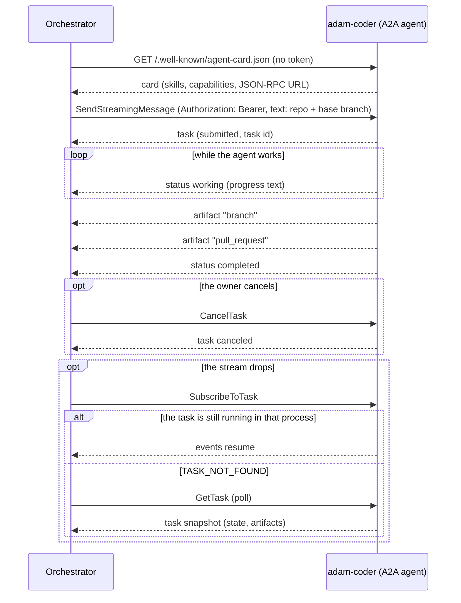
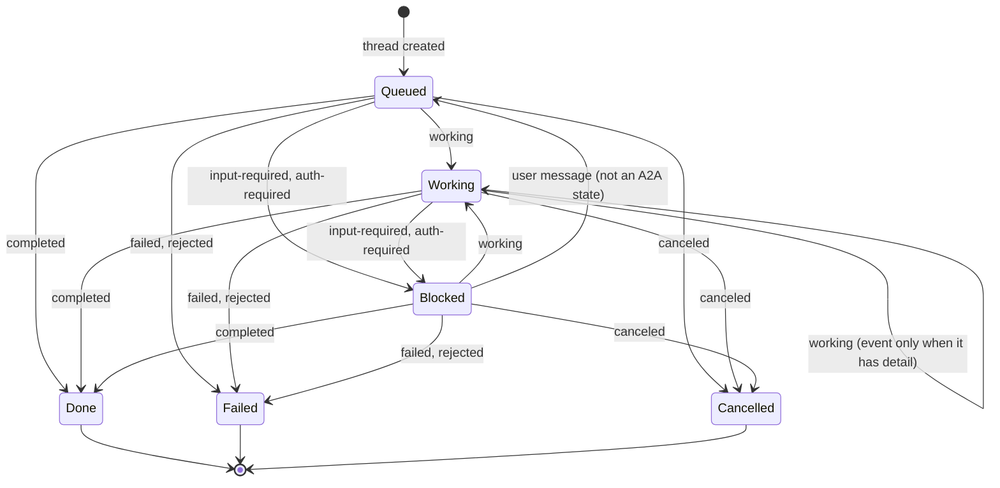

# ADR 0014 — adam-coder is the default agent, over plain A2A

- **Status:** accepted (2026-09-29). Amended (2026-10-01): decision 5 also covers the coder's agent folder, and the agents that are only a folder run from the same pinned image (status notes at the end).

## Context

The chat needs one agent that does real coding work before the rest of the agent fleet exists. The
owner decided on 2026-09-29: "Use the A2A route, coder as default agent."

`adam-coder` (in [`vymalo/another-adam-rs`](https://github.com/vymalo/another-adam-rs)) is an A2A 1.0
agent that clones a repository, works on a branch, runs checks, pushes and opens a pull request.

- **It is already an A2A agent.** It serves its card at `/.well-known/agent-card.json` (public),
  takes JSON-RPC at its public URL with a bearer token, and advertises no extensions. Nothing in the
  orchestrator needs to change to drive it.
- **The orchestrator has no notion of a default agent.** `AGENTS_FILE` is a YAML list of
  `{id, name, cardUrl, tokenEnv?}`; the agent directory and `App::list_agents` keep its order, and
  the chat UI preselects the first
  (`list[0]` in `web/src/features/agents/components/new-thread-panel.tsx`).
- **Invariants.** [ADR 0007](0007-protocol-only-dependencies.md): no dependency on an agent host or
  its SDK. [ADR 0008](0008-platform-integration-via-a2a-extension.md): host conveniences are optional
  and read live from the card. [ADR 0005](0005-openai-compatible-model-endpoint.md): models sit behind
  one OpenAI-compatible endpoint, on the agent's side.

## Decision

1. **The coder is an agent like any other:** an entry in `AGENTS_FILE` with its card URL and a
   `tokenEnv` naming the variable that holds its bearer token. The orchestrator takes **no crate
   dependency** on adam-rs and no code path is specific to it.
2. **The default agent is the first `AGENTS_FILE` entry.** `GET /api/agents` returns the agents in
   configuration order and clients preselect the first. There is no `default` field and no
   `DEFAULT_AGENT` variable.
3. **The default fails closed.** If the default agent's card cannot be read, it stays in first
   place, listed without its live details (no description, no release picker). It is never
   replaced by the next agent in the list; a thread that targets it fails or waits like any thread
   whose agent is down.
4. **The task input is the chat text.** The first message names the repository and the base
   branch; the orchestrator sends it as the A2A message text and adds nothing coder-specific.
5. **The dev stack and CI run the published coder image**, pinned by tag **and** digest, beside mocks
   (model endpoint, GitHub, git server) vendored from the same adam-rs commit as the image. This is
   the plan for a later PR, not part of this one.

The thread follows the task through the pure transition function
(`orchestrator/crates/core/src/transition.rs`, `status_input`). A2A `submitted` changes nothing;
`rejected` is `failed` with a `rejected:` prefix on the detail; a terminal thread accepts no
further agent input.

## Alternatives rejected

- **A `default: true` field in `AGENTS_FILE`, or a `DEFAULT_AGENT` variable.** A second way to say
  what list order already says, with new startup errors (none or two defaults, a default that names
  no agent). Kept as an [open question](../open-questions.md) (#23) in case order proves too implicit.
- **Routing the coder through another-agentic-platform.** It would add a hosting layer the coder
  does not need to be reached; the platform stays an optional agent host
  ([ADR 0008](0008-platform-integration-via-a2a-extension.md)).
- **Fetching the mocks at runtime** (from the adam-rs repository when the stack starts). The dev
  stack and CI would depend on a live network and a moving branch. They are vendored from the pinned
  commit, and a drift check compares them with upstream.
- **Building the coder from source in CI.** It compiles a large Rust workspace on every run to
  test an image that is already published; the pinned image is the artifact that gets deployed.

## Consequences

- **Any orchestrator deployment can make the coder its default** by listing it first; no code
  changes, no adam-rs types in this repository.
- **Heavy image:** about 2.9 GB, `linux/amd64` only. The `app` compose profile pulls it, so it is
  opt-in and not started by the default checks.
- **Host versus compose:** the coder's card advertises its `PUBLIC_URL`, which in compose must be
  `http://coder:8080/`. An orchestrator running on the host reads the card fine but cannot reach that
  URL, so it must run in the same compose network.
- **No `ListTasks`:** adam-coder does not support it, so `find_task_by_message` returns `None`
  (`AgentError::Unsupported`). If the orchestrator crashes after sending a message and before
  recording the task binding, the retry sends the message again and the coder starts a second run
  (a second branch). A rare window, but a real one, until adam-rs supports `ListTasks` or accepts an
  idempotency key.
- **The pull request URL** is in a JSON data part of the `pull_request` artifact, not a URL part, so
  the chat shows JSON rather than a link until adam-rs emits a URL part.
- **Required elsewhere (later PRs):** the dev stack and CI wiring of decision 5, and an end-to-end
  script against the chat API.

## Verified

- *Verified 2026-09-29* (this repository, at `15164aa`): the order of `AGENTS_FILE` is kept by the
  agent directory and by `App::list_agents`, the web preselects `list[0]`, and the thread mapping above is
  `orchestrator/crates/core/src/transition.rs` (`status_input`, `blocked`, `agent_input`).
- *Verified 2026-09-29* (`orchestrator/crates/agent-a2a/src/client.rs`): the adapter uses
  `SendStreamingMessage`, `SubscribeToTask`, `GetTask` and `CancelTask`, and treats an unsupported
  `ListTasks` as "no task found".
- *Verified 2026-09-29* (adam-rs at commit `172a117`, per the planning notes; `deploy/coder/` in
  adam-rs shows the same variables): card public, bearer via `A2A_BEARER_TOKENS`, no extensions,
  the card advertises `PUBLIC_URL`, `ListTasks` unsupported, `branch` and `pull_request` artifacts
  as JSON data parts.
- *Verified 2026-09-29* (anonymous pull from `ghcr.io`, per the planning notes):
  `ghcr.io/vymalo/another-adam-rs/coder:sha-172a117` is about 2.86 GB, `linux/amd64`, runs as uid
  10001; the image has no `latest` tag.
- *Unverified:* that a compose stack with this image passes end to end; that is what the later PR
  proves.

### Status note, 2026-09-29: the entry shape gains an optional `transport`

An `AGENTS_FILE` entry is now `{id, name, transport?, cardUrl, tokenEnv?}`. `transport` names how the
orchestrator reaches the agent; the only value is `a2a`, and it is the default when the key is absent, so every
file written for this decision stays valid. Any other value, `local` included, is a startup error that names the
choices. The default-agent rule is unchanged: the first entry, in file order, whatever its transport. This is
migration step 11 of [ADR 0015](0015-control-plane-and-workers-on-adam-rs.md), which adds the closed
`AgentTransport` enum behind the key.

- *Verified 2026-09-29* (`orchestrator/bin/orchestrator/src/config.rs`, its unit tests): an absent key and
  `transport: a2a` give the same endpoint; `transport: local` is refused with a message that names `a2a`.

### Status note, 2026-09-29: `transport: local`, and `cardUrl` becomes optional

An `AGENTS_FILE` entry is now `{id, name, transport?, cardUrl?, tokenEnv?, agent?}`. `transport` is `a2a` (still the
default when the key is absent, so every file written for this decision stays valid; `cardUrl` is required for it)
or `local`, an agent hosted in the orchestrator's own process (`agent` names its kind, `cardUrl` and `tokenEnv` are
refused). A `local` entry is refused at startup with `LocalAgentsNotCompiled` (exit 78) until a build has local
agents. The default-agent rule is unchanged: the first entry, in file order, whatever its transport. This is
migration step 12 of [ADR 0015](0015-control-plane-and-workers-on-adam-rs.md), first part.

- *Verified 2026-09-29* (`orchestrator/bin/orchestrator/src/config.rs`, its unit tests): an `a2a` entry without a
  `cardUrl` is an error, `agent` on an `a2a` entry is an error, a `local` entry with a `cardUrl` or `tokenEnv` is an
  error, an unknown or missing `agent` is an error listing the kinds, and a valid `local` entry is refused with
  `LocalAgentsNotCompiled` in this build and becomes `AgentEndpoint::local` when the build has its kind (tested
  through the parser's injected predicate).

### Status note, 2026-09-30: `transport: local` is served by a build with `agent-local`

The Cargo feature `agent-local` now exists ([ADR 0015](0015-control-plane-and-workers-on-adam-rs.md), migration step 12,
third change). In a build with it, a `local` entry becomes `AgentEndpoint::local` and its agent runs in the orchestrator's
process; in the default build it is still refused with `LocalAgentsNotCompiled` (exit 78), and the message now says to build
with `--features agent-local`. The default agent, `adam-coder`, stays a plain A2A agent.
- *Verified 2026-09-30* (`bin/orchestrator/src/config.rs`, its unit tests in both flavours, and
  `bin/orchestrator/tests/smoke.rs`, `transport_local_exits_78_naming_agent_local`).

### Status note, 2026-10-01: the dev stack also vendors the coder's agent folder

Decision 5 vendors what the published image needs beside it, from the same adam-rs commit as the image. Since adam-rs
`7b2d8f9` ([#57](https://github.com/vymalo/another-adam-rs/pull/57), MVP slice 1 of [`docs/mvp.md`](../mvp.md)) the coder reads
its agent folder (instructions, card, name) at startup from `ADAM_AGENT_DIR` instead of only from the copy embedded in the
image, and the folder is part of what the stack runs. So the vendored set now includes it: `dev/coder/agent/` is a byte-for-byte
copy of `bin/adam-coder/agent/` at the commit in `dev/coder/UPSTREAM`, `compose.yaml` mounts it read-only at `/etc/adam/agent` and
sets `ADAM_AGENT_DIR` there (`CODER_AGENT_DIR` points the mount at a copy; `compose.live.yaml` keeps the same environment variable),
and `dev/coder/check-vendored.sh` compares each file and checks that no file is missing or extra, exactly as for the mocks.
Nothing else of the decision changes: the image is still pinned by tag and digest at that commit, the coder is still a plain A2A
agent, and the orchestrator knows nothing of the folder (it reads the card of the restarted coder when it delegates). A change to the
instructions is made upstream and moved here with the commit and the pin; to try one here first, mount a copy
([`dev/README.md`](../../dev/README.md#change-what-the-coder-says)). The coder's card name is now `Coder` (was `adam-coder`); only the
orchestrator's logs read it, and `dev/agents.yaml` names the agent itself.

- *Verified 2026-10-01* (anonymous ghcr API): `coder:sha-7b2d8f9` is one `linux/amd64` manifest, uid 10001, entrypoint
  `tini -- adam-coder`, label `org.opencontainers.image.revision` `7b2d8f95ffd9abe8af990bd79d7d690e8183c392`, digest
  `sha256:aa84305a...` (the sha-256 of the manifest the registry returned). `dev/coder/check-vendored.sh` passes against
  `raw.githubusercontent.com` and the GitHub tree API at that commit.
- *Unverified where this was written* (no coder image was pulled; the Coder E2E workflow runs it): the coder container on this
  mount, `dev/greeting-e2e.sh` and `dev/agent-folder-e2e.sh` against it, and how a live model follows the new instructions.

### Status note, 2026-10-01: agents that are only a folder run from the same pinned image

Since adam-rs `f882b91` ([#58](https://github.com/vymalo/another-adam-rs/pull/58), MVP slice 2 of [`docs/mvp.md`](../mvp.md)) the coder's image
also carries `adam-agent`, a second binary that serves any agent folder over A2A (instructions, card, skills, subagents, the tools of an
`mcp.json`); it has no image or package of its own (a new GHCR package is private until its owner makes it public). The dev stack runs a chat and
a researcher with it, beside the coder, and decision 5 covers them the same way:

- **One pin, one commit.** `compose.yaml` writes the image once (`x-adam-image`, tag `sha-<7>` and digest) and the coder and the agents that are
  folders take it by alias, so they can never be two adam-rs commits; `dev/coder/check-vendored.sh` asserts the tag is the commit in
  `dev/coder/UPSTREAM` and fails on a second pin.
- **The folders are ours, not vendored.** `dev/agents/chat/agent/` and `dev/agents/researcher/agent/` are this repository's agents, not copies of
  upstream files (upstream's own example, `dev/agents/assistant`, and its `mock-assistant` model are not vendored). They follow the persona convention of
  adam-rs's `bin/adam-agent/README.md`, and their model is the WireMock `mock-model` (`dev/wiremock/model/`), also ours.
- **The orchestrator is unchanged.** The chat and the researcher are two more entries of `AGENTS_FILE` (a card URL and a `tokenEnv`), after the
  coder, which stays the default agent (decision 2). No code path is specific to them.
- **Several agents, one database.** They share `agents-postgres`: adam-rs scopes a run by the agent's name. The coder keeps its own database.

How to add one: [`dev/README.md`](../../dev/README.md#add-a-fourth-agent-by-writing-a-folder).

- *Verified 2026-10-01* (anonymous ghcr API): `coder:sha-f882b91` is one `linux/amd64` manifest (2.88 GB of compressed layers), uid 10001,
  entrypoint `tini -- adam-coder`, label `org.opencontainers.image.revision` `f882b910b620ea583130a0517b4e52c5f7939179`, digest
  `sha256:7c549618...` (the sha-256 of the manifest the registry returned); adam-rs's `coder` workflow smoke-tested `adam-agent` in it before pushing.
  `dev/coder/check-vendored.sh` passes at that commit. The scenario `agents` passed against real `adam-agent`, `adam-coder` and orchestrator
  processes (debug builds) and the WireMock model mock; the details are in the last section of `dev/README.md`.
- *Unverified where this was written* (the image was not pulled; the Coder E2E workflow runs it): the two services in containers and the
  scenario through the `edge`, and how a live model follows the folders' instructions.
