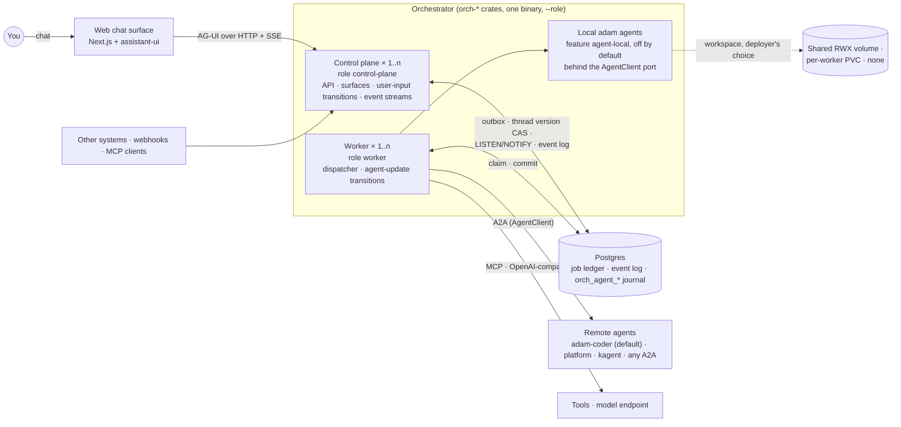
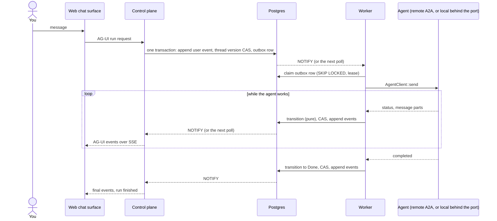
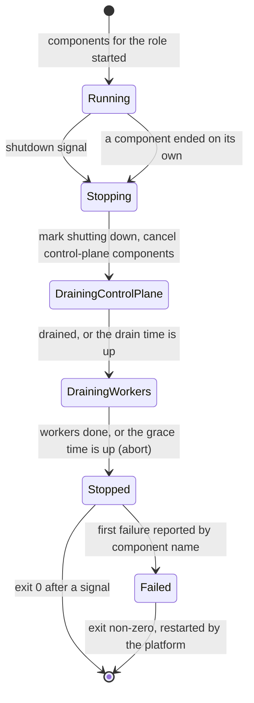

# ADR 0015 — Control plane and workers on adam-rs, with in-process agents

- **Status:** accepted (2026-09-29). Amends [ADR 0001](0001-rust-state-machine-on-postgres.md)
  (the job ledger includes a local agent's journal) and
  [ADR 0007](0007-protocol-only-dependencies.md) (a worker may host adam agents in-process, behind a
  Cargo feature). Both carry a dated note that points here.

## Context

The owner decided the following on 2026-09-29.

- **adam-rs is a library, and any host app embeds it.** In the owner's words: "eve.dev is just a
  library, NestJS is the app." adam-rs must fit any backend structure. It also ships a convenience
  binary, `adam-coder`. adam-rs is [`vymalo/another-adam-rs`](https://github.com/vymalo/another-adam-rs).
  This repository is one of its hosts.
- **The control plane and the runtime workers are decoupled.** One control plane and N workers, or
  more, deployed apart.
- **The roles are an enum in adam-rs.** This repository reuses it and only says which role a
  process runs.
- **In-process ("local") adam agents in an orchestrator worker are wanted, including agents that run
  tools and sandboxes.** The owner chose this over the more conservative option (sandbox-free agents
  only).
- **Agents with a filesystem need a workspace.** Where it lives is the deployer's choice: "A worker
  can do the work, it can own a folder, it can have an isolated pvc, it can use only a2a."

What the code does today:

- `orchestrator/bin/orchestrator/src/boot.rs` starts the HTTP server and the dispatcher in one process
  and stops them by hand: it marks the process as shutting down, stops the server, then the
  dispatcher, each bounded by a grace time. The first half to end takes the process down.
- The two halves already talk only through Postgres: the outbox, the thread version
  compare-and-swap (CAS), and `LISTEN/NOTIFY` ([ADR 0001](0001-rust-state-machine-on-postgres.md)).
  Nothing else couples them.
- `AgentClient` in `orch-ports` is the only way the orchestrator talks to an agent. Its one
  implementation, `orch-agent-a2a`, speaks A2A.
- The word "control plane" already names the Next.js chat app in this repository's docs.
- [ADR 0014](0014-adam-coder-default-agent-over-a2a.md) makes `adam-coder` the default agent over
  plain A2A, with no crate dependency on adam-rs.
- [Lesson 1](../lessons-from-agent-canvas.md): one pod ran the UI, the API and every agent's builds.
  A single `cargo build` starved the API and the pod headed for a restart.

The adam-rs side of this decision is its own ADR 0001, "Library first: host roles in `adam-host`".
It is in that repository at `docs/decisions/0001-library-first-host-roles.md`.

## Decision

1. **adam-rs is a library that hosts embed.** This repository is a host. It uses adam-rs by
   git dependency and does not fork or vendor it.
2. **Two roles, decoupled.** A process is a control plane, a worker, or both. A deployment runs
   one control plane and N workers, or more of each. Nothing forces them onto one machine.
3. **The role is one closed enum, `Role`, owned by adam-rs.** It lives in the new `adam-host`
   crate: `All` (default), `ControlPlane`, `Worker`. `adam-host` also gives a role-aware supervisor,
   `Host`. This repository reuses both and adds no role of its own. It only provides which role a
   process runs: `ORCH_ROLE` or `--role`, default `all`.
4. **Git dependency, pinned to a full commit sha.** `Cargo.toml` names the adam-rs repository and
   a 40-character `rev`. A PR bumps it. Never a branch, never a tag. adam-rs is public, so CI and
   Docker need no token.
5. **What each orchestrator role runs.**

   | Role | Runs |
   |---|---|
   | `control-plane` | migrations, the axum server (health, resource API, the surfaces in `ORCH_SURFACES`), the transitions for user inputs, event streams, thread cards |
   | `worker` | migrations, the dispatcher (with the transition for agent updates), in-process adam agents, a health-only router |
   | `all` (default) | both: today's behaviour |

   **The seam is Postgres.** Outbox, thread version CAS and `LISTEN/NOTIFY` are already the only
   coupling. There is no new protocol between the roles. `transition` stays a pure function that
   both roles call; the CAS decides who wins.
6. **In-process ("local") adam agents are allowed in orchestrator workers, including agents that
   run tools and sandboxes.**
   - They sit behind the existing `AgentClient` port. The implementation is a separate crate,
     `orch-agent-adam`, behind the Cargo feature `agent-local`, **off by default**. It is the only
     crate that depends on adam agent and runtime crates.
   - **Remote agents stay plain A2A.** That includes the `adam-coder` default agent
     ([ADR 0014](0014-adam-coder-default-agent-over-a2a.md)).
   - **State.** A local agent's run state lives in the orchestrator's Postgres, in tables prefixed
     `orch_agent_*`. The job ledger now includes an agent's journal. This was the plan's
     recommended answer; the owner did not separately confirm it. Revisit it before the first local
     agent ships.
   - **This deliberately amends [ADR 0007](0007-protocol-only-dependencies.md).** See
     *What this amends*.
7. **Naming.** "Control plane" now means the orchestrator role. The Next.js app is the **web chat
   surface**. The docs are renamed in this change.
8. **Workspace placement is the deployer's choice (decided in principle).** An agent with a
   filesystem, such as the coder, needs a workspace for a run. adam-rs will offer a closed,
   deployer-selected placement policy. The candidate names are:
   - `Shared`: an RWX volume. Any worker may resume any run.
   - `Affinity`: a run is leased only by the worker that owns its folder.
   - `Isolated`: one PVC per worker. It implies affinity.
   - A2A-only deployments need none of these: the worker only calls remote agents.

   The exact enum and mechanism are follow-up design work in adam-rs, not decided here.
   **The runtime has no run-to-worker affinity today.** A run can be leased by any worker, so with
   per-worker volumes a run may land on a worker that does not have its worktree. Until affinity
   exists, a coder deployment runs one worker, or a shared volume.

### What this amends

**ADR 0007 (protocols only).** The rule was: no dependency on an agent host, gateway product or host
SDK. Two things change.

- `adam-host` is a hard dependency of the orchestrator binary. It is process plumbing (a role enum
  and a supervisor). It has no agent code. It still is a git dependency on a sibling repository.
- adam agents may run inside a worker, behind `agent-local`. That is a real exception: the
  orchestrator can host an agent in its own process. What stays true: a remote agent is an A2A
  agent-card URL, the port has no adam types, and with the feature off nothing from adam agents is
  linked.

**Lesson 1 (control plane and workers are separate).** The decision keeps the two apart, but it
also lets a worker run agent builds and tool calls. A local agent that runs `cargo build`
can starve the process it lives in. That is the failure Lesson 1 described, moved from the pod that
serves the UI to a worker pod. In the default role (`all`) it would still be the same pod as the API,
so `all` is for development. The mitigations:

- The feature is off by default.
- Worker pods are separate from control-plane pods, so a build starves only a worker.
- Resource limits on worker pods.
- Sandboxing is the agent's responsibility, not the orchestrator's.

**ADR 0001 (stateless processes, one event log).** Processes stay stateless. The rule "only the job
ledger and event log persist" now counts a local agent's journal as part of the job ledger. It is
stored in the same Postgres, in `orch_agent_*` tables. No second store.

ADR 0009 stands: `Role` and `Host` are not ports, because no one swaps them. `orch-agent-adam`
implements a port and puts no adam type in its signature.

## Diagrams

The topology. The web chat surface never talks to a worker. Workers never serve users.

One chat turn across the seam. The two roles never call each other.

The lifecycle of one process under the `adam-host` supervisor.

A process that has no component for its role never starts: `Host::run` returns `NothingToRun`.

## Consequences

**Positive**

- The API and the workers scale apart: N control-plane pods for users, M worker pods for agent work.
  A build starves a worker, not the API.
- The hand-written stop logic in `boot.rs` goes away. One supervisor gives one stop order to every
  adam-rs host.
- The role vocabulary is shared with adam-coder. An operator learns `control-plane | worker | all`
  once.
- One process (`all`) still works for development and for small installs. No behaviour change by
  default.
- A local agent gets the orchestrator's durability: its journal is in the same Postgres and the
  same transactions.

**Negative**

- **A coupling to adam-rs.** A bump of the pinned sha is a PR here, and adam-rs changes can break
  the build. The two repositories share one owner today; that is what makes this cheap.
- **Lesson 1 is only mitigated.** A tool-running local agent can hurt the worker that hosts it.
  Nothing in the orchestrator sandboxes it.
- **The orchestrator is no longer a pure protocol layer when `agent-local` is on.** Its supply
  chain, build time and attack surface grow with that feature.
- **Split roles degrade until events cross processes.** Live events, worker wake-up and cancel
  between processes rely on polling until Postgres `NOTIFY` support lands in adam-rs. *Unverified:*
  the `NOTIFY` payload limit of 8000 bytes, from memory.
- **Coder scale-out is limited** (one worker, or a shared volume) until placement exists.
- More configuration to get right: a role per Deployment, secrets per role.

## Alternatives considered

- **A protocol seam between the roles (gRPC, HTTP).** Rejected. Postgres is already the only
  coupling and it is transactional. A new protocol adds a second source of truth, a versioned
  contract, and retry logic for what a CAS already settles.
- **adam-runtime as the orchestrator's engine.** Rejected. It would replace the pure `transition`
  and the job ledger ([ADR 0001](0001-rust-state-machine-on-postgres.md),
  [ADR 0004](0004-closed-enums-over-dyn-registry.md)) with another engine's run model. adam agents
  are hosted behind a port instead, so the orchestrator stays the owner of job state.
- **Separate binaries** (`orchestrator-control-plane`, `orchestrator-worker`). Rejected. Two
  binaries repeat the composition, and `all` for development would need a third. One enum and one
  binary keep it to one build and one image.
- **Sandbox-free local agents only.** Rejected by the owner. It is safer, and it would have kept
  Lesson 1 closed. The owner wants agents that run tools and sandboxes hosted in the worker.
  This ADR records the mitigations instead.
- **Never link adam-rs (A2A only, [ADR 0014](0014-adam-coder-default-agent-over-a2a.md)
  unchanged).** Rejected as the only path. It stays the default: remote agents, `adam-coder`
  included, are plain A2A, and the feature is off. But the role enum and the supervisor would be
  copied into this repository, and the roles would drift.

## Hard to reverse

- **`Role` is public and closed.** A new role breaks every host that matches on it. That is meant,
  and it costs a major version. A role cannot be removed without breaking deployments that set it.
- **`ORCH_ROLE` and `--role` values** (`all`, `control-plane`, `worker`) become part of every
  deployment's manifests.
- **`orch_agent_*` tables.** Once a local agent stores a journal there, the schema needs migrations
  and a retention rule. Moving to a separate database later is a data migration.
- **Hosting agents in a worker.** Once tool-running agents run in worker pods, deployments size
  their nodes and limits for them. Removing the feature is a breaking change for those users.
- **The placement enum**, once it ships in adam-rs, is closed like `Role`.

Easy to reverse: the pinned sha, the `agent-local` feature (off by default), and the split into
pods (`all` still works).

## Migration: PR order

1. **adam-rs:** `feat(adam-host)`: `Role` and the supervisor; its ADR 0001.
2. **This repository:** this ADR, the amendments, the rename to "web chat surface".
3. `refactor(orchestrator)`: `boot.rs` becomes shared setup plus two halves. No new dependency,
   no behaviour change.
4. **adam-rs:** `refactor(adam-coder)`: serve on `adam-host` with `ROLE`; a test with front and
   worker over one database completes a task.
5. **adam-rs:** pin the workspace, fix the `repository` field, move the tokio `test-util` feature
   of `adam-model-openai` to dev-dependencies (the orchestrator will link it).
6. `feat(orchestrator)`: `--role` / `ORCH_ROLE` through `adam-host` by git rev; a health-only
   router for the worker; an end-to-end test with 1 control plane and 2 workers, where a killed
   worker hands over and cancel reaches the agent.
7. Observability and scaling: role and instance log fields, queue metrics for KEDA, trace context,
   a compose `split` profile.
8. **adam-rs:** agent starters, so a control plane needs no model or GitHub secrets.
9. **adam-rs:** Postgres event sink and listener, and worker wake-up over `NOTIFY`.
10. **adam-rs:** deploy manifests: coder front Deployment and worker StatefulSet, one worker until
    affinity exists.
11. `feat(orchestrator)`: an `AgentClient` conformance testkit, a closed `AgentTransport` enum,
    a fence on commit.
12. `feat(orch-agent-adam)`: local agents behind `agent-local` (off), the `orch_agent_*` tables.
13. Later: an `AuthConfig::Custom` in `adam-a2a`; an A2A surface that reuses `adam-a2a`.

The placement policy in adam-rs is separate design work and has no slot here yet.

## Verified

- *Verified 2026-09-29* (adam-rs branch `wt-adam-host`, commit `1e54a5d`, crate `adam-host`): `Role`
  has `All`, `ControlPlane`, `Worker`, with `as_str`, `runs_control_plane`, `runs_workers` and
  `from_optional`. `Host::new(role).control_plane(name, f).worker(name, f)` with
  `control_plane_drain`, `worker_grace`, `health` and `run(shutdown)`. `HostError` names the
  component, and `NothingToRun` is returned when no component matches the role. Features:
  `clap`, `serde`, `supervisor` (default).
- *Verified 2026-09-29* (this repository, `orchestrator/bin/orchestrator/src/boot.rs`): the HTTP
  server and the dispatcher start in one process; the stop order and both grace bounds are written
  by hand there.
- *Verified 2026-09-29* (this repository, `orchestrator/crates/ports/src/agent.rs`): `AgentClient`
  is the one port to agents.
- *Unverified:* that adam-rs can be cloned anonymously by CI and Docker. The owner said the
  repository is public; no anonymous clone was run for this ADR.
- *Unverified:* the dependency and toolchain compatibility of the two workspaces (same major
  versions of `sqlx`, `axum`, `tokio` and the A2A crates; both Rust 1.94, edition 2024; both
  `MIT OR Apache-2.0`). It comes from the planning notes of 2026-09-29, not from a build. PR 6
  proves it.
- *Unverified:* that `NOTIFY` payloads are limited to 8000 bytes.

### Status note, 2026-09-29: migration step 6 built

`orchestrator` takes `--role` / `ORCH_ROLE` through `adam-host` and runs on `adam_host::Host`.

- *Verified 2026-09-29* (this repository, `cargo fetch --locked` with an empty `CARGO_HOME`): cargo
  fetches `adam-host` by git rev from `github.com/vymalo/another-adam-rs` with no credentials. The
  orchestrator toolchain (Rust 1.94.1) builds it. The lock file gains two packages, `adam-host` and
  `adam-error`, and `tokio-util` gains a `futures-io` edge from `adam-host`'s workspace features;
  nothing else moves, so the "same major versions" *unverified* item above holds for what the
  orchestrator links.
- *Verified 2026-09-29* (`orchestrator/bin/orchestrator/tests/smoke.rs`): `--role worker` serves
  only the probes; a `control-plane` process leaves a thread `queued` until a worker process starts;
  with one control plane and two workers, SIGKILL of the worker holding the delegation lets the other
  finish it exactly once.
- *Unverified:* the Docker build with the git dependency (`cargo chef prepare` and `cook`): there is no
  Docker daemon in the environment where this was built. CI's `image` job is the proof.
- `boot.rs` now uses `Host` for the stop order, with the two grace times both set to
  `SHUTDOWN_GRACE_SECS`, so the hand-written supervisor is gone. A cancel sent to the control plane
  reaching the agent through the worker that took a task over after a graceful stop is covered by
  `a_worker_stopped_with_a_running_task_hands_it_over_at_once`; the SIGKILL test with two workers
  finishes the task instead of cancelling it.
