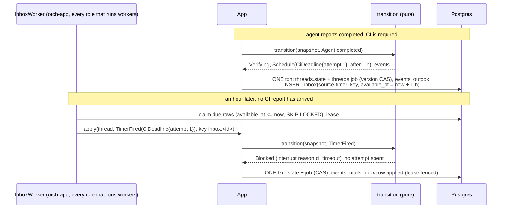
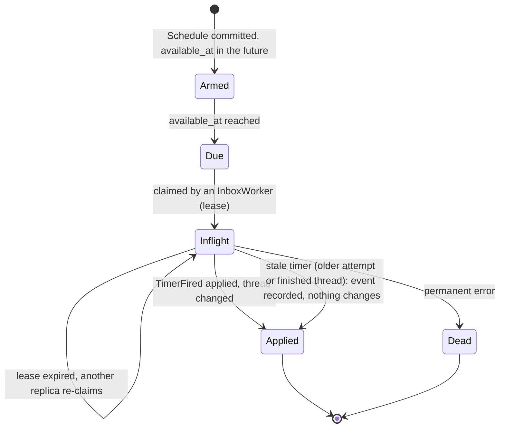

# ADR 0016 — Inbox, timers and the job ledger on the thread

- **Status:** accepted (2026-09-30). This ADR is the design for MVP slices 2 and 5
  ([`mvp.md`](../mvp.md#the-slices-of-steps-2-3-and-6)). **Amended (2026-09-30):** slice 2 (the
  job ledger and the gate in the core) and slice 5 (the inbox, watches and timers) are built; the
  code differs from the sketches below in a few named places, listed under
  [Built in slice 5](#built-in-slice-5).
  **Amended (2026-09-30, the first live run):** the table of the job's rules (section 3) lists the agent's own checks
  among the sources that fail without a pushed commit, and says what a refused `branch` artifact does
  (`Job.branch_problem`); `Job.task` holds the person's messages, not only the first
  ([ADR 0018](0018-verification-gate-and-rework-loop.md#status-note-2026-09-30-the-agents-checks-need-a-pushed-commit)).
  **Amended (2026-09-30, threads never lock):** section 1, "One thread holds one job", no longer holds: a
  thread holds a sequence of jobs and `threads.job` stores the **current** one, with a `number`
  ([ADR 0020](0020-a-thread-is-a-conversation.md)). Still no jobs table: earlier jobs are in the log,
  marked by `job_started`. The MCP `job_id` is still the thread id.
  Refines [ADR 0001](0001-rust-state-machine-on-postgres.md) (the transactional inbox it named, and its
  one ledger). Gives the inbox its first user, the CI webhooks of
  [ADR 0017](0017-ci-results-by-webhook.md); the gate that uses the ledger is
  [ADR 0018](0018-verification-gate-and-rework-loop.md).

## Context

MVP step 2 ends a job as a pushed branch plus a CI result, and step 3 gates the job on checks. Both
need things the code does not have (checked against `a35fa57`, 2026-09-30):

- **A place for state that is not the thread's state.** `threads.state` is a text column with a
  `CHECK` and no payload ([data model](../orchestrator.md#data-model)). A gate needs an attempt
  counter, the pushed commit, the results collected so far and the policy in force.
- **Input nobody asked for.** Today every input is a request handler that runs `transition` inside
  `App::apply` and answers the caller, so a redelivery cannot happen on that path. A CI system
  posts a webhook, may post it twice, may post it before the orchestrator knows which thread it
  belongs to, and gives up after a few seconds. [Verified 2026-09-30](https://docs.github.com/en/webhooks/using-webhooks/best-practices-for-using-webhooks):
  GitHub expects a 2xx "within 10 seconds of receiving a webhook delivery".
- **Time.** A job waiting on CI must not wait forever, and the core must not read a clock
  ([ADR 0001](0001-rust-state-machine-on-postgres.md), invariant 5 in `CLAUDE.md`).
- **A design that was too broad.** [`orchestrator.md`](../orchestrator.md#event-flow) said "every
  input goes through the inbox", MCP included. An MCP caller is authenticated and waits for the
  answer; parking its request in a table buys nothing ([ADR 0019](0019-mcp-server-over-streamable-http.md)).

The owner decided on 2026-09-30 that CI results arrive by webhook in two shapes (ADR 0017), that
the gate is configurable (ADR 0018) and that MCP comes with bearer tokens first (ADR 0019).

## Decision

### 1. The job lives on the thread

One thread holds one job for MVP steps 2 to 6. The MCP `job_id` is the thread id.

> *Amended 2026-09-30 ([ADR 0020](0020-a-thread-is-a-conversation.md)):* a thread holds a **sequence** of jobs, and
> this column holds the current one (`Job.number`, from 1; a ledger without one is job 1). A message on a finished
> thread starts job *n+1* (`Job::next()`: the gate kept, the attempt back to 1, the rest cleared, the verification
> count **not** reset, so a timer or verdict of an earlier job is stale by the comparison below). The history is the
> log (`job_started`), not a table; the reasons that follow still hold.

The ledger is a new column, `threads.job jsonb NOT NULL DEFAULT '{}'`. It is written in the same
commit as `state`, under the same `version` compare-and-swap (CAS). Reasons:

- The owner scope, the AG-UI connect stream and the idempotency keys are already per thread.
- [ADR 0001](0001-rust-state-machine-on-postgres.md) wants one ledger, not a second table to keep
  consistent with the first.
- Step 4's child jobs will get a separate job-snapshot table later. That is a later decision; this
  one does not close it.

### 2. The pure core takes and returns a `Snapshot`

`orch-core` stays pure: no async, no I/O, no wildcard arms in any `match` (ADR 0004). Planned
shapes (names and fields are the design; the code may differ in detail):

```rust
pub struct Snapshot { pub state: ThreadState, pub job: Job }

pub fn transition(s: &Snapshot, i: &Input) -> Result<(Snapshot, Vec<Command>), TransitionError>;

pub struct Job {
    gate: GatePolicy, attempt: u32, pushed: Option<PushedRef>,
    results: Vec<CheckResult>, hold: Option<Hold>,
}
pub struct GatePolicy {
    require: BTreeSet<CheckSource>, max_attempts: u32,
    ci: CiPolicy,                       // required names, timeout
    verifier: Option<AgentId>, verifier_timeout: SignedDuration,
}
pub enum CheckSource { Ci, AgentChecks, Verifier }

ThreadState += Verifying
Input       += CiReported(CiReport) | VerifierReported { attempt, verdict } | TimerFired(Timer)
Timer        = CiDeadline { attempt } | VerifierDeadline { attempt }
Command     += Watch { key } | Schedule { after: SignedDuration, timer }
             | RequestVerification { attempt, verifier, pushed, text }
EventBody   += CiResult
             | CheckResult { source, attempt, status: pending|passed|failed, findings }
             | Rework { attempt, max_attempts, findings }
```

- **The gate policy is copied into `Job` when the thread is created.** A configuration change never
  affects a running job.
- **There is no `Reworking` state.** A rework is `Queued` or `Working` with `attempt > 1`.
- **Two artifacts are recognised by a pure function in the core:**
  - `branch {repository, branch, commit}` sets `pushed` and emits `Watch { ci:<repo-key>@<sha> }`;
  - `checks {passed, commit, summary?, findings?}` is the agent-checks result.
- **Repository keys** are normalised to `host/owner/name`, lower-cased, without `.git`, so the key an
  agent's `branch` artifact produces and the key a webhook produces are the same string.

The transition table, the state diagram and the property tests in `orch-core` grow with these; the
existing rows and the goldens do not change when the gate is empty.

### 3. The loop, as rules of the core

These are the rules `transition` implements. The configuration that fills `GatePolicy` and the
projection to the chat are [ADR 0018](0018-verification-gate-and-rework-loop.md).

| Situation | Result |
|---|---|
| The agent reports `completed` and the gate requires nothing | `Done`, exactly as today. |
| The agent reports `completed` and the gate requires something | `Verifying`. One `pending` `check_result` for each source not yet known; `Schedule(CiDeadline)` if CI is required; `RequestVerification` if the verifier is required. |
| Every required source has passed | `Done`. |
| A source has failed and `attempt < max_attempts` | A `rework` event; `Delegate` with the findings text built in the core; state `Queued`; `attempt + 1`. |
| A source has failed on the last attempt | `Failed`, with the findings in `error` and in `check_result` events. |
| CI, the verifier or the agent's own checks are required and there is no pushed SHA | A failed check: "no pushed commit". *(The agent's own checks joined the list on 2026-09-30, [ADR 0018](0018-verification-gate-and-rework-loop.md#status-note-2026-09-30-the-agents-checks-need-a-pushed-commit): checks on a tree nobody pushed prove nothing; and when the agent did send a `branch` artifact the gate could not use, the finding is its reason, recorded as `Job.branch_problem`.)* |
| A stale timer, or a CI result for an older SHA or attempt | Its event is recorded; nothing else changes. |
| A CI result on a finished thread | Only its card is appended. |
| A user message during `Verifying` | That verification is abandoned and the message is delegated; no attempt is counted. |
| Cancel during `Verifying` | `Cancelled`. |

The timeouts that end in `Blocked` are in [ADR 0017](0017-ci-results-by-webhook.md) (CI) and
[ADR 0018](0018-verification-gate-and-rework-loop.md) (verifier).

### 4. The inbox holds unsolicited machine input, and only that

Its jobs are to answer fast, dedupe redeliveries, and park reports that cannot be matched yet. It
carries webhooks and timers. **MCP does not use it** ([ADR 0019](0019-mcp-server-over-streamable-http.md)),
and neither do AG-UI and the chat API: their idempotency key stays on the event, as today.

Migration `0004` (slice 5) adds two tables:

```
inbox(id, source, idempotency_key, kind, payload jsonb, correlation,
      status pending|inflight|parked|applied|expired|dead,
      available_at, attempts, lease_owner, lease_until, last_error,
      UNIQUE (source, idempotency_key))
watches(key PRIMARY KEY, thread_id)
```

**Timers are inbox rows** with `source = 'timer'` and `available_at = now + after`, so the core
never reads a clock: it asks for a delay with `Schedule` and is handed `TimerFired` when the row is
due.





What the diagrams cannot say:

- **The write path is one commit.** `Commit` gains `watches`, `timers` and `inbox: Option<Lease>`.
  A `Watch` inserts the `watches` row and, in the same transaction, re-arms parked inbox rows with
  that key ([ADR 0017](0017-ci-results-by-webhook.md)). A `Schedule` inserts its timer row. The
  inbox lease is fenced like an outbox lease ([Fenced commits](../orchestrator.md#fenced-commits)):
  a late worker's commit under a stale lease writes nothing.
- **Flow of a webhook row** (the surface authenticates and normalises first, ADR 0017):
  1. `App::receive` inserts the row and returns 202; a duplicate `(source, idempotency_key)` is also 202.
  2. `InboxWorker` claims rows with `SKIP LOCKED` and resolves `correlation` through `watches`.
  3. It applies `App::apply(thread, Input, key = "inbox:<id>")`.
  4. A row that matches no watch is **parked**. A later commit carrying `Watch { key }` inserts the
     watch and re-arms the parked rows in the same transaction.
  5. Parked rows expire after `INBOX_PARKED_TTL_SECS`.
- **No ordering across rows.** The first completed report for each attempt decides. *(Amended 2026-09-30: for CI, only a check the gate names counts, so the first report of a named check decides; see the [ADR 0017 status note](0017-ci-results-by-webhook.md#status-note-2026-09-30-review-fixes).)*
- **Ports.** The methods go on the existing `ThreadStore` (`receive`, `claim_inbox`, `park_inbox`,
  `retry_inbox`, `complete_inbox`), so the commit stays atomic; a second port would need a
  distributed transaction. Conformance cases join `thread_store_conformance!`: dedupe, park and
  re-arm in one transaction, fencing, expiry, a timer not yet due.
- **`InboxWorker`** lives in `orch-app` and runs wherever the dispatcher runs: the `worker` and
  `all` roles ([ADR 0015](0015-control-plane-and-workers-on-adam-rs.md)). A control plane only
  writes rows.

### 5. Machine routes

`SurfaceRoutes::machine(router, guard)` in `orch-api` mounts routes **outside** the oauth2-proxy
identity layer. The `guard` is a required authenticator (an HMAC check, a bearer check), so a
machine route cannot be mounted without one. **Machine routes never read `X-Auth-Request-Email`.**
Today `router_with_surfaces` wraps every route in the identity layer
([Design choices](../orchestrator.md#design-choices)); the machine mount is the one exception, and
it is explicit.

### 6. Secrets

- Stored as `secrecy::SecretString`.
- HMAC is checked with `hmac`'s `verify_slice`; tokens are compared with `subtle` over SHA-256
  digests of both sides.
- `Config`'s `Debug` stays redacted, and a test says so.

## Configuration

| Variable | Default | Meaning |
|---|---|---|
| `INBOX_PARKED_TTL_SECS` | `86400` | How long a report that matches no watch waits before it expires. |
| `INBOX_LEASE_SECS` | `30` | How long an inbox worker's claim on a row lasts (at least 3). A worker that dies holds its rows this long. |
| `INBOX_POLL_SECS` | `2` | Safety poll of the inbox worker when no wakeup arrives (at least 1). Timers coming due are not announced, so a timer fires at most this late. |
| `INBOX_MAX_ATTEMPTS` | `10` | Counted claims of one row before it is dead-lettered (at least 1). A row that keeps failing retryably, or keeps killing its worker (its lease lapses and it is claimed again), ends here; a claim handed back at shutdown, or one that only parked the row, is not counted. |

## Built in slice 5

*Verified 2026-09-30* against the code of this repository (`orchestrator/crates/ports`,
`store-postgres`, `app`; migration `0004_inbox.sql`). Where it differs from the sketch above:

- **The inbox claim is its own type.** `Commit.inbox` is an `Option<InboxLease>` (`id: InboxId`,
  `owner`, `attempt`), not the outbox's `Lease`, so an outbox claim can never be presented as an
  inbox one. The fence is the same: the row must be `inflight`, held by `owner`, at exactly
  `attempt`; a commit under any other claim writes nothing and answers `Fenced`, before the
  version is looked at. The commit marks the row `applied` in the same transaction.
- **A payload is a closed enum.** `InboxPayload` is `Timer { thread, timer }` or `CiReport(..)`,
  stored as JSON tagged by `kind` (which the table's `kind` column repeats, with a `CHECK`).
  `App::receive(source, idempotency_key, payload)` takes the payload and derives the kind. A CI
  report's correlation is never the caller's: it is always the watch key `ci:<repo-key>@<sha>`,
  built from the report's own repository and sha after `repo_key` and lower case, the form a watch
  is written in (`https://github.com/O/R.git` and an upper-case hash reach the watch of
  `github.com/o/r`). Otherwise a surface could route a report, and the untrusted summary in it, to
  any thread. `receive` refuses (`Invalid`) the source `timer`, a timer payload (only the store
  makes timers), an empty or oversized field, a `source` or key that is not printable ASCII (both
  reach spans and logs), and a report whose repository or sha cannot make a watch key: it could
  never match, so it is refused instead of parked until it expires.
  A claimed row hands the worker the payload as JSON; the worker decodes it, so a row this build
  cannot read is dead-lettered on its own and never spoils the batch it was claimed with.
- **Parking re-checks the watch.** `park_inbox` answers `Parked`, `Rearmed` or `Lost`. Between a
  worker finding no watch and parking, a commit may add the watch; that commit sees only `parked`
  rows, so it would leave this one behind. In Postgres both take a transaction-scoped advisory
  lock on the watch key (adding a watch, and parking) and `park_inbox` looks again under it, so
  the row goes back to `pending` (`Rearmed`) instead. Two tests take the lock by hand in a
  transaction, start the real call on the other side (the park, then the commit), wait until
  `pg_locks` shows it blocked on the key, and let go, once for each order; each failed with the lock
  taken out (verified 2026-09-30). The random 40-round race they replace proved less. The window
  between the worker's `get_watch` and its park is tested at the application level with a store
  that lands a commit in it.
  This is not a proof that nothing here can deadlock, and the code no longer says so: a stale
  `park_inbox` holds a key and can wait for a row that the commit of the worker that took the row
  over holds, while that commit wants the key. Postgres detects the cycle and aborts one side
  (`40P01`, mapped to a transient error the caller retries). The statements that lock several
  parked rows (the re-arm in a commit, and the expiry) take them in id order with
  `FOR UPDATE SKIP LOCKED`, so they never wait for a row lock.
- **More port methods than the five named:** `expire_parked_inbox` (the worker calls it with
  `now - INBOX_PARKED_TTL_SECS`), `release_inbox_leases` (shutdown), `get_watch`, and the
  inspection pair `get_inbox` and `find_inbox`. The store computes a timer's `available_at` from
  the commit's `now` plus `after`; the timer's key is `<thread>:<kind>:<attempt>:<verification>`
  under source `timer`, and inserting it twice (a replayed commit, or the same deadline armed by
  another commit) is one row.
- **Columns beyond the sketch:** `inbox.parked_at` (the time-to-live counts from parking, not
  from receipt), `refunded` (see *Attempts*), `created_at`, `updated_at`; `watches.created_at`,
  and `watches.thread_id` references `threads` (a thread takes its watches with it). A key already
  watched by another thread keeps that thread: the first to watch it wins, and the Postgres store
  logs a warning naming both threads (the memory store logs nothing; the ports crate has no
  logger).
- **Attempts.** `attempts` is the fencing token and only goes up. `INBOX_MAX_ATTEMPTS` limits the
  *counted* claims, `attempts - refunded`. A claim handed back at shutdown
  (`release_inbox_leases`) is refunded, and so is every claim up to the one that ended in a park
  (or found the watch there, `Rearmed`), or up to the re-arm of a parked row by a commit: waiting for
  a watch is not failing. A lapse and a retry stay counted. Retryable failures are counted when the
  worker sees them, but a worker that panics or is killed with the row in hand sees nothing, so
  before delivering a row the worker gives up on it if `counted > max_attempts` (dead-lettered
  with the number of claims that ended without an answer). Both stores keep the same semantics
  (`inbox_counts_only_the_claims_that_failed`).
- **An input that changes nothing** still finishes its row through `ThreadStore::commit`: a commit
  that carries the inbox claim and nothing else (`Commit::only_finishes_inbox`) and the thread's
  current state checks the claim and `expected_version`, marks the row `applied` and leaves the
  thread alone (no version bump, no `updated_at`, no wakeup). A bare `complete_inbox` there would
  have written "nothing to do" as final on a thread that may have moved since, and a later input
  kind could have been dropped silently. `complete_inbox` remains for `Dead`, and for a repeat
  (`Duplicate`: the input's event is in the log already).
- **Wakeups.** A received or re-armed row sends `NOTIFY orch_inbox` (`Topic::Inbox`) inside its
  transaction. A timer is not announced when it comes due: the worker polls.
- **The worker** is `InboxWorker` in `orch-app`, registered as its own worker component
  (`the inbox worker`) next to the dispatcher in the `worker` and `all` roles. It expires old
  parked rows, claims a batch, and for each row builds the `Input` (`TimerFired` from the payload's
  thread; `CiReported` from the thread the watch names, or parks), applies it with
  `App::apply_from_inbox` (key `inbox:<id>`), and on a retryable error puts the row back with
  a doubling backoff until `INBOX_MAX_ATTEMPTS` counted claims. Permanent errors (a missing thread, an unreadable
  payload) dead-letter the row at once. On shutdown it finishes the row in hand and releases its
  claims. `tick()` runs one pass so tests can drive it without timing.
- **`RequestVerification` was dropped** by the application until slice 10, which turns it into an outbox row of kind `verify` (see [ADR 0018, Built (slice 10)](0018-verification-gate-and-rework-loop.md#built-slice-10)).
- **Not decided here, and now open:** how long applied, expired and dead rows are kept (they are
  what makes a redelivery a duplicate, so purging them is a retention decision;
  [open question 29](../open-questions.md#open)), and what a watch key shared by two threads
  should do ([open question 30](../open-questions.md#open)).

## Security notes

- Machine routes are the only routes without the identity layer. Each one is fail closed: the guard
  runs on the raw body before any write ([ADR 0017](0017-ci-results-by-webhook.md)).
- The inbox stores payloads that came from outside. A payload is data: CI summaries flow into the
  rework prompt only as quoted, untrusted text ([ADR 0018](0018-verification-gate-and-rework-loop.md)).
- A webhook cannot approve or merge anything. A `CiReported` input can add a check result and
  nothing else; `transition` decides by input, not by who is connected.
- Secrets never appear in logs, `Debug` output or the inbox `payload`.

## Consequences

**Easier**

- Redelivered webhooks are harmless; a report that arrives before its watch is not lost.
- Time is data: tests advance an injected clock, replay stays deterministic.
- A worker crash mid-inbox costs latency, not correctness (the lease lapses, another replica takes
  the row).
- The chat and MCP still see one thing: the thread and its event log.

**Harder**

- `transition`'s signature changes from `(&ThreadState, &Input)` to `(&Snapshot, &Input)`. Every
  table test and property test in `orch-core` is touched. This is why slice 2 is the large one.
- `threads.job` is a `jsonb` blob owned by the core's serde shapes: a change to `Job` is a
  compatibility question for rows already written.
- One thread, one job. Step 4's parallel child jobs need another table and another decision.
- Migrations `0003` (slice 2) and `0004` (slice 5) are fixed now; parallel slices must not claim
  those numbers.

## Alternatives considered

- **A separate `jobs` table now.** Rejected: a second row to commit in step with the thread, and the
  owner scope, connect stream and idempotency keys would all have to be re-derived from the job.
  Step 4 will need a job-snapshot table for child jobs; that is the moment to add it.
- **Every input through the inbox, MCP too** (the earlier design in `orchestrator.md`). Rejected: the
  MCP caller is authenticated and waits; the inbox would only add a hop and a place for the answer
  to get lost ([ADR 0019](0019-mcp-server-over-streamable-http.md)).
- **Apply webhooks synchronously in the request.** Rejected: the sender's deadline is 10 s and a
  slow commit or a CAS conflict would turn into a failed delivery; and a report that beats its
  watch would have nowhere to wait.
- **A clock in the core** (`now()` inside `transition`). Rejected: it breaks purity and replay.
  Timers as inbox rows keep the core a function of its inputs.
- **A dedicated timer table.** Rejected: an inbox row already has availability, a lease, retries and
  a status; a second mechanism would repeat them.
- **A second port for the inbox** (`InboxStore`). Rejected: the write of the inbox row's completion
  must be in the thread's commit. Two ports would mean two transactions.

## Hard to reverse

- **`transition`'s signature and `Snapshot`.** Every caller and test depends on them.
- **The `threads.job` column and the serde shape of `Job`.** Rows written under it must be read
  forever, or migrated.
- **The `inbox` `UNIQUE (source, idempotency_key)`** and the idempotency key formats
  (`github:<delivery>`, an external contract once senders rely on them; `inbox:<id>` for applied rows).

Easy to reverse: the parked TTL, the defaults, and the choice to put the worker in every role.

## Verified

- *Verified 2026-09-30* (this repository at `a35fa57`): migrations `0001_init.sql` and
  `0002_ui_events.sql` exist and `threads.state` and `events.kind` are text columns with `CHECK`s;
  there is no `inbox`, `watches` or timer table; the outbox kinds are `delegate` and `cancel`.
  Widening a `CHECK` is a whole migration (`0002` did it for the UI events).
- *Verified 2026-09-30*: GitHub expects a 2xx response within 10 seconds of receiving a delivery.
  Source: <https://docs.github.com/en/webhooks/using-webhooks/best-practices-for-using-webhooks>.
- *Unverified*, checked in the slice that uses each: that `hmac`'s `verify_slice` compares in
  constant time; the current version of `secrecy`; the behaviour of `SKIP LOCKED` claims under the
  `available_at` ordering at the volumes of a real deployment.
- *Unresolved detail for slice 2:* a user message that abandons a verification does not count an
  attempt, so the next verification can carry the same `attempt` number as the abandoned one. A
  `CiDeadline { attempt }` left over from the abandoned verification would then look current. Slice
  2 must tell the two apart (for example with a verification counter in `Job`) and add a
  transition-table row and a property test for it.
