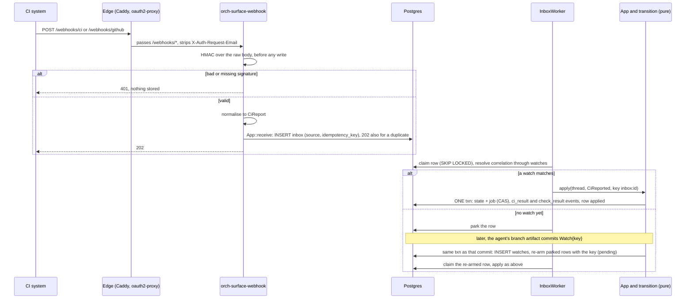
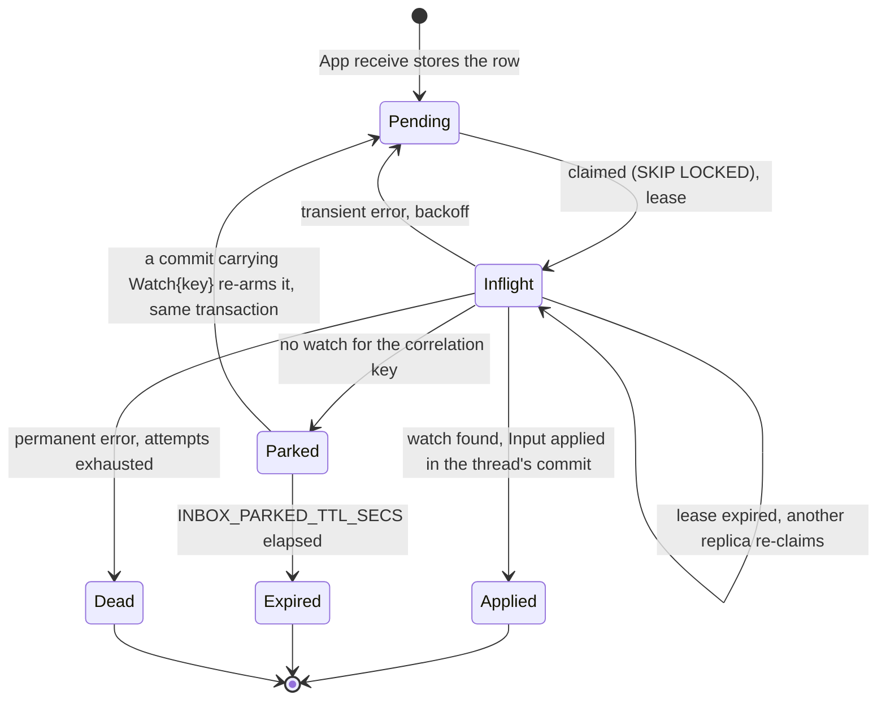

# ADR 0017 — CI results by webhook: GitHub and a generic signed shape

- **Status:** accepted (2026-09-30). **Built:** MVP slice 6 (the generic route, `SurfaceRoutes::machine`, the CI
  source in the gate), 2026-09-30; see [Built (slice 6)](#built-slice-6). **Planned, not built:** slices 7 and 8
  (the card) and 9 (the GitHub adapter) ([`mvp.md`](../mvp.md#the-slices-of-steps-2-3-and-6)).
  Uses the inbox of [ADR 0016](0016-inbox-timers-and-job-ledger-on-the-thread.md); feeds the gate of
  [ADR 0018](0018-verification-gate-and-rework-loop.md). The wire contract is
  [`api/webhooks.md`](../api/webhooks.md).

## Context

MVP step 2 ends a job as "a pushed branch plus a CI result card". The agent pushes the branch
(`adam-coder` emits a `branch` artifact); the CI result is somebody else's fact and reaches the
orchestrator from outside. The owner decided on 2026-09-30 to accept **both** a GitHub adapter (HMAC
on the raw body) **and** a generic signed shape, so that a CI that is not GitHub Actions can report
without pretending to be GitHub.

[ADR 0002](0002-verification-over-consensus.md) says quality is decided by an external judge and
that a job is never "done" while its checks are red. CI is that judge; this ADR is how its verdict
arrives.

## Decision

A new crate, **`orch-surface-webhook`**, implements two inbound surfaces. `ORCH_SURFACES` gains two
names, and the binary gains the Cargo feature `surface-webhook`, **on by default**:

| Surface name | Route | Authenticates with |
|---|---|---|
| `webhook-github` | `POST /webhooks/github` | `X-Hub-Signature-256`, HMAC-SHA-256 of the raw body |
| `webhook-generic` | `POST /webhooks/ci` | `X-Vymalo-Signature-256`, HMAC-SHA-256 of `"<ts>.<body>"` |

Both are **machine routes** ([ADR 0016](0016-inbox-timers-and-job-ledger-on-the-thread.md), decision 5):
mounted outside the identity layer, never reading `X-Auth-Request-Email`. Each does the same three
things, in this order: check the HMAC on the raw body before any write; normalise the payload to a
`CiReport`; hand it to `App::receive`, which stores an inbox row and answers 202.

### GitHub

- `X-Hub-Signature-256` is checked on the raw body. Missing or bad: **401, and nothing is stored.**
- `ping` answers **204**.
- `check_suite`, `check_run` and `workflow_run` with `action = completed` become a
  `CiReport { provider, repo_key, sha, branch, name, conclusion, url, summary }`, where `repo_key`
  comes from `repository.html_url`, `sha` from `head_sha`, `branch` from `head_branch`, and `name`
  from `app.slug` (suite), the check name (run) or the workflow name (workflow run).
- Any other event answers **202 and is not stored.**
- Idempotency key: `github:<X-GitHub-Delivery>`.

### Generic

- Headers: `X-Vymalo-Delivery` (a UUID, the idempotency key); `X-Vymalo-Timestamp` (Unix seconds,
  within plus or minus `WEBHOOK_GENERIC_MAX_SKEW_SECS`); `X-Vymalo-Signature-256`
  (`sha256=` + hex `HMAC(secret, "<ts>.<body>")`).
- Body: `{version: 1, repository: <url>, sha: <40 hex>, branch?, name, conclusion, url?, summary?}`.
- The signed timestamp bounds replay; the delivery id makes a replay inside the window harmless.
- The full contract, with a worked signature, is [`api/webhooks.md`](../api/webhooks.md).

### Common rules

- **Conclusions are a closed enum** (ADR 0004). `success`, `neutral` and `skipped` pass; everything
  else fails.
- **Which reports count.** When `CiPolicy.required` (a list of check names, from the target's
  `gate.ci.required`) is set, only reports with those names count and all of them must pass.
  Otherwise the first completed report decides. **Every report gets a card** in the chat, counted
  or not.
- **Matching is by watch, not by branch.** A report is applied to the thread that holds
  `Watch { ci:<repo-key>@<sha> }`, set when the agent's `branch` artifact was applied. A report for
  an unknown key is parked, and applied when the watch appears.
- **Timeout.** After `ORCH_CI_TIMEOUT_SECS` with the required reports missing, the thread goes to
  `Blocked` with interrupt reason `ci_timeout`. **It does not spend an attempt**; the user can
  answer, or cancel.
- **Secrets.** `WEBHOOK_GITHUB_SECRETS` and `WEBHOOK_GENERIC_SECRETS` each hold at most two
  comma-separated secrets, so a secret can be rotated without a gap: a signature is good if either
  matches. A secret variable is **required when its surface is mounted**; otherwise the process
  exits 78 (`ConfigError`), as for an `ORCH_SURFACES` name without its feature.
- **Body limits.** 5 MiB for GitHub, 256 KiB for generic; over the limit answers **413**.

### Configuration

| Variable | Default | Meaning |
|---|---|---|
| `ORCH_SURFACES` | `agui` | add `webhook-github` and/or `webhook-generic` to mount them |
| `WEBHOOK_GITHUB_SECRETS` | none | one or two comma-separated secrets; required with `webhook-github` |
| `WEBHOOK_GENERIC_SECRETS` | none | one or two comma-separated secrets; required with `webhook-generic` |
| `WEBHOOK_GENERIC_MAX_SKEW_SECS` | `300` | accepted difference between `X-Vymalo-Timestamp` and the clock |
| `ORCH_CI_TIMEOUT_SECS` | `3600` | how long a job waits for CI before `Blocked` (`ci_timeout`); a target's `gate.ci.timeoutSecs` overrides it |
| `INBOX_PARKED_TTL_SECS` | `86400` | how long an unmatched report waits ([ADR 0016](0016-inbox-timers-and-job-ledger-on-the-thread.md)) |

One deployment-wide secret per surface, with rotation, is the default chosen; per-repository
secrets are not part of this decision.

### Diagrams

The path of a report, including one that beats its watch (parked, then re-armed):

The state of one inbox row:

## Built (slice 6)

*2026-09-30.* The generic route, `SurfaceRoutes::machine`, the CI source of the gate and `ORCH_CI_TIMEOUT_SECS` are
built and checked against the code (`orchestrator/crates/surface-webhook`, `api`, `app`, `core`; the binary). The
GitHub route (`webhook-github`, `POST /webhooks/github`) is slice 9 and is not mounted: `webhook-github` is not yet a
name `ORCH_SURFACES` knows. Where the build differs from, or fixes, the text above:

- **The guard is the signature check.** `SurfaceRoutes::machine(routes, guard)` mounts routes outside the identity
  layer and outside the request timeout, and takes the guard as a required argument, so a machine route cannot be added
  without one. The webhook's guard is a middleware that reads the body up to the route's limit, checks the headers, the
  timestamp and the HMAC, and only then hands the handler the verified bytes in a request extension; a handler that
  finds none refuses. The order is: the three headers (401), the timestamp is plain digits and within the skew (401),
  the body within 256 KiB (413), the HMAC (401). Nothing is written before the HMAC is good, and the handler cannot be
  reached without it.
- **The clock is the application's.** The skew is judged against `App`'s injected clock, so a test that holds the clock
  sees the same window the route does.
- **Delivery ids are UUIDs.** `X-Vymalo-Delivery` must parse as a UUID (else 400, after the signature). It is stored
  in its hyphenated lower-case form, so the two spellings of one UUID are one delivery. The inbox `source` is `generic`.
- **The timestamp is `[0-9]{1,12}`.** A sign, a blank or a fraction is a 401. This keeps the signed string
  `"<ts>.<body>"` unambiguous (a timestamp with a full stop could trade bytes with the body).
- **The conclusions of the generic body are the eight of `api/webhooks.md`.** The core's enum also has
  `startup_failure` (GitHub's `workflow_run` can say it); slice 9 maps it, the generic body refuses it with a 400.
- **Only `http` and `https` links are kept**, and a summary is cut to 16 KiB at a character boundary.
- **`ORCH_CI_TIMEOUT_SECS` is read** (default 3600, at least 1) as the deployment's `ci.timeout`; an `AGENTS_FILE`
  entry's `gate.ci.timeoutSecs` overrides it for that agent. A gate that requires `ci` while no webhook surface is
  mounted on a control plane logs a warning at startup; its jobs end `Blocked` (`ci_timeout`), never `Done`.
- **Secrets are required by the role that serves the route.** `WEBHOOK_GENERIC_SECRETS` unset while `ORCH_SURFACES`
  names `webhook-generic` is exit 78 for `all` and `control-plane`; a `worker` serves no routes and does not need it
  (a value that is set is validated in every role). More than two secrets is exit 78 too. The variable is redacted in
  `--help` and in `Debug`, and the value is never in a message or a log.
- **`ping` and the GitHub events** are slice 9.
- **The gate honours `ci`.** `pending_reason(Ci)` is `None`; the `ci` and `ci:` settings are accepted in a deployment or
  an `AGENTS_FILE` entry (never per thread); `verifier` is still refused until slice 10 ([ADR 0018](0018-verification-gate-and-rework-loop.md)).
- **The core needed no change.** `ci_result` cards, the CI source and the CI deadline to `Blocked` (no attempt spent)
  were built in slices 2 and 5; the slice's end-to-end tests (`orch-e2e` `webhook.rs`, both stores, a clock the test
  holds) drive them through the real route: a report that beats its watch is parked, matched and the job done; a red
  report reworks with the report in the findings, and a report about the old commit changes nothing; with no report the
  deadline blocks the thread; a refused delivery changes nothing.
- **Reproducing the vectors.** The known-answer vectors are in [`api/webhooks.md`](../api/webhooks.md#known-answer-vectors)
  and in the unit tests of `signature.rs`.

## Security notes

- **Verify before any write.** The HMAC is over the raw bytes as received, not a re-serialised
  body. A missing or wrong signature is 401 and touches no table.
- **Constant-time comparison** through the HMAC library's verify function; never `==` on hex.
- **Replay.** GitHub's delivery id is unique per delivery; the generic shape signs a timestamp and
  rejects one outside the skew window, and its delivery id dedupes inside it.
- **Untrusted text.** `summary` and `name` come from the outside. They are shown in a card, and
  they flow into a rework prompt only as quoted, untrusted data ([ADR 0018](0018-verification-gate-and-rework-loop.md)).
  A report can fail a check or pass it; it cannot start a job, approve a review or merge.
- **Edge.** The edge must route `/webhooks/*` to the orchestrator **without** an identity header:
  the compose stand-in uses `header_up -X-Auth-Request-Email`. Production routing (oauth2-proxy
  `skip_auth_routes`) is *unverified* and checked in slice 6.
- **The GitHub relay.** For a local stack, an opt-in relay (smee.io) is a third party that sees the
  payloads; it is off unless configured and is told to the owner (slice 13).
- Secrets are `SecretString`, redacted in `Debug`, absent from logs.

## Consequences

**Easier**

- Any CI can report with a small signed POST; GitHub Actions needs only a webhook.
- A duplicate delivery, an early report and a slow worker are all harmless.
- The chat shows every report as a card, whether or not it decides the gate.

**Harder**

- A report cannot be matched without the agent's `branch` artifact: a coder that pushes without
  emitting one leaves reports parked until they expire. The watch key is the commit, not the branch.
- The orchestrator must be reachable from the CI system (a public route, or a relay). The webhook
  is inbound.
- Two secret variables and two body schemas to keep in step with `api/webhooks.md`.
- GitHub webhook payloads are assumed to match the REST schemas' field names; slice 9 records real
  fixtures to settle it.

## Alternatives considered

- **Polling the checks API.** Rejected: it needs an outbound GitHub credential per repository and a
  poll loop with backoff, ties the orchestrator to one provider, and is slower than a push.
- **Matching a report to a thread by branch name.** Rejected: branches are reused and force-pushed;
  a report for an older commit of the same branch would be applied to a newer attempt. The commit
  SHA is the identity; a stale SHA is recorded and changes nothing.
- **Applying the report synchronously in the request.** Rejected: GitHub's 10 s deadline, CAS
  conflicts, and no place for a report that arrives before its watch. See ADR 0016.
- **Only a GitHub adapter, or only the generic shape.** Rejected by the owner's choice of both:
  GitHub is the common case and its signature is fixed; the generic shape covers everything else
  with a body we control.
- **One secret per repository.** Not chosen; a deployment-wide secret with rotation is the default.
  Revisit if a deployment serves mutually distrusting repositories.

## Hard to reverse

- **The route paths and the header names** (`/webhooks/github`, `/webhooks/ci`, `X-Vymalo-*`): CI
  configurations elsewhere will hold them.
- **The generic body schema, `version: 1`**, and the signed string `"<ts>.<body>"`. A change is a
  `version: 2` with its own route or negotiation, never an edit.
- **The idempotency key formats** (`github:<delivery>`, the generic delivery UUID).
- **The conclusion enum.**

Easy to reverse: limits, the skew window, the timeout and the TTL.

## Verified

- *Verified 2026-09-30*: `X-Hub-Signature-256` is `sha256=` plus the hex HMAC-SHA-256 of the raw
  payload, compared in constant time. Source:
  <https://docs.github.com/en/webhooks/using-webhooks/validating-webhook-deliveries>.
- *Verified 2026-09-30*: the headers `X-GitHub-Event` and `X-GitHub-Delivery`, the 25 MB payload cap
  and the event actions. Source:
  <https://docs.github.com/en/webhooks/webhook-events-and-payloads>. (The 25 MB cap is why the
  GitHub body limit here, 5 MiB, is a choice, not GitHub's.)
- *Verified 2026-09-30*: the check run `conclusion` values are `success`, `failure`, `neutral`,
  `cancelled`, `skipped`, `timed_out`, `action_required`, `stale` (and null while running). Source:
  <https://docs.github.com/en/rest/checks/runs>.
- *Verified 2026-09-30* in the REST schemas (check suites, workflow runs): `head_sha`,
  `head_branch`, `conclusion`, `repository.html_url`. That the **webhook** payloads are identical to
  the REST ones is *unverified*; slice 9 records real fixtures. Whether `workflow_run` can carry a
  conclusion outside the list above (for example `startup_failure`) is *unverified*; such a value
  fails closed as `failure`.
- *Verified 2026-09-30* (adam-rs `882e239`): `adam-coder` emits `branch {repository, branch,
  base_branch, commit}` and `pull_request {…}` artifacts, so the watch key can be built from it.
- *Verified 2026-09-30* (slice 6), reading the source: `hmac` 0.13.0 re-exports `digest` 0.11.3's `Mac`, whose
  `verify_slice` checks the length and then compares with `subtle`'s `ct_eq` (`digest-0.11.3/src/mac.rs`). It is
  constant-time in the tag; the length of a tag is public.
- *Verified 2026-09-30*: oauth2-proxy has the option `--skip-auth-route` / `skip_auth_routes` ("bypass authentication
  for requests that match the method & path. Format: method=path_regex OR method!=path_regex. For all methods:
  path_regex OR !=path_regex"). <https://oauth2-proxy.github.io/oauth2-proxy/configuration/overview>. *Unverified*:
  that oauth2-proxy strips a client-supplied `X-Auth-Request-Email` on a skipped route. It does not matter to the
  webhooks, which never read it, and the compose edge deletes it (`header_up -X-Auth-Request-Email`).
