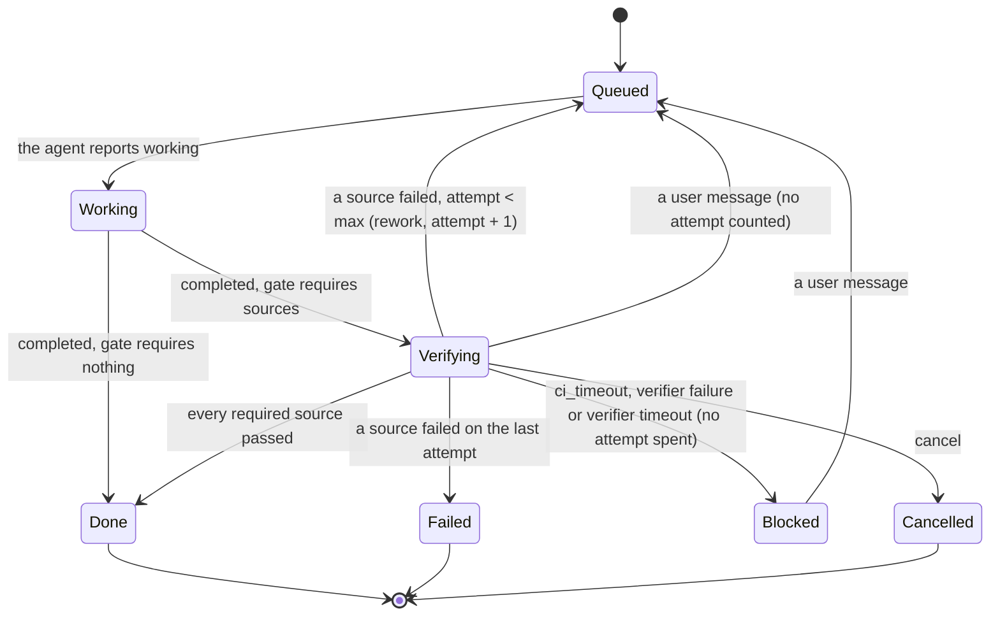

# ADR 0018 — Configurable verification gate and a bounded rework loop

- **Status:** accepted (2026-09-30). **Built:** MVP slice 2 (the core), slice 3 (configuration and
  the AG-UI projection) and slice 4 (the web), 2026-09-30, for the agent-checks source; see *Built
  (slice 3)* and *Built (slice 4)* below; and slice 10, 2026-09-30, the verifier agent (see *Built
  (slice 10)* below). Slices 5 and 6 (the inbox, and the CI webhook that makes `ci` a source this build honours) are
  built too, see *Updated (slice 6)*.
  **Amended 2026-09-30 (review of slices 6, 7 and 9):** a gate that requires `ci` must name its
  checks, and `ci` is honoured only where a webhook is mounted, see the
  [status note](#status-note-2026-09-30-review-fixes); "the first completed CI report decides" below is superseded.
  **Amended 2026-09-30 (the first live run):** the agent's own checks pass only on the pushed commit, see the
  [status note](#status-note-2026-09-30-the-agents-checks-need-a-pushed-commit), which also has the rework prompt
  carry the person's request.
  **Planned, not built:** the web's card for CI (slice 8)
  ([`mvp.md`](../mvp.md#the-slices-of-steps-2-3-and-6)).
  Refines [ADR 0002](0002-verification-over-consensus.md) (how "verify" and "budgets" are made
  concrete). Closes [open question 8](../open-questions.md#closed) and answers part of question 6
  (attempts; wall clock for the waits on CI and the verifier). Builds on
  [ADR 0016](0016-inbox-timers-and-job-ledger-on-the-thread.md) (the ledger and the loop's rules)
  and [ADR 0017](0017-ci-results-by-webhook.md) (CI results).

## Context

[ADR 0002](0002-verification-over-consensus.md): an external judge decides quality, the loop is
work, verify, rework with findings until green, bounded by budgets, and a job never ends "done"
while its checks are red. MVP step 3 is that loop. Open question 8 asked where verification runs:
real CI arriving by webhook, or a verifier agent over A2A; the proposed answer was to gate on real
CI and allow a verifier for inner loops.

The owner decided on 2026-09-30:

- **The gate is configurable** over three sources: CI on the pushed SHA, checks the agent reports
  itself, and a verifier A2A agent.
- **Attempts:** 3 by default, configurable.

adam-coder does not report its checks today. *Verified 2026-09-30* (adam-rs `882e239`): it emits
`branch` and `pull_request` artifacts, and `run_checks` emits **no** artifact. The agent-checks
source therefore needs a cross-repository change (a `checks` artifact), approved as part of this
choice. Until it lands, the coder's dev gate is CI only.

## Decision

### Sources, ports, aggregation

The sources are a closed enum, `CheckSource`: `Ci`, `AgentChecks`, `Verifier`. **There is no new
port**: the aggregation (which sources are required, which have passed, whether to rework) is pure
core logic in `orch-core`, the rules of [ADR 0016](0016-inbox-timers-and-job-ledger-on-the-thread.md#3-the-loop-as-rules-of-the-core).

| Source | Evidence | Arrives as | Passes when |
|---|---|---|---|
| `Ci` | Reports on the pushed SHA ([ADR 0017](0017-ci-results-by-webhook.md)) | `Input::CiReported` | the `CiPolicy` says so: all required names pass. *(The first completed report used to pass when no name was required; superseded 2026-09-30, see the status note.)* |
| `AgentChecks` | The agent's `checks {passed, commit, summary?, findings?}` artifact | the artifact, recognised in the core | `passed` is true **and** a commit was pushed **and** the checks ran on exactly that commit. *(Without a pushed commit they used to pass; superseded 2026-09-30, see the second status note.)* |
| `Verifier` | A verifier A2A agent's `verdict {passed, findings[]}` artifact | `Input::VerifierReported` | `passed` is true |

Two rules from the loop that matter here:

- A required source with nothing to check counts as failed rather than pending forever. With no
  pushed SHA, CI and the verifier fail with "no pushed commit". With `AgentChecks` required and no
  `checks` artifact by the time the agent completes, it fails with "no checks reported". *(Since 2026-09-30 the
  agent's checks need a pushed commit too: with none they fail with "no pushed commit", like the other two.)*
- A failed source ends the round at once: the thread reworks (or fails) without waiting for the
  others. A result that arrives later for an older SHA or attempt is recorded and changes nothing.

### The verifier

- `RequestVerification` becomes a new **outbox kind, `verify`**, with a new column
  **`outbox.task_id`** (migration `0003`, slice 2). The dispatcher sends to the verifier's endpoint
  in a context of its own, `<thread>-verify-<attempt>-<verification>` (*amended 2026-09-30, slice 10:
  the text first said `<thread>-verify-<attempt>`; see Built (slice 10)*), so the verifier's A2A context
  is separate from the worker's.
- The dispatcher **never maps a verifier's envelopes to `Input::Agent`**: a verifier is not the
  worker, and its "completed" must not complete the job. It emits exactly one
  `Input::VerifierReported`, from a `verdict` artifact `{passed, findings[]}`. No verdict is a
  failed check with "no verdict".
- A verifier failure, or `ORCH_VERIFIER_TIMEOUT_SECS`, puts the thread in **`Blocked`**, not
  `Failed`: the verifier being down is not the code's fault, and it does not spend an attempt.
- The verifier is another configured agent (`AGENTS_FILE`); it never receives the worker's
  credentials.

### Configuration

Three layers, from widest to narrowest. Each layer may only tighten the one above.

| Layer | Where | What |
|---|---|---|
| Deployment | env | `ORCH_GATE` (comma list, e.g. `ci,agent-checks`; **default empty**, which is today's behaviour), `ORCH_MAX_ATTEMPTS` (`3`), `ORCH_MAX_ATTEMPTS_CAP` (`10`), `ORCH_VERIFIER` (agent id), `ORCH_VERIFIER_TIMEOUT_SECS` (`1800`), `ORCH_CI_TIMEOUT_SECS` (`3600`, [ADR 0017](0017-ci-results-by-webhook.md)) |
| Target | an `AGENTS_FILE` entry | `gate: {require: […], maxAttempts, verifier: <agent id>, ci: {required: […], timeoutSecs}}`, parsed with `deny_unknown_fields`. The verifier must be another configured agent, checked at startup (a bad reference is exit 78) |
| Thread | AG-UI `forwardedProps["vymalo.gate"]`; MCP `start_job.gate` | A thread may **add** sources and change attempts up to `ORCH_MAX_ATTEMPTS_CAP`; it may **not remove** a source its target requires |

The gate in force is resolved when the thread is created and copied into `Job`
([ADR 0016](0016-inbox-timers-and-job-ledger-on-the-thread.md)); a running job never sees a later
configuration change.

Defaults chosen (the owner's decisions, and the plan's defaults): the gate is empty; 3 attempts,
capped at 10; a timeout blocks the thread rather than spending an attempt; without `ci.required`,
the first completed CI report decides *(superseded 2026-09-30: a gate that requires `ci` must name its checks, see the status note below)*; a per-thread gate can add sources but not remove them.

### Findings

- Findings are capped at **20 items and 16 KiB per source**.
- They are **quoted as untrusted data** in the rework prompt (delimited, and labelled as coming
  from a check, not from the user): a CI summary or a verifier's text is input from outside.
- The findings text is built in the core, so it is the same on every replica and in every replay.

### Projection to the chat

AG-UI ([ADR 0012](0012-ag-ui-user-facing-protocol.md); the mapping tables in
[`api/agui.md`](../api/agui.md) gain these rows when built):

- A run stays open while the thread is `Queued`, `Working` or `Verifying`.
- `completed` into verifying emits `SUBAGENT_FINISHED` and a `STATE_SNAPSHOT` (the thread plus
  `job {attempt, maxAttempts, gate, sha}`), **not** `RUN_FINISHED`.
- `check_result` becomes the activity `vymalo.check`.
- `rework` becomes `vymalo.rework`, then `SUBAGENT_STARTED` for the next attempt.
- The verifier appears as its own subagent.
- `Done` gives `RUN_FINISHED` with success. Out of attempts gives `RUN_ERROR` with
  `code: "checks_failed"`.

`chat-api.yaml`: `Thread.state` gains `verifying`, plus an optional `job`. Two new goldens,
`verify-green` and `verify-red`, are read through the reference client in CI. The web shows a
`verifying` badge, an attempt counter such as "2/3", findings per source and a "reworking" divider.

### Diagrams

One job, from the agent's completion to green, through one rework:

`Queued` and `Working` also reach `Blocked`, `Failed` and `Cancelled` exactly as in
[Thread state](../architecture.md#thread-state); the diagram shows only what the gate adds. What it
cannot say: a `Blocked` thread that the user answers is delegated again **without** a new attempt
number, because the timeout was not the worker's failure; an out-of-attempts `Failed` carries the
last findings in its `error` event.

## Built (slice 3)

*2026-09-30.* What the code does, where it refines the text above:

- **Configuration** is one rule set, `GateRules` in `orch-app` (`gate_config.rs`): the binary applies the
  deployment variables and every `AGENTS_FILE` entry with it at startup, and `App` applies the entry and the
  request when a thread is created; `App::new` checks the deployment's policy and every entry again, so another
  composition root cannot hand it a gate the build cannot honour (it returns an error; the binary exits 78). A layer is
  `{require?, maxAttempts?, verifier?, ci?}`. What "each layer may only tighten the one above" comes to in code:
  sources can only be added (`require` is the whole list and must contain the one above's; `ci.required` names
  add up), and attempts can be anything in `1..=ORCH_MAX_ATTEMPTS_CAP` (at most 100), lower or higher than the
  layer above's. The one removal allowed is the entry of the verifier itself leaving the `verifier` source out for
  itself, because an agent cannot verify its own work; an agent whose own gate does not require the verifier may be
  the verifier. A thread may set only `require` and `maxAttempts`, and spells a source `agent-checks` or
  `agent_checks`. A default `ORCH_MAX_ATTEMPTS` is lowered to a smaller `ORCH_MAX_ATTEMPTS_CAP`; one that is set must fit.
  The verifier of every agent's resolved gate must be a configured agent.
- **This build honours only `agent-checks`** *(as slice 3 left it; it honours `verifier` as well since slice 10, see Built (slice 10), and `ci` since slice 6, see Updated (slice 6))*. The application still drops `RequestVerification` (slice 10; `Watch` and `Schedule` are executed since slice 5, but no
  surface writes CI reports until slice 6), so a gate that required `ci` or `verifier` would wait for a verdict
  that never comes. Configuration **refuses** those sources, and the `ci` and `verifier` settings, in every layer,
  and says which slice enables them: startup exits 78 (`ORCH_GATE`, `ORCH_VERIFIER`, an `AGENTS_FILE`
  entry), a request is a 400. This is fail-closed: a job is never "done" without a check the operator required.
  `pending_reason` in `gate_config.rs` is where the sources are listed, and `GateRules::honouring` how a build (or a
  test) says it has more. It is **not** the only thing a later slice changes: the slice that makes `verifier` real also
  owns its checks (`GateRules::check_verifier`, the verifier's own entry) and its cards, and the one that makes `ci` real
  owns the `ci` settings and the watch keys.
- **Not built yet:** `ORCH_CI_TIMEOUT_SECS` and `ORCH_VERIFIER_TIMEOUT_SECS`, which only matter once CI and the
  verifier can be required (slices 6 and 10); the per-target `ci.timeoutSecs` is accepted by the parser and refused
  with the rest of the `ci` settings. *(Update 2026-09-30: slice 10 reads `ORCH_VERIFIER_TIMEOUT_SECS` and honours the
  verifier, see below; the rest of this paragraph and the one before it are as slice 3 left them, for the `ci` source.)*
  *(Update 2026-09-30: `ORCH_CI_TIMEOUT_SECS` and the per-target `ci.timeoutSecs` are read since slice 6, see Updated (slice 6).)*
- **Projection:** as above. The gate reaches the projection through `ThreadMeta.gate` (the job's copy, fixed when the
  thread was created); everything else is folded from the log. The `vymalo.check` card of a source in an attempt
  has a stable id, `check-<attempt>-<verification>-<source>`, and is `replace: true` (a second verification of the
  same attempt is a card of its own); `vymalo.rework` is `rework-<attempt>`; a rework opens the next attempt's
  subagent at once. `job` is in `STATE_SNAPSHOT` and in `Thread` only under a gate, and its `sha` is the pushed
  commit, never the commit a check ran on. A hold (`error{retryable}` then `blocked` while verifying) is an
  answerable interrupt, not `delivery_failed`.
  Goldens: `verify-green` (red once, then green), `verify-red` (three attempts, `checks_failed`).
- **A rework is a new A2A task in the same context**, because the first task is `completed`; `orch-e2e` pins it.
- **The gate is fixed at creation**, and a run that continues a thread and asks for another is a 409 (`orch-surface-agui`),
  not a silent no-op.

## Built (slice 4)

*2026-09-30.* The web (`web/`) renders the gate; it invents nothing, so each thing below is read from the stream:

- **The badge** has a `verifying` state (its own colour and label, "Verifying", spoken as "Verifying the agent's
  work"), and the composer offers Cancel while it lasts.
- **The attempt counter** ("Attempt 2/3", spoken as "Attempt 2 of 3") sits beside the badge whenever the newest
  `STATE_SNAPSHOT` (or, before the stream, `Thread.job`) carries a `job`; a thread without a gate shows none.
- **`vymalo.check`** is a card per source and attempt (status in words, source, short commit, summary and findings),
  replaced in place by its id; a `stale` one is its own muted card. **`vymalo.rework`** is a divider, "Attempt 2 of 3:
  sent back with 1 finding". Findings, summaries and names are untrusted and drawn as text: never as markdown or HTML;
  a long finding is cut with an expand control.
- **`RUN_ERROR` `checks_failed`** is kept by the stream's agent and shown as "Checks failed after 3 attempts" where an
  ordinary finished thread says "This thread is failed".
- The mock replays both goldens (and `verify-pass`, and the mock-only `verify-ci` and `verify-wait`, which need the CI
  source of slices 5 and 6); the system tests run the fake agent's `verify-*` scripts through the real orchestrator.
  Rules and tests: [`web/README.md`](../../web/README.md#verification-the-gate).
## Updated (slice 6)

*2026-09-30.* **This build honours `ci` and `agent-checks`; `verifier` is still refused until slice 10.**
`pending_reason(CheckSource::Ci)` is `None`: the CI webhook ([ADR 0017](0017-ci-results-by-webhook.md)) writes
reports into the inbox that slice 5 built, so a gate that requires `ci` can be decided. The `ci` source and the `ci`
settings (`ci.required`, `ci.timeoutSecs`) are accepted in the deployment (`ORCH_GATE`, `ORCH_CI_TIMEOUT_SECS`) and in
an `AGENTS_FILE` entry, and refused per thread as before (`ci` cannot be set by a request; `require: [ci]` can be
added by one). `verifier` and its setting are refused in every layer with the slice that enables them. Whether a
deployment can *receive* reports is `ORCH_SURFACES`: a `ci` gate with no webhook mounted is not refused (another
replica group may serve the webhooks), it ends `Blocked` (`ci_timeout`) after the timeout, and a control plane warns
at startup.

## Built (slice 10)

*2026-09-30.* The verifier is a real source. What the code does, where it refines or departs from the text
above:

- **The request.** `RequestVerification` is an outbox row of kind `verify` (`OutboxPayload::Verify`: the attempt,
  the verification, the verifier's id, what was pushed and the prompt the core wrote). It is written in the same
  commit as the `Verifying` transition and the `VerifierDeadline` timer, so it cannot be lost or made twice. A
  `verify` row is **not ordered** like a delegation: it is not held back by the delegate whose completion caused it
  (still being finished), and it holds back none.
- **The context is `<thread>-verify-<attempt>-<verification>`**, not `<thread>-verify-<attempt>` (a *deviation*
  from the text above, which had only the attempt). A user who writes during a verification, or a hold the user
  answers, makes the worker finish again in the same attempt, and the verification that follows is a new one: it must
  not land in the A2A context of a verification that is over. The job's `verification` counter is unique per job,
  so the context is unique too. `orch_core::verifier_context` builds it.
- **What the verifier is sent** (the core writes it, `verifier_prompt`): the commit (a hash, the one thing outside a
  fence), the attempt ("attempt 2 of 3"), how to answer (a `verdict` artifact), and three quoted blocks, each in a
  fence the text cannot close and labelled as data, not instructions to the verifier: where the worker says it pushed
  the commit (its repository and its branch), the task as the user wrote it, and what the worker said about its work
  (its last final message in this attempt; the text of its `completed` replaces that when it is not blank; at most
  4 KiB; `Job.summary`, kept only under a gate that requires the verifier and forgotten at a rework). Everything the
  worker controls is inside a fence, and the branch is also refused unless git would accept it
  (`git check-ref-format --branch`: no whitespace, control characters or any of `` ` `` `~` `^` `:` `?` `*` `[` `\`, no
  `..`, `@{`, empty component, leading `-`, trailing `/`, `.` or `.lock`, at most 255 bytes); an artifact with another
  branch is logged as malformed and pushes nothing. The repository is the ledger's normalised key (`host/owner/name`,
  no scheme: what `repo_key` makes of the address the worker reported), not the address as the worker wrote it; a
  verifier that needs a clone URL builds it from the host. It never receives the worker's credentials: it is another
  configured agent with its own `tokenEnv`.
- **The task is on the row.** `outbox.task_id` holds the verifier's A2A task once its first envelope arrived
  (`ThreadStore::mark_verify_sent`, fenced by the claim and never touching the thread's binding, which is the
  worker's). A re-claimed row re-attaches to that task (`resubscribe`, then `get_task`); one that crashed between
  sending and recording looks the message up by its id (`find_task_by_message`, tried up to three times when the
  lookup itself fails) and sends the request again only when the lookup answers that there is no such task. **The
  verifier is asked at most once when it supports `ListTasks`;** otherwise (the lookup cannot be answered) the row is
  retried and, in the end, the thread is held for the user rather than asking again, and the unique context and
  `messageId` are what lets a verifier that saw the request twice tell. A resubscription yields the rest of the
  stream, not what came before it, so a task that completes there without a verdict is read with `get_task` (its
  artifacts) before "no verdict" is concluded: a verdict streamed before a crash is not lost.
- **Envelopes are read, not applied.** The dispatcher's verify path reads the verifier's stream and never maps it to
  `Input::Agent`. It keeps the latest `verdict` artifact and, when the task ends its turn, feeds exactly one input:
  `Input::VerifierReported` when it completed (no `verdict` is `Verdict::missing()`, one that cannot be read
  (`passed` not a boolean, `findings` not a list, not JSON, over 256 KiB) is `Verdict::unusable(why)`: both fail the
  check, fail closed, and say "no verdict"), or `Input::VerifierFailed` when it failed, was rejected or cancelled, asked
  for input nobody can give, could not be reached after the delegation's retries, refused the request, or is no
  longer configured. **`VerifierFailed` is new** (*a deviation*: the text had the dispatcher reuse `DeliveryFailed`,
  which carries no verification, so a late failure of a verification that is over could have held a thread that had
  moved on). It names the attempt and the verification like the verdict does, and holds the thread
  (`Hold::VerifierFailed`, `Blocked`, no attempt spent) only when that verification is the one waiting.
- **Findings are capped where they are read** (`parse_verdict`: 20 items and 16 KiB, a finding that is not a string is
  kept as its JSON) and again where the verdict is applied, and they reach the worker only quoted as untrusted.
- **Stale answers** change nothing except a stale `check_result`: the verdict is applied under the key
  `verdict:<row>` (one verdict is one event whoever applies it, a replay is `Duplicate`), carries its attempt and
  verification, and the core compares both. The row also watches its thread (`DispatcherConfig::verify_watch`,
  5 s): when the verification is no longer the one in progress (a timeout, a cancel, a message from the user, another
  source that already failed the round) it asks the verifier to stop (`CancelTask`, best effort, when it has the
  task's id) and ends the row `skipped`, so a verifier that hangs does not hold a worker for ever. The look happens
  between two envelopes or two polls, never in the middle of a write: a request that has been sent is recorded
  before anything else, and a verdict that is being committed is finished, not cancelled. `ORCH_VERIFIER_WATCH_SECS`
  (5, at least 1) sets how often.
- **The wait is bounded by the core's timer.** `ORCH_VERIFIER_TIMEOUT_SECS` (1800, at least 1; `GatePolicy`'s
  `verifier_timeout`, deployment-wide) is armed as a slice 5 timer by the `Schedule` the core emits with the request;
  when it fires the thread is `Blocked` with `Hold::VerifierTimeout`, the attempt is not spent and the row is dropped
  as above.
- **Fencing.** Every write of the path is fenced with the outbox claim, like the delegation path: recording the send,
  the retries, the verdict or failure (`App::apply` with the lease), the end of the row. A worker that lost its claim
  writes nothing; `orch-app`'s tests pin it with a claim taken over while the verifier answers.
- **Configuration.** `pending_reason` no longer refuses `verifier`: `ORCH_GATE` may name it, `ORCH_VERIFIER` and the
  `verifier` key of an `AGENTS_FILE` `gate` are read, and `ORCH_VERIFIER_TIMEOUT_SECS` is read; the other rules of
  slice 3 stand (a verifier must be a configured agent, a thread may require it but not choose it, and an agent whose
  resolved gate requires the verifier cannot be the verifier itself, whether by the same id or by another id for the
  same card URL, unless its own entry leaves the source out). A
  request that requires the verifier is checked against the same rules once it is applied, so a thread that asks for it
  where no verifier is configured, or on the verifier itself, is a 400 before anything is created (not a job that fails its
  check later); the MCP server's `start_job.gate` goes through the same `App::resolve_gate`, so it is refused the same way.
  `ci` stays refused, with its settings, until slices 5 and 6 of the CI plan land.
- **Projection.** The verifier is a subagent of its own, named after the verifier agent, with the stable id
  `sub-verify-<verification>`: it starts with the `pending` card of the verifier source and ends with its verdict
  (`SUBAGENT_FINISHED` with `result: {"passed": …}`), or, when the verification ends without one (the round was decided
  by another source, the user wrote, the thread was cancelled), with `result: {"status": "canceled"}`, or, when the thread
  was held while the verifier was out and no CI is required (so the hold can only be the verifier's: it failed, was
  refused, or was too slow), with `SUBAGENT_ERROR` (`code: "verifier_failed"`, the hold's message). A client
  that joins while the verifier is out is told about its subagent in the preamble. The verdict is a `vymalo.check` card
  with source `verifier`. Goldens: `verify-verifier-green` (findings once, then green) and `verify-verifier-red`
  (three attempts, `checks_failed`).
- **Not built.** When CI is a required source too, a timeout or a failure of the verifier is still shown to its
  subagent as cancelled, not as failed: the projection cannot tell from the log which source the hold was about, and the
  interrupt says why. CI remains unbuilt; `AgentChecks` still needs adam-coder's `checks` artifact (cross-repository).
- **Dev stack.** `mock-verifier` (WireMock; findings for a commit of forty `a`, a pass for any other), the coder's
  `push-flawed` and `push-clean` keywords, `verifier` and `mock-coder-verified` in `dev/agents.yaml`, and
  `dev/verifier-e2e.sh`.

## Status note (2026-09-30): review fixes

- **`ci` requires `ci.required` names.** Replaces "without `ci.required`, the first completed CI report decides"
  (Decision, *Defaults chosen*) and the `Ci` row of the sources table. With no names the first report for the pushed
  commit decided, so a `skipped` report of another check, another workflow's, or a fork's, passed a red commit
  ([ADR 0017](0017-ci-results-by-webhook.md#status-note-2026-09-30-review-fixes)). `GateRules` now refuses, as a
  `GateError::CiWithoutChecks`, a resolved policy that requires `ci` and names no check: the deployment
  (`ORCH_GATE` without `ORCH_CI_REQUIRED`) and every `AGENTS_FILE` entry at startup (exit 78), a per-thread `require`
  that adds `ci` on a policy with no names as a 400 (or a tool error over MCP). Names union across layers as before, so a
  layer cannot drop the ones above. The core is fail-closed too: with none named, no report counts and the CI deadline
  blocks the job.
- **`ci` is honoured only with a webhook surface.** `GateRules::refusing(Ci, reason)` is how a deployment refuses a
  source of its own: the binary uses it when a process that serves routes mounts neither `webhook-generic` nor
  `webhook-github`, with the reason "no CI webhook surface is mounted (ORCH_SURFACES)", for the deployment, for agents
  and for per-thread requests. Replaces the startup warning of slice 6 ("a `ci` gate with no webhook mounted is not
  refused"). A `worker` serves no routes and honours what the control plane decides.
- **Configuration.** `ORCH_CI_REQUIRED` (comma-separated check names) sets the deployment's `ci.required`.
- **The `vymalo.check` card of source `ci`** carries the summary of the check when exactly one is named.

## Status note (2026-09-30): the agent's checks need a pushed commit

*Why.* On the owner's first live run (real model, real GitHub, `dev/agents.live.yaml`, the coder gated on
`agent-checks`) the owner typed "Hi". The coder answered in plain text and completed; the gate sent it back with "no
checks reported". On attempt 2 the model invented a task on a repository nobody asked for and ran `run_checks` on the
**unchanged** worktree. That produced a passing `checks` artifact bound to the base `HEAD`, no `branch` artifact and
no pushed commit, and the thread ended **Done** ("Attempt 2/3"). Nothing had been produced, and the gate called it
finished.

*What was wrong.* `agent_checks` compared the checks' commit with the pushed one only when **both** existed. With no
pushed commit, or with checks that named none, the comparison was skipped and the checks' own `passed` decided. That
contradicts [ADR 0003](0003-git-as-durable-state-ephemeral-workers.md) (git is the artifact: what the agent did is the
commit it pushed) and this ADR's own table ("`passed` is true for the pushed commit"), and it was the one source of
the three that did not fail closed on a missing push. CI and the verifier already did.

*The rule now.* A job gated on `agent-checks` is done only when the checks passed **on the pushed commit**:

| What the job holds when the agent finishes | The source says |
|---|---|
| no `checks` artifact | failed: "no checks reported" (unchanged) |
| checks, but no pushed commit (no `branch` artifact) | failed: "no pushed commit: the agent reported no `branch` artifact, so there is nothing to check", the same finding CI and the verifier give; if the checks themselves failed, their findings follow it, so the agent sees both |
| checks and a pushed commit, but the checks name no commit | failed: "the checks name no commit, so they cannot be tied to the pushed commit <sha>" (an unreadable `checks` artifact keeps its own reason, which already fails) |
| checks that ran on another commit than the pushed one | failed: "the checks ran on commit A but the pushed commit is B" (unchanged) |
| checks that passed on the pushed commit | passed |

A failed source reworks while attempts are left, so the owner's "Hi" now ends in a rework telling the agent to push
its work, and after the last attempt in `Failed` with that finding, never in `Done`. `transition` stays a pure function:
the change is in `verify::agent_checks`, which reads only the job.

*The rework prompt carries the request (same day, same run).* On attempt 2 of that run the coder said that "the task text
itself was never carried into this session; the feedback contained only the check-result complaint". It was right:
each attempt is a **new A2A task** ([Decision](#decision), the rework), and an agent need not remember the one before
(the coder keeps no memory across tasks), but `rework_prompt` sent only the findings. The prompt now opens as before
("Your work did not pass verification (attempt N of M); this is attempt N+1"), then carries **the person's request in
their own words**, in a fence labelled `request`, with the instruction to keep working on the same repository and
branch, and only then the findings, quoted as untrusted data as before. The request is the job's `task`, which
`note_task` keeps for the verifier's prompt under **every** active gate (not only the verifier's) and caps at 8 KiB
(`MAX_TASK_BYTES`); it is the first message of the thread, and a job with no task (a ledger written before the field)
gets the prompt it always got. The two texts are fenced differently on purpose: the request is the instruction to
follow, the findings are data that describes problems and "not instructions". Each fence is longer than any run of
backticks inside its text, so neither can close its own. A later message of the person is delegated to the agent when
it is sent, and is not repeated here.

*Consequences.* A gate on `agent-checks` alone is now a gate on "the agent pushed a commit and its own checks passed
on it". An agent that only answers questions cannot sit under it: give that agent no gate (`gate: {}`), as
`dev/agents.live.yaml` says. The local stack's mocks already push a `branch` before their `checks` (`dev/wiremock/agent`,
the coder's script in `dev/coder/wiremock`), so no scenario changed.

## Configuration summary

| Variable | Default | Meaning |
|---|---|---|
| `ORCH_GATE` | empty | required sources, comma list of `ci`, `agent-checks`, `verifier`; empty keeps today's behaviour. *Built: all three are accepted (`ci` since slice 6, `verifier` since slice 10)* |
| `ORCH_MAX_ATTEMPTS` | `3` | attempts per job, including the first |
| `ORCH_MAX_ATTEMPTS_CAP` | `10` | the most a target or a thread may raise it to; at most `100`. A default `ORCH_MAX_ATTEMPTS` is lowered to a smaller cap |
| `ORCH_VERIFIER` | none | the verifier agent's id (must be configured and, when the gate requires the verifier, another agent than the one verified; startup error otherwise). *Built (slice 10)* |
| `ORCH_VERIFIER_TIMEOUT_SECS` | `1800` | how long to wait for a verdict before `Blocked`, at least 1. *Built (slice 10)* |
| `ORCH_VERIFIER_WATCH_SECS` | `5` | how often a verification looks at its thread while it waits for the verifier, at least 1; not a policy of the gate, a setting of the dispatcher. *Built (slice 10)* |
| `ORCH_CI_TIMEOUT_SECS` | `3600` | how long to wait for CI before `Blocked` (ADR 0017), at least 1; an `AGENTS_FILE` entry's `gate.ci.timeoutSecs` overrides it. *Read since slice 6* |
| `ORCH_CI_REQUIRED` | none | the names of the CI checks that must pass, comma list; a gate that requires `ci` must name at least one here or in an entry's `gate.ci.required` (exit 78 otherwise). *Read since the review of 2026-09-30* |
| `AGENTS_FILE` `gate` | none | per-target override, shape above |

## Security notes

- **Findings are untrusted data.** They come from CI, an agent or a verifier and are put in a
  prompt for the worker. They are quoted and delimited, capped (20 items, 16 KiB per source), and
  never interpreted as instructions to the orchestrator.
- **The gate cannot be weakened from below.** A thread's `forwardedProps` or `start_job.gate` can
  only add sources and lower or raise attempts within the cap; a client cannot remove a required
  source, so a hostile or careless client cannot turn a gated target into an ungated one.
- **The verifier cannot complete the job.** Its envelopes never become `Input::Agent`; only a
  `verdict` artifact does, as a single `VerifierReported`.
- **Fail closed.** No verdict, no pushed commit, no checks reported: each is a failed check. The agent's own
  checks are refused as well when nothing was pushed or they name another commit (status note of 2026-09-30, the
  first live run).
  Timeouts block; they never pass.
- The attempt cap bounds token and wall-clock spend by construction; the wait timeouts bound the
  rest.

## Consequences

**Easier**

- "Never done while red" is a property the tests can state: never `Done` while a required source is
  failed or pending; attempts never exceed the maximum; terminal states absorb; replay is
  deterministic.
- A deployment picks its trust: CI only, or CI plus a verifier, or the agent's own checks for inner
  loops; nothing else in the design changes.
- The existing behaviour and goldens are unchanged while `ORCH_GATE` is empty.

**Harder**

- `AgentChecks` needs an adam-rs change (a `checks` artifact from `run_checks`). Until then it is
  unusable with the default agent.
- The run now stays open longer, so a client sees `RUN_FINISHED` later than the agent's
  `completed`; every AG-UI consumer must tolerate it (the reference client does; the web has since slice 4).
- Three configuration layers to explain and test. The monotonic rule (may add, may not remove) is
  the simplification.
- A `Blocked` thread from a timeout needs a human; there is no automatic retry of the wait.

## Alternatives considered

- **CI only** (the answer proposed with open question 8). Rejected as the only option: repositories
  without CI, and inner loops, need something faster; it stays one of the three sources.
- **A verifier agent only.** Rejected: it can diverge from real CI ([ADR 0002](0002-verification-over-consensus.md):
  an external judge). It is optional here and never replaces a required CI.
- **A port for "checks"** (a `Verifier` trait). Rejected: the sources are a closed set, and a port
  would move the aggregation out of the pure core. The verifier is an ordinary A2A agent behind the
  existing `AgentClient` port.
- **A `Reworking` state.** Rejected: a rework is a delegation with `attempt > 1`, already
  representable as `Queued` or `Working`.
- **Spending an attempt on a timeout.** Rejected: a missing CI report is not evidence the code is
  bad, and burning attempts on infrastructure faults hides them. A timeout blocks and asks.
- **Letting a thread remove a required source.** Rejected: it would let any client bypass a
  target's gate.
- **Unbounded rework.** Rejected by ADR 0002.

## Hard to reverse

- **The `CheckSource`, `Timer`, `Input` (`VerifierFailed` included) and `EventBody` variants** and their
  serde names in `threads.job` and the event log.
- **Outbox kind `verify` and `outbox.task_id`.**
- **The `vymalo.check` and `vymalo.rework` activity schemas** once the web and other clients read them.
- **The `verdict` and `checks` artifact shapes**, which are contracts with other repositories
  (adam-coder, verifier agents).
- **`AGENTS_FILE` `gate`** in deployments' manifests.

Easy to reverse: every default, the caps and timeouts.

## Verified

- *Verified 2026-09-30* (adam-rs `882e239`): adam-coder's artifacts are `branch` and
  `pull_request`; `run_checks` emits none. The coder image used by the dev stack is
  `ghcr.io/vymalo/another-adam-rs/coder:sha-882e239@sha256:abd9233d45aef86784c8f986484680d287bf2ee12d5d81f111d4e7030a1e0cb7`.
- *Verified 2026-09-30* (this repository at `a35fa57`): the thread states are `queued`, `working`,
  `blocked`, `done`, `failed`, `cancelled`; the outbox kinds are `delegate` and `cancel`.
- AG-UI facts (`STATE_SNAPSHOT`, `SUBAGENT_*`, `RUN_ERROR`, activity messages) are as
  [`api/agui.md`](../api/agui.md) records them, *verified 2026-09-29* there.
- *Verified 2026-09-30* (this repository, slice 10, against WireMock 3.13.2 standing in for a verifier, and the real
  binary against it): the request the dispatcher sends a verifier is an A2A `SendStreamingMessage` with the
  verification context as `contextId`, the outbox row id as `messageId` and the prompt in `parts[0].text`; the
  `dev/wiremock/verifier` mappings match exactly that shape (`dev/check-mocks.sh`, `dev/verifier-e2e.sh`).
- *Cross-repository work:* adam-coder must emit `checks {passed, commit, summary, findings}` from
  `run_checks` (an adam-rs pull request). Not started.
