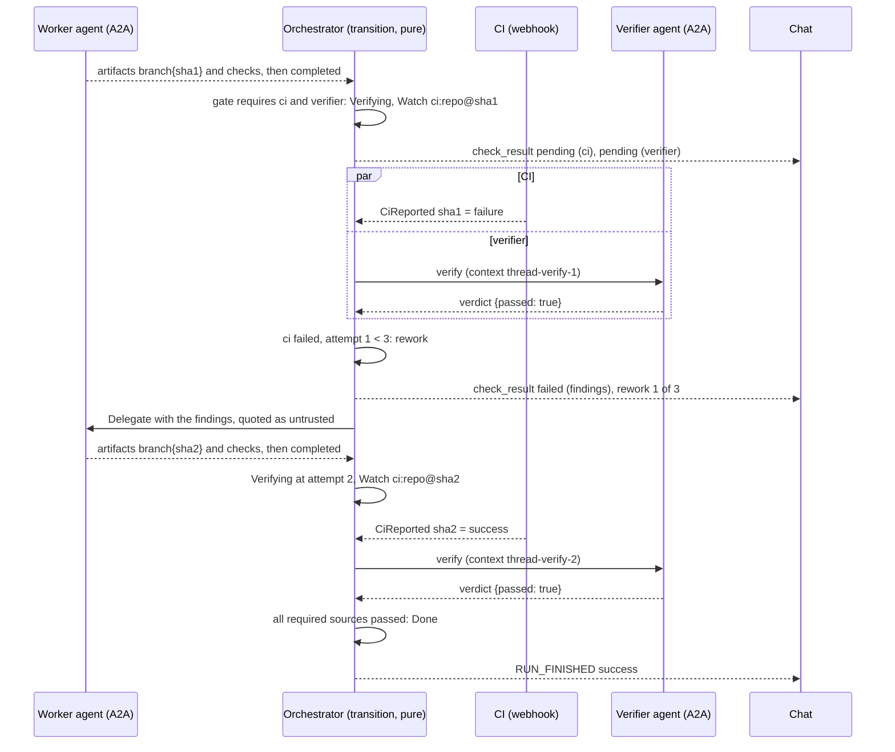
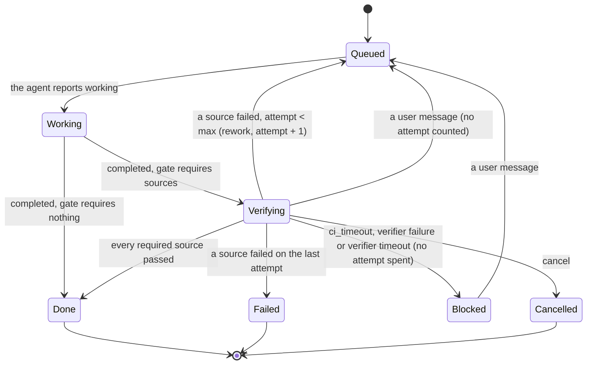

# ADR 0018 — Configurable verification gate and a bounded rework loop

- **Status:** accepted (2026-09-30). **Built:** MVP slice 2 (the core), slice 3 (configuration and
  the AG-UI projection) and slice 4 (the web), 2026-09-30, for the agent-checks source; see *Built
  (slice 3)* and *Built (slice 4)* below.
  **Planned, not built:** slice 10 (verifier agent), and CI as a source
  (slices 5 and 6) ([`mvp.md`](../mvp.md#the-slices-of-steps-2-3-and-6)).
  Refines [ADR 0002](0002-verification-over-consensus.md) (how "verify" and "budgets" are made
  concrete). Closes [open question 8](../open-questions.md#closed) and answers part of question 6
  (attempts; wall clock for the waits on CI and the verifier). Builds on
  [ADR 0016](0016-inbox-timers-and-job-ledger-on-the-thread.md) (the ledger and the loop's rules)
  and [ADR 0017](0017-ci-results-by-webhook.md) (CI results).

## Context

[ADR 0002](0002-verification-over-consensus.md): an external judge decides quality, the loop is
work, verify, rework with findings until green, bounded by budgets, and a job never ends "done"
while its checks are red. MVP step 3 is that loop. Open question 8 asked where verification runs:
real CI arriving by webhook, or a verifier agent over A2A; the proposed answer was to gate on real
CI and allow a verifier for inner loops.

The owner decided on 2026-09-30:

- **The gate is configurable** over three sources: CI on the pushed SHA, checks the agent reports
  itself, and a verifier A2A agent.
- **Attempts:** 3 by default, configurable.

adam-coder does not report its checks today. *Verified 2026-09-30* (adam-rs `882e239`): it emits
`branch` and `pull_request` artifacts, and `run_checks` emits **no** artifact. The agent-checks
source therefore needs a cross-repository change (a `checks` artifact), approved as part of this
choice. Until it lands, the coder's dev gate is CI only.

## Decision

### Sources, ports, aggregation

The sources are a closed enum, `CheckSource`: `Ci`, `AgentChecks`, `Verifier`. **There is no new
port**: the aggregation (which sources are required, which have passed, whether to rework) is pure
core logic in `orch-core`, the rules of [ADR 0016](0016-inbox-timers-and-job-ledger-on-the-thread.md#3-the-loop-as-rules-of-the-core).

| Source | Evidence | Arrives as | Passes when |
|---|---|---|---|
| `Ci` | Reports on the pushed SHA ([ADR 0017](0017-ci-results-by-webhook.md)) | `Input::CiReported` | the `CiPolicy` says so: all required names pass, or the first completed report passes |
| `AgentChecks` | The agent's `checks {passed, commit, summary?, findings?}` artifact | the artifact, recognised in the core | `passed` is true for the pushed commit |
| `Verifier` | A verifier A2A agent's `verdict {passed, findings[]}` artifact | `Input::VerifierReported` | `passed` is true |

Two rules from the loop that matter here:

- A required source with nothing to check counts as failed rather than pending forever. With no
  pushed SHA, CI and the verifier fail with "no pushed commit". With `AgentChecks` required and no
  `checks` artifact by the time the agent completes, it fails with "no checks reported".
- A failed source ends the round at once: the thread reworks (or fails) without waiting for the
  others. A result that arrives later for an older SHA or attempt is recorded and changes nothing.

### The verifier

- `RequestVerification` becomes a new **outbox kind, `verify`**, with a new column
  **`outbox.task_id`** (migration `0003`, slice 2). The dispatcher sends to the verifier's endpoint
  in the context `<thread>-verify-<attempt>`, so the verifier's A2A context is separate from the
  worker's.
- The dispatcher **never maps a verifier's envelopes to `Input::Agent`**: a verifier is not the
  worker, and its "completed" must not complete the job. It emits exactly one
  `Input::VerifierReported`, from a `verdict` artifact `{passed, findings[]}`. No verdict is a
  failed check with "no verdict".
- A verifier failure, or `ORCH_VERIFIER_TIMEOUT_SECS`, puts the thread in **`Blocked`**, not
  `Failed`: the verifier being down is not the code's fault, and it does not spend an attempt.
- The verifier is another configured agent (`AGENTS_FILE`); it never receives the worker's
  credentials.

### Configuration

Three layers, from widest to narrowest. Each layer may only tighten the one above.

| Layer | Where | What |
|---|---|---|
| Deployment | env | `ORCH_GATE` (comma list, e.g. `ci,agent-checks`; **default empty**, which is today's behaviour), `ORCH_MAX_ATTEMPTS` (`3`), `ORCH_MAX_ATTEMPTS_CAP` (`10`), `ORCH_VERIFIER` (agent id), `ORCH_VERIFIER_TIMEOUT_SECS` (`1800`), `ORCH_CI_TIMEOUT_SECS` (`3600`, [ADR 0017](0017-ci-results-by-webhook.md)) |
| Target | an `AGENTS_FILE` entry | `gate: {require: […], maxAttempts, verifier: <agent id>, ci: {required: […], timeoutSecs}}`, parsed with `deny_unknown_fields`. The verifier must be another configured agent, checked at startup (a bad reference is exit 78) |
| Thread | AG-UI `forwardedProps["vymalo.gate"]`; MCP `start_job.gate` | A thread may **add** sources and change attempts up to `ORCH_MAX_ATTEMPTS_CAP`; it may **not remove** a source its target requires |

The gate in force is resolved when the thread is created and copied into `Job`
([ADR 0016](0016-inbox-timers-and-job-ledger-on-the-thread.md)); a running job never sees a later
configuration change.

Defaults chosen (the owner's decisions, and the plan's defaults): the gate is empty; 3 attempts,
capped at 10; a timeout blocks the thread rather than spending an attempt; without `ci.required`,
the first completed CI report decides; a per-thread gate can add sources but not remove them.

### Findings

- Findings are capped at **20 items and 16 KiB per source**.
- They are **quoted as untrusted data** in the rework prompt (delimited, and labelled as coming
  from a check, not from the user): a CI summary or a verifier's text is input from outside.
- The findings text is built in the core, so it is the same on every replica and in every replay.

### Projection to the chat

AG-UI ([ADR 0012](0012-ag-ui-user-facing-protocol.md); the mapping tables in
[`api/agui.md`](../api/agui.md) gain these rows when built):

- A run stays open while the thread is `Queued`, `Working` or `Verifying`.
- `completed` into verifying emits `SUBAGENT_FINISHED` and a `STATE_SNAPSHOT` (the thread plus
  `job {attempt, maxAttempts, gate, sha}`), **not** `RUN_FINISHED`.
- `check_result` becomes the activity `vymalo.check`.
- `rework` becomes `vymalo.rework`, then `SUBAGENT_STARTED` for the next attempt.
- The verifier appears as its own subagent.
- `Done` gives `RUN_FINISHED` with success. Out of attempts gives `RUN_ERROR` with
  `code: "checks_failed"`.

`chat-api.yaml`: `Thread.state` gains `verifying`, plus an optional `job`. Two new goldens,
`verify-green` and `verify-red`, are read through the reference client in CI. The web shows a
`verifying` badge, an attempt counter such as "2/3", findings per source and a "reworking" divider.

### Diagrams

One job, from the agent's completion to green, through one rework:

`Queued` and `Working` also reach `Blocked`, `Failed` and `Cancelled` exactly as in
[Thread state](../architecture.md#thread-state); the diagram shows only what the gate adds. What it
cannot say: a `Blocked` thread that the user answers is delegated again **without** a new attempt
number, because the timeout was not the worker's failure; an out-of-attempts `Failed` carries the
last findings in its `error` event.

## Built (slice 3)

*2026-09-30.* What the code does, where it refines the text above:

- **Configuration** is one rule set, `GateRules` in `orch-app` (`gate_config.rs`): the binary applies the
  deployment variables and every `AGENTS_FILE` entry with it at startup, and `App` applies the entry and the
  request when a thread is created; `App::new` checks the deployment's policy and every entry again, so another
  composition root cannot hand it a gate the build cannot honour (it returns an error; the binary exits 78). A layer is
  `{require?, maxAttempts?, verifier?, ci?}`. What "each layer may only tighten the one above" comes to in code:
  sources can only be added (`require` is the whole list and must contain the one above's; `ci.required` names
  add up), and attempts can be anything in `1..=ORCH_MAX_ATTEMPTS_CAP` (at most 100), lower or higher than the
  layer above's. The one removal allowed is the entry of the verifier itself leaving the `verifier` source out for
  itself, because an agent cannot verify its own work; an agent whose own gate does not require the verifier may be
  the verifier. A thread may set only `require` and `maxAttempts`, and spells a source `agent-checks` or
  `agent_checks`. A default `ORCH_MAX_ATTEMPTS` is lowered to a smaller `ORCH_MAX_ATTEMPTS_CAP`; one that is set must fit.
  The verifier of every agent's resolved gate must be a configured agent.
- **This build honours only `agent-checks`.** The application still drops `RequestVerification` (slice 10; `Watch` and `Schedule` are executed since slice 5, but no
  surface writes CI reports until slice 6), so a gate that required `ci` or `verifier` would wait for a verdict
  that never comes. Configuration **refuses** those sources, and the `ci` and `verifier` settings, in every layer,
  and says which slice enables them: startup exits 78 (`ORCH_GATE`, `ORCH_VERIFIER`, an `AGENTS_FILE`
  entry), a request is a 400. This is fail-closed: a job is never "done" without a check the operator required.
  `pending_reason` in `gate_config.rs` is where the sources are listed, and `GateRules::honouring` how a build (or a
  test) says it has more. It is **not** the only thing a later slice changes: the slice that makes `verifier` real also
  owns its checks (`GateRules::check_verifier`, the verifier's own entry) and its cards, and the one that makes `ci` real
  owns the `ci` settings and the watch keys.
- **Not built yet:** `ORCH_CI_TIMEOUT_SECS` and `ORCH_VERIFIER_TIMEOUT_SECS`, which only matter once CI and the
  verifier can be required (slices 6 and 10); the per-target `ci.timeoutSecs` is accepted by the parser and refused
  with the rest of the `ci` settings.
- **Projection:** as above. The gate reaches the projection through `ThreadMeta.gate` (the job's copy, fixed when the
  thread was created); everything else is folded from the log. The `vymalo.check` card of a source in an attempt
  has a stable id, `check-<attempt>-<verification>-<source>`, and is `replace: true` (a second verification of the
  same attempt is a card of its own); `vymalo.rework` is `rework-<attempt>`; a rework opens the next attempt's
  subagent at once. `job` is in `STATE_SNAPSHOT` and in `Thread` only under a gate, and its `sha` is the pushed
  commit, never the commit a check ran on. A hold (`error{retryable}` then `blocked` while verifying) is an
  answerable interrupt, not `delivery_failed`.
  Goldens: `verify-green` (red once, then green), `verify-red` (three attempts, `checks_failed`).
- **A rework is a new A2A task in the same context**, because the first task is `completed`; `orch-e2e` pins it.
- **The gate is fixed at creation**, and a run that continues a thread and asks for another is a 409 (`orch-surface-agui`),
  not a silent no-op.

## Built (slice 4)

*2026-09-30.* The web (`web/`) renders the gate; it invents nothing, so each thing below is read from the stream:

- **The badge** has a `verifying` state (its own colour and label, "Verifying", spoken as "Verifying the agent's
  work"), and the composer offers Cancel while it lasts.
- **The attempt counter** ("Attempt 2/3", spoken as "Attempt 2 of 3") sits beside the badge whenever the newest
  `STATE_SNAPSHOT` (or, before the stream, `Thread.job`) carries a `job`; a thread without a gate shows none.
- **`vymalo.check`** is a card per source and attempt (status in words, source, short commit, summary and findings),
  replaced in place by its id; a `stale` one is its own muted card. **`vymalo.rework`** is a divider, "Attempt 2 of 3:
  sent back with 1 finding". Findings, summaries and names are untrusted and drawn as text: never as markdown or HTML;
  a long finding is cut with an expand control.
- **`RUN_ERROR` `checks_failed`** is kept by the stream's agent and shown as "Checks failed after 3 attempts" where an
  ordinary finished thread says "This thread is failed".
- The mock replays both goldens (and `verify-pass`, and the mock-only `verify-ci` and `verify-wait`, which need the CI
  source of slices 5 and 6); the system tests run the fake agent's `verify-*` scripts through the real orchestrator.
  Rules and tests: [`web/README.md`](../../web/README.md#verification-the-gate).

## Configuration summary

| Variable | Default | Meaning |
|---|---|---|
| `ORCH_GATE` | empty | required sources, comma list of `ci`, `agent-checks`, `verifier`; empty keeps today's behaviour. *Built: only `agent-checks` is accepted, see above* |
| `ORCH_MAX_ATTEMPTS` | `3` | attempts per job, including the first |
| `ORCH_MAX_ATTEMPTS_CAP` | `10` | the most a target or a thread may raise it to; at most `100`. A default `ORCH_MAX_ATTEMPTS` is lowered to a smaller cap |
| `ORCH_VERIFIER` | none | the verifier agent's id (must be configured; startup error otherwise). *Built: refused until slice 10* |
| `ORCH_VERIFIER_TIMEOUT_SECS` | `1800` | how long to wait for a verdict before `Blocked`. *Not read yet (slice 10)* |
| `ORCH_CI_TIMEOUT_SECS` | `3600` | how long to wait for CI before `Blocked` (ADR 0017). *Not read yet (slice 6)* |
| `AGENTS_FILE` `gate` | none | per-target override, shape above |

## Security notes

- **Findings are untrusted data.** They come from CI, an agent or a verifier and are put in a
  prompt for the worker. They are quoted and delimited, capped (20 items, 16 KiB per source), and
  never interpreted as instructions to the orchestrator.
- **The gate cannot be weakened from below.** A thread's `forwardedProps` or `start_job.gate` can
  only add sources and lower or raise attempts within the cap; a client cannot remove a required
  source, so a hostile or careless client cannot turn a gated target into an ungated one.
- **The verifier cannot complete the job.** Its envelopes never become `Input::Agent`; only a
  `verdict` artifact does, as a single `VerifierReported`.
- **Fail closed.** No verdict, no pushed commit, no checks reported: each is a failed check.
  Timeouts block; they never pass.
- The attempt cap bounds token and wall-clock spend by construction; the wait timeouts bound the
  rest.

## Consequences

**Easier**

- "Never done while red" is a property the tests can state: never `Done` while a required source is
  failed or pending; attempts never exceed the maximum; terminal states absorb; replay is
  deterministic.
- A deployment picks its trust: CI only, or CI plus a verifier, or the agent's own checks for inner
  loops; nothing else in the design changes.
- The existing behaviour and goldens are unchanged while `ORCH_GATE` is empty.

**Harder**

- `AgentChecks` needs an adam-rs change (a `checks` artifact from `run_checks`). Until then it is
  unusable with the default agent.
- The run now stays open longer, so a client sees `RUN_FINISHED` later than the agent's
  `completed`; every AG-UI consumer must tolerate it (the reference client does; the web has since slice 4).
- Three configuration layers to explain and test. The monotonic rule (may add, may not remove) is
  the simplification.
- A `Blocked` thread from a timeout needs a human; there is no automatic retry of the wait.

## Alternatives considered

- **CI only** (the answer proposed with open question 8). Rejected as the only option: repositories
  without CI, and inner loops, need something faster; it stays one of the three sources.
- **A verifier agent only.** Rejected: it can diverge from real CI ([ADR 0002](0002-verification-over-consensus.md):
  an external judge). It is optional here and never replaces a required CI.
- **A port for "checks"** (a `Verifier` trait). Rejected: the sources are a closed set, and a port
  would move the aggregation out of the pure core. The verifier is an ordinary A2A agent behind the
  existing `AgentClient` port.
- **A `Reworking` state.** Rejected: a rework is a delegation with `attempt > 1`, already
  representable as `Queued` or `Working`.
- **Spending an attempt on a timeout.** Rejected: a missing CI report is not evidence the code is
  bad, and burning attempts on infrastructure faults hides them. A timeout blocks and asks.
- **Letting a thread remove a required source.** Rejected: it would let any client bypass a
  target's gate.
- **Unbounded rework.** Rejected by ADR 0002.

## Hard to reverse

- **The `CheckSource`, `Timer`, `Input` and `EventBody` variants** and their serde names in
  `threads.job` and the event log.
- **Outbox kind `verify` and `outbox.task_id`.**
- **The `vymalo.check` and `vymalo.rework` activity schemas** once the web and other clients read them.
- **The `verdict` and `checks` artifact shapes**, which are contracts with other repositories
  (adam-coder, verifier agents).
- **`AGENTS_FILE` `gate`** in deployments' manifests.

Easy to reverse: every default, the caps and timeouts.

## Verified

- *Verified 2026-09-30* (adam-rs `882e239`): adam-coder's artifacts are `branch` and
  `pull_request`; `run_checks` emits none. The coder image used by the dev stack is
  `ghcr.io/vymalo/another-adam-rs/coder:sha-882e239@sha256:abd9233d45aef86784c8f986484680d287bf2ee12d5d81f111d4e7030a1e0cb7`.
- *Verified 2026-09-30* (this repository at `a35fa57`): the thread states are `queued`, `working`,
  `blocked`, `done`, `failed`, `cancelled`; the outbox kinds are `delegate` and `cancel`.
- AG-UI facts (`STATE_SNAPSHOT`, `SUBAGENT_*`, `RUN_ERROR`, activity messages) are as
  [`api/agui.md`](../api/agui.md) records them, *verified 2026-09-29* there.
- *Cross-repository work:* adam-coder must emit `checks {passed, commit, summary, findings}` from
  `run_checks` (an adam-rs pull request). Not started.
