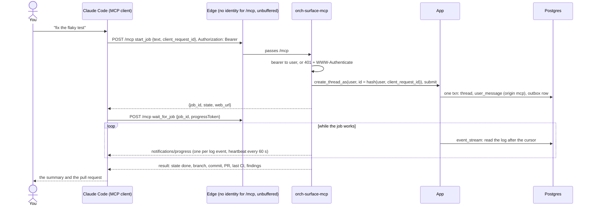
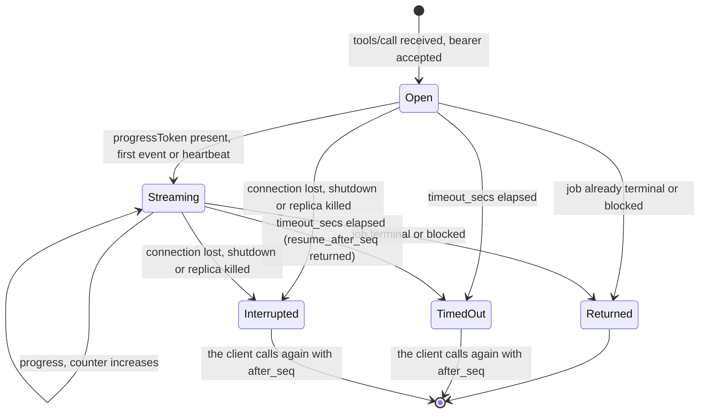

# ADR 0019 — MCP server over streamable HTTP: bearer first, OIDC later

- **Status:** accepted (2026-09-30). **Built (2026-09-30):** MVP slice 11 (tools and bearer
  tokens; see the [status note](#status-note-2026-09-30-slice-11-is-built)). **Planned, not
  built:** slices 12 (`wait_for_job` with progress) and 14 (OIDC, after the MVP)
  ([`mvp.md`](../mvp.md#the-slices-of-steps-2-3-and-6)). Amends the design sentence "every input
  goes through the inbox" of [`orchestrator.md`](../orchestrator.md#event-flow) for MCP, and the
  "needs the inbox" note of MVP step 6. Refines [ADR 0004](0004-closed-enums-over-dyn-registry.md)
  (the tool set is a closed enum) and uses the machine routes of
  [ADR 0016](0016-inbox-timers-and-job-ledger-on-the-thread.md).

## Context

MVP step 6 is done when "a job started from Claude Code via MCP reports progress back to Claude
Code". The MCP server is the "MCP as a server" row of the
[symmetry table](../orchestrator.md#it-is-symmetric): Claude Code, opencode or any MCP client can
`start_job`, `get_job` and `answer`.

The owner decided on 2026-09-30: **streamable HTTP with bearer tokens first; OIDC in a later
slice.**

Three questions had to be settled: where MCP enters the system (the earlier design sent every input
through the inbox), how a client watches a long job through a request/response protocol, and how
callers authenticate when there is no oauth2-proxy cookie ([open question 20](../open-questions.md#open)
asked the same for programmatic AG-UI clients; it stays open, this ADR decides MCP only).

## Decision

### Placement: MCP bypasses the inbox

The caller is authenticated and waits for the answer, so nothing is parked or deduplicated for
later. The MCP surface calls `App` directly (`create_thread_as`, `submit`). This is the exception
to "every input goes through the inbox": the inbox is for unsolicited machine input
([ADR 0016](0016-inbox-timers-and-job-ledger-on-the-thread.md)).

- **Idempotency.** The thread id is a hash of the user and `client_request_id`, so a retried
  `start_job` returns `Exists` and the same `job_id`. Without a `client_request_id` a call is
  never a retry.
- **The `job_id` is the thread id** (ADR 0016).
- **No state in the process.** The server runs with `legacy_session_mode = false` (stateless), so
  any replica serves any request, like the AG-UI connect stream.

A new crate, **`orch-surface-mcp`**, uses `rmcp` 3.5 with the features `server` and
`transport-streamable-http-server`. `StreamableHttpService` is nested at `/mcp` as a **machine
route** (outside the identity layer, guarded by the bearer check). It is one more surface in
`ORCH_SURFACES` behind its own Cargo feature; the token name and the feature name are named in
slice 11 (by analogy with `webhook-*` and `surface-webhook` they are `mcp` and `surface-mcp`).

### Tools: a closed enum

| Tool | Arguments | Returns |
|---|---|---|
| `list_agents` | none | the configured agents (id, name, description) |
| `start_job` | `{text, agent?, title?, gate?, client_request_id?}` | `{job_id, state, web_url}` at once |
| `get_job` | `{job_id}` | a summary: state, attempt, branch, commit, pull request, last CI result, findings |
| `wait_for_job` | `{job_id, after_seq?, timeout_secs}`, at most `MCP_WAIT_MAX_SECS` | see below |
| `answer` | `{job_id, text}` | the job's new state |
| `cancel_job` | `{job_id}` | the job's new state |

`start_job.gate` is the per-thread gate of [ADR 0018](0018-verification-gate-and-rework-loop.md)
(add sources, change attempts up to the cap, never remove a required source). A tool call for a
thread the caller does not own is "not found", never "forbidden", as everywhere else.

### `wait_for_job` and progress

`wait_for_job` reads `App::event_stream`, the same read of the log every surface uses, so it holds
no state in the process either.

- When the request carries a `progressToken`, it streams `notifications/progress`: one per
  meaningful log event, plus a heartbeat every 60 s, with an integer counter that only increases.
- It returns when the job is terminal or blocked, or when the wait times out. A timeout returns
  `resume_after_seq`; the client calls again with `after_seq` and loses nothing, because the log is
  the source of truth.
- A dropped connection, a shutdown or a killed replica ends the call; re-calling with `after_seq`
  continues on any replica.
- `timeout_secs` is bounded by `MCP_WAIT_MAX_SECS` (default 3600).

### Auth: static bearer tokens first

- `MCP_TOKENS_FILE` is YAML, a list of `{user, tokenEnv}`. Each `tokenEnv` names an environment
  variable holding the token; **a missing variable is a startup error** (exit 78).
- No bearer, or an unknown one: **401 with `WWW-Authenticate: Bearer`.**
- The token maps to a `user`, which is the owner of the threads the caller creates and sees, the
  same scope as an edge identity.
- `MCP_ALLOWED_HOSTS` is **required**: rmcp validates the `Host` header and defaults to loopback, so
  a deployment behind a public name must list it.
- **OIDC comes later** (slice 14): JWT bearer validation against a JWKS, tested against WireMock.

### The log says where a message came from

`user_message` events gain `origin: agui | mcp` (see the status note below). The web shows "from Claude Code" for an
MCP message. This is one additive field; existing events read as before.

### Configuration

| Variable | Default | Meaning |
|---|---|---|
| `ORCH_SURFACES` | `agui` | add the MCP surface name to mount it |
| `MCP_TOKENS_FILE` | none | YAML `[{user, tokenEnv}]`; required when the surface is mounted |
| `MCP_ALLOWED_HOSTS` | none | required; the `Host` values the server accepts |
| `MCP_WAIT_MAX_SECS` | `3600` | the largest `timeout_secs` of `wait_for_job` |
| `MCP_TOKEN_<NAME>` | none | whatever `tokenEnv` names; one per token, secret |

`web_url` in `start_job`'s answer needs the public origin of the web chat surface; the plan names
no variable for it, and slice 11 settles it.

### Diagrams

A job started from Claude Code, followed to its end:

One tool call, `wait_for_job`:

## Security notes

- **Fail closed.** No token file, a missing token variable, or no allowed hosts: the process does
  not start. An unknown bearer is 401 before any tool runs.
- **Tokens are secrets.** Held as `SecretString`, compared with `subtle` over SHA-256 digests, never
  logged. Static tokens do not expire; rotating one is a redeploy. That is the price of "bearer
  first", and slice 14 is the answer.
- **Machine route.** `/mcp` never reads `X-Auth-Request-Email`; the edge must not inject it and the
  orchestrator ignores it. The user is the token's, nothing else.
- **`Host` validation** guards against DNS rebinding; the allow-list is required, not defaulted.
- **Scope.** Every tool call is scoped to the token's user, exactly as the resource API is.
- **Untrusted content.** `answer` text and `start_job.text` are user input to the agent, as in the
  chat. Results returned to the client (findings, CI summaries) are quoted data and may contain
  hostile text; a client should treat them as such.
- **Idempotency covers `start_job` only.** A replayed `start_job` cannot start two jobs. `answer`
  and `cancel_job` follow the rules of the chat's message and cancel: a cancel of a finished thread
  is a no-op, a message to a finished thread is refused.

## Consequences

**Easier**

- Claude Code, opencode and any MCP client can start and follow a job with a header and a URL.
- No sticky sessions: any replica serves any call, and killing one mid-wait costs a re-call.
- Idempotent starts make retries safe.

**Harder**

- Static bearer tokens are coarse: no expiry, no per-token scopes. OIDC is a later slice.
- `wait_for_job` is a long request. Proxies and clients must not buffer or time out early; the
  edge route is unbuffered, and progress notifications reset a client's idle window.
- Two protocols now describe a job to a client (AG-UI for the web, MCP for tools); both read the
  same log, so they cannot diverge in fact, only in presentation.
- rmcp 3.5's stateless mode against real clients is *unverified* and is the first thing slice 11
  checks.

## Alternatives considered

- **Through the inbox, like webhooks.** Rejected: the caller waits for an answer, so a queue adds a
  hop and a way to lose it, and there is no redelivery to dedupe beyond the `client_request_id`.
- **MCP over stdio.** Rejected for the server: the orchestrator is a deployed multi-replica
  service, not a local subprocess.
- **Stateful sessions (rmcp's session mode).** Rejected: session state in a process breaks "any
  replica serves any request" (ADR 0001) and needs sticky routing.
- **OAuth/OIDC first.** Deferred by the owner: static tokens run today with no identity provider
  work; OIDC follows as slice 14.
- **Server-sent notifications for job changes outside a call** (a standing subscription). Not
  chosen: a `wait_for_job` call with progress fits the stateless model and the clients' idle rules.
- **A tool per state transition, or a free-form tool registry.** Rejected: a closed enum keeps the
  set reviewable (ADR 0004).

## Hard to reverse

- **Tool names and argument shapes**, once clients configure them.
- **`job_id` = thread id**, and the id derivation from `client_request_id` (a change breaks retry
  idempotency for in-flight calls).
- **The `origin` field** in the log.
- **The `MCP_TOKENS_FILE` format**, in deployments' manifests.

Easy to reverse: the wait bound, the heartbeat, the progress granularity.

## Verified

- *Verified 2026-09-30*: MCP progress: a request may carry a `progressToken`; the receiver may send
  `notifications/progress`; `progress` must increase with each notification. Source:
  <https://modelcontextprotocol.io/specification/2025-11-25/basic/utilities/progress>.
- *Verified 2026-09-30* by reading the crate source ([rmcp 3.5.0](https://docs.rs/rmcp/3.5.0)):
  `StreamableHttpService`, the `legacy_session_mode = false` setting, `allowed_hosts` defaulting to
  loopback, and `notify_progress`.
- *Verified 2026-09-30*: Claude Code adds an HTTP MCP server with `claude mcp add --transport http
  <name> <url> --header "Authorization: Bearer …"`, and has a five-minute idle window that
  progress resets. Source: <https://code.claude.com/docs/en/mcp>.
- *Verified 2026-09-30* (slice 11) by reading the rmcp 3.5.0 source and by running it: a
  `StreamableHttpService` built with `StreamableHttpServerConfig::with_legacy_session_mode(false)` and a
  `NeverSessionManager` serves every POST with a fresh handler and hands out no `Mcp-Session-Id`; it copies the
  request's `http::request::Parts` (with the extensions the layers above it set) into the request context, which is how
  a tool learns the token's user; `allowed_hosts` defaults to `localhost`, `127.0.0.1` and `::1`, and an **empty** list
  allows every host (so `McpConfig` refuses an empty list); an entry without a port matches any port; a disallowed
  `Host` is `403`. The crate's own client, with its legacy `initialize` handshake and with the `2026-07-28`
  `server/discover` lifecycle, works against it (`orch-surface-mcp`'s `tests/`).
- *Verified 2026-09-30*: `secrecy` 0.10.3 (`SecretString`, `ExposeSecret`; the version in `Cargo.lock`), `subtle` 2.6
  (`ConstantTimeEq`) and `sha2` 0.10.
- *Unverified*, and **not tried** in slice 11: whether **Claude Code** (or opencode) works against rmcp's stateless
  mode; nothing but rmcp's own client and `curl` has spoken to it. Whether they display progress is checked in slice 12.
  oauth2-proxy `skip_auth_routes` for `/mcp` (the dev edge is Caddy; no oauth2-proxy was run).

### Status note, 2026-09-30: no `chat_api` origin

The legacy chat API surface was removed the same day ([ADR 0012](0012-ag-ui-user-facing-protocol.md)'s
status note), so `origin` has two values, `agui` and `mcp`, not the three first written here. The
decision stands.

### Status note, 2026-09-30: slice 11 is built

`orch-surface-mcp` (feature `surface-mcp`, surface name `mcp`) serves `list_agents`, `start_job`, `get_job`, `answer` and
`cancel_job` at `/mcp`, stateless, behind static bearer tokens. The decision above stands; this note records what
building it settled.

- **`web_url`.** The variable is **`ORCH_PUBLIC_URL`** (flag `--public-url`): the public origin of the chat, for example
  `https://chat.example.com`, with no path. `start_job` answers `web_url` as `<origin>/threads/<job_id>` (the web's
  route) and **omits it** when the variable is unset. No public-origin variable existed before. It is used only when the
  surface is mounted, but a malformed value is a startup error whatever the surface.
- **What the surface reads.** `MCP_TOKENS_FILE`, `MCP_ALLOWED_HOSTS` (comma separated) and the `tokenEnv` variables are
  required when `mcp` is in `ORCH_SURFACES` **and the role serves HTTP** (`all`, `control-plane`); a `worker` is not asked
  for the secrets of a surface it never mounts. A missing or empty token variable, an unreadable or malformed file, a
  user that is not an e-mail address, and one token given to two users are configuration errors (exit 78) found before
  anything connects. A user may have several tokens (a rotation). `MCP_WAIT_MAX_SECS` arrives with slice 12.
- **The machine route** is `SurfaceRoutes::machine(routes, guard)` in `orch-api`, as the design of
  [ADR 0016](0016-inbox-timers-and-job-ledger-on-the-thread.md) has it: the routes sit outside the identity layer and the
  request timeout, and the guard (here the bearer check, a tower layer) is a required argument, so a machine route cannot
  be added without one. It was built here because slice 11 needs it first; slice 6 uses it.
- **`origin`.** `user_message` data gains `origin`, `agui` or `mcp`. The default, `agui`, is **not written**: an event
  without the member reads as `agui`, so every log written before the field existed reads as it did, and the AG-UI
  projection and its goldens are untouched (the projection does not carry it yet: the web's "from Claude Code" is a later
  change). The `Input::UserMessage` of the core and `Inbound` of `App` carry it.
- **Idempotency.** With a `client_request_id` the job id is the first 16 bytes of SHA-256 over a domain tag, the
  length-prefixed user and the request id, with the UUID version (8) and variant bits set. Two users with the same request
  id get two jobs; a retry, on any replica and concurrently, gets `Exists` and the same `job_id` (`created: false`). The
  answer carries **`created`**, which the decision does not list (additive). The id is not time-ordered, and the resource
  API lists threads by id (`ORDER BY id DESC`), so a thread started with a `client_request_id` sorts among the others by
  its hash, not by its age; threads without one are UUIDv7 as before. Listing by `created_at` is a follow-up.
- **Tools.** Unknown arguments are refused (`invalid params`), so a client that sends `gate` (offered with the per-thread
  gate of slice 3) hears that it did not apply. A failure the caller can act on (no such job, a finished job, an empty
  text, an unknown agent) is a tool result with `isError: true`; only a malformed call or a fault of the server is a
  protocol error. `get_job` adds `title`, `agent`, `finished`, `hold` and `last_seq` (the cursor for `after_seq`) to the
  summary the decision lists; the pull request is found in the log (an artifact named `pull_request` or "Pull request").
- **Cargo feature.** `surface-mcp` is **on by default**, like `surface-agui`: the image has it, and it is mounted only when
  `ORCH_SURFACES` names `mcp`.
