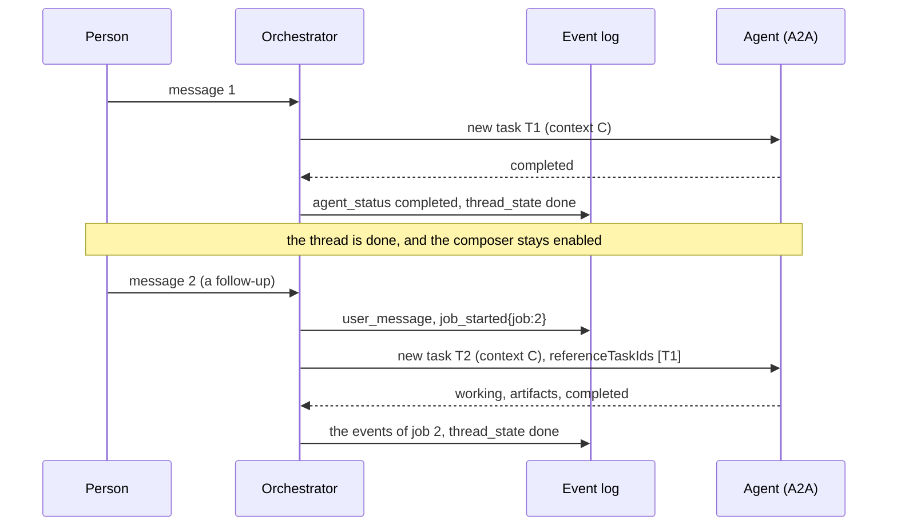
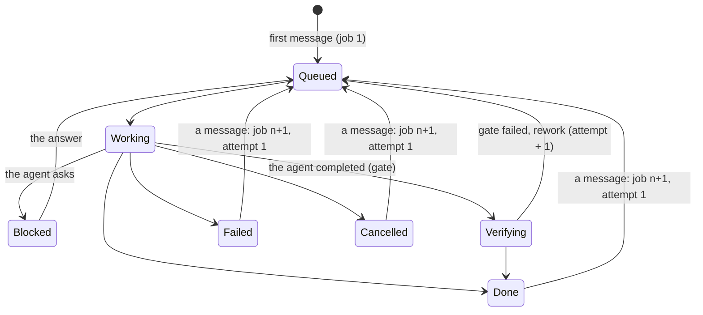

# ADR 0020 — A thread is a conversation: a message on a finished thread starts its next job

- **Status:** accepted (2026-09-30). Amends [ADR 0016](0016-inbox-timers-and-job-ledger-on-the-thread.md)
  (section 1: one thread holds one job), [ADR 0018](0018-verification-gate-and-rework-loop.md) (the
  gate applies to each job; verifications are counted per thread),
  [ADR 0012](0012-ag-ui-user-facing-protocol.md) (a message on a finished thread is no longer a 409) and
  [ADR 0019](0019-mcp-server-over-streamable-http.md) (`answer` on a finished job). Each carries a
  dated status note that points here. Uses [ADR 0021](0021-context-across-a2a-tasks.md) for what the
  agent is told about the job before.

## Context

The owner's first live run (real model, real GitHub, the coder gated on `agent-checks`, 2026-09-30):
they typed "Hi". The coder answered in text and completed, the gate sent it back, the rework lost its
thread, and the thread ended **Done** with the composer disabled. The owner's verdict: "suddenly, it's
locked at the end. Please no. It should feel like a classical chat, not a machine to machine chat
interface. Plus, closing the communication feels... bad."

Today a thread that reaches `done`, `failed` or `cancelled` absorbs every input: a user message is
`Err(Finished)` (HTTP 409, "start a new thread"), in the core, the AG-UI surface, the resource API and the
MCP server. That rule came from a thread holding exactly one job (ADR 0016, section 1). The product the
owner wants is a chat: what the person types next is the next thing they want, whatever state the last
request ended in.

## Decision

**A thread is a conversation that holds a sequence of jobs. A user message on a `done`, `failed` or
`cancelled` thread starts job *n+1* on the same thread and the same agent.** Nothing else about a finished
job changes.

- **The job has a number.** `Job.number`, from 1 (`serde` default, so every stored ledger without one is
  job 1). Only the **current** job is stored, in `threads.job`, as before (ADR 0016: no jobs table, no
  second ledger). The history of earlier jobs is the log. The MCP `job_id` stays the thread id; the number
  says which job of it.
- **A new event marks the boundary:** `job_started {job: n}`, actor `system`, appended by the transition
  that starts job *n* from *n-1* (never for job 1, which starts with the thread). Job boundaries are not
  inferred from "a message after a terminal `thread_state`": they are written down, so every reader (the
  projection, the MCP summary, the export) agrees.
- **`Job::next()`** keeps the gate (a thread's gate is fixed at creation), bumps the number and resets what
  belongs to one job: `attempt` 1, `task`, `pushed`, `results`, `summary`, `hold`, `branch_problem`. It does
  **not** reset `verification`: the count is monotonic per thread, so every timer
  (`CiDeadline{attempt, verification}`, `VerifierDeadline{..}`), verdict, `verify` outbox row and CI report
  of an earlier job is stale by the comparison the core already makes, with no new field to check.
- **The transition.** `UserMessage` in a finished state: `job = job.next()`, the message is noted as the
  new job's task, state `queued`, commands `[user_message, job_started, Delegate]`. No `thread_state` event
  (entering `queued` is implied, as for a first message). The delegation is a new A2A task in the thread's
  context, which names the previous task ([ADR 0021](0021-context-across-a2a-tasks.md)).
- **What stays refused.** A2UI `UiAction` on a finished thread is still `Err(Finished)` (409): its surface
  belongs to the finished job, and answering a card about work that ended is not a new request. The
  projection drops the surfaces of a finished job when the next starts, so a click on an old card is a 422.
  `Cancel` of a finished thread is still a no-op; a late agent update, timer, verdict or CI report for a
  finished thread is still dropped (a CI report keeps its card).
- **Cancelled and failed reopen too.** "Stop" is not "closed": the person's next message is the next
  request. (Rejected: reopening only `done`.)
- **Redelivery.** A delegation that was queued while the job was open and had not reached the agent when the
  job ended is no longer lost ("message not delivered: thread already finished"). The dispatcher applies
  `Input::Redeliver {text}`: on `done` or `failed` it starts the next job for that message
  (`[job_started, Delegate]`; the `user_message` is in the log already); on `cancelled` it stays as today,
  because the person asked to stop; on an open thread it delegates.
- **Cancel rows carry their job.** `Command::RequestCancel {job}` and the outbox payload `Cancel {job}`: a
  cancel row claimed after its job ended and the next began is finished without touching the agent (legacy
  rows without a job mean the current job). Without it, a "Stop" typed in job 1 could kill job 2.
- **Idempotency.** `apply` re-runs the transition on a fresh snapshot under the version compare-and-swap,
  and the AG-UI surface keys a message by its `messageId`, so a retried POST cannot start a third job; a
  reused `runId` is still refused.

### What the surfaces do

- **AG-UI.** A run that carries a new user message on a finished thread is served: the projection folds
  `job_started` (resets the attempt and the commit, `thread.jobNumber` in `STATE_SNAPSHOT` from job 2,
  `job.number` under a gate, an `ACTIVITY_SNAPSHOT` of type `vymalo.job`). Message and run ids of job 1 are
  unchanged; from job 2 the ids that embed the attempt gain a job infix (`rework-j2-1`), so two jobs never
  mint the same id. A `UiAction` on a finished thread is a 409 ("this card belongs to a finished request").
  See [`api/agui.md`](../api/agui.md).
- **MCP.** `answer` on a finished job starts the next one and returns `{job_id, state, job}`; `get_job` and
  the summary gain `job`; `pull_request` looks only at artifacts after the last `job_started`; `wait_for_job`
  is unchanged (it returns when the job is finished or blocked, and is called again after an `answer`).
- **The chat.** The composer is never disabled. The header shows one state pill and no attempt counter; an
  attempt is shown only inside the turn while a rework runs.

## Consequences

- A thread is open-ended: nothing ends it, and there is no "start a new thread" error for a person. A
  client that treated `done` as final must not: `wait_for_job` returns at `done` and is called again.
- The gate is per job, verification is counted per thread, and the gate stays the thread's: a follow-up
  cannot ask for a stricter or looser gate than the thread was created with (open question 31).
- The log is the only record of earlier jobs. A reader that needs job 1's pushed commit reads the log up to
  the first `job_started`; nothing in `threads.job` remembers it.
- A CI report for an earlier job's commit still adds its card (the thread's watches are not removed) but
  cannot decide job *n+1*, whose pushed commit is its own; two jobs that push the same commit share their CI
  facts (open question 32).
- Two messages sent while a job is open are two delegations; if the first completes the thread before the
  second is sent, the second starts the next job (redelivery). A residual race remains when the second is
  *sent* at the instant the task completes (open question 33).

## Alternatives rejected

- **A jobs table.** A second ledger to keep consistent with the first (ADR 0001, ADR 0016), for history the
  log already holds.
- **Inferring job boundaries** from "a message after a terminal `thread_state`". Every reader would have to
  re-derive it, and a redelivered or late event would move the boundary.
- **Reopening only `done`.** A stopped or failed job is exactly when a person types "no, do this instead".
- **A new thread per follow-up.** The chat's continuity and the agent's context are the point.
- **Resetting `verification` per job.** It would need a job field on every timer and verdict to tell them
  apart.

## Hard to reverse

The `job_started` event kind (the `events.kind` check widened by migration 0005) and `Job.number` in stored
ledgers. Rolling back the code leaves events an older reader rejects; reading the log is forward-only.

## Verified

- *Verified 2026-09-30* (this repository at `d52c005`): `transition` returns `Err(Finished)` for
  `UserMessage` and `UiAction` in `done`, `failed` and `cancelled`; the dispatcher's delegate path finishes
  an unsent row on a terminal thread as `Skipped` with "message not delivered: thread already finished".
- *Unverified:* how assistant-ui renders a second run on a thread whose previous run finished with
  `RUN_FINISHED`; the web's Playwright test (`e2e/follow-up-after-done.spec.ts`) is the check.
