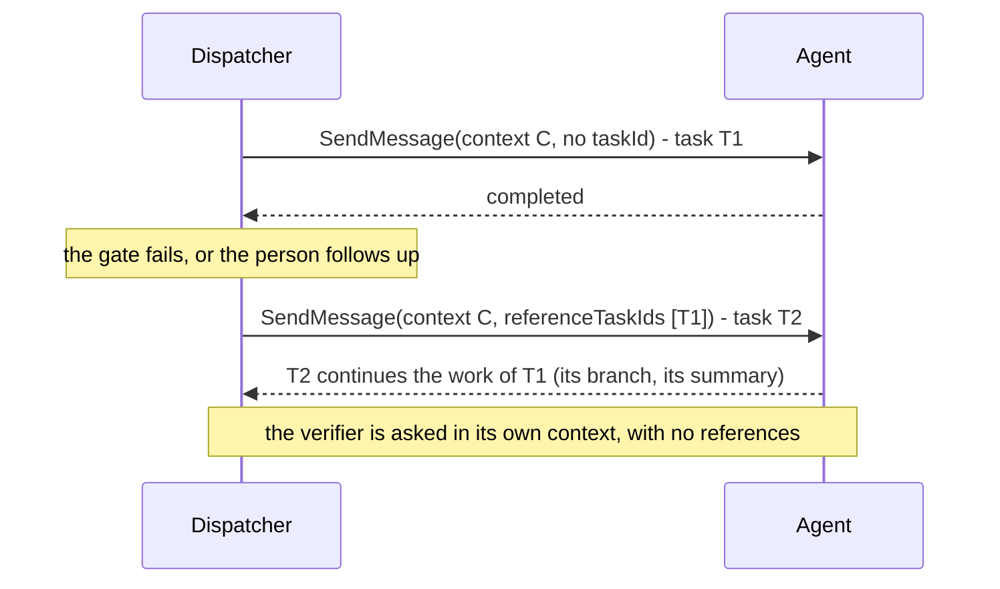
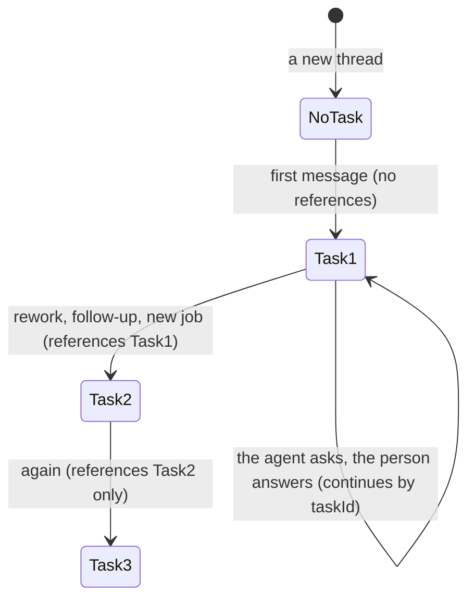

# ADR 0021 — Context across A2A tasks: same context, `referenceTaskIds`

- **Status:** accepted (2026-09-30). Refines [ADR 0014](0014-adam-coder-default-agent-over-a2a.md) (how the
  default agent is driven) and [ADR 0018](0018-verification-gate-and-rework-loop.md) (the rework). Builds on
  [ADR 0020](0020-a-thread-is-a-conversation.md), which is what makes a thread start more than one task.

## Context

A thread is one A2A `contextId` (the thread's) and, over its life, several A2A tasks. A task that reached a
terminal state (`completed`, `failed`, `canceled`, `rejected`) cannot be continued. *Verified 2026-09-30*
(<https://a2a-protocol.org/latest/topics/life-of-a-task/>, "Task Refinements" and "Task Immutability"): any
later interaction related to a finished task "must initiate a new task within the same `contextId`", and the
client hints the agent "by providing references to the original task using `referenceTaskIds` in the
`Message` object".

The orchestrator starts a new task on the same context in three cases: a **rework** (the gate failed and the
agent is sent back with the findings), a **follow-up** after the agent's turn ended (while verifying, or on a
finished thread, ADR 0020), and a **new job**. Today it sends the context id and nothing else. On the owner's
first live run the rework task carried only findings, the coder did not know what the earlier task had
done, invented a repository and asked "What was the original task?".

*Verified 2026-09-30* (`a2a-lf` 0.3.1, `src/types.rs`): `Message.reference_task_ids: Option<Vec<TaskId>>`
(`referenceTaskIds` on the wire, omitted when `None`).

## Decision

1. **Every new task of a thread names the previous one.** The dispatcher sets
   `SendRequest.reference_task_ids = [<the previous task id>]` whenever it starts a task that does not
   continue an `input-required` task (that one is continued by `taskId`, as today): the rework, a follow-up
   after the turn ended, and the first task of a new job. The previous task is the binding's task id, read
   when the row is sent. A thread's first task has none.
2. **Never for the verifier** ([ADR 0002](0002-verification-over-consensus.md)). The verifier gets its own
   context per verification and a prompt the core writes; it must not be told what a previous attempt of
   itself said, nor what the author's task was beyond the prompt.
3. **The port says it, the adapters send it.** `SendRequest` gains `reference_task_ids: Vec<String>`
   (empty by default). `orch-agent-a2a` and `orch-agent-adam` put it in `message.reference_task_ids`; the
   testkit's fake agent records it, so the conformance suite and the end-to-end tests assert it.
4. **What the agent does with it is the agent's.** The orchestrator hints; it does not depend on the hint
   (ADR 0007: plain A2A, a hint an agent ignores is harmless). The default agent side is
   [adam-rs ADR 0003](https://github.com/vymalo/another-adam-rs) (continuation by reference: same context,
   owner and terminal checks, anonymous references refused). Until that lands in the coder image the field
   is sent and ignored.

## Consequences

- The agent can continue from the previous task's workspace and branch instead of starting from the words of
  the prompt. The rework prompt stays self-contained (ADR 0018): a hint is not a substitute.
- One id, the latest, is sent, not the whole chain: the agent follows the chain through the tasks it holds
  (adam-rs ADR 0003), and a growing list would be a growing request.
- Only an agent that stores its tasks can honour a reference; the rest ignore it.

## Alternatives rejected

- **The whole chain of task ids.** Unbounded, and redundant when each task references its predecessor.
- **Metadata instead of `referenceTaskIds`.** A private convention where the protocol has a field.
- **Continuing the finished task.** The protocol forbids it (task immutability).

## Verified

- *Verified 2026-09-30* (<https://a2a-protocol.org/latest/topics/life-of-a-task/>): new task in the same
  `contextId`, `referenceTaskIds` in the `Message`; a finished task cannot restart.
- *Verified 2026-09-30* (`a2a-lf` 0.3.1 `src/types.rs`): `Message.reference_task_ids`.
- *Unverified:* that the pinned coder image honours the reference (adam-rs pull request 50 is open).
