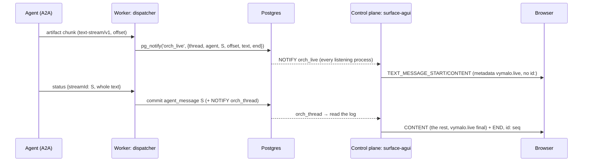
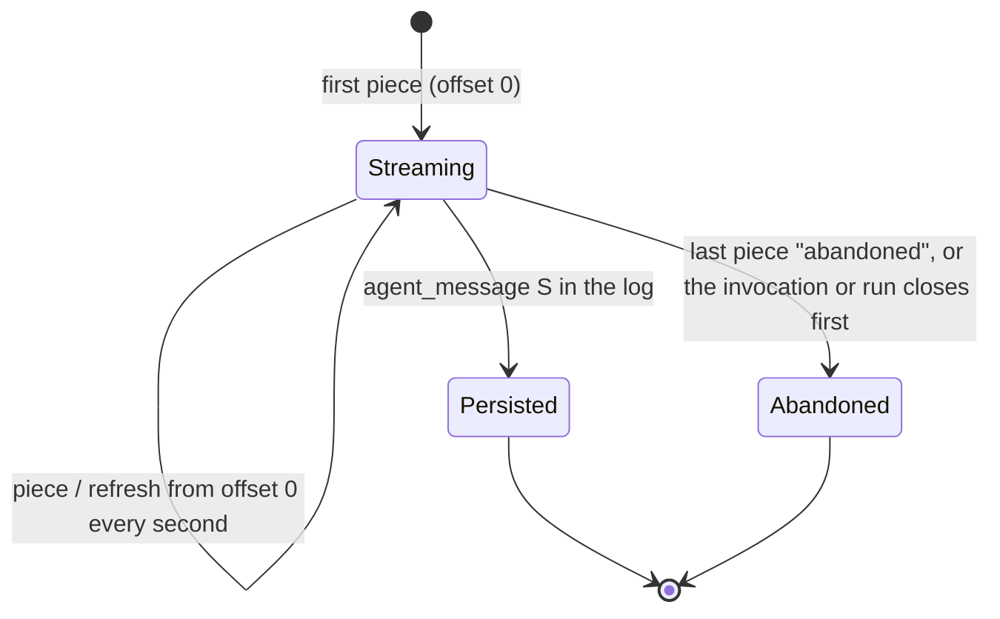

# ADR 0027 — Live text is relayed, not stored

- **Status:** accepted (2026-10-01), on the owner's delegation (the relay on the `Wakeup` port, the
  one-second refresh and the 64 KiB bound are defaults taken on it; the owner may revisit them).
  Amends [ADR 0012](0012-ag-ui-user-facing-protocol.md): "AG-UI is a view of the log" becomes "a view
  of the log, plus live frames that are never resume points".

## Context

"I want to see the agent's words as they are written" (owner, 2026-10-01; sys #65, adam #51). Today a
reply appears all at once: the agent's words reach the log as one final `agent_message`, so the person
looks at "working" until the model has finished writing, which can be a minute.

- The log is the chat (ADR 0001). Its events are final: a replay, a reconnect and an export all read
  the same words. An `agent_message` already has room for a partial (`is_final: false`), but storing
  every partial would put hundreds of events in the log for one reply and make a replay show
  half-written text.
- The process that holds the agent's stream is **not** the process that serves the viewer. In the
  `split` profile a worker runs the dispatcher and the control plane serves AG-UI
  ([ADR 0015](0015-control-plane-and-workers-on-adam-rs.md)); a viewer is connected to a replica that
  never saw the agent's bytes. Postgres is the only thing they share, and `LISTEN/NOTIFY` is already
  the channel they wake each other on ([`Wakeup`](../orchestrator.md#live-updates)).
- The AG-UI connect stream is the projection of the log from the first event, and resumes by `id:`,
  which is the log's `seq`. A frame that is not in the log has no `seq` to resume from.

The agent side is an optional A2A extension, `text-stream/v1` (ADR 0008 pattern): the chunks of a
reply as artifact updates, and the whole text once, in a status message, as the durable copy.

## Decision

1. **Live text is never stored.** The log holds the final text of a reply, once, as an `agent_message`
   whose id is the id of the stream that produced it. A chunk is not an event, not an artifact and not
   part of the job ledger; nothing of it survives the process that holds it.
2. **It is relayed on the `Wakeup` port.** The worker that holds the agent's stream turns each chunk
   into a `LiveText` (thread, agent, stream id, UTF-8 byte offset, text, end) and publishes it with
   `Wakeup::publish_live`; every process that listens, whatever its role, receives it with
   `subscribe_live`. On Postgres that is a `NOTIFY` on its own channel, `orch_live`, over the listener
   every process already holds: no new connection, no new port. The channel carries less than 8000
   bytes a message (*verified 2026-10-01*,
   [postgresql.org/docs/16/sql-notify.html](https://www.postgresql.org/docs/16/sql-notify.html)), so a
   piece is at most 6 KiB of text and an implementation splits one whose encoding would not fit.
3. **It is best effort in both directions.** A publish that fails is logged at `debug` and never fails
   a delegation; a subscriber that lags loses pieces without a `Resync`. Two things make that safe:
   the sender, at most every 100 ms per stream, merges what it holds, and **every second republishes
   the whole text so far** (from offset 0, up to 64 KiB), so a viewer that connects mid-stream, or lost
   a piece, has the text within a second; and the final message is in the log.
4. **AG-UI shows it through an overlay, never through the log.** Live frames are made per connection
   by a pure overlay on the projection (`TEXT_MESSAGE_START/CONTENT` with `metadata["vymalo.live"]`),
   which never changes the projection's fold and never gives a live frame an `id:`: a live frame is
   not a resume point. When the agent's message arrives in the log, the overlay **merges by message
   id**: the final `CONTENT` carries only what the viewer has not yet seen, with the offset it
   continues from (UTF-16 code units, the unit of the client's strings), and the `END` closes the same
   message. A connection that opens after the final sees the plain message, as it does today.
5. **A stream that ends without its final text ends visibly.** The agent can end a stream as abandoned
   (the model failed); the overlay also ends an open live message when its invocation or run closes
   first. The viewer is told (`vymalo.live` `abandoned`), so a half-written reply is never left looking
   alive.
6. **Words before tool calls are messages too.** An agent that states the text of a stream in a
   `working` status (the words it wrote before calling a tool) has them logged as an `agent_message`
   with the stream's id, which is what streaming shows and what a reload should still find
   (the owner's default of 2026-10-01).

## Consequences

- Nothing new persists, so [ADR 0001](0001-rust-state-machine-on-postgres.md) stands: the deltas are
  ephemeral data on a cross-process channel that already exists, like the wakeups. A restarted or
  killed process loses only what had not yet been said.
- The `split` profile works without a new component, because every role listens to `orch_live`. Every
  process hears every thread's live text; the bound is at most ten pieces a second per stream plus the
  refresh, and the volume is to be measured on the `split` stack when the relay is built (*unverified*
  until then). An implementation of the port that cannot do this (`WakeupCapabilities.live: false`)
  shows nothing live, and the log is unchanged.
- A viewer sees the words up to a second late after a reconnect, and a lost piece is repaired by the
  next refresh. A reader of the log sees exactly what it saw before.
- The web must not let a live message into its runtime under an id the log does not have (the
  `RunAgentInput` it sends back would then name an unknown message): it keeps live text as drafts
  outside the runtime and hands over the message when the final one arrives.
- The pure core gains data types only (`LiveText`); the projection gains the overlay; the A2A adapter
  gains the mapping; the dispatcher gains a relay. Required elsewhere: the `text-stream/v1` contract
  page, the AG-UI documentation of the live frames, goldens and conformance, the web's drafts, and the
  agents' side (adam-rs streaming the model's answer).

## Alternatives rejected

- **Store coalesced partials in the log.** It breaks "only the final text is stored", fills the log
  (and the export) with half-written messages, and makes every replay and every
  `RunAgentInput.messages` carry text the agent may still change.
- **A direct stream from the worker to the control plane** (a socket, or HTTP between replicas). A new
  port and a second network path to secure, to carry what Postgres already carries to every replica;
  it also needs the control plane to know which worker holds a thread.
- **Polling the agent's task from the control plane.** The agent's `GetTask` has no deltas, and the
  control plane would have to hold the agent's credentials and a second stream per viewer.
- **Making live frames resume points** (giving them a sequence). Live text is not in the log, so the
  numbers could not be the log's, and a client that resumed from one would skip log events.
