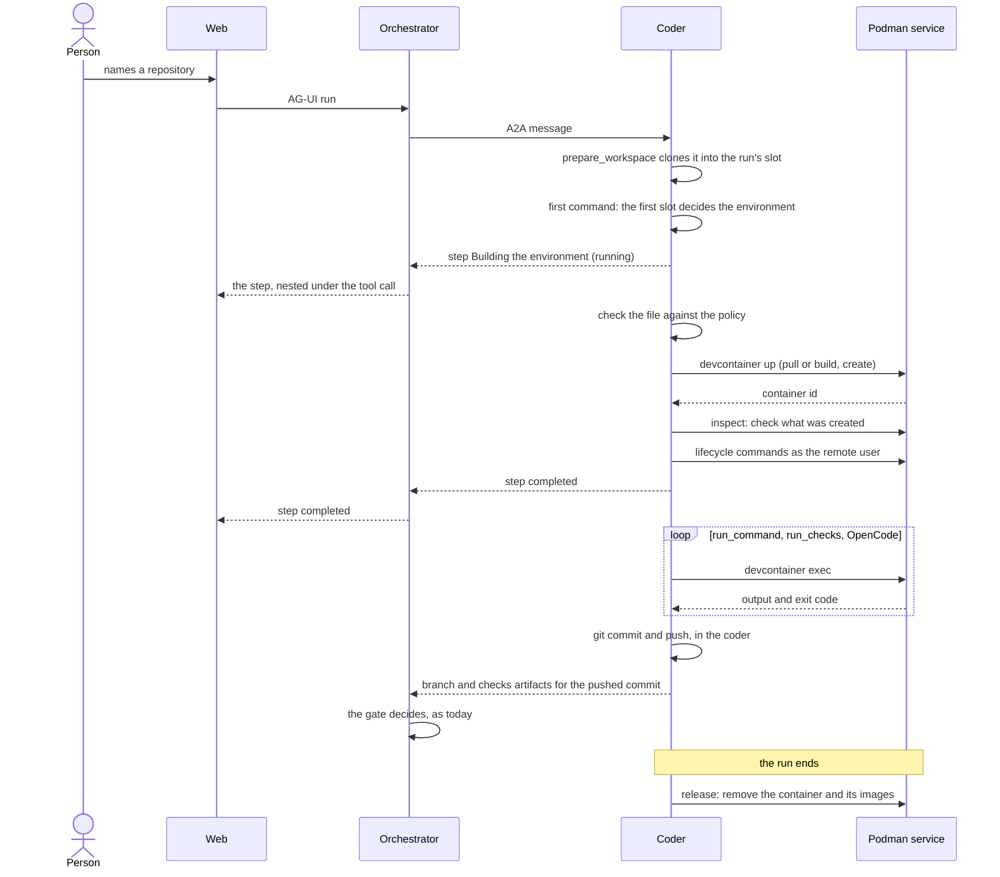
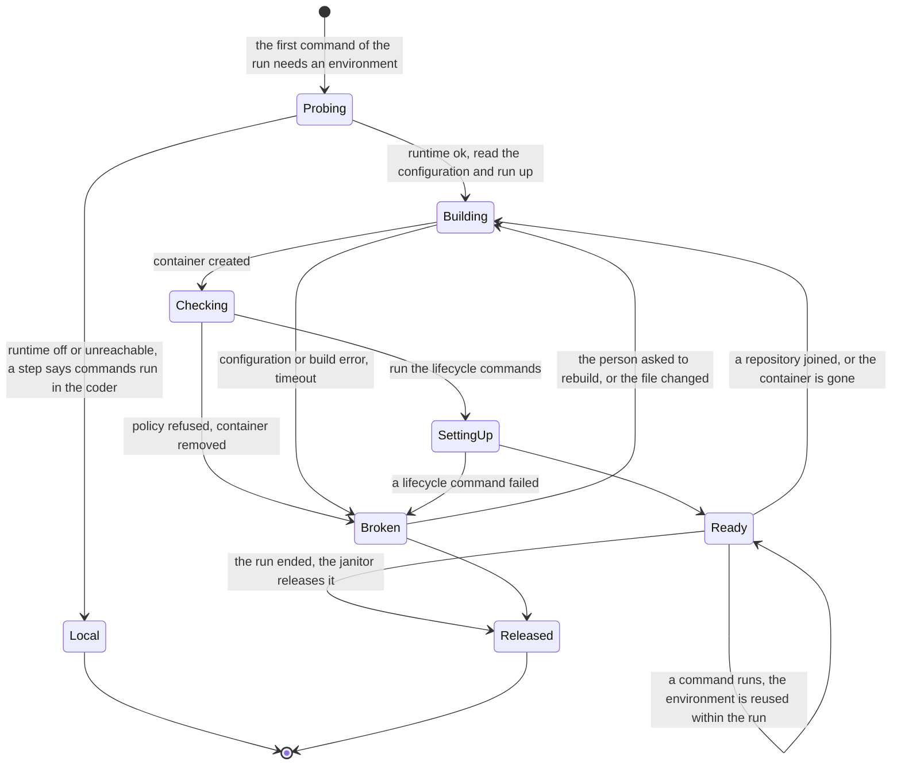

# ADR 0028 — devcontainer.json is the workspace environment contract

- **Status:** accepted (2026-10-01), an owner decision. Not built: it is MVP slice 7b, after slice 7. The
  defaults listed under [Defaults the owner may revisit](#defaults-the-owner-may-revisit) were chosen
  by the plan, not by the owner.

## Context

The owner asked on 2026-10-01: "Can't we use devcontainers to build work environments?", and then:
"Go with 7b after slice 7."

Today a coding agent runs every command in its own container. adam-coder runs `run_command`,
`run_checks` and OpenCode, and every command OpenCode starts, inside the coder's image, which is
another-agentic-images' `workspace` image plus the coder. One image has to carry the toolchain of
every repository it will ever meet, and a repository cannot say what it needs
([vision](../vision.md#6-workspaces-what-the-system-expects-of-agents)).

The facts below are what the decision rests on. Each is marked.

**The specification and the tool** (*verified 2026-10-01*):

- A repository describes its environment in `devcontainer.json`, a "JSON with Comments file". A tool looks
  for `.devcontainer/devcontainer.json`, then `.devcontainer.json`, then
  `.devcontainer/<folder>/devcontainer.json`, one level deep. An image can carry configuration in a
  `devcontainer.metadata` label. The property `initializeCommand` runs on the host machine, during
  initialization (<https://containers.dev/implementors/spec/>).
- The specification repository is licensed CC-BY-4.0 and MIT
  (<https://github.com/devcontainers/spec>).
- The devcontainer CLI is "a reference implementation for the specification that can create and
  configure a dev container from a devcontainer.json", licensed MIT
  (<https://github.com/devcontainers/cli>). The npm package `@devcontainers/cli` is at 0.89.0, MIT, with
  no runtime dependencies (<https://registry.npmjs.org/@devcontainers/cli/latest>).
- envbuilder, Coder's tool that builds a dev container from inside a container on Docker, Kubernetes
  and OpenShift, says in its README: "`envbuilder` is in maintenance mode and no new features are
  planned, please explore alternative options." (<https://github.com/coder/envbuilder>)

**The default image** (*verified 2026-10-01*):

- [vymalo/another-agentic-images#9](https://github.com/vymalo/another-agentic-images/pull/9)
  ("publish the workspace image as a dev container base") merged on 2026-10-01 as `ee2273e`. CI runs
  `@devcontainers/cli@0.89.0` against the image.
- The tag is `ghcr.io/vymalo/another-agentic-images/workspace:1.98.1-ee2273e`, digest
  `sha256:9b2670fc45f50b7b7b8f959fe5caa06e630cba86c0229b2a7d33bee7f26d752a`. The registry answered
  an anonymous pull of the manifest with HTTP 200 on 2026-10-01 (read from the registry for this page).
- Its image configuration (linux/amd64, user `agent`) carries the label `devcontainer.metadata` =
  `[{"remoteUser":"agent","containerUser":"agent","updateRemoteUserUID":true}]`, read from the
  registry on 2026-10-01.

**What a rootless Podman service allows** (*verified 2026-10-01 by running it* in the slice 7b
planning, with Docker 29.6.2, kernel 6.18, `@devcontainers/cli@0.89.0` and
`quay.io/podman/stable:v5.8.7-immutable`; not re-run for this page, and adam's ADR and CI repeat
it):

- The CLI builds and starts a devcontainer through the socket of a `podman system service` run by an
  unprivileged user (uid 10001), using `--docker-path podman` and Podman's remote client. A Dockerfile
  build, a non-root `remoteUser`, `postCreateCommand`, `containerEnv` and `exec` all work this way.
- That service itself runs in a container with no `privileged`, no `cap_add` and no `devices`. It
  needs containers/common's seccomp profile instead of Docker's default, and `systempaths=unconfined`.
  Where AppArmor is on, it also needs `apparmor=unconfined`.
- The CLI has no command that removes a container. Killing the `exec` client leaves the process it
  started inside the container running. Podman's `rm -f` can report an error and still remove the
  container.

**Unverified**, to be checked by the builds of slice 7b:

- Ubuntu 24.04 hosts (CI runners) set `kernel.apparmor_restrict_unprivileged_userns=1`, which the service
  needs off (a secondary source says so).
- DNS to compose service names from inside a devcontainer on the service's network.
- podman-remote 5.4.2 from Debian trixie against a Podman 5.8.7 server.
- Whether a Kubernetes cluster's policy lets the Podman service run at all.

**What this repository already says.** Sandboxes and runtimes are the agent host's concern
([ADR 0007](0007-protocol-only-dependencies.md), [ADR 0003](0003-git-as-durable-state-ephemeral-workers.md)),
and sandboxing a local agent is "the agent's responsibility, not the orchestrator's"
([ADR 0015](0015-control-plane-and-workers-on-adam-rs.md)).
another-agentic-platform is design only (*verified 2026-10-01*, its `CLAUDE.md`), and its open
questions still ask "What runtime sandbox technology is required?"
(`docs/architecture/11-decisions.md`).

## Decision

1. **A repository's `devcontainer.json` is its work environment.** The contract is the
   containers.dev specification. The coding agent builds and starts the environment with the official
   devcontainer CLI. Inside it, the agent runs `run_command`, `run_checks`, OpenCode and every command
   OpenCode starts. The file tools and all git work stay in the agent's own container, because they act on
   the shared worktree and git holds the credentials. The orchestrator does not know any of this
   (see [Which invariants it touches](#which-invariants-it-touches)).
2. **Which repository decides.** The first repository of the workspace, in the order its slots joined
   the run, decides once, for the whole run. A scratch slot counts as a slot. In it the agent looks for the
   file in the order of the specification above. If there are several in
   `.devcontainer/<folder>/`, the first in sorted order is used, and a step says so.
   - **Later repositories** are mounted into the same container. Their own devcontainer is
     ignored, and a step says which one is used.
   - A workspace that starts as scratch work therefore keeps the default environment after a repository
     joins it.
3. **The default.** A first slot with no devcontainer file gets another-agentic-images' `workspace`
   image, published as a dev container ([vymalo/another-agentic-images#9](https://github.com/vymalo/another-agentic-images/pull/9)).
   The built-in default is that image, pinned by tag and digest; a deployment can set another
   (`DEVCONTAINER_DEFAULT_IMAGE`). The toolchain stays in that image; there is no devcontainer *feature*
   that installs it.
4. **The runtime is a rootless Podman service, never the host's Docker socket.**
   - The agent reaches it over its API socket, through the official CLI.
   - The service has no `privileged`, no `cap_add` and no `devices`. It is the trust boundary and is
     trusted like the agent. One service serves one workspace volume, mounted at the same path in both.
   - A deployment without a service runs with `DEVCONTAINER_RUNTIME=off` (the default).
5. **The file is untrusted input.** A repository's `devcontainer.json` can run commands. The agent checks it
   before the build, checks what the features and the image add to it, and checks the created container, which
   has the last word. Refused: `privileged`, a capability other than `SYS_PTRACE`, a bind mount, a Docker
   Compose file, `runArgs` outside a short list. `initializeCommand` is removed: the specification runs it on
   the host side, which here is the agent's container, next to its credentials. `${localEnv:…}` resolves
   from a cleared environment. Nothing is published. The environment never gets the GitHub token or
   App key, `DATABASE_URL`, the bearer tokens or the thread-tools token. OpenCode's model key arrives as a
   read-only file, never on a command line.
6. **Nothing happens silently.**
   - The environment is built in steps shown under the tool call that needed it, nested as in
     [ADR 0025](0025-nested-steps-events-carry-their-source-path.md): `Building the environment from
     .devcontainer/devcontainer.json (local/devbox)`, `Using the default environment (<image>)`.
   - **A broken file** (a parse error, no `image` or `build`, a refused privilege, a failed build or lifecycle
     command, a timeout) ends the step as failed, naming the file and the problem. The agent asks the person
     how to go on: fix the file, or continue in the default environment. There is no silent fallback.
   - **No runtime** (off, or the service unreachable): the run goes on in the agent's own environment, with
     a step that says so. If the repository has a devcontainer, the step says the deployment runs without a
     container runtime. A tool that exists only in the devcontainer is then reported as missing.
7. **Teardown.** When the run ends, the agent's janitor removes the container and the images built for the
   run, and checks by label that none is left. A restarted agent finds its containers by label. Pulled base
   images stay cached.
8. **Kubernetes waits for the platform.** On Kubernetes the coder stays `Local`: commands run in its own
   container, the Helm chart keeps `DEVCONTAINER_RUNTIME=off`, and its README says why. Devcontainers
   there wait until the platform has a sandbox provider (open question 41).

### Done when

[MVP slice 7b](../mvp.md) lists what must hold, proven by this system's end-to-end script through the
web (AG-UI) and by the agent's own end-to-end test over A2A: a repository with a devcontainer, one
without, no runtime, a broken file, teardown, and least privilege.

### The sequence

### The environment's lifecycle

The diagrams leave out how `Broken` is remembered. A broken environment is cached for the run, so a retry
gets the same error at once, until the file changes or the person asks for a rebuild. A rebuild that says
"use the default" sets a per-run flag. Joining a repository recreates the container (so that the new mirror
is mounted and the lifecycle commands run again); a container lost to a service restart is recreated too,
with a step that says so.

## Which invariants it touches

- **Protocols only ([ADR 0007](0007-protocol-only-dependencies.md)).** What this adds is a file format
  and a command line tool: containers.dev is a published specification, and its reference CLI is MIT
  licensed. The CLI is a dependency of the agent's image, like `git` or OpenCode. The orchestrator
  depends on neither the CLI nor Podman, and this repository gains no dependency on an agent host,
  gateway or SDK.
- **Host conveniences are optional ([ADR 0008](0008-platform-integration-via-a2a-extension.md)).** This is
  not an extension, because the orchestrator takes no part. It is a requirement on agents that run
  commands in a workspace, as [vision capability 6](../vision.md#6-workspaces-what-the-system-expects-of-agents)
  is. An agent that does not do this still works, and plain A2A agents are unaffected. The one thing that may
  reach the system is an optional `environment {kind, source?, image}` field in the `checks` artifact. The
  gate ignores it (*verified 2026-10-01*: `recognise_artifact` in
  [`core/src/gate.rs`](../../orchestrator/crates/core/src/gate.rs) at `c8cd1f8` reads `passed`, `commit`,
  `summary` and `findings` and no other key).
- **Stateless, one event log ([ADR 0001](0001-rust-state-machine-on-postgres.md)), git is the artifact
  ([ADR 0003](0003-git-as-durable-state-ephemeral-workers.md)).** An environment is built from the
  repository's file and is never stored in Postgres. The container and its per-run files are scratch on the
  coder's workspace volume, beside the worktree, with the worktree's lifetime. A lost container is rebuilt
  from git, and what a process left inside it is gone: only what was pushed counts.
- **Verification over consensus ([ADR 0002](0002-verification-over-consensus.md), [ADR 0018](0018-verification-gate-and-rework-loop.md)).**
  The gate is unchanged. The agent's checks run in the repository's own environment but are still bound
  to the commit that was pushed.
- **The core is pure, protocols are closed enums, implementations are swappable
  ([ADR 0004](0004-closed-enums-over-dyn-registry.md), [ADR 0009](0009-swappable-implementations-at-build-time.md)).**
  Nothing changes in the orchestrator. In adam-rs the seam is an `Environment` trait in the workspace
  crate, with `Local` (today's behaviour) built in slice 7 and `DevContainer` built in slice 7b. The
  choice is made at build and configuration time (`DEVCONTAINER_RUNTIME`), not by a plugin.

## Consequences

- A repository says what it needs, in a file that tools other than ours read, and a missing tool gets an answer
  that says where to add it (the repository's `.devcontainer/devcontainer.json`, or, on the default
  image, a devcontainer in the repository).
- Every coder that uses it needs a rootless Podman service beside it, on the same workspace volume at the same
  path. Images are stored a second time, the first run of an environment pays for pulling and building, and a
  host may need a setting (the Ubuntu sysctl above). Where the service cannot run, the agent degrades to the
  agent's own environment with a visible step, and does not break.
- A new class of untrusted input is accepted from repositories, and the policy above is the control. The
  residual risk: an escape from a devcontainer lands in the Podman service, which sees every run's workspace
  and its socket, but holds no GitHub credential. It is not isolation between tenants. Stronger isolation
  (a service per run, gVisor, the platform's sandbox) comes after the MVP.
- Required elsewhere:
  - **adam-rs:** the `Environment` seam in slice 7, then the `adam-devcontainer` crate, the coder's tools
    and its image (the CLI and `podman-remote`), and its own ADR (the contract and the full list of defaults).
  - **another-agentic-images:** the workspace image as a dev container base (done, #9).
  - **this repository:** the compose override with the Podman service, the fixtures `local/devbox` and
    `local/devbox-broken`, the end-to-end script, and `dev/README.md`. No orchestrator or web change: the
    environment appears as nested steps ([ADR 0025](0025-nested-steps-events-carry-their-source-path.md)).
  - **another-agentic-platform:** a sandbox provider, before Kubernetes can use devcontainers.

## Defaults the owner may revisit

The plan built these defaults. The owner may choose differently.

| Topic | Default | Alternative |
|---|---|---|
| A scratch slot comes first | It counts as the first slot, so the run keeps the default environment after a repository joins | Skip scratch slots, and let the first repository decide (rebuilding when it joins) |
| The default image in tests | The local stack and CI use Microsoft's small `mcr.microsoft.com/devcontainers/base` image; production uses the `workspace` image. The real image is tested nightly or by hand | Test with the `workspace` image every time, at several gigabytes more per runner |
| Compose-based devcontainers (`dockerComposeFile`) | Refused, with a clear error | `docker compose` against the Podman socket: needs the compose CLI in the coder and the policy on every service |
| Privileges | `capAdd` only `SYS_PTRACE`; `securityOpt` only `seccomp=unconfined` and `label=disable`, both under the service's own filter. `privileged`, other capabilities and host binds refused, so no Docker-in-Docker | Refuse those too, which breaks the official rust, go and cpp features |
| A repository joins the run | Recreate the container, so the new mirror is mounted and lifecycle commands run again | No restart, and no git inside the slot that joined late |
| A broken file | An error, and the person decides | Fall back to the default image on its own, with a warning step |
| The container's network | The service's own network, which the deployment limits (`inherit`) | `none`, which needs a per-run model proxy in the coder before OpenCode can work |
| No runtime | Run in the agent's own environment, with a visible step | Fail closed when the repository declares a devcontainer |

## Alternatives rejected

- **envbuilder.** It builds a dev container from inside a container, and its README says it is in
  maintenance mode with no new features planned (*verified 2026-10-01*). The official CLI is the
  reference implementation of the same specification.
- **The host's Docker socket.** It hands the coder control of the host's containers, beside the
  credentials the coder holds. A rootless Podman service keeps the blast radius inside that service.
- **A privileged or Docker-in-Docker service.** Not needed: the nested run works with the settings above
  (*verified 2026-10-01 by running*, see Context).
- **One image with every toolchain, as today.** It cannot know a repository's needs, and every change to
  a toolchain is a new image for every repository.
- **A toolchain devcontainer feature in another-agentic-images.** It would be a new package on the
  registry, private until the owner flips it. The install script assumes Debian, amd64 and one user, and
  gigabytes of toolchain in every build defeat a repository-specific environment. The one tool the agent
  needs inside, OpenCode, is mounted from the agent. A small `opencode` feature can come later if images
  based on musl matter.
- **A silent fallback when the file is broken.** The person would not know that the checks ran in
  another environment than the repository declared.
- **Devcontainers on Kubernetes now.** They need a sandbox provider that the platform does not have yet
  ([open question 41](../open-questions.md)).
