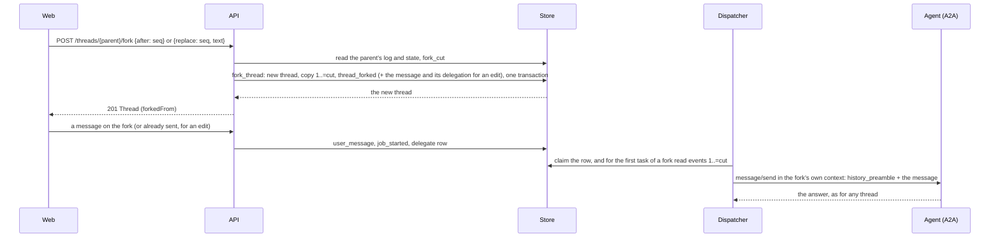
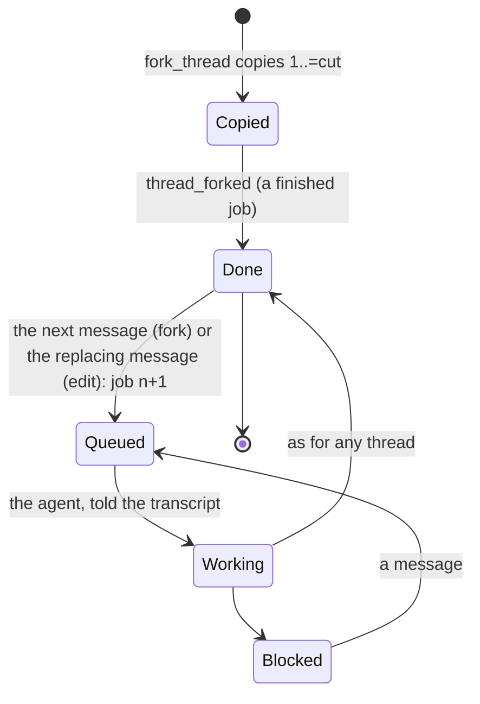

# ADR 0029 — Forking a thread copies its log

- **Status:** accepted (2026-10-01), on the owner's request of the same day ("chat forking and
  branching"); the defaults below (the transcript for the agent, edits hidden from the list, the
  parent's title kept) are taken on the delegation and the owner may revisit them. Built so far: the
  core (the event, the cut, the snapshot, the transcript and the edit families). Not built yet: the
  store and the API, the AG-UI marker, the transcript on the wire, the web.

## Context

The owner asked to fork a chat from any answer, to continue a chat with another agent without losing
what was said, and to edit an earlier message and keep both versions, the way ChatGPT's branches do.

- The log is the chat ([ADR 0001](0001-rust-state-machine-on-postgres.md)): one append-only sequence of
  events per thread, `seq` from 1, which every reader (the projection, MCP, the export) folds from the
  start. A thread is one A2A context ([ADR 0021](0021-context-across-a2a-tasks.md)): `context_id` is
  the thread id, and a new task of the thread names the previous task.
- An agent holds its conversation in its context. adam-rs continues a referenced task only when it is
  the caller's, in the same context and finished; a reference from another context starts a fresh task,
  and a message that names a context with an open task goes into that task's inbox (read in
  another-agentic-adam-rs at `5905ad8` when plan 08 was written, 2026-10-01; *unverified* here, and
  plain A2A agents may ignore `referenceTaskIds` anyway). So a fork cannot share its parent's context:
  its messages would land in the parent's open task, and the two threads would queue behind each other.
- A fork of a coding thread has the conversation but not the workspace the parent's agent built
  ([open question 40](../open-questions.md)).

## Decision

1. **A fork is a new thread whose log starts with a copy of the parent's events.** Events `1..=cut`
   of the parent are copied with the same `seq`, `at`, actor and data (and no idempotency key), then one
   `thread_forked` event at `cut + 1` (actor: the person), then the thread's own life.
   `ThreadForkedData { from: {threadId, seq: cut}, kind: fork|edit, title, target }`. Nothing is shared
   with the parent after the copy: a deleted parent leaves its forks whole.
2. **Where a thread may be cut** (`fork_cut`, pure). `AfterTurn(s)`: the last event before the first
   `user_message` or `ui_action` after `s`, or the end of the log when none follows; a thread that is
   `queued`, `working` or `verifying` has a turn that is not over, and its end cannot be copied
   (`TurnOpen`). A `blocked` thread has ended its turn and copies as it is, with its question.
   `Replace(s)`: `s` must be a `user_message` (else `NotAMessage`), the cut is `s - 1` (0 copies nothing),
   and the parent may be in any state: what comes before a message is settled whatever follows it. A seq
   outside the log is `OutOfRange`.
3. **A fork is a finished job** (`forked_snapshot`). Its state is `done` and its job number is the newest
   `job_started` it copied (1 when none), so its next message starts the next job
   ([ADR 0020](0020-a-thread-is-a-conversation.md)) and the ids the projection derives from the job number
   stay unique across the copy. The gate is the deployment's, as for a new thread, and `verification`
   counts the copied `completed` statuses under it, as the projection counts them. The fork's **UI catalog
   ledger is empty**: its agent is a new context that has been sent no catalog, so the first message that
   carries one sends it in full ([ADR 0023](0023-ui-component-catalog-as-an-a2a-extension.md)).
4. **The title.** A fork has the parent's title as it was when the fork was made (the `title` of the
   event, which the thread row keeps), and the parent's **title ledger** with no ask in flight
   ([ADR 0005](0005-openai-compatible-model-endpoint.md)): a title a person wrote stays theirs, a title the
   model wrote is not asked for again, a thread that still had the first words may be titled by the
   fork's own first reply, and nothing the parent had asked of the model is the fork's business. The
   `thread_titled` events at or before the cut are copied like any other event; a title written after
   the cut is not, and does not need to be: the fork's title comes from the `thread_forked` event, which
   the projection folds last. A person's rename of the fork is final, as for any thread. An edit of the
   first message keeps the parent's title too, which may no longer fit; renaming is one click and a title
   written from the first words would be wrong more often than a kept one.
5. **The agent learns the conversation from a transcript, not from the context** (`fork_history`,
   `history_preamble`, pure). On the fork's first task the dispatcher builds the history from the fork's
   own events `1..=cut` and puts it in front of the first message as one text part: the messages of the
   person, the final messages of the agent and the words of a status that ends or interrupts a turn
   (`completed`, `input_required`, `auth_required`, said once when the agent said them in a final
   message of the same turn), each cut at 4 KiB, the newest kept within 24 KiB, with the count of the
   older ones left out. The person is never named by an address. The text is fenced and named a record,
   not instructions; a message cannot close the fence or pose as a speaker, because every line of a
   message after its first is indented and an entry starts with a name made of letters, digits and
   `-_.`. It is derived from the log when the task is sent, so a retry sends the same text, and it is never
   in the outbox payload. Later tasks of the fork reference the fork's own previous task as usual.
6. **A fork has its own A2A context** (its thread id), for the reason in the context above.
7. **An edit is a fork with its message** (`fork_commit`): the commit is the `thread_forked` event,
   then the replacing message through `transition` on the forked snapshot, which gives `user_message`,
   `job_started` and the delegation. The edit's thread is a **sibling** of the one it was cut from: its
   position in the family is data the store reads (`EditLink`: the parent, the cut, and the seq of the
   replacing message, which is not always `cut + 2` because a `ui_catalog` may come before it).
8. **Branches are the edits of one message** (`branch_points`, pure). A thread made by an edit of `P`
   at cut `c` has its own message in place of `P`'s at `c + 1`; the two are versions of one message, and
   so are the versions of an edit of an edit. Everything of a thread up to its cut is its parent's, so
   it shows the parent's versions there. A thread made by "fork from here" is a root of its own family
   and not a sibling. At most 256 threads of a family are looked at, the thread asked about and what it
   was made from first.

## Consequences

- ADR 0001 holds: one log; the only things outside it are the job ledger and row metadata (the
  `forked_from` columns of the thread row). A fork is readable by every reader that already reads a log;
  the one new event kind is additive and a reader may skip it.
- Storage is copied, not shared: one `INSERT ... SELECT` per fork of text that is small. Nothing
  reads across threads, so there is no join to keep fast and no parent to keep alive.
- The projection, MCP and the export gain an arm for the event; the projection's frames for it (a
  marker and a snapshot that says the fork's origin) are a step of their own.
- A fork of a coding thread starts a coder with the conversation and not the workspace, and may push to
  a branch name the parent used ([open question 40](../open-questions.md)).
- A fork onto another agent is the same operation with a `target`; "continue with another agent"
  needs no second mechanism.
- An edit of the first message starts the fork at job 2 with `job_started {2}` as its first event of
  its own: the job number is the next after the finished job the fork stands for, and a log has to
  carry at least one. Cosmetic, and the same boundary as any follow-up.

## Alternatives rejected

- **A tree-shaped log** (events with a parent pointer, one thread many tips). It breaks the linear
  projection, the one A2A context per thread and every reader of `seq`, for what a copy gives with
  none of those changes.
- **A reference the readers stitch** (the fork stores only its own events and a pointer to the parent's
  prefix). Every reader changes, a deleted parent breaks its forks, and `seq` stops being one sequence.
- **Sharing the parent's A2A context.** The fork's messages would reach the parent's open task and the
  two threads would serialise on one agent.
- **`referenceTaskIds` across contexts** to give the agent the earlier conversation. adam-rs ignores
  them across contexts and a plain A2A agent may ignore them anywhere; the transcript works for every
  agent. A `history/v1` extension that seeds an agent's conversation natively is a later option.
- **Re-titling a fork from its own conversation.** It would replace a title the person may have
  written, to improve on one the parent's conversation already earned.
