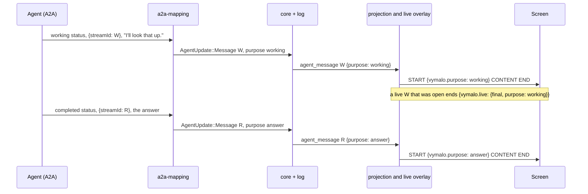
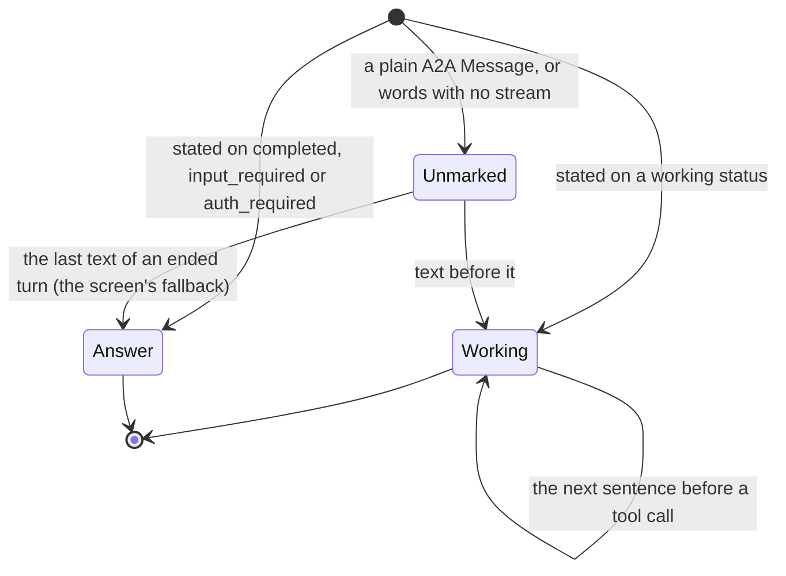
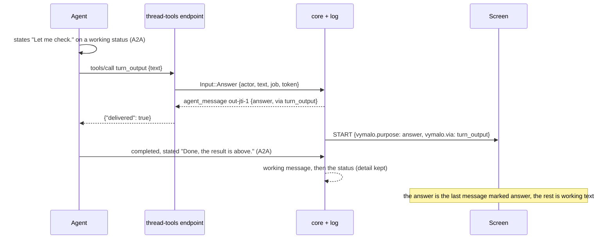
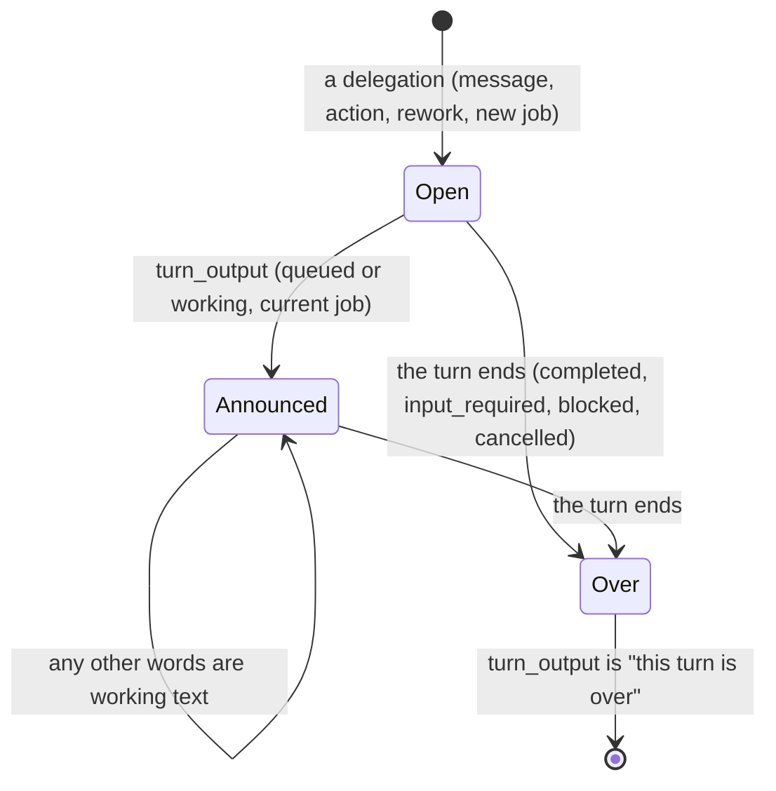

# ADR 0031 — Working text and the turn's answer

- **Status:** accepted (2026-10-02), on the owner's answer of the same day: the structural rule first, the
  `turn_output` tool after it. This ADR is the rule and the marks it writes. **Amended (2026-10-02, the tool):** the
  `turn_output` tool is built, and the rules it needs are written in [the amendment](#amendment-the-turn_output-tool-2026-10-02)
  at the end (points 2 and 6 below say what the tool changes). Extends [ADR 0012](0012-ag-ui-user-facing-protocol.md) (its status note of 2026-09-30, "the agent's words":
  what an agent says when it finishes or asks is its answer) and [ADR 0027](0027-live-text-relayed-not-stored.md)
  (a live draft can turn out not to be the answer and be folded away).

## Context

"While the tool calls were going to the right rail, the working comments were staying in the middle of the page. It'd
be best if we could have 'working tokens' like 'thinking tokens' and a 'final turn tokens' answer, so that all the
others appear like thinking, but all hidden, not collapsed. That way the user can focus on the main outputs." (owner,
2026-10-02, on the coder thread whose main column held every sentence the agent wrote before a tool call.)

What the exported chats show, and what the code does:

- adam-rs states the words before a tool call on a `working` status and the words that end the turn on the status
  that ends it (`completed`, `input_required`), each with the `text-stream/v1` marker
  ([adam-rs ADR 0007, decision 13](https://github.com/vymalo/another-adam-rs/blob/main/docs/decisions/0007-progress-as-steps-and-streamed-text.md);
  *verified 2026-10-02* by reading it in the sibling checkout). The orchestrator's adapter maps **both** to the same
  final `agent_message` ([`text-stream-v1.md`](../api/text-stream-v1.md) section 4), so the log cannot tell them apart:
  the coder's exported thread holds eight final messages, an answer and seven sentences written before a tool call, and
  they look exactly alike.
- A2A **already carries the announcement**. The status that ends a turn is the agent saying "this is my answer". The
  adapter reads it and then throws the difference away.
- The projection says an answer once (the status words are not said again when they equal the last final message),
  and a live message opens its `TEXT_MESSAGE_START` before anyone knows what the words are for (ADR 0027).
- AG-UI 1.0 has `REASONING_*` events. A live text message cannot become a reasoning message after it has started, so
  a client that does not know the convention would show a working sentence twice.

## Decision

1. **The adapter marks the text by the status it came on.** An `agent_message` made from a stated stream gets
   `purpose`:
   - `working` when the status is `working`;
   - `answer` when the status ends the turn: `completed`, `input_required`, `auth_required`;
   - nothing for the words of any other status (a `failed` status's words are its error) and for a plain A2A
     `Message` from an agent that does not state streams: those say nothing about their purpose, and the field is
     absent. No agent changes: the status an agent already chose is the mark.
2. **The event carries it.** `AgentMessageData` gains two optional members, both omitted when absent (so an older log
   reads as it always did, and an orchestrator that does not know them ignores them):
   - `purpose`: `"working"` or `"answer"` (`MessagePurpose`);
   - `via`: `"turn_output"` (`AnswerVia`), how an answer was announced when it was not by the status that ends the
     turn. **Reserved** in the first version of this ADR, so that the tool did not change the event again; the
     `turn_output` tool writes it now (see the amendment).
   `AgentUpdate::Message` gains `purpose`; the core copies it to the event. Nothing else in the core changes, and no
   migration is needed (the members live in the event's JSON).
3. **AG-UI says it in metadata, on the message's `START`:** `metadata["vymalo.purpose"]` is `"working"` or `"answer"`,
   and `metadata["vymalo.via"]` is `"turn_output"` beside an answer that was announced that way. No member when the
   event has none. **Working text is not mapped to `REASONING_*`.** A generic AG-UI client therefore shows the same
   transcript it showed before (graceful degradation); a screen that knows the key decides what to hide.
4. **The live overlay says it at the end.** A live message opens before anyone knows what its words are for. When the
   log's final message for it arrives marked `working`, the `END` that closes the live message says it:
   `TEXT_MESSAGE_END{metadata:{"vymalo.live":{final:true, purpose:"working"}}}`. A screen takes the draft out of the
   conversation at that moment (drafts already live outside its runtime, ADR 0027) and files the text with the
   steps. An answer's `END` says nothing more than `final: true`: the draft is the answer, and stays.
5. **What an unmarked text is is the screen's rule, not the log's.** A reader that finds no `purpose` (a plain A2A
   agent, the words said as status words `st-<seq>`, every log written before this ADR) treats the **last text of an
   ended turn as its answer** and the text before it as working, and in a running turn shows an unmarked text as a draft
   until a step starts after it. The log is not rewritten and the event is not guessed at: the fallback is applied
   where the text is drawn (the web, S6 of plan 10).
6. **The status words are unchanged.** The words of a `completed`, `input_required` or `auth_required` status that were
   not already said as a message are still said once as `st-<seq>` (ADR 0012), and carry no `purpose`: no event says
   what they are for, and the fallback of point 5 reads them as the answer they are. The `turn_output` tool, which will
   say "the status words are not said when the turn has an announced answer", is the next decision and is not taken
   here. *(Taken in the amendment below: once a turn has announced its answer, those words are working text.)*

## Consequences

- The web can keep one message per turn in the conversation and put the rest where the steps are (S6), and an old
  thread gets the same view through the fallback. A client that ignores `vymalo.purpose` reads exactly what it read
  before.
- The export is unchanged in format (`version` 1, additive): events keep `purpose` and `via`.
- An agent's choice of status is now visible to the person. An agent that states its whole reply on a `working` status
  and then finishes with a one-word `completed` would have its reply folded away; the contract page
  ([`text-stream-v1.md`](../api/text-stream-v1.md)) says which status to state each stream on, and adam-rs already does.
- The log still says an answer twice (the `agent_message`, and the `completed` status's `detail`, which the
  interrupt and the verifier read). Not changed here.
- `via` was a member nothing wrote. Reserving it cost a line in the contract and spared a second change to the event.
- Required elsewhere: the A2A adapter, the core types, the projection and the overlay, `chat-api.yaml`,
  [`agui.md`](../api/agui.md#the-agents-words), [`text-stream-v1.md`](../api/text-stream-v1.md), the goldens (a
  `working` scenario) and the web mock. The `turn_output` tool is the amendment's.
- *Status note, 2026-10-02 (plan 10 S6):* the web's rendering is built, as this ADR says it. One answer per turn in the
  chat, the working text as `note` rows among the steps of the Activity tab, the screen's rule for unmarked text in
  `web/src/features/chat/lib/working.ts`, a working live draft leaving the column when its `END` says so, and the last
  working sentence of a running turn as a quiet line under the turn's line (the ticker, not a live region). Two edges the
  rule leaves, both known: a live draft whose `END` says only `final` is read as unmarked text once the transcript has it
  (the START the runtime reads does not carry `answer`), so an answer that streamed live and is followed by more words in
  the same turn is read by the fallback until a reload says it plainly; and an agent that states its whole reply on a
  `working` status shows nothing in the column (the consequence above). See
  [`web/README.md`](../../web/README.md#the-answer-and-the-working-text).

## Alternatives rejected

- **`REASONING_*` for working text.** AG-UI has the vocabulary, but a live text message cannot turn into a reasoning
  message after the fact: a generic client would show the working sentence as text while it streams and again as
  reasoning, or not at all. Metadata degrades to today's transcript.
- **A new event kind for working text.** It would double the places that read messages (the title, the fork's
  transcript, the verifier's summary, the export) for a distinction one optional member carries.
- **Guessing in the web only** (the last text of a turn is the answer). It is the fallback, and it is wrong exactly
  when an agent answers and then goes on (it commits, it draws a surface, it says "there it is"). The mark says what
  the agent said; the guess is for agents that say nothing.
- **A tool first** (`turn_output`). The owner's reading was that the structure already announces the answer; the tool
  serves two cases the structure misses and comes after it.
- **A new A2A extension.** The status an agent already sends carries the mark, so an extension would only repeat it,
  and one cannot offer a tool to a model anyway.

## Amendment: the `turn_output` tool (2026-10-02)

The owner asked for the tool after the rule ("provide a tool `turn_output` from the web, so that the agent can use it to
announce 'this is my final answer' and at that moment we'll simply hide the previous tokens from the same turn and
prioritize the final ones"). The rule serves an agent whose last words are its answer. The tool serves the two cases it
misses: an agent that wants to show its answer **and keep working** (commit, clean up), and one whose last words are not
the answer (the answer, then a surface drawn with `show`, then "there it is"). The tool is the optional extension
`thread-tools/v1` ([ADR 0008](0008-platform-integration-via-a2a-extension.md) pattern: an agent whose card does not list
it works as before, by the rule above). No new A2A extension and no new event: `via` was reserved for it.

7. **The tool.** A built-in tool `turn_output { text }` on the thread-tools endpoint
   ([`thread-tools-v1.md`](../api/thread-tools-v1.md#turn_output)). `text` is Markdown, 1 to 65 536 bytes (white space
   alone is empty); an empty or oversize text is a tool error that says so. It answers `{"delivered": true}`.
8. **What it records.** `Input::Answer { actor, text, job, token }` (the surface does not touch the store; the thread-tools
   endpoint goes through `App::record_answer`, as a relayed step goes through `App::record_step`) appends
   `agent_message { messageId: "out-<jti>-<n>", text, final: true, purpose: "answer", via: "turn_output" }` by the
   token's agent (with the revision the thread's binding says). `<jti>` is the A2A message id the token was minted for and
   `<n>` counts the announcements of that token in the turn, from 1, so the id is the same on every replica for the same
   state. A call that is retried after a time-out is a second announcement of the same words, which replace themselves.
   It is accepted **only while the thread is `queued` or `working`**, for **the current job** (`claims.job`), and, once an
   announcement was made in the turn, **only under the token that made it**; anything else is the tool error "this turn is
   over" (`TransitionError::InvalidInState`). The endpoint does not know which message is the current turn's (the core
   never sees the token's `jti` until it announces): a token of an earlier message of the same job that calls before the
   current one has announced is accepted, and the current one is refused afterwards. Both are the same agent's.
9. **A later call replaces the answer: a rule, not a rewrite.** The log is append-only (ADR 0001), so the earlier
   announcement stays as it was written, and **the answer of a turn is the last message marked `answer` in it; an earlier
   one is working text, whatever its own mark says.** The rule holds for every `answer` mark (a status ends a turn only
   once, so only announcements can repeat), and it is the reader's, applied where the text is drawn, like the fallback of
   point 5: the web, `docs/api/agui.md` ("The agent's words"). A live draft is not involved: an announcement is not
   streamed.
10. **Once a turn has announced its answer, nothing else it says is the answer** (a core rule: `transition` over the job
    ledger, `Job.answer`, which is derivable from the log and forgotten at the next delegation, rework or job).
    - A message of the turn is written `purpose: working`, whatever the adapter read: the words of a stated stream on a
      status that ends the turn, an unmarked `Message`, a `working` one.
    - The words of a `completed`, `input_required` or `auth_required` status that no message said are written by the core
      as an `agent_message` `purpose: working` (`out-<jti>-words-<n>`) **ahead of** the status, which keeps them as its
      `detail` (the interrupt and the verifier read it). Every consumer that says status words only when they differ from
      the last message (the projection, the fork's history, the title) therefore finds them said, and the person is not
      shown them as an answer.
    - Words that repeat what was said last are **not said again**: an agent whose `completed` carries the answer it
      announced (adam records the announced text as the run's answer) says it once. The ledger keeps a digest of the last
      words said since the announcement for this.
    - A `input_required` question after an announcement is therefore working text in the transcript; the question itself
      is the interrupt's message (`int-<seq>`), which is what the person answers.
11. **The tool and the A2A stream are two roads.** The call reaches the orchestrator by HTTP and the agent's other words
    by its A2A stream, so a sentence stated just before the call can be logged just after the announcement. It is working
    text either way. What is ordered is that an agent finishes after the tool has answered, so the announcement is always
    before the closing words.

**Consequences.**

- A new job starts with an empty ledger; a stored ledger with no `answer` reads as one. No migration.
- The status words are a message the core wrote, so a thread whose agent announced has one more event than one that did
  not, and a consumer that reads agent messages for the conversation (the title, the fork's history, the verifier's
  summary) sees the closing line as the agent's words, as before.
- A live message cannot be an announced answer (the text arrives whole, in one call). The agent's streamed reply, if it
  streams one, is working text once the announcement was made.
- A sentence stated before the call and logged after it is not out of order in a way a screen can see: it is working
  text, filed with the steps.
- The tool is offered on every thread-tools endpoint, whether or not the person's screen knows what to do with it. A
  screen that does not apply the rule of point 9 shows both announcements of a turn that made two, each marked `answer`.
