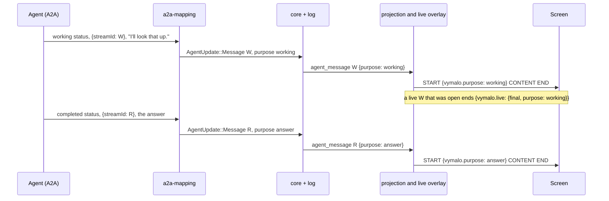
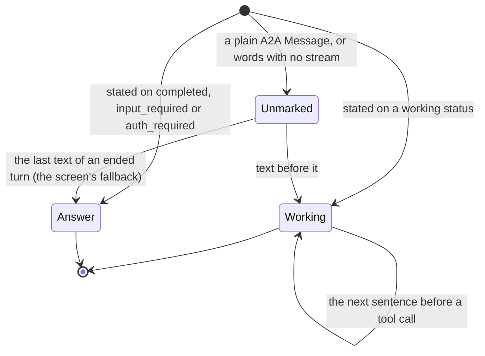

# ADR 0031 — Working text and the turn's answer

- **Status:** accepted (2026-10-02), on the owner's answer of the same day: the structural rule first, the
  `turn_output` tool after it. This ADR is the rule and the marks it writes; the tool is not decided here and not
  built. Extends [ADR 0012](0012-ag-ui-user-facing-protocol.md) (its status note of 2026-09-30, "the agent's words":
  what an agent says when it finishes or asks is its answer) and [ADR 0027](0027-live-text-relayed-not-stored.md)
  (a live draft can turn out not to be the answer and be folded away).

## Context

"While the tool calls were going to the right rail, the working comments were staying in the middle of the page. It'd
be best if we could have 'working tokens' like 'thinking tokens' and a 'final turn tokens' answer, so that all the
others appear like thinking, but all hidden, not collapsed. That way the user can focus on the main outputs." (owner,
2026-10-02, on the coder thread whose main column held every sentence the agent wrote before a tool call.)

What the exported chats show, and what the code does:

- adam-rs states the words before a tool call on a `working` status and the words that end the turn on the status
  that ends it (`completed`, `input_required`), each with the `text-stream/v1` marker
  ([adam-rs ADR 0007, decision 13](https://github.com/vymalo/another-adam-rs/blob/main/docs/decisions/0007-progress-as-steps-and-streamed-text.md);
  *verified 2026-10-02* by reading it in the sibling checkout). The orchestrator's adapter maps **both** to the same
  final `agent_message` ([`text-stream-v1.md`](../api/text-stream-v1.md) section 4), so the log cannot tell them apart:
  the coder's exported thread holds eight final messages, an answer and seven sentences written before a tool call, and
  they look exactly alike.
- A2A **already carries the announcement**. The status that ends a turn is the agent saying "this is my answer". The
  adapter reads it and then throws the difference away.
- The projection says an answer once (the status words are not said again when they equal the last final message),
  and a live message opens its `TEXT_MESSAGE_START` before anyone knows what the words are for (ADR 0027).
- AG-UI 1.0 has `REASONING_*` events. A live text message cannot become a reasoning message after it has started, so
  a client that does not know the convention would show a working sentence twice.

## Decision

1. **The adapter marks the text by the status it came on.** An `agent_message` made from a stated stream gets
   `purpose`:
   - `working` when the status is `working`;
   - `answer` when the status ends the turn: `completed`, `input_required`, `auth_required`;
   - nothing for the words of any other status (a `failed` status's words are its error) and for a plain A2A
     `Message` from an agent that does not state streams: those say nothing about their purpose, and the field is
     absent. No agent changes: the status an agent already chose is the mark.
2. **The event carries it.** `AgentMessageData` gains two optional members, both omitted when absent (so an older log
   reads as it always did, and an orchestrator that does not know them ignores them):
   - `purpose`: `"working"` or `"answer"` (`MessagePurpose`);
   - `via`: `"turn_output"` (`AnswerVia`), how an answer was announced when it was not by the status that ends the
     turn. **Reserved**: nothing writes it in this ADR. It exists so the tool of the next point does not change the
     event again.
   `AgentUpdate::Message` gains `purpose`; the core copies it to the event. Nothing else in the core changes, and no
   migration is needed (the members live in the event's JSON).
3. **AG-UI says it in metadata, on the message's `START`:** `metadata["vymalo.purpose"]` is `"working"` or `"answer"`,
   and `metadata["vymalo.via"]` is `"turn_output"` beside an answer that was announced that way. No member when the
   event has none. **Working text is not mapped to `REASONING_*`.** A generic AG-UI client therefore shows the same
   transcript it showed before (graceful degradation); a screen that knows the key decides what to hide.
4. **The live overlay says it at the end.** A live message opens before anyone knows what its words are for. When the
   log's final message for it arrives marked `working`, the `END` that closes the live message says it:
   `TEXT_MESSAGE_END{metadata:{"vymalo.live":{final:true, purpose:"working"}}}`. A screen takes the draft out of the
   conversation at that moment (drafts already live outside its runtime, ADR 0027) and files the text with the
   steps. An answer's `END` says nothing more than `final: true`: the draft is the answer, and stays.
5. **What an unmarked text is is the screen's rule, not the log's.** A reader that finds no `purpose` (a plain A2A
   agent, the words said as status words `st-<seq>`, every log written before this ADR) treats the **last text of an
   ended turn as its answer** and the text before it as working, and in a running turn shows an unmarked text as a draft
   until a step starts after it. The log is not rewritten and the event is not guessed at: the fallback is applied
   where the text is drawn (the web, S6 of plan 10).
6. **The status words are unchanged.** The words of a `completed`, `input_required` or `auth_required` status that were
   not already said as a message are still said once as `st-<seq>` (ADR 0012), and carry no `purpose`: no event says
   what they are for, and the fallback of point 5 reads them as the answer they are. The `turn_output` tool, which will
   say "the status words are not said when the turn has an announced answer", is the next decision and is not taken
   here.

## Consequences

- The web can keep one message per turn in the conversation and put the rest where the steps are (S6), and an old
  thread gets the same view through the fallback. A client that ignores `vymalo.purpose` reads exactly what it read
  before.
- The export is unchanged in format (`version` 1, additive): events keep `purpose` and `via`.
- An agent's choice of status is now visible to the person. An agent that states its whole reply on a `working` status
  and then finishes with a one-word `completed` would have its reply folded away; the contract page
  ([`text-stream-v1.md`](../api/text-stream-v1.md)) says which status to state each stream on, and adam-rs already does.
- The log still says an answer twice (the `agent_message`, and the `completed` status's `detail`, which the
  interrupt and the verifier read). Not changed here.
- `via` is a member nothing writes. Reserving it costs a line in the contract and spares a second change to the event.
- Required elsewhere: the A2A adapter, the core types, the projection and the overlay, `chat-api.yaml`,
  [`agui.md`](../api/agui.md#the-agents-words), [`text-stream-v1.md`](../api/text-stream-v1.md), the goldens (a
  `working` scenario) and the web mock. Not built: the web's rendering, and the `turn_output` tool.

## Alternatives rejected

- **`REASONING_*` for working text.** AG-UI has the vocabulary, but a live text message cannot turn into a reasoning
  message after the fact: a generic client would show the working sentence as text while it streams and again as
  reasoning, or not at all. Metadata degrades to today's transcript.
- **A new event kind for working text.** It would double the places that read messages (the title, the fork's
  transcript, the verifier's summary, the export) for a distinction one optional member carries.
- **Guessing in the web only** (the last text of a turn is the answer). It is the fallback, and it is wrong exactly
  when an agent answers and then goes on (it commits, it draws a surface, it says "there it is"). The mark says what
  the agent said; the guess is for agents that say nothing.
- **A tool first** (`turn_output`). The owner's reading was that the structure already announces the answer; the tool
  serves two cases the structure misses and comes after it.
- **A new A2A extension.** The status an agent already sends carries the mark, so an extension would only repeat it,
  and one cannot offer a tool to a model anyway.
