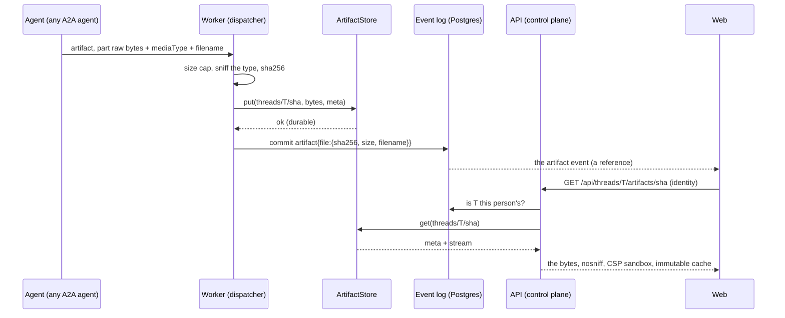
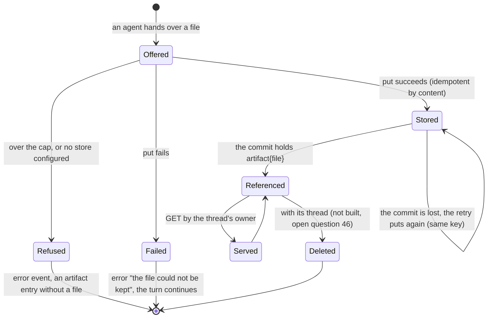

# ADR 0032 — Files from agents live in an artifact store; the log keeps references

- **Status:** accepted (2026-10-02), on the owner's question of the same day, "Do we need an object storage
  concept?", answered by plan 10 (section 3.3); the details are the planner's and the owner may revisit them.
  **Amends the wording of invariant 3 and of [ADR 0001](0001-rust-state-machine-on-postgres.md)** (see decision 1) and
  extends [ADR 0013](0013-a2ui-generative-ui.md) (the catalog's `Image`, decision 11). **Built (2026-10-02, PR S10):**
  the port `ArtifactStore`, its conformance testkit, the directory store and the S3 store, the `artifacts` keys of the
  configuration file ([`docs/api/config.md`](../api/config.md)) and the binary's wiring. **Built (2026-10-02, PR S11):**
  the ingest, the serving route, the SVG sanitizer, the projection and the contract: see the status note below.
  **Built (2026-10-02, PR S12):** the web: the file card with its preview and download, the Sources panel's files, and the
  catalog's `Image` (UI catalog v4): see the second status note below.
  **Not built:** `share_file` in adam-rs (adam A4, its ADR 0012, merged on the adam side), the compose stack and its
  scenario (S13).

## Context

The owner, on the coder's chats of 2026-10-02: the coder could not hand a person a file, "no images" (finding E5 of plan
10). What the code does with a file today:

- The event `artifact{name, mimeType?, uri?, text?}` (`orch_core::ArtifactData`) holds text or a link. The A2A mapper
  keeps a `Url` part as `uri` and **drops `Raw` bytes** (`orch-a2a-mapping`).
- adam-rs's `Artifact` is JSON only. The typed artifact `file` of [`docs/api/agui.md`](../api/agui.md) has no preview.
- No store exists. Open question 38 says a Content-Security-Policy decision is needed before an image component.

A2A already has the hand-over. *Verified 2026-10-02*, <https://a2a-protocol.org/latest/specification/> (version shown
1.0.0): a `Part` has `text`, `raw` (base64 binary), `url`, `data`, `mediaType`, `filename` and `metadata`; an `Artifact`
has `artifactId`, `name`, `description`, `parts`, `metadata` and `extensions`; "Results SHOULD BE returned using
Artifacts". *Verified 2026-10-02 by reading the `a2a-lf` 0.3.1 crate* (`types.rs`): `PartContent::{Text, Raw(Vec<u8>),
Url, Data}` with `filename` and `media_type`. *Unverified:* a size limit in the specification (the excerpt states none).

What the invariants allow: invariant 3 says only the job ledger and the event log persist, in Postgres. A file is
neither a ledger entry nor an event, and putting bytes in Postgres would make every backup, replication stream and
`SELECT *` carry them.

## Decision

1. **Files are kept outside Postgres, in an artifact store, and the log keeps a reference.** The wording of invariant 3
   becomes: *only the job ledger and the event log persist in Postgres; the files agents hand over are durable outside
   it, in an artifact store behind a port, like git is (ADR 0003), and the log stays the only state the orchestrator
   reasons on.* Nothing in the core or the application reads a file's bytes to decide anything: a decision reads the
   event (`sha256`, `size`, `mediaType`, `filename`), and the bytes are for a person. Processes stay stateless. ADR 0001
   and CLAUDE.md say so with a dated note.
2. **The key is the content's hash, per thread:** `threads/<thread uuid>/<sha256 in lowercase hex>`
   (`orch_ports::ArtifactKey`, built from its two parts or parsed from that one canonical text, so no string an agent
   wrote ever becomes a path or an object name). Consequences: a put is **idempotent by content** (a worker that died
   after the store accepted a file and before the log did simply puts again); the same file in two threads is two
   objects, so a thread's files are one prefix to read, authorize and, later, delete, and no thread can reach another's
   by hash.
3. **The port `ArtifactStore`** ([ADR 0009](0009-swappable-implementations-at-build-time.md); `orchestrator/crates/ports/src/artifacts.rs`):
   `put(&key, bytes, &meta)`, `get(&key) -> Option<(ArtifactMeta, ByteStream)>`, `delete(&key)`, with
   `ArtifactMeta { media_type, size, sha256, filename }` and a `ByteStream` of `Bytes`. A file is **written whole**
   (it is at most `artifacts.maxFileBytes`, already in memory when the worker checked it) and **read as a stream**
   (serving never holds it whole). Every store runs `ArtifactMeta::check` first: the bytes hash to the key, the meta
   describes them, the media type and file name are plain text. `ArtifactError` is classified like the other ports'
   errors and never holds a credential. `NoArtifacts` is the store of a deployment that has none, and refuses every
   call with "no artifact store configured"; `Ports` gains `type Artifacts`, with `PortSet`'s default `NoArtifacts`.
   A testkit (`artifact_store_conformance!`) states what every implementation must do. No implementation type is in
   a signature.
4. **Two implementations, chosen at build time and by configuration** (invariant 6; ADR 0034):
   - `orch-artifacts-fs`: a directory. The bytes and a JSON meta beside them, each written to a temporary file in the
     same directory, fsynced and renamed (the bytes last), mode `0600`, a path made of a UUID and hex digits alone. The
     **development and single-node** store; every role must see the same directory.
   - `orch-artifacts-s3`: an S3 bucket (AWS or any compatible server) through the S3 backend of the `object_store`
     crate (0.14.2, only its `aws` feature: *verified 2026-10-02*, crates.io and its manifest). One object per file,
     the media type as its `Content-Type`, the hash and the percent-encoded file name as user metadata, static
     credentials, bounded timeouts and retries. The **production** store.
   - The binary has the Cargo features `artifacts-fs` and `artifacts-s3`, both on by default (the image can then be
     configured for either); `artifacts.store` names one, a store not compiled in is exit 78 naming the feature, and
     with no `artifacts:` section the store is `NoArtifacts`. A directory is made and checked at startup; a bucket is
     not contacted (a control plane does not wait for it). The keys are `artifacts.store`, `artifacts.fs.root`,
     `artifacts.s3.{bucket, region, endpoint, prefix, accessKeyId, secretAccessKey, timeoutSecs}` and
     `artifacts.maxFileBytes`; the two credentials are secrets, by reference only.
5. **The hand-over is protocol: an A2A artifact whose part is a file.** `raw` bytes with `mediaType` and `filename` are
   the default for every agent (no extension). A `url` part is fetched by the orchestrator only from a host on an
   allow-list (`artifacts.fetchHosts`, empty by default; SSRF rules as for agent cards), otherwise it stays a link.
   A presigned upload minted by a thread tool comes later, for files over the inline cap. A tool that carries base64
   **through the model is rejected**: it costs tokens and corrupts bytes. adam-rs gives its `Artifact` a file form and
   the coder a `share_file` tool (adam ADR 0012); an agent that is not adam needs nothing.
6. **Ingest happens on the worker, before the commit.** The dispatcher (the I/O side) receives
   `AgentUpdate::File { name, media_type, filename, bytes }`, checks the cap, sniffs the type (for an image the declared
   type must agree with the magic bytes, else `application/octet-stream`), hashes, and **puts into the store, then
   commits**. The core logs `artifact{name, mimeType, file:{id, sha256, size, filename}}`; the bytes never reach
   Postgres. A reference therefore never points at nothing; the other failure (a file stored, its commit lost) leaves
   an object with no reference, which is harmless and is found again by the idempotent retry. A failed put is a logged
   `error{retryable:false}` "the file could not be kept", and the turn continues.
7. **Limits.** `artifacts.maxFileBytes` 10 MiB (inline `raw`), `artifacts.maxPerJobBytes` 100 MiB and at most 50 files
   per job (the last two arrive with S11 and are reserved keys until then). Over a cap: an `error` event "the file is too
   large to keep" and an artifact entry without `file`. The store enforces no limit; the worker does, before it calls.
8. **Serving.** `GET /api/threads/{threadId}/artifacts/{sha256}`, behind the API's identity layer (the thread's owner,
   or the `artifact.read` permission of ADR 0033 once it exists). `?download=1` gives `Content-Disposition: attachment;
   filename="…"` (the name sanitized). Inline only for allowed preview types (png, jpeg, gif, webp, svg, text/plain,
   application/json). Always `X-Content-Type-Options: nosniff`, `Content-Security-Policy: default-src 'none'; img-src
   'self' data:; style-src 'unsafe-inline'; sandbox`, and `Cache-Control: private, max-age=31536000, immutable` (the URL
   is the content's hash). This answers the serving half of open question 38 for files; a Content-Security-Policy for
   the web itself stays that question's.
9. **SVG is sanitized for inline serving** by an allow-list (a pure crate, `orch-svg-clean`, on `quick-xml`): no
   `script`, `foreignObject` or `iframe`, no `use` with an external reference, no `on*` attribute, no `href` or
   `xlink:href` that does not start with `#`, no `style` with `url(` or `@import`. The web draws a file only as
   ``; an SVG in an `` runs no script and loads no subresource (*unverified here*: the HTML and SVG
   integration rules were not re-read). A download is the original bytes, as an attachment.
10. **Projection.** The artifact entry carries `vymalo.artifact` with `kind: "file"`, `href`, `size` and `preview`
    (`"image"`, `"text"` or none); the Sources panel lists every file.
11. **The catalog's `Image` is for thread artifacts only** (UI catalog v4): `Image {id, component: "Image", artifact:
    "<sha256 of a file of this thread>", alt (required, at most 300), caption?}`, never a URL. This **closes the image
    half of open question 38** for the catalog (no remote fetch) and amends the rule of ADR 0013 that an `Image` is a
    placeholder that is never fetched: it is now drawn, from a file this thread holds. A validator refuses a foreign
    artifact id. Remote images in markdown text stay refused.
12. **Retention.** Files are kept with their thread. There is no thread deletion yet, so there is no file deletion; the
    port has `delete` for it. Retention (a time limit, a quota, deleting with the thread, a lifecycle rule on the
    bucket) is open question 46.

## Consequences

- A person can be handed a file: a chart, an export, a report. The web can draw an image the agent made, and the
  catalog's `Image` can place it beside the text.
- Deployments gain an infrastructure choice: a directory (one node) or a bucket, and the credentials of the bucket,
  which are two more secrets (ten in the contract). Without either, files are refused and the chat works as before.
- The S3 store adds six crates to the lock file (`object_store` and five small ones) on the workspace's `reqwest` and
  `aws-lc-rs`: one TLS stack still. A build that does not want it drops the feature.
- A file in a thread is kept for as long as the thread is, with no limit but the per-file and per-job caps, until
  open question 46 is decided.
- The log's size is unchanged by file size. A backup of the database does not contain files: a deployment backs up its
  store as it backs up its repositories' remotes.
- Dedupe is per thread only. A person who gets the same chart in two threads stores it twice; deleting a thread is one
  prefix.
- The S3 store reads no `AWS_*` variable and no instance profile: a deployment on a platform that only offers those
  (IRSA, instance roles) needs a change to the adapter. Not planned: the contract asks for both keys by reference.
- Facts to check later: the store against AWS S3 itself (the author's runs, 2026-10-02, were an in-process stub and moto
  5.2.3's S3 server; both passed, and a real MinIO or AWS run is the CI's to add), and the browser rule in decision 9.

## Alternatives rejected

- **Bytes in Postgres** (`bytea` or large objects). One store to run, but every replication stream, backup and `SELECT *`
  carries the files, and invariant 3's reason (a small, reasoned-on log) is lost. The port makes the choice
  reversible if a deployment insists: an implementation over a table is a crate.
- **Bytes through the event log's JSON** (base64 in the event). The same cost, plus 33 per cent and no streaming.
- **A global content-addressed store** (the key is the hash alone). Dedupe across threads, but a hash is then a
  capability anyone who learns it can use, deletion needs reference counting, and authorization has no prefix. The cost
  of storing a duplicate is small next to either.
- **An MCP tool that takes base64 from the model.** The model has to emit the bytes: tokens, corruption, a size
  ceiling of the context.
- **Always a presigned upload.** Right for large files, wrong for the first slice: every agent would need a thread tool
  and an HTTP client. It is added for files over the inline cap, beside `raw`.
- **A file size limit in the port.** A store would enforce what the worker has already decided, and a limit is policy
  (a configuration key), not a property of storage.
- **Object store as a runtime plugin.** Excluded by ADR 0009: build-time features and configuration.

## Status note (2026-10-02, PR S11): what was built, and where it differs

Decisions 5 to 10 are built as written. The details the text left open, and the places the code differs from it:

- **The reference is `file {sha256, size, filename?}`.** Decision 6 wrote `{id, sha256, size, filename}`; the id would
  have been the hash again, and two names for one value invite a disagreement, so the log holds `sha256` only
  (`orch_core::FileRef`). `ArtifactData.file` is additive: an artifact logged before it reads as it did.
- **Three updates for the core, not one** (`orch_core::AgentUpdate`): `File {name, media_type, filename, bytes}` is what an
  adapter reports; the dispatcher replaces it with `FileKept {name, mime_type, file}` or `FileRefused {name, mime_type,
  reason}` (`FileRefusal`: too large, job limit, not kept) before the core sees anything. A core that is handed a `File`
  anyway logs it as not kept: the bytes cannot reach the log by any path. A refusal is one input, so the artifact entry
  without a file and the `error` are one commit.
- **The `url` fetch is the A2A adapter's, not the dispatcher's** (`orch-agent-a2a`, `A2aConfig.fetch_files`): it is the I/O
  side that already holds an HTTP client, and it keeps the mapper pure. There was **no SSRF helper to reuse**: agent card
  URLs come from the operator's own configuration and are not checked. The rules of the fetch are the allow-list
  (`artifacts.fetchHosts`: a host, which without a port means the scheme's default port), `http` or `https` with no
  credentials in the URL, **no redirect followed**, nothing of the agent or the thread sent, the body read in pieces and
  stopped at `maxFileBytes`, a 30 second limit. A host on the list is trusted; the list is the control. A fetch that fails
  is "the file could not be kept" (or "too large"), not a silent loss. An artifact with text as well as a link stays a link.
- **The job's limits are counted per delegation** (the worker's processing of one outbox row), not durably: a worker that
  dies and is replaced counts again from nothing, and its replays put the same keys, which is idempotent, so the bound can be
  exceeded at most once per crash. Each content counts once (the same bytes again are one object). The 50 files are not a
  configuration key. The limits live in `AppConfig.files` (`FileLimits`), beside the other tunables the application reads.
- **The sniff** (`sniff`, `orch-app`): for `image/*` the declared type must agree with the magic bytes of png, jpeg, gif, webp,
  bmp, ico, tiff, avif or svg (an SVG by its content: an `<svg` element after a declaration, comments and a DOCTYPE), else
  `application/octet-stream`; a declared type that is not an image is kept as declared (it is an attachment unless it is a
  preview type, and always `nosniff`); a missing or generic one takes the bytes' type, a PDF, or a few plain extensions.
  The file name is reduced to one name (after the last separator, no control or direction character, 255 bytes).
- **Serving** (`orch-api`): `App::open_artifact` is the single access check (the thread's owner; **the seam for S15**), and a
  miss of any kind is the same 404, including a deployment with no store. An inline SVG is read whole, up to 2 MiB, and cleaned;
  a larger one, or one that cannot be cleaned, is sent as an attachment instead, never inline as it is. A store that fails midway
  ends the response in an error. `ETag: "<sha256>"` is added to the headers of decision 8.
- **Projection**: `vymalo.artifact{kind:"file", href, sha256, size, filename?, preview}`, with `preview` `"image"`, `"text"` or
  `null` from `orch_core::Preview::of` (the one list the API and the projection share). `kind: "file"` was already the generic
  kind of an artifact that is nothing else, so a client tells a kept file by `href`. The golden is `file.events.json` and
  `agui/file.agui.json`.
- **`orch-svg-clean`** is an allow-list of elements and attributes (it rewrites, it does not scan): see its README for the
  lists and the corpus of 48 hostile payloads. Not done: a check in a real browser that an SVG in an `` runs nothing
  (decision 9's *unverified* stands).
- **Not built here:** the `dev/artifact-e2e.sh` scenario (S13, with the adam pin); the dev stack keeps files in the named
  volume `orchestrator-artifacts`, which every role mounts.

## Status note (2026-10-02, PR S12): the web, and where it differs

Decisions 8 to 11 are drawn by the web as written. What the text left open, and the places the code differs from it:

- **A kept file is told by `href`** (the projection's `kind: "file"` is also every other artifact that is nothing else). The
  web reads `href`, `sha256`, `size`, `filename?` and `preview` only when the `href` is exactly `/api/threads/<id>/artifacts/<sha256>`
  and says the same hash as `sha256`, and the size is a count of bytes; otherwise the artifact is **not** a kept file and none of
  the reference is read. The agent's `uri` is never fetched. A file that was not kept keeps the old card (its words), and the
  `error` that follows it (the three reasons of S11) is the existing error line.
- **The card** shows the file name (else the artifact's name), the size (`1.5 KB`, powers of 1024) and the sniffed type, a
  **Download** link to `href` + `?download=1` (with the `download` attribute, so a click never navigates), and a preview by
  `preview`: an image is an `` with the file name as its alt (a generic "File from the agent" without one) and a
  line that says so when the browser cannot decode it, never inline markup; a text file is **fetched** from `href`, the first
  **64 KiB** only (the stream is cancelled after that), decoded as UTF-8 and drawn in a `<pre>` as text, with a line saying how
  much was cut; `null` is the card alone. A file reported twice in a turn (the same hash) is one card.
- **The Sources panel lists every kept file** of the thread, once per hash, under "Files": its name as a link that opens it
  (inline for a preview type, an attachment otherwise), its size and type, a download button and the turns that cited it.
- **`Image`'s validator is the web's `prepareSurface`.** It is given the thread's kept files (from the transcript) and refuses
  the **whole surface** (rule `artifact`) when an `Image`'s `artifact` is not the hash of one of them, or is the hash of a file
  whose `preview` is not `"image"`; with no files it refuses every `Image`. The schema (catalog v4, digest in
  `catalog.lock.json`) has no member that can carry a URL and requires `alt`. The component checks again when it draws (a file
  that is missing draws a line, never a broken image) and fetches nothing but the file's own `href`. A surface that names a file
  the thread does not hold *yet* is refused until it does: the file's own `artifact` event comes first in the log, so a replay
  has it. A thread whose catalog is v4 and a build that has only v3 say "needs a newer version of the app", as for any component.
- **The catalog's `Choices` description starts "ask_user only"** (plan 10, E12): an agent that shows a form with `show` is told
  nothing waits for its answer. It is a change of text, so it is part of version 4's digest.
- **Not done here:** the web's mock keeps one store for every thread, so it cannot play the 404 of another thread's hash in the
  UI (the unit tests and the API's own tests do); the real thing is S13's scenario. A check in a real browser that an SVG in an
  `` runs nothing (decision 9's *unverified*) is still open: the web's e2e draws a PNG.
