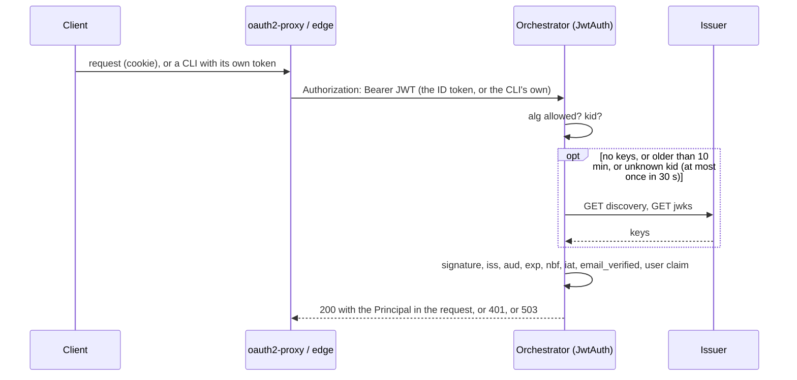
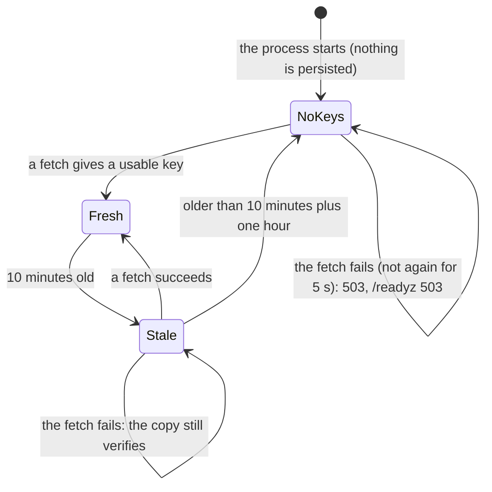

# ADR 0033 — The orchestrator is an OAuth2 resource server; roles map to permissions

- **Status:** accepted (2026-10-02), on the owner's request of 2026-10-02; the details are the planner's (plan 10,
  section 3.4) and the owner may revisit them. Owner decision 4 of the same day binds it: **admins read every thread
  and act only on their own; the user key stays the e-mail claim (`sub` later).** Amends the bullet "Authentication stays
  at the edge" of [ADR 0012](0012-ag-ui-user-facing-protocol.md) and "The edge owns identity" of
  [`architecture.md`](../architecture.md); closes [open question 20](../open-questions.md) (programmatic clients);
  replaces slice 14 of [`mvp.md`](../mvp.md) (OIDC for MCP). The port `InboundAuth` that
  [ADR 0009](0009-swappable-implementations-at-build-time.md) names is built as `Authenticator`.
  **Built (2026-10-02, PR S14):** the port and its testkit, the JWT and the header authenticators, `auth.mode` and
  `auth.jwt`, the 401/503 responses and `/readyz`. **Planned:** PR S15 (roles, permissions, enforcement, `GET /api/me`),
  S16 (the dev stack: a mock issuer and a real oauth2-proxy), S17 (the web reads `/api/me`). Sections 4 to 8 below
  describe what S15 to S17 build; sections 1 to 3 are what S14 built.

## Context

The owner, 2026-10-02: "We need RBAC. We'll keep an OAuth2 proxy on top of the web and ensure the backend is an
OAuth2 resource server."

**What exists** (*verified 2026-10-02* in the code at `dbc136a`):

- Identity is the header `X-Auth-Request-Email`, read by `orch-api` (`auth.rs`), with `AUTH_DEV_USER` as the fallback.
  The edge owns identity; the orchestrator "must only run behind a proxy that strips client-supplied copies".
- Ownership is `threads.owner`, the e-mail (`0001_init.sql`). There are no roles: everyone who is in is the same.
- MCP uses static bearer tokens (`MCP_TOKENS_FILE`, [ADR 0019](0019-mcp-server-over-streamable-http.md)); the
  thread-tools endpoint uses HMAC tokens ([ADR 0023](0023-ui-component-catalog-as-an-a2a-extension.md)). Both are
  machine routes, outside the identity layer.
- A programmatic client (a CLI, CI) has no oauth2-proxy cookie (question 20), and OIDC for MCP was slice 14.

**What is wrong with a header.** It is a bearer credential nobody signed: any process that can reach the orchestrator
without passing the proxy is whoever it says it is. A header carries one fact (the e-mail), so roles cannot ride on it,
and a client that is not a browser has no way to present it honestly.

**oauth2-proxy facts** (*verified 2026-10-02*, <https://oauth2-proxy.github.io/oauth2-proxy/configuration/overview>,
version 7.15.x):

- `--pass-authorization-header`: "pass OIDC IDToken to upstream via Authorization Bearer header".
- `--set-authorization-header`: "set Authorization Bearer response header (useful in Nginx auth_request mode)".
- `--pass-access-token`: "pass OAuth access_token to upstream via X-Forwarded-Access-Token header".
- `--skip-jwt-bearer-tokens`: "will skip requests that have verified JWT bearer tokens (the token must have `aud` that
  matches this client id or one of the extras from `extra-jwt-issuers`)".
- `--extra-jwt-issuers`: "a list of extra JWT `issuer=audience` pairs"; `--oidc-groups-claim`: "which OIDC claim
  contains the user groups".
- Caddy's `forward_auth` has `copy_headers`: "a list of HTTP header fields to copy from the response to the original
  request, when the request has a success status code" (*verified 2026-10-02*,
  <https://caddyserver.com/docs/caddyfile/directives/forward_auth>; that page has no oauth2-proxy example, so the
  wiring of S16 is a design to be run, not a documented recipe).

## Decision

### 1. The port

`Authenticator` is a port of `orch-ports` ([ADR 0009](0009-swappable-implementations-at-build-time.md)), carried by
`Ports::Auth` and `PortSet.auth`:

```rust
pub struct Credentials<'a> { pub bearer: Option<&'a str>, pub identity_header: Option<&'a str> }
pub struct Principal { pub user: UserId, pub email: Option<String>, pub name: Option<String>, pub roles: BTreeSet<Role> }
pub trait Authenticator: Send + Sync + 'static {
    fn authenticate(&self, c: &Credentials<'_>) -> impl Future<Output = Result<Principal, AuthError>> + Send;
    fn ready(&self) -> impl Future<Output = Result<(), AuthError>> + Send;   // default: Ok
    fn accepts_bearer(&self) -> bool;                                          // default: false
}
pub enum AuthError { Missing, Invalid { credential, detail }, Unavailable { detail, source }, NotConfigured }
```

- **Fail closed, and say which way.** `Missing` and `Invalid` are refusals (401). `Unavailable` is not one: what the
  credential is checked against (the issuer's keys) cannot be read, so nobody is let in, but the caller may retry
  (class `Transient`, 503 with `Retry-After`). This differs from the plan's "401 for all requests" while the keys have
  never been fetched: a 401 would tell a client its token is bad, and make a CLI log in again for nothing.
- **No error carries a credential**, and `Debug` of `Credentials` hides both. A refusal names what is wrong ("the token
  has expired", "the token is not for this API (issuer or audience)"), never a value.
- **The API reads the HTTP, the authenticator the credential.** The edge turns `Authorization: Bearer` and
  `X-Auth-Request-Email` into `Credentials` (another scheme, `Basic`, is not a bearer; a header that cannot be read as
  text is present and empty, so it is refused and never mistaken for absent) and stores the `Principal` and its
  `UserId` in the request extensions. A 401 carries `WWW-Authenticate: Bearer realm="orchestrator"` when the
  authenticator reads bearer tokens, with `error="invalid_token"` when a token was presented and refused (RFC 6750).
- **`/readyz` follows `ready()`**: 503 while the keys have never been fetched (or are too old to trust). `/healthz`
  does not: the process is alive.
- Implementations: `orch-auth-header` (today's behaviour, moved out of `orch-api`), `orch-auth-jwt` (section 2),
  `RefuseAll` (a process that serves no routes, and the default of `PortSet`: a bundle that forgot to choose lets nobody
  in) and `ByCredential` (a request with a bearer is the bearer authenticator's **alone**, and a refused token is never
  reconsidered as the header; a request without one is the header's).
- The **testkit** has two suites (`authenticator_conformance!`, any implementation; `bearer_token_conformance!`, the
  policy of signed tokens below) and the in-memory `MemoryAuth`.

### 2. The JWT authenticator (`orch-auth-jwt`, `auth.mode: jwt`)





- **Algorithms: RS256, RS384, ES256, EdDSA, and nothing else.** `none` and the HMAC family are refused whatever key
  they name (the algorithm confusion attack), and a key only verifies tokens of its own family; an RSA key under 2048
  bits, a symmetric key, a key for encryption or another curve is skipped.
- **Claims:** `iss` equals `auth.jwt.issuer` exactly; one of `auth.jwt.audiences` is among `aud`; `exp`, `iat`, `iss`
  and `aud` are required; `nbf` is honoured; 60 s of leeway; `email_verified` must not be `false` (boolean or text).
  A token over 16 KiB is refused unread.
- **The keys** are fetched from `auth.jwt.jwksUrl`, or from the `jwks_uri` of `{issuer}/.well-known/openid-configuration`
  whose `issuer` must be the configured one. They are a copy this process may lose ([ADR 0001](0001-rust-state-machine-on-postgres.md)):
  fetched on first use and by `ready()`, refreshed after 10 minutes, **fetched again for an unknown `kid` at most once
  in 30 s**, not retried for 5 s after a failure, one request for any number of concurrent callers. A copy that cannot be
  refreshed goes on verifying for one more hour (an issuer's blip is not an outage of the chat); after that, `Unavailable`.
- **The fetch is bounded:** a timeout, no redirect followed, a body of at most 1 MiB, a `jwks_uri` that is `http(s)`
  without credentials and never plain HTTP under an HTTPS issuer. There is no filter on the *address*: the issuer is the
  operator's own configuration, an identity provider in the cluster is a private address, and the repository applies no
  address filter to the registry's or the model's URL either (both refuse redirects; *verified 2026-10-02* by search
  of the adapters).
- **Identity.** `auth.jwt.userClaim` (default `email`, so the `threads.owner` rows that exist stay theirs) names the
  claim of the user; `UserId::new` trims and lower-cases it. `sub` can be the key later, through a migration (an
  `owner_sub` column): that lower-casing is wrong for an opaque id, so it is a decision for then, not a default now.
  `auth.jwt.rolesClaim` is a dotted path (`realm_access.roles`, `groups`; a claim whose own name has dots is found by
  that name first); a list gives its texts, a text is one role, anything else is none, and a bad roles claim never
  refuses a token.
- **Library.** `jsonwebtoken` 11.1.0 over `aws-lc-rs` (*verified 2026-10-02*, `cargo info`; MIT; marked
  passively-maintained by its author), the crypto backend `rustls` already brings. The decisions above are ours
  (the allowed list, the key choice, the leeway), not the library's defaults.

### 3. Configuration and migration

`auth.mode` is `proxy_header` (the default: nothing changes), `jwt`, or `jwt_or_proxy_header`; `auth.jwt` holds
`issuer`, `audiences`, `jwksUrl`, `userClaim`, `rolesClaim` ([`docs/api/config.md`](../api/config.md)).

1. S14 ships the port with `proxy_header` the default.
2. The dev stack switches to `jwt` (S16); production configuration moves to `jwt`, and `jwt_or_proxy_header` is there for
   one release.
3. `proxy_header` remains for one user on a local machine, and is **refused when `server.environment` is `production`**
   (a key that S9 reserved and S14 builds). `auth.devUser` exists only with `proxy_header`.
4. A mode whose implementation is not compiled in (Cargo features `auth-jwt`, `auth-header`, both on by default) is
   exit 78 naming the feature (as a surface is). A process that serves no routes needs none.

### 4. Roles and permissions (planned, S15)

`auth.roles` maps a role name to permissions and agents, `auth.defaultRole` is what a valid token with no known role
gets (`null`: 403). The vocabulary follows the platform's (`another-agentic-platform` `docs/architecture/08-security.md`
§52): `agent.read`, `agent.invoke`, `thread.read`, `thread.write`, `artifact.read`, each with a scope (`own` or `any`),
and `admin`.

```yaml
auth:
  defaultRole: user
  roles:
    user:  { permissions: [agent.read, agent.invoke, thread.read, thread.write, artifact.read], scope: own, agents: ["*"] }
    admin: { permissions: [agent.read, agent.invoke, thread.read, thread.write, artifact.read, admin], scope: { read: any, write: own }, agents: ["*"] }
```

The default `admin` is owner decision 4: **read any, write own**.

### 5. Enforcement (planned, S15)

A pure `orch_app::authz::allows(&Principal, Action, &Resource) -> bool`, unit-tested over a matrix, applied to
`list_agents` (filtered), `describe_agent` and `validate_target` (403 without `agent.invoke` for that agent); reading a
thread or connecting (the owner, or `thread.read` with scope `any`; **otherwise 404**, so a thread's existence never
leaks); messages, UI actions, cancel, rename and fork (the owner, or `thread.write` with scope `any`); the artifacts
route; `GET /api/threads?owner=` (admins only). MCP static tokens map to a principal and a role in configuration;
thread-tools stays HMAC (a machine, [ADR 0023](0023-ui-component-catalog-as-an-a2a-extension.md)).

### 6. Streams (planned, S15)

The token is validated when a stream connects. A stream is capped at the token's `exp` plus the leeway, and at one hour;
the client reconnects with `Last-Event-ID` and gets a fresh token from oauth2-proxy's session
([ADR 0012](0012-ag-ui-user-facing-protocol.md), the connect stream is resumable).

### 7. `GET /api/me` (planned, S15; the web, S17)

`{user, roles, permissions, agents}`, so the web hides what its person cannot do. It is a convenience, never a check:
the orchestrator enforces.

### 8. The edge and the dev stack (planned, S16)

oauth2-proxy stays in front of the web and the API and forwards `Authorization: Bearer <JWT>` (the ID token by default,
whose `aud` is oauth2-proxy's client id, so it works with any OIDC provider; an access token with an API audience is
configurable). A programmatic client sends its own JWT; oauth2-proxy skips it with `--skip-jwt-bearer-tokens`, and the
orchestrator validates it again: this is question 20 and slice 14. The dev stack gets `dev/mock-oidc/` (a dependency-free
Node stub with discovery, `jwks`, `authorize`, `token` and users with roles) and a real oauth2-proxy behind Caddy's
`forward_auth` (`--set-authorization-header`, `copy_headers Authorization`); the scenario scripts get a token from the stub.
`navikt/mock-oauth2-server` is the alternative if the stub grows.

## Consequences

- **A deployment that runs `jwt` trusts only what it can verify.** A client-supplied `X-Auth-Request-Email` is no
  identity in that mode (the smoke test sends one beside a bad token and gets 401).
- **A new failure mode, and a visible one.** The issuer being down makes the API 503 and `/readyz` fail while the keys
  have never been fetched; Kubernetes keeps the pod out of the service rather than serving 401s. An outage after the first
  fetch is invisible for up to an hour more.
- **The default changes nothing**, and a production process cannot keep it by accident (`server.environment`).
- **Everything that took `ApiConfig.auth` moved to the port**: tests that needed a development user build
  `HeaderAuth::new().with_dev_user(..)` into their `PortSet`.
- **No authorization yet.** S14 authenticates: every principal is allowed what everyone was. Roles are read from the
  token and carried in `Principal`, and nothing reads them until S15.
- **Unverified:** the behaviour against a real Keycloak or another issuer (the tests run against a local issuer with RSA,
  P-256 and Ed25519 keys); the `iat` is required but not compared with the clock (a token issued in the future is
  accepted until `exp`).

## Alternatives rejected

- **Validate in the proxy only.** The orchestrator would still trust a header, and a CLI would still have no way in.
- **A runtime-pluggable auth module.** Against ADR 0009: implementations are chosen at build time and by configuration.
- **`sub` as the user key now.** It orphans every `threads.owner` row; the owner kept the e-mail (decision 4).
- **Treat an unreachable issuer as 401.** It blames the caller for the operator's outage.
