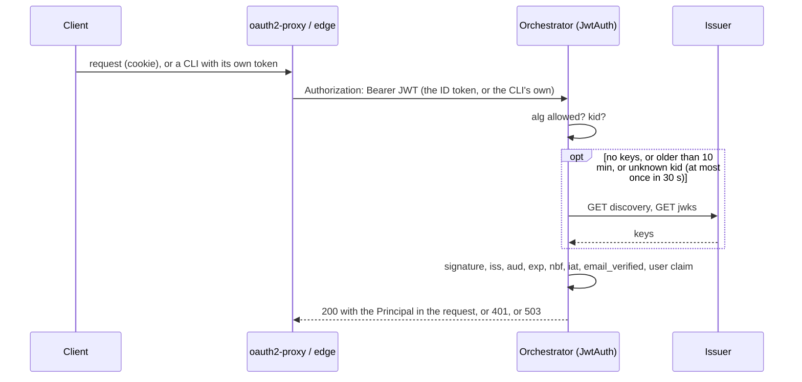
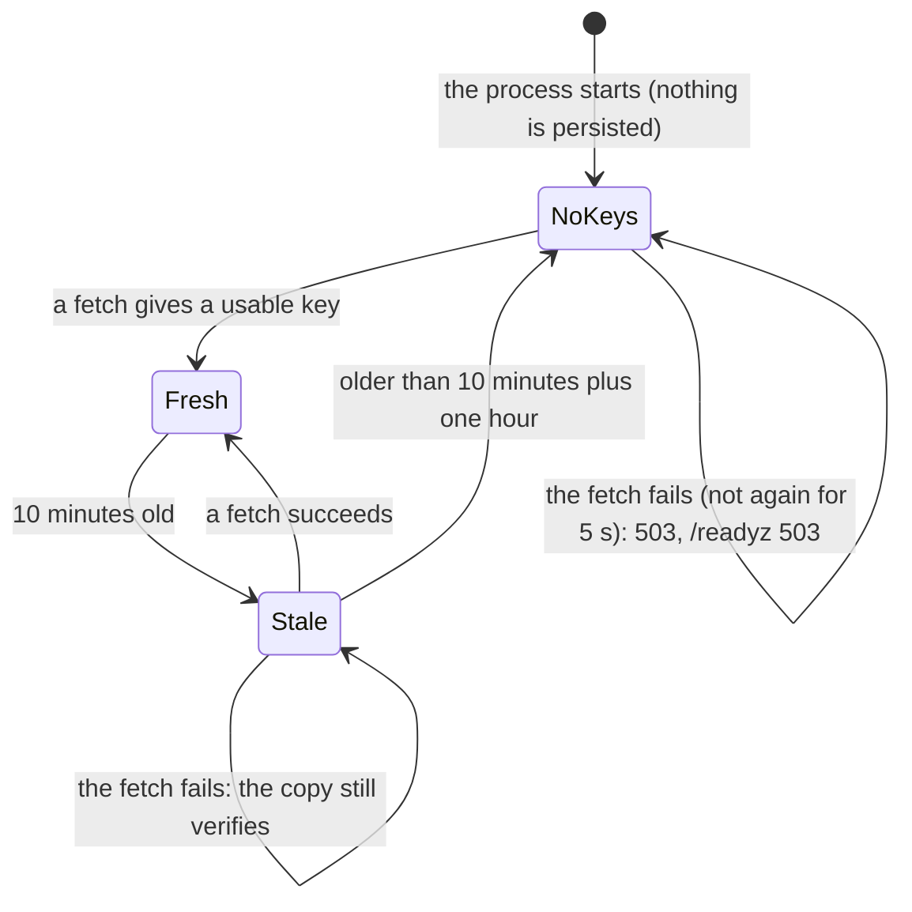

# ADR 0033 — The orchestrator is an OAuth2 resource server; roles map to permissions

- **Status:** accepted (2026-10-02), on the owner's request of 2026-10-02; the details are the planner's (plan 10,
  section 3.4) and the owner may revisit them. Owner decision 4 of the same day binds it: **admins read every thread
  and act only on their own; the user key stays the e-mail claim (`sub` later).** Amends the bullet "Authentication stays
  at the edge" of [ADR 0012](0012-ag-ui-user-facing-protocol.md) and "The edge owns identity" of
  [`architecture.md`](../architecture.md); closes [open question 20](../open-questions.md) (programmatic clients);
  replaces slice 14 of [`mvp.md`](../mvp.md) (OIDC for MCP). The port `InboundAuth` that
  [ADR 0009](0009-swappable-implementations-at-build-time.md) names is built as `Authenticator`.
  **Built (2026-10-02, PR S14):** the port and its testkit, the JWT and the header authenticators, `auth.mode` and
  `auth.jwt`, the 401/503 responses and `/readyz`. **Built (2026-10-02, PR S15):** the roles and permissions, their
  enforcement on threads, agents and files, `GET /api/me`, the administrators' listing, the roles of an MCP token and
  the bound on a stream (sections 4 to 7, with the points where the build differs from what they planned, in
  [*Status: built in S15*](#status-built-in-s15)). **Built (2026-10-02, PR S17):** the web reads `/api/me` and follows it
  ([*Status: built in S17*](#status-built-in-s17)). **Built (2026-10-02, PR S16):** the dev stack: a mock issuer,
  a real oauth2-proxy behind Caddy's `forward_auth`, the orchestrator on `auth.mode: jwt`, tokens in every scenario
  script and `dev/rbac-e2e.sh` (section 8, with what the build settled in [*Status: built in S16*](#status-built-in-s16)).
  Sections 1 to 3 are what S14 built.
  **Amended (2026-10-03): owner decision 4 ("admins read every thread") and the built-in `admin` scope of section 4 are
  superseded by [ADR 0039](0039-nobody-reads-another-persons-thread.md)**, on the owner's decision of that day ("Admins shouldn't
  read every thread, it's dangerous and not GDPR compliant"): no role reads or acts on another person's thread, a `scope` of
  `any` is refused at startup, `GET /api/threads?owner=` is removed, and `admin` is operational and content-free. Everywhere
  below that says an administrator reads another person's thread, lists everyone's threads, sees a read-only view of another's
  thread (`403 read_only`) or has Mine / All threads in the sidebar describes what was built on 2026-10-02 and is no longer
  so; the rest of this ADR stands.
  **Amended (2026-10-04): the web's answer to a 401 (S17 item 5, S16 item 10) is no longer a redirect first.** On the owner's
  request ("Token refresh should work without a full page refresh") a 401 is now refreshed at the edge and the call sent again,
  the session is kept warm while the app is open, and only when the edge has none is the person asked, in a popup, with the
  page kept; the full-page redirect remains for a refused popup. What a 401 is at the edge, why it happened, and what was
  verified: [`web/README.md`, "Signing in again"](../../web/README.md#signing-in-again). The orchestrator, the tokens and the
  roles are unchanged.
  **Trade-offs of that amendment (2026-10-04; the owner may change them).** (1) *Idle bound:* each keep-warm question after
  oauth2-proxy's `--cookie-refresh` is a refresh grant, which resets Keycloak's SSO Session Idle, so a tab nobody uses would keep a
  session alive for ever. The page therefore keeps the session warm only while the tab is visible and the person has been there (a
  key, a pointer, a wheel, a touch or a return to the window) in the last **30 minutes** (`IDLE_LIMIT_MS`,
  `web/src/lib/api/session-refresh.ts`); a hidden or untouched tab lets the session age out, and the stream's reconnect that meets a
  401 still refreshes. (2) *A different person:* a session that comes back as someone other than the one the page has been (the
  edge's `userinfo` says whose) is never used to send what was held: the held calls are rejected and the page is read again.
  (3) *A request may be sent up to three times* (the original, after a refresh, after being held), which is safe because only the
  identity layer answers 401, before any handler runs, and an agent's own 401 is a 502 (`orch-api` `auth.rs`, `problem.rs`, and the
  test `tests/only_identity_answers_401.rs` that keeps it so). (4) *Assumption:* the web-only fix assumes Keycloak's Revoke Refresh
  Token is off (*unverified* for this realm); with rotation on, a Redis session store for oauth2-proxy is required. *Amended 2026-10-07 by [ADR 0054](0054-the-web-holds-its-own-tokens-dpop-bound-in-indexeddb.md):* the orchestrator also takes DPoP-bound access tokens (`auth.dpop`), the web signs in as a public client of its own, and the edge no longer gates the web when `auth.browser` is on.

## Context

The owner, 2026-10-02: "We need RBAC. We'll keep an OAuth2 proxy on top of the web and ensure the backend is an
OAuth2 resource server."

**What exists** (*verified 2026-10-02* in the code at `dbc136a`):

- Identity is the header `X-Auth-Request-Email`, read by `orch-api` (`auth.rs`), with `AUTH_DEV_USER` as the fallback.
  The edge owns identity; the orchestrator "must only run behind a proxy that strips client-supplied copies".
- Ownership is `threads.owner`, the e-mail (`0001_init.sql`). There are no roles: everyone who is in is the same.
- MCP uses static bearer tokens (`MCP_TOKENS_FILE`, [ADR 0019](0019-mcp-server-over-streamable-http.md)); the
  thread-tools endpoint uses HMAC tokens ([ADR 0023](0023-ui-component-catalog-as-an-a2a-extension.md)). Both are
  machine routes, outside the identity layer.
- A programmatic client (a CLI, CI) has no oauth2-proxy cookie (question 20), and OIDC for MCP was slice 14.

**What is wrong with a header.** It is a bearer credential nobody signed: any process that can reach the orchestrator
without passing the proxy is whoever it says it is. A header carries one fact (the e-mail), so roles cannot ride on it,
and a client that is not a browser has no way to present it honestly.

**oauth2-proxy facts** (*verified 2026-10-02*, <https://oauth2-proxy.github.io/oauth2-proxy/configuration/overview>,
version 7.15.x):

- `--pass-authorization-header`: "pass OIDC IDToken to upstream via Authorization Bearer header".
- `--set-authorization-header`: "set Authorization Bearer response header (useful in Nginx auth_request mode)".
- `--pass-access-token`: "pass OAuth access_token to upstream via X-Forwarded-Access-Token header".
- `--skip-jwt-bearer-tokens`: "will skip requests that have verified JWT bearer tokens (the token must have `aud` that
  matches this client id or one of the extras from `extra-jwt-issuers`)".
- `--extra-jwt-issuers`: "a list of extra JWT `issuer=audience` pairs"; `--oidc-groups-claim`: "which OIDC claim
  contains the user groups".
- Caddy's `forward_auth` has `copy_headers`: "a list of HTTP header fields to copy from the response to the original
  request, when the request has a success status code" (*verified 2026-10-02*,
  <https://caddyserver.com/docs/caddyfile/directives/forward_auth>; that page has no oauth2-proxy example, so the
  wiring of S16 is a design to be run, not a documented recipe).

## Decision

### 1. The port

`Authenticator` is a port of `orch-ports` ([ADR 0009](0009-swappable-implementations-at-build-time.md)), carried by
`Ports::Auth` and `PortSet.auth`:

```rust
pub struct Credentials<'a> { pub bearer: Option<&'a str>, pub identity_header: Option<&'a str> }
pub struct Principal { pub user: UserId, pub email: Option<String>, pub name: Option<String>, pub roles: BTreeSet<Role> }
pub trait Authenticator: Send + Sync + 'static {
    fn authenticate(&self, c: &Credentials<'_>) -> impl Future<Output = Result<Principal, AuthError>> + Send;
    fn ready(&self) -> impl Future<Output = Result<(), AuthError>> + Send;   // default: Ok
    fn accepts_bearer(&self) -> bool;                                          // default: false
}
pub enum AuthError { Missing, Invalid { credential, detail }, Unavailable { detail, source }, NotConfigured }
```

- **Fail closed, and say which way.** `Missing` and `Invalid` are refusals (401). `Unavailable` is not one: what the
  credential is checked against (the issuer's keys) cannot be read, so nobody is let in, but the caller may retry
  (class `Transient`, 503 with `Retry-After`). This differs from the plan's "401 for all requests" while the keys have
  never been fetched: a 401 would tell a client its token is bad, and make a CLI log in again for nothing.
- **No error carries a credential**, and `Debug` of `Credentials` hides both. A refusal names what is wrong ("the token
  has expired", "the token is not for this API (issuer or audience)"), never a value.
- **The API reads the HTTP, the authenticator the credential.** The edge turns `Authorization: Bearer` and
  `X-Auth-Request-Email` into `Credentials` (another scheme, `Basic`, is not a bearer; a header that cannot be read as
  text is present and empty, so it is refused and never mistaken for absent) and stores the `Principal` and its
  `UserId` in the request extensions. A 401 carries `WWW-Authenticate: Bearer realm="orchestrator"` when the
  authenticator reads bearer tokens, with `error="invalid_token"` when a token was presented and refused (RFC 6750).
- **`/readyz` follows `ready()`**: 503 while the keys have never been fetched (or are too old to trust). `/healthz`
  does not: the process is alive.
- Implementations: `orch-auth-header` (today's behaviour, moved out of `orch-api`), `orch-auth-jwt` (section 2),
  `RefuseAll` (a process that serves no routes, and the default of `PortSet`: a bundle that forgot to choose lets nobody
  in) and `ByCredential` (a request with a bearer is the bearer authenticator's **alone**, and a refused token is never
  reconsidered as the header; a request without one is the header's).
- The **testkit** has two suites (`authenticator_conformance!`, any implementation; `bearer_token_conformance!`, the
  policy of signed tokens below) and the in-memory `MemoryAuth`.

### 2. The JWT authenticator (`orch-auth-jwt`, `auth.mode: jwt`)





- **Algorithms: RS256, RS384, ES256, EdDSA, and nothing else.** `none` and the HMAC family are refused whatever key
  they name (the algorithm confusion attack), and a key only verifies tokens of its own family; an RSA key under 2048
  bits, a symmetric key, a key for encryption or another curve is skipped.
- **Claims:** `iss` equals `auth.jwt.issuer` exactly; one of `auth.jwt.audiences` is among `aud`; `exp`, `iat`, `iss`
  and `aud` are required; `nbf` is honoured; 60 s of leeway; `email_verified` must not be `false` (boolean or text).
  A token over 16 KiB is refused unread.
- **The keys** are fetched from `auth.jwt.jwksUrl`, or from the `jwks_uri` of `{issuer}/.well-known/openid-configuration`
  whose `issuer` must be the configured one. They are a copy this process may lose ([ADR 0001](0001-rust-state-machine-on-postgres.md)):
  fetched on first use and by `ready()`, refreshed after 10 minutes, **fetched again for an unknown `kid` at most once
  in 30 s**, not retried for 5 s after a failure, one request for any number of concurrent callers. A copy that cannot be
  refreshed goes on verifying for one more hour (an issuer's blip is not an outage of the chat); after that, `Unavailable`.
- **The fetch is bounded:** a timeout, no redirect followed, a body of at most 1 MiB, a `jwks_uri` that is `http(s)`
  without credentials and never plain HTTP under an HTTPS issuer. There is no filter on the *address*: the issuer is the
  operator's own configuration, an identity provider in the cluster is a private address, and the repository applies no
  address filter to the registry's or the model's URL either (both refuse redirects; *verified 2026-10-02* by search
  of the adapters).
- **Identity.** `auth.jwt.userClaim` (default `email`, so the `threads.owner` rows that exist stay theirs) names the
  claim of the user; `UserId::new` trims and lower-cases it. `sub` can be the key later, through a migration (an
  `owner_sub` column): that lower-casing is wrong for an opaque id, so it is a decision for then, not a default now.
  `auth.jwt.rolesClaim` is a dotted path (`realm_access.roles`, `groups`; a claim whose own name has dots is found by
  that name first); a list gives its texts, a text is one role, anything else is none, and a bad roles claim never
  refuses a token.
- **Library.** `jsonwebtoken` 11.1.0 over `aws-lc-rs` (*verified 2026-10-02*, `cargo info`; MIT; marked
  passively-maintained by its author), the crypto backend `rustls` already brings. The decisions above are ours
  (the allowed list, the key choice, the leeway), not the library's defaults.

### 3. Configuration and migration

`auth.mode` is `proxy_header` (the default: nothing changes), `jwt`, or `jwt_or_proxy_header`; `auth.jwt` holds
`issuer`, `audiences`, `jwksUrl`, `userClaim`, `rolesClaim` ([`docs/api/config.md`](../api/config.md)).

1. S14 ships the port with `proxy_header` the default.
2. The dev stack switches to `jwt` (S16); production configuration moves to `jwt`, and `jwt_or_proxy_header` is there for
   one release.
3. `proxy_header` remains for one user on a local machine, and is **refused when `server.environment` is `production`**
   (a key that S9 reserved and S14 builds). A production process also refuses an `http://` issuer or
   `jwksUrl`: whoever is on the path to it could serve their own keys. `auth.devUser` exists only with `proxy_header`.
4. A mode whose implementation is not compiled in (Cargo features `auth-jwt`, `auth-header`, both on by default) is
   exit 78 naming the feature (as a surface is). A process that serves no routes needs none.

### 4. Roles and permissions

`auth.roles` maps a role name to permissions and agents, `auth.defaultRole` is what a valid token with no known role
gets (`null`: 403). The vocabulary follows the platform's (`another-agentic-platform` `docs/architecture/08-security.md`
§52): `agent.read`, `agent.invoke`, `thread.read`, `thread.write`, `artifact.read`, each with a scope (`own` or `any`),
and `admin`.

```yaml
auth:
  defaultRole: user
  roles:
    user:  { permissions: [agent.read, agent.invoke, thread.read, thread.write, artifact.read], scope: own, agents: ["*"] }
    admin: { permissions: [agent.read, agent.invoke, thread.read, thread.write, artifact.read, admin], scope: { read: any, write: own }, agents: ["*"] }
```

The default `admin` is owner decision 4: **read any, write own**.
*(Superseded 2026-10-03 by [ADR 0039](0039-nobody-reads-another-persons-thread.md): the default `admin` is a user who also holds
`admin`, over its own threads like everyone, and `scope: any` is refused.)*

### 5. Enforcement

A pure `orch_app::authz::allows(&Principal, Action, &Resource) -> bool`, unit-tested over a matrix, applied to
`list_agents` (filtered), `describe_agent` and `validate_target` (403 without `agent.invoke` for that agent); reading a
thread or connecting (the owner, or `thread.read` with scope `any`; **otherwise 404**, so a thread's existence never
leaks); messages, UI actions, cancel, rename and fork (the owner, or `thread.write` with scope `any`); the artifacts
route; `GET /api/threads?owner=` (admins only). MCP static tokens map to a principal and a role in configuration;
thread-tools stays HMAC (a machine, [ADR 0023](0023-ui-component-catalog-as-an-a2a-extension.md)).

### 6. Streams

The token is validated when a stream connects. A stream is capped at the token's `exp` plus the leeway, and at one hour;
the client reconnects with `Last-Event-ID` and gets a fresh token from oauth2-proxy's session
([ADR 0012](0012-ag-ui-user-facing-protocol.md), the connect stream is resumable).

### 7. `GET /api/me` (the web reads it, built in S17)

`{user, roles, permissions, agents}`, so the web hides what its person cannot do. It is a convenience, never a check:
the orchestrator enforces.

### 8. The edge and the dev stack (built in S16)

oauth2-proxy stays in front of the web and the API and forwards `Authorization: Bearer <JWT>` (the ID token by default,
whose `aud` is oauth2-proxy's client id, so it works with any OIDC provider; an access token with an API audience is
configurable). A programmatic client sends its own JWT; oauth2-proxy skips it with `--skip-jwt-bearer-tokens`, and the
orchestrator validates it again: this is question 20 and slice 14. The dev stack gets `dev/mock-oidc/` (a dependency-free
Node stub with discovery, `jwks`, `authorize`, `token` and users with roles) and a real oauth2-proxy behind Caddy's
`forward_auth` (`--set-authorization-header`, `copy_headers Authorization`); the scenario scripts get a token from the stub.
`navikt/mock-oauth2-server` is the alternative if the stub grows.

## Status: built in S15

**Built (2026-10-02, PR S15).** `orch_app::authz` is the pure model (`Policy`, `Access`, `Permission`, `Scope`, `Resource`,
`Denied`; unit-tested over a matrix), applied by `App` on every read and every act, so that no surface can forget it;
`auth.roles` and `auth.defaultRole` are keys ([`config.md`](../api/config.md#roles-and-permissions)); `GET /api/me`,
`GET /api/threads?owner=`, the `role` of an MCP token and the bound on a stream are in; `getMe`, the 403s and
`Thread.owner` are in [`chat-api.yaml`](../api/chat-api.yaml). Where the build differs from, or settles, what sections 4
to 7 planned:

1. **403 and 404, by one rule.** A permission no role of the person holds is **403** whatever is asked for, so the
   answer is the same for a thread that exists and one that does not (`code: forbidden`). A permission the roles hold
   but not over this resource is **404** for a thread the person may not read, and for a thread they may read and not
   change (an administrator's view of another's) **403 `read_only`**: the 404 of section 5 for "messages, UI actions,
   cancel, rename and fork" would hide a thread the person is reading. An agent is **403** either way (agents are not
   secret: the web lists them). A person whose roles grant nothing at all gets **403 `no_access`** from every route but
   `GET /api/me`, which still answers (with empty `roles` and `permissions`) so that a client can say why.
2. **The owner needs the permission.** Section 5 reads "the owner, or `thread.read` with scope `any`". The build reads
   `thread.read` with scope `own` or `any`: a role without `thread.read` does not read its own threads either. The
   built-in roles hold it, so nothing changes for them.
3. **`agents` limits both agent permissions.** `agent.read` (listing, `describe_agent`, the capabilities document,
   `GET /api/registry`) and `agent.invoke` (`validate_target`, so start and fork) are each judged per role against that
   role's `agents`. Beyond section 5: a **message to an existing thread** takes `agent.invoke` for the thread's agent
   too (it starts the agent's work), `describe_agent` takes `agent.read` and not `agent.invoke`, and the default agent
   (`App::default_agent`, MCP's `start_job` without `agent`) is the first one the person may invoke. An `agents` entry is
   an id or `"*"`; there is no other pattern.
4. **`auth.defaultRole` and `null`.** Absent, it is `user` when `auth.roles` is absent (the built-in pair, so the default
   changes nothing) and **none** when `auth.roles` is given: a deployment that defines its roles names the default or
   has none. `defaultRole: null` is the one place where the configuration reads `null` as a value (the schema says so,
   `x-null-is-a-value`). It is a role of `auth.roles` (exit 78 otherwise).
5. **`auth.roles` replaces the built-ins.** Given, it defines every role; `scope` is `own`, `any` or `{ read, write }`,
   and `agents` defaults to `["*"]`. A `scope` or `agents` that its role would ignore, a permission listed twice and an
   empty `agents` are errors.
6. **The MCP token's role** is one `role` in the entry of `MCP_TOKENS_FILE` (`mcp.tokensFile`), one of `auth.roles`
   (exit 78 otherwise); none means the default role. A token has no roles claim and no expiry. Thread-tools stays HMAC
   and machine: it asks the application no permission.
7. **`GET /api/me`** is `{user, email?, name?, roles, permissions: [{permission, scope?}], agents: {read, invoke}}`.
   `roles` are the roles that count (the person's roles that `auth.roles` defines, or the default role), `scope` is the
   widest of the roles that hold a permission over threads, and `agents` is a list of ids or `["*"]` for each agent
   permission. It is `no-store`.
8. **The administrators' listing** is `GET /api/threads?owner=<e-mail>` (one person's) and `owner=*` (everyone's, which
   the ADR did not name; the web's "All threads" of S17 needs it). Both take the `admin` permission **and** a
   `thread.read` of scope `any`; the caller's own address is the plain list, for anyone. It is
   `ThreadStore::list_all_threads`, a method beside `list_threads`.
9. **A thread says its owner.** `Thread.owner` (the e-mail, which is the user key) is serialised in every API answer and
   in the export's `thread`, so that a client that reads other people's threads can tell its own from the rest. It was
   in the log already, as the `actor` of the owner's messages.
10. **Streams** (section 6) end at the token's `exp` plus 60 s, and after an hour at most, for the AG-UI connect and run
    streams: `Principal.expires_at` carries the `exp`. A stream of a credential with no expiry (the proxy header, an MCP
    static token) is not bounded here. The MCP `wait_for_job` is bounded by `mcp.waitMaxSecs` as before.
11. **A fork needs the parent to be the person's own**: it is an act (`thread.write`), and the store copies a thread
    into its owner's threads, so a role with `thread.write` of scope `any` that forks another's thread is refused by the
    store (404). No built-in role has that scope.

**Unverified:** the behaviour against a real oauth2-proxy and issuer (S16 runs one); that a role claim whose names differ
only in case from `auth.roles` is what an operator wants refused (roles are compared exactly, and the docs say so).

## Status: built in S17

**Built (2026-10-02, PR S17), the web only** ([`web/README.md`](../../web/README.md#who-you-are-and-what-you-may-do)).
The web reads `GET /api/me` once per page load and follows it; it is never a check, and an identity that cannot be read hides
nothing. Where the build settles what section 7 left open:

1. **Read-only is a rule of the person's permissions and the thread's `owner`**: no `thread.write`, or its scope `own` on
   another's thread, or an agent `agent.invoke` does not cover. The message box becomes a line ("Read only: this is
   alice@example.com's thread."), with a chip in the top bar; rename, describe, fork, edit and the actions of a card are
   off. The web's reading of the permissions is the orchestrator's (S15 note 3: a message to an existing thread takes
   `agent.invoke` for its agent).
2. **The agent picker lists the agents `agents.invoke` covers**; `GET /api/agents` is already filtered by `agent.read`.
3. **An administrator** (`admin` and `thread.read` of scope `any`) has Mine / All threads in the sidebar
   (`GET /api/threads?owner=*`, each thread with its owner).
4. **No access** is a screen, not a list of 403s, decided by `permissions` being empty in `GET /api/me`.
5. **A 401 redirects to the edge's sign-in** (`<path>?rd=<this page>`) only when the web is built with
   `NEXT_PUBLIC_SIGN_IN_PATH`, at most once in 30 seconds; without it a 401 is the error line it was, which the system
   e2e behind a proxy header expects. The variable is build-time (Next inlines `NEXT_PUBLIC_*`).
   *Amended 2026-10-04: a 401 first asks the edge (`GET /oauth2/userinfo`) to refresh and sends the call again, and the full-page
   redirect, with its once-in-30-seconds pause, is the last resort (a refused popup); see the amendment at the top.*
6. **The web's mock plays the roles** (`POST /__mock/config?me=`), so the web's tests run against the 403s and 404s of S15.

**Checked by S16 (2026-10-02):** oauth2-proxy's `/oauth2/start` and `/oauth2/sign_in` both honour `rd` with a relative path
([*Status: built in S16*](#status-built-in-s16), item 10). **Unverified:** the web against a real orchestrator with
roles (the system e2e still runs as one person with the built-in `user` role).

## Status: built in S16

**Built (2026-10-02, PR S16).** `dev/mock-oidc/` (a dependency-free Node stub), a real oauth2-proxy and Caddy's `forward_auth` in
`compose.yaml` and `dev/Caddyfile`, `auth.mode: jwt` with the roles `user`, `admin` and `chat-only` in `dev/orchestrator.yaml`,
`dev/auth-header.sh` for the scripts, `dev/rbac-e2e.sh` ([`dev/README.md`](../../dev/README.md#sign-in-a-mock-issuer-and-oauth2-proxy)).
Where the build differs from, or settles, what section 8 planned:

1. **oauth2-proxy** is `quay.io/oauth2-proxy/oauth2-proxy:v7.15.5-alpine`, pinned by tag and by the digest of its image index
   (*verified 2026-10-02*, quay.io registry API: v7.15.5 was pushed on 2026-10-01 and is the newest release; the `-alpine` variant has the
   shell and `wget` a healthcheck needs, the plain one is distroless). The flags are those of the 7.15.x configuration page
   (*verified 2026-10-02*, <https://oauth2-proxy.github.io/oauth2-proxy/configuration/overview>).
2. **The wiring section 8 called "a design to be run" was run** with oauth2-proxy v7.15.5 and Caddy 2.11.4 built from source, as processes beside
   the mock and stand-in upstreams (*verified 2026-10-02*; the containers were not): `forward_auth` sends a GET with no body, so the AG-UI POST
   body is still there for the proxy that follows; **`copy_headers Authorization` deletes the client's own `Authorization` before it sets the one
   oauth2-proxy answered with** (read in `forwardauth/caddyfile.go` at v2.11.4), so a client cannot pass a header through when oauth2-proxy
   returns none; with `--set-authorization-header` the 202 of `/oauth2/auth` carries `Authorization: Bearer <ID token>` for a cookie session and, for a bearer
   it verified, the same token it was given.
3. **A refusal is the client's, a redirect is the browser's.** `/api/*` and `/agui/*` answer oauth2-proxy's 401 as it is (a program must not be
   redirected); the web's catch-all turns that 401 into a redirect to `/oauth2/start`, and `--skip-provider-button` sends the browser straight to the
   issuer. `/mcp`, `/webhooks/*` and the probes never meet oauth2-proxy. A token that oauth2-proxy refuses never reaches the orchestrator, so the
   wrong-audience 401 of `dev/rbac-e2e.sh` is oauth2-proxy's; the orchestrator's own audience check is the Rust tests' (S14).
4. **The issuer has two addresses.** The tokens' `iss` and what the orchestrator and oauth2-proxy are configured with is the compose network's
   `http://mock-oidc:8080`; a browser reaches the issuer's `authorize` on the published `http://127.0.0.1:8099`. So oauth2-proxy skips discovery
   (`--skip-oidc-discovery`, with `--oidc-issuer-url`, `--oidc-jwks-url`, `--redeem-url`, and `--login-url` for the browser). The orchestrator's discovery
   works as ever: the document says the configured issuer.
5. **A script's token** is a `client_credentials` token of the mock with a `user` parameter (an extension of the mock, which a real issuer does not
   have) and the same audience as the browser's, the client id `dev-chat` (`auth.jwt.audiences`); another audience can be asked for (`audience=`), which is how a
   wrong-audience token is made. oauth2-proxy verifies it with the provider's own verifier first and with the `--extra-jwt-issuers` pair second (the same issuer
   and audience, so the pair adds nothing here and shows the setting a real deployment needs for a client with its own audience).
6. **Tokens last an hour** (`TOKEN_TTL_SECS`), the most an AG-UI stream lasts (section 6): a stream is ended at the token's `exp` plus 60 s and after an
   hour at most, so an hour is the longest stream there is, and a session of the web ends with its token (a request is then a 401 until the page is reloaded, which
   signs in again: S17's re-login redirect is the web's own answer, item 10). The mock issues no refresh token.
   *Amended 2026-10-04: the web no longer waits for a reload; it asks the person to sign in again in a popup, with the page kept.*
7. **`login_hint`** is how `authorize` picks a user, but oauth2-proxy sends none, so a person chooses before signing in with `/login-as?user=` on the mock (a cookie
   for the host `127.0.0.1`), then signs out and in. With nothing chosen the user is `dev@example.com`, so a person who changes nothing is the user they were before.
8. **MCP tokens stay static**; the one of the dev stack has `role: user` (S15). **The roles**: `user` and `admin` as the built-ins, and `chat-only`
   (`agents: [chat]`), with `defaultRole: user` for a token with none (`guest@example.com`). `server.environment` stays `development`: the issuer is plain http.
9. **Not staged**: an issuer that is down while the orchestrator starts. It means stopping `mock-oidc` and restarting the orchestrator inside a scenario, which
   would leave the stack broken if the script died; the Rust smoke test runs the real binary against an issuer that is not there, and the README gives the
   three commands for doing it by hand.
10. **The web's 401 redirect (S17) is wired and verified.** `compose.yaml` builds the web with `NEXT_PUBLIC_SIGN_IN_PATH=/oauth2/start` (`build.args`; the
    Coder E2E workflow's own build of the image passes the same `build-args`). *Verified 2026-10-02* with the real oauth2-proxy v7.15.5 and Caddy 2.11.4 as
    processes, the stack's flags and Caddyfile, the mock issuer, a cookie jar and no session: `/oauth2/start?rd=/threads/x` goes to the issuer, back to
    `/oauth2/callback`, and lands on `/threads/x` (200 from the web upstream); with a query and a fragment, `rd=/threads/x%3Fa%3D1%26b%3D2%23frag` lands on
    `/threads/x?a=1&b=2#frag`; `/oauth2/sign_in?rd=` does the same (`--skip-provider-button` makes it start at once). An `rd` of `http://evil.example/x` or
    `//evil.example/x` is refused by oauth2-proxy's redirect validation and the person lands on `/`, so no `--whitelist-domain` is needed for a path of this
    origin. `/oauth2/start` is the one used: it does not depend on the sign-in page.

**Verified later on 2026-10-02, on containers:** the real oauth2-proxy image, the mock issuer, Caddy and the real orchestrator binary on `dev/orchestrator.yaml`
(with stand-ins for the web and for the adam agents): `dev/rbac-e2e.sh` and seven other scripts pass, a browser walk signs in as `dev` and as `admin`, and an issuer that
is down while the orchestrator starts gives `/readyz` 503 until it is back (item 9's by-hand check).
**Unverified:** the Rust and web image builds, the scenarios that need the adam image (`coder`, `chat`, `researcher`, `coder-share`) and `split`: the first run is the `Coder E2E`
workflow; a browser session past the token's hour.

## Consequences

- **A deployment that runs `jwt` trusts only what it can verify.** A client-supplied `X-Auth-Request-Email` is no
  identity in that mode (the smoke test sends one beside a bad token and gets 401).
- **A new failure mode, and a visible one.** The issuer being down makes the API 503 and `/readyz` fail while the keys
  have never been fetched; Kubernetes keeps the pod out of the service rather than serving 401s. An outage after the first
  fetch is invisible for up to an hour more.
- **The default changes nothing**, and a production process cannot keep it by accident (`server.environment`).
- **Everything that took `ApiConfig.auth` moved to the port**: tests that needed a development user build
  `HeaderAuth::new().with_dev_user(..)` into their `PortSet`.
- **Authorization (S15).** S14 authenticated: every principal was allowed what everyone was. Roles are read from the
  token, carried in `Principal`, and mapped to permissions by `auth.roles` ([*Status: built in S15*](#status-built-in-s15)).
- **Unverified:** the behaviour against a real Keycloak or another issuer (the tests run against a local issuer with RSA,
  P-256 and Ed25519 keys); the `iat` is required but not compared with the clock (a token issued in the future is
  accepted until `exp`).

## Alternatives rejected

- **Validate in the proxy only.** The orchestrator would still trust a header, and a CLI would still have no way in.
- **A runtime-pluggable auth module.** Against ADR 0009: implementations are chosen at build time and by configuration.
- **`sub` as the user key now.** It orphans every `threads.owner` row; the owner kept the e-mail (decision 4).
- **Treat an unreachable issuer as 401.** It blames the caller for the operator's outage.
