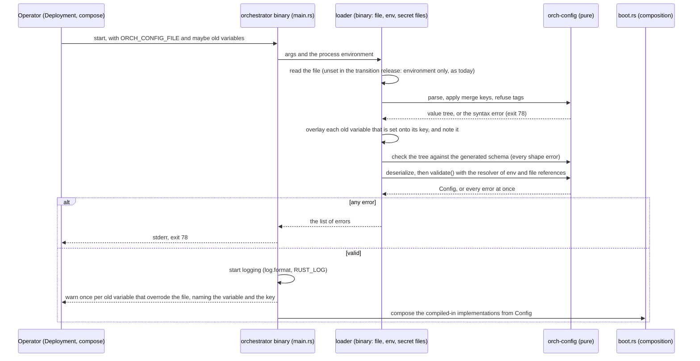
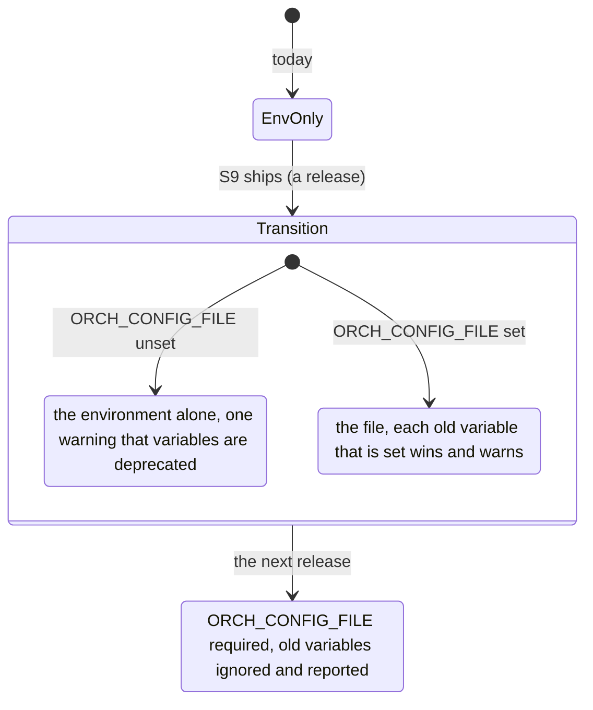

# ADR 0034 — One YAML configuration file; secrets by reference

- **Status:** accepted (2026-10-02), on the owner's request of 2026-10-02; the details are the planner's (plan 10,
  section 3.6) and the owner may revisit them. Amends the environment-only practice of the composition root
  ([ADR 0009](0009-swappable-implementations-at-build-time.md), status note there). **Built (2026-10-02, PR S9):** the
  loader and every key marked *now* in [`docs/api/config.md`](../api/config.md); the keys marked *reserved* come with
  S10/S11 (ADR 0032, artifacts), S14/S15 (ADR 0033, authentication and roles), each written with its PR, and S18
  ([ADR 0035](0035-utility-model-tasks.md), utility model tasks).
  Status note (2026-10-02, PR S9): the three passes each list all of their errors, and a pass runs only when the one
  before it found none (a rule cannot be checked on a value that is not there), so one run lists the shape errors, or,
  when there are none, the rule errors; `docs/api/config.md` says so. A role that serves no routes (`worker`) is not
  asked for the secrets of the routes it would not mount (`webhooks.*`), so one file serves a control plane and its
  workers. A relative path is relative to the directory of the file even when a legacy variable gave it. A secret flag
  given on the command line is read through the `{ env: NAME }` reference of the file, ahead of the variable.

## Context

The owner, 2026-10-02: "We need a custom model for title, description,... Maybe with its custom system prompt too. I
think we should do the config of the web using a yaml then. A .env won't be enough."

**How the owner's words are read.** "The config of the web" is read as **the system's configuration**, served by
the orchestrator from one YAML file, with a public `ui` subset the web reads from `GET /api/config`. The web itself
stays configuration-free and secret-free, as designed ([architecture](../architecture.md): "no Next.js API routes, no
server-side fetches and no secrets in the web"; its only variables, `API_ORIGIN` and `MOCK_API_ORIGIN` in
`web/next.config.ts`, are development tooling). One file, one reader. If the owner meant a file the web reads itself,
this ADR is the place to say so.

**What exists** (*verified 2026-10-02* in the code at `9dddfc1`):

- The binary is configured by **53 environment variables**: 52 declared in `orchestrator/bin/orchestrator/src/config.rs`
  as clap flags with an environment fallback (`--listen-addr` / `LISTEN_ADDR`, …; `HOSTNAME` hidden), and `RUST_LOG`,
  read by `EnvFilter` in `logging.rs`. No other crate under `orchestrator/` reads the environment outside tests. The
  full list, each with its key, is [`docs/api/config.md`](../api/config.md#every-key).
- Two YAML files already exist beside them: `AGENTS_FILE` (the agents, with `deny_unknown_fields` on `gate`) and
  `MCP_TOKENS_FILE`. Both hold secrets **by reference** (`tokenEnv: CODER_A2A_TOKEN`), never by value.
- `Config::load` is pure: clap only collects raw strings, the validation reads the files and the `tokenEnv` variables
  through closures, every error is a `ConfigError` naming the variable, and any error exits **78**.
- The YAML parser of the workspace is `serde_norway` 0.9.42; `schemars` 1 and `jsonschema` 0.58 are workspace
  dependencies already (`orchestrator/Cargo.toml`).

**What is wrong with variables.** Plan 10 adds settings that are structured, not scalar: several model endpoints, a
task per utility call with its own prompt (a paragraph, or a file), roles mapped to permissions (§3.4), an artifact
store with S3 settings (§3.3). Flat names cannot hold lists of objects without a private syntax per variable (today
`ORCH_SURFACES` and `ORCH_GATE` are comma lists, and `WEBHOOK_*_SECRETS` "one or two comma-separated secrets"). And a
variable mixes what is secret with what is not: `DATABASE_URL`, `THREAD_TOOLS_SECRET` and `LISTEN_ADDR` look the same
in a Deployment.

## Decision

### 1. One file, read at startup

- The orchestrator reads **one YAML file**, named by `ORCH_CONFIG_FILE` (or `--config <path>`), **once, at startup**.
  There is no hot reload: processes are stateless and restart cheaply (ADR 0001), and agents are already live
  through the registry (ADR 0022). A Kubernetes chart restarts on a change of the ConfigMap's checksum. Hot reload is
  open question 43.
- `version: 1` is required. A later incompatible shape is `version: 2`, read beside `1` for one release.
- The file configures the orchestrator only. The agents file and the MCP tokens file stay separate files, named from
  it (`agents.file`, `mcp.tokensFile`), with their formats unchanged.
- The sections and keys, and which PR builds each, are [`docs/api/config.md`](../api/config.md). S9 builds `server`,
  `log`, `database`, `dispatcher`, `inbox`, `agents`, `gate`, `steps`, `models` (one endpoint), `tasks.title`
  (`endpoint`, `model`), `threadTools`, `mcp`, `webhooks` and `auth.devUser`: exactly the 51 variables of today that
  have a key. A *reserved* key is refused with exit 78 naming the ADR that brings it, so a file never holds a setting
  that silently does nothing.

### 2. Secrets only by reference

- A secret field is a `SecretRef`: `{ env: NAME }` or `{ file: PATH }`, nothing else. A plain string there is refused
  at startup (exit 78), with the key and the two allowed forms, never the value.
- References are resolved at startup through closures the binary passes in (the environment, the file system), as
  `tokenEnv` is today. A reference that does not resolve (a variable unset or empty, a file that cannot be read) is
  exit 78 naming the key and the variable or path. `{ file }` loses one trailing newline and is at most 64 KiB. An
  optional secret is absent by leaving its key out, never by an empty variable.
- **No error carries a value.** Every message the loader prints names a key path, what is wrong and what is allowed,
  never a value from the file, the environment or a secret file. Library messages that quote the input are not passed
  through: `jsonschema`'s errors are reported by their instance path and kind (its `Display` includes the instance,
  which may be a pasted secret), a string at a `SecretRef` is reported as "a secret is a reference: `{ env: NAME }` or
  `{ file: PATH }`", and a YAML syntax error by line and column only.
- The secrets are the eight values of today that are secrets (`database.url`, the two registry tokens,
  `threadTools.secret` and `previousSecret`, a model endpoint's `apiKey`, the two webhook secret lists) and, later,
  `artifacts.s3.accessKeyId`/`secretAccessKey`. Resolved values are `SecretString`s; every `Debug` prints the
  reference, never the value.

### 3. Validation: typed, closed, and every error at once

- A new pure crate, **`orch-config`** (`orchestrator/crates/config`): the file's types (`serde`,
  `#[serde(deny_unknown_fields)]` on every struct, `rename_all = "camelCase"`, no `#[serde(flatten)]`, because serde
  does not support it together with `deny_unknown_fields`) and `validate(raw, resolve) -> Result<Config,
  Vec<ConfigError>>`. It does no I/O: reading the file, the environment and secret files stays in the binary.
- Loading has three passes, so that one run lists every error it can find:
  1. **Syntax.** `serde_norway` parses the text into a value tree; merge keys are applied (`Value::apply_merge`); a
     tag is refused, and so is a key repeated in one mapping (never "the last one wins"). A syntax error is reported
     alone, with its line and column.
  2. **Shape.** The tree is checked against the JSON Schema generated from the types, with `jsonschema`'s
     `iter_errors`, which yields **every** violation (unknown keys, since `deny_unknown_fields` becomes
     `additionalProperties: false`; wrong types; missing required keys; a string where a `SecretRef` goes), each
     with its path. An unknown key that is a *reserved* key (a short table in `orch-config`: the path, the PR and the
     ADR that bring it) is reported as reserved, not as unknown. Then the tree is deserialized into the types; after a
     clean schema pass that cannot fail, short of a drift the schema test catches.
  3. **Rules.** `validate()` checks ranges, URLs, the cross-key rules of today (both or neither of `threadTools.url`
     and `secret`; a gate that requires `ci` names a check; a verifier that is another configured agent; a
     surface or implementation this build compiled in) and resolves the secrets, collecting every error.
- Any error: the list on stderr, exit **78**, as today.
- **The schema is committed** at `docs/api/config.schema.json`, generated by `schemars` from the types. A test of
  `orch-config` compares the generated schema with the committed file and fails on any difference; `UPDATE_SCHEMA=1`
  rewrites it, as `UPDATE_GOLDEN=1` does for the goldens. CI runs it with the other Rust tests. S9 writes the file;
  this PR does not.

### 4. Migration: the environment over the file for one release

- **Transition release (S9).** Every variable of today still works. Precedence: **a flag or its variable (a flag wins
  over its variable, as today) > the file > the default**. Each old variable that is set and has a key overrides the
  file, and startup logs one `warn` per override naming the variable and the key (`ORCH_TITLE_MODEL overrides
  tasks.title.model; set it in the file`), never the value. The overlay converts a variable with today's parser for it
  (`ORCH_STEPS_RECORD_IO=yes` is `true`, `ORCH_SURFACES` a comma list) before the shape pass, and a value that does not
  parse is an error naming the variable, as today. The process overrides (`ORCH_ROLE`, `ORCH_INSTANCE_ID`) log at
  `info`, not `warn`: they are not deprecated. A
  secret variable of today counts as a reference to itself (`ORCH_MODEL_API_KEY` set means
  `models.endpoints.default.apiKey: { env: ORCH_MODEL_API_KEY }`); the webhook variables keep their comma rule.
  `ORCH_TITLE_MODEL` maps to `tasks.title.model` with `tasks.title.endpoint: default`, and `ORCH_MODEL_*` to the
  endpoint named `default` (S9 takes one endpoint: a file that names another one while `ORCH_MODEL_*` is set is an
  error naming both). Without `ORCH_CONFIG_FILE` the process runs from the environment alone, exactly as today, with
  one warning.
- **`--print-config`** prints the merged configuration as YAML (file, overrides and defaults), secrets as their
  references, and exits 0, or lists the errors and exits 78. It opens no connection. CI and operators use it to check a
  file before a rollout.
- **Next release.** `ORCH_CONFIG_FILE` is required, and the old variables and their per-setting flags are removed:
  a removed variable that is still set is listed in one `warn`, and ignored. What stays for good:
  - `ORCH_CONFIG_FILE` and `--config`, `--print-config`;
  - the **process overrides** `ORCH_ROLE` / `--role` and `ORCH_INSTANCE_ID` / `--instance-id`, which win over
    `server.role` and `server.instanceId` and log at `info`: they describe one process, and a control plane and its
    workers share one file;
  - `RUST_LOG` (the log filter, read before anything else) and `HOSTNAME` (set by the runtime; the default instance
    id's prefix);
  - the secrets' own variables, now named only by `{ env }` references.

### 5. Configuration is not a port

- [ADR 0009](0009-swappable-implementations-at-build-time.md): ports are the **infrastructure boundaries the running
  application calls** (store, agents, model, clock); binaries are compositions. Configuration is the composition
  root's **input**: it is read once, before any port exists, and decides which compiled-in implementation each port
  gets. It is not a port and gets no trait or testkit. `orch-config` is a library of types and rules; the binary reads
  the file. A developer with their own composition root (ADR 0009) may use `orch-config` or not.
- A key that selects an implementation (`server.surfaces`, and later `artifacts.store`, `auth.mode`) chooses **only
  among what the build compiled in**, a closed enum per key. A value this build did not compile in is exit 78 naming
  the Cargo feature, as `ORCH_SURFACES` and `AGENT_REGISTRY_URL` behave today. There are no runtime plugins: no
  library path, no command, no URL that loads code.
- No implementation type appears in `orch-config`'s public types: an S3 bucket is strings and a `SecretRef`, not an
  `object_store` builder.

### 6. The public subset: `GET /api/config`

- The `ui` section is the only part of the file the web can see, served as `GET /api/config` →
  `200 {"ui": {…}}`, every `ui` key with its effective value ([`docs/api/config.md`](../api/config.md#get-apiconfig)).
  The `ui` type has no secret field, and a test asserts that its generated schema has no `SecretRef`.
- **It is behind the same identity layer as every `/api/*` route** (401 without an identity), not public. Reasons:
  the web asks for it only after the edge has let the browser in (oauth2-proxy guards the web and the API alike), so
  nothing in it is needed before sign-in; one rule for all of `/api/*` means no carve-out in the edge's routes or in
  the authenticator of ADR 0033 (a carve-out is where fail-closed rules leak); and a later setting may depend on who
  asks (a role's features) without a contract change. The cost, that a signed-out page cannot read it, is none: a
  signed-out browser never gets the page.
- It is built with the first `ui` key, `ui.showDescriptions`, in S18 (served) and S19 (read by the web). S9 does not
  serve it: an empty section would be a contract without a use.

### 7. The local stack

- `dev/orchestrator.yaml` configures the offline stack (`compose.yaml`): the mocks, the surfaces, the title task on
  `mock-model`. Every secret in it is `{ env: … }`; compose keeps setting those variables to their dummy values,
  next to the file, so a reader sees which values are secrets. `x-orchestrator-env` shrinks to the secrets, the
  `tokenEnv` variables and `ORCH_CONFIG_FILE`, and the services mount the file read-only at
  `/etc/orchestrator/config.yaml` beside `agents.yaml` and `mcp-tokens.yaml`.
- `dev/orchestrator.live.yaml` is the file `compose.live.yaml` mounts **instead** (the same path, `!override` on the
  volumes, as it already does for `agents.live.yaml`): a whole file, not a patch, because there is no layering. Its
  secrets are `{ env: … }` references to the variables `.env` sets today (`CODER_A2A_TOKEN`, `MODEL_API_KEY`, …).
- The `split` profile mounts the same `dev/orchestrator.yaml` and sets the process overrides `ORCH_ROLE` and
  `ORCH_INSTANCE_ID`. Its short lease (`OUTBOX_LEASE_SECS: "5"`) stays an old variable in the transition release, with
  its warning; how a profile that differs in one deployment key keeps it after the deprecation is open question 44.
- The `local-agent` profile stays on environment variables in the transition release: it keeps the old path covered
  by a stack that runs.
- `dev/README.md` documents the files; CI runs `orchestrator --print-config` on both dev files.

## Consequences

- An operator sees, in one file and one schema, every setting and which ones are secrets; an editor can validate it.
  A typo is an error, never an ignored key.
- Lists and maps (endpoints, tasks, roles, stores) have a natural shape; the comma syntaxes go with the deprecation.
- Secrets never enter the file, so it can live in a ConfigMap or the repository. The variables or mounted files that
  hold the secrets are named in it.
- S9 is large: a crate, a three-pass loader, an overlay of 51 variables with warnings, `--print-config`, the schema
  and its test, the dev files, compose and `dev/README.md`. The existing tests of `config.rs` stay and run against the
  environment path; new ones cover the file and the overlay.
- One release carries two ways to configure the same thing. The warnings, `--print-config` and the dev stack's own
  move to the file are what keep it visible.
- `orch-config` adds `schemars` and `jsonschema` to the binary's dependency tree (both in the workspace already).

## Alternatives rejected

- **Keep variables and add structured ones as JSON strings** (`ORCH_TASKS='{"title": …}'`): a second language inside
  the first, with no schema and no line numbers.
- **TOML.** A fine format, but the system's other files (the agents file, the MCP tokens file, compose, the platform's
  CRDs) are YAML; one format for operators.
- **Layered files** (`ORCH_CONFIG_FILE=base.yaml:worker.yaml`, deep merge) or a generic `--set key=value`: they solve
  the split profile's one-key difference, but every error must then say which layer it came from, and lists merge
  ambiguously. Not in `version: 1`; open question 44.
- **Hot reload** (a file watch or `SIGHUP`): half the settings (the listen address, the pool, the surfaces) cannot
  change in a running process, and a restart is cheap. Open question 43.
- **Plain-string secrets allowed with a warning**: a warning is read after the secret is in git.
- **`GET /api/config` without authentication**: see decision 6.
- **Configuration as a port** (a `ConfigSource` trait for files, Consul, …): it is input to the composition root, not
  a boundary the application calls; a deployment that keeps settings elsewhere renders the file (a ConfigMap, a
  template) before start.

## Facts this rests on

- *Verified 2026-10-02*, crates.io API: `serde_yaml` is `0.9.34+deprecated` (2024-03-25, archived upstream);
  `serde_yml` 0.0.13 (2026-05-27) describes itself as "DEPRECATED … unmaintained … a thin compatibility shim";
  `serde_norway` 0.9.42 is the newest, of 2024-12-21.
- *Verified 2026-10-02*, [RUSTSEC-2025-0068](https://rustsec.org/advisories/RUSTSEC-2025-0068.html) (2025-09-12):
  "serde_yml crate is unsound and unmaintained"; it recommends `serde_norway` ("Maintained fork of `serde_yaml`, using
  `unsafe-libyaml-norway`") and `serde_yaml_ng` (whose `unsafe-libyaml` is unmaintained). **Choice: `serde_norway`**,
  the workspace's parser already. Its last release is from 2024-12: if it stops being maintained, the parser is one
  crate behind `orch-config` and can be replaced there.
- *Verified 2026-10-02* by reading `serde_norway` 0.9.42's `src/de.rs`: booleans are only `true`/`false` (any case
  of those two), and digits with a leading zero are a string "according to the YAML 1.2 spec"; so `no` and `on` are
  strings, not booleans (the "Norway problem" does not apply). The parser underneath is a translation of libyaml,
  which reads YAML 1.1 syntax (*unverified* beyond its name and the crate's README); the scalars are resolved the
  YAML 1.2 way above. `Value::apply_merge` exists (`src/value/mod.rs`).
- *Verified 2026-10-02*, [schemars attributes](https://graham.cool/schemars/deriving/attributes/) (version 1 docs) and
  `schemars_derive` 1.2.2's source: `#[serde(deny_unknown_fields)]` sets `additionalProperties: false`.
- *Verified 2026-10-02* in `jsonschema` 0.58.3's source: `Validator::iter_errors` returns every error, not the first.
- *Unverified*: that serde rejects `flatten` together with `deny_unknown_fields` in every case (serde's documentation
  says they are not supported together); the decision avoids `flatten` either way.
</content>
</invoke>
