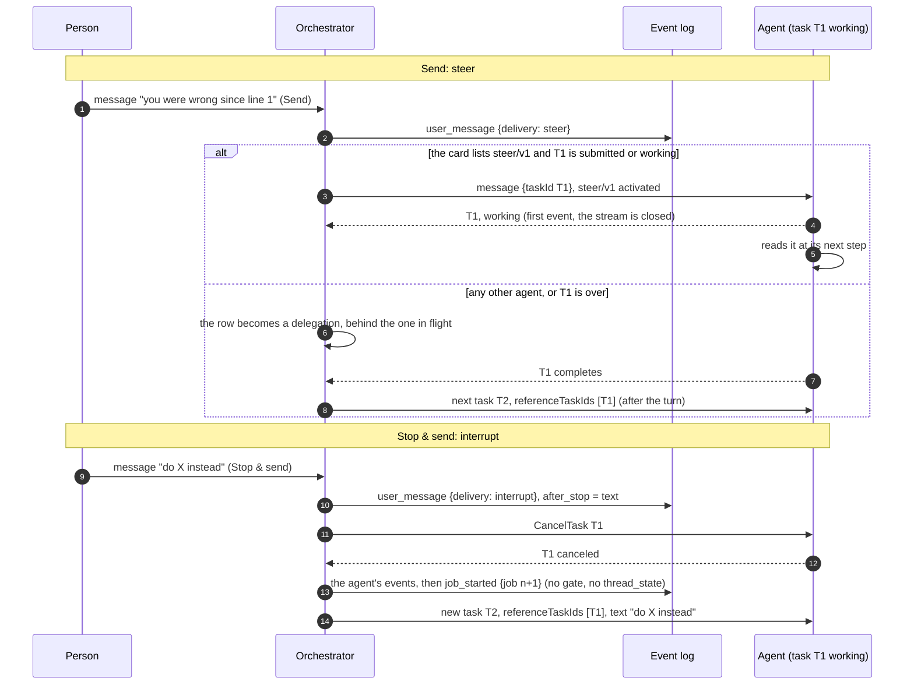
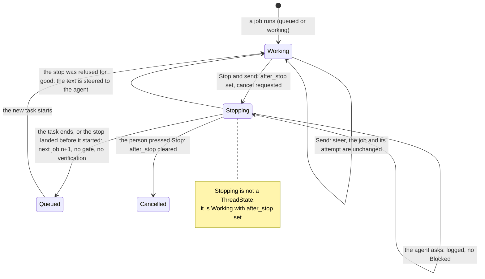

# ADR 0036 — Sending while an agent works: steer, or stop and send

- **Status:** accepted (2026-10-02), on the owner's request of 2026-10-01 ("while an agent is working, it should also
  be possible for a human to send a message … e.g. 'you were wrong since line #1'"). The details are delegated to the
  planner (plan 11, owner decision 5: **the full `steer/v1`**, with the cut line below) and the owner may revisit
  them. **Not built.** Amends [ADR 0020](0020-a-thread-is-a-conversation.md) (what a message sent while a job is open
  is, and the race of open question 33), [ADR 0012](0012-ag-ui-user-facing-protocol.md) (a second run while one is open
  is no longer always a 409) and [ADR 0018](0018-verification-gate-and-rework-loop.md) (a job abandoned by a person is
  not verified). Builds on [ADR 0021](0021-context-across-a2a-tasks.md) and
  [ADR 0008](0008-platform-integration-via-a2a-extension.md). The extension's wire contract is
  [`api/steer-v1.md`](../api/steer-v1.md).

## Context

Today the composer stops being a way to talk while an agent works: only Stop is shown, and the AG-UI surface answers a
second run on an open thread with 409 ([`agui.md`](../api/agui.md#inbound-ag-ui--core-input)). The core does accept a
message in `queued` and `working` (it appends it and writes a delegation), but the dispatcher keeps a delegation
in flight until the agent's turn ends, so such a message reaches the agent only **after** the turn
(*verified 2026-10-01*, plan 08, the dispatcher's `delegate` path). A person who sees the agent going the wrong way has to wait, or press Stop
and lose the thread of what they meant.

Facts (*verified 2026-10-02*, A2A specification, <https://a2a-protocol.org/latest/specification/>):

- A message to a task in a terminal state (`completed`, `failed`, `canceled`, `rejected`) is refused:
  "Messages sent to Tasks that are in a terminal state … cannot accept further messages", with
  `UnsupportedOperationError`. A follow-up is a new task in the same `contextId`, naming the earlier one in
  `referenceTaskIds` (ADR 0021).
- A message with a `taskId` to a task that is `working` is **not defined** by the specification (the text implies
  "continue or refine" for interrupted tasks only). So sending to a working task needs an extension; without one, an
  agent cannot be told anything until its turn ends.
- `CancelTask` is standard.
- "Send Message operations MAY be idempotent. Agents may utilize the `messageId` to detect duplicate messages."

Facts from the agent side (*unverified here*, read in plan 08 on adam-rs `5905ad8` on 2026-10-01; the adam-rs pull
request that builds `steer/v1` re-checks them): adam delivers a context message with no `taskId` to the context's open
task inbox, accepts a `taskId` message only while the task is `input-required`, and a cancel fails the run but does not
abort a model call or a tool already running.

## Decision

**While a job is running, a person has two ways to send a message.** Both log the message at once, in order.

1. **Send** (Enter) is **steer**. An agent whose live card lists `steer/v1` gets the message in its **running task** and
   reads it at its next step. Any other agent gets it **after its turn ends**, as today. A parallel task is never
   started. The chat says which will happen, from the agent's capabilities.
2. **Stop & send** (a menu next to Send, Ctrl/⌘+Shift+Enter) is **interrupt**. One input asks the agent to cancel the
   running task and, when that task has ended, starts the next job with the text. The new task names the cancelled one
   in `referenceTaskIds` (ADR 0021), so an agent that continues from references (adam does) picks up where it was.
   Plain A2A; no extension.

The names on the wire are `steer` and `interrupt` (`user_message.delivery`, `forwardedProps["vymalo.send"]`); the
person sees "Send" and "Stop & send".

### The core

- `UserMessageData.delivery: Option<Delivery>`, `Delivery = steer | interrupt`, omitted when absent (every event
  written before reads as it did). The **core** sets it, never the caller: `steer` for a message received in `queued` or
  `working`, `interrupt` for one that stops the job.
- `Input::StopAndSend { user, text, message_id, run_id, origin }`.
- `Job.after_stop: Option<String>` (serde default; `Job::next()` clears it): the text the next job starts with. Once
  mentions are built it also holds their references. A thread that has it set is **stopping**: it is still `working`
  (there is no new state, so ADR 0004's closed `ThreadState` and every stored ledger stay as they are), and a reader that
  needs to say "stopping" reads the ledger.
- `Command::Steer { text }` replaces `Command::Delegate` for a message received in `queued` or `working` with no
  `after_stop`. Until the dispatcher steers (below) the app maps it to a delegation row, which is today's delivery.

**The `after_stop` table.** The text the next job starts with is `after_stop`; "the next job" is
`job.next()`, `job_started`, `Command::DropQueued`, `Command::Delegate { text, new_job }`, state `queued`, `after_stop`
cleared.

| # | State, ledger | Input | Result |
|---|---|---|---|
| 1 | `queued`, `working`; no `after_stop` | `StopAndSend` | Append `user_message { delivery: interrupt }`, `RequestCancel { job }`, `after_stop = text`. The state is unchanged |
| 2 | `queued`, `working`; `after_stop` set | `StopAndSend` or `UserMessage` | Append `user_message { delivery: interrupt }` and join the text to `after_stop` after a blank line. No command: the cancel is on its way, and a steer to a task that is stopping would be read by nobody. A joined text over 64 KiB is refused (`TransitionError`, 422 on the surfaces) |
| 3 | `queued`, `working`; no `after_stop` | `UserMessage` | Append `user_message { delivery: steer }` and `Steer { text }`. The state is unchanged (before this ADR: the same append and a `Delegate`) |
| 4 | `blocked`, `verifying`, `done`, `failed`, `cancelled` | `StopAndSend` | Exactly `UserMessage` (nothing is running, so there is nothing to stop); `delivery` absent. The rules of ADR 0020 are unchanged |
| 5 | `after_stop` set | the job would end: the agent's task reaches `completed`, `failed`, `canceled` or `rejected`, or the delegation is dead-lettered (`DeliveryFailed`) | The agent's events are logged as today, **but the job is not judged**: no gate, no verification, no rework, no attempt spent, and no `thread_state` (the thread never shows `done` for it). Then the next job |
| 6 | `after_stop` set | the agent asks (`input_required`, `auth_required`) | `agent_status` is logged and the thread stays `working`: the cancel is on its way, and an answer to a job being abandoned is not wanted |
| 7 | `after_stop` set | `CancelRejected`, not retryable | An `error` event "<agent> could not be stopped; your message was sent to it instead", `Steer { text }`, `after_stop` cleared. A retryable rejection logs the error and keeps waiting |
| 8 | `after_stop` set | `CancelledBeforeStart` (the agent was never sent the job's delegation) | The next job. Today the same input cancels the thread |
| 9 | `after_stop` set | `Cancel` (the person pressed Stop) | `after_stop` is cleared, then today's cancel. The text stays in the log and is never sent |

`Command::DropQueued { job }` finishes the thread's **unsent** `delegate` and `steer` rows of jobs up to `job` as
`skipped` ("superseded by a message that stopped the job") in the commit that starts the next job. The messages stay in
the log and on screen; they are not sent, because the message that stopped the job supersedes them, and without this a
delegation of the abandoned job that had not been sent would run **before** the next job's (the dispatcher claims a
thread's delegations in order) and Stop & send would stop nothing. A person who wants both says both. The mechanism is
the builder's (a command, or the job number on the row); the property has a test.

**Cancel cascades.** The cancel of row 1 is the cancel of the person's Stop: when asked agents exist
([ADR 0026](0026-agent-mentions-as-structured-references.md)), their running asks are canceled with it.

### The gate: no verification for an abandoned job

The gate ([ADR 0018](0018-verification-gate-and-rework-loop.md)) applies to each job, to what that job's turn produced.
A job that a person stopped and replaced has no result to judge: its task was cut off, and the person has said what
they want instead.

- A job abandoned by Stop & send is **never verified and never reworked** (row 5): nothing asks CI, the verifier or
  the agent's own checks about it, and its pushed commit and results are not the next job's (`Job::next()` already
  resets them, ADR 0020). The verification counter is monotonic per thread, so any timer, verdict or CI report still
  coming for the abandoned job is stale by the comparison the core already makes.
- The next job is a job like any other: it runs under the thread's gate from attempt 1. What the abandoned job pushed
  stays pushed (git is the artifact, [ADR 0003](0003-git-as-durable-state-ephemeral-workers.md)) and the agent continues
  from it by the reference.
- A **steered** message is part of the same job and the same attempt. The gate sees the job end as it always does. If
  the agent had already said `completed` and the thread is `verifying`, the message is not a steer (nothing is
  running): it is row 4's rule, today's `Verifying → Queued`, and the verification in flight is stale.

### The dispatcher

A steered message is an outbox row of the new kind `steer` (payload `Steer { text, release }`), claimed **independently
of delegations** (the thread's delegate row stays in flight until the turn ends, so a steer must not wait behind it) and
in order among the thread's steer rows. Working it:

1. Load the thread, its binding and the agent's **live card** (read for this row, never cached, ADR 0008).
2. If the thread is `working`, the binding's task is `submitted` or `working`, and the card lists `steer/v1`: send the
   message as a steer ([`steer-v1.md`](../api/steer-v1.md)), read the first event, and when it names the **same task** in
   a non-terminal state the row is delivered. The delegate row's stream keeps reporting the task.
3. Otherwise (no extension, no running task, the agent refuses, the first event names a terminal state or another task,
   or the task is not found): **requeue as a delegation** (same order position, kind `delegate`): it then waits behind
   the delegation in flight, which is today's delivery, and if the job ended meanwhile it is redelivered by ADR 0020's
   rule. A steered message is never lost.

**Open question 33 is decided here.** A delegation whose first event names a **new task** while the thread has
meanwhile become terminal (the message was sent at the instant the first task completed) is applied as
`Input::Redeliver { text, sent: true }`: the core starts the next job **without** writing a second `Delegate`, and the
dispatcher keeps following that task. The question moves to Closed when this is built.

### AG-UI

A run while one is open is **served** when it carries a user message and `forwardedProps["vymalo.send"]` is `steer` or
`interrupt` (`interrupt` becomes `Input::StopAndSend`). Without the member it is the **409** it is today. The projection
treats any `user_message` that arrives inside an open run alike (the MCP surface's too): an open live draft ends
abandoned, the agent's invocation is suspended and the run finished, a new run opens with the user triad (the message's
`runId`, else `run-<seq>`), carrying `vymalo.delivery` in the message's metadata, and the agent's next event re-opens the
same invocation, as after an answered question. [`agui.md`](../api/agui.md) is rewritten by the pull request that builds
it.

### The web

While a run is open the message box stays enabled. Stop (■) is always there; with text, a split **Send** (Enter) with a
menu: "Send — <Agent> reads it at its next step" or "Send — <Agent> reads it after this turn", chosen from the agent's
capabilities (`custom` has the `steer/v1` URI or not), and "Stop and send". A steered bubble carries a quiet line
("Sent while Coder was working · read at its next step" or "· read after this turn"); an interrupt: "Stopped Coder · it
starts again from here". The line says what normally happens; the log's order is the truth (a steer that could not be
delivered falls back to after the turn, which the log shows).

## Consequences

- A person can correct an agent without waiting, and an agent that speaks `steer/v1` reads the correction in the same
  task. An agent that does not is no worse off: the message waits for the turn, as it does now, and the screen says so.
- Stop & send needs nothing from the agent but `CancelTask` and references. How soon it lands is the agent's: until an
  agent cancels the model call in flight and its running processes, "stopping" can last as long as one of them (adam-rs
  does the first part and not the second, as of plan 08; a fix is an adam-rs change, not an orchestrator one).
- Migrations are needed, one at a time: the outbox kind `steer` (a CHECK widened with the union of every kind, as
  migration 0005 did). The `delivery` member and `Job.after_stop` are serde defaults. **Like ADR 0020, this must not be
  rolled out replica by replica**: an older replica cannot decode a `steer` row, and (*unverified*; the builder checks)
  may refuse a `user_message` with a member it does not know. Upgrade every replica before new-version traffic.
- The agent receives a steered message under the message id of the `user_message`, so a row retried after a lost lease
  is the same message; an agent that lists the extension must not read one `messageId` twice
  ([`steer-v1.md`](../api/steer-v1.md)).
- Two messages sent while a job is open are no longer "two delegations" (ADR 0020's consequence): they are two steers,
  delivered in order to a task that can read them, or two delegations behind each other as before. The residual race of
  ADR 0020 and question 33 is closed by `Redeliver { sent: true }`; the out-of-order wrinkle of a redelivery that finds the
  thread moved on remains.
- The cut line, if time is short: ship the core (rows 1, 4 to 9), the AG-UI member and the web without `steer/v1`. That is
  Stop & send, with Send delivered after the turn, which the core already queues (ADR 0020). The dispatcher's steer path,
  the adam-rs side and the pin follow; the contract here does not change.

## Alternatives rejected

- **A second task in parallel.** A2A tasks are immutable and one context's tasks would work in one workspace at the same
  time; the agent's own inbox is the right place for a message to a task that runs.
- **Queue only (today).** The person cannot correct an agent that is going the wrong way until it has finished.
- **Interrupt only.** Cancelling loses the model call and the tool in flight for what may be a one-line remark, and an
  agent that cannot cancel quickly makes the remark slow.
- **A message to a working task with no extension.** The specification does not define it (verified above), so an agent
  could do anything with it, including refusing it after the orchestrator had logged it as delivered. The extension makes
  the behaviour a promise the card makes, read live, fail closed (ADR 0008).
- **The agent polls the orchestrator for messages** (a thread tool). It puts the delivery in the model's hands and needs
  the thread-tools extension for something A2A already carries.
- **A new thread state `stopping`.** A closed enum change, a migration and a state every reader must handle, for a fact
  the ledger already holds.

## Hard to reverse

The `delivery` member of `user_message` and the outbox kind `steer` in stored data, and the extension URI
`https://agents.vymalo.com/a2a/extensions/steer/v1` once agents list it (a change is a `v2` URI).

## Verified

- *Verified 2026-10-02:* the four A2A facts of the Context (the terminal-state refusal and `UnsupportedOperationError`,
  that a message to a working task is not defined, `CancelTask`, `messageId` for duplicates), against the specification
  at <https://a2a-protocol.org/latest/specification/>.
- *Verified 2026-10-01* (plan 08, installed dist): `@assistant-ui/react-ag-ui` 0.0.62 supersedes an active run on an
  append (`abortActiveRun()`, then a new run). The web's first test checks it again; the fallback is a small `POST`
  message route whose message arrives by the connect stream.
- *Unverified:* the adam-rs behaviours of the Context, and how an older replica reads a new `user_message` member.
