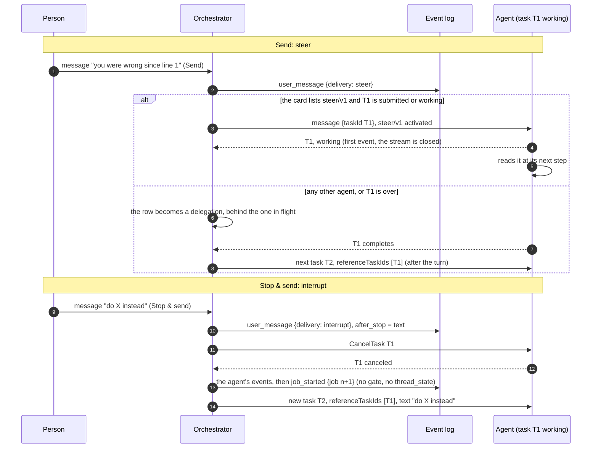
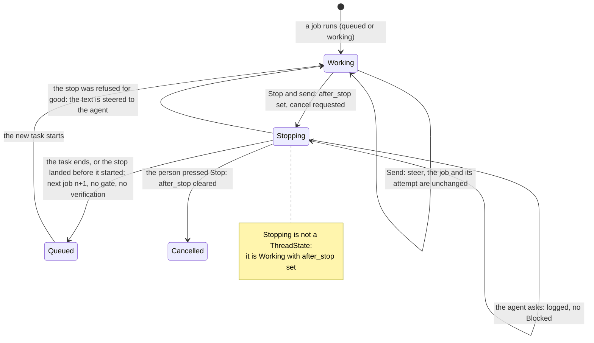

# ADR 0036 — Sending while an agent works: steer, or stop and send

- **Status:** accepted (2026-10-02), on the owner's request of 2026-10-01 ("while an agent is working, it should also
  be possible for a human to send a message … e.g. 'you were wrong since line #1'"). The details are delegated to the
  planner (plan 11, owner decision 5: **the full `steer/v1`**, with the cut line below) and the owner may revisit
  them. **Built in part, 2026-10-02: the core and the application (PR-11, see [Built in PR-11](#built-in-pr-11)), the AG-UI member
  (PR-12, see [Built in PR-12](#built-in-pr-12)) and the dispatcher's steer path with open question 33 (PR-13, see
  [Built in PR-13](#built-in-pr-13)), the web (PR-15, see [Built in PR-15](#built-in-pr-15)) and the coder's pin with the end-to-end script
  (PR-16, see [Built in PR-16](#built-in-pr-16)); the adam-rs side is a pull request of its own
  ([another-adam-rs#75](https://github.com/vymalo/another-adam-rs/pull/75)).** Amends [ADR 0020](0020-a-thread-is-a-conversation.md) (what a message sent while a job is open
  is, and the race of open question 33), [ADR 0012](0012-ag-ui-user-facing-protocol.md) (a second run while one is open
  is no longer always a 409) and [ADR 0018](0018-verification-gate-and-rework-loop.md) (a job abandoned by a person is
  not verified). Builds on [ADR 0021](0021-context-across-a2a-tasks.md) and
  [ADR 0008](0008-platform-integration-via-a2a-extension.md). The extension's wire contract is
  [`api/steer-v1.md`](../api/steer-v1.md).

## Context

Today the composer stops being a way to talk while an agent works: only Stop is shown, and the AG-UI surface answers a
second run on an open thread with 409 ([`agui.md`](../api/agui.md#inbound-ag-ui--core-input)). The core does accept a
message in `queued` and `working` (it appends it and writes a delegation), but the dispatcher keeps a delegation
in flight until the agent's turn ends, so such a message reaches the agent only **after** the turn
(*verified 2026-10-01*, plan 08, the dispatcher's `delegate` path). A person who sees the agent going the wrong way has to wait, or press Stop
and lose the thread of what they meant.

Facts (*verified 2026-10-02*, A2A specification, <https://a2a-protocol.org/latest/specification/>):

- A message to a task in a terminal state (`completed`, `failed`, `canceled`, `rejected`) is refused:
  "Messages sent to Tasks that are in a terminal state … cannot accept further messages", with
  `UnsupportedOperationError`. A follow-up is a new task in the same `contextId`, naming the earlier one in
  `referenceTaskIds` (ADR 0021).
- A message with a `taskId` to a task that is `working` is **not defined** by the specification (the text implies
  "continue or refine" for interrupted tasks only). So sending to a working task needs an extension; without one, an
  agent cannot be told anything until its turn ends.
- `CancelTask` is standard.
- "Send Message operations MAY be idempotent. Agents may utilize the `messageId` to detect duplicate messages."

Facts from the agent side (*unverified here*, read in plan 08 on adam-rs `5905ad8` on 2026-10-01; the adam-rs pull
request that builds `steer/v1` re-checks them): adam delivers a context message with no `taskId` to the context's open
task inbox, accepts a `taskId` message only while the task is `input-required`, and a cancel fails the run but does not
abort a model call or a tool already running.

## Decision

**While a job is running, a person has two ways to send a message.** Both log the message at once, in order.

1. **Send** (Enter) is **steer**. An agent whose live card lists `steer/v1` gets the message in its **running task** and
   reads it at its next step. Any other agent gets it **after its turn ends**, as today. A parallel task is never
   started. The chat says which will happen, from the agent's capabilities.
2. **Stop & send** (a menu next to Send, Ctrl/⌘+Shift+Enter) is **interrupt**. One input asks the agent to cancel the
   running task and, when that task has ended, starts the next job with the text. The new task names the cancelled one
   in `referenceTaskIds` (ADR 0021), so an agent that continues from references (adam does) picks up where it was.
   Plain A2A; no extension.

The names on the wire are `steer` and `interrupt` (`user_message.delivery`, `forwardedProps["vymalo.send"]`); the
person sees "Send" and "Stop & send".

### The core

- `UserMessageData.delivery: Option<Delivery>`, `Delivery = steer | interrupt`, omitted when absent (every event
  written before reads as it did). The **core** sets it, never the caller: `steer` for a message received in `queued` or
  `working`, `interrupt` for one that stops the job.
- `Input::StopAndSend { user, text, message_id, run_id, origin }`.
- `Job.after_stop: Option<String>` (serde default; `Job::next()` clears it): the text the next job starts with. Once
  mentions are built it also holds their references. A thread that has it set is **stopping**: it is still `working`
  (there is no new state, so ADR 0004's closed `ThreadState` and every stored ledger stay as they are), and a reader that
  needs to say "stopping" reads the ledger.
- `Command::Steer { text }` replaces `Command::Delegate` for a message received in `queued` or `working` with no
  `after_stop`. Until the dispatcher steers (below, built in PR-13) the app mapped it to a delegation row, which is the fallback's delivery.

**The `after_stop` table.** The text the next job starts with is `after_stop`; "the next job" is
`job.next()`, `job_started`, `Command::DropQueued`, `Command::Delegate { text, new_job }`, state `queued`, `after_stop`
cleared.

| # | State, ledger | Input | Result |
|---|---|---|---|
| 1 | `queued`, `working`; no `after_stop` | `StopAndSend` | Append `user_message { delivery: interrupt }`, `RequestCancel { job }`, `after_stop = text`. The state is unchanged |
| 2 | `queued`, `working`; `after_stop` set | `StopAndSend` or `UserMessage` | Append `user_message { delivery: interrupt }` and join the text to `after_stop` after a blank line. No command: the cancel is on its way, and a steer to a task that is stopping would be read by nobody. A joined text over 64 KiB is refused (`TransitionError`, 422 on the surfaces) |
| 3 | `queued`, `working`; no `after_stop` | `UserMessage` | Append `user_message { delivery: steer }` and `Steer { text }`. The state is unchanged (before this ADR: the same append and a `Delegate`) |
| 4 | `blocked`, `verifying`, `done`, `failed`, `cancelled` | `StopAndSend` | Exactly `UserMessage` (nothing is running, so there is nothing to stop); `delivery` absent. The rules of ADR 0020 are unchanged |
| 5 | `after_stop` set | the job would end: the agent's task reaches `completed`, `failed`, `canceled` or `rejected`, or the delegation is dead-lettered (`DeliveryFailed`) | The agent's events are logged as today, **but the job is not judged**: no gate, no verification, no rework, no attempt spent, and no `thread_state` (the thread never shows `done` for it). Then the next job |
| 6 | `after_stop` set | the agent asks (`input_required`, `auth_required`) | `agent_status` is logged and the thread stays `working`: the cancel is on its way, and an answer to a job being abandoned is not wanted |
| 7 | `after_stop` set | `CancelRejected`, not retryable | An `error` event "<agent> could not be stopped; your message was sent to it instead", `Steer { text }`, `after_stop` cleared. A retryable rejection logs the error and keeps waiting |
| 8 | `after_stop` set | `CancelledBeforeStart` (the agent was never sent the job's delegation) | The next job. Today the same input cancels the thread |
| 9 | `after_stop` set | `Cancel` (the person pressed Stop) | `after_stop` is cleared, then today's cancel. The text stays in the log and is never sent |

`Command::DropQueued { job }` finishes the thread's **unsent** `delegate` and `steer` rows of jobs up to `job` as
`skipped` ("superseded by a message that stopped the job") in the commit that starts the next job. The messages stay in
the log and on screen; they are not sent, because the message that stopped the job supersedes them, and without this a
delegation of the abandoned job that had not been sent would run **before** the next job's (the dispatcher claims a
thread's delegations in order) and Stop & send would stop nothing. A person who wants both says both. The mechanism is
the builder's (a command, or the job number on the row); the property has a test.

**Cancel cascades.** The cancel of row 1 is the cancel of the person's Stop: when asked agents exist
([ADR 0026](0026-agent-mentions-as-structured-references.md)), their running asks are canceled with it.

### The gate: no verification for an abandoned job

The gate ([ADR 0018](0018-verification-gate-and-rework-loop.md)) applies to each job, to what that job's turn produced.
A job that a person stopped and replaced has no result to judge: its task was cut off, and the person has said what
they want instead.

- A job abandoned by Stop & send is **never verified and never reworked** (row 5): nothing asks CI, the verifier or
  the agent's own checks about it, and its pushed commit and results are not the next job's (`Job::next()` already
  resets them, ADR 0020). The verification counter is monotonic per thread, so any timer, verdict or CI report still
  coming for the abandoned job is stale by the comparison the core already makes.
- The next job is a job like any other: it runs under the thread's gate from attempt 1. What the abandoned job pushed
  stays pushed (git is the artifact, [ADR 0003](0003-git-as-durable-state-ephemeral-workers.md)) and the agent continues
  from it by the reference.
- A **steered** message is part of the same job and the same attempt. The gate sees the job end as it always does. If
  the agent had already said `completed` and the thread is `verifying`, the message is not a steer (nothing is
  running): it is row 4's rule, today's `Verifying → Queued`, and the verification in flight is stale.

### The dispatcher

A steered message is an outbox row of the new kind `steer` (payload `Steer { text, release }`), claimed **independently
of delegations** (the thread's delegate row stays in flight until the turn ends, so a steer must not wait behind it) and
in order among the thread's steer rows. Working it:

1. Load the thread, its binding and the agent's **live card** (read for this row, never cached, ADR 0008).
2. If the thread is `working`, the binding's task is `submitted` or `working`, and the card lists `steer/v1`: send the
   message as a steer ([`steer-v1.md`](../api/steer-v1.md)), read the first event, and when it names the **same task** in
   a non-terminal state the row is delivered. The delegate row's stream keeps reporting the task.
3. Otherwise (no extension, no running task, the agent refuses, the first event names a terminal state or another task,
   or the task is not found): **requeue as a delegation** (same order position, kind `delegate`): it then waits behind
   the delegation in flight, which is today's delivery, and if the job ended meanwhile it is redelivered by ADR 0020's
   rule. A steered message is never lost.

**Open question 33 is decided here.** A delegation whose first event names a **new task** while the thread has
meanwhile become terminal (the message was sent at the instant the first task completed) is applied as
`Input::Redeliver { text, sent: true }`: the core starts the next job **without** writing a second `Delegate`, and the
dispatcher keeps following that task. The question moves to Closed when this is built.

### AG-UI

A run while one is open is **served** when it carries a user message and `forwardedProps["vymalo.send"]` is `steer` or
`interrupt` (`interrupt` becomes `Input::StopAndSend`). Without the member it is the **409** it is today. The projection
treats any `user_message` that arrives inside an open run alike (the MCP surface's too): an open live draft ends
abandoned, the agent's invocation is suspended and the run finished, a new run opens with the user triad (the message's
`runId`, else `run-<seq>`), carrying `vymalo.delivery` in the message's metadata, and the agent's next event re-opens the
same invocation, as after an answered question. [`agui.md`](../api/agui.md) is rewritten by the pull request that builds
it.

### The web

While a run is open the message box stays enabled. Stop (■) is always there; with text, a split **Send** (Enter) with a
menu: "Send — <Agent> reads it at its next step" or "Send — <Agent> reads it after this turn", chosen from the agent's
capabilities (`custom` has the `steer/v1` URI or not), and "Stop and send". A steered bubble carries a quiet line
("Sent while Coder was working · read at its next step" or "· read after this turn"); an interrupt: "Stopped Coder · it
starts again from here". The line says what normally happens; the log's order is the truth (a steer that could not be
delivered falls back to after the turn, which the log shows).

## Consequences

- A person can correct an agent without waiting, and an agent that speaks `steer/v1` reads the correction in the same
  task. An agent that does not is no worse off: the message waits for the turn, as it does now, and the screen says so.
- Stop & send needs nothing from the agent but `CancelTask` and references. How soon it lands is the agent's: until an
  agent cancels the model call in flight and its running processes, "stopping" can last as long as one of them (adam-rs
  does the first part and not the second, as of plan 08; a fix is an adam-rs change, not an orchestrator one).
- Migrations are needed, one at a time: the outbox kind `steer` (a CHECK widened with the union of every kind, as
  migration 0005 did). The `delivery` member and `Job.after_stop` are serde defaults. **Like ADR 0020, this must not be
  rolled out replica by replica**: an older replica cannot decode a `steer` row, and (*unverified*; the builder checks)
  may refuse a `user_message` with a member it does not know. Upgrade every replica before new-version traffic.
- The agent receives a steered message under the message id of the `user_message`, so a row retried after a lost lease
  is the same message; an agent that lists the extension must not read one `messageId` twice
  ([`steer-v1.md`](../api/steer-v1.md)).
- Two messages sent while a job is open are no longer "two delegations" (ADR 0020's consequence): they are two steers,
  delivered in order to a task that can read them, or two delegations behind each other as before. The residual race of
  ADR 0020 and question 33 is closed by `Redeliver { sent: true }`; the out-of-order wrinkle of a redelivery that finds the
  thread moved on remains.
- The cut line, if time is short: ship the core (rows 1, 4 to 9), the AG-UI member and the web without `steer/v1`. That is
  Stop & send, with Send delivered after the turn, which the core already queues (ADR 0020). The dispatcher's steer path,
  the adam-rs side and the pin follow; the contract here does not change.

## Alternatives rejected

- **A second task in parallel.** A2A tasks are immutable and one context's tasks would work in one workspace at the same
  time; the agent's own inbox is the right place for a message to a task that runs.
- **Queue only (today).** The person cannot correct an agent that is going the wrong way until it has finished.
- **Interrupt only.** Cancelling loses the model call and the tool in flight for what may be a one-line remark, and an
  agent that cannot cancel quickly makes the remark slow.
- **A message to a working task with no extension.** The specification does not define it (verified above), so an agent
  could do anything with it, including refusing it after the orchestrator had logged it as delivered. The extension makes
  the behaviour a promise the card makes, read live, fail closed (ADR 0008).
- **The agent polls the orchestrator for messages** (a thread tool). It puts the delivery in the model's hands and needs
  the thread-tools extension for something A2A already carries.
- **A new thread state `stopping`.** A closed enum change, a migration and a state every reader must handle, for a fact
  the ledger already holds.

## Hard to reverse

The `delivery` member of `user_message` and the outbox kind `steer` in stored data, and the extension URI
`https://agents.vymalo.com/a2a/extensions/steer/v1` once agents list it (a change is a `v2` URI).

## Verified

- *Verified 2026-10-02:* the four A2A facts of the Context (the terminal-state refusal and `UnsupportedOperationError`,
  that a message to a working task is not defined, `CancelTask`, `messageId` for duplicates), against the specification
  at <https://a2a-protocol.org/latest/specification/>.
- *Verified 2026-10-01* (plan 08, installed dist): `@assistant-ui/react-ag-ui` 0.0.62 supersedes an active run on an
  append (`abortActiveRun()`, then a new run). The web's first test checks it again; the fallback is a small `POST`
  message route whose message arrives by the connect stream.
- *Unverified:* the adam-rs behaviours of the Context, and how an older replica reads a new `user_message` member.

## Built in PR-11

*2026-10-02.* The core and the application: `UserMessageData.delivery`, `Input::StopAndSend`, `Job.after_stop`,
`Command::Steer` and `Command::DropQueued`, the nine rows of the table (`orchestrator/crates/core/tests/stop_and_send.rs`
has one test or more for each, and for the gate), and `App::stop_and_send`. No migration (the `delivery` member and
`after_stop` are serde defaults). Not built: `forwardedProps["vymalo.send"]` and the projection (PR-12), the `steer` outbox
row, `steer/v1` and the fallback (PR-13), the web. Until the dispatcher steers, a steered message is written as the
delegation it always was, so **Send is delivered after the turn** and the log already says `delivery: steer`.

Where the build is not what the text above says, or the text was silent:

- **The first message of a thread is not a steer.** `transition` of a `queued` thread says `steer`, and a new thread is
  `queued`; `start_thread(gate, input)` is the transition of the first message (no `delivery`, a delegation).
- **`Input::StopAndSend` carries `catalog`**, as `UserMessage` does (the screen sends it with every message, ADR 0023, and
  row 4 is "exactly `UserMessage`"). The `ui_catalog` event is written first. The delegation that starts the next job carries
  a reference to the current catalog, never the catalog inline, because the text is delegated later.
- **`Command::Steer { text, catalog }`** keeps the catalog so that the delegation it stands for is today's, byte for byte.
  PR-13 may drop it from the steer row (`steer/v1` carries no catalog).
- **`Command::Delegate` has no `new_job`.** The application derives it from the `job_started` in the commit, as it did before.
- **`Command::DropQueued` is executed just before the commit, not in it** (*amended by PR-12: it is in it now, see below*). `apply` calls `skip_unsent_delegates` when the
  transition produced the command, so the row the commit writes is made after the rows are finished, and no port or store
  changes in this pull request. It is not atomic with the commit: a crash between the two leaves the abandoned job's unsent
  delegations skipped and the thread still stopping, which the retry of the input that produces it finishes. Nothing is
  inserted for a stopping thread meanwhile (a message joins `after_stop`, and a redelivery is dropped), so no row of the next
  job can be skipped by mistake. PR-13 adds the `steer` kind to the skip (and may move it into the commit).
- **`Input::CancelRejected` gained `agent`**, so that row 7 can say "<agent> could not be stopped; your message was sent to
  it instead".
- **The text held is bounded for the first stop too** (64 KiB, `MAX_AFTER_STOP_BYTES`), not only when joined: the ledger is
  written with every commit of the thread. `TransitionError::TextTooLong` is `AppError::Unprocessable`, 422 on the surfaces.
- **While a job is stopping**, an A2UI action is refused (`InvalidInState`: an answer to a job being abandoned, as row 6), and
  a redelivered message is dropped (the stop supersedes it, as `DropQueued` does the rows).
- **A late end of the stopped task must not end the next job.** The stream of the delegation and the cancel that read the
  task back both report `canceled`, under different keys; the second would otherwise reach the thread after the next job began
  and cancel it. The dispatcher drops a terminal status of a task its binding records as over already.
- A job ended by Stop & send logs the agent's `agent_status` (`completed`, `failed`, `canceled`) and no `thread_state`; the
  AG-UI projection of that boundary is PR-12's.

## Built in PR-12

*2026-10-02.* The AG-UI member: `forwardedProps["vymalo.send"]` and the projection of a message that arrives inside an open run
([`agui.md`](../api/agui.md#sending-while-an-agent-works)), with the goldens `steer`, `stop-and-send`, `run-steer` and
`run-stop-and-send`. Not built: the dispatcher's steer path and `steer/v1` (PR-13), the web (PR-15).

Where the build is not what the text above says, or the text was silent:

- **The wire names are `steer` and `interrupt`** (the text of this ADR), not `stop`. Any other value is a 400 that names the two,
  whatever the thread is doing; `null` is no member. With no run open the member changes nothing, except that `interrupt` on a thread
  that exists is `Input::StopAndSend`, which the core treats as a plain message when nothing runs (row 4), so a request that raced the
  end of the run is still served as the person meant it.
- **The run that ends is finished with `success`.** The ADR said "the run finished" without an outcome. `success` says the run is
  over; the `STATE_SNAPSHOT` before it says the thread is not (`working`, or `queued` for a message that abandons a verification). The
  invocation is suspended with no `interruptIds`: nobody is asked, and a `cancelled` outcome would read as the person's Stop.
- **The response to the POST starts at the message's own `RUN_STARTED`.** A position in the log (`Start::Seq`) cannot say it: the
  event that carries the message finishes the old run first, and the stream, which ends at a terminal event, would end there. The
  surface starts a message's response at the run named by the request (`Start::Run`, the mechanism of an attach), so an event between
  the read and the write cannot move it.
- **A projection that says "stopping".** The core logs no `thread_state` for an abandoned job, and no verification, but the
  projection used to start one at the stopped task's `completed` (it counts verifications to name the `vymalo.check` cards, as the
  core does). The projector keeps one bit, set by a `user_message` with `delivery: interrupt` and cleared by `job_started`, by any
  `thread_state`, and by an `error` of the orchestrator's that cannot be retried (a stop the agent refused for good, row 7). Not
  cleared, and so wrong in one corner: a Stop pressed while the stop lands (row 9) followed by a `completed` of that task under a
  gate, which the core judges and the projection does not count. The corner is rare, the consequence is a card id one lower; a
  field on the event is the cure if it ever matters.
- **A task that asks while it is being stopped (row 6)** is shown (its words, its status) with no interrupt and no suspension: a
  suspended invocation could not re-open in the same run, and nobody waits for the answer. **A job boundary ends the invocation the
  stopped task left open** (`job_started` closes it as cancelled): a failed delivery of the abandoned job ends no task.
- **No capability key.** The web and the orchestrator ship together; an older orchestrator answers the 409 it always did, and the
  agent's own capability (`steer/v1`, in `custom` once PR-13 lists it) is the only thing the web reads to word its menu.
- **`steer` is delivered after the turn until PR-13**, so the golden shows the second run ending with the first job and the message's
  job in a producer-initiated run (`run-<seq>`, as for any redelivered message). PR-13 regenerates it.
- **A defect of PR-11 found here, fixed here.** `DropQueued` was executed by a call before the commit. Two workers deciding the same
  next job (the delegation's stream and the cancel call both report `canceled`) could interleave so that the second skipped the
  delegation the first had just written, and the thread stayed `queued` for ever (seen on Postgres under load, about one run in
  six of the new e2e test). The commit now carries `skip_unsent_delegates` and the store finishes the rows in its own transaction,
  before inserting the commit's (`Commit.skip_unsent_delegates`, conformance case
  `a_commit_can_skip_the_unsent_delegates_it_supersedes` on both stores).

## Built in PR-13

*2026-10-02.* The dispatcher's steer path and open question 33: the `steer` outbox row (migration `0013_steer.sql`),
`ThreadStore::requeue_as_delegate`, `SendRequest.steer`, the A2A adapter's activation of `steer/v1`, the fallback, and
`Input::Redeliver { text, sent: true }` ([`steer-v1.md`](../api/steer-v1.md) is built on the orchestrator's side). Not built:
the adam-rs pin and an end-to-end script against the real coder (PR-16).

Where the build is not what the text above says, or the text was silent:

- **One lane of claims for steers.** A `steer` row is claimed beside the delegation in flight and waits only for an older open
  `steer` row of its thread (also one in a retry backoff), so steers are delivered in the order they were written. A steer does
  not wait for an older unsent delegation, which would have been a second rule: where the delegation in flight has not reached
  the agent yet there is no running task, and the steer falls back to a delegation that sits behind it.
- **The row keeps the delegation's words.** `OutboxPayload::Steer { text, release, ui_catalog, mentions }` holds what the delegation it
  may become holds, so the fallback is today's delivery byte for byte (PR-11 left it open whether to drop the catalog from the
  steer; it is kept on the row and never sent with a steer, which `steer/v1` has no place for). A steer is sent with no release,
  no catalog, no `referenceTaskIds` and no reporting extensions (`steps/v1`, `text-stream/v1`): the task keeps reporting on the
  stream that started it. What rides along on any message does: the thread-tools grant and, when the card also lists
  `mentions/v1`, the message's mentions ([ADR 0026](0026-agent-mentions-as-structured-references.md), built in PR-17: the row
  holds them, the dispatcher names the agents from the registry when it sends, and the delegation the row becomes carries them).
- **`requeue_as_delegate(lease, now)` rewrites the row in place.** Kind `delegate`, payload `OutboxPayload::steer_as_delegate`,
  `pending` and due at `now`, the lease released; the row keeps its position and creation time, so it waits behind the delegation
  in flight and in front of the ones written after it. `attempts`, which fences leases, is not reset, so a stale worker still
  holds a token that matches nothing. `false` for a lost lease and for a row that is not a steer. Both stores do it in one
  transaction; conformance cases `steer_rows_claim_beside_an_inflight_delegate`, `a_requeued_steer_waits_behind_the_delegation_in_flight`
  and `unsent_steers_are_skipped_with_the_unsent_delegates` run on both, and `migration_0013_upgrades_a_database_that_holds_an_outbox`
  upgrades a database that holds rows. (The migration rebuilds the CHECK as migrations 0009 and 0011 did, not 0005, which is the
  events table's.)
- **What delivers, what falls back.** A steer is delivered only when the thread is `working`, the binding's task is `submitted`
  or `working`, and the agent answers with the **same task** in a state that has not ended. Everything else requeues at once: no
  running task, an answer for another task or a task that ended, no answer, `UnsupportedOperation` (a task that ended, or an agent
  that does not list the extension: the adapter itself refuses, from the card it read for this send, so the dispatcher reads no
  card of its own), `TaskNotFound`, `InvalidParams` and any other refusal. An error that a retry can cure (the agent is down, a
  timeout, a rate limit) is retried with the dispatcher's backoff up to `max_attempts`, and only then requeued: a steer is never
  dead-lettered, and a message is never lost. A first event that does not come in 10 s (`STEER_ANSWER_TIMEOUT`) is such an error.
- **The agent answers once; the dispatcher does not follow it.** The first event is read and the stream dropped; the delegation's
  own stream keeps reporting the task. An accepted steer produces no event of its own in the log: the message is in it already, and
  what the agent does with it arrives as the task's events.
- **Open question 33, as built.** `consume` looks at the first event of a delegation that opens a task of its own (not one that
  continues an `input-required` task). When it names a task other than the binding's last and the thread is `done`, `failed` or
  `verifying`, the dispatcher applies `Redeliver { sent: true }` under the row's lease, with the key `adopt:<row id>`, **before** it
  records the task, so a crash between the two is retried as an adoption that is a duplicate. The core does what an unsent redelivery
  does, minus the `Delegate`: `done` and `failed` start the next job (`job_started`, state `queued`), `verifying` and `blocked` put
  the same job back to `queued`. The agent's `working` then moves the thread to `working`, and the task's updates are applied.
  `verifying` is included because the window is not only the instant of `completed`: the gate keeps the thread out of `done` while it
  verifies, and the stale `working` of a task that is over is what the core drops in that state (`status_input`). On an open thread
  a sent redelivery changes nothing but, being a message the job has in its task already, does not add it to `Job.task` a second time
  (an unsent one still does, as before). A `cancelled` thread changes nothing: the person asked to stop.
- **The out-of-order wrinkle stays**, as the text above says: a redelivery on a thread that has moved on joins the job it reached.
- **`agent-adam` (the in-process host).** Its card lists no extension, so the adapter answers every steer `Unsupported` and the
  message is delivered after the turn. (PR-13 expected it to become a steer once the pinned `adam-host` had the equivalent path; [Built in PR-16](#built-in-pr-16) says why it stays so.)
- **The dev stack's WireMock agent** has no steer scenario (the real coder's is PR-16), so it is unchanged. The orchestrator's
  fake agent has the word `steerable` (a task that reads each steer at its next step and says `steered: <text>`, refuses without the
  activation, refuses a task that ended or an unknown one) for the tests and the goldens; `FAKE_AGENT_EXTENSIONS=steer` lists the
  extension in the standalone fake.
- **The goldens `steer` and `run-steer` show a real steer**: one task, the steered message in the log (`delivery: steer`), the task
  saying what it read, and one job that ends once. The web mock plays the same (`steerable` script). The fallback after the turn is
  tested (`an_agent_that_does_not_list_the_extension_has_the_message_after_its_turn`, and the PR-12 test of the run route, whose agent
  lists nothing).

## Built in PR-15

*2026-10-02.* The web: while a run is open the box stays usable, with a split **Send** (Enter, `steer`) whose menu offers **Stop and
send** (Ctrl/⌘+Shift+Enter, `interrupt`), and a note under a message that was sent while the agent worked
([`web/DESIGN.md`](../../web/DESIGN.md#sending-while-the-agent-works), [`web/README.md`](../../web/README.md#sending-while-the-agent-works)).
The note says "after this turn" for any agent whose card does not list `steer/v1`, whose message the dispatcher delivers after the
turn ([Built in PR-13](#built-in-pr-13)).

Where the build is not what the text above says, or the text was silent:

- **The web does not send through the runtime.** The *Verified* note above holds (*verified again 2026-10-02*,
  `@assistant-ui/react-ag-ui` 0.0.62, by the first test of `web/src/features/chat/lib/agui/thread-agent.dom.test.tsx`): the runtime
  supersedes the active run on an append, and the transcript keeps every message once. But it supersedes by dispatching
  `RUN_CANCELLED` to the run's message, which ends it as `incomplete: cancelled` and detaches from the run. The web draws a turn with
  that status as "Stopped", so the turn of an agent that is still working (a steer) would read so, and a send the server refused would
  leave the rest of the run unseen. The fallback the *Verified* note names was a `POST` message route; what is built is nearer: the
  consumer posts the run itself (`ThreadAgent.sendWhileWorking`, the same `POST /agui/agents/{id}` with `forwardedProps["vymalo.send"]`,
  read to `RUN_STARTED`) and the runtime is not involved. The message comes back by the connect stream as a run another tab started
  would, and the runtime shows the first run's end as the log ends it (`success` at the message), then the message with its `delivery`.
  No change to the contract or to the orchestrator.
- **The message is drawn a moment after it is sent**, when the orchestrator has accepted it and the stream says so, not at once. A
  refused message is never drawn, and its text goes back into the box.
- **A send is held back until the conversation is on screen** (the stream is caught up and the runs it delivered are in the
  transcript): the buttons are disabled, Enter does nothing and the text is kept. The runtime's own send would replace the turns it has not
  drawn when it comes first; the message here does not go through it, so the rule is mostly that a reply follows what it replies to.
- **The wording of Send** follows the agent's card, read live: "reads it at its next step" only for an agent that lists `steer/v1`
  (the mock lists it for the coder), "after this turn" for any other and for a card that could not be read.

## Built in PR-16

*2026-10-03.* The dev stack runs the adam-rs that has the agent side ([`another-adam-rs#75`](https://github.com/vymalo/another-adam-rs/pull/75),
`steer/v1` in `adam-a2a-runtime`), and one script proves the whole path against it: the coder's image is pinned to `af1e715` (the commit
that holds #75 and a fix of a flaky test; `dev/coder/UPSTREAM`, the vendored files and `x-adam-image`; **no vendored file changed**: `dev/` and
`bin/adam-coder/agent` are byte for byte the same at `851ff21` and at `af1e715`), the `adam-host` crates of the orchestrator's `agent-local`
feature move to the same commit, and [`dev/steer-e2e.sh`](../../dev/steer-e2e.sh) is a scenario of `dev/e2e-all.sh` and of the Coder E2E
workflow.

Where the build is not what the text above says, or the text was silent:

- **The script's agent is `chat`, not the coder.** `chat` is `adam-agent` from the coder's own image, so it is the same adam-rs commit and
  the same `steer/v1` code, and its model is the repository's own `mock-model`, where a script that says a few words and makes one tool step, then streams its answer over 20 s (`[mock:slow]`,
  `dev/wiremock/model/mappings/persona-slow*.json`, with its SSE twin) is ours to add. The coder's model is adam-rs's vendored mock, which
  is never edited here. The orchestrator's side (the dispatcher, the adapter) does not depend on which agent it is.
- **What the script proves** (*unverified where this was written*: the stack was not started, CI's `coder-e2e` is the proof). Send: a
  message sent with `forwardedProps["vymalo.send"] = "steer"` while the model call is in flight is in the log with `delivery: steer`, the
  model's next request ends with it, once, the thread stays one job (no `job_started`, one `thread_state` that ends a job) and both runs end
  `success`. Stop & send: the task ends `canceled` at most 5 s after the message by the orchestrator's own clock (the model call is 20 s, so a
  stop that did not reach it would show), the next job is job 2, the abandoned job is never judged and job 2's task ends `completed`.
- **A steer sent while an adam task has said nothing yet is delivered after the turn, not read by it.** *Verified 2026-10-03* (adam-rs
  `af1e715`, `crates/adam-a2a-runtime/src/convert.rs`: `RunStatus::Runnable if view.version <= 1 => TaskState::Submitted`; the dispatcher
  steers only a `working` thread, `Dispatcher::steer`): adam reports a run as `submitted` until its first commit, and a whole turn (the
  model, its tools, the model again) is one transition, so nothing commits while it runs. A step report does not count either: the adapter
  makes a `working` status that carries a step into a step, and the core logs a step without moving a `queued` thread (`record_step`). What
  adam does say mid-turn is the words the model wrote before a tool call, as a `working` status of their own (text-stream/v1). So until
  the model has said something, the orchestrator never logs `agent_status: working`, the thread stays `queued`, and a steer takes the
  fallback above (delivered after the turn). The rule stays: it keeps a steer sent right after a Stop & send out of the
  task being cancelled. The CI's first run of `dev/steer-e2e.sh` found it: its first message was one 20 s model call, so `working` appeared
  only when the call returned and both sends landed on a finished thread; its second run, with a silent tool call first, found the step
  rule. The script now has the model say a few words and call a tool first (`[mock:slow]` in two phases: the words and a call of
  `ui_catalog`, then the 20 s answer), so the task is `working` while the slow call is in flight. Two follow-ups, not built: adam-rs
  reports `working` once a worker claims the run, not at the first commit; and the core moves a `queued` thread to `working` on the
  agent's first step report, which says as much as a status.
- **`referenceTaskIds` is proved by its effect on the stack, and on the wire by the Rust tests.** The orchestrator does not log what it
  sent, and the agent's requests are not journaled, so the script reads what the reference does: adam's backend continues the run it
  references, so job 2's first model request holds the cancelled task's first message in front of the new one (a task that names nothing
  starts with the new message alone). That the request carries `referenceTaskIds` is `stop_and_send_cancels_the_running_task_and_the_next_task_names_it`
  (`orch-app`) and the adapter's `steer` tests (`orch-agent-a2a`).
- **`agent-adam` still answers a steer `Unsupported`.** *Verified 2026-10-03* (adam-rs `af1e715`, read in the source): the backend takes a
  message for a `submitted` or `working` task when the caller names `steer/v1` (`Caller::with_extensions`,
  `RuntimeTaskBackend::submit`), so the path exists. But the card lists the extension as the host's promise that its agent reads an
  accepted message and never loses it ([`steer-v1.md`](../api/steer-v1.md), section 3), and that is a property of the agent: adam's `LlmAgent`
  has it (it calls `Ctx::reopen_on_arrival`, and keeps the message ids it has read), but the only local kind, `echo`, ends in one step and
  never reads its inbox, so a steer it accepted would be lost. The fallback stays (the message is delivered after the turn), `read_card`
  lists no extension, and a local kind that reads its inbox is where `LocalAgentClient` will list `steer/v1` and activate it. The
  adam-rs crates of the orchestrator moved to `af1e715` with the pin so that both ends are the same commit; nothing else of the crate changed.

## Built after PR-16

*2026-10-03.* `dev/steer-e2e.sh` waits for the log to say the task works (an `agent_status` of `working`) before it sends the steer, and
that is also when a person's screen and the dispatcher's own precondition (a steer is delivered only to a `working` thread) say it is
safe to steer. An agent that reports its work only as steps does not say it: adam says `submitted` until a turn commits, and a turn is
one transition, so its first sign of work is a `steps/v1` report. The core already moved a `queued` thread to `working` on such a report,
but silently (no event), so the row was `working` while the log, which is what the chat and the script read, had no status.

- **A step report counts as working.** An agent's step (`StepSource::Agent`) on a `queued` thread now does what a `working` status
  does: the thread becomes `working` and an `agent_status` `working`, with no detail, is logged once, **in front of** the `agent_step`, so
  the log reads the same as for an agent that says `working` first. A `working` thread logs no status for a step, and a status
  `working` that follows a step on a `working` thread is not repeated (no detail).
- **Only a logged step moves the state.** A report that fails `sanitize`, that the ledger coalesces or that is past a cap changes
  nothing: no status, and the thread stays `queued`.
- **A step on a `blocked` thread is still dropped.** A blocked thread waits for a person's answer, and a step is no answer; an agent
  that goes on working after it asked is stale, and the thread resumes by the answer (`queued`) as before. Only the agent's own
  `working` status resumes a `blocked` thread, because it is the agent saying that it took the answer.
- **The orchestrator's own steps (`Input::Step`) log no status.** A relayed tool call or an asked agent says nothing about the agent's
  task; they keep moving a `queued` thread to `working` without an event, as before.

The rule is `record_step` in `orch-core` (`docs/orchestrator.md`, "Steps on a thread"); the test is `an_agent_that_reports_only_steps_is_working_and_can_be_steered`
in `orch-app`'s `steer` tests, with the scripted agent's `stepping` script (a step, no `working` status, then the gate).
