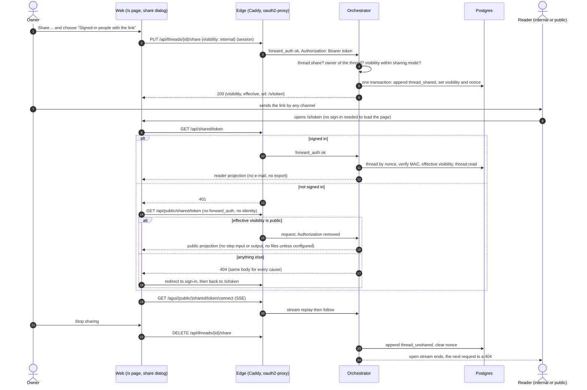

# ADR 0040 — Sharing a thread: private, internal or public, by a revocable link

- **Status:** accepted (2026-10-03), on the owner's words of the same day: "messages are split per user (unless
  shared – share should be disabled, internal or public)", "Yes, you go the concept of sharing", and, about
  administrators, "Admins shouldn't read every thread, it's dangerous and not GDPR compliant". The owner also
  approved the defaults **D3** (the deployment starts at `disabled`, then `internal`; `public` only after rate
  limiting) and **D8** (a public view hides step input and output and files, and never shows the owner's e-mail) of the
  production-deployment plan. The details below that the owner did not state (the token's construction, the routes,
  the events, the limits) are the planner's and the owner may revisit them. **The backend is built (2026-10-03,
  PR S-B2)**: the events, migration `0015`, the port, the application, the configuration, the routes, the rate limit
  and the span redaction, as the decision says, with the deviations of the status note below; **the web is built too
  (2026-10-03, PR S-B3)**, with the status note after it, and the edge is the next pull request (*Build order* at the end). It leans on `ADR 0039` (nobody reads another person's
  thread; sharing is the only way in), which is decided in a pull request of its own and is cited here by number
  only.

  Status note (2026-10-03, PR S-B2). What is built is everything of build step 1: `thread_shared` and `thread_unshared`
  (core, with `Input::Share` and `Unshare` and `Command::SetSharing` and `ClearSharing`; the fork keeps the copied events
  as history and is private), migration `0015_sharing.sql`, `ThreadStore::thread_by_share_nonce` with seven conformance
  cases on the memory and the Postgres store, `IdGen::new_token_bytes`, `thread.share`, `Resource::SharedThread`, the link
  token (`ShareKeys`, constant-time, with `previousSecret`), the cap at read time, the reader projection, the `sharing`
  configuration (`config.md`, the schema), the routes of the table in section 6 and their AG-UI connects, the per-link and
  total token buckets with the stream ceiling, the token kept out of the request span, the counters
  `shared_reads_total{visibility}` and `share_changes_total{action}`, and the contract (`chat-api.yaml`). What was
  decided in the building, where the text above is silent or the code differs:
  - **`thread_by_share_nonce` returns the `ThreadRecord`**, not a `ThreadSummary`: there is no such type, and the record
    is what the application needs. `ThreadRecord` gains `share: Option<ThreadShare>` (level, nonce, time); it is never
    serialised with the thread, and the application says the link (`share` of `GET /api/threads/{id}`).
  - **The migration's constraint is one**, `threads_share_shape`: private exactly when there is no nonce (the text's),
    and also a nonce has its `shared_at` and is 16 bytes, so a half of a share cannot be written and a row that has
    half of one is `StoreError::Corrupt`, never served.
  - **`GET /api/threads` items carry `share: {visibility, effective}`** (no link) so the web's sidebar can mark a shared
    thread (section 12, the plan's section 6.7); the link is only in `GET /api/threads/{id}` and in the answers of the
    owner's routes. `GET /api/me.sharing` is optional in the schema (an orchestrator that predates it sends none, which
    a client reads as `disabled`) and always sent by this one.
  - **Rate limits are configuration keys** (`sharing.rateLimit.perLinkPerSecond`, `totalPerSecond`, `streamsPerLink`,
    `streamsTotal`; the ADR's 10, 100, 5 and 50 are the defaults), only with `mode: public`. **The limiter is always
    built** by the binary: the refusal "public without a limiter" is `ApiConfig::check` (the cap is `public` and
    `public_limits` is `None`), which the binary maps to exit 78, and an `orch-api` composition with no limiter serves
    the public routes as the one 404. A failure counts five tokens instead of one against the shared bucket.
  - **The reader projection hides a step's `detail` too** from a public reader unless `sharing.public.stepIo`: it is
    free text a tool can echo; the table says input and output. An event a reader may not see is **replaced by an
    inert one with the same `seq`** (a `thread_unshared` by the orchestrator), not dropped, so the log's numbering, a
    client's resume cursor and "the stream has read the whole log" stay true; the UI catalog and fork markers are such.
  - **A signed-in reader gets the internal projection even of a `public` link**, and counts as `public` in
    `shared_reads_total`; the owner reading their own link through `GET /api/shared/{token}` gets the same projection
    with `isOwner: true` (the web sends them to the thread, whose normal view is the owner's own routes).
  - **A deployment whose cap is `disabled` holds no keys** (`SharingSettings` drops them), so the owner's `share` says
    `effective: private` with no `url`: the link is "paused by this deployment", and making or checking one is not
    possible until the cap is raised.
  - **`POST …/share/rotate` on a private thread is 409 `not_shared`; `PUT` with `visibility: private` is 400** (stop
    sharing is `DELETE`); the `409`, `403` and `429` carry the codes `over_cap`, `sharing_disabled`, `not_shared` and
    `too_many_streams`.
  - **A shared file must be one the log names**: found among the newest 1000 `artifact` events of the thread, so a
    file older than that is not reachable through a link (*unverified* that a thread has so many).
  - **The stream's re-check** ends it on a store error too: the client reconnects, and gets the 404 if the link is gone.
  - **A change and a revocation that race are each decided on what the other left**: whether a `PUT` keeps the link
    (a widening or a narrowing) or draws a new one (a first share), and whether a rotation has a share to replace,
    is decided on the thread as each attempt of the optimistic commit reads it, not on the request's first read. A
    `DELETE` that lands between them makes the `PUT` a first share with a new nonce, never the revoked one again,
    and the rotation `409 not_shared`.
  - **The two counters keep the ADR's names** (no `orch_` prefix, unlike the outbox gauges).

  Status note (2026-10-03; ADR 0043's backend was built on 2026-10-04, and its tests say so: a deleted thread's links are a `404` at once and the open streams end): two decisions proposed after this one touch sharing. [ADR 0043](0043-deleting-a-thread-erases-it.md)
  (deleting a thread) makes the link of a deleted thread a `404` at once, because the nonce is a column of the row and goes with
  it, and ends open shared and owner streams; it is the deletion that *GDPR notes*, "Erasure", says is not built, and it
  deletes the events and the files as that paragraph expects. [ADR 0042](0042-the-thread-list-is-the-owners.md) (the thread
  list) says that **archiving a thread does not stop its share**: the link keeps working and the share badge stays visible in
  Archived; revoking stays its own act. The two new row fields it adds (pin, archive, nesting) stay out of every reader view,
  which remains an allow-list.

  Status note (2026-10-03, PR S-B3). The web is built (build step 2; `web/README.md` "Share a conversation"): the thread
  menu's **Share…** and its dialog, the chip and the sidebar mark, `/s/[token]` and the mock server's share routes, as
  section 12 says, with what was decided in the building:
  - **A choice in the dialog is saved, not applied as it is picked.** The radios are one control the arrow keys walk, and
    each arrow selects, so an immediate change would make the thread public for a person who only passed it. The choice
    is the thread's when **Save** is pressed; **Copy**, **New link** and **Stop sharing** act at once. "Private" is
    `DELETE`, as the contract says. **Stop sharing is offered to the owner of a shared thread whatever `sharing` is**,
    because taking a link down needs only ownership, so **Share…** stays in the menu of a shared thread under a cap of
    `disabled`, with every choice above Private disabled.
  - **The chip and the mark say what is served now** (`effective`), not what is stored: a `public` share under a cap of
    `internal` is "Shared · signed-in", and one the deployment has paused is "Sharing paused", with the reason in the dialog.
  - **The page reads the link with a client that never redirects on a 401**: `GET /api/shared/{token}`, then, on a 401,
    `GET /api/public/shared/{token}`, then, on its 404, `redirectToSignIn` (`session.ts`, once in 30 s, only with
    `NEXT_PUBLIC_SIGN_IN_PATH`), else the one neutral page "This link does not work", which is also what a malformed
    token, a 403 and every other 404 give. A signed-in reader who is the owner is sent to `/threads/<id>`. The page's
    stream answering 404 (the link was taken down while it was open) turns the page into the same neutral one.
  - **The reader's files are read by the link's route**: the stream's artifact `href` still names the owner's route
    (`/api/threads/<id>/artifacts/<sha256>`), so `ThreadAgent` rewrites it from the hash to
    `/api/shared/{token}/artifacts/{sha256}`, or the public one. The page never calls `/api/agents`, `/api/config` or
    `/api/tool-servers`, which a public reader has no identity for: an agent is its id and a tool server is its id.
  - **A stream that is behind the head by events with no frame is let go after 2.5 s of quiet.** The thread's `lastSeq`
    counts `thread_shared`, `thread_unshared` and `ui_catalog`, which have no frame and no resume point, so a thread that
    was shared and then left alone ends in an event the stream never reaches, and the web's "caught up" (`lastSeq` of the
    stream at least that of the thread) never came: the conversation was never "loaded", and a finished thread's stream
    was never let go, which for a public reader keeps one of the link's five stream permits for as long as the page is open.
    `use-chat-runtime.ts` takes a stream that has delivered all it has, with no run open, and stayed quiet for
    `QUIET_MS`, as caught up to where it stopped. **A contract gap, not closed here**: the stream could say where the log
    ends (a keepalive comment that names the head, or an `id:` on it), or `lastSeq` could stop at the last event with a frame.

  Status note (2026-10-04, the deployment's half of the edge). The chart (`deploy/chart`, [ADR 0041](0041-deployed-with-helm-on-kubernetes-secrets-by-externalsecret.md))
  enables sharing with `sharing.mode`, `disabled` by default (the render is then unchanged). `internal` writes the `sharing` key with its
  secret a `{ file }` reference (AWS property `sharing_secret`) and adds `thread.share` to the roles `sharing.roles` names, and changes no
  route: `/s/<token>` stays behind sign-in, which sends a person with no session to sign in and back. `public` adds the carve-outs of
  section 9 to the chart's Caddyfile, **narrower than the section's wording**: `GET` and `HEAD` only, `/api/public/shared/*` and
  `/agui/public/shared/*` (not all of `/api/public/*` and `/agui/public/*`, so a route added under `public` later stays behind sign-in until it
  is listed), and for the web `/s/*`, `/_next/static/*`, `/favicon.ico`, `/icon.svg`, `/apple-icon.png`, `/manifest.webmanifest` and `/brand/*`,
  each dropping `Authorization` and `X-Auth-Request-Email`. **Verified 2026-10-04** with Caddy 2.11.4 against stub backends: the three public blocks
  match before `/api/*`, `/agui/*` and the catch-all in the order written, a forged `Authorization` does not reach the orchestrator on them, and
  every other path and method (`/api/shared/*`, `/agui/shared/*`, `/api/public/other`, a POST to a public path, `/`, `/threads/*`) still goes to
  sign-in. Not run: a real browser through Traefik, and the dev edge: `dev/Caddyfile` and `dev/share-e2e.sh` (build step 3) are not built.

## Context

- Until now a thread is its owner's. The user key is the e-mail claim of the token
  ([ADR 0033](0033-the-orchestrator-is-an-oauth2-resource-server.md)), every thread row has an `owner`, and a thread one
  may not read is a 404 for the person who asks. The only other way in was the administrators' read-all, which the
  owner has refused (`ADR 0039`). So today there is **no way to show a conversation to anybody else**: not a colleague
  who should see what an agent did, not a public demonstration.
- The owner's concept: a thread is private unless its owner shares it, and a sharing is one of **private, internal or
  public**, capped by what the deployment allows (`disabled`, `internal` or `public`). *Internal* means any signed-in
  person who has the link reads it; *public* means anybody who has the link, with no sign-in. A shared thread is
  read-only for its readers and the owner can revoke it.
- A thread's id is **not a secret**: it is a UUIDv7 (`Uuid::now_v7()` in `orch-ports`, *verified 2026-10-03* at
  `5349ba6`), time-ordered, and it is in the URLs, the logs and the history of the person who owns it. A link that
  carries it would be a link anybody who has ever seen the owner's address bar could rebuild. Sharing needs its own
  token.
- The log is the chat and the only persistence ([ADR 0001](0001-rust-state-machine-on-postgres.md)); the `threads` row
  is its projection, kept in the same transaction (a rename does it: `Input::Rename` gives an `Append` of a
  `thread_titled` event and a `Command::SetTitle`, *verified 2026-10-03*, `core/src/transition.rs`). A fork copies
  the parent's events with their `seq` ([ADR 0029](0029-forking-a-thread-copies-its-log.md)). A step's input and output
  are already bounded and redacted when they are logged ([ADR 0030](0030-a-step-carries-its-input-and-output-bounded-and-redacted.md)).
- The web page (`/s/<token>`) and the API live on one origin behind one edge: Caddy `forward_auth` into oauth2-proxy
  (`dev/Caddyfile`, [ADR 0033](0033-the-orchestrator-is-an-oauth2-resource-server.md) section 8). The web answers every
  other path with `Referrer-Policy: same-origin` (`web/next.config.ts`, *verified 2026-10-03*), which keeps a link out of
  another site's referrer.

## Decision

### 1. The model

A thread has a **visibility**, `private` (the default; every thread starts so, a fork too), `internal` or `public`. A
deployment has a **cap**, `sharing.mode`, one of `disabled` (the default), `internal` and `public`. What is served is
the **effective visibility**, `min(visibility, cap)` with `private < internal < public` and `disabled` counted as
`private`; it is computed when a link is read, not stored.

- **internal**: a person who is signed in, whose roles hold `thread.read`, and who has the link, reads the thread.
- **public**: anybody who has the link reads the thread, signed in or not.
- Both are **read-only**: a reader cannot send, steer, answer a form, cancel, rename, fork, export or change the
  thread's tools. The owner reading their own link is the owner, with the normal view.
- A reader sees the thread **as it goes on**: the replay is followed live, so what the owner writes after sharing is
  shown too (*Alternatives*; a snapshot link is [open question 52](../open-questions.md)). The share dialog says so.
- **Lowering the cap narrows every link at once, with no data change**: a thread stored as `public` under a cap of
  `internal` is served as `internal`; under `disabled` it is served as `private`, so its links answer 404. Nothing is
  rewritten, so **raising the cap again brings the links back** (the owner's dialog shows them as "paused by this
  deployment"; an owner who wants them gone revokes them). The configuration is read once at startup
  ([open question 43](../open-questions.md)), so a cap changes with a restart, and a restart ends every open stream.

### 2. The link and its token

The link is `https://<host>/s/<token>`. The token is a **capability**, built as

```text
nonce  = 16 random bytes, drawn through a port, stored on the thread row
mac    = HMAC-SHA256(sharing.secret, "share/v1" || thread_id || nonce)[0..16]
token  = base64url_nopad(nonce || mac)          # 32 bytes, 43 characters
```

- **Lookup** is by the nonce (a unique index), then the MAC is verified in constant time against `sharing.secret` and
  then against `sharing.previousSecret` when there is one, then the effective visibility is checked. A token that fails
  at any step is the **same 404** (*6*).
- **Why a MAC when the nonce is already unguessable (128 bits).** A reader of the database alone (a backup, a dump
  sent to a developer, a read replica) holds every nonce but cannot build a working link: it needs the deployment's
  secret. The owner can still **copy the link again at any time**, because the server recomputes it from the row; no
  secret token is stored at all.
- **Revoke** clears the nonce (the row's visibility goes back to `private`); the old link is a 404 from that moment.
  **New link** (rotate) draws a new nonce: the old link dies, the visibility stays.
- **Rotating the secret.** Set the new secret as `sharing.secret` and the old one as `sharing.previousSecret`: links
  made under either still open (the server recomputes the owner's copy with the current one, so a re-copied link
  carries the new MAC). Drop `previousSecret` after the owners have had time to re-copy, or accept that every link made
  under the old secret then 404s (the nonce is intact; the owner's next copy works again, because the server recomputes
  it). The secret is a deployment secret, by reference ([ADR 0034](0034-one-yaml-configuration-secrets-by-reference.md)),
  at least 32 bytes, and never the same as `threadTools.secret`.
- The nonce comes from a port (`new_token_bytes()` beside `Clock::new_id()`, deterministic in the tests), so the
  core stays pure ([ADR 0004](0004-closed-enums-over-dyn-registry.md), invariant 5).

### 3. Events, the row and the migration

The log keeps the audit trail; the row keeps what is served.

- Two **events**: `thread_shared` `{visibility, nonce_sha256}` (a share, a widen, a narrow and a rotation are each a
  `thread_shared`; `nonce_sha256` is the digest of the nonce in use, which tells a rotation apart and is useless as a
  link) and `thread_unshared` `{}`. The **actor is the owner**; the nonce itself is *not* in the log, because the
  export carries the log and the log must never hold a working capability.
- **Core (pure).** `EventKind::{ThreadShared, ThreadUnshared}`, their data types, and one `Input::Share` /
  `Input::Unshare` arm each in `transition`, shaped like `Input::Rename`: valid in every state of the thread (a
  conversation is shared, not a job), giving an `Append` and a `Command::SetSharing { visibility, nonce }` /
  `Command::ClearSharing` that the store applies to the row in the same transaction. The cap is the application's to
  check before the input is built, as the check on a title is the caller's. The snapshot (`Snapshot { state, job }`)
  does not change: visibility is the row's, as the title is.
- **A fork is private and its copy keeps the parent's events.** The copy keeps `seq` contiguous (ADR 0029, decision 1:
  same `seq`, `at`, actor and data), so a copied `thread_shared` stays in the fork's log as history; the fork's
  visibility is the row's, which starts `private` with no nonce, and `forked_snapshot` and `fork_history` ignore both
  kinds (new arms in their exhaustive matches). An edit branch is a fork, so it is private too.
- **Migration `0015_sharing.sql`** (the last is `0014_asks.sql`, *verified 2026-10-03*): on `threads`, `visibility text
  NOT NULL DEFAULT 'private' CHECK (visibility IN ('private','internal','public'))`, `share_nonce bytea`, `shared_at
  timestamptz`, and the constraint `(visibility = 'private') = (share_nonce IS NULL)` added `NOT VALID` then
  `VALIDATE`d, as `0010` and `0014` do; `CREATE UNIQUE INDEX threads_share_nonce ON threads (share_nonce) WHERE
  share_nonce IS NOT NULL`; and `events_kind_check` rebuilt with the two new kinds, as `0014` rebuilt it. As in `0014`,
  an older build cannot decode a `thread_shared` event, so the new build rolls out first, on every replica, before any
  deployment sets `sharing.mode` above `disabled`. The migration is append-only, like the others.
- **Port.** `ThreadStore::thread_by_share_nonce(&[u8; 16]) -> Option<ThreadSummary>`, with testkit cases that every
  implementation must pass: a shared thread is found, a revoked one is not, a re-shared one is found by its new nonce
  and not its old, a fork of a shared thread is not found by the parent's nonce. No implementation type appears in the
  signature ([ADR 0009](0009-swappable-implementations-at-build-time.md)).
- **What a rebuild from the log would lose.** The nonce is only on the row, so a thread table rebuilt from the log alone
  has every thread private again: sharing fails closed.

### 4. Configuration

```yaml
sharing:
  mode: disabled            # disabled | internal | public: the cap
  secret: { file: /run/secrets/orchestrator/sharing-secret }   # required unless mode is disabled; >= 32 bytes
  previousSecret: { file: /run/secrets/orchestrator/sharing-secret-previous }   # optional: rotation
  public:
    stepIo: false           # a public reader sees step labels, not their input and output
    files: false            # a public reader cannot open the thread's files
```

The rules are those of [ADR 0034](0034-one-yaml-configuration-secrets-by-reference.md): a refusal is exit 78 and names
the key. `secret` is required when `mode` is not `disabled`; `previousSecret` needs `secret`; `public.*` is **refused**
unless `mode` is `public` (a key that does nothing is an error). `mode: disabled` is the default, so a configuration
with no `sharing` section behaves as today. The cap is **not** in `GET /api/config`, whose body is exactly `{ui}`; the
web learns it per person from `GET /api/me` (*12*). The key and its schema land in `docs/api/config.md` and
`config.schema.json` with the code, not before.

### 5. The permission

A new permission, **`thread.share`**: set, widen, narrow or rotate the visibility of **one's own** thread. **Revoking is
not gated by it**: the owner can always take a link down (`DELETE …/share` needs only ownership), so a role that loses
`thread.share`, or a deployment that withholds it, never leaves a link up that its owner cannot remove. It takes no
scope, because after `ADR 0039` the only thread a person can act on is their own. The built-in `user` role holds it
(which is moot while the cap is `disabled`); a custom role lists it as it lists the others, so a deployment can keep
sharing to some roles. `Permission::ALL`, `GET /api/me` and the table of
[`config.md`](../api/config.md#roles-and-permissions) gain it.

**Reading through a link is a second check, not a scope.** A new resource, `SharedThread { effective }`:

- `internal` needs an identity whose roles hold `thread.read` (at any scope, since the thread is not theirs and the link
  is the grant), and, for files, `artifact.read`. A signed-in person with no known role (403 `no_access`, ADR 0033)
  cannot read.
- `public` needs nothing.
- Neither grants `thread.write`, export, fork, rename, steer, answer, cancel or the thread's tools, and a request for
  any of these by a non-owner is the 404 it is today. **An administrator has no more reach than anybody else**: they
  read a shared thread only as a person who has the link (`ADR 0039`).

### 6. The API

| Route | Auth | What |
|---|---|---|
| `PUT /api/threads/{id}/share` `{visibility: "internal"\|"public"}` | owner, `thread.share` | Shares, widens or narrows; draws a nonce when there is none. 200 `{visibility, effective, url, sharedAt}`. **409** `over_cap` above `sharing.mode`; **403** `sharing_disabled` when the cap is `disabled` |
| `POST /api/threads/{id}/share/rotate` | owner, `thread.share` | A new nonce and URL; the old link is a 404. 403 `sharing_disabled` under a `disabled` cap |
| `DELETE /api/threads/{id}/share` | owner | Revokes: `thread_unshared`, 204. **Never refused for the cap**: a deployment that disabled sharing must still let people take links down |
| `GET /api/threads/{id}` | owner | Gains `share: {visibility, effective, url}`; only the owner is ever sent `url` |
| `GET /api/shared/{token}` | signed in | The shared view (internal, or public when asked while signed in) |
| `GET /api/shared/{token}/artifacts/{sha256}` | signed in | A file, internal; public when `public.files` |
| `GET /agui/shared/{token}/connect` | signed in | AG-UI replay and follow, read-only (*8*) |
| `GET /api/public/shared/{token}`, `GET /agui/public/shared/{token}/connect`, `GET /api/public/shared/{token}/artifacts/{sha256}` (only when `public.files`) | **none** | Public only. Mounted **outside the identity layer**, as the machine routes are |

- **One 404 for everything** that is not a readable link: unknown token, bad MAC, private, revoked, over the cap, a file
  that is not the thread's. The body is the same, so the answer says nothing about whether a thread exists.
- The public routes answer `Cache-Control: no-store` and `X-Robots-Tag: noindex, nofollow`, take no cookie and ignore
  an `Authorization` header (the orchestrator does not run the authenticator on them, besides the edge stripping it).
  The signed-in shared routes answer `Cache-Control: no-store` too, and **a shared file is `no-store`**, not the
  immutable `private, max-age=31536000` of the owner's files (`api/src/artifacts.rs`), so a revoked file is not kept
  by the reader's browser. Its other safeguards (sanitised SVG, `nosniff`, the sandboxing CSP, attachment for any
  type that is not a preview) apply unchanged. The file must be one the thread's own log names.
- A stream of the public route is capped at one hour like any (ADR 0033).
- The owner's `PUT`, `POST` and `DELETE` are **idempotent** on the same visibility (a `PUT` of the current visibility
  returns the current link and logs nothing).

### 7. What a reader sees (the reader projection)

A set of pure functions in the `app` crate turns the thread's log into the view a reader may have; the HTTP and AG-UI
layers only serve it. It is built per audience and tested as a table.

| Item | Owner | Internal reader | Public reader |
|---|---|---|---|
| Messages, agent answers, cards (A2UI surfaces shown, their actions disabled), Mermaid | yes | yes | yes |
| Steps (tree, labels, states) | yes | yes | yes |
| Step input and output (already redacted and capped by ADR 0030) | yes | yes | **no**, unless `sharing.public.stepIo` |
| Files | yes | yes (with `artifact.read`) | **no**, unless `sharing.public.files` |
| The owner's e-mail (the thread's `owner`, a message's actor) | yes | **no**: "the owner" | **no, never**: "the owner" |
| Title, description | yes | yes | yes |
| Job ledger (gate, commit, CI cards) | yes | yes | yes |
| Fork markers, branches and the parent's id | yes | no | no |
| Export, fork, rename, composer, steer, form answers, tools | yes | no | no |

- **The e-mail is the user key** (owner decision of 2026-10-02, [ADR 0033](0033-the-orchestrator-is-an-oauth2-resource-server.md)),
  so a public page that kept an actor would publish it. The projection replaces it, for internal readers too (an
  internal reader was handed the link by the owner and knows who it is; nothing else needs the address). Showing a
  display name is [open question 50](../open-questions.md).
- **What it cannot scrub.** Free text is the owner's: a message in which the owner pasted an address or a secret is
  shown as written. That is why the dialog warns before a public link and why step input and output, where tools echo
  the most, are off for the public by default. ADR 0030's redaction (bounds, known secret shapes, headers) applies
  before any projection and is not repeated in it.
- The `threadId` an AG-UI replay carries is the thread's. An id is not a capability (every route checks who asks, and
  a stranger gets 404), so showing it leaks nothing.

### 8. AG-UI: a read-only replay

`GET /agui/shared/{token}/connect` and its public twin are the connect the owner's page already uses (replay from `seq`
1, then follow), over the reader projection instead of the log. They emit no `RUN_STARTED` for a new run and accept no
input: a shared page sends nothing, and `POST /agui/agents/{id}` with the thread's id by a non-owner is refused as
today. The stream **ends** when the follow sees `thread_unshared`, a narrowing below what the stream was opened with, or
the one-hour cap; the follow re-reads the thread's visibility at each wake-up and at least every 30 seconds
(*unverified* until built; the number is the planner's), and the client's reconnect then gets the 404. Nothing is stored
for it: the live text of an agent's working message is relayed, not stored ([ADR 0027](0027-live-text-relayed-not-stored.md)),
so a reader joining late sees the working message once it is committed to the log, not the text in flight. The wire is
described in [`agui.md`](../api/agui.md) when it is built.

### 9. The edge: one carve-out, for the public link only

The oauth2-proxy `forward_auth` stays in front of everything except exactly:

- `/api/public/*` and `/agui/public/*` go to the orchestrator **without** `forward_auth`, with `header_up -Authorization
  -X-Auth-Request-Email` (no identity can ride along) and `flush_interval -1`, and with the same `request_buffers` the
  streaming routes carry for the reason at the end of `dev/Caddyfile`;
- `/s/*` and the web's static assets (`/_next/static/*`, the icons) go to the web without `forward_auth`. The page holds
  no data; it fetches it, and a person with no session on an internal link is sent to sign in by the page itself
  (*12*), not by the edge.

Everything else is unchanged: `/`, `/threads/…` redirect to sign-in, `/api/threads` is 401. **Unverified until built**:
that Caddy, in the order the blocks are written, matches the public prefixes before `/api/*`, and that production's
ingress (oauth2-proxy `skip_auth_routes`, the chart's Caddyfile) has the same two carve-outs and no third; the end-to-end
script asserts both.

### 10. Rate limiting, before `public`

The public routes are open to the world, so they are limited **before** `sharing.mode: public` is used, and not before
`internal` (whose routes sit behind sign-in and the existing limits). Per process, a token bucket in the API crate for
`/api/public` and `/agui/public`: for example 10 requests a second for one link and 100 a second for all of them
together, with the failures (any 404 of these routes) counted against the shared bucket so that guessing tokens is
throttled, a ceiling on concurrent public streams (for example 5 per link and 50 in all), and `429` with `Retry-After`.
The numbers are a starting point (*unverified* under load) and constants first; a configuration key comes if a deployment
needs one. An edge-side limit (Traefik `RateLimit`, a CDN) is better when the client's address is trustworthy, which is
*unverified* behind the production ingress ([open question 51](../open-questions.md)); the application limit does not
depend on it, because it is per link, not per address. `sharing.mode: public` with no limiter built is a refusal at
startup, so the order D3 asks for is enforced by the code and not only by the owner's care.

### 11. Audit and logs

- **Who shared what, when**: the events, which are the audit and which an export carries. Nothing else is written.
- **Readers are not logged** per person or per address: a log of who read a conversation would itself be personal data
  of the readers. What exists is counters: `shared_reads_total{visibility}` and `share_changes_total{action}` on
  `/metrics`.
- **The token stays out of logs.** The request span of the API (`TraceLayer::new_for_http()`,
  `api/src/lib.rs`, *verified 2026-10-03*) records the URI, so a custom span records the path with the token segment of
  `/s/`, `/api/shared/`, `/api/public/shared/`, `/agui/shared/` and `/agui/public/shared/` replaced by `…`. Caddy has no
  access log by default (the dev file sets none); whether the production ingress logs paths is *unverified* and is
  checked before `public`: if it does, the path is dropped there or the retention is stated.

### 12. The web

`GET /api/me` gains `sharing: "disabled" | "internal" | "public"`, the cap if the person holds `thread.share`, else
`"disabled"`. The thread menu shows **Share…** only when it is not `disabled` and the thread is theirs. The dialog has
three options (Private; Signed-in people with the link; Anyone with the link), each disabled above the cap with the
reason, the link with **Copy**, **New link** and **Stop sharing**, and for the public option one line: "Anyone with this
link can read this conversation, including what you pasted in it. Your e-mail is not shown. New messages you add stay
visible to them." A shared thread has a chip ("Shared · signed-in" / "Shared · public") in the top bar and an icon in the
sidebar. The page **`/s/[token]`** is a read-only chat with no composer and no menu but **Copy link**, a banner
("Shared conversation, read only") and `<meta name="robots" content="noindex">`. It asks `/api/shared/{token}`; on 401
(not signed in) it asks the public route; if that is 404 it sends the browser to `NEXT_PUBLIC_SIGN_IN_PATH` with
`rd=/s/<token>` (an internal path). With no sign-in path built into the image it shows the 404, as the web does for a 401
elsewhere. Screenshots are the web's own (`pnpm screens`), embedded as the docs rule asks.

### The processes

```mermaid
stateDiagram-v2
  [*] --> Private: a thread is created (a fork or an edit branch starts here too)
  Private --> Internal: share internal (cap is internal or public)
  Private --> Public: share public (cap is public)
  Internal --> Public: widen (cap is public)
  Public --> Internal: narrow
  Internal --> Internal: new link (rotate: the old link 404s)
  Public --> Public: new link (rotate: the old link 404s)
  Internal --> Private: stop sharing (thread_unshared, nonce cleared)
  Public --> Private: stop sharing (thread_unshared, nonce cleared)
  note right of Public: effective = min(visibility, cap), at read time.<br/>A lower cap serves a wider thread as narrower, and as<br/>private under disabled. Nothing is rewritten; raising it again<br/>brings the links back.
```





The sequence diagram is the interaction; the state diagram is the lifecycle of one thread's visibility. What neither
shows: a revoked thread can be shared again, and gets a **new** nonce, so a revoked link never comes back; a thread is
private again after a revocation exactly as before its first share.

### 13. The test plan, per layer

| Layer | What is asserted |
|---|---|
| core | `Input::Share` / `Unshare` through `transition` (pure, any thread state); the two events' serialisation goldens; `forked_snapshot` and `fork_history` ignore them; a fork of a shared thread is private |
| ports testkit | `thread_by_share_nonce`: found, revoked, re-shared (new nonce only), fork not found by the parent's nonce; the same cases for the memory and the Postgres store; migration `0015` applies on a database holding threads (they are `private`) |
| app | the authorisation matrix with `thread.share` and `SharedThread` (an administrator is no exception, `ADR 0039`); the token: build, verify, previous secret, a tampered MAC, another thread's nonce, the constant-time compare; cap arithmetic (`min`, `disabled`); the reader projection per audience, as a table (e-mail absent everywhere in public and internal output, step input and output and files by setting, fork markers gone); a revocation ends a follow |
| config | the `sharing` shape and every refusal (secret missing, `public.*` without `public`, a short secret, `public` without a limiter); the schema golden |
| api | a contract test per route; the single 404 body for every cause; 401 on the signed-in route and 200 on the public one; 409 `over_cap`, 403 `sharing_disabled`, `DELETE` allowed under `disabled`; `no-store`, `noindex`; `Authorization` ignored on the public routes; the token redacted from the request span; 429 and the stream ceiling |
| web | vitest for the access logic; Playwright against the mock server: the dialog, the badge, `/s/<token>` signed in and out, read-only, the redirect to sign-in; screenshots light and dark |
| system | `dev/share-e2e.sh`: the owner shares internally, a second user reads by the link and cannot write; public: an anonymous `curl` reads, the body holds no e-mail and no step input or output; a restart with `mode: internal` makes the public link 404; revocation is 404 and an open connect stream ends; a fork of a shared thread is private; `/` and `/threads/x` still redirect to sign-in and `/api/threads` is still 401 through the edge; and, against a real deployment, the same with real accounts |
| docs | this ADR's diagrams parse (docs-check); `dev/README.md` "Share a conversation"; `docs/api/config.md`, `chat-api.yaml`, `agui.md` |

## GDPR notes

*These are the planner's reading, not legal advice; no lawyer has read them (unverified).*

- **Sharing is the owner's act of disclosure**, made with the dialog in front of them, and the default everywhere is the
  narrowest: a thread is private, a deployment is `disabled`, and a public view hides step input and output and files.
  That is data protection by default and by design (Art. 25) and data minimisation (Art. 5(1)(c)), and it is why the
  administrators' read-all was removed (`ADR 0039`): the only door into another person's thread is one its owner opened.
- **The owner's e-mail is never in a shared view** (the user key is the e-mail; *7*). Third parties' data that the owner
  typed into the conversation is shown as typed: the dialog warns.
- **Revocation is immediate and complete for what the system serves**: the row, the open streams, the file responses
  (`no-store`). It cannot recall a page a reader already saved or copied, and the dialog does not promise it can.
- **Readers' data is minimal**: no per-reader log, no cookie on the public routes, no analytics; counters only. What a
  proxy or CDN in front logs (an address, a path) is the operator's to state (*11*).
- **Erasure (Art. 17).** There is **no thread deletion** today (`docs/mvp.md` Post-MVP; [questions 28, 29 and 46](../open-questions.md)).
  A deletion, when built, **revokes the link with the row** (the nonce goes with it) and deletes the thread's events and
  its files; until then a person who asks for erasure is served by the operator in the database, and the invitation to
  testers says so. This ADR does not build it.
- **Backups**, if enabled, keep a revoked or deleted share until they expire; the retention is stated to testers.
- **The model provider** sees conversations ([question 45](../open-questions.md)); sharing does not change what it sees.

## Consequences

- **A thread can be shown to colleagues or the public without anybody being able to read anybody else's threads.** The
  owner decides, per thread, and the operator caps what the deployment allows; no administrator role is needed for it.
- **A new public attack surface**, and the only unauthenticated route that returns a person's data. It is small (three
  GETs), uniform in its refusals, limited, redacted, and behind a cap that is `disabled` by default and refuses to start
  as `public` without a limiter. It is also the part to review hardest.
- **A third kind of read.** Authorisation now has the owner's check and the link's check; every new route that reads a
  thread must choose, and the tests' matrix makes it a visible choice.
- **A migration (`0015`), two event kinds, one permission, one port method, one config section, one resource and a web
  page**: a rollout order (new build everywhere, then raise the cap) the operator must follow. The orchestrator image's
  rollback after a `thread_shared` event exists is not possible without the events being removed (as with `0014`).
- **Links die with the secret.** Losing `sharing.secret` ends every link until the owners copy them again (the server
  recomputes them from the nonces); a leaked secret does not expose any thread without the nonces too.
- **Live, not frozen.** What the owner adds later is visible to the readers; a person who wants a frozen copy cannot
  have one yet ([open question 52](../open-questions.md)).
- **Closing a door has a cost.** `disabled` ends all links at once, and `internal` ends the public ones, by design, with
  one restart.

## Alternatives rejected

- **The thread id as the link.** A UUIDv7 is time-ordered and everywhere; anybody who ever saw it would hold a standing
  link. A separate token costs a column and an index.
- **A random token stored only as a hash.** Nothing to leak from a database, but the link cannot be shown again, so the
  owner who lost it must rotate it. The MAC construction keeps the database read useless and the owner's copy button
  working. (A hash of the nonce is kept in the log, where it identifies a link without being one.)
- **A grant to named people or groups** (sharing with `alice@…`, with a Keycloak group). The better answer for internal
  sharing and the one a deployment will ask for; it needs a directory the orchestrator does not have and it publishes
  addresses in the thread's data. The link is the smallest thing that meets the owner's words; named grants are
  [open question 50](../open-questions.md), and `thread.share` and the reader resource do not stand in their way.
- **A snapshot at share time** (share the thread up to a point, as a fork is cut). Safer for what is said afterwards,
  but it needs a copy or a frozen cut and a second kind of link; the machinery exists in ADR 0029 (`fork_cut`) and
  can be added ([open question 52](../open-questions.md)). Live is what the owner's "share" suggests and costs nothing.
- **Public sharing handled at the edge alone** (a static export of the thread to a bucket). It would keep the
  orchestrator off the public path, but revocation would be a delete in a bucket, a cached copy would outlive it, and a
  second renderer of threads would have to keep the redaction rules. Rejected for the first version; a Traefik-native
  edge for the rate limit is [open question 51](../open-questions.md).
- **A per-reader audit log.** Useful to owners, a store of readers' personal data for the operator. Counters only.
- **Admin override of a revocation, or admin read of shared threads as a role.** It would bring back what `ADR 0039`
  removed, by another door.
- **A runtime-switchable cap through an API.** The configuration is read at startup everywhere else
  ([ADR 0034](0034-one-yaml-configuration-secrets-by-reference.md), question 43) and a cap is a policy, not a toggle; a
  restart is the price and the benefit (it ends open streams).
- **Letting a reader fork a shared thread.** Natural, but it copies another person's conversation, with its step input
  and output, into the reader's account; it needs its own decision.

## Build order

Each is a pull request of its own, with its own checks. Steps 1 and 2 are built (2026-10-03); 3 is not.

1. **Core, store and API** (S-B2, **built**): the events, migration `0015`, the port and its testkit, the app (permission,
   resource, token, cap, projection), the configuration, the routes, the contract tests, the rate limit and the span
   redaction.
2. **Web** (S-B3, **built**): the dialog, the badge, `/s/[token]`, `GET /api/me`'s `sharing`, the mock server, Playwright
   and the screens.
3. **Edge and end to end** (S-B4): the carve-outs in `dev/Caddyfile` and the deployment's own, `dev/share-e2e.sh` in
   CI and `e2e-all.sh`, `dev/README.md`. *The deployment's own carve-outs are built (2026-10-04, `deploy/chart`, see the status note above); `dev/Caddyfile`, `dev/share-e2e.sh` and the CI run are not.*

## Facts

- *Verified 2026-10-03* at `5349ba6` of this repository: thread ids are UUIDv7 (`orchestrator/crates/ports/src/clock.rs`);
  the last migration is `0014_asks.sql`; `Input::Rename` appends an event and a `Command::SetTitle` (`core/src/transition.rs`);
  a fork copies events with their `seq` (`core/src/fork.rs`, ADR 0029); the API uses `TraceLayer::new_for_http()`
  (`api/src/lib.rs`); a file response is `Cache-Control: private, max-age=31536000, immutable` (`api/src/artifacts.rs`);
  the dev edge is Caddy `forward_auth` with the web as the catch-all and `Referrer-Policy: same-origin` in
  `web/next.config.ts`; `GET /api/config` serves exactly `{ui}`.
- *Unverified*: that the production ingress logs paths or sees the real client address; the order of Caddy's `handle`
  blocks for the carve-out; the 30-second re-check and the limiter's numbers under load; the legal reading in
  *GDPR notes*; and whether a custom span can redact the path without losing the request id (a design check in the build).
