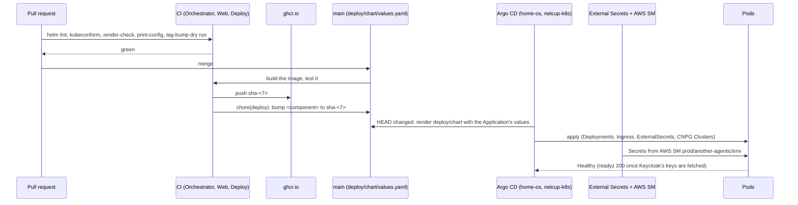
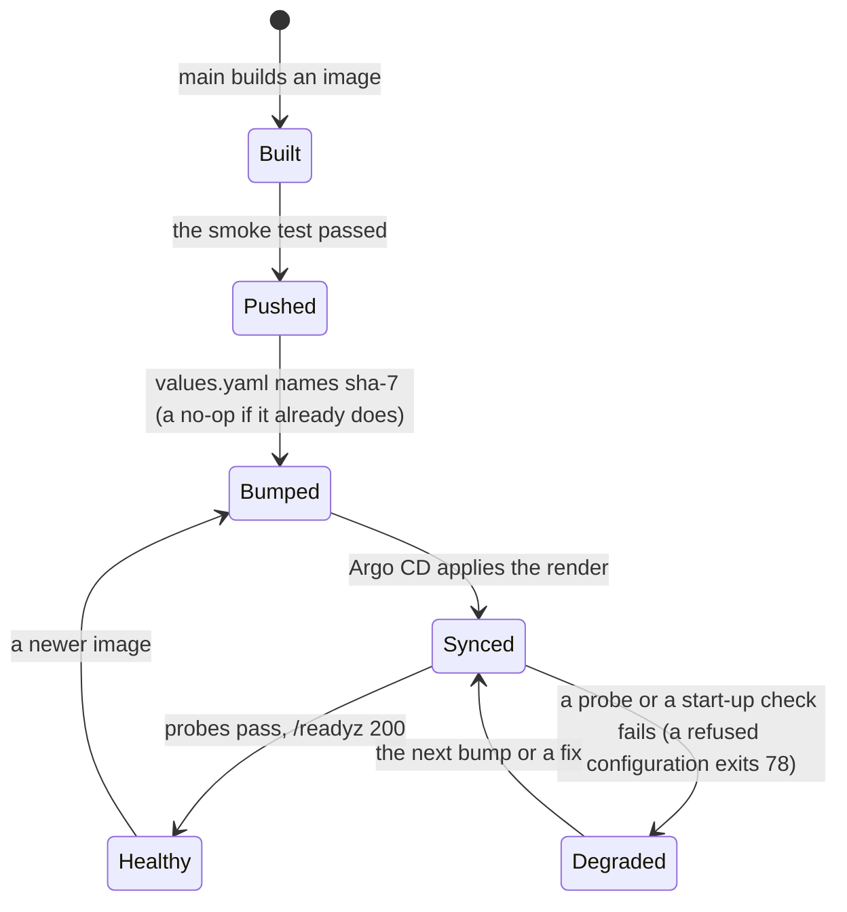

# ADR 0041 — Deployed with Helm on Kubernetes; secrets by ExternalSecret

- **Status:** accepted (2026-10-03), on the owner's answers of 2026-10-03 ("your recommendations are fine; only the
  domain shall be `agentic.servers.segning.pro`"), to the plan of the same day: a real production deployment on the
  netcup cluster, with real sign-in and the secrets kept the way the ARC runners' are. The details (what is in v0, the
  shape of the chart, the edge) are the planner's and the owner may revisit them. Numbered after ADR 0039 (nobody
  reads another person's thread) and ADR 0040 (sharing), which are in review: this ADR does not depend on their text, but
  production must not run before 0039 lands (see *Consequences*). Extends [ADR 0033](0033-the-orchestrator-is-an-oauth2-resource-server.md)
  (the edge and the sign-in, built for the dev stack, are now also a deployment) and
  [ADR 0034](0034-one-yaml-configuration-secrets-by-reference.md) (secrets are references; here is what they point at).
  Invariants 1 and 3 hold: protocols only (the chart names agents by card URL and models by one endpoint), and the
  processes are stateless (the event log is in Postgres; the one volume is the artifact store of
  [ADR 0032](0032-files-from-agents-live-in-an-artifact-store.md)). Amended (2026-10-04): the owner decided that the production gateway's address is kept in the same AWS secret, next to the model's key. A further property `model_base_url` is read, only with `model.baseUrlFromSecret: true` (off by default), by the orchestrator (a file, `baseUrl: { file }`, [ADR 0035](0035-utility-model-tasks.md)) and by the chat agent (a `secretKeyRef`), one property for both sides. It is turned on only once the pinned orchestrator image reads `{ file }` there; CI checks that by itself (`deploy.yml`). Amended (2026-10-04): the owner decided **one CNPG cluster with three databases** instead of one cluster per agent: the orchestrator keeps its cluster `another-agentic-db` and its database `orchestrator` (so its data survives), the chat agent's run store is the database `agent` and the coder's, with `sharedDatabase.coder.enabled`, the database `coder`, each owned by a CNPG managed role of its own (`spec.managed.roles`) with a `Database` object, the role's password a property of the AWS secret (`agent_db_password`, `coder_db_password`) that an ExternalSecret templates into a `kubernetes.io/basic-auth` Secret that also holds the connection `uri`. The chat agent's own cluster `another-agentic-chat-db` is no longer rendered and its data is not migrated (a few hours old; losing it is accepted); `chat.database.*` is removed. The password still passes through no Helm value. Details and what is unverified: `deploy/chart/README.md` ("One database cluster").

## Context

The owner, 2026-10-03: "real prod (External secrets, ...) and clean (GitHub App, ...) deployment, and inviting some users to
test and ensure RBAC works, messages are split per user". Until now the system runs only in `compose.yaml`, on dummy
secrets, behind a mock issuer. Facts the decision stands on:

- **home-os** (*verified 2026-10-03* by reading its clone at `18acd3f`): "the ARC runners' mechanism" is External Secrets
  Operator, `ExternalSecret`s of `external-secrets.io/v1` on the `ClusterSecretStore` **`ssegning-aws`** (AWS Secrets
  Manager, `eu-central-1`), one remote key per AWS secret and a `property` per value
  (`charts/cd/templates/arc-runner-pools.yaml`). An application's chart lives **in the application's repository** and Argo CD
  tracks `HEAD` there, because home-os `main` is PR-only and no CI can write an image tag into it (`ssegning-com`, `vaam`:
  `deploy/chart`, CI bumps `image.tag` on green `main`). Traefik on netcup is a DaemonSet with host ports 80 and 443, its
  Gateway API provider is off, so a route is an `Ingress`; `cert-cloudflare` is a DNS-01 `ClusterIssuer`; CloudNativePG and
  Longhorn run there.
- **adam-rs** (*verified 2026-10-03*, `origin/main` at `3f109df`): the coder has its own chart, `deploy/coder`, written for the
  namespace `another-agentic-system`, with a CNPG database, an `ExternalSecret` on the same store, `github.auth: app` and a
  tag bump on green `main`. This ADR copies its patterns and does not deploy the coder.
- **This repository** (*verified 2026-10-03*): the images `ghcr.io/vymalo/another-agentic-system/{orchestrator,web}` are
  pushed from `main` as `sha-<7>` and `latest` and pull anonymously (the registry's token API, HTTP 200); the repository is
  public, so Argo CD needs no credential. The published web image was built **without** `NEXT_PUBLIC_SIGN_IN_PATH`, which
  Next inlines at build time: in a deployment a 401 would be an error line, not a redirect to sign in.
- **Keycloak**: realm `vymalo` at `https://auth.verif.fyi/realms/vymalo` on the `home-remote` cluster, with no client
  declared in git. The operator's `KeycloakRealmImport` only creates a realm and does not update one (*verified 2026-10-03*,
  <https://www.keycloak.org/operator/realm-import>), so the client is made by hand.

## Decision

**1. A Helm chart in this repository, `deploy/chart`, Argo CD in home-os.** The chart is read from git (not published as an
OCI chart): Argo CD tracks this repository's `HEAD` at `deploy/chart`, the Application and its values (`host`,
`auth.issuer`, the model) are declared in home-os, and CI writes the image tags into `deploy/chart/values.yaml` after each
image is pushed. The coder stays in adam-rs's chart and is named here only by its card URL.

**2. What v0 deploys** (one namespace, `another-agentic-system`): the orchestrator as **one process, role `all`**, one replica,
`Recreate`, its files in a directory store on a ReadWriteOnce volume; the web; **oauth2-proxy** (provider
`keycloak-oidc`) and a **Caddy edge** on one origin (the Caddyfile of `dev/Caddyfile`, which was verified on containers in
ADR 0033 S16, with the changes a deployment needs); a Traefik `Ingress` with a `cert-manager` issuer named by a value
(`cert-cloudflare`); a CloudNativePG `Cluster`; the **chat** agent (`adam-agent` over a folder rendered into a
ConfigMap, with its own `Cluster`). Surfaces are `agui` and `thread-tools`: no `/mcp`, no webhooks. The edge answers
`/thread-tools/*` with 404, because the agents reach it inside the cluster; the pods' probes use `/healthz` and `/readyz`.
Not in v0 and why: [`deploy/chart/README.md`](../../deploy/chart/README.md#not-in-v0).

**3. The chart cannot render a development deployment.** `server.environment: production`, `auth.mode: jwt` and
`defaultRole: null` are written in the template, not values. `host` and `auth.issuer` have no default, and
`templates/_validate.tpl` refuses: a missing or malformed host or issuer (an `http://` issuer, a trailing slash), a role
whose `scope` is `any` (nobody reads or acts on another person's thread), a surface the edge does not route, a first-party
image whose tag is not `sha-<7 hex>`, a third-party image without a digest, an agent whose bearer has no AWS property, and a
chat agent without a model. The model is a value: the chart names none.

**4. Secrets come from AWS Secrets Manager through External Secrets, one AWS secret for this deployment.**
`ExternalSecret`s on `ClusterSecretStore` `ssegning-aws`, remote key **`prod/another-agentic/env`** (a new secret, its own
blast radius and rotation, rather than more properties on `prod/meta/test-app`), one JSON property per value. Each consumer
gets a Kubernetes Secret of its own with only what it reads: the orchestrator (`thread_tools_secret`, `model_api_key`, one
bearer per agent), oauth2-proxy (`oauth2_client_secret`, `oauth2_cookie_secret`), the chat agent (its bearer and the
model's key). A secret reaches the orchestrator as a **file** (`{ file: }`, mode `0440` with an `fsGroup`) or an
environment variable (an agent's bearer: the agents file has only `tokenEnv`), the database URL as the file `uri` of
CNPG's `<cluster>-app` Secret (the chat agent's and the coder's, since the amendment of 2026-10-04, the key `uri` of a Secret that an
ExternalSecret templates from the role's password), so no password passes through Helm. The bearer of an agent is **one AWS property** read by
both sides (the orchestrator and the agent's own chart), so the two cannot differ. Nothing secret is in the chart, its
values or its render: `tests/render-check.sh` asserts no `Secret`, no token-looking string, no literal value on a
secret-named variable and a reference where the configuration has a secret key. The Keycloak client id is a value (it is
the `aud` of the tokens and in oauth2-proxy's role flag), not a secret; its secret is the AWS property.
The pods read their secrets once, at startup (ADR 0034): the pod template carries a checksum of the rendered
ExternalSecret, which changes when its shape does and **not** when a value does, so a rotation is a
`kubectl rollout restart`, documented.

**5. Images are pinned.** First-party images by the commit that built them (`sha-<7>`, bumped by a job at the end of
`orchestrator.yml` and `web.yml` on `main`, after the image is pushed; the pattern of adam-rs's `coder.yml`); third-party
images (oauth2-proxy, Caddy, the adam image of the chat agent) by tag **and** digest, as `compose.yaml` pins them. Never
`latest`. **`web.yml` now builds the pushed image with `NEXT_PUBLIC_SIGN_IN_PATH=/oauth2/start`.**

**6. The Keycloak side is made by hand and kept as exports without secrets**, [`deploy/keycloak/`](../../deploy/keycloak/README.md):
the confidential client `another-agentic` (standard flow, PKCE `S256`, no direct grants, a 15-minute access token) with
an audience mapper and a flat claim `agentic_roles` of its client roles; the roles `user` and `admin`; the groups
`agentic-testers` and `agentic-admins`; and a public `another-agentic-cli` client for the device grant. A person is invited
by being added to a group with **Email verified on**.

**7. CI.** The `Deploy` workflow runs `helm lint`, `helm template` and `kubeconform` (core kinds against the Kubernetes
schemas, the CNPG `Cluster` and the `ExternalSecret` against pinned CRD schemas copied from adam-rs, and the CNPG `Database` from the same catalog commit), `render-check.sh`
(more than a hundred assertions, the refusals included), the rendered configuration read by **the orchestrator image the chart
deploys** (`orchestrator --print-config`: no connection, dummy secrets), `shellcheck`, the bump script's tests, the Keycloak
exports checked for a secret, and a dry run of the bumps on pull requests.

## Consequences

- A person can be invited by a group membership, and what they may do is the orchestrator's decision on a token it
  validates itself; the edge only decides who gets a session.
- **Production must not run before ADR 0039 lands.** The chart already refuses `scope: any` in `auth.roles`, and renders
  `scope: own` for `admin`, so the administrators' listing (`?owner=*`) and reading another person's thread are refused
  (*unverified*: read from [`config.md`](../api/config.md#roles-and-permissions), where the `admin` permission "also takes
  `thread.read` of scope `any`"; the orchestrator of `sha-d44f285` was not run with these roles). Once 0039 removes the
  key the validation is redundant and stays as a second wall.
- One more small pod, the edge, instead of Traefik middlewares. The wiring is the verified one (the request buffering that
  fixed a streaming bug, the replaced `Authorization`); a Traefik-native edge is a possible simplification once its
  behaviour on those two points is verified.
- An orchestrator upgrade is a restart of a pod that holds open streams: they end and the web reconnects with
  `Last-Event-ID`. One replica means a short gap while it restarts (`Recreate`).
- The chart is the only place a deployment's shape is written. The ARC mechanism is mirrored and not shared: the AWS
  secret is new, so the owner creates it before the first sync.
- Backups, S3 for artifacts, a split into roles, metrics, the share routes of the edge and the MCP and webhook
  surfaces are later PRs.

## Verified and unverified

*Verified 2026-10-03:* the home-os and adam-rs facts above (their clones); the registry digests of oauth2-proxy
`v7.15.5-alpine` (quay.io registry API) and Caddy `2.11.4-alpine` (Docker Hub and `mirror.gcr.io` agree); the anonymous pull
of the orchestrator and web images and their newest tags (`sha-d44f285`, `sha-3165508`, equal to `latest`); every flag the chart
gives oauth2-proxy exists in `--help` of the pinned image, which runs as 65532, read-only, with no capability; the rendered
Caddyfile passes `caddy validate`, and the pinned Caddy serves it as 65532 with a read-only root, dropped capabilities and
`no-new-privileges` only with `NET_BIND_SERVICE` added (without it `exec /usr/bin/caddy: operation not permitted`);
`orchestrator --print-config` accepts the rendered configuration (a local debug binary; CI reads it with the deployed image) and refuses
an agent whose gate requires `ci`; `kubeconform` finds the 25 rendered resources valid.

*Unverified (the owner or the first sync shows it):* that netcup serves a public port 443 at all (no public host has
ever been served from it, plan risk R1); that `cert-cloudflare`'s token can edit the zone `segning.pro`; that the Keycloak
JSON imports as written (the shape follows Keycloak's realm export, no Keycloak was run) and that oauth2-proxy's
`keycloak-oidc` refresh re-issues an ID token it then forwards; that the `web` and `chat` images run with the
security context the chart sets (`web` has a read-only root; the chat agent's root is writable); that CNPG's `uri` key
is what the pods read; the sizes in the values (starting points); that `main` accepts the bump's push from
`github-actions` in this repository; that Traefik's `X-Forwarded-*` reach Caddy as the `trusted_proxies` line assumes.

## Alternatives rejected

- **A published OCI chart.** Argo CD reads the git path as `ssegning-com` does: no chart release flow, and the tag bump
  stays a one-line edit. Cost: a chart change is a git change, which is what a PR is.
- **Argo CD Image Updater.** home-os has it for other apps; the newer pattern there is a CI bump in the application's
  repository, which is what this follows.
- **A Traefik `ForwardAuth` + `errors` middleware edge** (the `redis-ha` precedent). It could replace Caddy; its handling of the
  replaced header and of request bodies on the streaming routes would be new and unverified on the path every request takes.
- **More properties on `prod/meta/test-app`.** A smaller blast radius and an independent rotation are worth one more AWS secret.
- **A plain Kubernetes `Secret` in the chart, or sealed secrets.** Not the mechanism the owner named, and a value in git.
- **Realm import by the Keycloak operator.** It does not update a realm that exists.
