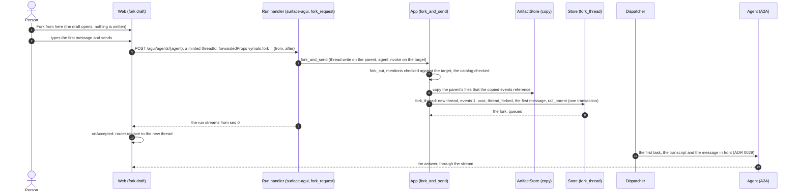
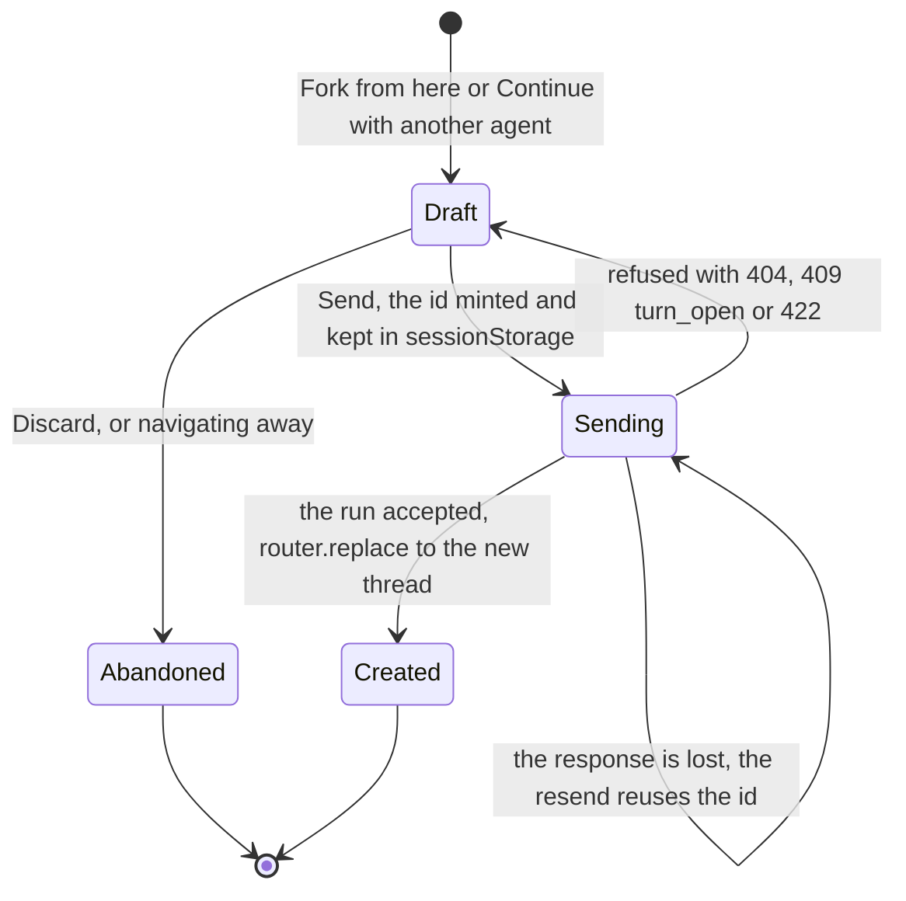

# ADR 0042 — The thread list is the owner's: pin, archive, order and nesting on the row; a fork is made by its first message

- **Status:** proposed (2026-10-03), on the owner's words of the same day:

  > - forking a thread should produce a new thread but on UI only, with a special ID, something like `fork:<old-thread-id>`
  >   and when the message is gone, it becomes `<new-thread-id>`. It'll help avoid the situation where a user clicked on fork
  >   and then forgot why
  > - it should be possible of archiving or deleting thread via a small context menu appearing via a 3-dota vertical icon
  >   button that appears on hover of the menu item. That menu should also include "Pin"
  > - on successful fork, it should not display the thread normally in the left rail, it should use kind of a three
  >   structure so that the parent is the main path. And in the menu of a child, we could have "Eject from parent" to do
  >   what the name describes.
  > - the left rail menu items should be drag and drop able, a parent drags the whole block.

  "When the message is gone" is read as "when the first message is sent" (a lazy fork: nothing exists until then).
  **Nothing of this is built:** every name below (columns,
  ports, routes, members, files) is what the plan of the same day says will exist, and the owner has not seen the decision.
  The details the owner did not state (one level of nesting, the sections, the key construction, the permission, the routes)
  are the planner's, taken as defaults unless the owner says otherwise (*Open for the owner*, below). Deleting a thread is its
  own decision, [ADR 0043](0043-deleting-a-thread-erases-it.md). Extends [ADR 0029](0029-forking-a-thread-copies-its-log.md)
  and amends the wording of invariant 3 and of [ADR 0001](0001-rust-state-machine-on-postgres.md) (decision 1).

  Status note (2026-10-03, later): **decisions 8 and 9 are built on the backend** (not the web, not the columns of decisions
  1 to 7): `forwardedProps["vymalo.fork"] = {from, after}` on the AG-UI run that creates the thread
  ([`agui.md`](../api/agui.md#a-fork-made-with-its-first-message)), `forkThread` with `after` and `text`
  ([contract](../api/chat-api.yaml)), `ForkAt::AfterTurn { seq, first }` and `App::fork_and_send`, and `Replacement` carrying the
  mentions, the run id and the origin so that `fork_commit` makes the fork and its first message in one commit. The resend rule
  of decision 9 is `is_fork_at` plus the first message's ids: the fork cut where `after` cuts that holds this very message is
  the replay; any other thread with the id is a 409, and one that is somebody else's a 404. `dev/fork-e2e.sh` reads it on the
  compose stack (unrun here). The `rail_parent` of decision 3 is not set yet: it comes with the columns.

  Status note (2026-10-03, later still): **decisions 1 to 7 and 10 are built on the backend** (not the web, not the draft page of
  decision 8): migration `0016_thread_rail.sql` (the four columns, the backfill, `threads_rail_shape` added `NOT VALID` and
  validated, the two partial indexes), `orch_core::rank` (`between`, `spread`, the cap of 128, property tests), `ThreadListing`
  (`order`, `archived`) and `ThreadStore::arrange_thread` with `Arrangement` and `Place` on the memory and the Postgres store
  (the conformance cases run on both, the re-spread among them), `NewThreadRecord.rail_parent` set by both fork paths
  (`rail_parent_of_fork`), `App::arrange_thread`, `PATCH /api/threads/{id}/rail`, `listThreads` with `order` and `archived`
  ([contract](../api/chat-api.yaml)), and `dev/rail-e2e.sh` (unrun: no Docker where it was written). The details the decision left
  open, as built: a nested thread cannot be pinned (`422 nested_row`, like a placement); an anchor's neighbours are read in the
  anchor's own section, so a pinned thread never shares a gap with an unpinned one; a thread that is nested or made by an edit takes
  the rank of the first thread and burns no key; a fork of an **archived** row is a top-level thread (nested under it it would be out
  of sight in the archived block); eject puts a thread right after its former block, or on top of the unpinned when that block is
  pinned or archived; the children of an archived thread are archived with its block, not by their own `archived_at`; unarchive keeps
  the place; `nested: true` is a `422` with no code. Reader projections stay an allow-list and a test asserts that `pinned`,
  `archived` and `nestedUnder` are not in one. Still unbuilt: decision 8's draft page and every web part, and the ADR is still
  *proposed*.

## Context

What exists (*verified* 2026-10-03 by reading the code at main plus the sharing backend, `4d9abeb`; nothing was run):

- **The list has no organisation.** `list_threads` orders by `id DESC` and pages on `before=<id>`, hiding `fork_kind='edit'`
  rows. The web groups the same rows by `updatedAt` (Today, Yesterday, …), which disagrees with the server's order by
  creation. There is no pin, no archive, no way to move a row, and a fork is listed like any other thread.
- **A fork is made at once.** `useFork` in the web `POST`s `/api/threads/{id}/fork` and pushes the new thread. A person who
  clicks "Fork from here" and thinks better of it leaves an empty thread in the list. An edit is already atomic:
  `fork_thread` takes `ForkAt::Replace { seq, text, message_id }` and `fork_commit` applies the replacing message through
  `transition` in the one store transaction. A fork `after` a turn has no message.
- **A thread can already be created lazily.** The new-chat page mints a UUIDv7 and sends `POST /agui/agents/{agent}`; the run
  handler's `None` arm creates the thread, and `forwardedProps["vymalo.tools"]` is already "applied only on the run that
  creates the thread". A `vymalo.fork` member follows that precedent.
- **`ForkRequest.id`** (a UUID the client chooses) already makes a fork idempotent: the same id answers `200` with the fork
  it made.
- **`threads.forked_from`** is `ON DELETE SET NULL` (migration `0010`): a fork stands alone, so a nesting that follows it must
  too.
- **The sharing views are an allow-list** (`reader_thread`, [ADR 0040](0040-thread-sharing-by-revocable-link.md)): a new
  column of the row cannot reach a reader unless someone adds it there.

What the owner asks for is a list a person arranges: a lazy fork, a menu on the row, a tree of forks, and an order the person
sets by hand. Three questions need a decision: where the arrangement lives (the log or the row), what the tree is, and how a
fork gets its first message without a second write.

## Decision

1. **Where the state lives: on the thread row, with no event in the log.** Pin, archive, order and nesting are columns,
   written by plain row updates. The log is the conversation: it is copied into forks, carried by the export and served to the
   readers of a shared thread, and none of them may see the owner's pins or inherit them. Title, description and sharing are
   in the log because they describe the conversation or audit a disclosure; arranging one's own list does neither. A thread
   table rebuilt from the log alone would lose this state and fall back to "unpinned, unarchived, top level, newest first",
   which fails safe. **This amends ADR 0001 and invariant 3** with a dated note: the thread row also keeps the owner's
   organisation of their list, which no event records. *Rejected:* a `thread_arranged` event (it leaks into shares, forks and
   exports, and grows the log with every drag); a per-user preferences table (a second store of the same rows, with no gain
   while the owner is the only person who sees a row).
2. **Columns** (migration `0016_thread_rail.sql`; renumbered if another change takes `0016` first): `pinned_at timestamptz`,
   `archived_at timestamptz`, `rail_parent uuid REFERENCES threads ON DELETE SET NULL` (the row it is nested under) and
   `rail_rank text COLLATE "C" NOT NULL` (a fractional key, one key space per owner). The migration backfills the ranks from
   today's order and the nesting from `forked_from`. No event kind changes, so no rollout order is needed.
3. **The tree is one level deep.** At fork time `rail_parent` is the row the person sees: the parent when it is a top-level
   row; the parent's own `rail_parent` when the parent is nested (a fork of a fork is a sibling under the same root); the edit
   family's root when the parent is an edit branch (edit branches are not listed). The lineage stays in `forked_from` and in
   the "Forked from …" divider ([ADR 0029](0029-forking-a-thread-copies-its-log.md)). A block is always one root and a flat
   list of children, and "a parent drags the whole block" has one meaning.
4. **Eject from parent** sets `rail_parent` to null and puts the row right after its former block. `forked_from` is untouched:
   ejecting is display grouping, not history. **Nesting by dragging is not built** (the owner did not ask for it): dropping a
   row on another row only reorders.
5. **Order.** Top-level rows are ordered by `rail_rank, id DESC`. A new thread is ranked before the owner's current minimum, so
   it goes on top. **Activity does not reorder rows**, or a manual order would mean nothing. The recency groups (Today,
   Yesterday, …) are removed: the list becomes three sections, **Pinned** (manual order), **Chats** (manual order) and
   **Archived** (collapsed, at the bottom, loaded on demand, ordered by `archived_at DESC`, not draggable). Pin moves a row to
   the top of Pinned, and unpin to the top of Chats, each with a new rank before the target section's minimum. Children are
   ordered by creation, newest first. Only top-level rows move, and a parent carries its block.
6. **Which rows a command acts on.** Pin and Archive act on the block: a child is shown in the section of its root. Pin is not
   offered on a child ("Eject from parent to pin it"). Archive on a child archives that child alone; it shows in Archived and
   returns under its parent when unarchived. **Archiving does not touch a share:** the link keeps working and the share badge
   stays visible in Archived; revoking is a separate act of one click (*Open for the owner*, 1).
7. **Ranks are a pure module** (`orch_core::rank`): `between(Option<&str>, Option<&str>) -> Result<String, RankError>`, alphabet
   `0-9a-z` compared bytewise, no key ending in `0`, at most 128 characters. A key that would be longer makes the store re-spread
   the owner's top-level ranks in the same transaction. **The server computes the key from an anchor id**; the client sends
   `before`, `after` or `top`, never a key. Two tabs moving rows at once can end with equal keys: `id` breaks the tie and
   nothing errors. An anchor that is gone, nested or archived is `422 bad_anchor`, and the web re-reads the list.
8. **A fork is made by its first message.** "Fork from here" and "Continue with another agent" open a client-only draft at
   `/threads/fork:<parentId>?after=<seq>[&agent=<id>&release=<r>]`, and nothing is written. The send is
   `POST /agui/agents/{agent}` with a minted `threadId` and `forwardedProps["vymalo.fork"] = {from, after}`: the app copies the
   parent's files the copied events reference ([ADR 0032](0032-files-from-agents-live-in-an-artifact-store.md), note of
   2026-10-03), then makes the fork and its first message in **one** store transaction (`fork_thread` with a `Replacement`,
   as an edit already does), then the run streams. The web then calls `router.replace('/threads/<newId>')`, so Back does not
   return to the draft. Abandoning the draft leaves nothing. *Why AG-UI and not a REST `text`:* the first message of a fork
   must carry the UI catalog in full ([ADR 0029](0029-forking-a-thread-copies-its-log.md), decision 3) and the person's
   mentions, which the AG-UI run already carries. REST `forkThread` also accepts `after` with `text` and `messageId`, with no
   mentions or catalog, for scripts and symmetry; the immediate fork without `text` is kept for compatibility and the web stops
   using it. Edits are already atomic and do not change.
9. **What survives a reload of a draft.** The URL does: it holds the parent, the cut and the target. The **minted id** is kept
   in `sessionStorage` under `fork:<parent>@<seq>`, so a resend after a lost response reuses the id. The server answers a run
   whose `threadId` is already a fork of the same `from` and `after` by the person who sent it as the replay of the fork it
   made (it attaches to its stream and writes no second message, the way `ForkRequest.id` answers `200` with the fork it made);
   any other existing thread with that id is `409`. The typed text is not kept, as on the new-chat page. *The replay is the
   planner's detail; the plan said "attaches to the fork that was already made" and gave the member a `409` on an existing
   thread, which this reconciles.*
10. **Permissions.** Pin, archive, order and eject need ownership and `thread.read`, not `thread.write`: they change nothing in
    the conversation and nobody else sees them, the way revoking a share needs only ownership. The lazy fork needs `thread.write`
    on the parent and `agent.invoke` on the target. *Recommended; the alternative is `thread.write` for the arrangement too.*

### The lazy fork

The draft holds no row, so a reload keeps it (the URL) and abandoning it costs nothing. `Sending` is the only state in which
anything is written, and it writes the fork and its message together or neither. The resend that reuses the id lands on the
fork the first attempt made (decision 9), never on a second one.

### The API this decides

The contract is `docs/api/chat-api.yaml`, mirrored in `docs/api/agui.md`; it changes in the pull requests that build this.

- **`runAgent`:** a new `forwardedProps["vymalo.fork"]: {from: uuid, after: int}`, read only when the run creates the thread.
  It needs `thread.write` on the parent and `agent.invoke` on the run's `agentId`. Errors: `404` for a parent that is not the
  caller's, `409 turn_open`, `422` for a seq outside the log, `400` together with `vymalo.gate` or `vymalo.tools` (a fork has
  the deployment's gate and its parent's tools, ADR 0029). `vymalo.mentions` and `vymalo.uiCatalog` apply to the first message.
- **`forkThread`:** `after` may come with `text` (and `messageId`); the fork is then `queued` and holds `thread_forked`
  followed by the message.
- **`listThreads`:** `order` is `recent` (the default, today's `id DESC`) or `rail`; `archived` is `exclude` (the new default),
  `only` or `include`. With `order=rail`, `limit` counts top-level rows, each followed by its non-archived children, and
  `before=<id of the last top-level row>` stays the cursor, so a page never splits a block. `archived=only` returns archived
  roots by `archived_at DESC` with their children, plus archived children whose root is not archived.
- **`Thread`** gains `pinned?: true`, `archived?: true` and `nestedUnder?: uuid`. Only the owner's routes and the export serialise
  them; `reader_thread` stays an allow-list, with a test that asserts they are absent.
- **`PATCH /api/threads/{id}/rail`** (`arrangeThread`): `{pinned?, archived?, nested?: false, place?: "top" | {before} | {after}}`,
  at least one member, an unknown member `400`, `nested: true` `422` (nesting by drag is not built). Placing a nested row is
  `422 nested_row`; a bad anchor `422 bad_anchor`; another person's thread `404`. It returns the `Thread`; a change to the
  state a row already has is `200` and writes nothing. *A route of its own rather than members on `patchThread`:* no log event,
  a different permission, one row update instead of a commit.

## Consequences

- **Easier:** a person arranges the list the way it is read; a fork is never left empty; forks sit under their parent; the log,
  the export and the shared view are unchanged by any of it.
- **A rebuild from the log loses the arrangement** (decision 1). Backups of the row are the only copy, and a restore from the log
  alone gives the safe default.
- **The recency groups go.** A visible change, recorded in `web/DESIGN.md` and in the screens when it is built (*Open for the
  owner*, 2).
- **The server's order and the web's now agree**, because both are the rank.
- **A new column is not a new leak** only while `reader_thread` stays an allow-list; the test of the API section keeps it so.
- **A fork's files must be copied first** ([ADR 0032](0032-files-from-agents-live-in-an-artifact-store.md), note of 2026-10-03),
  or a fork's inherited files 404 and a deleted parent ([ADR 0043](0043-deleting-a-thread-erases-it.md)) would take them.
- **Two `ThreadAgent`s on the draft page** (one replays the parent and stops, one sends under the minted id) may fight
  assistant-ui's runtime. The web PR starts with a spike; the fallback is a read-only parent and a plain composer that submits
  and then navigates.
- **Drag and drop uses `@dnd-kit/react` pinned to exactly `0.5.0`**, imported by one file; the fallback is `@dnd-kit/core` 6.3.1
  with `@dnd-kit/sortable` 10.0.0. The keyboard path is the menu's Move up, Move down and Move to top (WCAG 2.5.7) and
  Alt+ArrowUp/Down on a focused row; the library's own `KeyboardSensor` is not used on the row because its Enter would clash
  with the link's.

## Alternatives rejected

- **An event for each arrangement** (decision 1), **a per-user table** (decision 1).
- **Activity-ordered rows with the manual order as an override.** The order would change under the person's hand.
- **The full lineage as the tree.** A fork of a fork of a fork becomes a staircase in a narrow rail; one level keeps a block
  a flat list, and the lineage is still in the divider.
- **Nesting by drag.** The owner did not ask for it, and "drop on a row" would then mean two things.
- **Client-computed rank keys.** Two clients would have to agree on an alphabet and a cap; the server owns both.
- **A REST-only lazy fork** (a `text` on `forkThread` as the web's path). The first message would need the catalog and the
  mentions duplicated outside the AG-UI run.
- **Immediate fork, with the draft being the fork.** An abandoned draft is a thread in the list; that is what the owner
  asked to end.

## Open for the owner

Each has the planner's recommended default, **taken unless the owner says otherwise**.

1. **Does archiving a shared thread stop its link?** Default: **no**. Archiving is tidying; the badge stays visible in
   Archived and revoking is one click.
2. **Should the list drop "Today / Yesterday / …" for Pinned / Chats / Archived in manual order, with new threads on top?**
   Default: **yes**; dragging inside date groups would mean nothing.
5. **Tree depth: one level (a fork of a fork becomes a sibling under the same root), or the full lineage?** Default: **one
   level**.
6. **Can dragging a row onto another row nest it, or move it between Pinned and Chats?** Default: **no** in the first build;
   Pin and Eject are menu actions.

(Numbered as in the plan's list of owner questions; 3, 4 and 7 are about deleting and are in
[ADR 0043](0043-deleting-a-thread-erases-it.md).)

## Facts

- **dnd-kit** (*verified 2026-10-03* on the npm registry and dndkit.com through Context7). `@dnd-kit/core` is 6.3.1, last
  published 2024-12-05, and `@dnd-kit/sortable` 10.0.0; the documentation files this line under "legacy". `@dnd-kit/react` is
  0.5.0, published 2026-06-11, peer React `^18 || ^19`, pre-1.0. Its `Accessibility` plugin is on by default (a live region
  announces drag start, over and end; screen reader instructions on the draggable by `aria-describedby`); its `KeyboardSensor`
  starts on Space or Enter, moves with the arrows and cancels with Escape; `useSortable({id, index, group})` exposes
  `handleRef`, and `isSortable(source)` gives `initialIndex` and `index` on drag end.
- **lucide-react 1.48.0** exports `EllipsisVerticalIcon`, `PinIcon`, `PinOffIcon`, `ArchiveIcon`, `ArchiveRestoreIcon`,
  `Trash2Icon` and `GripVerticalIcon` (*verified 2026-10-03* in the type declarations of a `node_modules`).
- **Whether Next.js 16 hands a `fork:<uuid>` path segment to `params` undecoded** (RFC 3986 allows `:` in a segment) is
  *unverified*; the web PR checks it, and the fallback is `/threads/fork-<uuid>`.
- **The code facts above** are *read in code on 2026-10-03, not run*.
