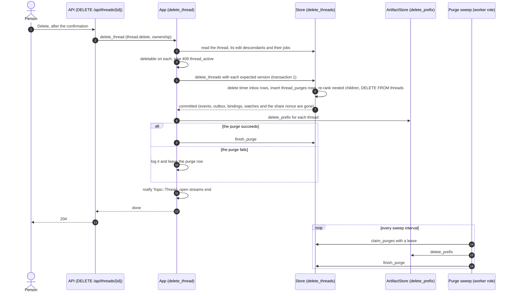
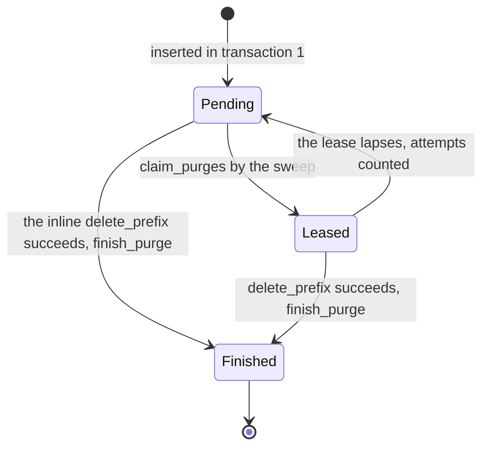

# ADR 0043 — Deleting a thread erases it

- **Status:** proposed (2026-10-03), on the owner's words of the same day: "it should be possible of archiving or deleting
  thread via a small context menu appearing via a 3-dota vertical icon button that appears on hover of the menu item. That
  menu should also include "Pin"", and, of the production deployment, "Admins shouldn't read every thread, it's dangerous
  and not GDPR compliant" (the reason deletion must erase, not hide). **Nothing of this is built:** every name below (the route, the permission, the table, the port methods, the
  sweep) is what the plan of the same day says will exist, and the owner has not seen the decision. Archive is the reversible
  act and is [ADR 0042](0042-the-thread-list-is-the-owners.md); this is the other one. What the owner did not state (hard delete,
  the refusal while a job runs, the permission, the order of the steps) is the planner's, taken as defaults unless the owner
  says otherwise (*Open for the owner*, below). It closes the deletion half of open question 46, keeps the rest open, and amends
  the "no deletion" paragraph of [ADR 0040](0040-thread-sharing-by-revocable-link.md) (*GDPR notes*) by a status note.

  Status note (2026-10-04): **decisions 1 to 7 are built on the backend** (decision 8, the fork's files, was built before them; the
  web is not: no menu, no dialog, no "Stop and delete"). Migration `0017_thread_purges.sql`; `orch_core::deletable`;
  `ThreadStore::delete_threads`, `claim_purges`, `finish_purge` and, an addition, `purges_pending` (the gauge) on the memory and
  the Postgres store, with ten conformance cases; `ArtifactStore::delete_prefix` on the memory, directory and S3 stores;
  `App::delete_thread`, `PurgeWorker`, `DELETE /api/threads/{id}` (`deleteThread`, [contract](../api/chat-api.yaml)), the
  permission `thread.delete`, `threads_deleted_total`, `thread_purges_pending` and `late_input_dropped_total`, and
  `dev/delete-e2e.sh` (**unrun**: no Docker where it was written). The details the decision left open, and where the build is not
  what the text says:
  - **The store refuses a delete that misses an edit.** A thread made by an edit from one that goes, and not named, is a
    `VersionConflict` and nothing is deleted: the app read the family, and an edit made since would be left with the log it was cut
    from gone and out of the person's reach. The app reads again, up to `max_commit_attempts`, then `503`.
  - **The children take the root's rank, not new keys.** "Re-ranked in the same transaction" is done as: a nested child becomes a
    top-level thread with the rank, the pin and the archive of the root it was nested under (an archive of its own stays), so the
    children keep their order, newest first, where the root was, and the rest of the list is untouched. Equal ranks are what
    the list already tolerates (ties by `id`); the next move among them re-spreads.
  - **The inline purge comes before the notification** (as the diagram has it), and a deployment with no artifact store
    (`NotConfigured`) has nothing to erase and finishes the row. The sweep has no configuration: a pass every 30 s, a lease of 120 s,
    16 threads a pass (`PurgeConfig`); a purge is never given up on.
  - **The S3 store lists and deletes one object at a time**, not by `DeleteObjects` batches: the bulk call is turned off for every
    compatible server's sake (it was for `delete`). A refused *listing* is reported by the library as a failed request, so it is
    `Unavailable` and not `Unauthenticated`; the sweep retries either way.
  - **The owner's stream now ends.** The decision said a follower that re-reads the row ends; the owner's stream (`events_after`) did
    not read the row at all, so it now looks for it when the log has nothing new, on a wake for its thread and at least every five
    seconds, and ends when it is gone. The shared stream already did.
  - **Late input.** A dispatcher worker whose result meets `NotFound`, or whose row went with the thread (the usual way: the next
    renewal of its lease finds none), and whose thread is confirmed gone, is dropped with a line and
    `late_input_dropped_total{source="dispatcher"}`; the title and description rows do the same; an inbox row whose commit meets
    `NotFound` is **finished as applied** (the inbox has no "dropped" status, and a deleted thread is not a failure to alert on) with
    `source="inbox"`. This changes what a timer for a thread that does not exist did (it was dead-lettered, "not found").
  - **The refusal names the ask.** `thread_active` is also given while an ask of the job runs, as decision 3 says, whatever the state.
  - **The dev stack enables sharing** (`sharing: internal` with a dummy `SHARING_SECRET`, `thread.share` in the roles) so that the
    scenario can show a link ending with its thread. The dev roles and the chart's list `thread.delete`; `config.md` says that a role
    written before it does not get it by itself, and that the people of a role that withholds it are erased by the operator.
  Still unbuilt: the web (the row menu, the dialog, "Stop and delete"), and the ADR is still *proposed*: the owner has not seen it.

## Context

What exists (*verified* 2026-10-03 by reading the code at main plus the sharing backend, `4d9abeb`; nothing was run):

- **There is no deletion:** no route, no store method, no button. `ArtifactStore` has `put`, `get` and `delete(key)`, and nothing
  calls the last. [ADR 0040](0040-thread-sharing-by-revocable-link.md) says a person who asks for erasure is served by the
  operator in the database, and that a deletion, when built, "revokes the link with the row and deletes the thread's events and
  its files". Open question 46 waits for it.
- **The row owns most of what a thread is.** `events`, `outbox`, `a2a_bindings` and `watches` are `ON DELETE CASCADE`
  (migrations `0001` and `0004`); `threads.forked_from` is `ON DELETE SET NULL` (`0010`), so forks already stand alone
  ([ADR 0029](0029-forking-a-thread-copies-its-log.md)); the share nonce is a column of the row. The `inbox` has no foreign
  key to `threads`: a timer row names the thread in its payload.
- **A cancel is a row, not a state.** Cancelling keeps the thread `working` and queues an outbox `cancel` row; the thread
  reaches `cancelled` only when the agent reports (`docs/orchestrator.md`). A delete right after a cancel would cascade the
  unsent `cancel` row away and leave the remote task working, perhaps pushing to GitHub.
- **Edits are hidden from the list** (`fork_kind='edit'`, ADR 0029): deleting only the visible root would leave conversation
  copies the person can no longer see or erase.
- **Files are keyed `threads/<thread>/<sha256>`**, and the projection builds a file's `href` from the copied event's own
  `thread_id`, which for a fork is the fork's id. Nothing copies the objects on a fork, so a fork's inherited files would
  `404` (*read in code, not run*). Deleting a parent is safe only after that is fixed.
- **Permissions** are `agent.read`, `agent.invoke`, `thread.read`, `thread.write`, `thread.share`, `artifact.read` and `admin`;
  `dev/orchestrator.yaml` lists each role's permissions, so a new permission does not appear by itself.

## Decision

1. **Hard delete.** `DELETE /api/threads/{id}` deletes the thread **and every thread made from it by an edit**, transitively.
   **Forks (`kind: fork`) are kept:** they are separate conversations (ADR 0029). Nested children take the deleted root's place
   in the list, in their order, re-ranked in the same transaction ([ADR 0042](0042-the-thread-list-is-the-owners.md)). The
   log keeps nothing: the events are deleted. *Rejected:* a soft-delete tombstone ("every query filters `deleted_at`" is
   invasive, and the data stays until a purge); a Trash with restore (Archive is the reversible act; *Open for the owner*, 3).
2. **The order of the steps, safe to retry.** *Transaction 1* locks the rows and checks each thread's `version`
   (`expected_version`, from the app's read), then deletes the timer `inbox` rows whose payload names the threads, inserts one
   `thread_purges(thread_id, deleted_at)` row per thread, re-ranks the nested children and runs `DELETE FROM threads`, which
   cascades the events, outbox, bindings and watches, and takes the share nonce with the row. *Then* `ArtifactStore::delete_prefix(thread)`
   runs inline and the purge row is finished. If the inline purge fails, a sweep on the worker role (a `SKIP LOCKED` claim with a
   lease, like the inbox) finishes it. Nothing can reference missing data: the log goes before the files, and `open_artifact`
   reads the row first. The API answers **`204` after transaction 1**; the files are gone at once, or within a sweep interval if
   the inline purge failed. A second `DELETE` is `404`.
3. **A running job is refused, with an offer.** Delete is `409 thread_active` while the thread is `queued`, `working` or
   `verifying`, or while its job has a running ask; the check is pure (`orch_core::deletable(state, &job)`). The web offers
   "Stop and delete": cancel, wait for a terminal state on the stream, then delete. A `blocked` thread can be deleted: its turn is
   over (ADR 0029). *Open for the owner*, 4.
4. **Shares end with the row.** The link is a `404` at once, because the nonce goes with the row. Open shared and owner streams
   end when their follower re-reads the row and finds it missing, and `notify(Topic::Thread(id))` is sent after the delete.
   This is the revocation [ADR 0040](0040-thread-sharing-by-revocable-link.md) promised for a deletion.
5. **Late input is dropped, not retried.** A dispatcher or inbox commit on a missing thread (`StoreError::NotFound`) finishes its
   row as dropped, with a log line and a counter; it is never retried and never a panic. That covers title and description rows,
   a late A2A update, and a parked CI report whose watch was cascaded (it expires as today).
6. **A permission of its own: `thread.delete`**, held by the built-in `user` and `admin` roles. A deployment can withhold it,
   for a legal hold for instance; people in such a role are erased by the operator, and `config.md` says so. Delete does not
   need `thread.write`: a person who may only read may still erase their own data. A deployment that lists its roles does not
   get `thread.delete` by itself; `dev/orchestrator.yaml`, the chart's values and the release notes say so.
7. **What stays out of reach, stated here and not promised away:**
   - the A2A agent's own store of its context (A2A defines no task deletion; *unverified*, to be checked against the
     specification);
   - the model provider that saw the conversation (open question 45);
   - backups, which keep a deleted thread until they expire (ADR 0040, *GDPR notes*);
   - in `agent-local` builds, adam's journal rows for the context, until adam-rs offers a purge by context (*unverified* that
     its `Store` can: issue #157 names only `purge_finished(agent, before)`; follow-up, open question 28).

   Tracing keeps only thread ids, never content. The counters are `threads_deleted_total` and `thread_purges_pending`.
8. **A fork copies its files before it commits** (a prerequisite, built first). A fork copies the parent's objects that its
   copied events reference into `threads/<fork>/` *before* `fork_thread` commits: files first, then the reference, as the
   ingest already does ([ADR 0032](0032-files-from-agents-live-in-an-artifact-store.md)). An orphan copy of a fork that failed
   to commit is deleted on a best-effort basis or left to the orphan sweep of question 46. *Rejected:* a global
   content-addressed store with reference counts (a new table and a collector); resolving a fork's files through `forked_from`
   (it breaks the moment the parent is deleted, which is what this ADR allows).

### The delete

A purge row is the promise that the files will go. It is written in the same transaction that deletes the log, so there is
never a thread gone with no row to finish it. `delete_prefix` is idempotent (a repeat returns `Ok(0)`), so an inline attempt
and the sweep may both run and nothing breaks. *Finishing a row removes it* (the table has no finished column, and
`thread_purges_pending` is its row count); the plan left this open.

## Consequences

- **Erasure exists** for a person's own threads, files included, with a stated list of what it cannot reach (decision 7). The
  invitation text of ADR 0040 ("a person who asks for erasure is served by the operator") can change when this is built.
- **A deployment's bucket stops only growing**, for what is deleted. Time limits, quotas per user or thread, and an orphan
  sweep stay open question 46.
- **A thread that works cannot be deleted in one click**; "Stop and delete" is the one click and it takes as long as the agent
  takes to report the stop.
- **A parent's deletion promotes its forks** in the list and breaks none of them, once decision 8 is built. It is built first,
  as its own change.
- **Two migrations in the plan** (`0016`, the list's columns, and `0017`, `thread_purges`, which has no foreign key); each is
  renumbered if another change takes its number.
- **Ports grow:** `ArtifactStore::copy` and `delete_prefix` (idempotent, with testkit cases: copy then delete the source leaves
  the copy; `delete_prefix` removes every key of the thread and none of another thread holding the same sha; a repeat returns
  `Ok(0)`; `NoArtifacts` refuses both), and on the store `delete_threads`, `claim_purges` and `finish_purge`, with cases run
  against the memory and the Postgres store (events, outbox, bindings, watches and timer rows gone; edits go and forks stay;
  another owner's thread is `NotFound` with nothing deleted; a version conflict deletes nothing; `thread_by_share_nonce` is
  `None` afterwards; a lapsed lease is reclaimed).
- **Copying files on a fork costs up to the parent's file bytes**, bounded per job (100 MiB, ADR 0032); the S3 copy stays on
  the server side.

## Alternatives rejected

- **Soft delete** and **a Trash** (decision 1).
- **Stop the job and delete in one request.** The `cancel` row is the only thing that stops the remote task, and it is what a
  cascade deletes; refusing and offering "Stop and delete" keeps the order explicit.
- **Delete the files first, then the rows.** A crash between them leaves a thread whose files `404`. The log goes first, so a
  crash leaves files with no thread, which a purge row finishes.
- **Cascade the forks.** A fork is a conversation of its own; erasing a conversation the person made on purpose, because its
  source went, is a surprise.
- **A sweep alone, with no inline purge.** The files would outlive a delete by an interval for no reason.

## Open for the owner

Each has the planner's recommended default, **taken unless the owner says otherwise**.

3. **Delete: immediate and permanent, or a Trash with restore for N days?** Default: **immediate**. Archive is the reversible
   act, and erasure argues against holding the data (a design reason, not legal advice: the reading of Article 17 is
   *unverified*, as in ADR 0040).
4. **Delete while the agent works: refuse and offer "Stop and delete", or stop and delete in one click?** Default: **"Stop and
   delete"** as a button in the dialog, which cancels, waits for the stop, then deletes.
7. **Who erases adam's local-agent journal for a deleted thread** (only `agent-local` builds, off by default)? Default: a
   follow-up issue on adam-rs for a purge by context, and this ADR states the gap (decision 7).

(Numbered as in the plan's list of owner questions; 1, 2, 5 and 6 are about the list and are in
[ADR 0042](0042-the-thread-list-is-the-owners.md).)

## Facts

- **A2A defines no task deletion:** *unverified* (not checked against the specification on 2026-10-03).
- **Whether adam-rs's `Store` can purge a journal by context:** *unverified*; issue #157 names only `purge_finished(agent, before)`.
- **A fork's files are never copied today:** *read in code on 2026-10-03, not run* (`ports/src/artifacts.rs`, the key;
  `agui-projection/src/projector.rs`, `FileRef::href`; `open_artifact`). The first change of the build is a failing test.
- **A cancel keeps the state and queues a row:** read in `docs/orchestrator.md` and the code on 2026-10-03.
