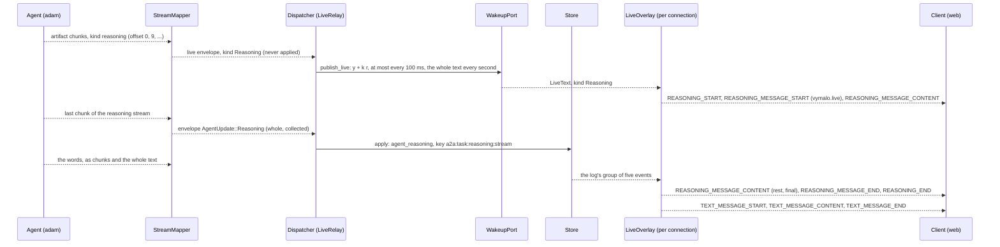
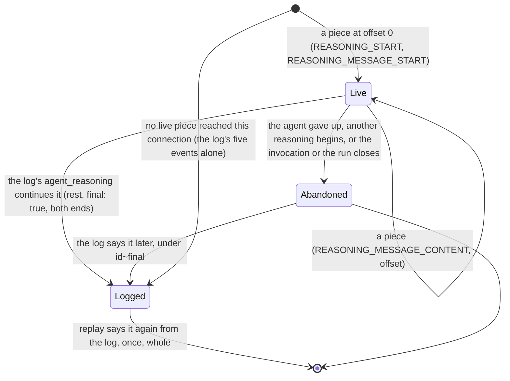

# ADR 0044 — A model's reasoning is shown beside the answer and logged once

- **Status:** accepted (2026-10-05), decided on the owner's delegation ("the owner sees no reasoning ("thinking") in the
  chat"); the owner may revisit. Extends [ADR 0027](0027-live-text-relayed-not-stored.md) (live text is relayed, not stored;
  reasoning is the second lane of the same relay) and [ADR 0012](0012-ag-ui-user-facing-protocol.md) (the projection, and the
  "Rejected: `REASONING_*`" bullet of [`agui.md`](../api/agui.md#the-agents-words), which this replaces). The contract it
  amends is [`text-stream-v1.md`](../api/text-stream-v1.md) (note of 2026-10-05, same change set), and the agent side is
  adam-rs ADR 0020 (`docs/decisions/0020-reasoning-is-streamed-beside-the-answer-and-never-stored.md` of `vymalo/another-adam-rs`).
  It adds to the log a kind the log did not have: the one deliberate change of the persisted model, and the reason for
  [migration 0018](../../orchestrator/crates/store-postgres/migrations/0018_reasoning.sql).

## Context

A model in thinking mode writes its reasoning before it answers. Nothing between the model and the person carried it: the
agent's model client dropped it, the A2A stream had no place for it, the log had no kind for it and the web had no block to
draw. The owner wants it on the screen as a **collapsed "Thinking" block above the answer, which streams while it is open**.

Facts the design rests on, each *verified 2026-10-05* from the page or the code named:

* **AG-UI 1.0 has reasoning events**, and the reference client reads them. Five events make one reasoning span, in this order
  (the order the verifier of `@ag-ui/client` 1.0.0 enforces: a `REASONING_START` while a span is in progress, a
  `REASONING_MESSAGE_START` while a reasoning message is, a `REASONING_END` with no span are errors, read from
  `tools/agui-conformance/node_modules/@ag-ui/client/dist/index.js`): `REASONING_START{messageId}`,
  `REASONING_MESSAGE_START{messageId, role: "reasoning"}`, `REASONING_MESSAGE_CONTENT{messageId, delta}`,
  `REASONING_MESSAGE_END{messageId}`, `REASONING_END{messageId}`
  (<https://docs.ag-ui.com/concepts/reasoning>). The client holds the result as a message of `role: "reasoning"`.
* **The web's runtime reads them.** `@assistant-ui/react-ag-ui` 0.0.62 maps `REASONING_*` to reasoning parts of the assistant
  message (read in `web/node_modules/@assistant-ui/react-ag-ui/dist`), so the block is a part, not a hack.
* **The agent side** (adam-rs ADR 0020): reasoning arrives as `text-stream/v1` chunks whose metadata entry says
  `"kind": "reasoning"`, in an artifact of its own named `reasoning`, and no whole text is ever stated for it. A reader that
  does not know `kind` would read those chunks as a reply: so the orchestrator is rolled out first (*Consequences*).
* **What a reasoning looks like in size.** A model that thinks for a minute writes a few thousand words. The live relay carries
  the stream like a reply's, bounded like it (64 KiB refresh, pieces of at most 6 KiB, [`text-stream-v1.md`](../api/text-stream-v1.md#5-what-the-orchestrator-does-with-a-chunk)).
  The log must not hold more than a bound that cannot fill it.

## Decision

1. **The log keeps a reasoning once, whole, bounded: `agent_reasoning`.** A new event kind, `data`
   `{messageId, text, truncated?}` (`orch_core::AgentReasoningData`, `core/src/reasoning.rs`). `messageId` is the **reasoning
   stream's id**, which is also the id of the live reasoning the screen showed, so the live one and the logged one are matched
   as a reply's are; it is never the id of an `agent_message`. The text is at most **32 KiB** (`MAX_REASONING_BYTES`),
   control characters other than newline and tab are dropped (Postgres refuses a NUL in JSON text), and **`truncated: true`
   says it is not the whole**: it was cut at the bound, a piece of it was lost, or the agent gave up in the middle. Absent
   when whole, never `false`. The core bounds it again (`bound_reasoning`): the door is checked at the door, whatever adapter
   sent it.
2. **The A2A adapter collects, the core records.** `orch-a2a-mapping` reads the chunks of a reasoning stream (`kind:
   "reasoning"`), maps each to a live envelope of kind `LiveKind::Reasoning` (never applied: relay only), collects them
   (the stream's beginning must have passed through the mapper, an overlap is trimmed, a gap or the bound marks it truncated, at
   most 8 streams at once) and, on the last chunk, maps the stream to **one more envelope**,
   `AgentUpdate::Reasoning { message_id, text, truncated }` under the idempotency key `a2a:<task>:reasoning:<stream>` (so a
   replay, a resubscribe and a poll collapse into one). `transition` turns it into the one `agent_reasoning`
   (`core/src/transition.rs`). A stream joined in the middle, or one that says only blanks, is relayed and **not logged**. A
   `kind` this reader does not know is ignored, never read as a reply.
3. **Reasoning is not the agent's words.** It is never an `agent_message`, never the turn's answer or working text, never the
   verifier's summary, never in the title's or the description's input, never in the conversation a fork continues
   (`core/src/title.rs`, `core/src/fork.rs`), and it settles nothing: the thread's state does not move for it.
4. **The live relay has a second lane.** `LiveChunk` and the wakeup port's `LiveText` carry a `LiveKind` (`Reply`, `Reasoning`;
   `Reply` by default), so a viewer never shows reasoning as the reply that is being written. The Postgres wakeup payload says
   a reply's text in `x` exactly as before and a reasoning's in **`y`** with `k: "r"`, so a replica that predates this change,
   which requires `x`, cannot read the payload and drops it, instead of showing it as a reply (the same rule as the agent's side
   of the wire: a new member fails closed). `LiveRelay` (`app/src/dispatcher/live.rs`) paces, refreshes and ends a reasoning stream
   as it does a reply's, and stops refreshing it once the log has said it.
5. **AG-UI: one reasoning span, in the protocol's order, before the turn's words.** The projector turns an `agent_reasoning`
   into the five events above, inside the open invocation (`subagentRunId` on each), **before** the text message of the turn
   (the agent ends its reasoning stream before its words begin, so the log holds it first), with the actor's metadata on
   `REASONING_START`; an open text message is closed first, since a span never opens inside one. A reasoning the log cut says it
   in its text, so a generic client shows it too: the last line is `[the rest of the reasoning was not kept]`
   (`REASONING_CUT_NOTE`). The id is a message id the thread holds (a client that sends its history back sends the reasoning, as
   `role: "reasoning"`, under that id, and the run input accepts it). The same reasoning twice (a duplicate delivery) is said
   once.
6. **Live reasoning is an overlay lane like live text, never a resume point.** `LiveOverlay` opens a reasoning on the first
   piece at offset 0 with `REASONING_START` + `REASONING_MESSAGE_START` (both marked `vymalo.live`), grows it with
   `REASONING_MESSAGE_CONTENT{metadata: {"vymalo.live": {offset}}}`, and **the log's `agent_reasoning` continues it**: its two
   `START`s are dropped, its `CONTENT` carries the words not yet said with `{offset, final: true}`, its two ends say
   `{final: true}` (the last one is the resume point). A reasoning that is given up, or still open when its invocation or the
   run closes, ends `{abandoned: true}`, and the log's reasoning for an id given up is said under `<id>~final`. The
   reasoning lane and the text lane are independent: both are open at once when the words began before the log said the
   reasoning (the web closes the block by itself then). Details and the table of frames: [`agui.md`](../api/agui.md#reasoning).
7. **A reader of a shared thread sees reasoning only where it sees step input and output.** It is the agent's working, not its
   words, and a model's reasoning may quote what it read: `agent_reasoning` follows `sharing.public.stepIo`, as the inputs and
   outputs of steps do ([ADR 0040](0040-thread-sharing-by-revocable-link.md)); where it is not allowed the event is projected
   inert (`app/src/reader.rs`). The owner sees it.
8. **The web draws a closed block.** A "Thinking" disclosure above the words of the turn, **closed until the person opens it**,
   with the shimmer of the starting line while the model is still writing, its text drawn as text (it is untrusted: no
   markup is read from it) in its own scroll, growing while it is open. It is a reasoning part of the runtime's message for the
   logged reasoning and a draft (like live text, `web/README.md`) for the live one; **an id the person opened stays open** when
   the log's text replaces the draft. See [`web/README.md`](../../web/README.md#thinking).
9. **The orchestrator never logs the text** (no tracing line at any level carries it). The agent's side logs how many
   characters at DEBUG, never the text. An MCP client's progress line (`surface-mcp`) and an asked agent's answer
   (`dispatcher/ask.rs`) ignore reasoning: they are for the agent's words.

## Consequences

* **Rollout order: this build first, the agents after.** An agent at an adam-rs revision with ADR 0020 sends `agent_reasoning`'s
  source chunks. A replica of the orchestrator that predates this change would drop the live piece (the payload rule above) and
  could not decode a logged `agent_reasoning`, so the migration and the build go first on every replica, then the agents.
  Nothing writes the new kind until an agent that sends reasoning is deployed. [Migration 0018](../../orchestrator/crates/store-postgres/migrations/0018_reasoning.sql)
  rebuilds the `events.kind` CHECK, as the earlier ones did.
* **The coder image pin has to move before the dev scenario can pass.** `dev/reasoning-e2e.sh` needs an agent that sends
  reasoning; the image pinned in `compose.yaml` predates adam-rs ADR 0020. Bump it (`bump-adam`) when that lands; until then
  the script fails with a message that says so, and so does `e2e-all.sh`.
* **An agent hosted in-process (`agent-local`, ADR 0015) sends none** until the pinned `adam-host` revision is bumped: nothing
  here changes it.
* **Breaking, additive on the wire.** `AgentUpdate`, `EventBody`, `EventKind` and `LiveKind`-carrying structs
  (`LiveChunk`, `LiveText`) gained a variant or a field: every `match` over them says what it does with reasoning (the
  compiler found each one). The event kind is the one visible change of the persisted model: an export, the API's `kind`
  enumeration (`EventKind` of [`chat-api.yaml`](../api/chat-api.yaml)) and a fork's reader all know it.
* **Size is bounded in three places**: the agent's chunks (adam-rs), the mapper's collection and the core's `bound_reasoning` (32 KiB
  each), and the overlay's per-message cap (as live text's: 256 KiB). A reasoning cut anywhere says so (`truncated`, the
  cut note).
* **Privacy.** Reasoning can quote what the model read. The owner and a reader allowed step input and output see it; the
  public link of a thread does not by default (decision 7). It is in the log, hence in an export and in a deletion's reach
  ([ADR 0043](0043-deleting-a-thread-erases-it.md): the thread's rows go with it). It is never sent back to a model by this layer
  (the orchestrator sends nothing of the log's reasoning to any agent: a fork and a continued thread carry the words only).
* **Not built here:** a setting to hide it by default, and the reasoning of an asked agent or of the verifier on the
  screen (the ask's answer is the agent's words only; nothing was tried with either).

## Alternatives rejected

* **Reasoning as a `TEXT_MESSAGE` with metadata.** What the first draft of `agui.md` rejected `REASONING_*` for was that a live
  *text* message cannot become reasoning afterwards; reasoning here is reasoning from its first frame, so a generic client reads
  the standard events and the web reads its runtime's own part. The metadata route would have made every client show the reasoning
  as an answer.
* **Stating the whole reasoning on the A2A status, like a reply.** It is not the answer, and a status message of that size is
  journaled by the agent and sent as one frame; the chunks are enough, and the adapter collects them (adam-rs ADR 0020).
* **Logging each chunk.** A model that thinks for a minute would write hundreds of events no one reads one by one.
  One bounded event is what a reload, an export and a fork's reader need.
* **Never logging it** (live only). A reload, an export and the panel's link to it would show nothing of what the screen showed.
  A reasoning that is only live is one a reader cannot go back to.
* **A new event kind for each piece (`agent_reasoning_delta`).** The same objection as logging each chunk.

## Not verified

* That a model behind the owner's gateway sends reasoning in either field (adam-rs ADR 0020 lists what is and is not verified per
  provider). Nothing here was run against a real model or a real gateway: every layer is proven on mocks (the Rust tests, the
  `reasoning` goldens read through `@ag-ui/client` 1.0.0, the web's Vitest and Playwright specs on the mock server).
* `dev/reasoning-e2e.sh` has not been run (no Docker where it was written): CI runs it, once the coder pin carries adam-rs ADR 0020.

## Status note, 2026-10-05: the coder pin carries adam-rs ADR 0020

`compose.yaml`, `dev/coder/UPSTREAM` and `deploy/chart/values.yaml` (`chat.image`) now name adam-rs `588e9b5`, the commit that merged adam-rs ADR 0020, so an agent of this stack can send reasoning
and `dev/reasoning-e2e.sh` is part of `dev/e2e-all.sh` and of the Coder E2E workflow. The note of [ADR 0014](0014-adam-coder-default-agent-over-a2a.md) of the same day has what the pin brings. The rollout order above holds in the chart: its `orchestrator.image.tag` is already `sha-658b192`, the merge of this change (#189), and `chat.image` moves to the new pin only now. The in-process agents (`agent-local`) still send none: the local adapter does not activate `text-stream/v1`. *Verified 2026-10-05*: the image is adam-rs `588e9b5` (revision label).
*Unverified*: `dev/reasoning-e2e.sh` against that image (CI runs it); a real model behind the owner's gateway sending reasoning, and whether it needs `MODEL_EXTRA_BODY`, which **the chart does not render for the chat agent** (no value of `chat` sets it): a deployment that needs a flag to make its model think has no way to set one yet.
